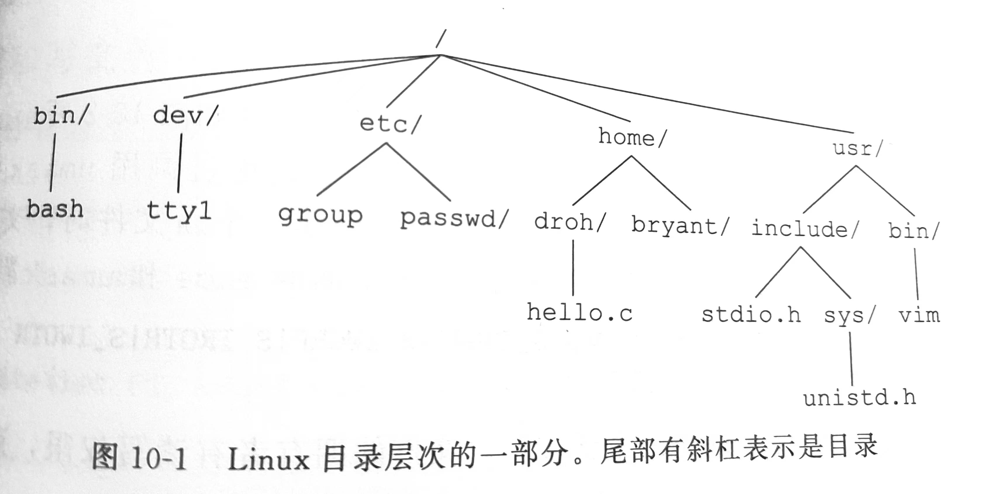
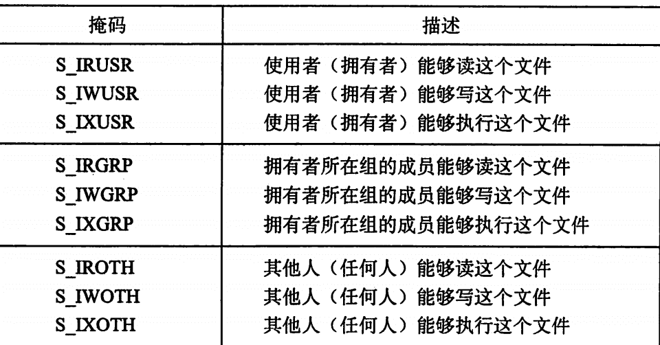
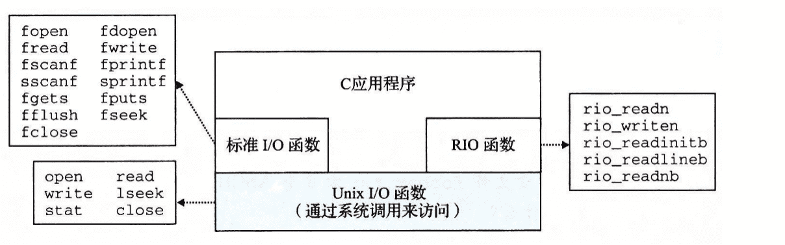

# [ICS](https://aki-yzh.github.io/2023/02/18/1-计算机系统漫游&目录)
---
## 十、系统级I/O

$\quad$ 输入/输出是在主存和外部设备之间复制数据的过程。

#### 10.1 Unix I/O

$\quad$ 一个Linux文件就是一个m个字节的序列：$ B_0,B_1......B_{m-1} $

$\quad$ 所有的I/O设备都被模型化为文件，所有的输入输出都被当作对相应文件的读和写来执行。

$\qquad$ 打开文件：创建描述符

$\qquad$ 每个进程开始时都有三个打开的文件：标准输入(0), 标准输出(1), 标准错误(2)

$\qquad$ 改变当前的文件位置：每个打开的文件内核保持一个文件位置k。

$\qquad$ 读写文件：读：从文件复制n个字节到内存，将文件位置从k增加到k+n，当文件位置超过文件大小触发EOF，文件结尾没有EOF符号，写类似。

$\qquad$ 关闭文件：当应用完成了对文件的访问之后，它就通知内核关闭这个文件

#### 10.2 文件

$\quad$ 每个Linux文件都有一个类型来表明它在系统中的角色。

$\qquad$ **普通文件**包括任意数据。区分文本文件和二进制文件

$\qquad$ **目录**是包含一组连接的文件。其中每个链接都将一个文件名映射到一个文件（mkdir创建，ls查看，rmdir删除）.是到目录自身的链接，..是到父目录的链接。

$\qquad$ **套接字**是用来与另一个进程进行跨网络通信的文件
Linux内核将所有文件都组合成一个目录层次结构，由名为/的根目录确定。系统中的每一个文件都是根目录的直接或间接后代。

$\qquad$ **其它类型**诸如命名通道，符号链接，字符，块设备。

$\quad$ 每一个进程都有一个当前工作目录，可以用cd命令修改

$\qquad$ 绝对路径名：以一个斜杠开始，表示从根节点开始的路径

$\qquad$ 相对路径名：以文件名开始，表示从当前工作目录开始的路径

#### 10.3 打开和关闭文件

$\quad$ 调用open函数来打开一个已经存在的文件或者创建一个新文件

~~~cpp
int open(char *filename,int flags,mode_t mode);//成功返回文件描述符，出错返回-1；
~~~

$\qquad$ flags:访问模式：O_RDONLY只读；O_WRONLY只写；ORDWR可读可写

$\qquad$ $\qquad$ 写｜接上掩码为写提供一些额外的指示：

$\qquad$ $\qquad$ $\qquad$ O_CREAT：如果文件不存在，创建截断的文件

$\qquad$ $\qquad$ $\qquad$ O_TRUNC：文件已经存在，截断它

$\qquad$ $\qquad$ $\qquad$ O_APPEND：设定文件位置在文件的结尾

$\qquad$ mode：访问权限

$\quad$ close函数用于关闭已经打开的文件

~~~cpp
int close(int fd);//成功返回0，出错-1
~~~

#### 10.4 读和写文件

$\quad$ 调用read和write函数来执行输入与输出

~~~cpp
ssize_t read(int fd,void *buf,size_t n);//成功返回读的字节数，EOF返回0，出错-1
ssize_t write(int fd,const void *buf,size_t n);//成功返回写的字节数，出错-1
~~~

$\quad$ 不足值：

$\qquad$ 读时遇到EOF

$\qquad$ 从终端读文本行：不足值等于文本行大小

$\qquad$ 读和写网络套接字：内部缓冲约束和网络延迟

#### 10.5 用RIO包健壮地读写

**无缓冲的输入输出函数**

$\quad$ 直接在内存和文件之间传送数据

~~~cpp
ssize_t rio_readn(int fd,void *usrbuf,size_t n);
ssize_t rio_writen(int fd,void *usrbuf,size_t n);//返回规则同上
~~~

**带缓冲的输入函数**

$\quad$ 带缓冲函数的调用不应和无缓冲的函数交叉使用

~~~cpp
rio_readlineb(rio_t *rp,int fd);
ssize_t rio_readlineb(rio_t *rp,void *usrbuf,size_t maxlen);
ssize_t rio_readnb(rio_t *rp,void *usrbuf,size_t n);
~~~

#### 10.6 读取文件元数据

$\quad$ 调用stat和fstat，检索文件元数据

~~~cpp
int stat(const char *filename,struct stat *buf);
int fstat(int fd,struct stat *buf);//成功返回0，出错-1
~~~

$\quad$ stat参数文件名，fstat参数描述符作为输入

填写stat数据结构
~~~cpp
struct stat
{
    dev_t          st_dev;/* Devive */
    ino_t          st_ino;/* inode */
    mode_t         st_mode;/* Protection and file type (S_ISREG(普通文件），S_ISDIR（目录文件），S_ISSOCK（网络套接字））*/
    nlink_t        st_nlink;/* number of hard links */
    uid_t          st_uid;/* User ID of owner */
    gid_t          st_gid;/* Group ID of owner */
    dev_t          st_rdev;/* Device type */
    off_t          st_size;/* Total size,in bytes */
    unsigned long  st_blksize;/* Block size for filesystem I/O */
    unsigned long  st_blocks;/* Number of blocks allocated */
    time_t         st_atime;/* Time of last access */
    time_t         st_mtime;/* Time of last modiffication */
    time_t         st_ctime;/* Time of last change */
}
~~~

#### 10.7 读取目录内容

$\quad$ 用readdir系列函数来读取目录内容

~~~cpp
DIR *opendir(const char *name);//成功返回处理指针，否则NULL
struct dirent *readdir(DIR *dirp);//返回指向下一个目录项的指针，否则NULL
int closedir(DIR *dirp);//成功0，错误-1
~~~

#### 10.8 共享文件

$\quad$ 内核用三个相关的数据结构来表示打开的文件

**描述符表** 

$\quad$ 每个进程都有独立的描述符表，每个打开的描述符表项指向文件表中的一个表项。

**文件表**

$\quad$ 所有进程共享

**v-node表**

$\quad$ 所有进程共享，包含stat信息

#### 10.9 I/O重定向

$\quad$ 使用dup2函数

~~~cpp
int dup2(int oldfd,int newfd);//成功返回非负描述符，错误返回-1
~~~

$\quad$ 复制oldfd并覆盖至newfd，若newfd已打开，则会先关闭newfd

#### 10.10 标准I/O

$\quad$ C语言库，

$\quad$ 流：指向FILE类型结构的指针

$\quad$ 标准输入(stdin), 标准输出(stdout), 标准错误(stderr)

$\quad$ 高级输入输出函数（fopen和fclose，fread和fwrite，fgets和fputs，scanf和printf）

$\quad$ 只要有可能就使用标准I/O

$\quad$ 不要用scanf或rio_readlineb来读二进制文件

$\quad$ 对网络套接字I/O使用RIO

---
### LAB:
**此章节后完成[shelllab(134.0/138.0)](https://github.com/Aki-yzh/PKU-ICS-2022/tree/main/LABS/6-shelllab)**
