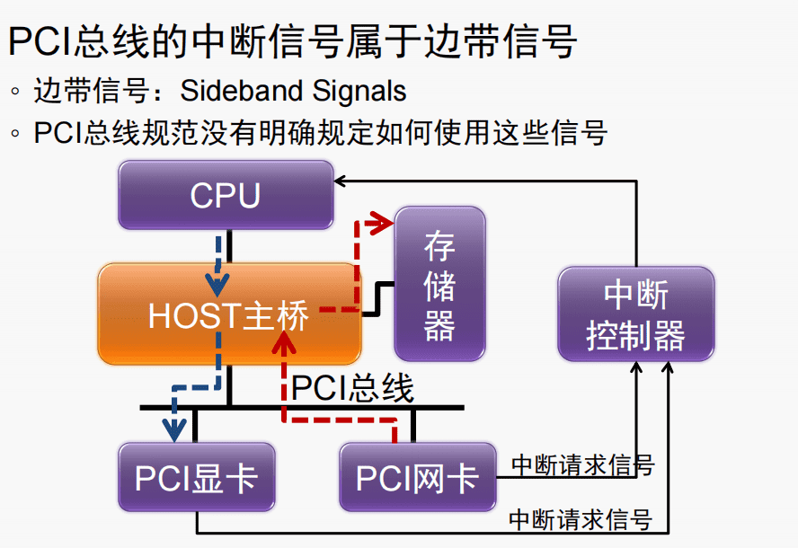
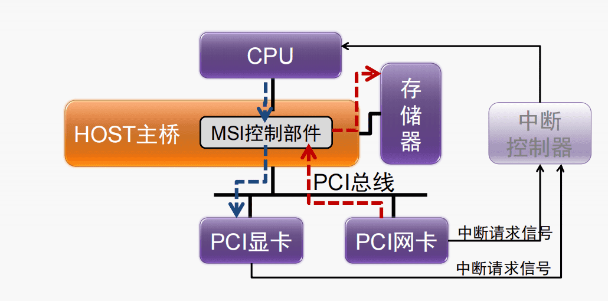

# 计算机组成与体系结构

---
## 计算机系统先进技术
### 片上互连结构
$\quad$ 未来单个芯片内将集成几百上千处理单元和存储单元
### 内存技术的发展
$\quad$ 更低电压，更低功耗
### 中断机制的发展
#### PCI

$\quad$ 当PCI设备使用DMA方式写存储器时。该设备在最后一个数据离开其发送FIFO时，会认为DMA写操作已经完成。此时这个设备将通过INTx信号通知处理器。但是当处理器收到中断信号时，并不意味着PCI设备已经将数据写入存储器中

##### 解决方案
###### 1. PCI设备保证在数据到达目的地之后，再提交中断请求
$\quad$ PCI设备无法单纯通过硬件逻辑判断数据什么时候写入到存储器，需要使用“读刷新”的方法。PCI设备在提交中断请求之前，向DMA写的数据区域发出一个读请求，当PCI设备完成这个总线传输后，再向处理器提交中断请求。

$\quad$ 该方法硬件开销大，不容易实现，还将增加中断请求的延时
######  中断服务程序使用“读刷新”方法
$\quad$ 中断服务程序在使用“PCI设备写入存储器”的这些数据之前，对该设备进行读操作。该方法利用PCI总线的传送序规则，从而保证数据写入存储器。

$\quad$ 绝大多数处理器系统采用该方法

$\quad$ **操作**：中断服务程序先读取PCI设备中断状态寄存器，判断中断产生原因后，才对PCI设备写入的数据进行操作

$\quad$ **作用**：一方面可以获得设备的中断状态，另一方面是保证DMA写的数据最终到达存储器。如果不这样做，就可能产生数据完整性问题

#### “异步”中断所带来的数据完整性问题

$\quad$ **现实情况：**

$\quad$ $\quad$ 在操作系统中，即便中断服务程序没有先读取PCI设备的寄存器，一般不会出现问题

$\quad$ **原因：**

$\quad$ $\quad$ 在操作系统中，一个PCI设备从提交中断到处理器开始执行设备的中断服务程序，所需时间较长，基本上可以保证此时数据已经写入存储器

$\quad$ **隐患：**

$\quad$ $\quad$ 虽然绝大多数时候不会出错，但是这个驱动程序依然有Bug存在，一旦出错则难以定位

#### MSI中断机制

$\quad$ Message Signaled Interrupt

$\quad$ 当设备向一个特殊地址写入时，会向CPU产生一个中断，即MSI中断

$\quad$ PCI 2.2中定义了MSI，PCI 3.0中引入MSI-X

##### 优点：

$\quad$ 1. 解决了多个设备共享中中断信号的问题

$\quad$ 2. 解决了每个功能设备只能支持一个中断的问题

$\quad$ 3. “异步”中断的数据完整性问题
##### 缺点：要占用总线带宽

### 芯片封装技术

$\quad$ ·引线键合（Wire-bonding）

$\quad$ ·倒装片（Flip-chip）

$\quad$ ·双列直插式封装DIP(Dual Inline-pin Package)

$\quad$ ·薄型小尺寸封装TSOP(Thin Small Outline Package)

$\quad$ ·四侧引脚扁平封装QFP(Quad Flat Package)

$\quad$ ·引脚网格阵列PGA(Pin Grid Array)

$\quad$ ·球栅阵列BGA(Ball Grid Array)

---
