# [ICS](https://aki-yzh.github.io/2023/02/18/1-计算机系统漫游&目录)
---
## 十一、网络编程

#### 11.1 客户端-服务器编程模型

 $\quad$ 每个网络应用都是基于客户端-服务器编程模型的。采用这个模型，一个应用是由一个服务器进程和一个或者多个客户端进程组成。服务器管理某种资源，并且通过操作这种资源来为他的客户端提供某种服务。（**客户端和服务器都是进程**）
 
 $\quad$ 客户端-服务器变成模型的基本操作是事务：
 
  $\qquad$ 1) 当一个客户端需要服务时，向服务器发送一个请求
 
  $\qquad$ 2) 服务器收到请求，进行解释并以适当方式操作它的资源
 
  $\qquad$ 3) 服务器给客户端发送一个响应，并等待下一个请求
 
  $\qquad$ 4) 客户端收到响应并处理它
 
  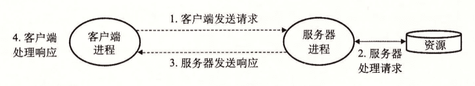

#### 11.2 网络

$\quad$ 对于主机而言，网络只是又一种I/O设备，是数据源和数据的接收方。

$\quad$ 物理上来说，网络是一个按照地理位置远近组织的层次系统

$\quad$ 最底层是LAN（局域网），最流行的局域网技术是以太网（Ethernet）

$\quad$ 一个以太网段包括一些电缆和一个集线器。以太网段中每台主机都能看到每个位。

$\qquad$ 每个以太网适配器都有一个全球唯一的48位地址。一台主机可以发送一段位（称为帧）到这个网段内的任何其他主机。每个帧包括一些固定数量的头部位，用来标识此帧的源和目的地址以及此帧的长度，此后紧随的就是数据位的有效载荷。每个主机适配器都能看到这个帧，但只有目的主机实际读取它。

$\quad$ 使用电缆和网桥，多个以太网段可以连接成较大的局域网，称为桥接以太网。

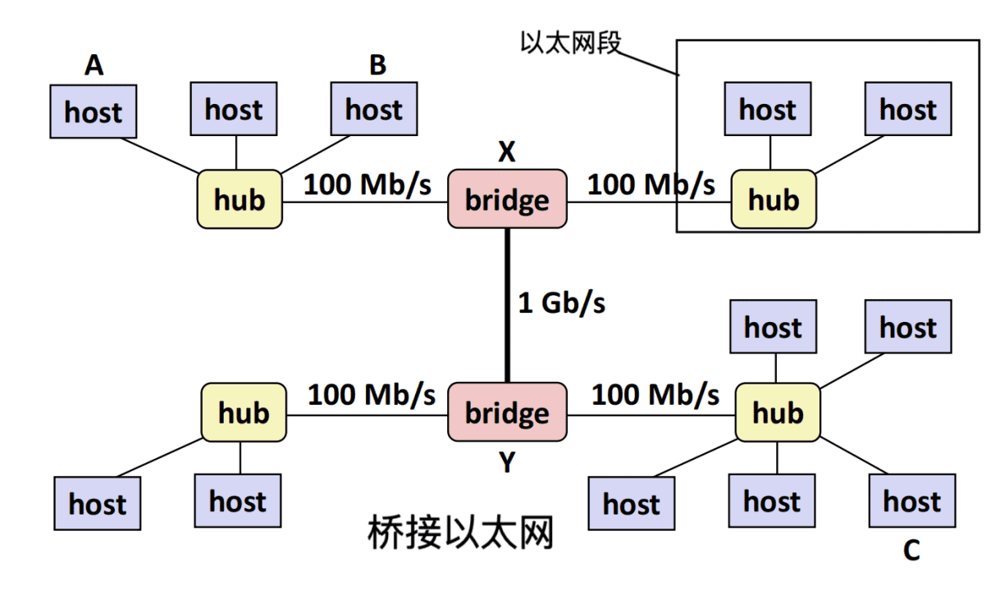

$\quad$ 多个不兼容的局域网通过路由器连接，组成一个互联网络（internet）

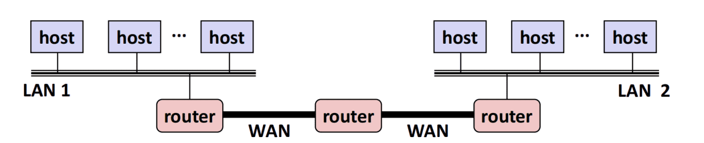

$\quad$ 路由器间点到点高速连接称为广域网（WAN）

$\quad$ 互联网协议用于消除不同局域网和广域网之间的差异，控制主机和路由器协同工作实现数据传输。

$\quad$ 具有两种基本能力：

$\qquad$ 命名机制：唯一标识主机

$\qquad$ 传送机制：把数据位捆扎成不连续的片（称为包（包头包含包的大小与源主机目的主机的地址））的同一方式。

$\quad$ 数据传输的8个基本步骤：

$\qquad$ 1)  客户端从虚拟地址空间复制数据到内核缓冲区

$\qquad$ 2) 主机A协议软件在数据前附加包头和帧头创建帧

$\qquad$ 3) LAN1适配器将帧复制到网络上

$\qquad$ 4) 路由器读取帧并传送到协议软件

$\qquad$ 5) 路由器从包头提取目的互联网地址，脱落旧帧头，加上新帧头，将帧传送到适配器

$\qquad$ 6) LAN2适配器将帧复制到网络上

$\qquad$ 7) 主机B的适配器读取此帧并把它传送到协议软件

$\qquad$ 8) 主机B读取帧，剥落包头和帧头

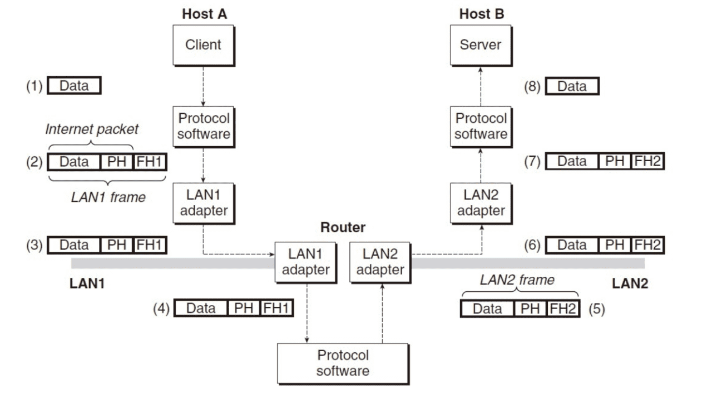

#### 11.3 全球IP因特网

$\quad$ 因特网应用程序的基本硬件与软件结构：

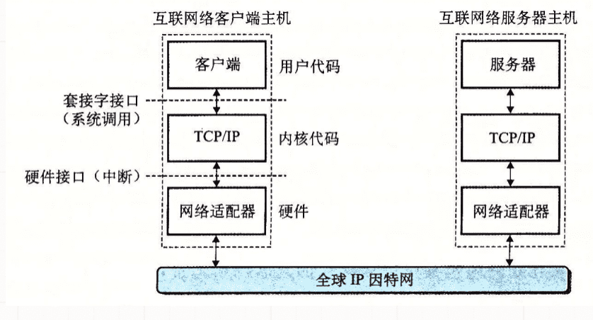

$\quad$ TCP/IP协议（传输控制协议/互联网络协议）：

   $\quad$ 几乎每个现代计算机系统都支持

   $\quad$ 实际上是个协议族：

$\qquad$ $\quad$ IP：基本命名方法和递送机制

$\qquad$ $\qquad$ IP机制是不可靠的，不会试图恢复丢失的数据报

$\qquad$ $\quad$ UDP：扩展IP协议（进程间传送）

$\qquad$ $\quad$ TCP：可靠的全双工连接

$\quad$ 从程序员角度看因特网：

$\qquad$ 主机集合，32位IP地址

$\qquad$ P地址映射为标识符（因特网域名）

$\qquad$ 因特网主机上的进程能通过连接和任何其他因特网主机上的进程通信

###### IP地址：

 $\quad$ 一个IP地址就是个32位无符号整数，因特网客户端和服务器相互通信时使用的就是IP地址。

~~~cpp
/* IP address structure */
struct in_addr{
    uint32_t s_addr;/* Address in network byte order(big - endian)*/
};//in后缀表示internet
~~~

$\quad$ 网络字节顺序：大端字节顺序->主机字节顺序可能和网络字节顺序不一样

$\quad$ 通过如下函数实现网络与主机字节顺序转换

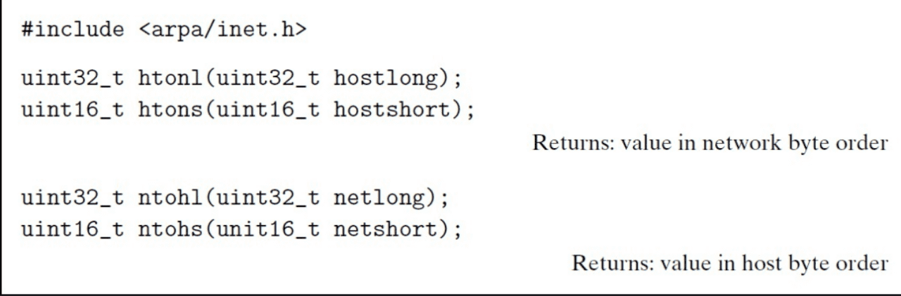

$\quad$ 表示：点分十进制（每个字节用它的十进制表示）

$\quad$ 如 128.2.194.242就是地址0x8002c2f2的点分十进制表示。

$\quad$ 通过如下函数进行转换

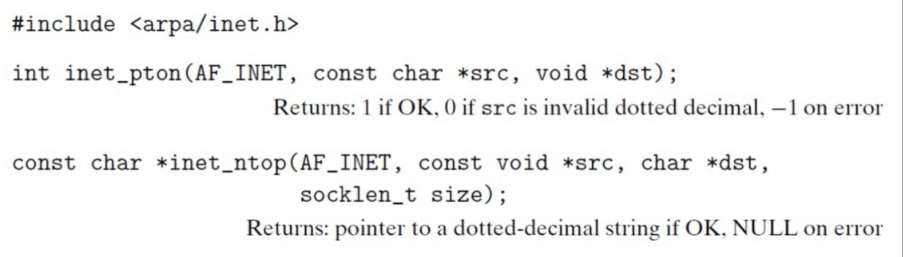

###### 因特网域名：

$\quad$ 用句点风格的单词，域名集合形成了一个层次结构，每个域名编码了它在这个层次结构中的位置。

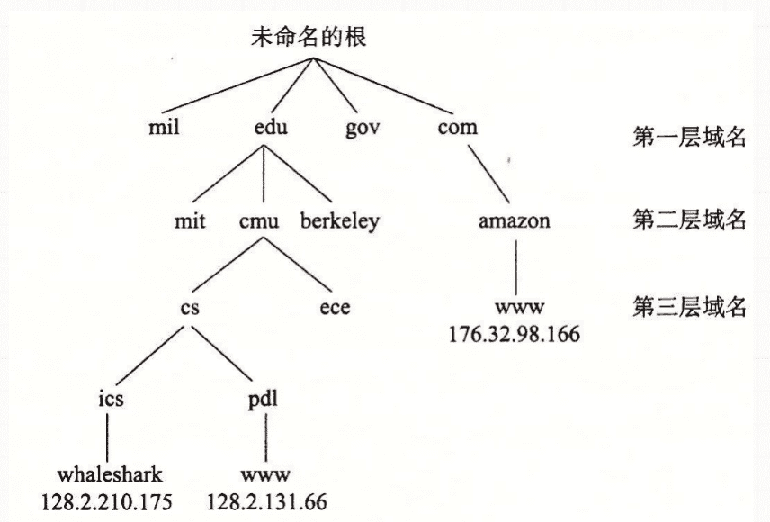

$\quad$ 域名系统DNS

$\quad$ 从概念上讲，程序员可以把DNS数据库视为数百万条主机条目的集合

$\quad$ 每个主机条目定义了域名和IP地址之间的映射

$\quad$ 在数字意义上，主机条目是域名和IP地址的等价类

###### 因特网连接：

$\quad$ 点对点的：连接一对进程

$\quad$ 全双工的：数据可以同时双向流动

$\quad$ 可靠的：由源进程发出的字节流最后被目的进程以它发出的顺序收到它

$\quad$ 套接字：一个套接字是连接的一个端点，每个套接字都有相应的套接字地址

$\quad$ 套接字由一个因特网地址和一个16位的整数端口组成

$\quad$ 客户端套接字地址中的端口由内核自动分配，称为临时端口

$\quad$ 服务器套接字地址端口通常是某个知名端口

$\qquad$ echo servers: echo 7

$\qquad$  ftp servers: ftp 21

$\qquad$ ssh servers: ssh 22

$\qquad$  email servers: smtp 25

$\qquad$ Web servers: http 80

$\quad$ 套接字对唯一确定一个连接

$\quad$(cliaddr:cliport, servaddr:servport) 

$\qquad$ cliaddr:客户端IP地址，cliport：客户端端口，servaddr：服务器Ip地址，servport： 服务器端口

#### 11.4 套接字接口

$\quad$ 套接字接口是与UnixI/O结合使用的一组系统级函数，用于构建网络应用程序，适用于所有现代系统

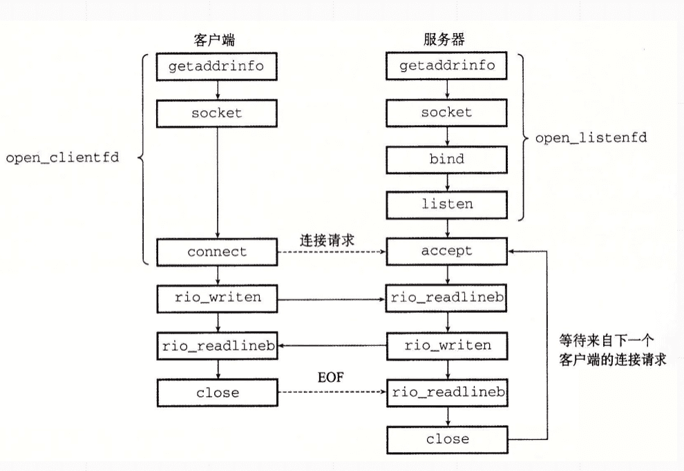

$\quad$ 对于内核来说，套接字是与应用程序通信的端点。

$\quad$ 对应用来说，套接字是一个文件描述符，允许应用程序从网络读取或写入数据

套接字地址结构：

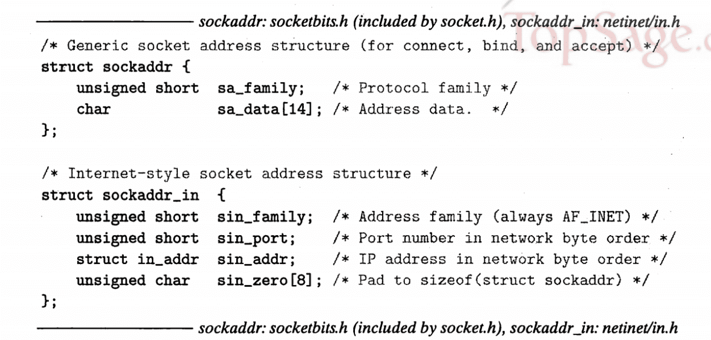

**socket函数**：创建一个套接字描述符

~~~cpp
#include<sys/types.h>
#include<sys/socket.h>
int socket(int domain, int type,int protocol);//若成功则返回非负描述符，否则返回-1；
~~~

$\quad$ 使套接字称为连接的一个端点

$\quad$ clientfd = Socket(AF_INET,SOCK_STREAM,0);

$\quad$ 其中AF_INET表示我们正在使用32位IP地址，SOCK_STREAM表示这个套接字是连接的一个端点。

**connect函数**：建立和服务器的连接

~~~cpp
#include<sys/socket.h>
int connect(int clientfd,const struct sockaddr* addr,socklen_t addrlen);//成功返回0，否则-1
~~~

**bind函数**：服务器套接字地址和套接字描述符结合

~~~cpp
#include<sys/socket.h>
int bind(int sockfd, const struct sockaddr* addr, socklen_t addrlen);//成功返回0，否则-1
~~~

**listen函数**： socket主动套接字->监听套接字

~~~cpp
#include<sys/socket.h>
int listen(int sockfd,int backlog);//成功返回0，否则-1
~~~

**accept函数**：等待客户端连接请求

~~~cpp
#include<sys/socket.h>
int accept(int listenfd,struct sockaddr* addr,int *addrlen)//成功返回0，否则-1
~~~

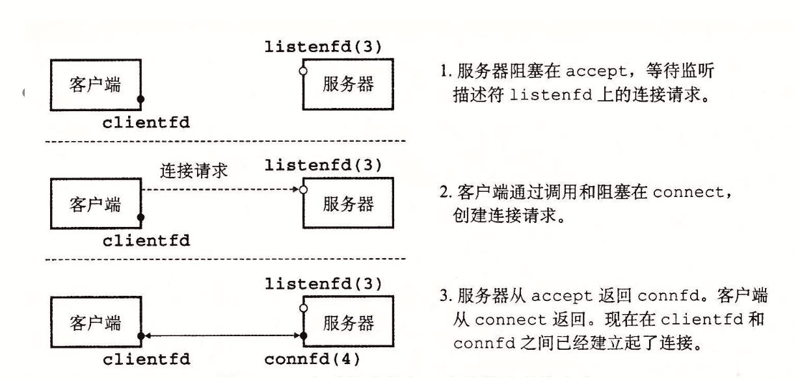

**主机与服务器之间的转换**

  getaddrinfo:将主机名，主机地址，服务名和端口号的字符串表示转化成套接字地址结构

$\qquad$ 可重入的、与协议无关的

~~~cpp
#include<sys/types.h>
#include<sys/socket.h>
#include<netdb.h>
int getaddrinfo(const char *host,const char *service,cosnt struct addrinfo* hints,struct addrinfo **result);//成功返回0，否则返回非0的错误代码
void freeaddrinfo(struct addrinfo *result);
const char *gai_strerror(int errcode);//返回错误消息
~~~

$\quad$ result指向一个addrinfo结构的链表，其中每个结构指向一个对应于host和service的套接字地址结构，host可以是域名，也可以是数字地址，service参数可以是服务名，也可以是十进制端口号。hints是个addrinfo结构，提供对getaddrinfo返回的套接字地址列表更好的控制。
如果不想把主机名转换成地址，可以把host设置为NULL，对于service来说也是一样，但是必须制定两者中其中一个。

~~~cpp
struct addrinfo
{
    int   ai_flags;//AI_ADDRCONFIG->使用连接推荐使用，返回地址与主机设置一致；AI_CANONNAME->ai_canonname指向host的官方名；AI_NUMERICSERV->强制service为端口号；
    int   ai_family;//AF_INET->IPv4,AF_INET6->IPv6
    int   ai_socktype;
    int   ai_protocol;
    char  *ai_canonname;
    size_t ai_addrlen;
    struct sockaddr *addr;
    struct addrinfo *ai_next;
}//如果要传递hints参数，只能设置flag，family，socktype和protocol，其他必须设0；
~~~

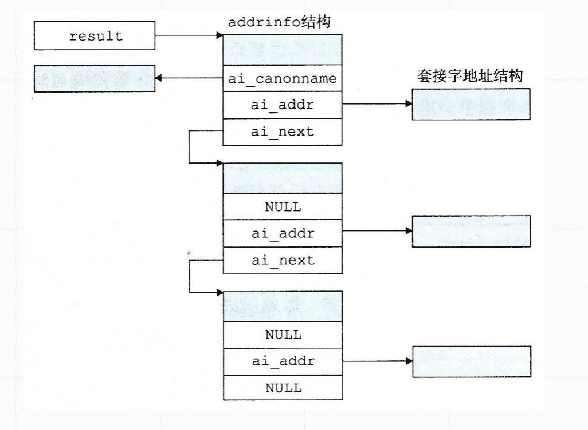

 $\quad$ 客户端(服务器)调用getaddrinfo后会遍历result指向的列表，依次尝试每个套接字地址直到socket和connect(bind)成功

 $\quad$ getnameinfo: 将套接字地址结构转换成主机和服务名字符串

$\qquad$ $\quad$ 可重入的、与协议无关的

~~~cpp
#include<sys/socket.h>
#include<netdb.h>
int getnameinfo(const struct sockaddr *sa ,socklen_t salen,char *host,size_t hostlen,char *service, size_t servlen,int flags);//成功返回0，错误返回非0的错误代码
~~~

$\quad$ sa指向大小为salen的套接字地址结构，host指向大小为hostlen字节的缓冲区，service指向大小为servlen字节的缓冲区，getnameinfo将套接字地址结构转换成对应的主机和服务名字符串，并把它们复制到host和service缓冲区。flags是一个位掩码，修改默认行为(NI_NUMERICHOST->使函数返回数字地址字符串；NI_NUMERICSERV->函数跳过查找简单返回端口号)

$\quad$ 如果不想要主机名，可以把host设定为NULL，hostlen设置为0，对服务字段也是一样，不过两者只能设置其中之一。

**套接字接口的辅助函数**

$\quad$ open_clientfd:建立与服务器之间的连接

~~~cpp
#include<csapp.h>
int openclientfd(char *hostname,char *port);//成功返回描述符，出错返回-1；
~~~

$\quad$ open_listenfd:服务器创建监听描述符，准备接收连接请求,是可重入，与协议无关的

~~~cpp
int open_listenfd(char *port)
{
    struct addrinfo hints,*listp,*p;
    int listenfd,optval=1;
    /* get a list of potential server addresses */
    memset (&hints,0,sizeof(struct addrinfo));
    hints.ai_socktype = SOCK_STREAM;/* accept connections */
    hints.ai_flags = AI_PASSIVE | AI_ADDRCONFIG;/* on any IP address */
    hints.ai_flags = AI_NUMERICSERV;/* usng port number */
    Getaddrinfo(NULL,port,&hints,&listp);

    /* walk the list for one that we can bind to */
    for(p = listp;p;p=p->ai_next)
    {
        /* creat a socket descriptor */
        if((listenfd = socket(p->ai_family,p -> ai_socketype,p->ai_protocol))<0)
            continue;/* socket failed ,try the next */

        /* eliminates "address already in use" error from bind */
        Setsockopt(listenfd,SOL_SOCKET,SO_REUSEADDR,(const void *)&optval,sizeof(hint));

        /* bind the descriptor to the address */
        if(bind(listenfd,p->ai_addr,p->ai_addrlen)==0)
            break;/* success */
        Close(listenfd);/* bind failed, try the next */
    }
    /* clean up */
    Freeaddrinfo(listp);
    if(!p)/* no address worked */
        return -1;
    /* make it a listening socket ready to accept connection requests */
    if(listen(listenfd, LISTENQ)<0)
    {
        Close(listenfd);
        return -1;
    }
    return listenfd;
}
~~~

#### 11.5 Web服务器
$\quad$ 迭代服务器：一次一个地在客户端间迭代

$\quad$ 并发服务器：能同时处理多个客户端

**Web基础**

$\quad$ Web客户端和服务器之间的交互用的是一个基于文本的应用级协议，叫做HTTP协议。

$\quad$ HTTP是一个简单的协议。一个Web客户端打开一个到服务器的因特网连接，并且请求某些内容，服务器响应所请求的内容，然后关闭连接，浏览器读取这些内容并把它显示在屏幕上。

$\quad$ Web内容采用html语言编写，一个HTML程序包括指令，它们告诉浏览器如何显示这页中的各种文本和图形对象

**Web内容**

$\quad$ 内容是与一个MIME类型相关的字节序列。

|  MIME类型| 描述 |
|  ----  | ----  |
| text/html  | html界面 |
| text/plain  | 无格式文本 |
|  application/postscript | postscript 文档|
| image/gif | GIF格式编码的二进制图像 |
| image/png | PNG格式编码的二进制图像 |
|image/jepg | JEPG格式编码的二进制图像 |

$\quad$ Web服务器用两种不同的方式向客户端提供内容：

$\quad$ ·- 取一个磁盘文件，并将它的内容返回给客户端，磁盘文件称为静态内容，此过程称为服务静态内容

$\quad$ ·- 运行一个可执行文件，并把它的输出返回到客户端，运行可执行文件时的输出称为动态内容，此过程称为服务动态内容。

$\quad$ URL唯一标识服务器管理的文件

$\qquad$ 最小的URL后缀:“/”所有服务器将其扩展为默认的主页 

**HTTP事务**

$\quad$ 1.HTTP请求：请求行+多个请求报头+一个空文本行（终止）

$\qquad$ GET方法：服务器生成和返回URI（文件名+可选参数

$\quad$ $\quad$ 请求行： method URI version（method 方法，一般用GET，URI：URL后缀，包括文件名和可选参数；version：HTTP版本）

$\quad$ $\quad$ 请求报头：header-name：header-data

$\quad$ 2.HTTP响应：响应行+多个响应报头+终止空行+响应主体

$\quad$ $\quad$ 响应行： version status-code status- message（version：http版本；status-code状态码）

|  状态码| 状态消息 | 描述 |
|  ----  | ----| ---  |
| 200 | 成功  | 处理请求无误 |
| 301 | 永久移动 | 内容已移动到location头中指明的主机上 |
| 400 | 错误请求 | 服务器不能理解请求|
| 403 | 禁止 | 服务器无权访问所请求的文本 |
| 404 | 未发现 | 服务器不能找到所请求的文件|
| 501 | 未实现 | 服务器不支持请求的方法 |
| 505 | HTTP版本不支持 | 服务器不支持请求的版本 |

**服务动态内容**

$\quad$ CGI（通用网关接口）

$\quad$（参数）客户端->服务器（URI）：

$\quad$ 用 ？分隔文件名和参数，&分隔各个参数，空格写作%20

$\quad$（参数）服务器->子进程：设置环境变量

$\quad$ 子进程输出直接重定向至和客户端相关联的已连接描述符

#### 11.6 TINY Web服务器

$\quad$ main：打开监听套接字，无限循环，接受请求，执行事务，并关闭连接的它的那一端

$\quad$ doit：处理一个HTTP事务

$\quad$ clienterror：检查明显错误并报告给客户端

$\quad$ read_requesthdrs：读取并忽略报头

$\quad$ parse_uri：解析URI为一个文件名和一个可选的CGI字符串

$\quad$ serve_static：提供静态内容

$\quad$ serve_dynamic：提供动态内容

$\quad$ 详见[proxylab](https://github.com/Aki-yzh/PKU-ICS-2022/tree/main/LABS/8-proxylab)

  
---
