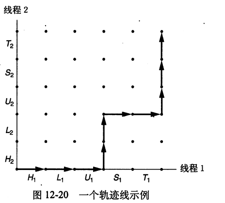
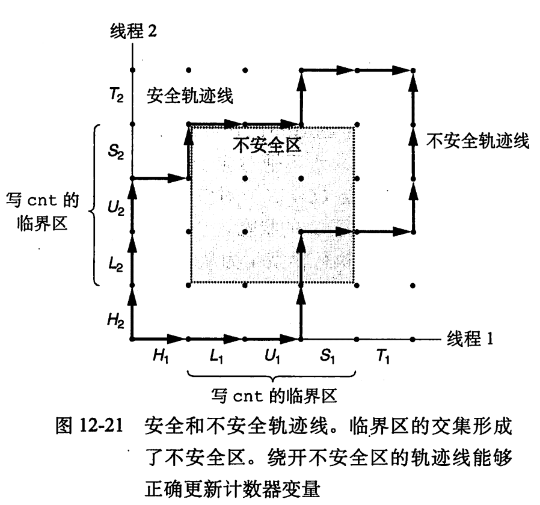
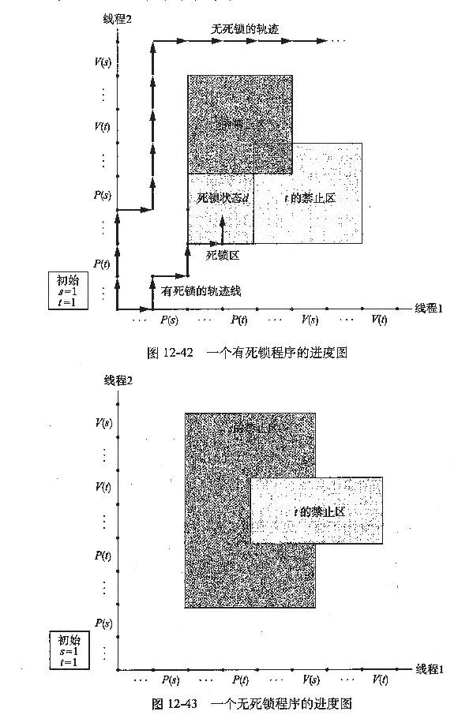

# [ICS](https://aki-yzh.github.io/2023/02/18/1-计算机系统漫游&目录)
---
## 十二、并发编程

$\quad$ 使用应用级并发的应用程序称为并发程序，现代操作系统提供三种基本的构造并发程序的方法：

$\qquad$ 1. 进程

$\qquad$ 2.I/O多路复用

$\qquad$ 3.线程

#### 12.1 基于进程的并发编程

$\quad$ 在父进程中接受客户端连接请求，然后创建一个新的子进程来为每个新客户端提供服务。
服务器接收客户端的连接请求后，服务器`fork`出一个子进程->子进程关闭`listenfd`，父进程关闭`connfd`，避免内存泄漏->子进程执行完后自动关闭连接，父进程继续监听

$\quad$ 优点：简单，地址空间独立，共享状态信息

$\quad$ 缺点：难共享信息，进程间通信开销高

**基于进程的并发echo服务器**：
~~~cpp
#include"csapp.h"
void echo(int connfd);
void sigchld_handler(int sig)
{
    while(waitpid(-1,0,WNOHANG)>0)
        ;
    return;
}
int main(int argc,char **argv)
{
    int listenfd,connfd;
    socklen_t clientlen;
    struct sockaddr_storage clientaddr;
    if(argc != 2)
    {
        fprintf(stderr,"usage: %s <port>\n",argv[0]);
        exit(0);
    }
    Signal(SIGCHLD,sigchld_handler);
    listenfd = Open_listenfd(argv[1]);
    while(1)
    {
        clientfdlen = sizeof(struct sockaddr_storage);
        connfd = Accept(listenfd,(SA *) &clientaddr,&clientlen);
        if(Fork() == 0)
        {
            Closr(listenfd);
            echo(connfd);
            Close(connfd);
            exit(0);
        }
        Close(connfd);
    }
}
~~~

#### 12.2 基于I/O多路复用的并发编程
  I/O 多路复用的思想：同时监测若干个文件描述符是否可以执行IO操作的能力

当描述符准备好可读时再去读，读的时候再判断是从哪个描述符读的

  `select`确定要等待的描述符：_读集合_
 
 状态机：等待描述符准备好、描述符准备好可以读、从描述符读一个文本行
 
$\quad$ 优点：一个逻辑控制流，一个地址空间，没有进程/线程管理

$\quad$ 缺点：编码复杂，只能在一个核上跑

**基于I/O多路复用的迭代echo服务器**

~~~cpp
#include"csapp.h"
void echo (int connfd);
void command(void);

int main(int argc,char **argv)
{
    int listenfd,connfd;
    socklen_t clientlen;
    struct sockaddr_storage clientaddr;
    fd_set read_set,ready_set;
    if(argc!=2)
    {
        fprintf(stderr,"usage: %s <port>\n",argv[0]);
        exit(0);
    }
    listenfd = Open_listenfd(argc[1]);
    FD_ZERO(read_set);/* clear read set */
    FD_SET(STDIN_FILENO,&read_set);/* add stdin to read set */
    FD_SET(listenfd,&read_set);/* add listenfd to read set */
    while(1)
    {
        ready_set=read set;
        Select(listenfd+1,&ready_set,NULL,NULL,NULL);
        if(FD_ISSET(STDIN_FILENO,&ready_set))
            command();/* Read command line from stdin */
        if(FD_ISSET(listenfd,&ready_set))
        {
            clientlen = sizeof(struct sockaddr_storage);
            connfd = Accept(listenfd,(SA*) &clientaddr,&clientlen);
            echo(connfd);/* echo client input until EOF */
            Close(connfd);
        }
    }
}

void command(void)
{
    char buf[MAXLINE];
    if(!Fgets(buf,MAXLINE,stdin))
        exit(0);
    printf("%s",buf);/* process to the input command */
}
~~~

**基于I/O多路复用的并发echo服务器**

~~~cpp
#inlcude"csapp.h"
typedef struct /* represents a pool of connected descriptors */
{
    int maxfd;/* largest descriptor in read_set */
    fd_set read_set;/* set of all active descriptors */
    fd_set ready_set;/* Subset of descriptors ready for reading */
    int nready;/* Number of ready descriptors from select */
    int maxi;/* High water index into client array */
    int clientfd[FD_SETSIZE];/* Set of active descriptors */
    rio_t clientrio[FD_SETSIZE];/* Set of active read buffers */
} pool ;
int byte_cnt =0;/* Counts total bytes received by server */
int main(int argc ,char ** argv)
{
    int listenfd,connfd;
    socklen_t clientlen;
    struct sockaddr_storage clientaddr;
    static pool pool;
    if(argc!=2)
    {
        fprinf(stderr,"usage: %s <port>\n",argv[0]);
        exit(0);
    }
    listenfd=Open_listenfd(argv[1]);
    init_pool(listenfd,&pool);
    while(1)
    {
        /* wait for listening/connected descriptors to be ready */
        pool.ready_set=pool.read_set;
        pool.nready=Select(pool.maxfd+1,&pool.readyset,NULL,NULL,NULL);
        /* if listening descriptor ready , add new client to pool */
        if(FD_ISSET(listenfd,&pool.ready_set))
        {
            clientlen=sizeof(struct sockaddr_storage);
            connfd=Accept(listenfd,(SA*)&clientaddr,&clientlen);
            add_client(connfd,&pool);
        }
        /* echo a text line from each ready connected descriptor */
        check_clients(&pool);
    }
}
void init_pool(int listenfd,pool *p)//初始化客户端池
{
    /* initially ,there are no connected descriptors */
    int i;
    p->maxi =-1;
    for(i=0 ;i<FD_SETSIZE;i++)
        p->clientfd[i]=-1;
    /* initially ,listenfd is only member of select read set */
    p->maxfd = listenfd;
    FD_ZERO(&p->read_set);
    FD_SET(listenfd,&p->read_set);
}
void add_client(int connfd,pool *p)//向池中添加一个新的客户端连接
{
    int i;
    p->nready--;
    for(i=0;i<FD_SETSIZE,i++)/* find an available slot */
        if(p->clientfd[i]<0)
        {
            /* Add connected descriptor to the pool */
            p->clientfd[i]=connfd;
            Rio_readinitb(&p->clientrio[i],connfd);
            /* add the descriptor to descriptor set */
            FD_SET(connfd,&p->read_set);
            /* update max descriptor and pool high water mark */
            if(connfd>p->maxfd)
                p->maxfd=connfd;
            if(i>p->maxi)
                p->maxi=i;
            break;
        }
    if(i==FD_SETSIZE)/* couldn't find an empty slot */
        app_error("add_client error: too mant clients");
}
void check_clients(pool *p)//服务准备好的客户端链接
{
    int i,connfd,n;
    char buf[MAXLINE];
    rio_t rio;
    for(i=0;(i<=p->maxi)&&(p->nready>0);i++)
    {
        connfd = p->clientfd[i];
        rio=p->clientrio[i];
        /* if the descriptor is ready ,echo a text line from it */
        if((connfd>0)&&(FD_ISSET(connfd,&p->ready_set)))
        {
            p->nready--;
            if((n=Rio_readlineb(&rio,buf,MAXLINE))!=0)
            {
                byte_cnt+=n;
                printf("Server received %d (%d total) bytes on fd %d\n",n,byte_cnt,connfd);
                Rio_writen(connfd,buf,n);
            }
            /* EOF decteced ,remove descriptor from pool */
            else
            {
                Close(connfd);
                FD_CLR(connfd,&p->read_set);
                p->clientfd[i]=-1;
            }
        }
    }
}
~~~

#### 12.3 基于线程的并发编程

线程：进程上下文中的逻辑流

$\quad$ 共享代码、数据、堆、共享库和打开的文件

$\quad$ 私有的线程ID、栈、栈指针、寄存器

$\quad$ 和一个进程相关的线程组成一个对等线程池

$\quad$ 上下文切换、创建和终止比进程快

每个进程开始生命周期时都是单一线程，这个线程称为主线程，在某一时刻，主线程创建一个对等线程，从这个时间点开始，两个线程并发运行。

**Posix**线程：
~~~cpp
typedef void *func(void *)
/* 创建其他线程 */
int pthread_create(pthread_t *tid, pthread_attr_t *attr, func *f, void *arg);//成功返回0，出错非0
/* 返回调用者的线程id */
pthread_t pthread_self(void);
/* 终止线程 */
void pthread_exit(void *thread_return);//从不返回
int pthread_cancel(pthread_t tid);//成功返回0，出错非0
/* 等待其他线程终止 */
int pthread_join(pthread_t tid, void **thread_return);//成功返回0，出错非0
/* 分离线程 */
int pthread_detach(pthread_t tid);//成功返回0，出错非0
/* 初始化线程 */
int pthread_once(pthread_once_t *once_control, void (*init_routine)(void));//总是返回0
~~~
**基于线程的并发echo服务器**:
~~~cpp
#include"csapp.h"
void echo(int connfd);
void *thread(void vargp);
int main(int argc,char **argv)
{
    int listenfd,*connfdp;
    socklen_t clientlen;
    struct sockaddr_storage clientaddr;
    pthread_t tid;
    if(argc != 2)
    {
        fprintf(stderr,"usage: %s <port>\n",argv[0]);
        exit(0);
    }
    listenfd = Open_listenfd(argc[1]);
    while(1)
    {
        clientlen = sizeof(struct sockaddr_storage);
        connfdp = Malloc(sizeof(int));
        *connfdp = Accept(listenfd ,(SA *) &clientaddr,&clientlen);
        Pthread_creat(&tid,NULL,thread,connfdp);
    }
}
/* Thread routine */
void *thread(void *vargp)
{
    int connfd = *((int *)vargp);
    Pthread_detach(pthread_self());
    Free(vargp);
    echo(connfd);
    Close(connfd);
    return NULL;
}

~~~

#### 12.4 多线程程序中的共享变量

多线程的C程序中变量根据他们的存储类型倍映射到虚拟内存：

$\quad$ **全局变量**：虚拟内存的读 / 写区域只包含每个全局变量的一个实例

$\quad$ **本地自动变量**：定义在函数内部但不`static`，每个线程的栈都包含它自己的所有本地自动变量的实例

$\quad$ **本地静态变量**：只有一个实例，每个对等线程都读 / 写这个实例

**共享变量**

变量是共享的 ⇔ 它的一个实例被一个以上的线程引用

本地自动变量也能被共享

#### 12.5 用信号量同步线程

**进程图**

$\quad$ 将n个并发线程的执行模型化为一条n维笛卡尔空间中的轨迹线，每条轴k对应于线程k的进度。

$\qquad$ 对$H_1,L_1,U_1,H_2,L_2,S_1,T_1,U_2,S_2,T_2$ 的轨迹线：

**信号量**

$\quad$ 具有非负整数值的全局变量`s`，两种操作：

$\quad$ `P(s)`：如果`s`非零，则将`s`减1，返回；`s`为0，就挂起线程，直到`s`变为非0，`V`会重启这个线程，重启后`P`将`s`减1，返回

$\quad$ `V(s)`：将`s`加1，如果有线程阻塞在`P`且等着`s`变为非零，则`V`会重启这些线程中的一个

$\quad$ 同一时间，只有一个`P`或一个`V`能改变`s`变量；

$\quad$ 多个线程在等待同一个信号量时，无法预测`V`要重启哪个线程

$\quad$ 信号量不变性_：信号量不会为负

P和V的包装函数：
~~~cpp
void P(sem_t *s);/* Wrapper function for sem_wait */
void V(sem_t *s);/* Wrapper function for sem_post */
~~~

**调度共享资源**

1. **生产者 - 消费者问题**

$\quad$ 生产者和消费者线程共享一个有`n`个槽的有限缓冲区，生产者反复生成新的项目并加入缓冲区中，消费者不断从缓冲区中取出这些项目，然后处理

$\quad$ 插入和去除项目都涉及更新共享变量，所以必须保证对缓冲区的访问是互斥的，同时要调度对缓冲区的访问：

$\quad$ 如果缓冲区是满的，生产者必须等待，直到有槽位可用

$\quad$ 如果缓冲区是空的。消费者必须等待，直到有槽位不为空

~~~cpp
#include"csapp.h"
#include"sbuf.h"
typedef struct {
    int *buf;/* Buffer array */
    int n;/* Maxium number of slots */
    int front;/* buf[(front+1)%n] is first item */
    int rear;/* buf[rear%n] is last item */
    sem_t mutex;/* Protect accesses to buf */
    sem_t slots;/* Counts available slots */
    sem_t items;/* Counts available items */
} sbuf_t;

/* Creat an empty bounded shared FIFO buffer with n slots */
void sbuf_init(sbuf_t *sp, int n)
{
    sp->buf = Calloc(n, sizeof(int));
    sp->n = n;/* buffer holds max of n items */
    sp->front=sp->rear=0;/* Empty buffer iff front=rear */
    Sem_init(&sp->mutex, 0, 1); /*Binary semaphore for locking */
    Sem_init(&sp->slots, 0, n); /* initially buf has n empty slots */
    Sem_init(&sp->items, 0, 0); /* initially, buf has zeor dara items */
}
/* clean up buffer sp */
void sbuf_deinit(sbuf_t *sp)
{
    Free(sp->buf);
}
/* insert item onto the rear of shared buffer sp */
void sbuf_insert(sbuf_t *sp, int item)
{
    P(&sp->slots); /* wait for available slots */
    P(&sp->mutex); /* lock the buffer */
    sp->buf[(++sp->rear)%(sp->n)]=item ;/* insert the item */
    V(&sp->mutex); /* Unlock the buffer */
    V(&sp->items); /* Announce available item */
}
/* Remove and return the first item from buffer sp */
int sbuf_remove(sbuf_t *sp)
{
    int item;
    P(&sp->items);/* wait for available item */
    P(&sp->mutex);/* lock the buffer */
    item = sp->buf[(++sp->front)%(sp->n)];/* remove the item */
    V(&sp->mutex);/* Unlock the buffer */
    V(&sp->slots);/* Announce available item */
    return item;
}
~~~
2. **读者-写者模型**

$\qquad$ 一组并发的线程要访问一个共享对象，有些线程只读对象，其他的修改对象。只读对象的线程为读者，修改对象的为写者。写者必须独占对象，读者可以和其他读者共享对象，考虑有无限多个并发的读者和写者.

$\qquad$ **第一类**：不让读者等待，除非此时有写者。读者不会因为有写者在等待而等待：
~~~cpp

int readcnt;/* initially = 0 */
sem_t mutex, w; /* initially 1 */  // mutex为readcnt的互斥锁

void reader(void)
{
    while (1) 
    {
        P(&mutex);
        readcnt++;
        if (readcnt == 1)/* first in */
            P(&w);
        V(&mutex);
        
    /*  reading happens */
        
        P(&mutex);
        readcnt--;
        if (readcnt == 0)/* last out */
            V(&w);
        V(&mutex);
    }
}

void writer(void)
{
    while(1) {
        P(&w);
        
       /* writing happens*/
        
        V(&w);
    }
}
~~~

$\qquad$ **第二类**：写者优先，写者后到达的读者也必须等待这个写者完成

~~~cpp
int readcnt, writecnt;/* initially 0 */
sem_t rmutex, wmutex, r, w;/* initially 1 */

void reader(void) 
{
    while (1) 
    {
        P(&r);
        P(&rmutex);
        readcnt++;
        if (readcnt == 1)
            P(&w);
        V(&rmutex);
        V(&r);
        
        /* reading */
        
        P(&rmutex);
        readcnt--;
        if (readcnt == 0)
            V(&w);
        V(&rmutex);
    }
}

void writer(void)
{
    while (1)
    {
        P(&wmutex);
        writecnt++;
        if (writecnt == 1)
            p(&r);
        V(wmutex);
        
        P(&w);
        /*  writing */
        V(&w);
        
        P(&wmutex);
        writecnt--;
        if (writecnt == 0)
            V(&r);
        V(&wmutex);
    }
}
~~~

**基于预线程化的并发服务器**

~~~cpp
#include"csapp.h"
#include"sbuf.h"
#define NTHREADS 4
#define SBUFSIZE 16
void echo_cnt(int connfd);
void *thread(void *vargp);
sbuf_t sbuf;/* shared buffer of connected descriptors */
int main(int argc,char **argv)
{
    int i,listenfd,counnfd;
    socklen_t clientlen;
    struct sockaddr_storage clientaddr;
    pthread_t tid;
    if(argc!=2)
    {
        fprintf(stderr,"usage: %s <port>\n",argv[0]);
        exit(0);
    }
    listenfd = Open_listenfd(argv[1]);
    sbuf_init(&sbuf,SBUFSIZE);
    for(i = 0 ;i<NTHREADS;i++)/* Creat worker threads */
    {
        Pthread_creat(&tid,NULL,thread,NULL);
    }
    while(1)
    {
        clientlen=sizeof(struct sockaddr_storage);
        connfd=Accept(listenfd,(SA*)&clientaddr,&clientlen);
        sbuf_insert(&sbuf,connfd);/* insert connfd in buffer */
    }
}
void *thread (void *vargp)
{
    Pthread_detach(pthread_self());
    while(1)
    {
        int connfd = sbuf_remove(&sbuf);/* remove connfd from buffer */
        echo_cnt(connfd);/* service client */
        Close(connfd);
    }
}
static int byte_cnt;/* byte counter */
static sem_t mutex;/* and the mutex thar protects it */
static void init_echo_cnt(void)
{
    Sem_init(&mutex,0,1);
    byte_cnt=0;
}
void echo_cnt(int connfd)
{
    int n;
    char buf[MAXLINE];
    rio_t rio;
    static pthread_once_t once = PTHREAD_ONCE_INIT;
    Pthread_once (&once ,init_echo_cnt);
    Rio_readinitb(&rio,connfd);
    while((n=Rio_readlineb(&rio,buf,MAXLINE))!=0)
    {
        P(&mutex);
        byte_cnt+=n;
        printf("server received %d (%d total) bytes on fd %d \n",n.byte_cnt,connfd);
        V(&mutex);
        Rio_writen(connfd,buf,n);
    }
}

~~~
#### 12.6 使用线程提高并行性

同步（互斥锁）开销巨大，要尽可能避免。如果无可避免，必须要用尽可能多的有用计算弥补这个开销

如：不要用互斥锁保护同一个全局变量，在每个对等线程中用私有变量计算部分和（每个对等线程把部分和累计到一个私有数组元素中）

再优化：累积到一个局部变量中，最后再移动到数组中

**刻画并行程序的性能**

$\quad$ 线程数 < 核数：时间降低：线程数增加一倍，时间下降一半

$\quad$ 线程数 > 核数：时间增加（一点）：上下文切换开销

公式：

$\quad$**加速比**：$S_p = \frac{T_1}{T_p}$，$p$ 为处理器核数，$T_K$ 为在 k 个核上的运行时间

$\qquad$ T1 为程序顺序执行版本的执行时间：$S_p$ 为 _绝对加速比_

$\qquad$ T1 为程序并行版本在一个核上的执行时间：$S_p$ 为 _相对加速比_

$\quad$**效率**：$E_p = \frac{S_p}{p}=\frac{T_1}{p{T_p}}$：百分比，对由于并行化造成的开销的衡量

$\quad$**弱扩展**：增加处理器数量的同时，增加问题的规模，使得每个处理器执行的工作量保持不变：更加真实

#### 12.7 其他并发问题

##### 线程安全

$\quad$**线程安全的函数**：当且仅当它被多个并发线程反复调用时，能够一直产生正确的结果

$\quad$ 线程不安全函数类：

$\quad$ 1.  不保护共享变量的函数

$\quad$ 2.  保持跨越多个调用的状态的函数（如：`rand`，`srand`，当前调用的结果取决于前一次调用的结果，多线程中无法获得相同的序列）

$\quad$ 3.  返回指向静态变量指针的函数：`ctime, gethostbyname`：正在被一个线程使用的结果可能被另一个线程覆盖

$\quad$ 解决方法：

$\quad$ $\quad$ 1.  重写函数

$\quad$ $\quad$ 2.  将线程不安全函数与互斥锁联系起来：每次调用时用互斥锁加锁，将返回的结果复制到一个私有的内存位置，再解锁（包装函数）

$\quad$ 4.  调用线程不安全函数的函数（不一定：如果是1，3类函数，加了互斥锁就是安全的，2只有重写函数）

##### 可重入性

$\quad$ 被多个线程调用时，不会引用_任何_共享数据

$\quad$ 线程安全包含可重入

$\quad$ **显式可重入**：所有的函数参数都是传值传递，所有的数据引用都是本地的自动栈变量

$\quad$ 隐式可重入：参数有传指针：小心使用就是可重入的

##### 竞争
$\quad$ 一个程序的正确性依赖于一个线程要在另一个线程到达 y 点之前到达它的控制流中的 x 点：程序员假定线程将通过某种特殊的轨迹线穿过执行状态空间

$\quad$ 消除竞争：通过`Malloc - Free`传参等

##### 死锁

$\quad$ 一组线程被阻塞，等待一个永远不会为真的条件

$\quad$ 出现：程序员使用P和V信号不当，导致两个信号量的禁止区域重叠

$\quad$ 避免死锁：`互斥锁加锁顺序规则`：给定所有互斥操作的一个全序，如果每个线程都是以一种顺序获得互斥锁并以相反的顺序释放，那么这个程序就是无死锁的

##### 活锁：冲突碰撞
#####  饥饿：如高优先度进程阻塞低优先度进程
 
---
### LAB:
**此章节后完成[proxylab(75.0/100.0)](https://github.com/Aki-yzh/PKU-ICS-2022/tree/main/LABS/8-proxylab)**