# 计算机组成与体系结构
---
## 计算机基本结构

#### 1. 冯·诺依曼计算机结构

 要点：

$\quad$ 1. 计算机应该由运算器，控制器，存储器，输入设备和输出设备共五个部分组成。

$\quad$ 2. 数据和程序均以二进制代码形式不加区别地放在存储器中，存放位置由存储器的地址指定

$\quad$ 3. 计算机在工作时能够自动地从存储器中取出指令加以执行

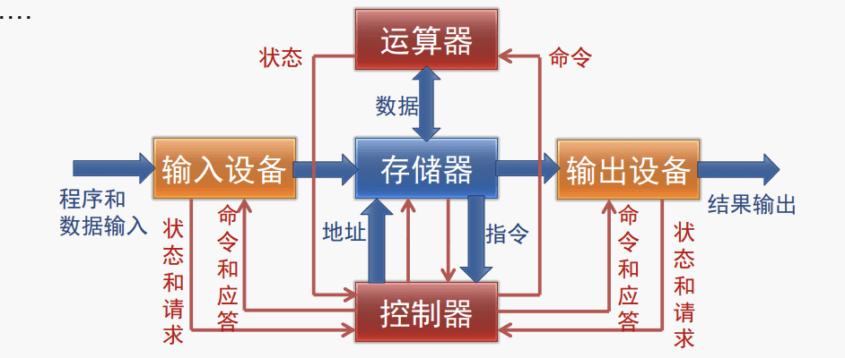

 冯·诺伊曼计算机的主要构成：

 $\quad$ 1. 运算器，CA：central arithmetical

 $\quad$ 2. 控制器，CC：central control

 $\quad$ 3. 存储器，M：memory

 $\quad$ 4. 输入设备，I：input

 $\quad$ 5. 输出设备，O：output

 $\quad$ 外部记录设备，R：outside recording medium
 
#### 2. x86指令系统概览

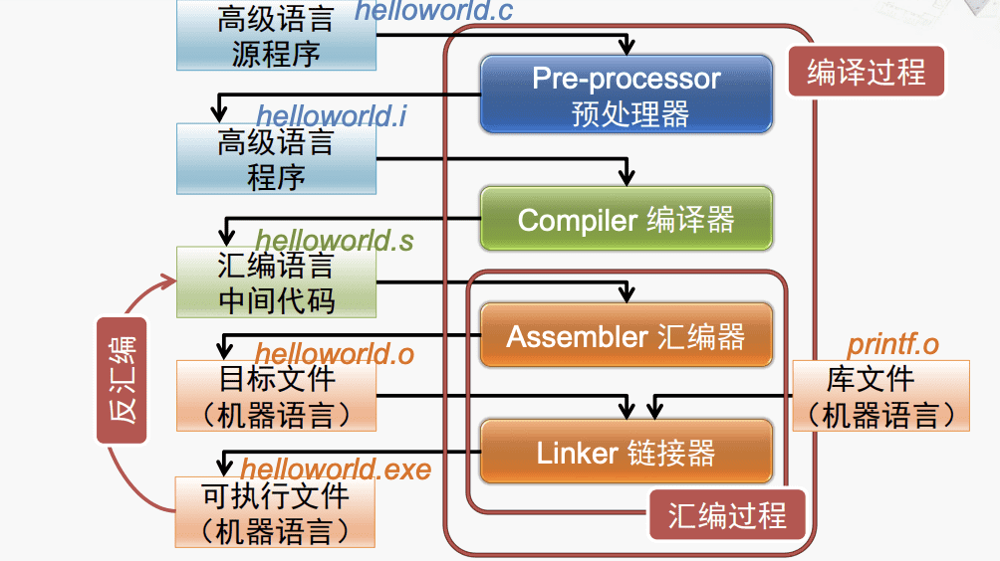

代表：

 **字长16位**：

$\quad$ *Intel 8086*(1978年)

 $\qquad$ 字长16位，内部的通用寄存器为16位，既能处理16位数据，也能处理8位数据。

  $\qquad$ 对外有16根数据线和20根地址线，可寻址的内存空间为1MByte($2^{20}$)。

   $\qquad$ 物理地址的形成采用“段加偏移”的方式。

$\quad$ *Intel 80286*（1982年）

  $\qquad$ 字长16位，地址总线扩展到24位，可寻址16MB的内存空间。

   $\qquad$ 引入了“保护模式”，但是机制有缺陷。

 $\qquad$  为保持兼容，保留了8086的工作模式，被称为实模式（实地址模式)。

 **字长32位**：

  $\quad$ *Intel 80386*（1985年）

$\qquad$ 80x86系列中的第一款32位微处理器。

$\qquad$ 地址总线扩展到32位，可寻址4GB的内存空间

$\qquad$ 改进了“保护模式”：（80386及以上的微处理器的主要工作模式，支持多任务，支持设置特权级，可以访问4GB的物理存储空间，引入了虚拟存储器的概念）

$\qquad$ 增加了“虚拟8086模式”，可以同时模拟多个8086微处理器

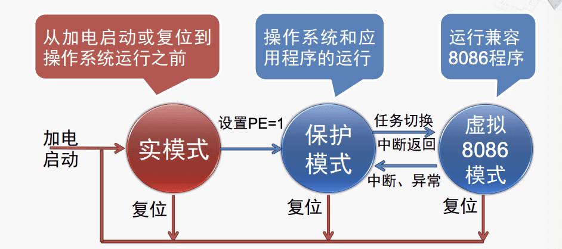
 **字长64位**：

$\quad$ *AMD Opteron* （2003年）

$\qquad$ x86扩展到64位的第一款处理器

$\qquad$ 可以访问高于4GB的存储器

$\qquad$ 兼容32位x86程序，且不降低性能

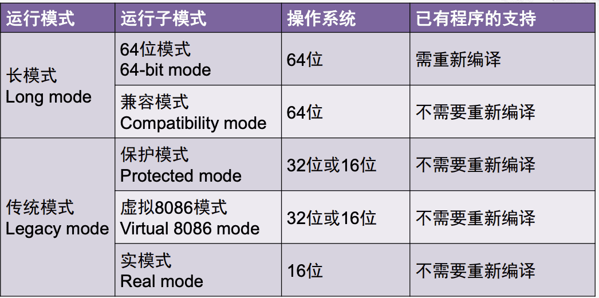

#### 3. x86的地址空间

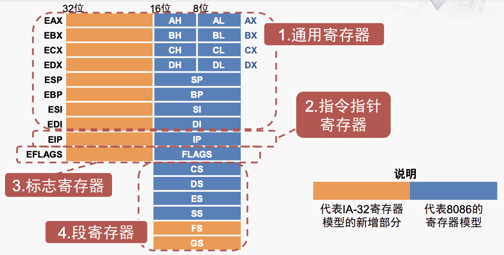

 **指令指针寄存器IP（Instruction Pointer）**：

 $\quad$ 保存一个内存地址，指向当前需要取出的指令。

 $\quad$ 当CPU从内存中取出一个指令后，IP会自动增加，指向下一指令的地址。

 $\quad$ 程序员不能直接对IP进行存取操作

 $\quad$ 转移指令，过程调用与返回等会改变IP的内容。

 **段寄存器**

 $\quad$ 与处理器中其他寄存器联合生成存储器地址

 $\quad$ 段寄存器的功能在实模式下和保护模式下是不同的。

~~~cpp
DATA SEGMENT ; 数据段
    NUM DW 0011101000000111B;
    NOTES DB 'The result is :','$'
DATA ENDS ; 数据段结束

STACK SEGMENT ; 堆栈段
    STA DB 50 DUP(?)
    TOP EQU LENGTH STA
STACK ENDS ; 堆栈段结束

CODE SEGMENT ; 代码段
    ASSUME CS:CODE,DS:DATA,SS:STACK
BEGIN:
    MOV AX, DATA
    MOV DS, AX   ;为DS赋初值
    MOV AX, STACK 
    MOV SS, AX   ;为SS赋初值
    MOV AX, TOP
    MOV SP, AX   ;为SP赋初值
    ...
CODE ENDS       ;  代码段结束
    END    BEGIN   ;模块结束
~~~
 
 $\quad$ ( 1 ) 代码段寄存器 CS (Code Segment)
 
 $\qquad$ 保存了代码段(一个存储区域，用以保存微处理器使用的代码）的起始地址 。
 
  $\qquad$ 用CS:IP指示下一条要执行的指令地址
 
  
  
$\quad$ ( 2 ) 数据段寄存器 DS (Data Segment)

  $\qquad$ 保存了数据段（一个存储区域，包含程序所使用的大部分数据）的起始地址。

  $\qquad$ 实模式数据段的长度限制为64KB，保护模式数据段长度限制为4GB。

$\quad$（ 3 ）附加段寄存器 ES (Extra Segment)

  $\qquad$ 保存了附加段（附加的数据段，也用于数据的保存，某些串操作指令将附加段作为其目的操作数的存放区域，长度限制与代码段以及数据段相同。）的起始地址。

  $\qquad$ 用ES:DI指示串操作的目的操作数的地址

  

  $\qquad$ 如果数据存在放在数据段以外的其他段（例如附加段），则应在指令中给出“段跨越前缀”。

  如  MOV  AX，ES:[3000H]   或   ES:MOV AX，[3000H]

$\quad$（ 4 ）堆栈段寄存器 SS (Stack Segment)

$\qquad$ 用以指示堆栈段的首地址

$\qquad$ ESP/SP或EBP/BP指示堆栈栈顶的偏移地址

$\qquad$ 用SS:SP等组合操作堆栈中的数据

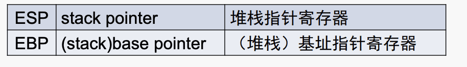

$\quad$ （ 5 ）新增加的附加段寄存器FS和GS

$\qquad$ 80386起新增了这两个附加段寄存器

$\qquad$ FS和GS的功能和ES相同

$\qquad$ 增加FS和GS可以减轻ES寄存器的负担，以便程序灵活访问相应的两个附加数据段。

 **8086的物理地址生成**

 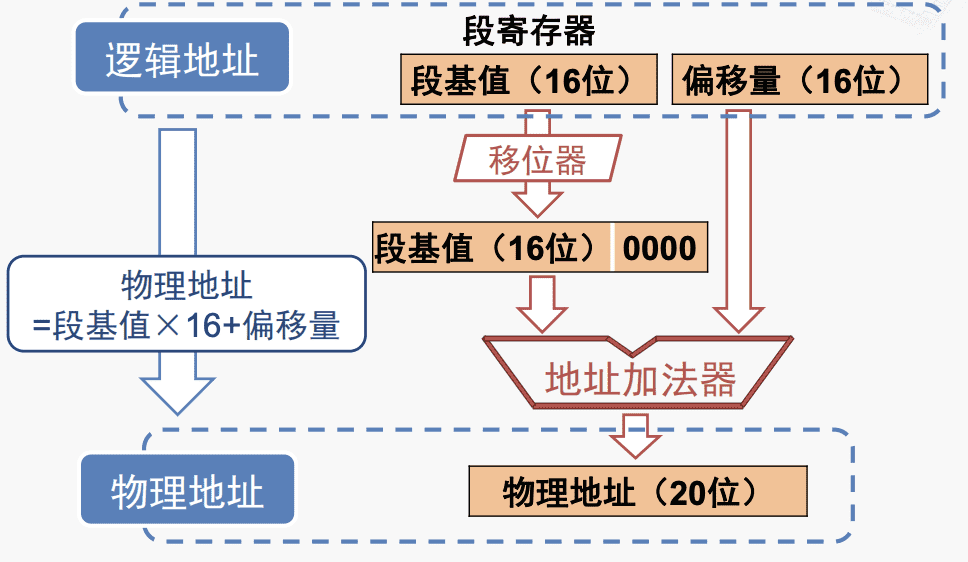

  $\quad$ 实例：

  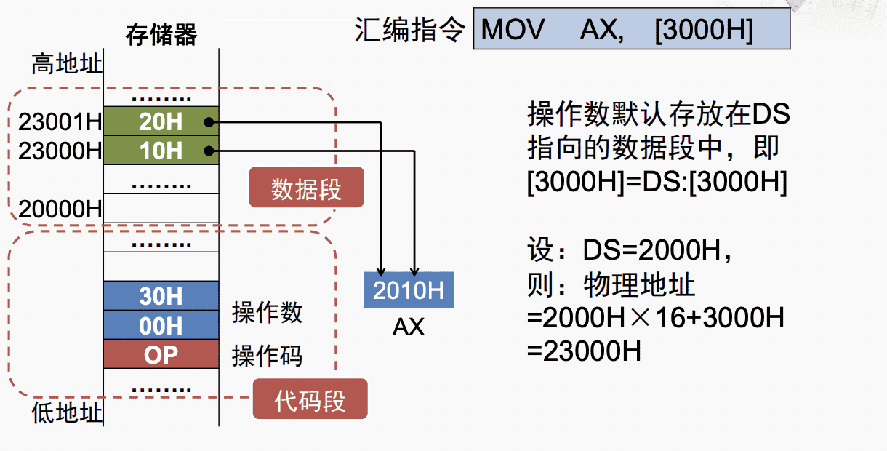

  **直观的存储器分段方法**

$\quad$ 实现方法：把20位物理地址分为2部分，高4位为段号，用段号寄存器来保存，低16位为段内地址，也称便宜地址。

$\quad$ 不足之处：段号寄存器和其他寄存器不兼容，且每个逻辑段固定占用16K字节，浪费存储空间，相比而言8086的分段技术更灵活。

 **IA-32的存储器寻址**

  实模式 CS:IP

  保护模式：CS:EIP，保护模式下，段基地不在CS中，而是在内存中。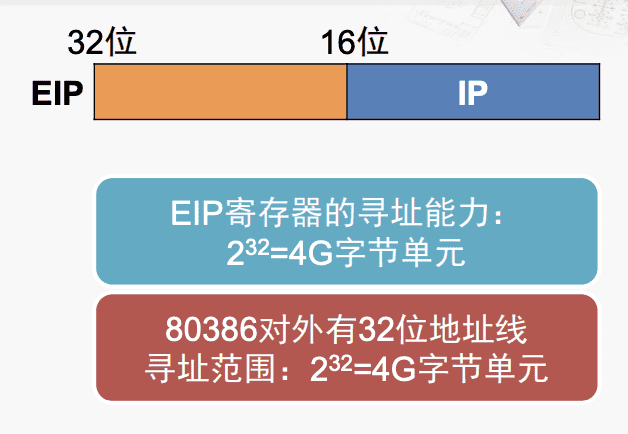

#### 4. x86汇编语言的格式

###### Intel 和AT&T 格式的区别

 **Intel 格式**

$\quad$ Intel制定，x86相关的文档手册使用该格式

$\quad$ 主要应用在MS-DOS和Windows等系统中

 **AT&T格式** 

$\quad$ AT&T制定，起源于贝尔实验室研发的Unix

$\quad$ 最初用在PDP-11/VAX等机型，后移植到x86

$\quad$ 主要应用于Unix和Linux等系统中

 1. 前缀（后缀）：

 $\quad$ Intel语法：寄存器和立即数都没有前缀，十六进制、十进制、八进制和二进制立即数后缀分别为h,d，o(q)和b。整数默认为10进制，以字母开头的十六进制数必须加0，字符串常数用单引号括起。实数即为 （）E（）

  $\quad$ AT&T语法“寄存器使用前缀”%“，立即数使用前缀”$“，十六进制立即数使用前缀0x

  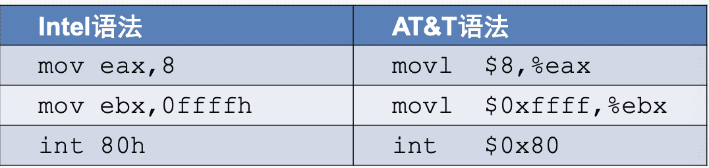

  2. 操作数方向

  $\quad$ Intel语法：第一个操作数是目的操作数，第二个操作数是源操作数

  $\quad$ AT&T语法：第一个操作数是源操作数，第二个操作数是目的操作数

  3. 内存单元操作数

  $\quad$ Intel语法：基寄存器用[ ]标明

  $\quad$ AT&T语法：基寄存器用（ ）标明

  4. 间接寻址方法

  $\quad$ Intel语法：segreg:[base+index*scale+disp]

  $\quad$ AT&T语法：%segreg:disp(base,index,scale)

  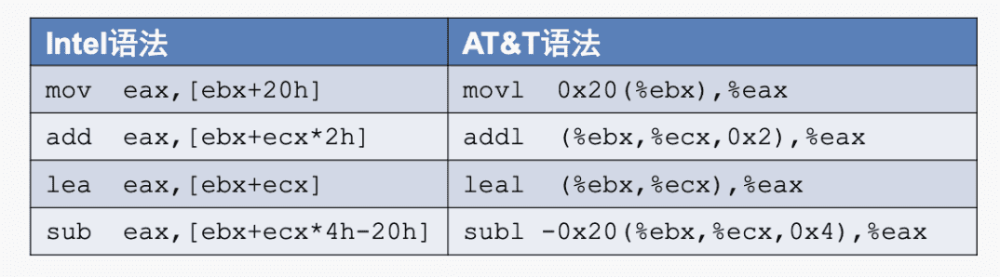

  5. 操作码后缀

  $\quad$ AT&T语法： 操作码带后缀，以指出操作数的大小

  $\qquad$ I:32位；w: 16位 ；b：8位

  $\quad$ Intel语法：内存单元操作数带前缀，以指出操作数的大小

  $\qquad$ dword ptr; word ptr ;byte ptr

  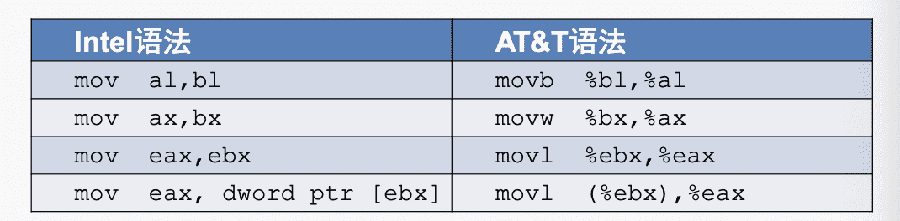

###### 汇编语言程序

 **组成**

$\quad$ 分段结构：按段进行组织，最多由四个段组成（代码，数据 ，附加，堆栈），每个段以“段名   SEGMENT”开始，以“段名  ENDS”结束。

$\quad$ 语句行：段由若干语句行组成，语句行的三种类型：指令、伪指令

宏指令。

 **语句的执行**

$\quad$ 指令语句的执行：汇编器计算指令语句中表达式的值->汇编器将指令语句翻译成机器指令代码->程序运行时，由CPU按机器指令代码的要求完成各种运算与操作。

$\quad$ 伪指令语句的执行：汇编器计算伪指令语句中表达式的值，不产生机器代码，汇编器解释伪指令语句的含义并遵照执行。

$\qquad$ 数据定义：变量（编程时只能确定其初始值，程序运行期间可修改其值的数据对象称为变量）是存储单元中的数据，可定义在任何段，由伪指令说明符DB、DW、DD等定义

$\qquad$ 符号定义：常量（编程时已确定其值，程序运行期间不会改变其值）可由伪指令说明符"EQU"或“=”定义，不产生目标代码，不占用存储单元。EQU左边的符号名不可重复定义，但=可以。

$\qquad$ 段定义：说明符SEGMENT（段开始），ENDS（段结束），ASSUME（指定段寄存器）

$\qquad$ 指定段内的偏移地址：

$\qquad$ $\qquad$ “ORG 常数表达式”指定当前可用的存储单元的偏移地址为常数表达式的值。

$\qquad$ $\qquad$ “EVEN”将当前可用的存储单元的偏移地址调整为最近的偶数值。

$\qquad$ 示例：
~~~cpp
DATA SEGMENT
  ORG 1000H
  A DB 47H,12H,45H
  EVEN
  B DB 47H
DATA ENDS
//ORG指令将A的偏移地址部分指定为1000H，从A开始存放3个字节变量，占用地址1000H，1001H和1002H，EVEN指令会将B的偏移地址部分从1003H调整为偶数地址1004H

~~~

$\qquad$ 过程定义：

$\qquad$ $\qquad$ “过程名  PROC  类型属性名”：从过程名代表的地址开始定义一个过程；“类型属性名”可以选择NEAR（近过程）或FAR（远过程），默认为NEAR

$\qquad$ $\qquad$ “过程名 ENDP”：表示该过程到此结束，此处的过程名必须与过程开始时PROC左边的过程名相同。

---
