# 计算机组成与体系结构
---
## CISC ,X86,RISC,MIPS指令

$\quad$ CISC：Complex Instruction Set Computer：复杂指令系统计算机

$\quad$ RISC：Reduced Instruction Set Computer：精简指令系统计算机

#### X86指令

##### 传送类

$\quad$ 作用：把数据或地址传送到寄存器或存储器单元中。

$\quad$ 分为四大类14条指令

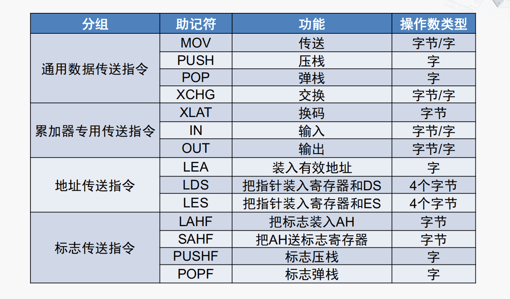

###### MOV指令

$\quad$ 格式：MOV DST，SRC

$\quad$ 操作： DST$\leftarrow$ SRC

$\quad$ 说明：DST指令表示目的操作数，SRC表示源操作数。MOV指令把一个字节或字节操作数从源传送到目的，源操作数保持距离不变。

$\quad$ 传送方向和限制：

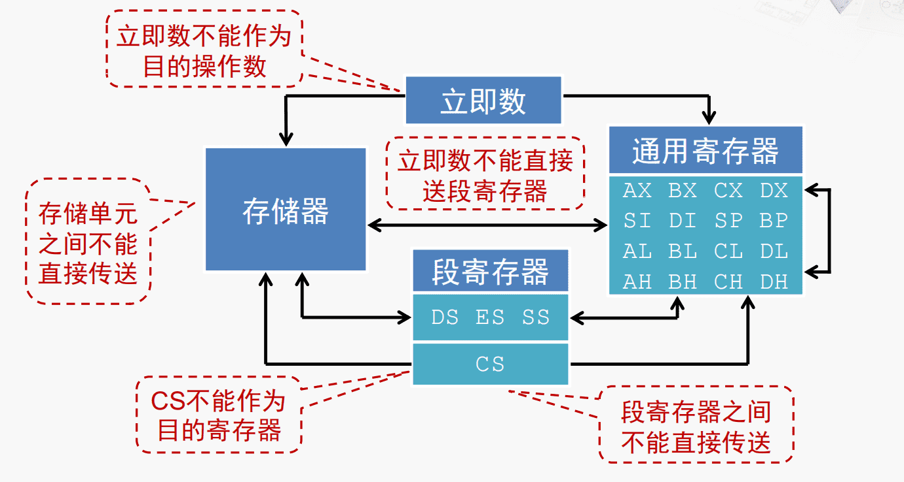

###### XCHG指令（交换）

$\quad$ 格式：XCHG OPR1，OPR2

$\quad$ 操作： OPTR1 $\leftrightarrow$ OPTR2

$\quad$ 说明：两个操作数的位宽要相同，类型包括寄存器/存储器，存储器/寄存器，寄存器/寄存器，不允许使用段寄存器

###### XLAT指令（换码，查表）

$\quad$ 格式：XLAT

$\quad$ 操作：

$\qquad$ 1. 从BX中取得数据表起始地址的偏移量

$\qquad$ 2. 从AL中取得数据表项索引值

$\qquad$ 3. 在数据表中查得表项内容

$\qquad$ 4. 将查得的表项内容存入AL

##### 运算类

$\quad$ 作用：完成加、减、乘、除等算术运算，提供运算结果调整，符号扩展等功能。

$\quad$ 操作数限制：对于双操作数的指令，限制与MOV指令相同（目的操作数不能是立即数或CS寄存器，两个操作数不能同时为存储器操作数）

$\quad$ 分类：五大类20条指令

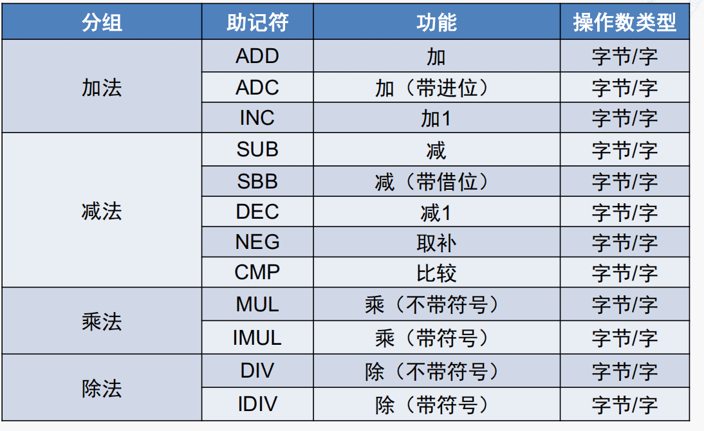

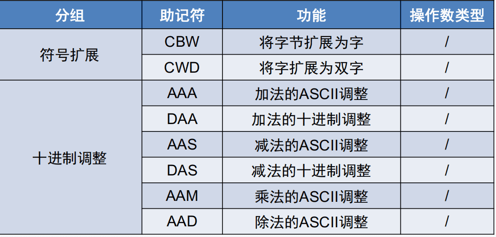

###### 加法类指令

$\quad$ ADD：加

$\quad$ $\quad$ 格式：ADD DST，SRC

$\quad$ $\quad$ 操作：DST$\leftarrow$ DST+SRC

$\quad$ ADC：带进位的加

$\quad$ $\quad$ 格式：ADC DST，SRC

$\quad$ $\quad$ 操作：DST$\leftarrow$ DST+SRC+CF

$\quad$ INC：加1

$\quad$ $\quad$ 格式：INC OPR

$\quad$ $\quad$ 操作：OPR$\leftarrow$ OPR+1

###### 十进制调整指令

$\quad$ 格式：DAA

$\quad$ 操作：跟在二进制加法指令之后，将AL中的和调整为压缩BCD数形式，结果返回AL

示例：

~~~c
MOV AL,27H; AL=27H
ADD AL,15H; AL=3CH
DAA.      ; AL=42H
~~~

$\qquad$ BCD（binary-Coded Decimal）具有二进制编码的形式，又保持了十进制的特点，可以作为人与计算机联系时的中间表示。

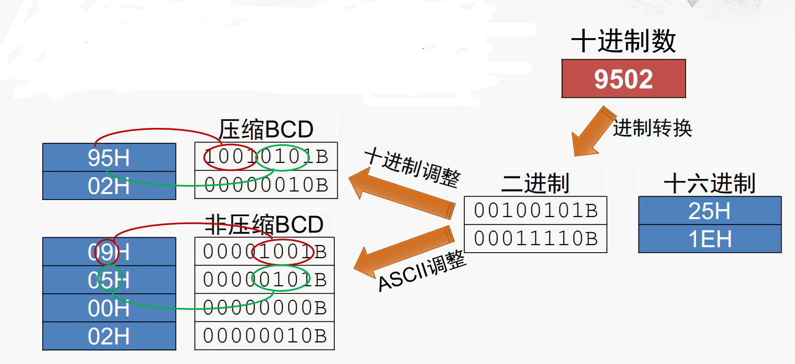

##### 转移类

$\quad$ 作用：改变指令执行顺序

$\quad$ 分类：根据是否有判断条件，分为无条件转移和条件转移指令；根据转移目的地址的提供方式，分为直接转移和间接转移。

###### 无条件转移指令

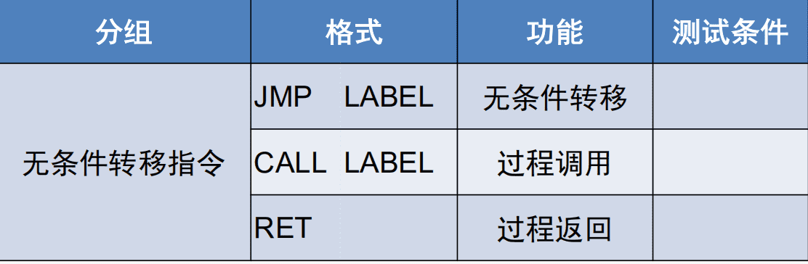

$\quad$ 直接转移：

$\qquad$ 短转移： JMP SHORT LABEL

$\quad$ $\quad$ 操作：IP$\leftarrow$ IP+8位的偏移量（-128～127Byte）

$\qquad$ 近转移：JMP NEAR PTR LABEL

$\quad$ $\quad$ 操作：IP$\leftarrow$ IP+16位的偏移量（+-32KByte）

$\qquad$ 远转移：JMP FAR PTR LABEL

$\quad$ $\quad$ 操作：IP$\leftarrow$ LABEL的偏移地址；CS$\leftarrow$ LABEL的段基值

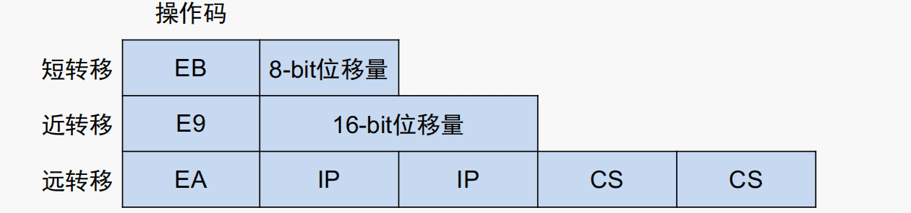

$\quad$ 间接转移：JMP DWORD PTR OPR

$\quad$ $\quad$ 操作：寻址到OPR指定的存储器单元双字->将该双字中的低字送到IP寄存器中->将该双字中的高字送到CS寄存器中

###### 条件转移指令

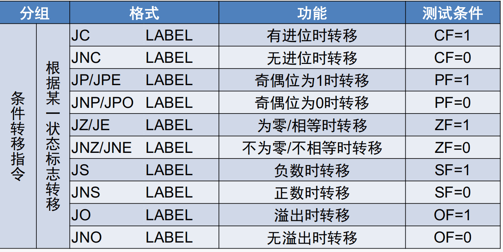

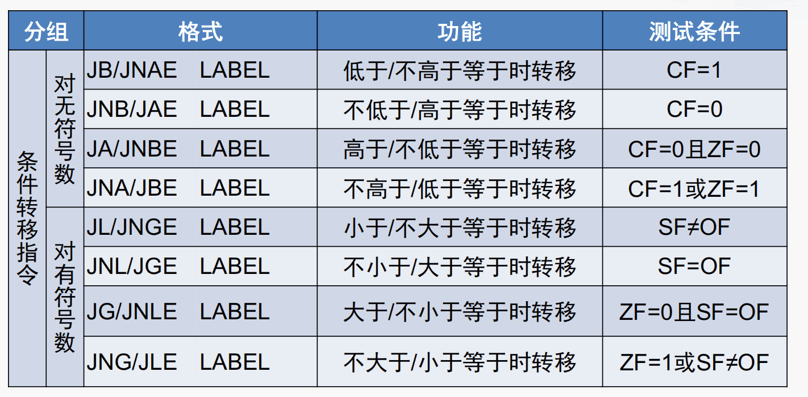

$\quad$ 操作：根据当前的状态标志位判断是否发生转移

$\quad$ 说明：8086中，所有的条件转移都是短转移，80386起，条件转移指令可以使用32位的长位移量

###### 循环控制指令

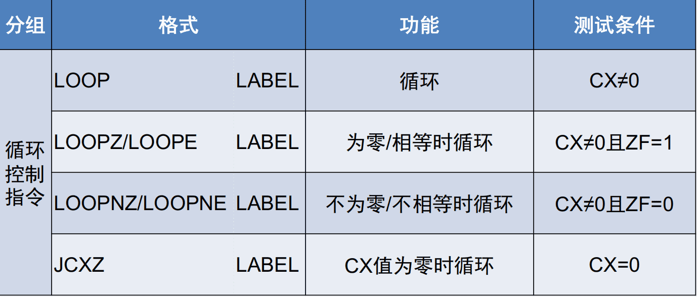

LOOPNE/LOOPNZ指令说明

$\quad$ 格式：LOOPNE LABEL或LOOPNZ LABEL

$\quad$ 操作：CX$\leftarrow$CX-1,若CX不为0且ZF为0，转移到LABEL处继续执行，否则结束循环顺序执行下一条指令

##### 串操作指令

$\quad$ 作用：对存储器中的数据串进行每次一个元素的操作

$\quad$ 分类：共5条串操作指令，3种重复前缀

$\quad$ 串的基本单位是字节或字，长度可达64KB

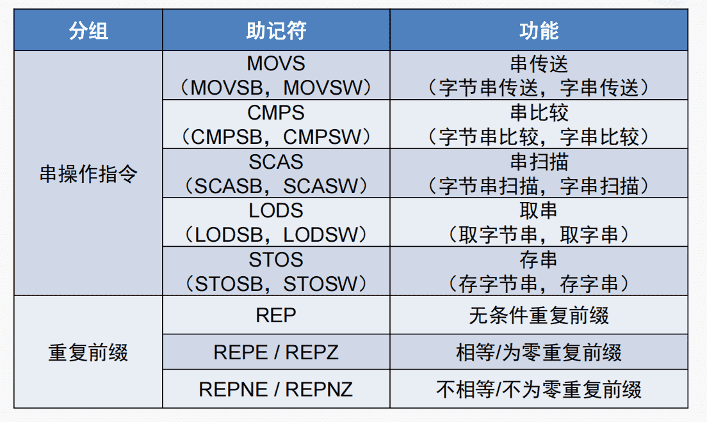

###### 重复前缀

$\quad$ **REP**（无条件重复）

$\qquad$ 当CX！=0时，重复执行串操作指令，适用于MOVS，STO

$\qquad$ 处理完一个串元素后，CX减一

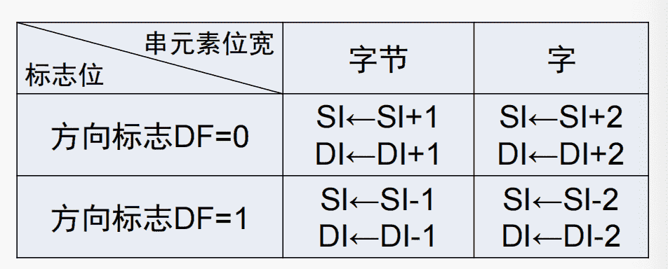

$\quad$ 串传送方向：DF=0从低地址开始，DF=1从高地址开始

$\quad$ **REPNE/REPNZ**（不相等/不为零重复）

$\qquad$ 当CX！=0且ZF=0时，重复执行串操作指令，适用于CMPS，SCAS

##### 处理器控制指令

$\quad$ 作用：控制CPU的功能，对标志位进行操作

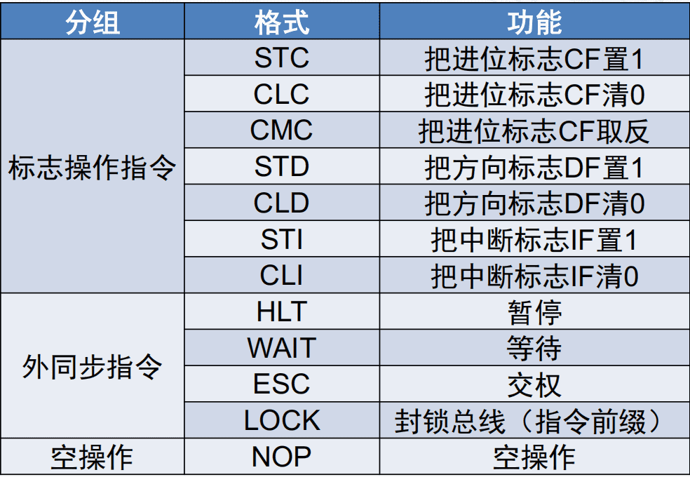

##### X86指令的发展历程：

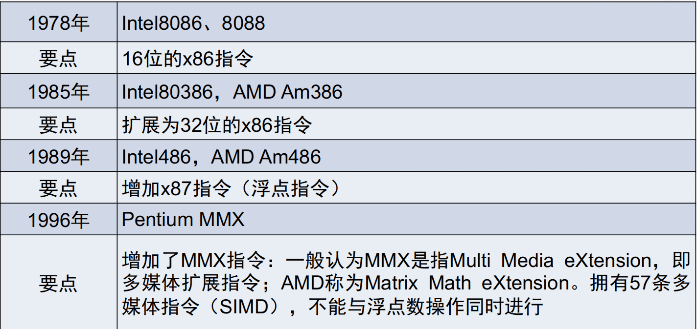

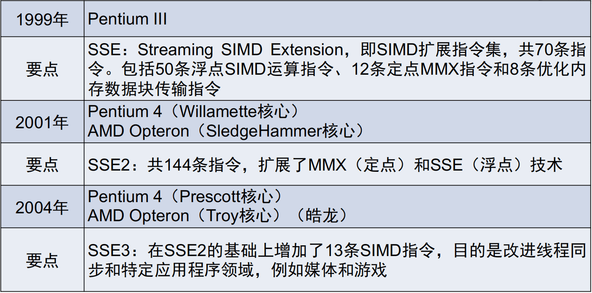

#### MIPS指令

$\quad$ 全称：Microprocessor without Interlocked Piped Stages

$\quad$ 主要关注点：减少指令的类型，降低指令的复杂度

$\quad$ 基本原则：A simpler CPU is a faster CPU

##### 指令示例 

###### 装载

$\quad$ 格式：lw \$8,(\$19)

$\quad$ 操作：以19号寄存器的内容为地址，取出存储器中的32位数据，存入八号寄存器

###### 加法

$\quad$ 格式：add \$10 , \$9 ,  \$8 

$\quad$ 操作：将八号和九号寄存器的内容相加存入十号寄存器中（减法即为sub）

###### 存储

$\quad$ 格式：sw \$10,32 (\$19)

$\quad$ 操作：将10号寄存器的内容存入存储器，地址为19号存储器的内容

##### MIPS的通用寄存器

$\quad$ 32个，每个都是32位宽

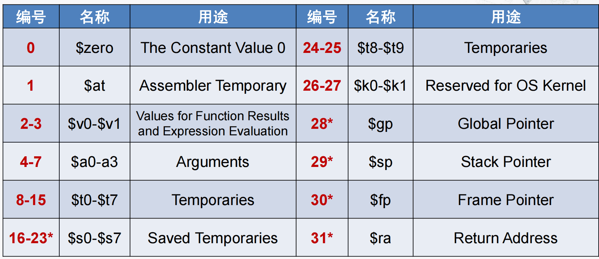

##### MIPS指令的特点

$\quad$ 1. 固定的指令长度（32-bit，即1word）

$\qquad$ 简化了从存储器取指令

$\qquad$ 对比x86长度不定，1～15字节

$\quad$ 2. 只有Load和Store指令可以访问存储器

$\quad$ 3. 简单的寻址模式

$\qquad$ 简化了从存储器取操作数

$\quad$ 4. 指令数量少，指令功能简单

$\qquad$ 一条指令只完成一个操作，简化指令的执行过程

$\qquad$ 影响：处理器设计简单，运行速度快，编程复杂，代码程序量大，需要优秀的编译器

##### MIPS指令的基本格式

$\quad$ R： Register，寄存器

$\quad$  I：Immediate，立即数

$\quad$ J：Jump，无条件转移

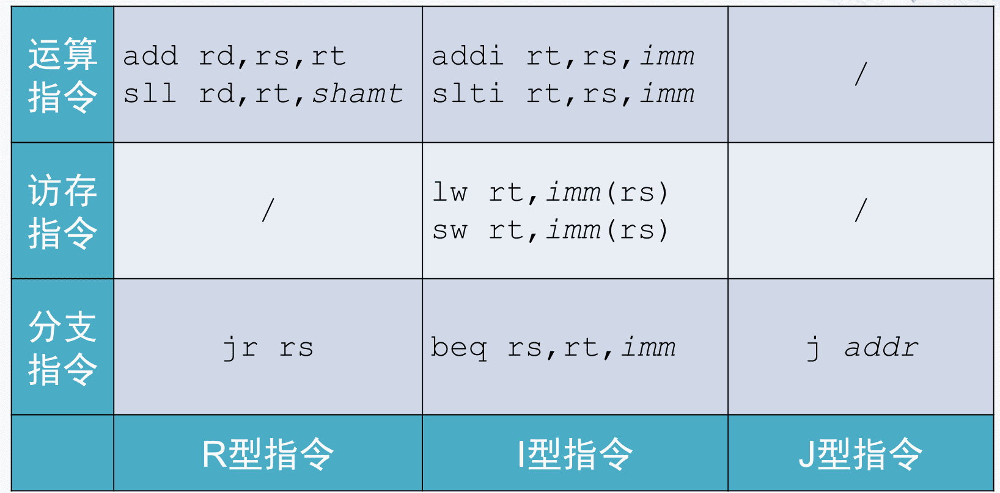

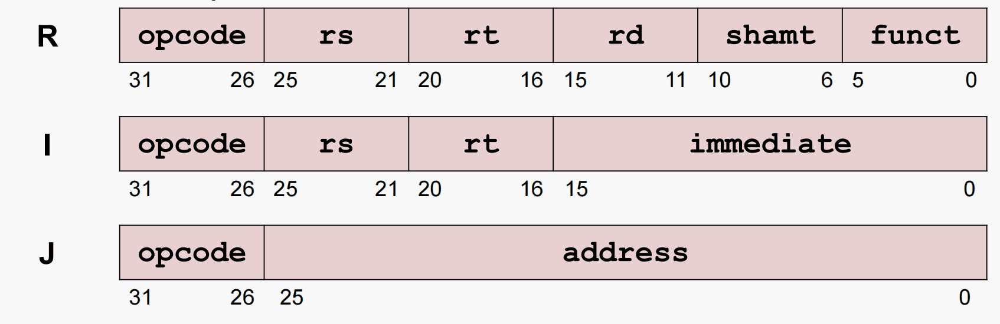

###### R型指令

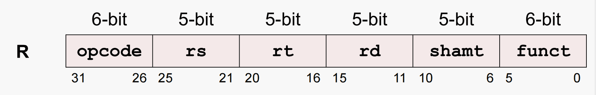

$\quad$ R型指令格式包括6个域，2个6-bit域（可表示0～63的数），4个5-bit域（可表示0～31的数）

$\quad$ opcode：用于指定指令的类型，对于所有R型指，该域的值均为0

$\quad$ funct：与opcode域结合，精确指定指令的类型

$\quad$ rs（Source Register）：指定第一个源操作数所在的寄存器编号

$\quad$ rt（Target Register）：指定第二个源操作数所在的寄存器编号

$\quad$ rd（Destination Register）：指定目的操作数（保存运算结果）的寄存器编号

$\quad$ shamt（shift amount）：用于指定移位指令进行移位操作的位数，非移位指令设为0

$\quad$ 5-bit的域可表示0~31，对应32个通用寄存器

###### I型指令

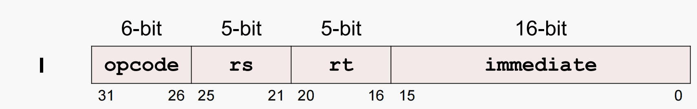

$\quad$ 大部分域与R指令相同

$\quad$  opcode：用于指定指令的类型

$\quad$ rs：指定第一个源操作数所在的寄存器编号

$\quad$ rt：一般指定用于目的操作数的寄存器编号；对于某些指令指定第二个源操作数所在的寄存器编号

$\quad$ immediate：16-bit的立即数，可以表示$2^{16}$ 个不同数值

##### 分支指令

$\quad$ 分类：

$\qquad$ **Branch**：分支， 改变控制流

$\qquad$ **Conditional Branch**：条件分支，根据比较的结果改变控制流；两条指令：  *branch if equal（beg）；branch if not equal（bne）*

$\qquad$ **Unconditional Branch** :非条件分支，无条件改变控制流：指令：*jump (j)* 

###### I型（条件分支）

~~~cpp
beq rs,rt,imm   #opcode=4
bne rs,rt,imm   #opcode=5
~~~

$\quad$ 目标地址计算方法：

$\qquad$ 分支条件不成立：PC=PC+4

$\qquad$ 分支条件成立：PC=PC+4+（immediate*4）

###### J型（非条件分支）
~~~cpp
j addr
~~~

$\quad$ 目标地址计算方法：PC = \{ $(PC+4)[31..28],address,00$ \}  

$\quad$ 目标地址范围：$2^{28}bytes$ 

###### R型（非条件分支）

~~~cpp
jr rs
~~~

##### 串操作指令

**MOVSB（字节串传送）**

$\quad$ 格式：MOVSB

$\quad$ 操作：将地址DS:SI所指向的存储器字节单元传送到地址ES:DI；修改SI和DI的内容，指向串的下一元素

**MOVSW（字串传送）**

$\quad$ 格式：MOVSW

$\quad$ 操作：将地址DS：SI所指向的存储器字单元传送到地址ES：DI；修改SI和DI的内容，指向串的下一元素

---