# [ICS](https://aki-yzh.github.io/2023/02/18/1-计算机系统漫游&目录)

---

## 三、程序的机器级表示

$\quad$ 忽略以.开头的伪指令

$\quad$ 指令分为 操作码与操作数两部分 

$\quad$ PC    用%rip表示，给出将要执行的下一条指令在内存中的地址

$\quad$ 整数寄存器文件用来存放整数数据和指针
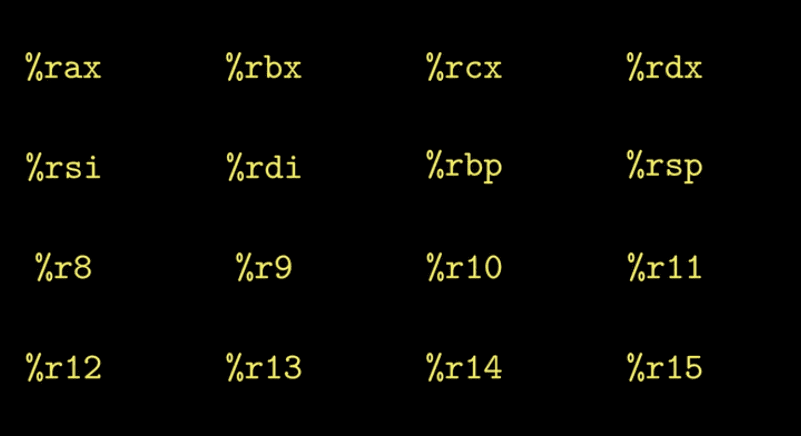
$\quad$ 条件码寄存器 存储算数或逻辑指令的状态信息

$\quad$ 调用者保存（caller）：调用函数前保存寄存器的值

$\quad$ 被调用者保存（callee）：在调用函数时保存寄存器的值
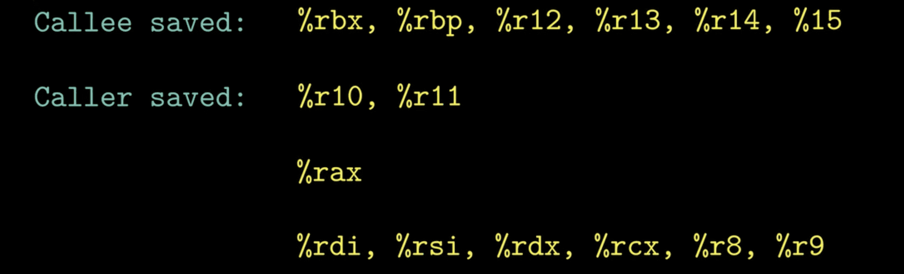
$\quad$ 一般用开头的pushq和结尾的popq实现

数据大小：

$\quad$ 用字表示16位的数据类型大小，用双字表示32位，四字表示64位。
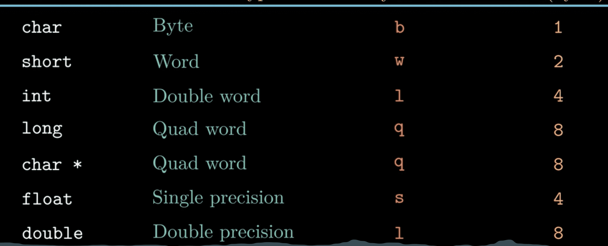
**寄存器**
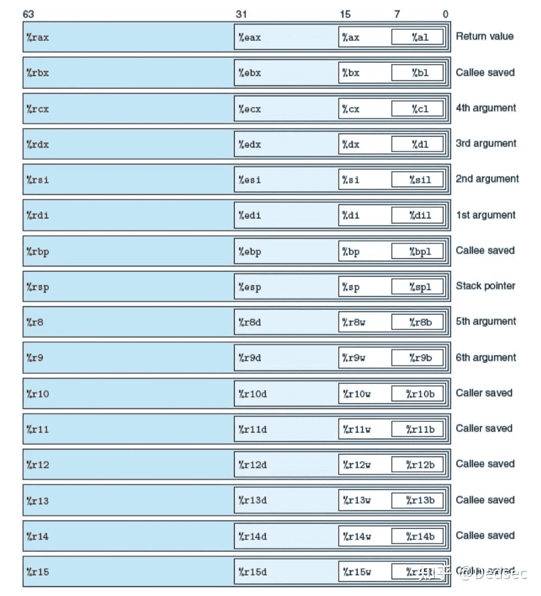
$\quad$ r8～r15 无后缀64位，后缀b8位，w16位，d32位

$\quad$ rax用来保存函数的返回值，rsp保存程序栈的结束位置，其他六个用于传参，rbx和rbp保存被调用者，rdi，rsi，rdx，rcx用于第1，2，3，4个参数的保存。

$\quad$ 描述中用R[%r]表示寄存器%r的值

$\quad$ 当指令以寄存器作为操作目标时，对于生成小于8字节结果的指令：生成1字节和2字节数字的指令会保持剩下的字节不变，生成4字节数字的指令会把高位4个字节设置为0

#### 操作数

$\quad$ 大致分为3类：立即数（$接整数），寄存器，内存引用（比如寄存器外加小括号(%rdi)等）

$\quad$ 一般用M[addr]表示从addr开始b个字节值的引用

$\quad$ 常用$Imm(r_b,r_i.s)$表示，Imm表示立即数，rb是基址寄存器，ri是变址寄存器，s是比例因子，必须为1，2，4或者8。rb和ri都必须是**64位寄存器**//考察点

$\quad$ 有效地址计算为 Imm+rb+ri*s；
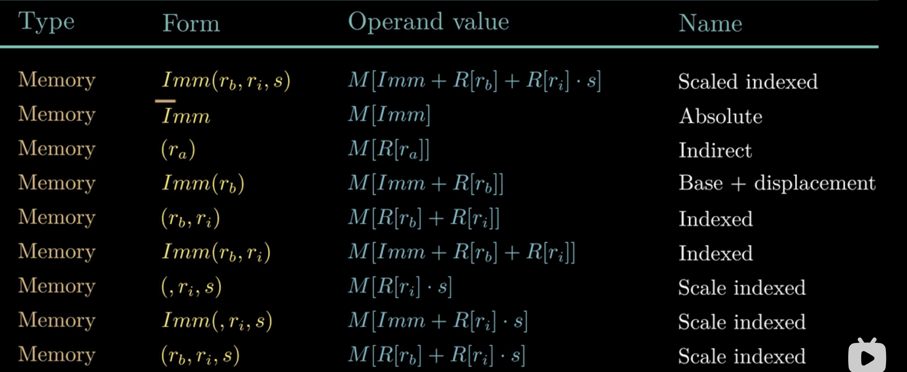
$\quad$ 需要特别注意不带$的立即数和带了括号的寄存器都是内存引用

#### 数据传输指令

 $\quad$ 将数据从一个位置移动到另一个位置的指令

$\quad$ 有movb，movw，movl，movq四种，区别在于移动数据的大小不同。
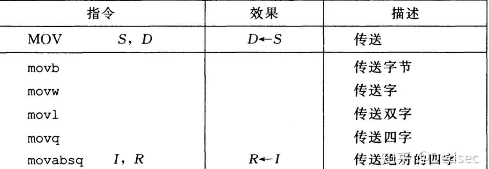
$\quad$ 含有两个操作数：源操作数与目的操作数

$\quad$ MOV            源操作数 （立即数，寄存器或内存）          目的操作数（寄存器或内存引用，用于存放源操作数）

$\quad$ 源操作数和目的操作数不能都是内存引用

$\quad$ MOV指令只会改变目的操作数，movl除外，会把源操作数高位4字节设为0

$\quad$ $\quad$ movq移动32位补码数的立即数时先符号扩展再进行移动

$\quad$ $\quad$ movavsq 移动64位立即数，目的操作数只能是寄存器。

MOVZ类：

$\quad$ 两个字母一个表示源操作数的大小，第二个表示目的操作数的大小，做0扩展

MOVS类同理，做符号位扩展                

#### 栈指令

$\quad$ popq 将四字弹栈，栈指针加8，相当于subq $8 ,%rsp    movq %rbp  ,(%rsp)

$\quad$ pushq 将四字压栈，栈指针减8,相当于 movq (%rsp),%rax  addq $8,%rsp

$\quad$ 栈放在内存的某个区域

#### 算数和逻辑操作

$\quad$ 大写表示一个操作类 操作码为后面加上一个字母表示操作数的大小

     加载有效地址  leaq

leaq    S，D  实际上是movq指令的变形 效果D=&S

$\quad$ 并不是从内存地址读取数据，直接赋予有效地址给D就行

$\quad$ 如  leaq 7（%rdx,%rdx,2),%rax  （若%rdx值为x）表示 将%rax赋值为7+3x

leaq用于实现加法与有限形式的乘法

一元操作：

二元操作：
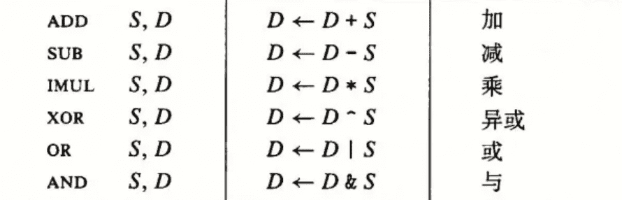
移位操作：
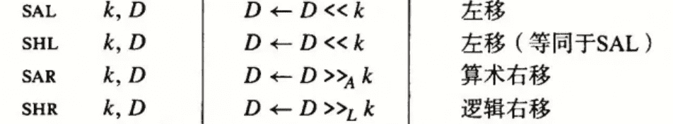
$\quad$ //A代表arithmetical代表算数
特殊的算数操作
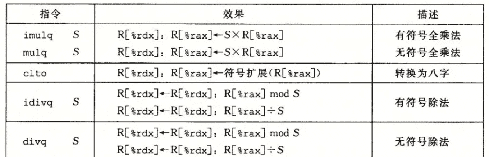

#### 控制

条件码    长度只有1个bit

CF：最近的操作使最高位产生了进位，可以检查无符号操作的溢出

ZF：0标志，最近操作结果为0

SF：符号标志，最近操作结果为负数

OF：溢出标志，最近操作使补码溢出

$\quad$ 以下算数逻辑运算会改变条件码寄存器的值
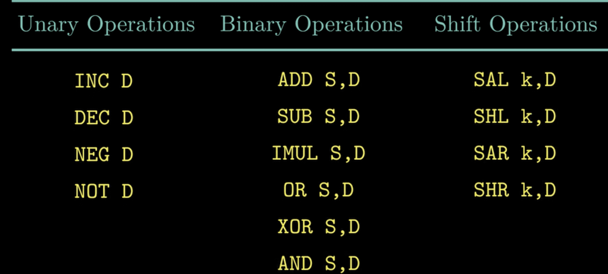
还有两类指令能设置条件码寄存器
CMP指令和TEST指令

$\quad$ CMP根据两个操作数的差来设置条件码寄存器，和减法指令区别在不会改变操作数的值

$\quad$ TEXT指令则比较两个数是否一样，同样是只设置条件码

SET指令调用条件码

$\quad$ set D    D被设为为1或0

$\quad$ SET前常接CMP指令

$\quad$ SET后接的字母         l：less（有符号）    g：greater  （有符号） e:equal      n:not     s:负数    a:above无符号大于    b：below无符号小于

#### 跳转指令

$\quad$ jmp无条件跳转

$\quad$ jmp后直接接地址表示直接跳转，接*表示间接跳转

$\quad$ 其他的j后接跳转条件，字母与set后接的代表一致

$\quad$ 跳转指令勇于实现跳转与分支，循环（将循环化成goto再化成汇编）

$\quad$ switch的实现通过跳转表实现。jmp  * .Ln（，%r，k   ）        .Ln表示跳转表的名称，%r标志switch的n所在的寄存器，k一般为8以模拟case0
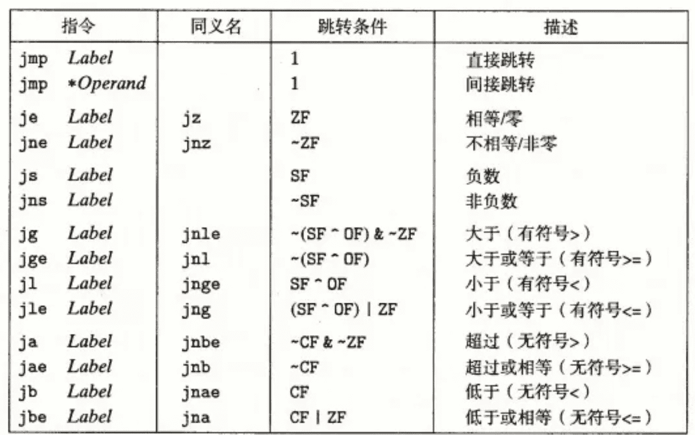
#### 条件传送指令

$\quad$ cmov后接字母，表示与上述一致，对所有的操作数长度适用。
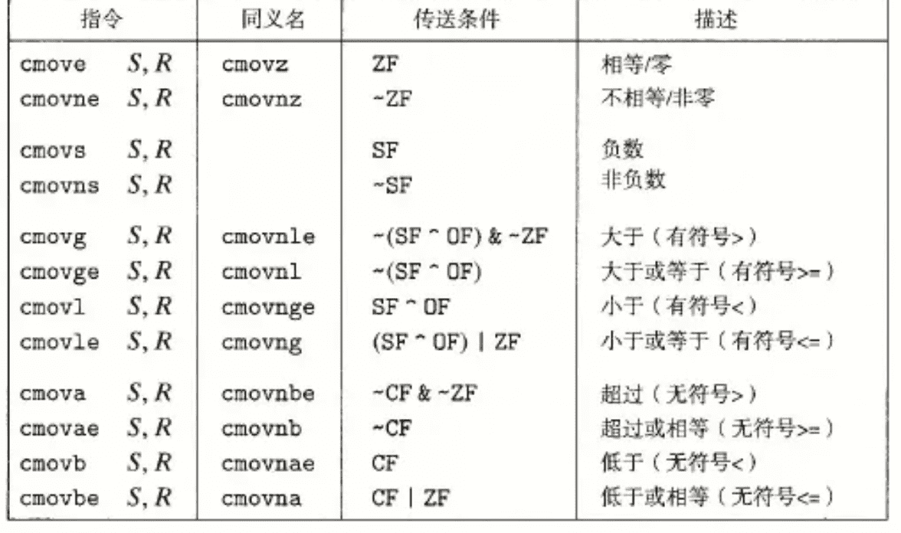
#### 过程
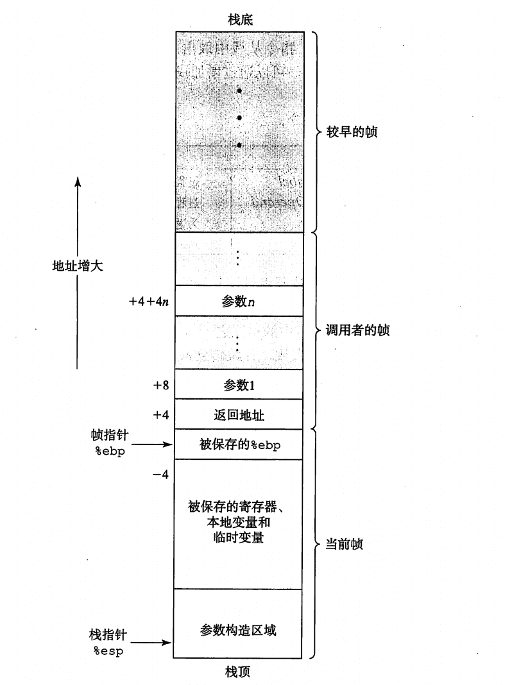
$\quad$ call    调用函数

$\quad$ ret 从过程调用中返回

$\quad$ 如果一个函数有大于6个整型参数，超出6个的部分则需要通过栈来传递。

$\quad$ 局部变量不需要对齐，而传递的参数需要对齐
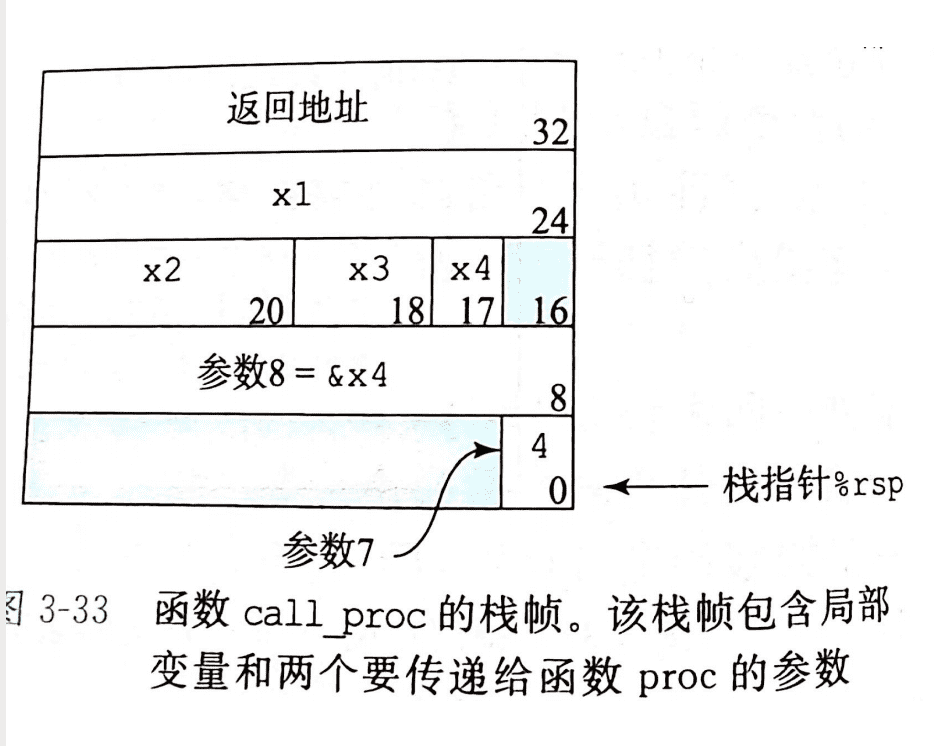
#### 数组的分配和访问

$\quad$ 起始地址为 $x_0$ ,数组元素i被存放在 $x_0$ +L*i处

$\quad$ *可以理解为从地址中取数据

$\quad$ 嵌套数组：a[i][j]看作是有i个元素的数组，每个元素都是j个int的数组，线性排列

#### 异质的数据结构

$\quad$ struct结构体：每个元素各占一个区域

$\quad$ union联合:所有字段共享存储区域，联合体的大小取决于最大字段的大小，应用于事先知道几个字段的存在是互斥的

数据对齐

| K   | type              |
| --- | ----------------- |
| 1   | char              |
| 2   | short             |
| 4   | int ,float        |
| 8   | long,double,char* |

$\quad$ .align 8表示使其后面的数据起始地址是8的倍数

$\quad$ 对于结构体，每个元素后要满足下一个元素的对齐要求，（即下一个元素的起始地址必须是其对应的K的倍数）总的内存长度要满足所有元素的对齐要求。

#### 缓冲区溢出

$\quad$ 解决方法：栈随机化，栈破坏检测（金丝雀值：在底部存储一个特殊值），限制可执行代码区域

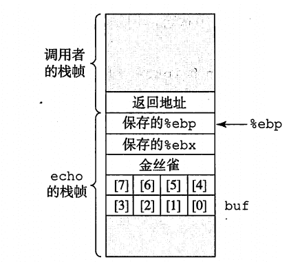

---
### LAB:

**此章节后完成[bomblab(70.0/70.0)](https://github.com/Aki-yzh/PKU-ICS-2022/tree/main/LABS/2-bomblab)与[attacklab(105.0/105.0)](https://github.com/Aki-yzh/PKU-ICS-2022/tree/main/LABS/3-attacklab)**