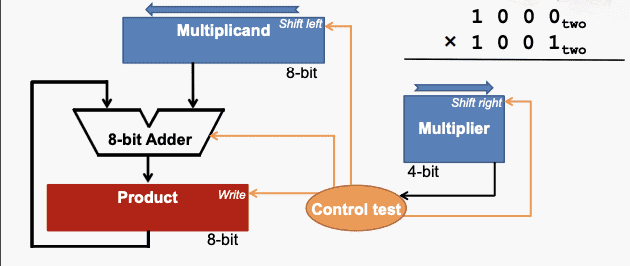
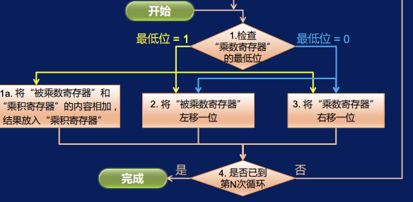
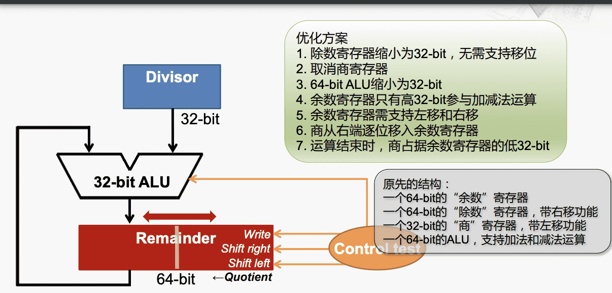

# 计算机组成与体系结构

---
## 数字电路设计

#### 基础

$\quad$ 莱布尼茨：二进制

$\quad$ 布尔：布尔代数（两个元素（真、假）；三种运算（与、或、非））

$\quad$ 香农：开关电路：模拟布尔逻辑运算，形成现代电子计算机的基本思路

#### 晶体管与门电路

$\quad$ 现代集成电路通常使用MOS晶体管（Metal-Oxide-Semiconductor）

$\quad$ CMOS集成电路（Complementary MOS）：由PMOS和NMOS共同构成的互补型MOS集成电路

$\quad$ NMOS晶体管：Gate为高电压时导通

$\quad$ PMOS晶体管：Gate为低电压时导通

###### 非门

###### 与门

###### 或门

###### 异或门

###### 运算的实现
例：

$\quad$ 其他运算同理

###### 半加器

###### 全加器

减法运算的实现：

A-B=A+(~B+1)
###### 多路选择器

#### 时钟和触发器

###### D触发器（D flip-flop，DFF）

$\quad$ 具有存储信息能力的基本单元

$\quad$ 由若干逻辑门构成，有多种实现方式

$\quad$ 主要有一个数据输入，一个数据输出和一个时钟输入

$\quad$ 在时钟clock的上升沿（0->1），采样输入D的值，传送到输出Q，其余时间输出Q的值不变。

###### D锁存器：

###### SRAM

$\quad$ 基本存储单元（1 bit）：

$\quad$ 写入过程：

$\quad$ 读出过程：

#### 加法器，减法器，乘法器与除法器
##### 加法器：
###### 行波进位加法器

$\quad$ 多个串联，低位$C_{out}$连接高位$C_{in}$

$\quad$ 优点：布局简单，设计方便

$\quad$ 缺点：必须等待低位运算完成，延迟时间长

$\quad$ 门延迟：通过一次门电路计为1

$\quad$ 关键路径：延迟最长的路径

###### 优化：

$\quad$ $G_i = A_i*B_i,P_i=A_i+B_i$ 

$\quad$ 由$C_{i+1}=G_i+P_i*C_i$ 提前计算进位信号，总延迟为4级门延迟

##### 减法器：

$\quad$ 同加法器

##### 乘法器：
###### 实现结构：

###### 优化:

##### 除法器：
###### 实现结构：

###### 优化

#### 集成电路的制造过程
​
第一阶段：硅$\rightarrow$ 硅锭

第二阶段：硅锭切割$\rightarrow$ 晶圆

第三阶段：光刻胶$\rightarrow$ 光刻

第四阶段：溶解光刻胶$\rightarrow$ 蚀刻$\rightarrow$ 清除光刻胶

第五阶段：再次光刻$\rightarrow$ 离子注入$\rightarrow$ 清除光刻胶

第六阶段：覆盖绝缘体并蚀刻孔洞$\rightarrow$ 电镀$\rightarrow$ 形成铜层

第七阶段：抛光$\rightarrow$ 金属层

第八阶段：晶圆测试$\rightarrow$ 晶圆切片$\rightarrow$ 丢弃瑕疵内核

第九阶段：从晶圆切下单个CPU裸片$\rightarrow$ 封装

第十阶段：等级测试$\rightarrow$ 装箱

---
