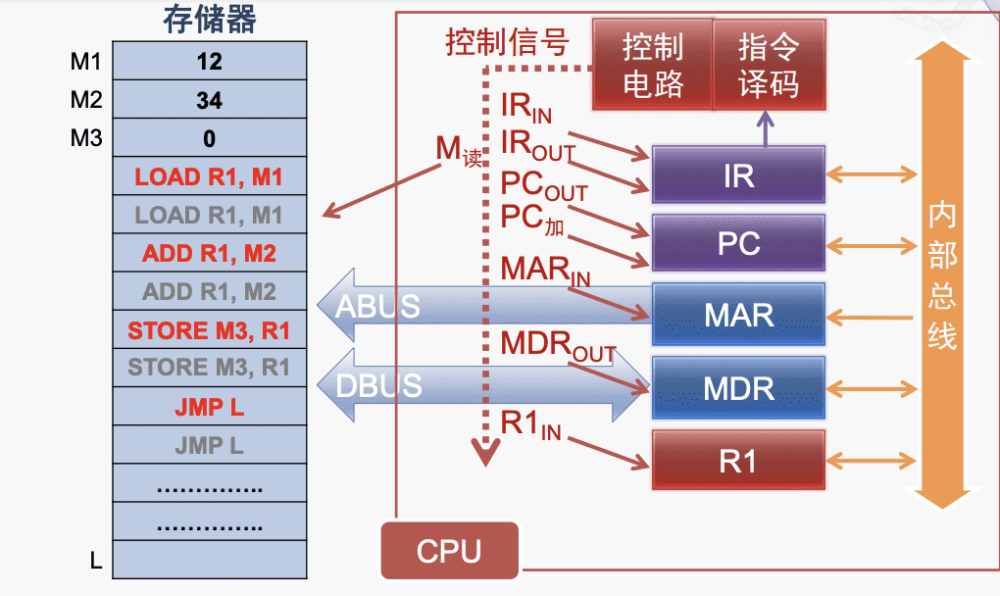
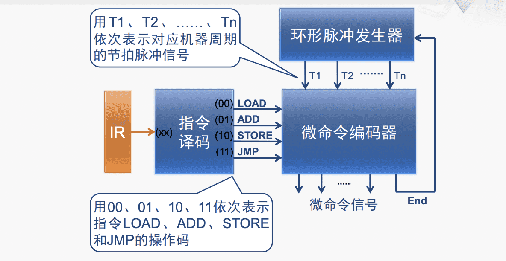
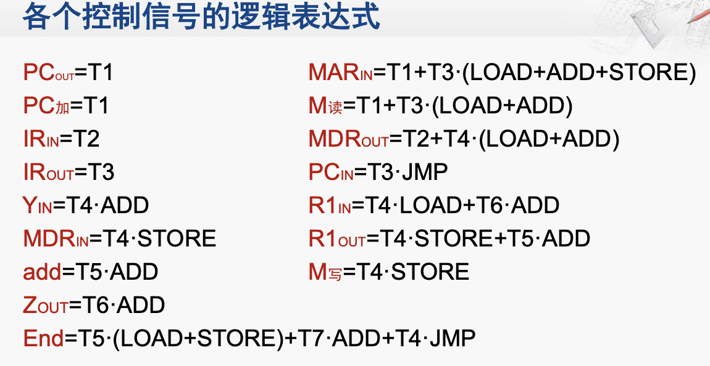

# 计算机组成与体系结构

---
## 控制器的原理与分类
### 控制器基本原理

$\quad$ 基本任务：按照指令每一步操作的需要，发出特定的命令信号

$\quad$ 简化控制信号示例：

$\quad$ 主要分类：**硬布线控制器**和**微程序控制器**

### 硬布线控制器

$\quad$ 也称硬连线控制器或组合逻辑控制器

$\quad$ 主要部件：环形脉冲发生器、指令编码器、微命令编码器

$\quad$ 原理图：

用·表示与，用+表示或，Ti表示第i个机器周期的节拍脉冲信号

$\quad$ **优点**：指令执行速度快

$\quad$ **缺点**：控制逻辑的电路复杂，设计和验证难度大，扩充和修改困难

### 微程序控制器

$\quad$ 发出信号计为1，不发为0，形成信号序列，称为微指令，一段微程序由多个微指令构成

$\quad$ 优点：规整性、灵活性

$\quad$ 缺点：速度较慢

$\quad$ 编码方式：直接表示法、编码表示法、混合表示法

###### 直接表示法

$\quad$ 将每个控制信号都作为微指令中的一位来编码

$\quad$ 优点：简单直观，输出直接用于控制

$\quad$ 缺点：编码效率低

###### 编码表示法

$\quad$ 将微指令代码进行分组编码，将不能同时出现的相斥信号分在一组

$\quad$ 优点：减少存储代码量

$\quad$ 缺点：增加硬件开销与信号延迟

---

