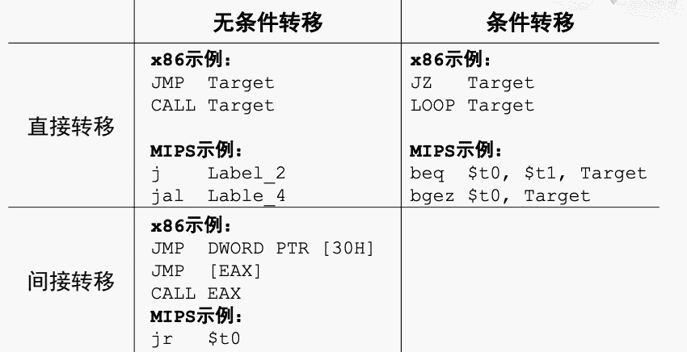
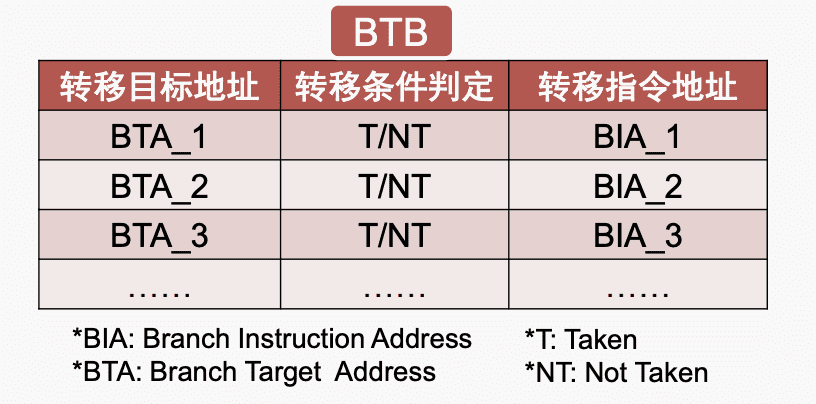
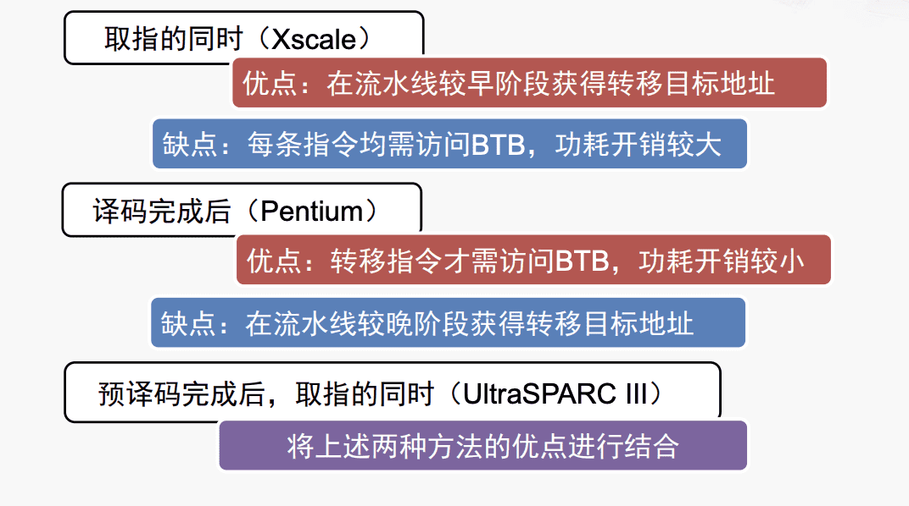
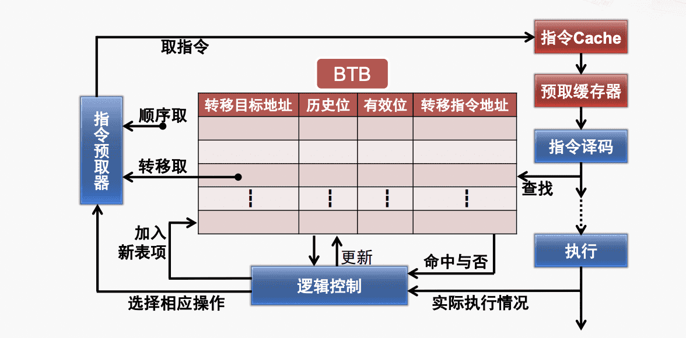
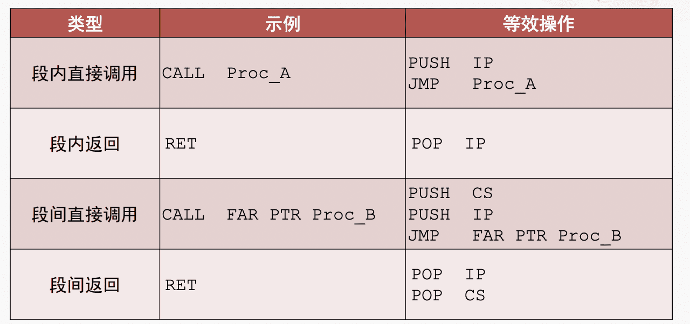
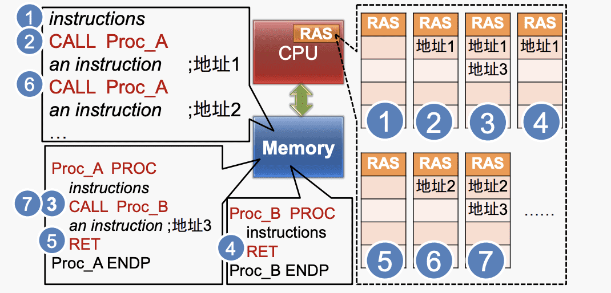

# 计算机组成与体系结构

---
## 流水线优化技术

### 转移指令的影响

$\quad$ 改变指令流向，破坏流水模式

$\quad$ 转移指令损失（Branch Penalty）

$\qquad$ · Alpha 21264:转移损失平均7个周期

$\qquad$ · Pentium III：转移损失平均10～15个周期

$\qquad$ · AMD Athlon K7:转移损失10周期以上

Pipeline stall cycles from branches = Brach Frequency（转移指令占比：10～15%）X Branch Penalty

### 转移预测技术
##### 转移开销：

$\quad$ 当转移指令被执行，并确定发生转移时，产生如下的开销：

$\qquad$ 1. 将按顺序预取的指令废除（即排空流水线）

$\qquad$ 2. 从转移目标地址重新取指令

$\quad$ 构成：

$\qquad$ 1.要不要转移（判定引起的开销）

$\qquad$ 2.转移到哪里（生成目标地址引起的开销）

##### 转移延迟

$\quad$ 在编译过程中通过编辑器调度，在转移指令后插入一条或几条适当的指令，当被调度的指令执行完后，目标地址和判断条件已计算完成

##### 转移预测

$\quad$ 预测“要不要转移”和“转移到哪里”

###### 转移条件预测

$\quad$ **硬件固定预测不转移**：在转移条件判定之前总是顺序地取下一条指令

$\quad$ $\quad$ 优点：实现简单；缺点：预测效果不佳

$\quad$ **编译制导的预测**：在转移指令的编码中增加一位，编译器通过该位预测，1转移0不转移。

$\quad$ $\quad$ 优点：可对不同指令进行不同预测；缺点：需要软件支持和修改ISA，不适应多变的执行环境

$\quad$ **基于偏移的预测**：如果相对偏移为负则预测转移

$\quad$ **基于历史信息的预测**（普遍采用）：转移与否取决于先前转移指令的执行情况。

###### 转移目标地址预测

$\quad$ 转移目标缓冲器BTB（Branch Target Buffer），保存此前若干次转移指令执行时的目标地址

$\quad$ 基本操作：

$\quad$ $\quad$ 1. 分配BTB表项：转移目标第一次执行分配一个表项

$\quad$ $\quad$ 2. BTB表项比较：将需要预测的指令地址与BTB的转移指令地址进行比较，若命中则被执行过且为转移指令

$\quad$ $\quad$ 3. 产生转移目标地址：

$\quad$ $\quad$ 4. 更新BTB

$\quad$ 比较时机：

$\quad$ 工作机制：

### 返回地址栈RAS

$\quad$ 特殊转移指令：过程返回指令RET

$\quad$ 专用预测部件：返回地址栈RAS

###### 指令特点：

$\quad$ 优点：

$\quad$ $\quad$ 1. 无需判定转移条件

$\quad$ $\quad$ 2. 转移目标地址已生成

$\quad$ $\quad$ 3. 出现可预期

$\quad$ 缺点：

$\quad$ $\quad$ 1. 同一条指令地址不同

$\quad$ $\quad$ 2. 转移目标地址访问时间较长

$\quad$ $\quad$ 3. 在流水线晚期才访问存储器获得转移目标地址

###### 运行示例：

---

