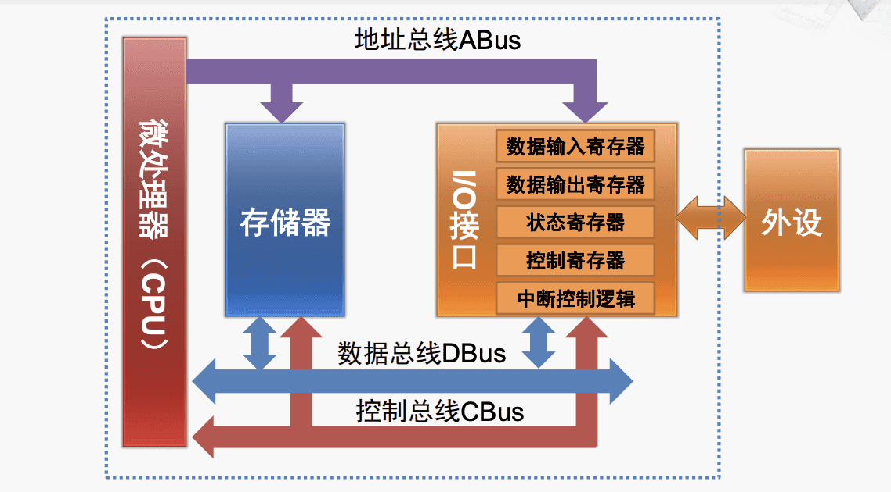
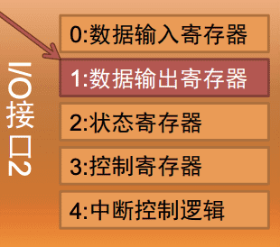
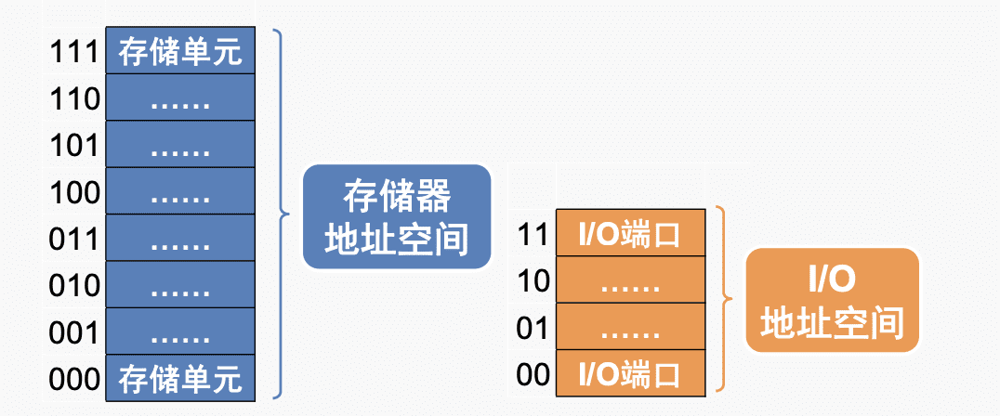
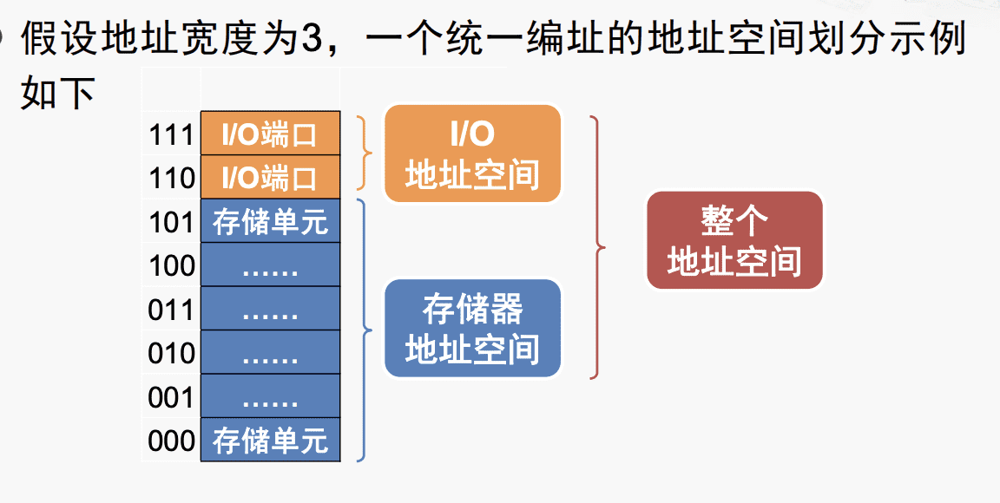
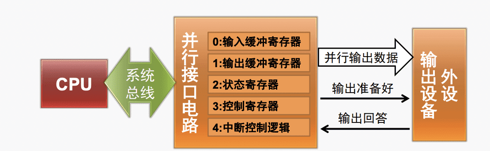
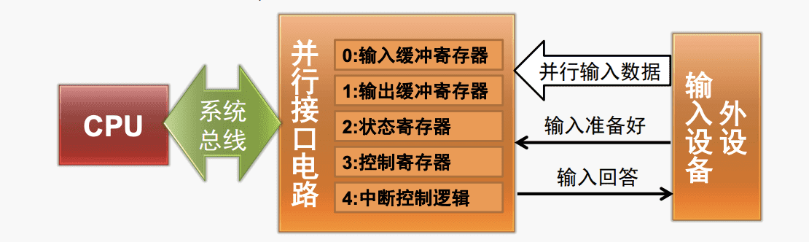
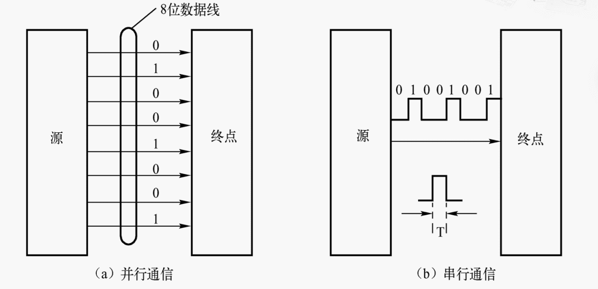
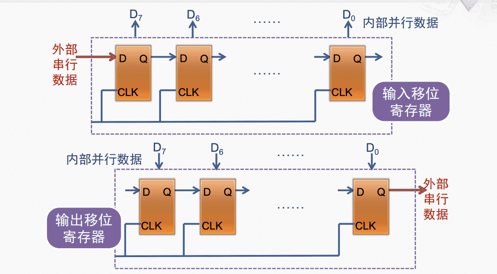
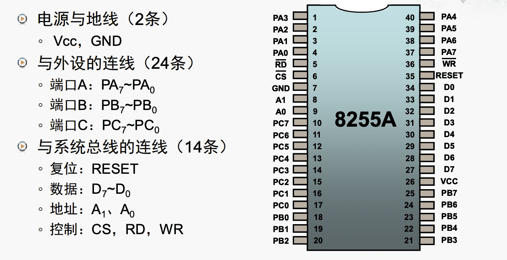
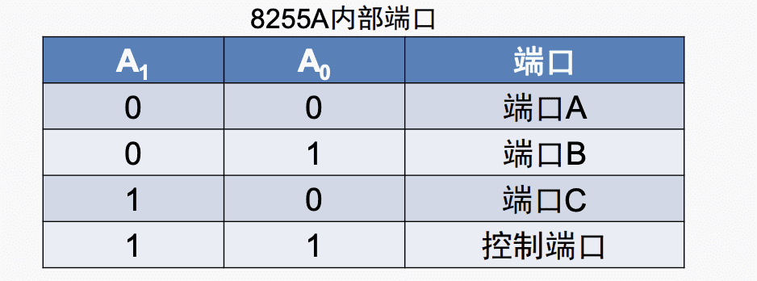

# 计算机组成与体系结构

---
## 输入输出接口

$\quad$ 第一台微型计算机： Altair 8800

### 输入输出接口电路
##### I/O接口的产生原因

$\quad$ 1. CPU和外设之间的速度差距

$\quad$ 2. 外设处理的信息格式和接口信号形式多样

##### I/O接口的基本功能

$\quad$ 1. 数据缓冲——解决CPU和外设之间的速度差距

$\quad$ 2. 提供联络信息——协调同步数据交换工程

$\quad$ 3. 信息和信息格式的转换

$\quad$ 4. 设备选择

$\quad$ 5. 中断管理

$\quad$ 6. 可编程功能

##### I/O接口的基本结构

### 输入和输出的过程
#### I/O端口及其编址方式
##### I/O端口

$\quad$ I/O接口内部包含一组称为I/O端口的寄存器，每个I/O端口都需有自己的端口地址（端口号），以便CPU访问。

$\quad$ 与复杂外设连接时，握手（handshaking）信号成对出现，定时协调与联络。

##### I/O端口编址方式
###### I/O端口和存储器分开编址
示例：

**优点**

$\quad$ - I/O端口不占用存储器地址，不会减少用户的存储器地址空间

$\quad$ -  I/O指令编码短，执行速度快

$\quad$ - I/O指令的地址码较短，地址译码方便

$\quad$ - 采用单独的I/O指令，使程序中的I/O操作和其他操作层次清晰便于理解

**缺点** 

$\quad$ - 内部结构相对复杂，CPU引脚更多

$\quad$ - 处理数据相对间接

###### I/O端口和存储器统一编址
示例：

**优点**

$\quad$ - 可以用访向存储器的指令来访问I/O端口，访问存储器的指令功能比较齐全，可以实现直接对I/O端口以内的数据进行处理

$\quad$ - 可以将CPU中的I/O操作与访问存储器操作统一设计为一套控制逻辑，简化内部结构，同时减少CPU的引脚数目

**缺点** 

$\quad$ - 由于I/O端口占用了一部分存储器地址空间，因而使用户的存储地址空间相对减小

$\quad$  - 由于利用访问存储器的指令来进行I/O操作指令的长度通常比单独I/O指令长，因此指令的执行时间也较长

#####  I/O指令说明
###### IN指令（输入）

$\quad$ 格式： IN AC，PORT

$\quad$ 操作：把外设端口的内容输入到AL或AX

###### OUT指令（输出）

$\quad$ 格式： OUT PORT，AC

$\quad$ 操作：把AL或AX的内容输出到外设端口

###### 寻址方式

$\quad$ **端口地址为0～255**

$\quad$ $\quad$ 直接寻址：用一个字节立即数指定端口地址

$\quad$ $\quad$ 间接寻址：用DX的内容指定端口地址

$\quad$ **端口地址大于255**

$\quad$ $\quad$ 直接寻址：用DX的内容制定端口地址

#### 数据输出过程

$\quad$ 1. CPU执行OUT指令，将控制字写入接口的“控制寄存器”，从而设置接口的工作模式

$\quad$ 2. CPU执行OUT指令，将数据写到接口的“输出缓冲寄存器”

$\quad$ 3. 接口将数据发到“并行数据输出”信号，并将“输出准备好”信号置为己有（亦可由CPU写控制字将该信息置为有效）

$\quad$ 4. 外设发现“输出准备好信号”后，从“并行数据输出”信号接收数据，并将“输出回答信号”置为有效

$\quad$ 5. 接口发现“输出回答”信号有效后，将“状态寄存器”中的状态位“输出缓存器空”置为有效

$\quad$ 6. 在这个过程中，CPU反复执行IN指令从“状态寄存”器中读出状态字，直到发现“输出缓冲器空”，然后开始下一个输出过程，继续输出新数据

$\quad$ （此为程序控制方式，还可以采用终端控制方式）

#### 数据输入过程
 
 
$\quad$ 1. 系统初始化时，CPU执行OUT指令，将控制字写入接口的“控制寄存器”，从而设置接口的工作模式

$\quad$ 2. 外设将数据发到“并行数据输入”信号，并将“输入准备好”信号置为有效

$\quad$ 3. 接口发现“输入准备好”信号有效后，从“并行数据输入”信号接收数据，放入“输入缓冲寄存器”，并将“输入回答”信号置为有效，阻止外设输入新数据

$\quad$ 4. 接口将状态寄存器中的状态位“输入缓存器满”置为有效

$\quad$ 5. 在上述过程中，CPU反复执行IN指令从“状态寄存器“中读出状态字，直到发现”输入缓冲器满“，然后执行IN指令，从“输入缓冲寄存器”中读出数据

$\quad$ 6. 接口将“输入回答”信号置为无效，等待外设输入新数据

 $\quad$ （此为程序控制方式，还可以采用终端控制方式）

### 串行和并行的比较

$\quad$ **串行通信**：数据在单条一位宽的传输线上按时间先后一位一位地进行传送

$\quad$ **并行通信** ：数据在多位宽的传输线上各位同时进行传送

$\quad$ 串口通常指的是RS-232接口（COM接口），并口常指IEEE-1284接口（LPT接口）

##### 传输线上：

$\quad$ 串行传输线数量少，并行传输线数量多

##### 转换上：

$\quad$ 串行通信需要经过复杂的串/并转换，并行不需要

##### 数据传输上：

$\quad$ 同频率下，串行通信数据传输率低，并行通信数据传输率高
##### 串扰上：

$\quad$ 串行通信不存在信号线之间的串扰而并行存在
##### 差分信号传输技术

$\quad$ 发送端在两根线上发送振幅相等、相位相反的信号，接收端比较两个电压差来判断发送的是0或1

$\quad$ **优点**

$\quad$ $\quad$ 抗干扰能力强

$\quad$ $\quad$ 能有效抑制电磁干扰

$\quad$ $\quad$ 时序定位准确

$\quad$ **缺点**

$\quad$ $\quad$ 在电路板上，差分信号一定要走两根等长，等宽，紧密靠近且在同一层面的线，布线难度高

### 并口芯片的应用实例：可编程并行接口8255A

##### 与外设的连线（24条）

$\quad$ 端口A，端口B：PA0～7，PB0～7，可分别设定为输入或输出端口

$\quad$ 端口C：PC0～7 ：通常不用于普通的数据传送，而是作为A和B的”握手信号“，称为“A组”，“B组”

##### 与系统总线的连线

$\quad$ 地址A1，A0：端口选择信号，CS有效时启用

##### 工作方式

$\quad$ 0- 基本输入/输出：单向输入/输出，无握手信号

$\quad$ 1- 选通输入/输出：单向输入/输出，C用于握手信号

$\quad$ 2- 双向传输：双向传输，C用于握手信号

##### XLAT指令说明
$\quad$ 格式：XLAT

$\quad$ 操作：（事先定义字节型数据表）

$\quad$ $\quad$ 1. 从BX中取得数据表起始地址的偏移量

$\quad$ $\quad$ 2. 从AL中取得数据表项索引值

$\quad$ $\quad$ 3. 在数据表中查得表项内容

$\quad$ $\quad$ 4. 将查得表项内容存入AL

---
