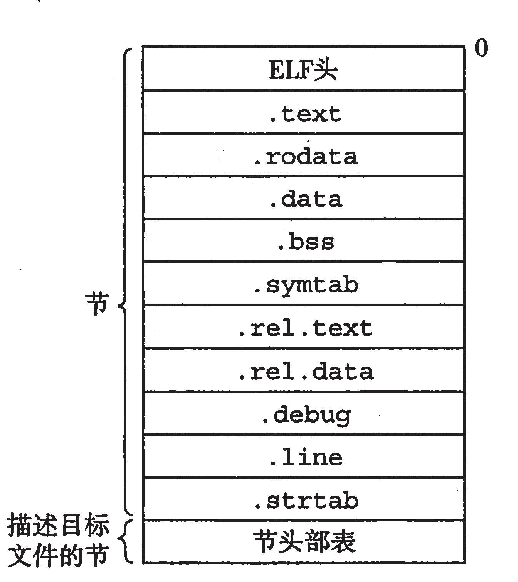
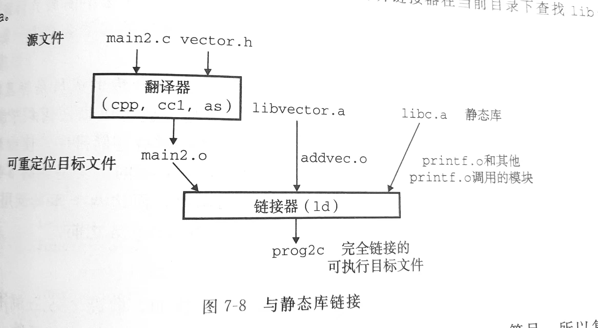
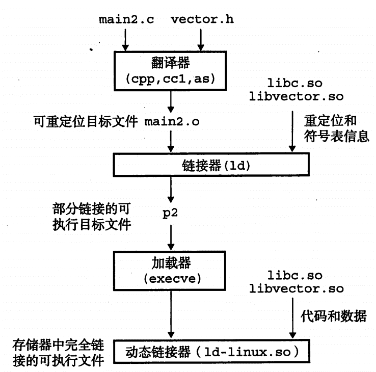

<!-- more -->

# [ICS](https://aki-yzh.github.io/2023/02/18/1-计算机系统漫游&目录)
---
## 七、链接

$\quad$ 链接是把各种代码和数据片段收集并组合成一个单一文件的过程，这个文件可被加载（复制）到内存并执行，链接可以执行于编译时，也就是在源代码被译为机器代码时，也可以执行于加载时，甚至可以执行于运行时。早期链接是手动执行的，而在现代系统中，链接是由链接器自动执行的。

$\quad$ 链接器使得分离编译成为可能。

$\quad$ 编译器驱动程序先运行C预处理器cpp，把源程序翻译成一个ASCII码的中间程序main.i，然后运行C编译器ccl把main.i翻译成main.s,最后运行汇编器as把main.i翻译成ASCII语言汇编文件main.o，另一边同样流程生成swap.o，最后运行链接器程序ld，将main.o和swap.o以及一些必要的系统目标文件组合起来，创建一个可执行目标文件p。

$\quad$ 要执行可执行文件p，shell调用操作系统中一个叫做加载器的函数，将p中的代码复制到内存，然后将控制转移到这个程序的开头。

#### 静态链接

$\quad$ 静态链接器以一组可重定位目标文件和命令行参数作为输入，生成一个完全链接的，可以加载和运行的可执行目标文件作为输出。输出的可重定位目标文件由各种不同的代码和数据节组成，每一节都是一个连续的字节序列

$\quad$ 为了构造可执行性文件，链接器必须完成两个主要任务：

$\quad$ $\quad$ 1.符号解析：每一个符号对应于一个函数，一个全局变量或者一个静态变量（static），使得每一个符号引用恰好和每一个符号定义关联起来

$\quad$ $\quad$ 2.重定位：编译器和汇编器生成从地址0开始的代码和数据节，链接器通过把每个符号定义和一个内存位置关联起来，从而重定位这些节，然后修改所有对这些符号的引用。

$\quad$ 目标文件有三种形式：

$\quad$ $\quad$ 1.可重定位目标文件：包含二进制代码和数据，可以在编译时和其他可重定位文件合并。

$\quad$  $\quad$ $\quad$ .text:已编译程序的机器代码

$\quad$ $\quad$ $\quad$.rodata：只读数据，比如printf语句中的格式串“%d……”和开关语句的跳转表

$\quad$ $\quad$ $\quad$.data：已经初始化的全局和静态C变量

$\quad$ $\quad$ $\quad$.bss: 未初始化的全局和静态C变量

$\quad$ $\quad$ $\quad$.symtab：符号表

$\quad$ $\quad$ $\quad$.debug：调试符号表

$\quad$ $\quad$ $\quad$ 其余不重要

$\quad$ $\quad$ $\quad$ $\quad$ **符号表**

$\quad$ $\quad$ $\quad$ $\quad$ $\quad$ 对于一个模块m

$\quad$ $\quad$ $\quad$ $\quad$ $\quad$ 非静态的局部变量不在符号表里，由栈进行管理。

$\quad$ $\quad$ $\quad$ $\quad$ $\quad$ $\quad$ 有以下3种不同符号：

$\quad$ $\quad$ $\quad$ $\quad$ $\quad$ $\quad$ 1.由模块m定义并能被其他模块引用的全局符号（GLOBAL），对应于非静态的C函数和全局变量

$\quad$ $\quad$ $\quad$ $\quad$ $\quad$ $\quad$ 2.有其他模块定义并能被模块m引用的全局符号，成为外部符号，对应于在其他模块定义的非静态C函数和全局变量

$\quad$ $\quad$ $\quad$ $\quad$ $\quad$  $\quad$ 3.只被m定义和引用的局部符号（LOCAL），对应于带static属性的C函数和全局变量

$\quad$ $\quad$ $\quad$ $\quad$ $\quad$ 伪节：

$\quad$ $\quad$ $\quad$ $\quad$ $\quad$ $\quad$ ABS：不该被重定位的表

$\quad$ $\quad$ $\quad$ $\quad$ $\quad$ $\quad$ UNDEF:未被定义的符号，代表在本目标模块中被引用，却在其他地方定义的符号

$\quad$ $\quad$ $\quad$ $\quad$ $\quad$ $\quad$ COMMON 未初始化的全局变量

$\quad$ $\quad$ bind表示符号是全局还是局部（GLOBAL or LOCAL），type表示类型（FUNC or OBJECT）ndx表示所在的表（由节头部表中代表的整数索引或者UND表示）

$\quad$ $\quad$ 2.可执行目标文件：可以直接被复制到内存并执行，不在需要.rel节

$\quad$ $\quad$ 3.共享目标文件：特殊的可重定位目标文件，可以在加载或者运行时被动态地加载进内存并链接。

$\quad$ 符号解析：

$\quad$ $\quad$ 编译器向汇编器输出每个全局符号，或者是强或者是弱，而汇编器隐含地把这个信息编码在可重定位目标文件的符号表里。函数和已初始化的全局变量是强符号，未初始化的全局变量时弱符号。

$\quad$ $\quad$ 规则：不允许有多个同名的强符号，优先选择强符号，不然任意选择。

$\quad$ 与静态库链接：

$\quad$ $\quad$ 所有的编译系统都提供一种机制，把所有相关的目标文件打包成一个单独的文件，称为静态库。可以用作链接器的输入。当链接器构造一个输出的可执行文件时，它只复制静态库里被应用程序引用的目标模块。

$\quad$ $\quad$ 利用静态库减少了可执行文件在磁盘和内存中的大小

  $\quad$ 重定位：

$\quad$ 重定位由两步组成

$\quad$ $\quad$ $\quad$ 1.重定位节和符号定义：链接器把所有相同类型的节合并为同一类型的新的聚合节，内存地址赋给新的聚合节，此时程序中的每条指令和全局变量都有唯一的运行时的内存地址了。

$\quad$ $\quad$ $\quad$ 2.重定位节中的符号引用：修改符号引用使其指向正确的运行地址。

$\quad$ $\quad$ $\quad$ 重定位类型：

$\quad$ $\quad$ $\quad$ $\quad$ 1.R_X86_64_PC32：PC相对引用，距离PC当前运行值的偏移量

$\quad$ $\quad$ $\quad$ $\quad$ 2.R_X86_64_32:绝对引用，不需要进一步修改

$\quad$ $\quad$ $\quad$ $\quad$ 汇编器会在后一行上告知进行何种引用

$\quad$ $\quad$ $\quad$ $\quad$ 重定位的计算参考书P481，分为重定位相对引用的计算和绝对引用的计算。

$\quad$ $\quad$ $\quad$ 相对引用：

$\quad$ $\quad$ $\quad$ $\quad$ ADDR（s)=ADDR(.text)

$\quad$ $\quad$ $\quad$ $\quad$ ADDR(r.symbol)=ADDR(函数\变量名)

$\quad$ $\quad$ $\quad$ $\quad$ 运行时地址refaddr=ADDR(s)+r.offset

$\quad$ $\quad$ $\quad$ $\quad$ *refptr=ADDR(r.symbol)+r.addend-refaddr

$\quad$ $\quad$ $\quad$ 绝对引用：

$\quad$ $\quad$ $\quad$ $\quad$ ADDR(r.symbol)=ADDR(函数\变量名)

$\quad$ $\quad$ $\quad$ $\quad$ *refptr=ADDR（r.symbol）+r.addend

$\quad$ 加载可执行目标文件：

$\quad$ $\quad$ 把程序复制到内存并运行的过程叫做加载

$\quad$ $\quad$ 在程序头部表的引导下，加载器把可执行文件的片复制到代码段和数据段，接着加载器跳转到程序的入口点，即_start函数的地址。

#### 动态链接

$\quad$ 共享库是一个目标模块，在运行或加载时，可以加载到任意的内存地址，并和一个在内存中的程序链接起来，这个过程叫做动态链接，是由一个叫做动态链接器的程序来执行的。

!

$\quad$ $\quad$ 动态链接器先重定位libc.so文本和数据到某个内存段，在重定位 libvector.so的文本和数据到另一个内存段，最后重定位二者中所有对定义的符号的引用

$\quad$ 共享库的一个主要目的就是允许多个正在运行的进程共享内存中相同的库代码，节约宝贵的内存资源。

$\quad$ 可以加载无需重定位的代码叫做位置无关代码(PIC)，共享库的编译必须总是使用该选项。

$\quad$ 在数据段开始的地方创建全局偏移量表（GOT）。

$\quad$ 延迟绑定能够避免动态链接器在加载时进行不必要的重定位。

$\quad$ 过程链接表（PLT）PLT[0]特殊，PLT[1]调用系统启动函数，从PLT[2]开始调用用户代码调用的函数
　
-   $\quad$ GOT[0]：`.dynamic`的地址

-   $\quad$ GOT[1]：重定位条目的地址

-   $\quad$ GOT[2]：动态链接器的地址

-   $\quad$ GOT[3]：系统启动函数

-   $\quad$ GOT[4]开始：调用的函数

---
	