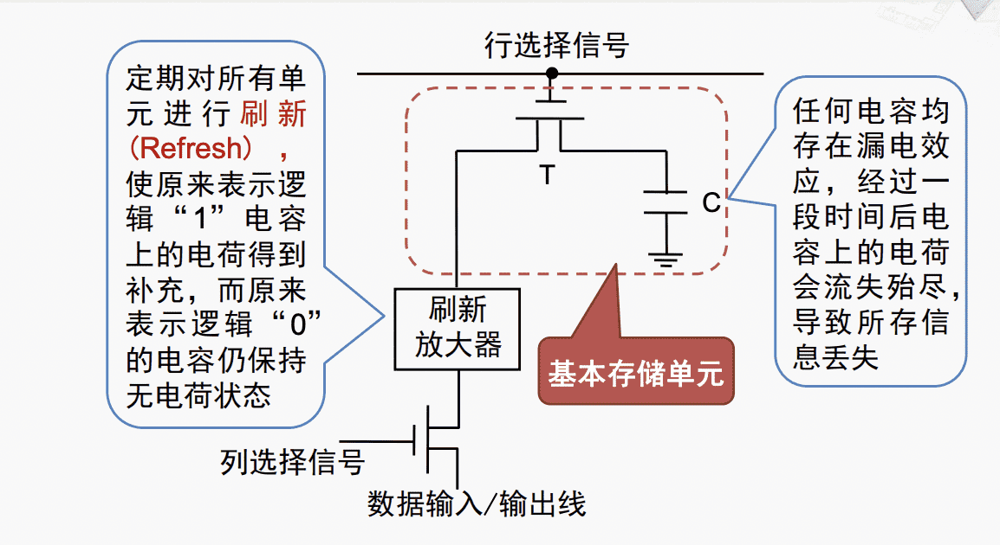

# 计算机组成与体系结构

---
## 中断和异常

### 中断与异常
#### 起源

**第一个带有异常处理的系统**： UNIVAC，1951年：算术运算溢出时，转向地址0执行两条修复指令，或者停机。1955年新增外部中断用于风洞数据的实时收集。

**第一个带有外部中断的系统**： DYSEAC，1954年：有两个程序计数器PC，根据I/O信号进行切换。

#### CPU遇到的事件

$\quad$ 在程序运行时，系统外部、内部或现行程序本身出现需要特殊处理的事件，CPU立即强行终止现行程序的运行，改变机器的工作状态并启动相应的程序来处理这些事件，处理完成后，CPU恢复原来的程序运行。这些事件被称为“中断”或者“异常”。

##### MIPS CPU的异常处理

$\quad$ 1. 在EPC（异常程序计数器）中保存出现异常的指令的地址（需要减4）

$\quad$ 2. 清空流水线中之后的指令

$\quad$ 3. 记录产生异常的原因

$\quad$ 4. 将控制权转交给操作系统的特定地址，转移到特定地址执行下一条指令

##### 中断向量

$\quad$ 中断服务程序的入口地址

$\quad$ 每个中断类型对应一个中断向量（4字节），前两个字节单元存放中断服务程序入口地址的偏移量（IP），低字节在前，高字节在后；后两个字节单元存放中断服务程序入口地址的段基值（CS），低字节在前，高字节在后。

###### 中断的检测

###### 中断向量表

### 中断控制器

 $\quad$ 外部中断的需求：

 $\quad$ $\quad$ - 优先级：多个中断请求同时出现，如何确定响应次序？

 $\quad$ $\quad$ - 屏蔽：可否屏蔽指定I/O接口设备的中断请求

 

#### 优先级的确定

##### 1.软件查询确定中断优先级

$\quad$ 只需要少量硬件电路

$\quad$ 查询程序：一般来说，先查速度较快或者实时性较高的设备，它们优先级较高。

##### 2.硬件中断优先级编码电路

 $\quad$ 菊花链优先级排队电路：在每个设备接口设置一个简单的逻辑电路，根据优先级顺序来传递或截流CPU发出的中断响应信号，以实现响应中断的顺序。

 
##### 3.可编程中断控制器

$\quad$ 现代PC机中多采用可编程中断控制器（PIC，高级APIC）来处理中断

### 定时器
#### 计数与定时

$\quad$ **计数**

$\quad$ $\quad$ 对外部事件发生的次数进行计量

$\quad$ **定时**

$\quad$ $\quad$ 主要是指产生一段准确的时延

$\quad$ $\quad$ 定时是对固定的时间单位进行计数，本质上也是计数，是以计数为基础的

##### 主要用途

$\quad$ **计算机系统**

$\quad$ $\quad$ 提供系统的日时钟

$\quad$ $\quad$ 接口电路的工作节拍，信息传送的同步信号

$\quad$ $\quad$ 保证在确定时刻完成规定动作

$\quad$ $\quad$ 提供时间基准，供操作系统切换进程

$\quad$ **工业测控系统**

$\quad$ $\quad$ 对产品计数，定时进行某些行为

$\quad$ **声音/音乐**

$\quad$ $\quad$ 由计数/定时的基本功能派生而来

#### 可编程计数/定时器

$\quad$ 软硬件相结合的定时计数方法

$\quad$ 特点：功能灵活，使用方便

##### 结构

$\quad$ CLK:时钟输入信号

$\quad$ GATE：门控输入信号，对计数过程进行控制

$\quad$ OUT：计数输出信号，“计数到零/定时时间到”输出

###### 方式2:分频器

$\quad$ 输出波形：每输入N个CLK脉冲，输出宽度为1个CLK周期的负脉冲

$\quad$ 触发方式：软件启动，自动重复，周期性输出固定频率的脉冲

$\quad$ 用途：脉冲速率发生器

**DRAM定时刷新**

###### 方式3:方波发生器

$\quad$ 输出波形：对称方波或基本对称的矩形波

$\quad$ 触发方式：软件启动，自动重复，周期性输出固定频率的方波

$\quad$ 用途：产生系统时钟，扬声器发声控制

### 系统中的中断与定时

---
