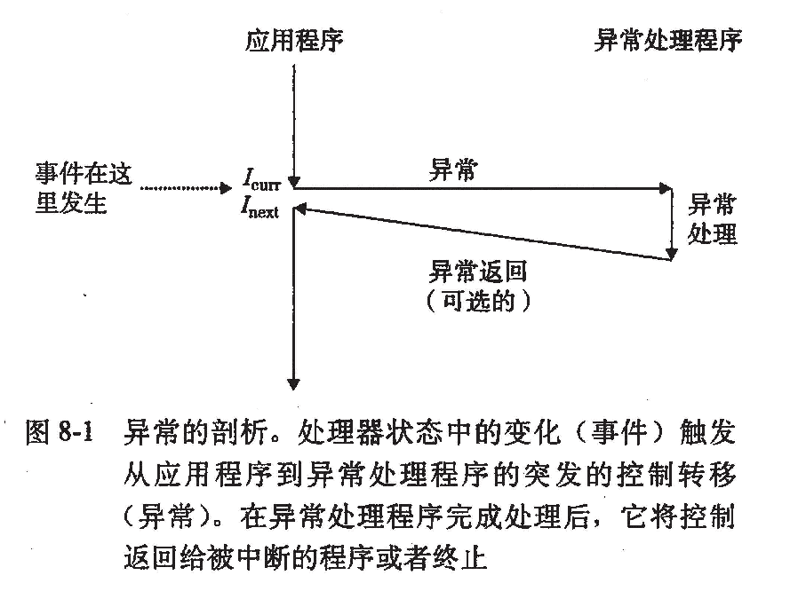
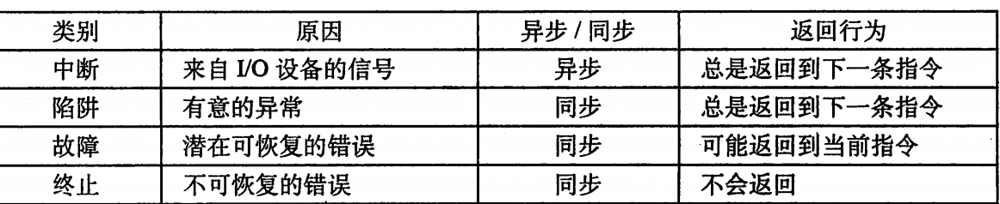
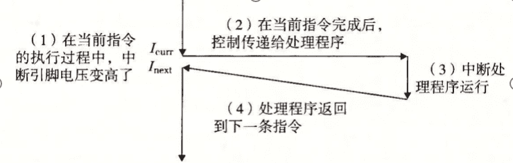
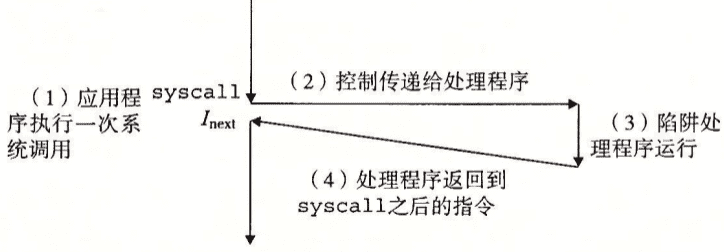
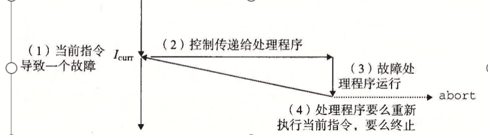
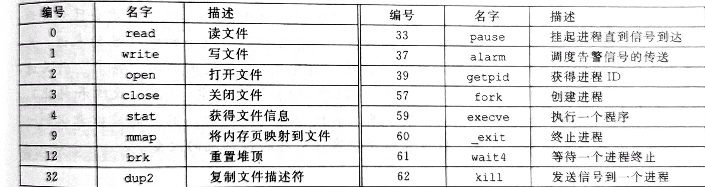
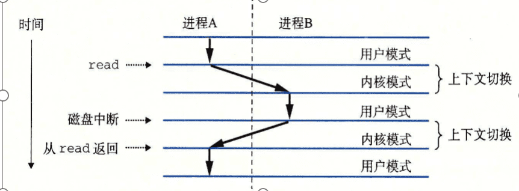
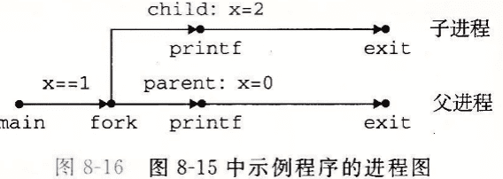
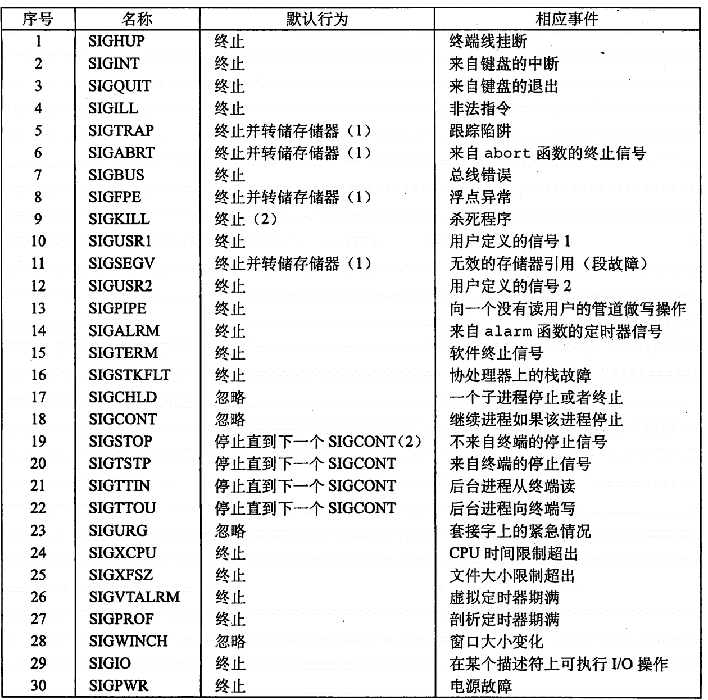
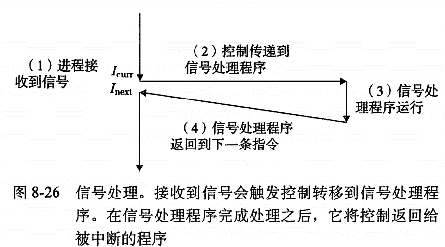

# [ICS](https://aki-yzh.github.io/2023/02/18/1-计算机系统漫游&目录)
---
## 八、异常控制流（ECF）

$\quad$ ECF是操作系统用来实现I/O，进程和虚拟内存的基本机制。

#### 8.1 异常

$\quad$ 异常就是控制流中的突变，用来响应处理器状态中的某种变化。

$\quad$ 当处理器状态发生一个重要的变化时，处理器正在执行某个当前指令 $I_{curr}$ .在处理器中，状态被编码为不同的位和信号。状态变化称为事件，事件可能和当前指令的执行直接相关。

$\quad$ 在任何情况下，当处理器检测到有事件发生时，它就会通过一张叫做异常表的跳转表，进行一个间接过程调用（异常），到一个专门设计用来处理这类事件的操作系统子程序（异常处理程序）。当异常处理程序完成处理后，根据引起异常的事件的类型，会发生以下三种情况中的一种：

$\quad$ 1) 处理程序将控制返回给当前指令 $I_{curr}$ ,即当事件发生时正在执行的指令。

$\quad$ 2) 处理程序将控制返回给 $I_{next}$ ,如果没有异常将会执行的下一条指令

$\quad$ 3) 处理程序终止被中断的程序

**异常的分类**

$\quad$ 1. 中断：

$\quad$  中断是异步发生的，是来自处理器外部的I/O设备的信号的结果。

造成以下异常的指令称为故障指令。

$\quad$ 2. 陷阱：

$\quad$   陷阱是有意的异常，是执行一条指令的结果，是同步的，总是返回到下一条指令，陷阱最重要的用途是在用户程序和内核之间提供一个像过程一样的接口，叫做系统调用。

$\quad$ 3. 故障：

$\quad$   故障由错误情况引起，它可能被故障处理程序修正。如果能被修正，则将控制返回到引起故障的指令，否则返回内核中的abort例程。

$\quad$ 4.  终止：

$\quad$  终止是不可恢复的致命错误造成的结果，通常是一些硬件错误。

**Linux/x86-64 系统中的异常**

| 异常号 | 描述 | 异常类别 |
|----|----|----|
| 0  | 除法错误（浮点异常）| 故障|
| 13 | 一般保护故障 | 故障|
| 14 | 缺页 | 故障|
| 18 | 机器检查 | 终止|
|32~255 | 操作系统定义的异常 | 中断或陷阱 |

**Linux/x86-64 系统调用**

~~~cpp
//用write写helloword
int main()
{
    write(1,"hello,world\n",13);
    _exit(0);
}//第一个参数将输出发送到stdout，第二个参数是要写的字节序列，第三个参数是要写的字节数。
~~~

#### 8.2 进程

$\quad$ 进程的经典定义是一个执行中程序的实例。系统中的每个程序都在某个进程的上下文中。上下文是由程序正确运行所需的状态组成的，这个状态包括存放在内存中的程序的代码和数据，它的栈，通用目的寄存器的内容，程序计数器，环境变量以及打开文件描述符的集合。

**逻辑控制流**
$\quad$ 进程是轮流使用处理器的，每个进程执行它的流的一部分，然后被抢占（暂时挂起），然后轮到其他进程。

**并发流**

$\quad$ 一个逻辑流的执行在时间上与另一个流重叠

$\quad$ 并发流的进程实际上仍是交错的，处理器不会同时处理两个进程

**私有地址空间**

$\quad$ 这个空间中某个地址关联的内存不能被其他进程读写

$\quad$ 每个私有地址空间都有相同的通用结构

**用户模式与内核模式**

$\quad$ 设置了模式位就运行在内核模式中，否则运行在用户模式中。

$\quad$ 内核模式可以执行任何指令，访问系统的任何位置。

$\quad$ 进程从用户模式变为内核模式的唯一方法是通过异常，处理程序运行在内核模式中，当它返回到$\quad$ 应用程序代码时，处理器改回到用户模式

**上下文切换（控制转移）**

$\quad$ 保存当前进程的上下文->恢复某个先前被抢占的进程保存的上下文-> 将控制传递给新恢复的进程

#### 8.3 系统调用错误处理

$\quad$ 默认使用错误处理包装函数，使代码简洁

#### 8.4 进程控制

**获取进程id**

$\quad$ 每个进程都有一个唯一的正数进程ID（PID）

~~~cpp
#include<sys/types.h>
#include<unistd.h>
pid_t getpid(void);//返回调用进程的pid
pid_t getppid(void);//返回父进程的pid
~~~

**创建和终止进程**

$\quad$ 进程总是处于以下三种状态之一：

$\quad$ $\quad$ 运行：要么在CPU上执行，要么在等待被执行且最终会被内核调度

$\quad$ $\quad$ 停止： 进程的执行被挂起，且不会被调度。

$\quad$ $\quad$ 终止： 收到终止信号/从主程序返回/调用exit函数

~~~cpp
void exit(int status);//exit函数以status退出状态来终止进程。
~~~
$\quad$父进程通过调用fork函数创建一个新的运行的子进程
~~~cpp
pid_t fork(void);
~~~

$\quad$ 两个进程并发执行，地址空间相同但独立，共享打开的文件

$\quad$ 调用一次，返回两次，父进程返回子进程的PID，子进程总是返回0。

$\quad$ 父进程和子进程之间最大的区别在于他们拥有不同的PID。

$\quad$ 返回值提供了一个明确的方法来分辨程序是在父进程还是在子进程中执行。

进程图

$\quad$ 每个顶点是一条语句的执行

$\quad$ main是起始点

$\quad$ 并发式程序的语句执行存在拓扑排序

**回收子进程**

$\quad$ 子进程终止后保持一个已终止的状态直到被父进程回收

$\quad$ 父进程终止后内核会安排init(PID=1)为其所有孤儿进程的养父

$\quad$ 一个进程可以通过调用waitpid函数来等待它的子进程终止或停止,成功返回子进程的pid，如果WNOHANG，返回0，否则返回-1.

~~~cpp
pid_t waitpid(pid_t pid , int *statusp,int options);
~~~

$\quad$ pid: 判定等待集合（>0，单一子进程；=-1，所有子进程）

$\quad$options：可修改的默认行为(WNOHANG：任何子进程都未终止返回0； WUNTRACED：$\quad$挂起调用进程的执行，直到等待集合中的一个进程变为已终止或被停止； WCONTINUED：挂起调用进程的执行，知道等待集合中的一个被停止的进程收到SIGCONT信号重新开始执行)（也可以用｜组合起来）

$\quad$ statusp：检查已回收子进程的退出状态

$\qquad$ WIFEXITED：子进程通过调用exit或者return正常终止，true

$\qquad$ WEXITSIATUS：返回一个正常终止子进程的退出状态

$\qquad$ WIFSIGNALED： 如果子进程是因为一个未被捕获的信号终止的，那么就返回真

$\qquad$ WTERMSIG：返回导致子进程终止的信号的编号

$\qquad$ WIFSTOPPED： 如果引起返回的子进程当前是停止的，那么就返回真

$\qquad$ WSTOPSIG：返回引起子进程停止的信号的编号

$\qquad$ WIFCONTINUED：如果子进程收到SIGCONT信号重新启动，则返回真。

$\quad$ 错误条件：如果调用进程没有子进程，那么waitpid返回-1，并设置errno为ECHILD，如果waidpid函数被一个信号中断，返回-1，设置errno为EINTR。

**wait函数**

$\quad$ 等价于waitpid(-1,&status,0);

**让进程休眠**

$\quad$ sleep函数将一个进程挂起一段指定的时间
~~~cpp
unsigned int sleep(unsigned int secs);
~~~

$\quad$ 如果请求的时间量已经到了，返回0，否则返回还剩下要休眠的秒数

~~~cpp
int pause(void);
~~~

$\quad$ pause函数让调用函数休眠直到该进程收到一个信号

**加载并运行程序**

$\quad$ execve函数在当前进程的上下文中加载并运行一个新程序

~~~cpp
int execve (const char *filename,const char *argv[],const char *envp[]);
~~~

$\quad$ 加载并运行可执行目标文件filename，且带参数列表argv和环境变量列表envp。成功不返回，错误返回-1。

**shell：交互型应用级程序**

$\quad$ 命令行->parseline->builtincommand

$\quad$ 最后一个参数：

$\qquad$ &->后台执行

$\qquad$ 其他->前台执行

#### 8.5 信号

**发送信号**

$\quad$ 内核通过更新目的进程中上下文中的某个状态，发送一个信号给目的进程。

$\quad$ 原因：1.内核检测到一个系统事件，比如除0错误或子进程终止2.一个进程调用了kill函数，显式地要求内核发送一个信号给目的进程。

$\quad$ 一个进程可以发送信号给它自己。

$\quad$ 发送信号基于进程组，进程组由一个正整数进程组ID来标识。

~~~cpp
pid_t getpgrp(void);//返回当前进程的进程组ID
~~~

$\quad$ 默认地，一个子进程和它的父进程同属于一个进程组，一个进程可以通过setpgid来改变自己或者其他进程的进程组。将进程pid的进程组改为pgid，如果pid是0，那么就使用当前进程的PID，如果pgid是0，那么就用pid指定的进程的PID作为进程组id。
~~~cpp
int setpgid(pid_t pid,pid_t pgid);//成功返回0，错误返回-1；
~~~

发送途径：

$\qquad$ *用/bin/kill程序发送信号*：/bin/kill -9 114514 ->发送信号9给进程114514，符号表示发给进程组中的每个进程。

$\qquad$ 从键盘发送信号

$\qquad$ 用kill函数发送信号 ,pid大于0，发送sig到pid；pid等于0，发送sig到调用进程所在进程组中的每个进程，pid小于0，发送sig到|pid|中的每个进程。

~~~cpp
int kill(pid_t pid ,int sig);//成功返回0，错误返回-1
~~~

$\qquad$ 用alarm函数发送信号：向自己发送SIGALRM信号

~~~cpp
unsigned int alarm(unsigned int secs);//返回前一次闹钟剩余的秒数，若没设定，返回0
~~~

$\qquad$ 

**接收信号**

$\quad$ 目的进程被内核强迫对信号作出反应，进程p从内核模式切换到用户模式时，若待处理信号集合为空，控制传递到p的下一条指令；若非空，选择某个信号k，强制p接受k

**待处理信号**

$\quad$ 发出但没有被接收的信号

$\quad$ 任何时候一个类型至多有一个待处理信号（用pending位向量维护，传送时设置，接收时清除）

**阻塞/解除阻塞信号**

$\quad$ 隐式阻塞：默认阻塞当前正在处理信号的同类型信号

$\quad$ 显式阻塞：sigprocmask函数和相关函数，明确地阻塞/解除阻塞指定的信号
~~~cpp
#include<signal.h>
int sigprocmask(int how,const sigset_t *set,sigset_t *oldset);
int sigemptyset(sigset_t *set);
int sigfillset(sigset_t *set);
int sigaddset(sigset_t *set,int signum);
int sigdelset(sigset_t *set,int signum);
/* 成功返回0，出错-1 */
int sigismember(const sigset_t *set,int signum);
//signum是set成员返回1，不是则0，出错-1
~~~
how：
$\qquad$ SIG_BLOCK：把set中的信号添加到blocked中

$\qquad$ SIGUNBLOCK：从block中删除set中的信号

$\qquad$ SIG_SETMASK：BLOCK=set

**编写信号处理程序**

$\quad$ 安全的信号处理：

$\qquad$ 处理程序尽可能简单

$\qquad$ 只调用异步信号安全的函数（可重入，不可被信号处理程序中断）

$\qquad$ $\qquad$ SIO包：安全打印简单信息

~~~cpp
#include<csapp.h>
ssize_t sio_putl(long v);//向标准输出传送long类型数
ssize_t sio_puts(char s[]);//向标准输出传送一个字符串
~~~

$\qquad$ 保存和恢复errno

$\qquad$ 阻塞所有信号，保护对共享全局数据结构的访问

$\qquad$ 用volatile声明全局变量->阻止编译器缓存变量

$\qquad$ 用sig_atomic_t声明标志

**同步流以避免并发错误**

$\qquad$ 由于父进程和子进程并发进行，可能存在竞争，导致信号丢失

$\qquad$ 解决：调用前阻塞信号

#### 8.6 非本地跳转

$\quad$ 将控制直接从一个函数转移到另一个函数（无需调用返回）

$\quad$ 通过setjmp和longjmp提供
~~~cpp
#include<setjmp.h>
int setjmp(jmp_buf env);//在env缓冲区中保存当前调用环境
int sigsetjmp(sigjmp_buf env,int savesigs);//从env缓冲区恢复调用环境，并触发最近一个setjmp的返回
~~~

---
