# 计算机组成与体系结构

---
## 总线
$\quad$ 在多于两个模块（设备或子系统）间传送信息的公共通路

$\quad$ 组成：传输信息的电路和管理信息传输的协议
### 总线的分类
#### 1. 片总线
$\quad$ 又称器件级总线——”片上总线“，是中央处理器芯片内部的总线
#### 2. 内总线
$\quad$ 又称系统总线或板级总线，是计算机系统各插件版之间信息传输的通路，通常称为微型计算机总线的即指内总线。
#### 3. 外总线
$\quad$ 又称通信总线，是计算机系统之间，或者计算机系统与其他系统之间信息传输的通路
### 总线的基本结构
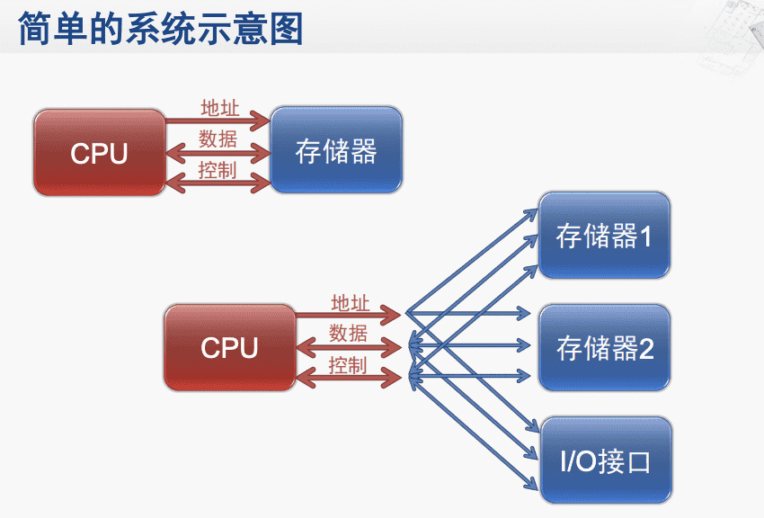

#### 总线模块
##### 总线主模块（Bus Master)
$\quad$ 具有总线控制能力，在获得总线控制权之后能启动总线传输（读数据或写数据）

$\quad$ 示例： CPU，DMA控制器
##### 总线从模块 （Bus Slave）
$\quad$ 能够对总线传输作出响应（接收写数据、返回读数据、返回“错误”响应等），但本身不具备总线控制能力

$\quad$ 示例：存储器
#### 总线译码器
$\quad$ 功能：根据当前控制总线的主模块提供的地址，选择作为本次总线传输目标的从模块

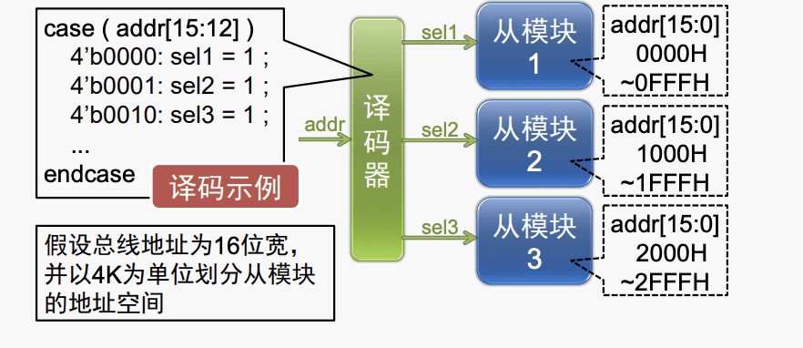
#### 总线仲裁器
$\quad$ 功能：在总线上有多个主模块同时请求使用总线时，决定由哪个主模块获得总线控制权 

$\quad$ 目的：让总线得到合理、高效地使用
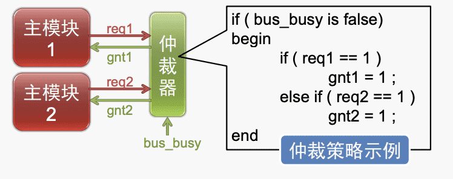
#### 总线示意图
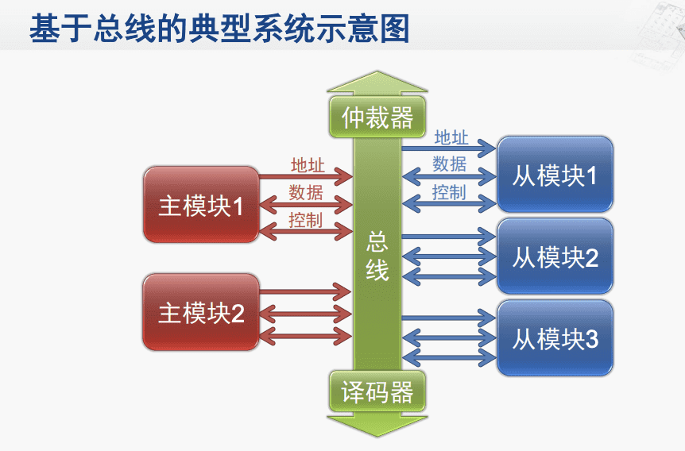

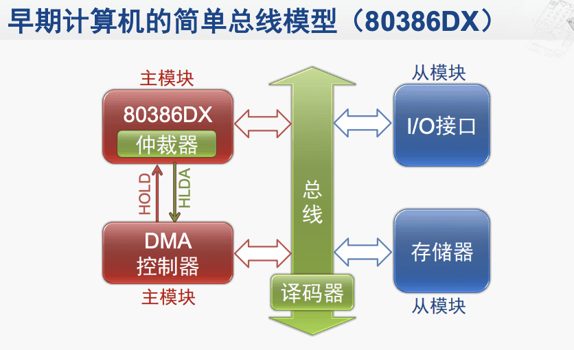
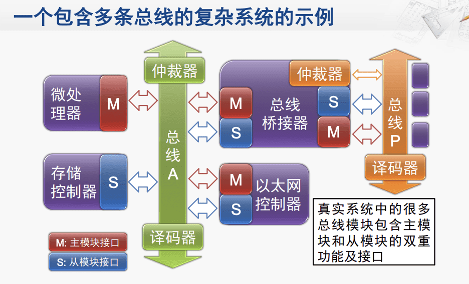
### 总线协议
#### 总线标准
##### 产生途径

**事实标准**

$\quad$ 计算机系统厂家所采用的一种总线，由于其性能优越，逐渐形 成一种被业界广泛支持和承认的事实总线标准

**国际标准**

$\quad$ 在国际标准组织或机构主持下开发和制定的总线标准，公布后由厂家和用户使用

##### 内容

$\quad$ **1- 机械特性**： 规定模块插件的机械尺寸，总线插头、插座的规格及位置等。

$\quad$ **2- 电气特性**： 规定总线信号的逻辑电平、噪声容限以及负载能力等

$\quad$ **3-功能特性**：给出各总线信号的名称及功能定义

$\quad$ **4-规程特性**：对各总线信号的动作过程及时序关系进行说明
##### 举例
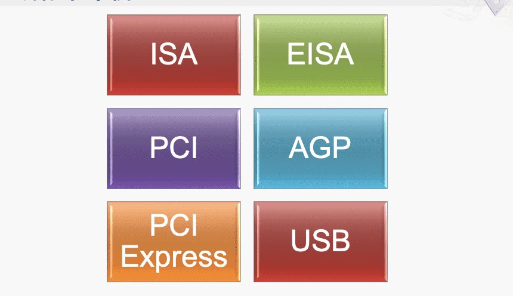

$\quad$ 2000年前后EISA逐渐退出市场
###### PCI Express

$\quad$ ◦ 串行方式传输数据，依靠高频率获得高性能 

$\quad$ ◦ 全双工运作模式，同时进行数据发送和接收 

$\quad$ ◦ 点对点连接结构，而非传统的共享结构

$\quad$ ◦ 使用“端到端的数据传送方式” ，两端都含有TX(发送逻辑)和RX(接收逻辑)

$\quad$ ◦ PCIe总线物理层采用差分信号传输

$\quad$ $\quad$ $\quad$ 优点：抗干扰能力强，能有效抑制电磁干扰，时序定位准确

$\quad$ $\quad$ $\quad$ 缺点：在电路板上，差分信号一定要走 两根等长、等宽、紧密靠近且在 同一层面的线，布线难度高

#### 协议实例-AMBA
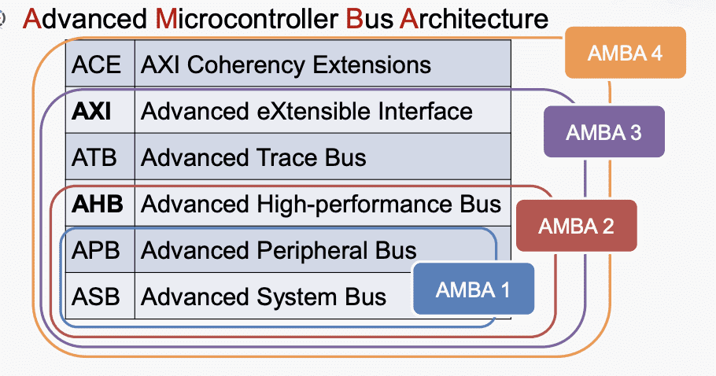
##### 基本结构
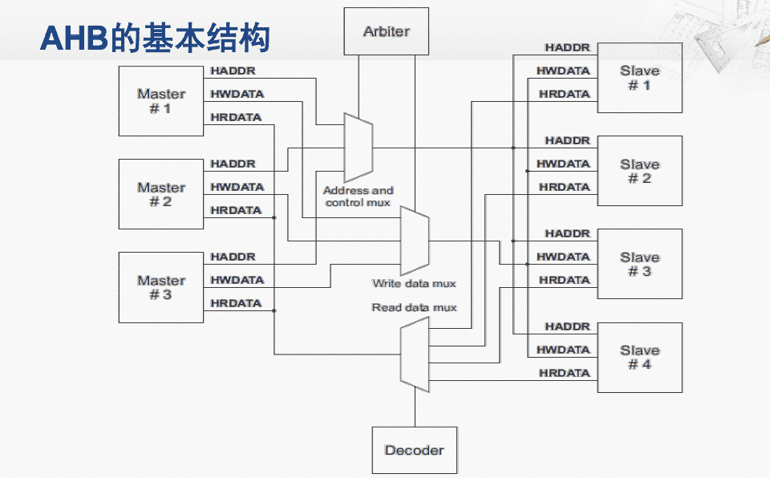
##### 场景一：最简单的传输
###### 主模块读一个数据
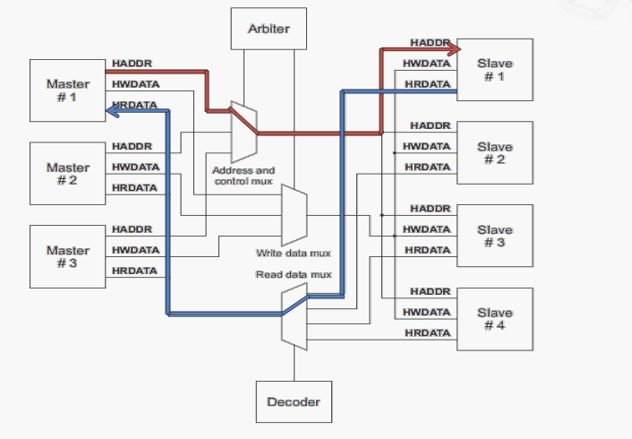
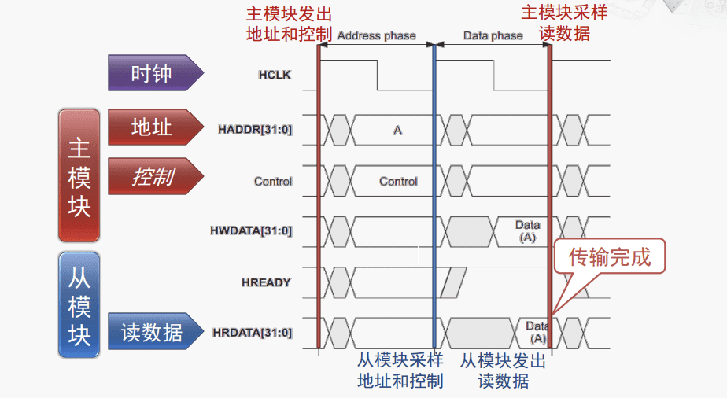
###### 主模块写一个数据
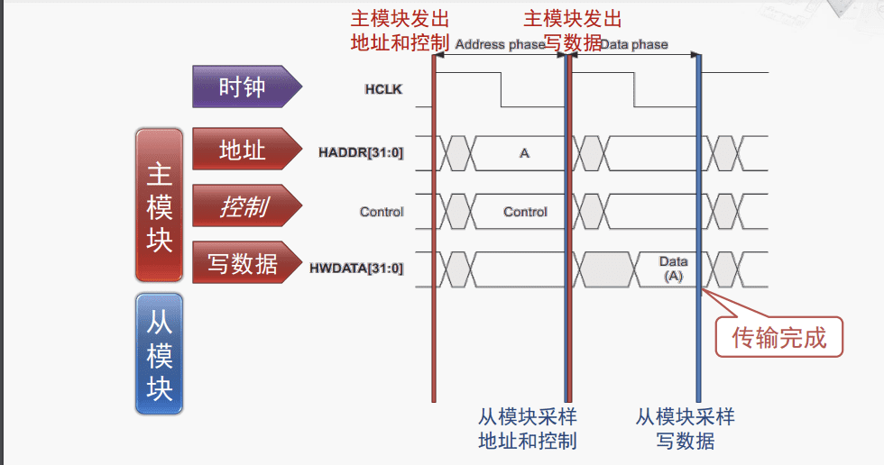
###### 要点

$\quad$ 1.在第一个时钟上升沿之后，主模块驱动HADDR和 Control信号

$\quad$ 2.在第二个时钟上升沿，从模块采样HADDR和Control信 号

$\quad$ 3. 在第二个时钟上升沿之后,写传输：主模块驱动HWDATA信号 ;   读传输：从模块驱动HRDATA信号

$\quad$ 4. 在第三个时钟上升沿 ,写传输：从模块采样HWDATA信号，完成传输;读传输：主模块采样HRDATA信号，完成传输

##### 场景二：主模块发起传输时，从模块未准备好

$\quad$ 从模块无法提供读数据或从模块无法接收写数据

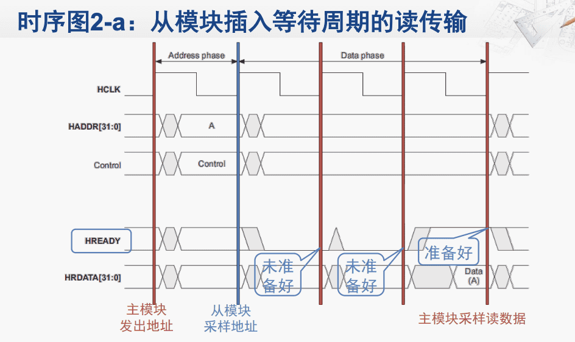

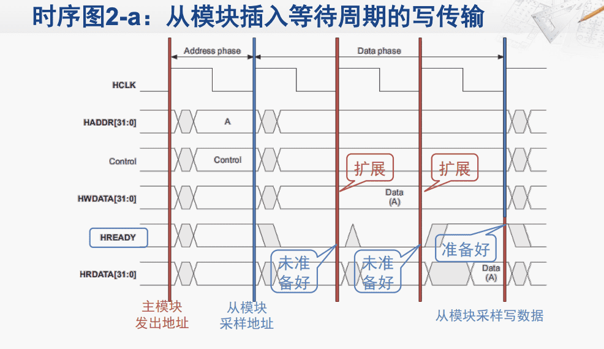

###### 要点：

$\quad$ 从模块可以在传输过程中插入等待周期，以便获得额外的时间 ，如暂存写数据的缓冲已满、读数据未准备好等 

$\quad$ 在等待周期中，主模块必须保持地址、控制和写数据等信号的稳定。
##### 场景三：多个连续的传输

$\quad$ 一个主模块连续发起多个的传输或多个不同的主模块先后发起传输

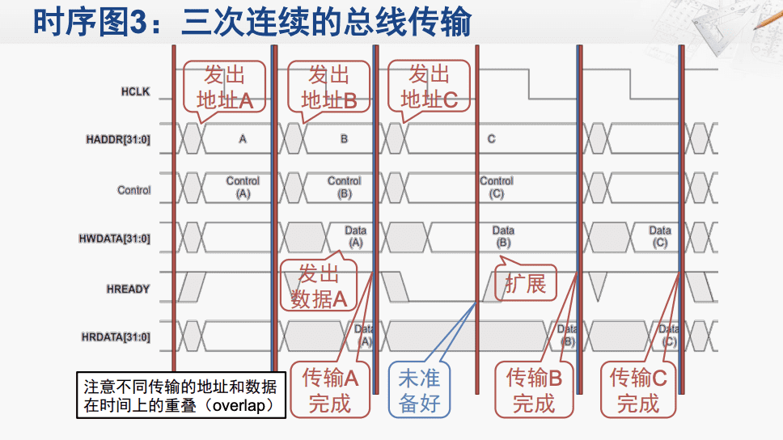
###### 要点

$\quad$ 1.时间重叠（overlap） 

$\quad$ $\quad$ ◦ 不同传输的地址和数据在时间上存在重叠 

$\quad$ $\quad$ ◦ 充分利用地址总线和数据总线 

$\quad$ 2.等待周期 

$\quad$ $\quad$ ◦ 地址A和C的传输中没有等待周期 

$\quad$ $\quad$ ◦ 地址B的传输中有一个等待周期，该传输的数据阶段扩展了一个周期 

$\quad$ 3.等待周期的副作用 

$\quad$ $\quad$ ◦ 因为地址B的传输中的等待周期，所以地址C的传输的地址阶段受其影响 而扩展了一个周期

##### 场景四：大量连续数据的传输

$\quad$ 一次传输的数据量超过了数据总线的宽度， 例如，CPU需要从内存中读出连续的16字节（128位）的数据，但数据总线宽度为32位

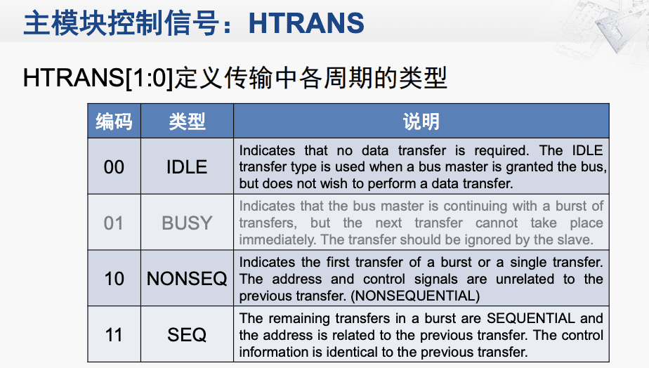

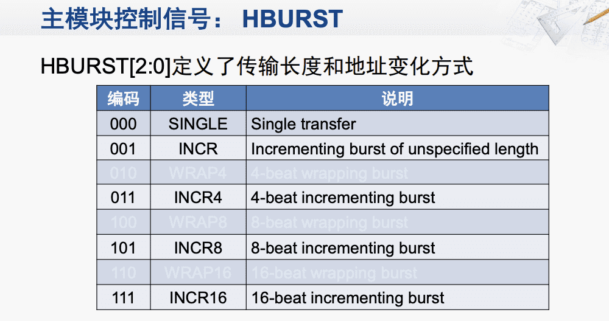

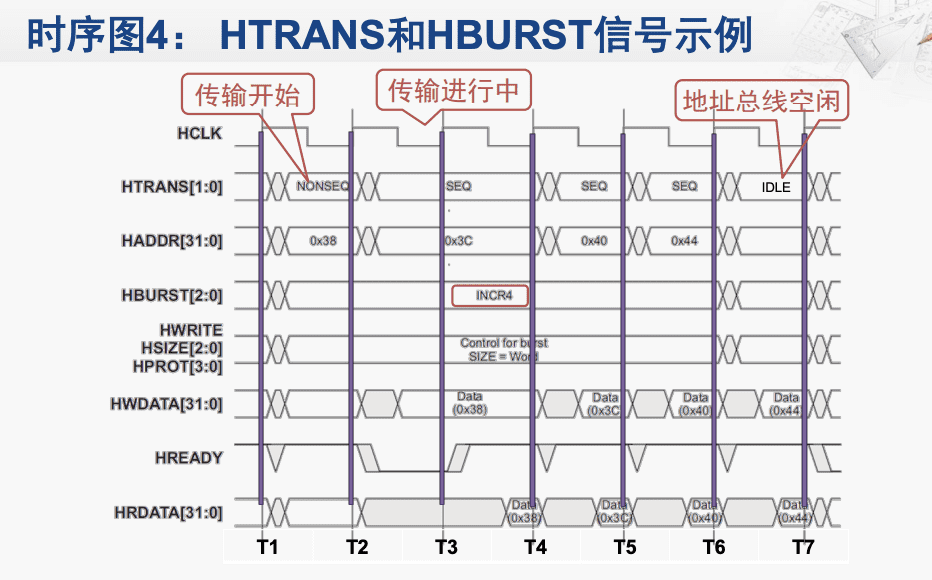

 $\quad$ BURST传输用于高速缓存的行填充（读）、行替换，外设和主存之间的大量连续数据传输以及主存中不同区域之间的大量连续数据传输
###### 要点

 $\quad$ T1 ：传输开始 ， 主模块发出第一个地址 ， 驱 动 HTRANS=NONSEQ，HBURST=INCR4 

  $\quad$ T2 ：传输继续 ， 主模块发出第二个地址 ， 驱 动 HTRANS=SEQ，保持HBURST=INCR4

 $\quad$ ……

$\quad$T6：主模块发出的第四个地址已被从模块采样，无需再 发出新的地址和控制信号，因此驱动HTRANS=IDLE  $\quad$ T7：传输完成
##### 场景五：希望先得到Burst传输中的某个特定数据
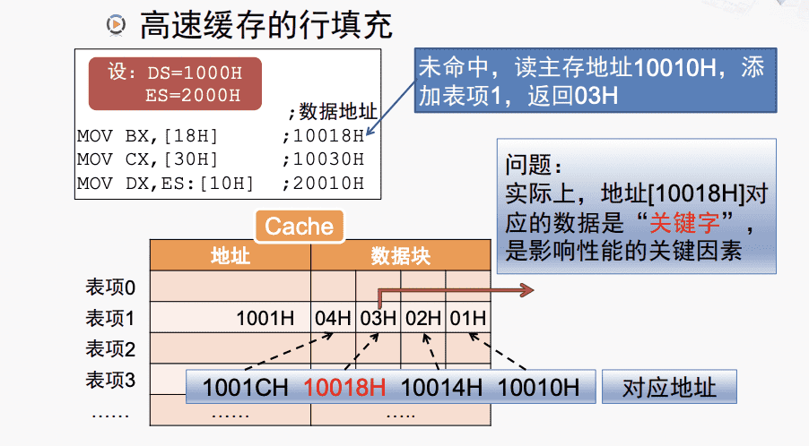
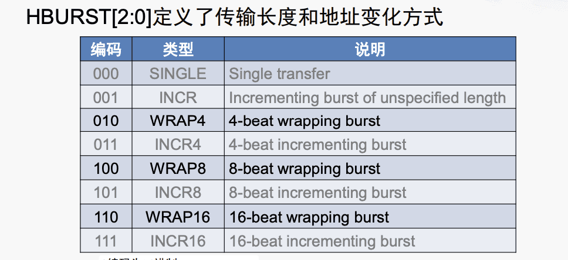
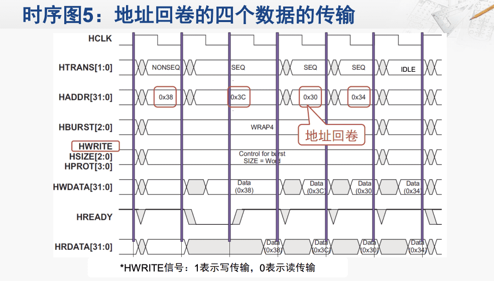

###### 要点

$\quad$ 地址回卷的边界（假设数据宽度为4字节）

$\quad$ $\quad$◦ WRAP4：在16的整数倍的地址处回卷（4×4） 

$\quad$ $\quad$◦ WRAP8：在32的整数倍的地址处回卷（4×8） 

$\quad$ $\quad$◦ WRAP16：在64的整数倍的地址处回卷（4×16）

$\quad$ 传输地址变化示例

$\quad$ $\quad$◦ INCR4： 0x38 0x3C 0x40 0x44

$\quad$ $\quad$◦ WRAP4：0x38 0x3C 0x30 0x34

$\quad$ $\quad$◦ INCR4： 0x30 0x34 0x38 0x3C

$\quad$ $\quad$$\quad$起始地址和访问区域相同
##### 场景六：在Burst传输的过程中，主模块未准备好
主模块无法提供写数据 或主模块无法接收读数据
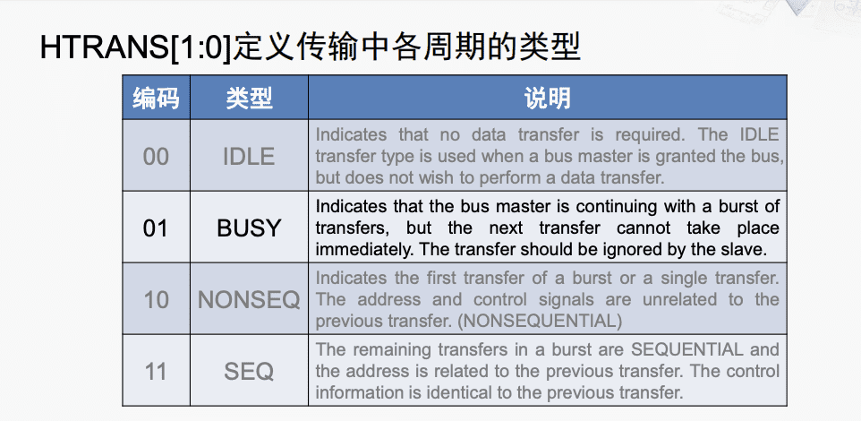
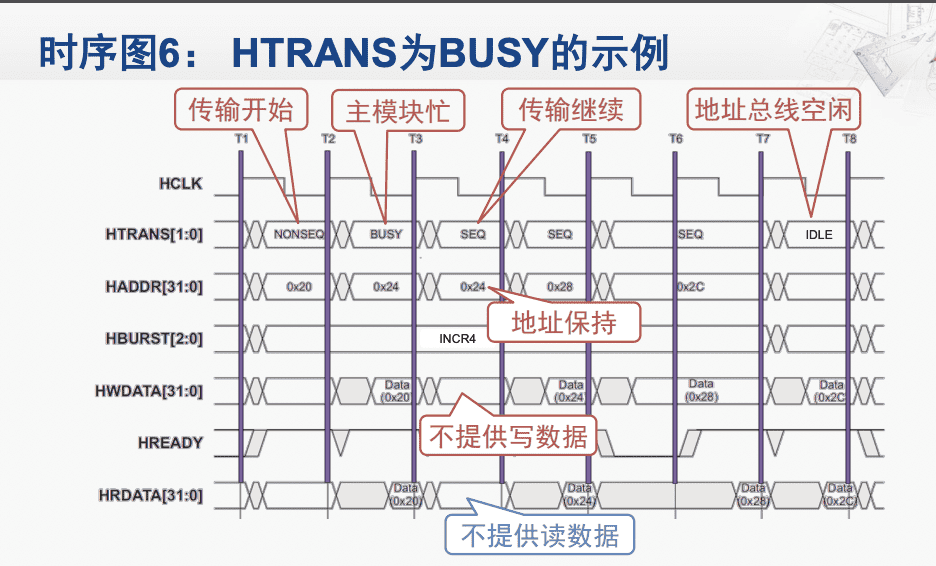
##### 场景七：需要传输的数据宽度比数据总线的宽度小
$\quad$ 例如，需要传输1个16位的数据，而数据总线的宽度是32位的
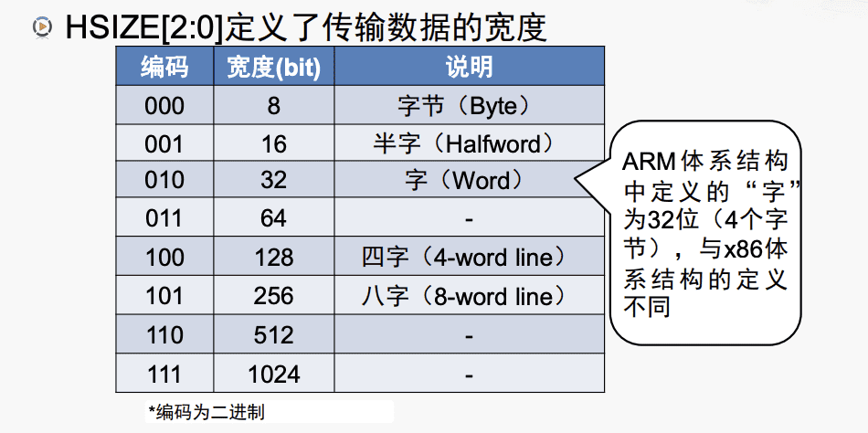
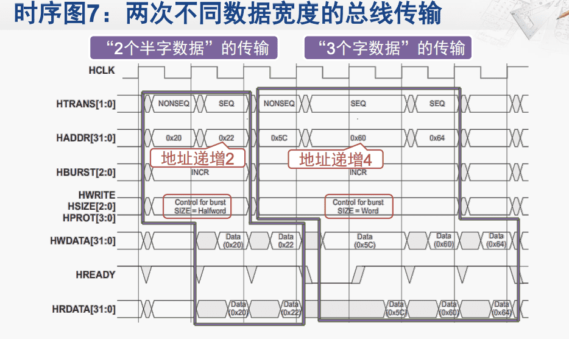
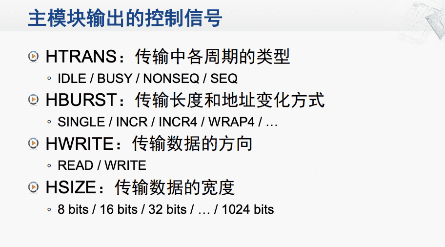

---