# [ICS](https://aki-yzh.github.io/2023/02/18/1-计算机系统漫游&目录)

---
## 九、虚拟内存

$\quad$ 虚拟内存是硬件异常，硬件地址翻译，主存，磁盘文件和内核软件的完美交互，它为每个进程提供了一个大的，一致的和私有的地址空间。

$\quad$ 虚拟内存提供了三个重要能力：

$\quad$  1. 它将主存看成是一个存储在磁盘上的地址空间的高速缓存，在主存中只保存活动区域，并根据需要在磁盘和主存之间来回传送数据，高效地使用了主存。

$\quad$  2. 它为每个进程提供了一致的地址空间，从而简化了内存管理

$\quad$  3. 它保护了每个进程的地址空间不被其他进程破坏

#### 9.1 物理和虚拟寻址

$\quad$ 主存被组织成一个由M个连续的字节大小的单元组成的数组，每个字节都有一个唯一的物理地址。

$\quad$ CPU访问内存的最自然的方式就是使用物理地址，我们把这种方式称为物理寻址。

$\quad$ 使用虚拟寻址，CPU通过生成一个虚拟地址来访问主存，这个虚拟地址在被传送到内存之前先转换成适当的物理地址。

$\quad$ 将一个虚拟地址转换为物理地址的任务叫做地址翻译，CPU上叫做内存管理单元的专用硬件利用存放在主存中的查询表来动态翻译虚拟地址，该表的内容由操作系统管理。

#### 9.2 地址空间

$\quad$ 地址空间是一个非负整数地址的有序集合。

$\quad$ 线性地址空间：地址空间中整数是连续的

$\quad$ 虚拟地址空间(N=2^n)（n位地址空间）

$\quad$ 物理地址空间(M=2^m)

#### 9.3 虚拟内存作为缓存的工具

$\quad$ 虚拟内存被组织为一个由存放在磁盘上的N个连续的字节大小的单元组成的数组，每个字节有唯一的虚拟地址，作为到数组的索引。

$\quad$ 磁盘上数组的内容被缓存在主页中。

$\quad$ VM系统通过将虚拟内存分割为称为虚拟页的大小固定的块来处理这个问题。每个虚拟页的大小为$P=2^p$ 个字节。类似的，物理内存被分配为物理页，大小也为P字节。（物理页也被称为页帧）

$\quad$ 在任意时刻，虚拟页面的集合都分为三个不相交的子集：

$\qquad$ 1. 未分配的：VM还未分配（或者创建）的页。没有任何数据与之相关联，因此也不占用任何磁盘空间

$\qquad$ 2. 缓存的：已缓存在物理内存中的已分配页

$\qquad$ 3. 未缓存的： 未缓存在物理内存中的已分配页

$\quad$ DRAM缓存（虚拟内存系统的缓存）：虚拟页往往很大，全相联，总是使用写回

**页表**

$\quad$ 页表存放在物理内存中，将虚拟页映射到物理页。每次地址翻译硬件将一个虚拟地址转化为物理地址时，都会读取页表。

$\quad$ 页表就是个页表条目(PTE)的数组，每个PTE是由一个有效位和一个n位地址字段组成的。

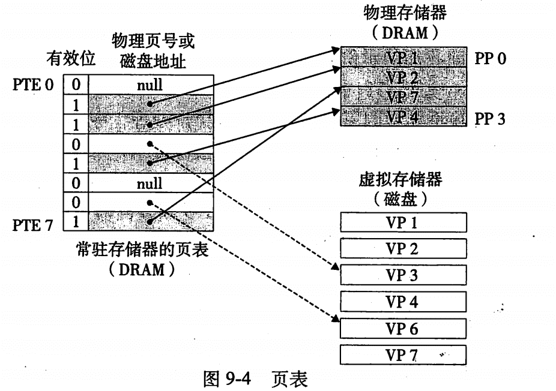

**页命中**

$\quad$ 虚拟地址->索引->有效位1->物理地址

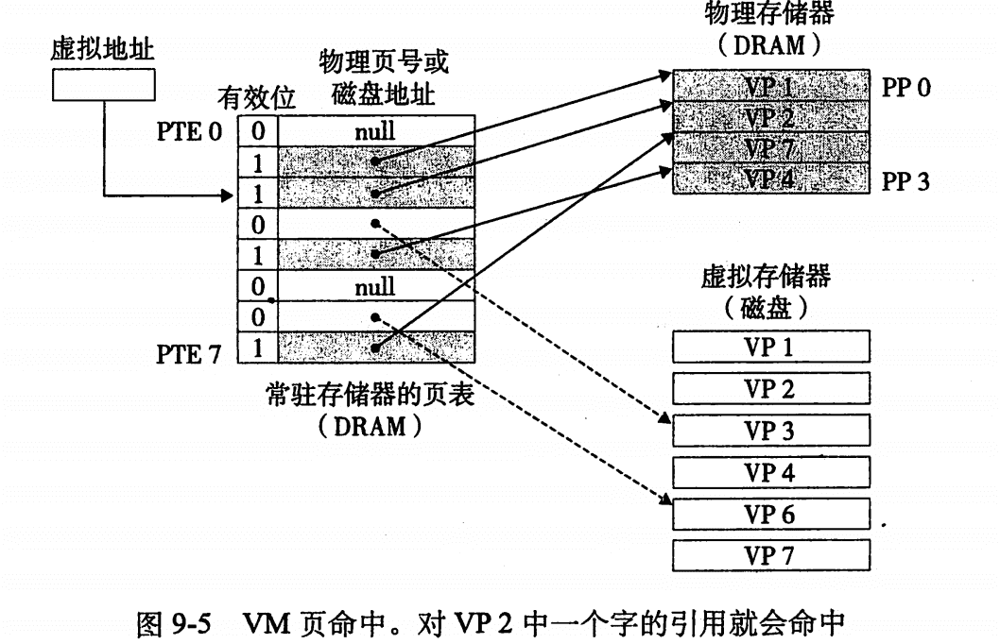

**缺页**

$\quad$ DRAM缓存不命中->调用内核中的异常处理程序->页面调度（按需页面调度）

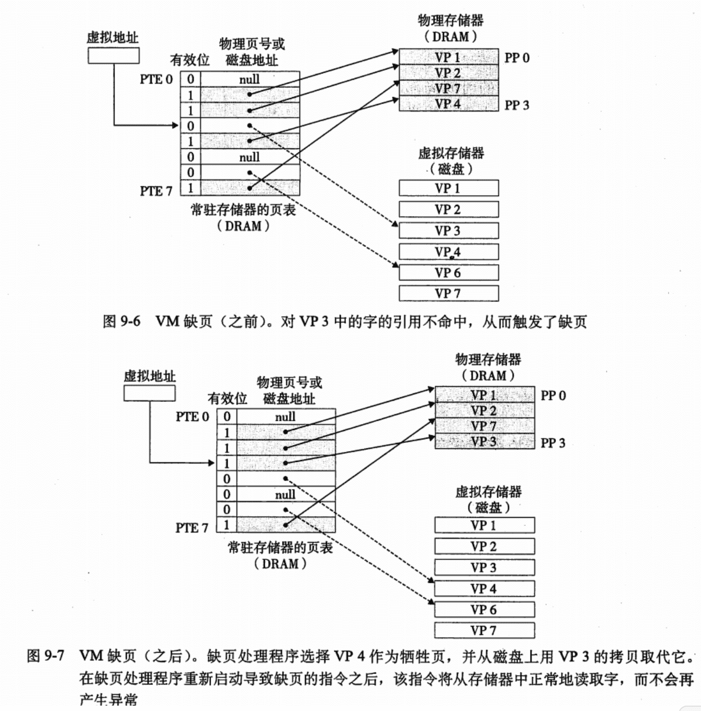

**分配页面**

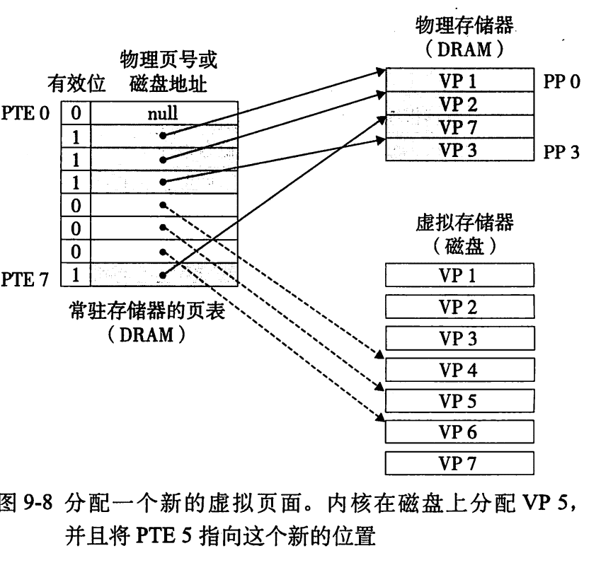

$\quad$ 局部性保证了任意时刻程序趋向于在一个较小的活动页面集合上工作

#### 9.4 虚拟内存作为内存管理的工具

$\quad$ 按需页面调度+独立地址空间=简化链接、简化加载、简化共享、简化内存分配

#### 9.5 虚拟内存作为内存保护的工具

$\quad$ 三个许可位：SUP，READ，WRITE表示权限

#### 9.6 地址翻译
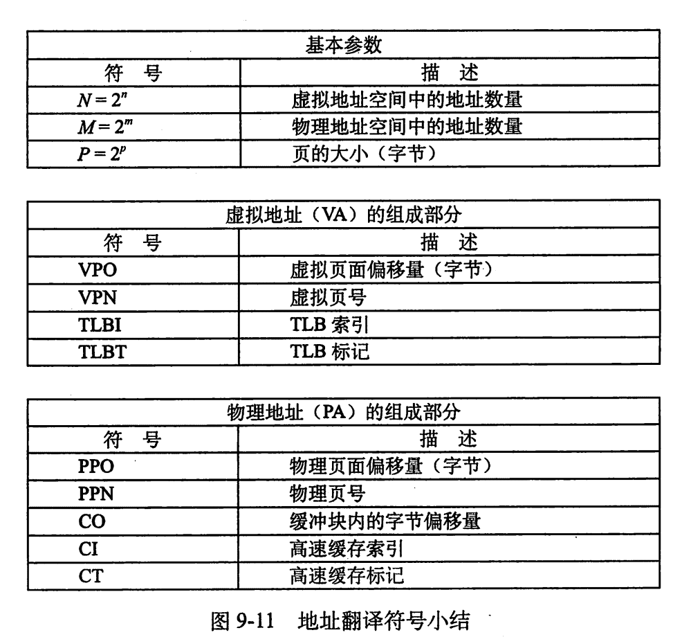

$\quad$ 形式上来说，地址翻译是一个N元素的虚拟地址空间中的元素（VAS）和一个M元素的物理地址空间（PAS）中元素之间的映射

$\qquad \qquad \quad MAP:VAS\rightarrow PAS \cup \emptyset$  

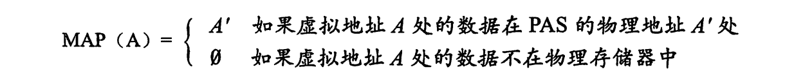

$\quad$ PPO和VPO是相同的

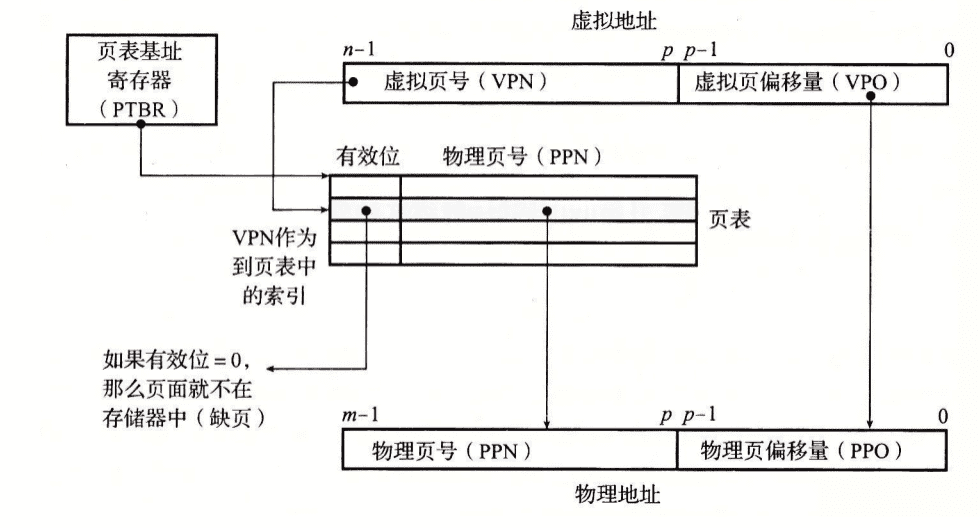

$\quad$ 页面命中后，CPU硬件：

$\qquad$ 1. 处理器生成一个虚拟地址，并把它传给MMU

$\qquad$ 2. MMU生成PTE地址，并从高速缓存/主存中请求得到它

$\qquad$ 3. 高速缓存/主存向MMU返回PTE

$\qquad$ 4. MMU构造物理地址，并把它传送给高速缓存/主存

$\qquad$ 5. 高速缓存/主存返回所请求的数据字给处理器

$\quad$ 缺页时：

$\qquad$ 1. 处理器生成一个虚拟地址，并把它传给MMU

$\qquad$ 2. MMU生成PTE地址，并从高速缓存/主存中请求得到它

$\qquad$ 3. 高速缓存/主存向MMU返回PTE

$\qquad$ 4. PTE的有效位是0，MMU触发了一次异常，传递CPU中的控制到操作系统内核中的缺页异常处理程序

$\qquad$ 5. 缺页处理程序确定出物理内存中的牺牲页，如果这个页面已经被修改了，则把它换出到磁盘

$\qquad$ 6. 缺页处理程序调入新的页面，并更新内存中的PTE

$\qquad$ 7. 缺页处理程序返回到原来的进程，再次执行导致缺页的指令。CPU将引起缺页的虚拟地址重新发送给MMU。因为虚拟页面现在换存在物理内存中，所以就会命中，在MMU执行了页面命中后，主存将所请求字返回给处理器。

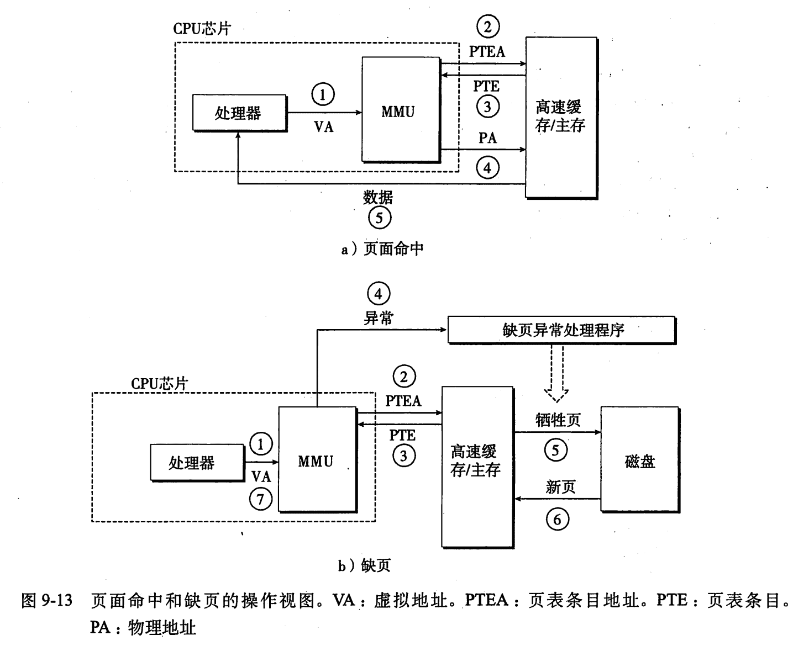
**结合高速缓存和虚拟内存**
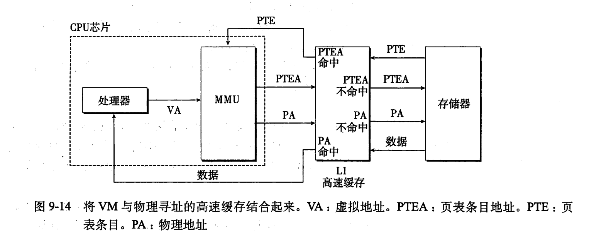
**利用TLB加速地址翻译**

$\quad$ TLB：小的，虚拟寻址的缓存，称为快表，每一行保存着一个由单个PTE组成的块。

$\quad$ 若TLB有2^t个组，则VPN最低t位为TLB索引（TLBI）

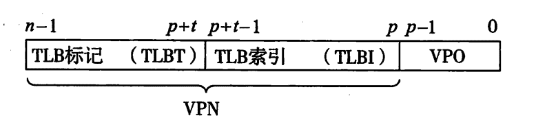

$\quad$ 1. CPU产生一个虚拟地址

$\quad$ 2. MMU从TLB中取出相应的PTE

$\quad$ 3. MMU将这个虚拟地址翻译成一个物理地址，并且将它发送到高速缓存/主存。

$\quad$ 4. 高速缓存/主存将所请求的数据字返回给CPU
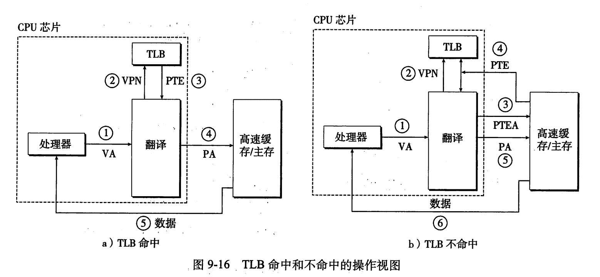
**多级页表**

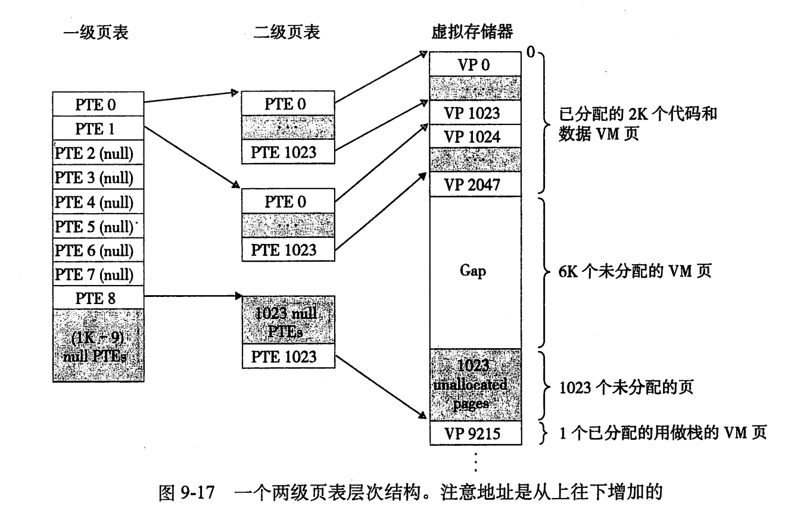

$\quad$ 每个高级PTE指向一个下一级页表的基址，逐级访问直到最终访问到目标地址，只有一级页表才需要总是保存在主存中。

$\quad$ 能减小内存要求

$\quad$ 若一级页表中一个PTE是空的，相应的二级页表根本不会存在
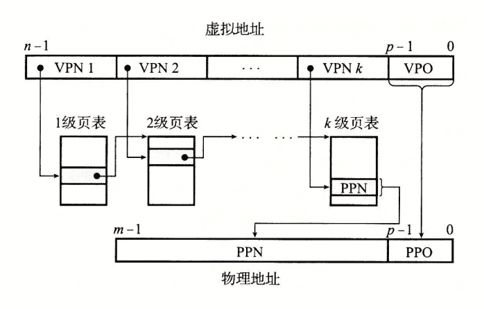

#### 9.7 Intel Core i7/Linux 内存系统

**Intel Core i7**

$\quad$ 四级页表层次结构，64位内存地址，40位PPN，4个许可位，1个标记位，引用位(A)，修改位(D)
**Linux虚拟内存系统**

$\quad$ 基本同上述虚拟内存系统

#### 9.8 内存映射

$\quad$ 将一个虚拟内存区域与一个磁盘上的对象关联起来，以初始化这个虚拟内存区域的内容

$\quad$ 映射对象：普通文件和匿名文件

**共享对象&私有对象**

$\quad$ 映射了同一个共享对象的各进程对这个对象的写是相互可见的，也会反映到磁盘上的原始对象中

$\quad$ 对私有区域的写操作不会反映到磁盘上的对象中

$\quad$ 写时复制：试图写时会触发保护故障，创建一个新的副本（写操作仅执行在该副本上，且其他进程不可见）
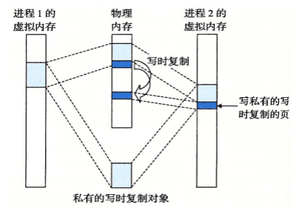
**再看fork**

$\quad$ 为新进程创建各种数据结构，PID

$\quad$ 两个进程的每个页面都标记为只读

$\quad$ 每个区域结构都标记为私有的写时复制

$\quad$ 为每个进程维护私有地址空间的抽象概念

**再看execve**

$\quad$ 删除已存在的用户区域

$\quad$ 映射私有区域（都是私有的，写时复制的）

$\quad$ 映射共享区域

$\quad$ 设置程序计数器(PC)，指向代码区域入口

**mmap与munmap：用户级内存映射**

$\quad$ mmap：创建新的虚拟内存区域，并将对象映射到这些区域中
~~~cpp
void *mmap(void *start,size_t length,int prot,int flags,int fd,off_t offfset);
//成功返回指向映射区域的指针，出错返回MAP——FAILED（-1）
~~~

$\quad$ prot：访问权限位：PROT_EXEC（页面可以被CPU执行的指令组成）；PROT_READ（页面可读）；PROT_WRITE（页面可写）；PROT_NONE（页面不能被访问）
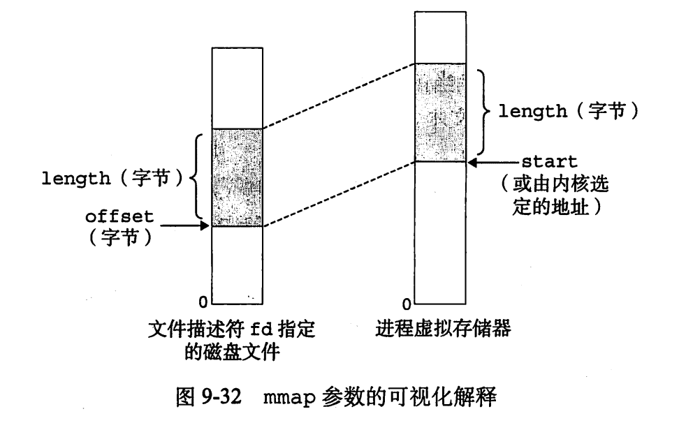

$\quad$ munmap：删除虚拟内存的start开始由接下来length字节构成的区域
~~~cpp
int munmap(void *start,size_t length);//成功返回0，出错返回-1
~~~

#### 9.9 动态内存分配
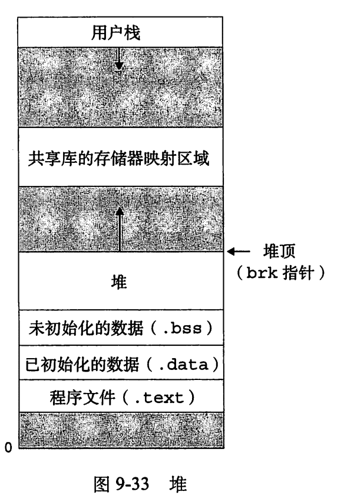

**显示分配器**：显式地释放已分配的块
~~~cpp
/* 分配块 */
void *malloc(size_t size);//成功返回已分配块的指针，否则NULL
/* 释放块 */
void free(void *ptr);
/* 扩展/收缩堆 */
void *sbrk(intptr_t incr);
~~~
要求

$\quad$ 处理任意请求序列：约束：每个释放必须对应一个已分配的块

$\quad$ 立即响应请求：不允许重排或缓冲

$\quad$ 只使用堆

$\quad$ 对齐块：对齐块使得能保存任何类型的数据对象

$\quad$ 不修改已分配的块
目标

$\quad$ 最大化吞吐率

$\quad$ 吞吐率：单位时间完成的请求数

$\quad$ 最大化内存利用率

$\quad$ 峰值利用率：聚集有效载荷/堆大小

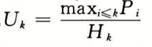

**碎片**

$\quad$ 内部碎片：已分配块比有效载荷大

$\quad$ 外部碎片：空闲内存分散

**隐式空闲链表**

$\quad$ 整个链表需要一个特殊标记的结束块

$\quad$ 空闲块之间通过头部的块大小隐式地连接

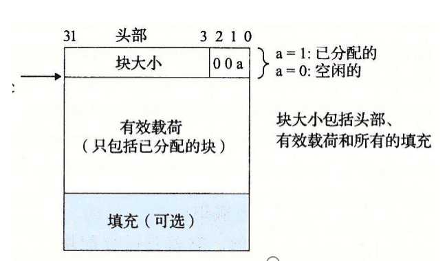

放置已分配的块
 
 $\quad$ 首次适配
 
 $\quad$ 下一次适配（内存利用率最低）
 
 $\quad$ 最佳适配（内存利用率最高）
分割空闲块

$\quad$ 获取额外堆内存

合并空闲块

 立即合并

 推迟合并

 带边界标记的合并（脚部）

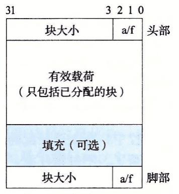

**显式空闲链表**

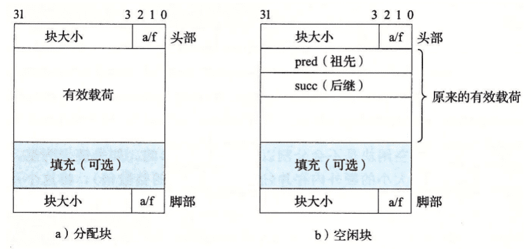

**分离空闲链表**

$\quad$ 维护多个空闲链表，每个链表中的块有相似的大小

$\quad$ 简单分离存储：一个类中所有块大小都一样，不分割不合并

$\quad$ 分离适配：首次适配，分割，释放后合并

$\quad$ 伙伴系统：按2的幂进行分配、分割、合并

详见malloclab

#### 9.10 垃圾收集

$\quad$ 垃圾收集器：动态内存分配器

$\quad$ 自动释放程序不再需要的已分配块

$\quad$ 内存视为有向可达图，不可达节点->垃圾

$\quad$ Mark&Sweep垃圾收集器

$\quad$ Mark阶段：标记根节点和所有可达的后继

$\quad$ Sweep阶段：释放每个未标记的已分配块

#### 9.11 C程序中与内存有关的错误

$\quad$ 间接引用坏指针、读未初始化的内存、允许栈缓冲区溢出、造成错位错误、假设指针和它们指向的对象是相同大小的、引用指针而不是它所指向的对象、误解指针运算、引用不存在的变量、引用空闲堆块中的数据、引起内存泄漏……

---
### LAB:
**此章节后完成[malloclab(103.0/120.0)](https://github.com/Aki-yzh/PKU-ICS-2022/tree/main/LABS/7-malloclab)**

