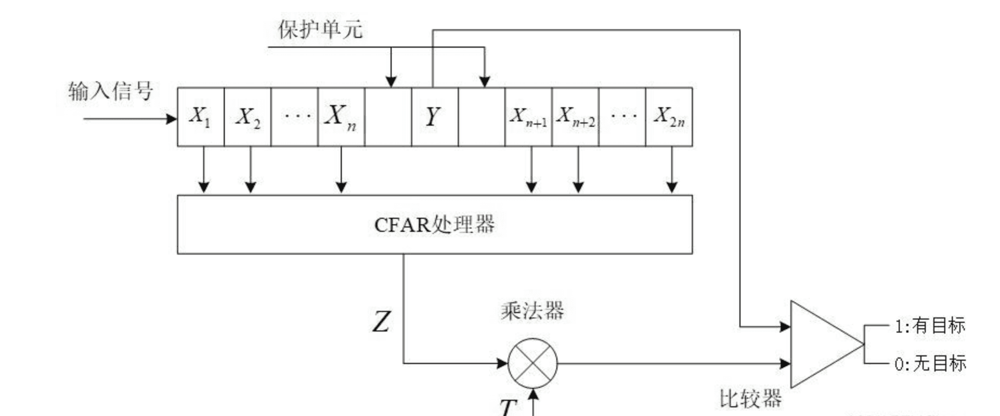
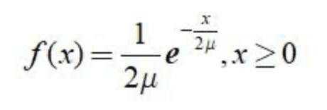
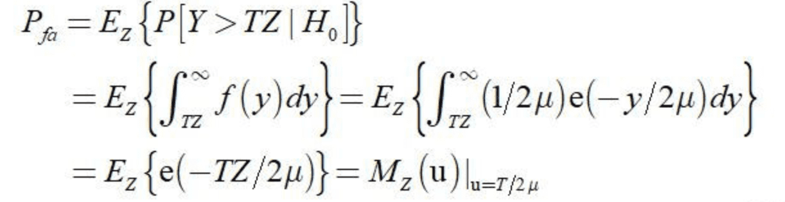
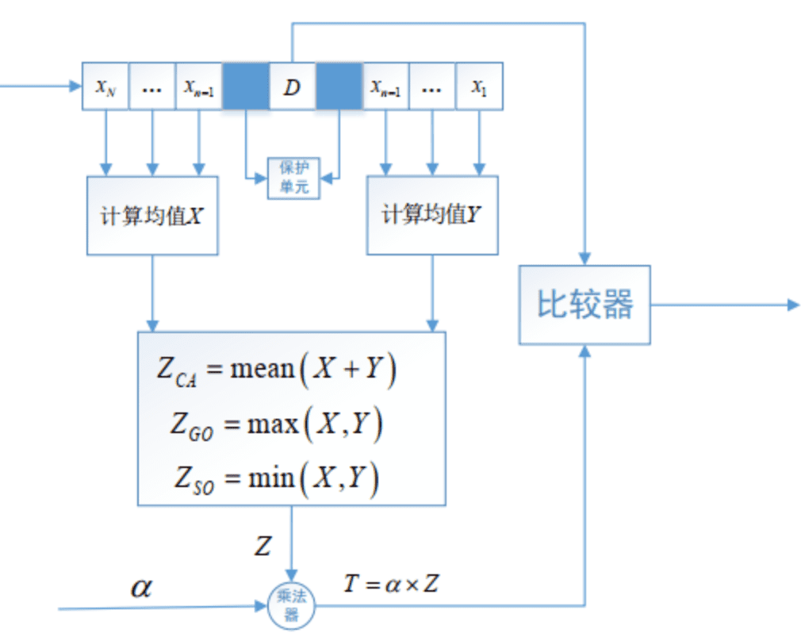
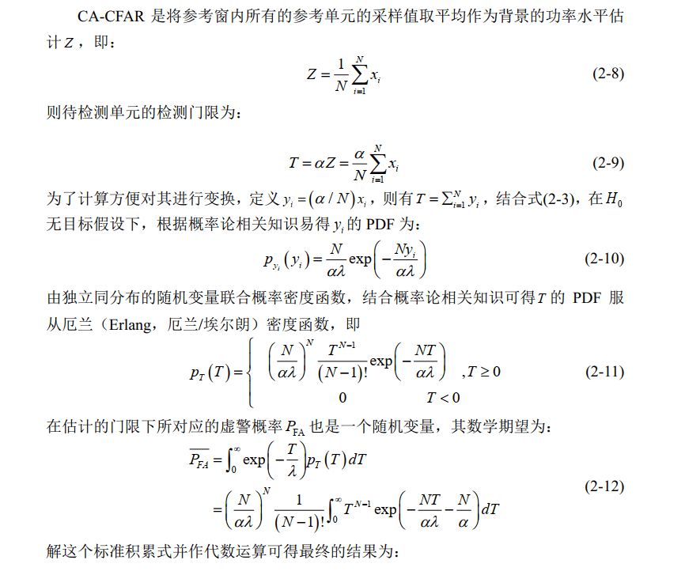
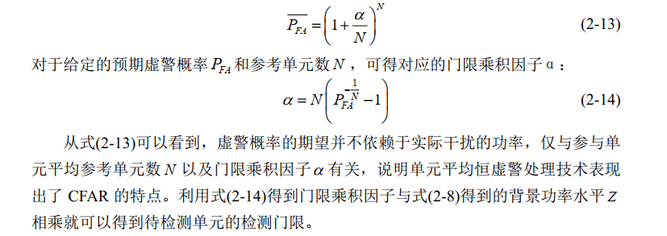
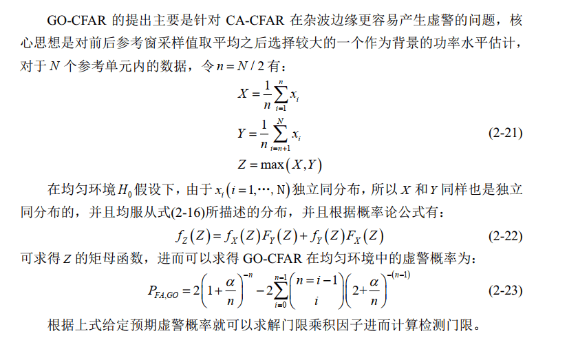
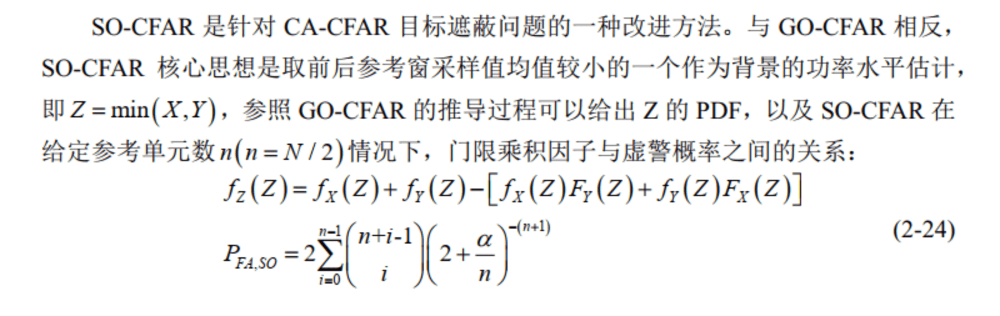

# CFAR
## 基本概念
$\quad$ 检测过程可用门限检测来描述。几乎所有的判断都是以接收机的输出与某个门限电平的比较为基础的，如果接收机输出的包络超过了某一设置门限，就认为出现了目标。

$\quad$ 探测时会受到噪声、杂波和干扰的影响，因而采用固定门限进行目标检测时会产生一定的虚警，特别是当杂波背景起伏变化时虚警率会急剧上升，严重影响检测性能。因此，根据杂波数据动态调整检测门限，在虚警概率保持不变的情况下实现目标检测概率最大化，这种方法称为恒虚警率（Constant False Alarm Rate，CFAR）检测技术。

$\quad$ 判决过程中，可能会出现两类错误。第一类是在没有目标时判断为有目标，这类错误称为虚警。另一类是在有目标时判断为没有目标，这类错误称为漏警。以上两类错误以一定的概率出现，分别称为虚警概率和漏警概率。
## CFAR检测算法

$\quad$ 目前，研究人员针对各种杂波环境下提出了许多高效的CFAR检测算法，大体可分为两类：一类是均值类CFAＲ(CA-CFAＲ)算法，该类算法应用的前提是假设背景杂波是均匀分布的；另一类是有序统计类CFAＲ(OS-CFAＲ)算法，这类算法是为了应对邻域内多目标情况而设计的。
### 基本原理

$\quad$ CFAR检测器的输入一般包括检测单元Y和2n个参考单元。参考单元位于检测单元两侧，前后各n个。保护单元主要用在单目标情况下，防止目标能量泄漏到参考单元影响检测效果。设参考门限电平为$V_{TH},V_{TH}=T * Z$ 其中：Z为总的杂波功率水平的估计，T为门限因子，则当 Y > $V_{TH}$ 时，认为有目标；反之，认为没有目标。

处理流程如下图所示

$\quad$ 一般情况下，杂波同噪声相互独立，且平方律检波后都满足指数分布。参考单元的概率密度函数为：

$\quad$ 设$H_0$ 表示为没有目标， $P[Y>TZ|H_0]$ 则表示为在没有目标的条件下判断为有目标的概率，从而得到虚警概率的表达式为

$\quad$ 式中， μ是噪声功率； Z为随机变量，它的分布取决于CFAR算法的类型以及参考单元的分布； $M_{Z}(u)_{u=T/2μ}$为矩母函数
### 几种典型的CFAR

$\quad$ CA(Cell Averaging)-CFAR杂波功率水平 Z的计算方式为 2 n个参考单元之和，最大选择GO(Greatest Of)-CFAR是选取前面 n个参考单元之和与后面 n 个参考单元之和中的大者作为背景杂波功率水平 Z ；SO(Smallest Of)-CFAR是选取前面 n 个参考单元之和与后面 n 个参考单元之和中的小者作为背景杂波功率水平 Z。

---