# FMCW测距测速测角
## 距离测量
### 距离计算

$\quad$ 由于中频信号是一余弦信号，因此对中频信号做傅立叶变换（FFT）即可得到频率和相位。需要注意，在此处均是对一个chirp周期T内的中频信号做处理，由于周期T很短，可将一个周期内的时间t称为快时间（Fast Time）。根据傅立叶变换的性质，对一个中频信号s(t)做FFT，可以得到一列复数。每个复数对应于一个频率分量，其幅值和相位分别代表该频率分量的振幅和相位
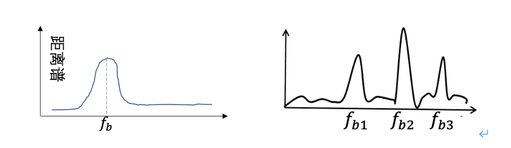

> $R=(c/2k )f_b =f_b(cT/2B)$ 

### 相关参数

$\quad$ (a).距离分辨率。距离分辨率的意义是，仅当两个物体的距离大于分辨率$\Delta$R 时，他们才能在距离谱上被分辨出来。假设FMCW雷达的ADC采样率为$F_s$ ，对周期T的chirp信号做FFT，则FFT的频率分辨率为$\Delta f_b=1/T$ 。根据测距公式得到测距的分辨率为：$\Delta R =cT/(2B) \Delta f_b$ =c/2B .  可见距离分辨率仅与雷达信号的带宽.

$\quad$(b).测距精度。测距精度的意义是：一个物体距离测量的准确度，并不等同于雷达的距离分辨率。在雷达测距的实际应用中，测距精度是评定雷达和算法性能的重要指标。主要有两种方法提高测距精度：一是提高雷达接收机的ADC采样率，即以更多的采样点数采样中频信号，从而更好地估计周期性不完整的中频信号频率；二是在做FFT时应用补零或插值的方法。

$\quad$ (c).理论最远可测距离。根据采样定理，当雷达的采样率为$F_s$ 时，FFT可测的最大频率为$f_{max}=F_s/2$ 。因此，根据测距公式，雷达的理论最远可测距离为：$R_{max} = cTF_s/4B$ 与一个chirp的周期、带宽和系统采样率有关。假定雷达的采样率可以无限大，为了采样带宽为B的chirp信号，根据采样定理，采样率至少为2B，则此时最远可测距离为cT/2。

$\quad$ (d).实际最远可测距离。在实际应用中，雷达的实际最远可测距离往往无法达到理论值，这是因为对于一些较远的物体，中频信号的振幅很小，使得信号的信噪比很低，导致物体无法被检测到。

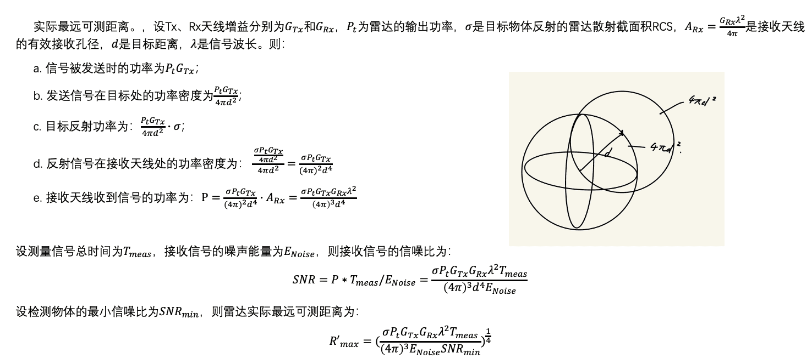
###  距离计算代码
~~~m
function [fft_data_all_frames] = readRawDataAnd1DFFT(file_name, frame_num)

global N_CHIRP;

global RX_NUM;

global FFTR_SIZE;

global FRAME_SIZE;

global TX_NUM;

global RANGE_RESERVED_DOTS;

global FFTV_SIZE;

global CHIRPS_PER_FRAME;

global TX_ENABLE;

global RX_ENABLE;

%参数定义

% 包括N_CHIRP（每个Frame里chrip数）、RX_NUM（接收通道数）、FFTR_SIZE（FFT点数:每个chrip数据量）、FRAME_SIZE（每帧的样本数）、TX_NUM（发送通道数）、RANGE_RESERVED_DOTS（保留的距离向量长度）、FFTV_SIZE（FFT点数*速度点数）、CHIRPS_PER_FRAME（每帧的扫频数）、TX_ENABLE（启用的发送通道数）、RX_ENABLE（启用的接收通道数）。

file = fopen(file_name);%打开文件

% disp('begin read')

raw_data_array = fread(file,'short=>short');

%short=>short 是source=>output,raw_data_array意为原始数据向量

% disp('finish read')

raw_data_array = single(raw_data_array);

% disp('finish convert to single')

raw_data_array = raw_data_array / 4;

raw_data_array = raw_data_array(1:frame_num*FRAME_SIZE/2);

raw_data_array = reshape(raw_data_array, [FFTR_SIZE, RX_NUM * N_CHIRP * frame_num]);

%转为单精度浮点并缩放

% disp('begin fft')

window = hamming(FFTR_SIZE);

raw_data_array = raw_data_array .* window;

raw_data_array = fft(raw_data_array);

% disp('finish fft')

% data_array_fft = data_array_fft(1:(RANGE_RESERVED_DOTS+1),:);

% data_array_fft = reshape(data_array_fft,[RANGE_RESERVED_DOTS+1, RX_NUM, N_CHIRP, frame_num]);

raw_data_array = reshape(raw_data_array,[FFTR_SIZE, RX_NUM, N_CHIRP, frame_num]);

raw_data_array = permute(raw_data_array, [4,3,2,1]);

%这些行将FFT数据重塑为一个大小为frame_num * RX_NUM * N_CHIRP * FFTR_SIZE的数组，并对维度进行重新排列。

% disp('begin TX')

fft_data_all_frames = zeros(frame_num,TX_NUM,CHIRPS_PER_FRAME,RX_NUM,RANGE_RESERVED_DOTS+1,'single');

for i = 1:TX_NUM

fft_data_all_frames(:,i,:,:,:) = raw_data_array(:, i:TX_NUM:N_CHIRP, :, 1:RANGE_RESERVED_DOTS+1);

end

% disp('finish TX')

fft_data_all_frames = permute(fft_data_all_frames,[1,2,4,3,5]);

disp('finish read and 1d FFT')

end

~~~

$\quad$ 实际距离谱：
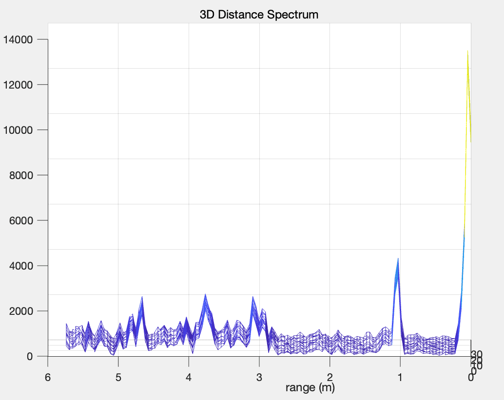

## 速度测量
### 速度计算

$\quad$ 物体速度是距离变化的体现，因此在获得了距离计算方法后可以进一步计算物体的运动速度

$\quad$ （1）距离谱法。在获得了距离谱之后，一个很直观的计算物体运动速度的方法是，对于慢时间的多个chirp

$\quad$ （2）相位改变法:基于相位的微小运动计算方法，计算步骤为：

$\quad$ $\quad$ a. 随着慢时间的改变共有N个chirp被发送，对每个chirp做傅立叶变换得到N个距离谱。由于物体位置变化远小于距离分辨率，因此计算得到的N个距离谱相同。

$\quad$ $\quad$ b. 在每个距离谱上均可以观察到该物体，选定该物体的距离域，对N个chirp中该物体的距离域均取相位，可以得到N个相位值。

$\quad$ $\quad$ c. 对这N个相位值取解绕，得到连续的相位变化。

$\quad$ $\quad$ d. 根据公式换算得到物体连续的距离变化。

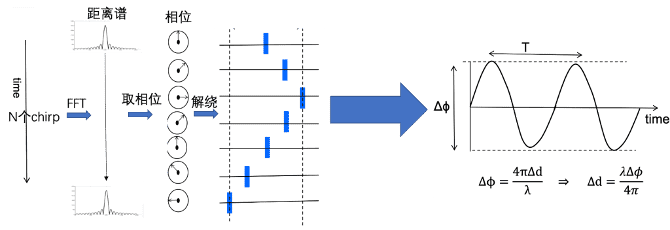

$\quad$ $\quad$ (3).2Dfft 法

$\quad$ 可以选择连续的多个chirp计算相位变化。考虑$T_{tot}$时间（如0.01s）内连续的N个（如10个）chirp，先做FFT得到N个距离谱。在$T_{tot}$时间内物体距离的改变不超过一个距离域，因此这些距离谱中该物体对应的距离域相同。根据前文分析，任意两个chirp之间，该距离域的相位改变均为$\Delta \psi = 4\pi f_c vT_c/c$ ，因此在全部N个距离谱中该物体对应距离域的复数以为此为角速度在复平面上转动。进而，对于这一列复数做FFT，可以得到一个新的能量分布谱。对应物体速度为

> $v=\varpi c /(4 \pi f_c T_c)$ 

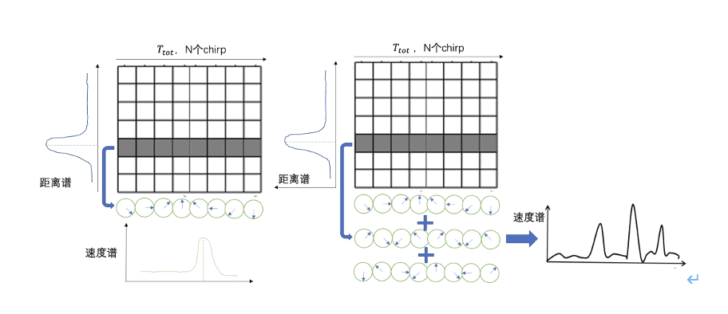

### 相关参数：

$\quad$ （a）速度测量的分辨率。由于共有N=$T_{tot}/T_c$ 个chrip，则FFT时共有N个采样点，则频率分辨率为$\Delta \varpi = 2\pi/N$ ，根据测速公式,速度分辨率计算为

$\Delta v = \Delta \varpi c /(4 \pi f_c T_c)=c/(2F_cT_{tot})$ 

$\quad$ （b）最大可测速度。考虑相邻两个chirp，即$T_c$ 内，一个向量最多只能旋转$\pm \pi$ ，否则会在FFT出现歧义，根据测速公式，最大可测速度为：$|v_{max}|=c/(4f_cT_c)$ 

### 速度计算代码
~~~m
fft_data_all_frames_static_elimi = fft_data_all_frames - mean(fft_data_all_frames,4);

fft2D_data_all_frames = fftshift(fft(fft_data_all_frames_static_elimi,[],4),4);

%从每个帧中减去所有帧的平均值并作二维傅里叶变换， fftshift(X) 将零频分量移动到数组中心重新排列fft

figure();

frame_data = double(squeeze(fft2D_data_all_frames(130,:,:,:,:))); % frame_index needs to be assigned a suitable value

rd_map = squeeze(abs(frame_data(FOCUS_TX,FOCUS_RX,:,:))).';%这行代码计算了距离-多普勒图。

s_rd = mesh(velocity_seq,distance_seq,rd_map / max(max(rd_map)));

axis([-5.2083 5.2083 0 11.2957] ); % The line needs to be adjusted according to the parameters or deleted

view(2);

s_rd.FaceColor = 'flat';

xlabel('Velocity(m/s)')

ylabel('Range(m)')

set(gca,'FontName','Helvetica',"FontSize",18);

c_res = colorbar;

c_res.Label.String = 'Normalized power';

c_res.Label.FontSize = 16;

title("range-doppler spectrum")
~~~
$\quad$ 实际速度谱：

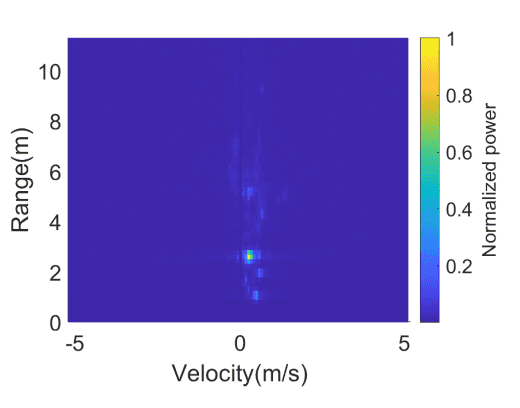

## 角度测量

### 角度计算

$\quad$ **普遍**：

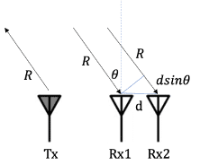

$\quad$ 距离为r，角度为$\theta$ ，雷达两个接收天线之间的距离为d。此时，信号经物体反射到达天线1和天线2的时延分别为$\tau_1 = 2R/c$ 和 

$\tau_2 = ( 2R+ \Delta R )/c$ ,其中$\Delta R = d sin\theta$ 为该信号到达两个天线的路径差.对物体所在的距离域分别取相位并计算两根天线的相位差为$\Delta \psi = 2\pi d sin \theta / \lambda$ ，则物体的角度可以计算为：

>$\theta = arcsin(\lambda \Delta \psi/(2 \pi d))$ 

$\quad$ **3DFFT**

$\quad$ 为了区分速度和距离均相同的物体，需要增加天线数量。假设有M根等距离分布的天线，则相邻两根天线上同一物体导致的相位差是相同的，为∆φ=2π∆R/λ=2πdsinθ/λ，因此在全部M个速度谱中该物体对应速度域的复数以2πdsinθ/λ  rad/1为角速度在复平面上转动。如果此速度域存在多个物体，则该速度域为多个旋转复数的叠加。因此，对这一系列速度域做FFT可以计算出这两个旋转复数的频率，从而换算对应物体的角度。

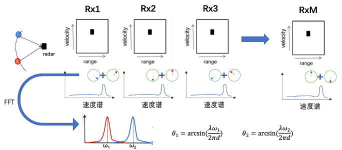

$\quad$ **DBF**(数字波束成形)

$\qquad$ 1维

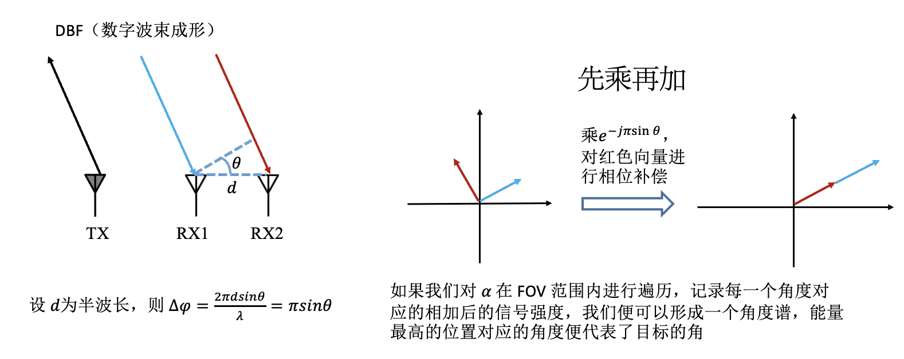

$\qquad$ 2维：

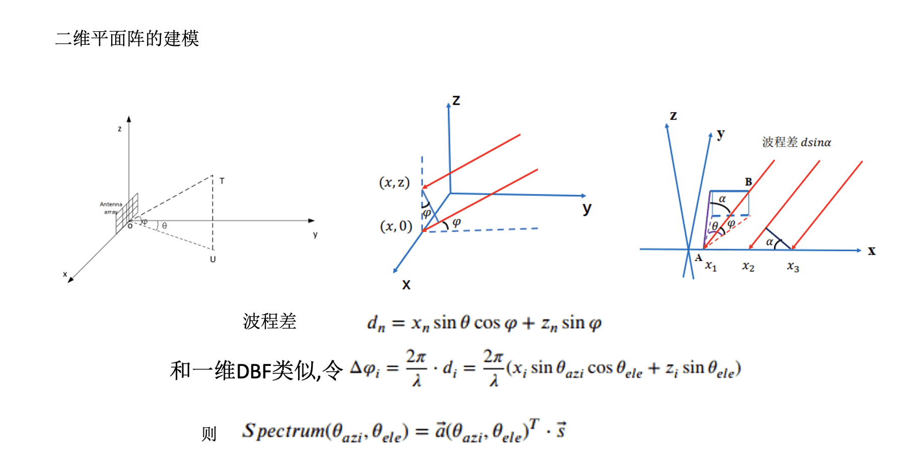

### 角度计算代码

~~~m
search_range= [-90:0.01:90];

tx1=squeeze(fft_data_all_frames(8,1,:,1,25));

tx4= squeeze(fft_data_all_frames(8,4,:,1,25));

signal_in=[tx1;tx4]; %取出不同天线阵列对应的物体的信号向量并转化为信号向量数组

Wave_length = 3e8/fc;

att_array=0:7 ;

att_array=att_array*Wave_length/2;

[spectrum,doas] = dbf(signal_in,att_array,fc,1,search_range);

figure();

plot(-search_range,spectrum/10);

disp(doas);

function [spectrum,doas] = dbf(signal_in,antenna_array,fc,numOfSignal,search_range)

% 参数：输入信号signal_in、天线阵列antenna_array、中心频率fc、信号数量numOfSignal和搜索范围search_range

c = 3e8;

signal_in = reshape(signal_in,[],1);

antenna_array = reshape(antenna_array,1,[]);

wave_length = c / fc;

% 将输入信号signal_in和天线阵列antenna_array进行reshape操作，使其变为列向量和行向量。然后，根据光速c和中心频率fc计算波长wave_length

angle = search_range / 180 * pi;

angle = reshape(angle,[],1);

phase_shift_matrix = exp(-1i * 2 * pi / wave_length * sin(angle) * antenna_array);

% 将搜索范围search_range转换为弧度，并将其reshape为列向量。然后，计算相移矩阵

spectrum = abs(phase_shift_matrix*signal_in);

% find object in spectrum

[pks, locs] = findpeaks(spectrum);

%在spectrum中找到峰值pks和对应的位置locs。将峰值按降序排序，选取前numOfSignal个峰值的位置max_index。

[~, pos] = sort(pks,'descend');

max_index = locs(pos(1:numOfSignal));

% 最后，根据位置max_index在搜索范围search_range中找到对应的方向角doas。

doas = search_range(max_index);

% % end
二位只需要把输入改成二位输入二维遍历即可
~~~

$\quad$ 一维测角角度谱

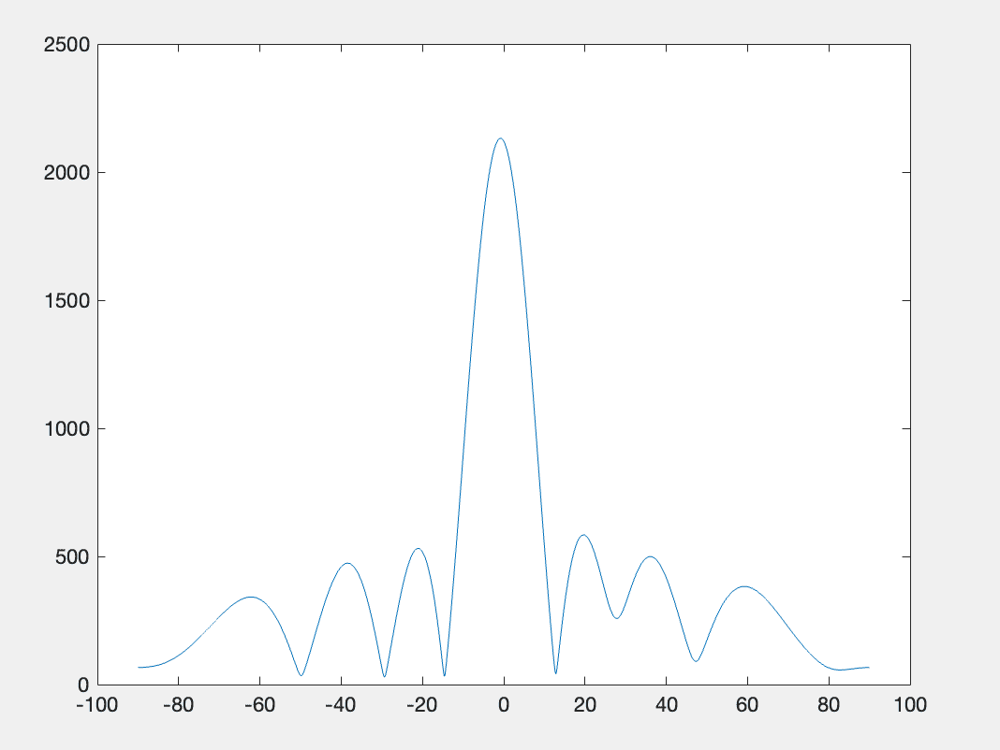

$\quad$ 二维测角角度谱：

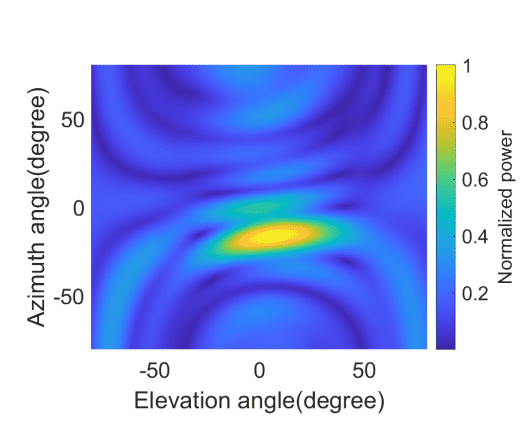
---
