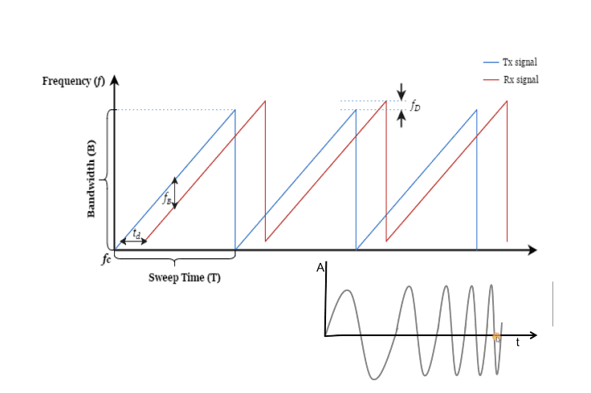
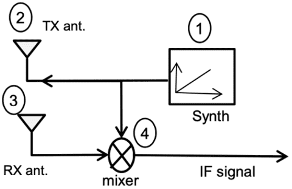

# FMCW基础
## FMCW 雷达

$\quad$ CW雷达不能提供距离信息的原因是缺乏一种能够计算距离的时延测量方法。利用脉冲进行测距是通过从发射脉冲和回波之间的时延计算来实现的，因此，可以通过诸如锯齿、三角形等的频率调制信号来实现两者的组合。

$\quad$ 一种最简单的频率调制波形是锯齿波信号，即频率随时间线性增加的信号。每个chirp的基本参数为起始频率$f_c$ ，带宽B和周期T。如图展示了回波和发送信号的时延关系。由于一个chirp的频率随时间变化，因此可以计算发送信号与反射回波信号的时延，从而计算物体的距离。这是使用FMCW雷达测距的基本思想。

### FMCW 雷达构成

$\quad$ 一个FMCW雷达的基本结构主要由四部分组成：FM信号发生器(1)、发送天线(2)、接收天线(3)和混频器(4)。

 $\quad$$\quad$ FM信号发生器生成调频信号（锯齿波或者三角波）

$\quad$ $\quad$ 混频器的输入分别是信号发生器和接收信号，

$\quad$ 混频器将发送信号和接受信号进行混频从而生成中频信号，输出一个频率为两个输入信号频率之差、相位也为两个输入信号相位之差的信号

> $x_{output}=|x_1 (t)∙x_2 (t)|_{LPF}=sin⁡[(ω_1-ω_2 )t+(φ_1-φ_2 )]$ 

### FMCW 信号收发流程：

$\quad$（1）FM信号发生器生成调频信号（锯齿波或者三角波），该信号被分为相同的两路，其中一路连接混频器，另一路连接到发送天线；

$\quad$（2）发送天线向环境中发送信号；

$\quad$（3）信号在环境中沿不同路径传播，遇到物体后被反射回到雷达并被接收天线捕获。接收天线将接收信号发送到混频器；

$\quad$（4）混频器将发送信号和接受信号进行混频从而生成中频（Intermediate Frequency， IF）信号。

$\quad$ 基于以上FMCW雷达信号收发的流程，可以给出FMCW雷达收发信号的数学表达式：

$\quad$ $\quad$（1）FM信号发生器生成连续的锯齿（chirp）波，设每个chirp的起始频率为$f_c$，周期为T，则该FMCW雷达发送的信号波长为$\lambda=c/T$ ，chirp斜率为$k=B/T$，其中c是光速。该信号每个chirp内的频率为$f_t=f_c+kt$ ，相位为：$u(t)=2\pi \int_0^t f(t)dt = 2\pi (f_ct+\pi t^2/2)$ ，则每个chirp时间内发送信号的表达式为：$x_{tx}(t) =A cos (\mu (t))=Acos(2 \pi (f_ct+kt^2/2))$ 

$\quad$ $\quad$(2）发送天线将以上信号发送，信号在空间中沿不同路径传播，并在遇到物体后被反射，回到雷达。为了简化推导而又不失一般性，假设环境中只有一个反射物体，其到雷达到距离为R

$\quad$ $\quad$(3）反射信号到达接收天线，由于该反射信号在空间中传播的距离为2R，因此其传播时延为$\tau=2R/c$ ，则接收信号为：$x_{rx}(t)=Bcos(\mu(t-\tau))$ 

$\quad$ $\quad$ (4）混频器将接收信号与发送信号混频得到中频信号。中频信号的表达式为:$s(t)=A'cos(2\pi (f_c\tau +k\tau t-k\tau ^2/2)$ 其中，A'是中频信号的信号强度，与发送信号的强度、反射物体的性质、接收天线的增益等参数有关。由于$k\tau ^2/2$ 项与为一高阶小量，因此可以忽略，则中频信号的最终表达式为：$s(t)=A'cos(2\pi f_b t+\psi_b)$ 

$\quad$ $\quad$假设空间中存在m个反射物体且每个物体的造成的信号时延为$\tau_m$ 则雷达的中频信号为：$s(t)=\sum^M_{m=1}A_m'(2\pi k \tau _m t+f_c\tau _m)$    

---