# 计算机网络

## 传输层 - 可靠传输
#### TCP概述


##### 提供的服务

$\quad$ TCP服务模型：

$\quad$ $\quad$ 在一对通信的进程之间提供一条理想的字节流管道

$\quad$ 点到点通信:

$\quad$ $\quad$ 仅涉及一对通信进程

$\quad$ 全双工：

$\quad$ $\quad$ 可以同时双向传输数据

$\quad$ 可靠、有序的字节流：

$\quad$ $\quad$ 不保留报文边界

##### 需要的机制

$\quad$ 建立连接:

$\quad$ $\quad$ 通信双方为本次通信建立数据传输所需的状态（套接字、缓存、变量等）

$\quad$ 可靠数据传输：

$\quad$ $\quad$ 流水线式发送，报文段检错，丢失重传

$\quad$ 流量控制:

$\quad$ $\quad$ 发送方不会令接收方缓存溢出

$\quad$ 拥塞控制:

$\quad$ $\quad$ 发送方不会造成网络拥塞

#### 可靠传输

###### 不可靠信道

$\quad$ 外部信号干扰导致比特错误（数据损坏）

$\quad$ 链路过载导致数据丢失

$\quad$ 多路径导致乱序

##### 可靠传输问题

$\quad$ 保证数据在不可靠信道上完整、正确、有序地从源到目的进行传送

$\quad$ 可靠传输不仅是TCP中的问题，在网络的各个层次都需要考虑

$\quad$ $\quad$ OSI模型中的链路层

$\quad$ $\quad$ 各类基于UDP的应用层协议（如TFTP）

$\quad$ $\quad$ 5G通信

$\quad$ $\quad$ 时延敏感网络

$\quad$ $\quad$ 远程直接内存访问（Remote Direct Memory Access，RDMA）

###### 本课关注的可靠传输

$\quad$ 计算机网络中对底层不可靠信道的假设

$\quad$ $\quad$ 通讯链路会丢失信息

$\quad$ $\quad$ 消息会发生乱序

$\quad$ $\quad$ 通讯数据在传输过程中可能发生随机的错误，但能通过校验技术进行检测

$\quad$ 不考虑的场景

$\quad$ $\quad$ 数据在通信中可能遭到有意的篡改，且无法通过校验检测

$\quad$ $\quad$ 收到的数据可能不是来自发送方，而是某第三方编造

##### 形式化描述

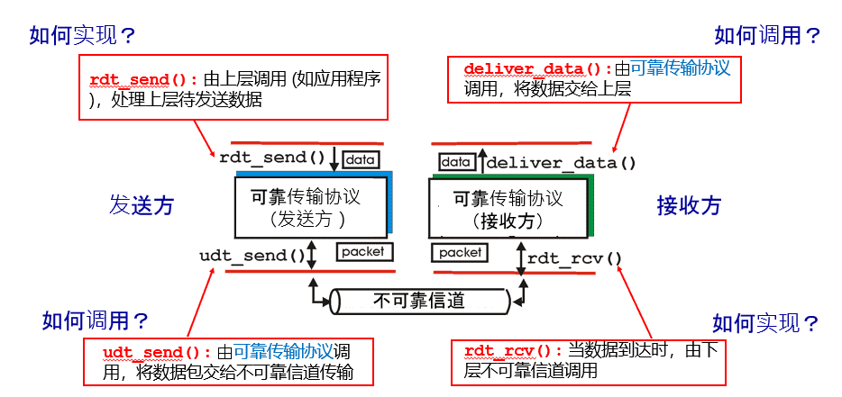
  

##### 学习可靠传输的方法

$\quad$ 从最简单的场景开始，考虑如何设计可靠性协议

$\quad$ 先达成可靠性，然后优化性能


$\quad$ 可靠性机制是分布式算法：发送方、接收方各自都应执行相应操作，协同保证可靠性

$\quad$ 发送方或者接收方的功能，可以用有限状态机（FSM）进行表示

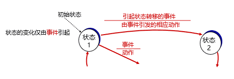

$\quad$ 本章节统一使用packet指代传输的数据单元

#### 一般的可靠性方案

##### 完美信道-乌托邦协议（rdt 1.0）

$\quad$ 假设：

$\quad$ $\quad$ 完美信道：帧不会丢失或受损

$\quad$ $\quad$ 始终就绪：发送方/接收方的网络层始终处于就绪状态

$\quad$ $\quad$ 瞬间完成：发送方/接收方能够生成/处理无穷多的数据

$\quad$ 乌托邦：完美但不现实的协议(rdt 1.0)

$\quad$ $\quad$ 不处理任何流量控制或纠错工作

$\quad$ $\quad$ 接近于无确认的无连接服务

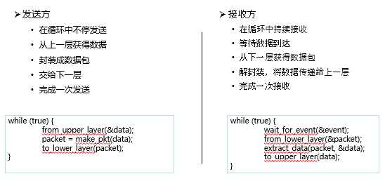

###### 状态机

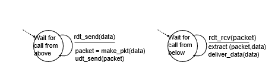

##### 有错但不丢包信道——rdt2.0协议

$\quad$ 假设

$\quad$ $\quad$ 信道传输时，数据包中某些比特会发生0-1翻转，但可以被校验检测

$\quad$ 自动重传请求（ARQ, Automatic Repeat reQuest）:  基于反馈的重传

$\quad$ $\quad$ 三要素：（接收方）差错检测、（接收方）反馈、（发送方）重传

$\quad$ 反馈内容

$\quad$ $\quad$ acknowledgements (ACKs): 接收方告诉发送方，收到正确数据包

$\quad$ $\quad$ negative acknowledgements (NAKs): 接收方告诉发送方，收到数据有错误

$\quad$ rdt 2.0协议

$\quad$ $\quad$ rdt2.0是最简单的ARQ协议

$\quad$ $\quad$ $\quad$ 发送方发送一个数据包后暂停，等待ACK或NAK到达后发送下一个包

$\quad$ $\quad$ $\quad$ 接收方

$\quad$ $\quad$ $\quad$ $\quad$ 若检测数据包有错，返回NAK

$\quad$ $\quad$ $\quad$ $\quad$ 否则，完成接收后，回复ACK接收

$\quad$ $\quad$ $\quad$ ACK与NAK的内容是不重要的：哑帧（dummy frame）

$\quad$ $\quad$ $\quad$ 此类协议又称停-等式协议（stop-and-wait）

$\quad$ $\quad$ $\quad$ $\quad$ 发送1个报文后就停下，等待后再发

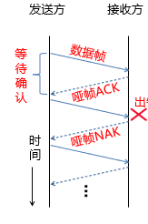

###### 状态机

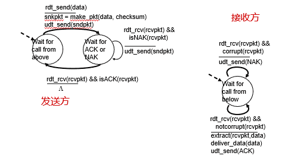

###### 缺陷

$\quad$ 问题：如果ACK或NAK出错

$\quad$ $\quad$ 检测出ACK或NAK有错后，发送方不知道接收方的状况

$\quad$ 选择1：发送方通知接收方重传ACK或NAK

$\quad$ $\quad$ 缺陷：通知本身也可能出错，陷入死循环

$\quad$ 选择2：采用更复杂的校验技术，不仅可以检测差错，还能纠正差错

$\quad$ $\quad$ 缺陷：额外的计算与传输开销

$\quad$ 选择3：发送方直接重传

$\quad$ $\quad$ 缺陷：接收方收到多份数据

###### rdt2.1

$\quad$ 选择3并额外操作：

$\quad$ $\quad$ 发送方

$\quad$ $\quad$ $\quad$ 在数据包中加上序号Seq，区分不同数据包

$\quad$ $\quad$ 接收方

$\quad$ $\quad$ $\quad$ 忽略序号重复的数据包

$\quad$ 问题1：重传（方案3）与复杂编码（方案2）的优势？

$\quad$ $\quad$ 方案2：每个ACK/NAK都需要解码，开销大

$\quad$ $\quad$ 方案3：只在出错时重传

$\quad$ 问题2：序号值范围多大？

$\quad$ $\quad$ 在停等协议下，序号seq只需要区分当前数据包是否是前一次发送的重传，1 bit足够

$\quad$ $\quad$ 前一次发送的seq=0，重传继续seq=0，下一个数据包seq=1

$\quad$ $\quad$ 前一次发送的seq=1，重传继续seq=1，下一个数据包seq=0

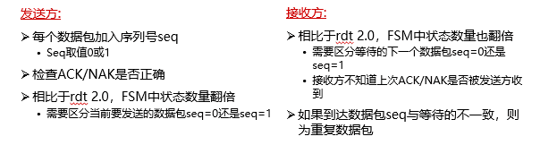

**发送方状态机**

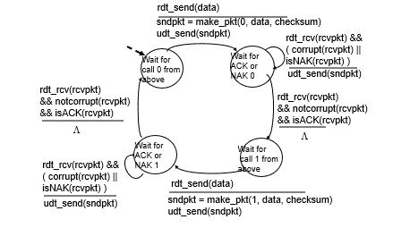

**接收方状态机**

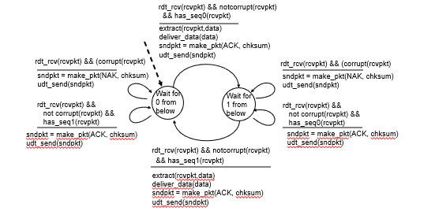

  

###### rdt 2.2——不需要NAK

$\quad$ rdt 2.1中，ACK与NAK不携带任何信息

$\quad$ rdt 2.2: 在ACK中加上最近成功接收的seq

$\quad$ $\quad$ 发送方就可以判断最近发送是否成功（通过比较ACK的seq与自己的seq）

$\quad$ $\quad$ NAK就不再需要

$\quad$ $\quad$ 当ACK出错或ACK.seq != seq，发送方进行重传

**发送方状态机**

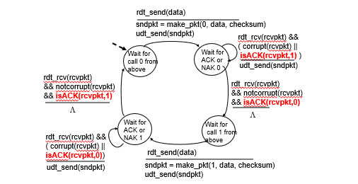

**接收方状态机**

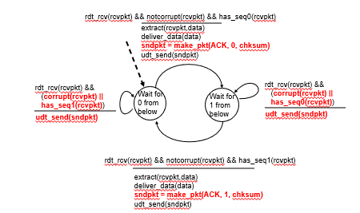

##### 有错且丢包信道:rdt 3.0协议

$\quad$ 假设

$\quad$ $\quad$ 信道不仅会出错，还会丢失数据包，导致：

$\quad$ $\quad$ $\quad$ 数据包在传输过程中可能会丢失 ，永远不可能到达接收方

$\quad$ $\quad$ 不考虑乱序

$\quad$ 解决方案：rdt 3.0

$\quad$ $\quad$ 发送方增加一个计时器(timer)，如果经过一段时间没有收到确认，发送方将超时，于是再次发送该数据包

$\quad$ $\quad$ 如果数据包只是发生了延迟（而不是丢失），会导致接收方收到多个数据包

$\quad$ $\quad$ 可以通过seq判断重复数据

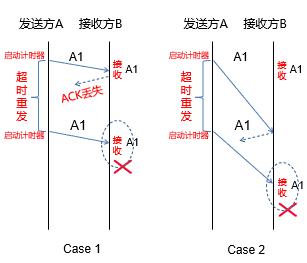

###### 状态机

**发送方：**

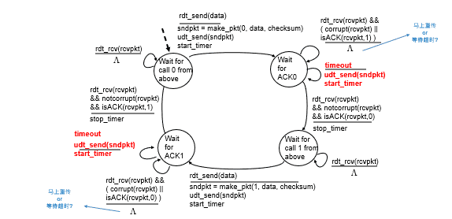

**接收方**

$\quad$ 与rdt 2.2完全一样

###### 实例

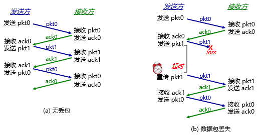

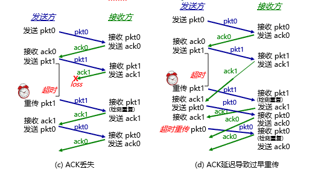

  

##### 停等式协议的效率

$\quad$ rdt 2.0, rdt 2.1, rdt 2.2, rdt 3.0都是停等式协议

$\quad$ 效率的评估

$\quad$ $\quad$ F = 数据大小 (bits)  

$\quad$ $\quad$ R = 信道发送速率 (bits/second)

$\quad$ $\quad$ I = 信道传播延迟（不考虑接发送端与收端处理延迟、接收端发送ACK延迟） 

$\quad$ $\quad$ 数据发送时间 (Time to transmit a single frame) = F/R

$\quad$ $\quad$ 往返延迟 RTT =2I

$\quad$ $\quad$ 停止等待协议的发送工作时间是F/R，空闲时间是RTT

$\quad$ $\quad$ 信道利用率 (line utilization)=F/(F+R∙RTT)

$\quad$ $\quad$ 当 F<RTT 时：信道利用率 < 50%

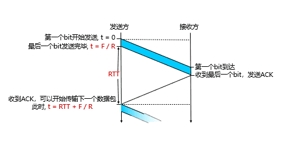

###### 效率问题

$\quad$ 信道利用率很低：

$\quad$ $\quad$ 每一帧的发送时间是1毫秒(1000 bits/(1,000,000 bits/sec)). 由于传播延迟较长，发送者在541毫秒之后才能收到确认，信道利用率1/541

$\quad$ 停止等待协议的问题是只能有一个没有被确认的帧在发送中

$\quad$ $\quad$ 假如将链路看成是一根管道，数据是管道中流动的水，那么在传输延迟较长的信道上，停-等协议无法使数据充满管道，因而信道利用率很低

$\quad$ 一种提高效率的方法：使用更大的帧

$\quad$ $\quad$ 可以使用更大的帧，但是帧的最大长度受到信道比特错误率（BER，Bit Error Ratio）的限制，帧越大，在传输中出错的概率越高，将导致更多的重传

#### 一般可靠性方案性能优化

##### 流水线传输

$\quad$ 允许发送方在没收到确认前连续发送多个数据包

$\quad$ 信道内有多个正在传输且未被确认的数据包

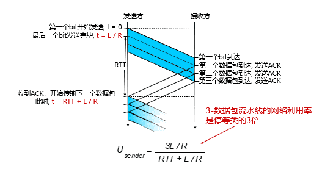

###### 要点

$\quad$ 事项1：增大序号seq的范围

$\quad$ $\quad$ 每一个等待确认的数据包都需要一个唯一的seq

$\quad$ $\quad$ 停等协议中的{0，1}不足够使用

$\quad$ $\quad$ seq被确认后可以复用

$\quad$ 事项2：发送方需保存所有未被确认的数据包

$\quad$ 事项3：处理多个数据包的丢失、损坏、超长延迟

$\quad$ $\quad$ 三要素：差错检测、反馈、重传

$\quad$ $\quad$ 根据“反馈+重传”的不同，有2种方法：回退N步（Go-back-N，GBN）、选择重传（Selective Repeat，SR）

###### 滑动窗口机制：限制最多有N个未确认数据包

$\quad$ 降低开销

$\quad$ $\quad$ 发送方：降低缓存未确认包的内存开销

$\quad$ $\quad$ 接收方：避免处理速度跟不上发送速度

$\quad$ $\quad$ 网络：减少带宽开销

$\quad$ $\quad$ Seq：有限bit位即可表示

$\quad$ 目的

$\quad$ $\quad$ 对可以连续发出的最多帧数（已发出但未确认的帧）作限制

$\quad$ 序号使用

$\quad$ $\quad$ 循环重复使用有限的帧序号

$\quad$ 接收窗口驱动发送窗口的转动

$\quad$ $\quad$ 发送窗口：其大小记作WT，表示在收到对方确认的信息之前，可以连续发出的最多数据帧数

$\quad$ $\quad$ 接收窗口：其大小记作WR ，为可以连续接收的最多数据帧数

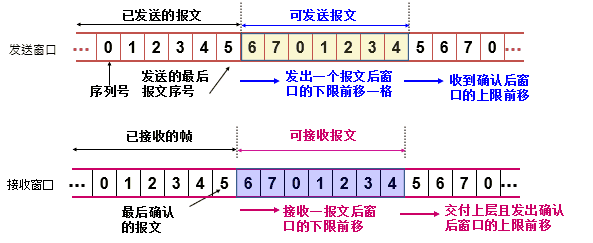

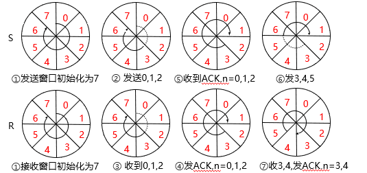

  

##### 回退N算法（GBN）

###### 确认+重传：回退N VS 选择重传

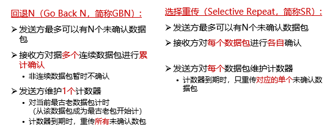

###### 回退N

$\quad$ 思想

$\quad$ $\quad$ 当接收端收到一个出错帧或乱序帧时，丢弃所有的后继帧，并且不为这些帧发送确认

$\quad$ $\quad$ 发送端超时后，重传所有未被确认的帧

$\quad$ 要点

$\quad$ $\quad$ 发送方保存所有未确认数据包

$\quad$ $\quad$ $\quad$ 构成一个先进先出队列

$\quad$ $\quad$ $\quad$ seq值连续，只需维护seq的上下界

$\quad$ $\quad$ 接收端无需保存数据包

$\quad$ $\quad$ $\quad$ 只要记住下一个期望收到的seq

$\quad$ 优劣

$\quad$ $\quad$ 优点：减轻接收端负担

$\quad$ $\quad$ 缺点：重传包数量大，增加发送端与信道负担

###### 发送方

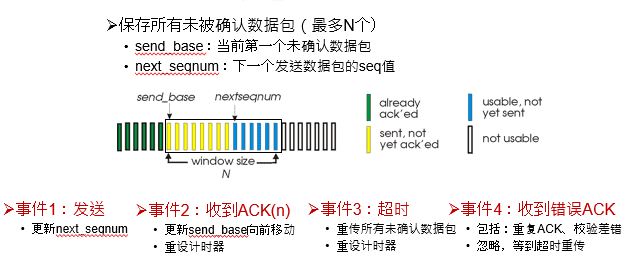

**状态机**

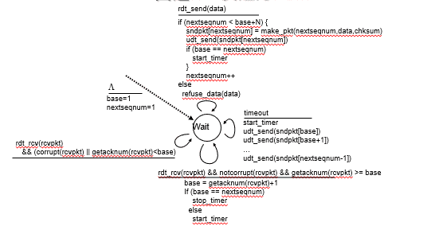

###### 接收方

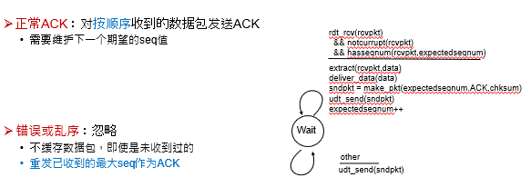

###### 实例

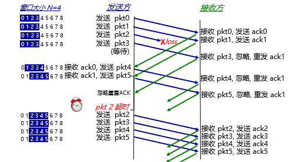

##### 选择重传(SR)

$\quad$ 设计思想

$\quad$ $\quad$ 接收方对每个数据包独立确认

$\quad$ $\quad$ 若发送方发出连续的若干包后，收到对其中某一包的ACK错误，或某一包的定时器超时， 则只重传该出错包或计时器超时的数据包

$\quad$ $\quad$ 发送端和接收端都保存数据包

$\quad$ 要点

$\quad$ $\quad$ 发送端需要对每个包维护计时器

$\quad$ $\quad$ 接收端需要缓存已经接收的数据包，以便按顺序交付给上一层

$\quad$ 优劣

$\quad$ $\quad$ 优点：减少重传数量

$\quad$ $\quad$ 缺点：接收端缓存、发送端逐包计时器

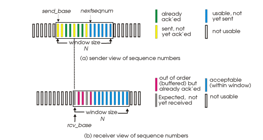

###### 处理事件

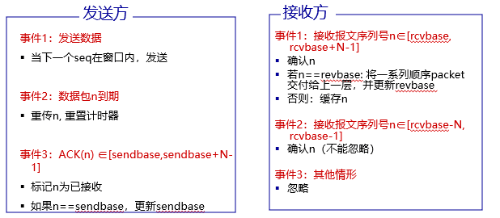

###### 例子

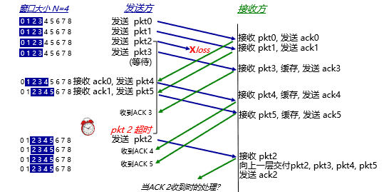

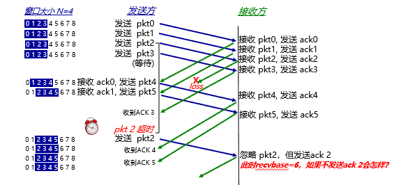

###### 与GBN对比

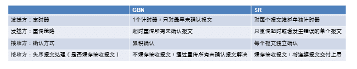

#### TCP可靠性方案

$\quad$ 高度简化的TCP协议：仅考虑可靠传输机制

$\quad$ 发送方：

$\quad$ $\quad$ 定时器的使用：仅对最早未确认的报文段使用一个重传定时器（与GBN类似）

$\quad$ $\quad$ 重发策略：仅在超时后重发最早未确认的报文段（与SR类似，因为接收端缓存了失序的报文段）

$\quad$ 接收方：

$\quad$ $\quad$ 确认方式：采用累积确认，仅在正确、按序收到报文段后，更新确认序号；其余情况，重复前一次的确认序号（与GBN类似）

$\quad$ $\quad$ 失序报文段处理：缓存失序的报文段（与SR类似）

##### TCP可靠数据传输

$\quad$ TCP 在不可靠的IP服务上建立可靠的数据传输

$\quad$ $\quad$ 可能报文出错（但可以校验）、丢包、乱序

$\quad$ 基本机制：流水线传输

$\quad$ $\quad$ 发送端：流水线式发送数据、等待确认、超时重传

$\quad$ $\quad$ 接收端：进行差错检测、确认接收

$\quad$ 对字节建立序号，而非报文

$\quad$ $\quad$ ACK值为下一个期望的字节序号，而非当前已经收到的最后一个字节

$\quad$ $\quad$ ACK值放在正常数据包里（捎带，piggyback）

$\quad$ 乱序处理：协议没有明确规定实现方式

$\quad$ $\quad$ 接收端不缓存：可以正常工作，处理简单，但效率低

$\quad$ $\quad$ 接收端缓存：效率高，但处理复杂

##### TCP发送端

###### 事件处理

$\quad$ 事件1：收到应用数据：

$\quad$ $\quad$ 创建并发送TCP报文段

$\quad$ $\quad$ 若当前没有定时器在运行（没有已发送、未确认的报文段），启动定时器

$\quad$ 事件2：超时:

$\quad$ $\quad$ 重传包含最小序号的、未确认的报文段

$\quad$ $\quad$ 重启定时器

$\quad$ 事件3：收到ACK：

$\quad$ $\quad$ 如果确认序号大于基序号（已发送未确认的最小序号）：

$\quad$ $\quad$ $\quad$ 推进发送窗口（更新基序号）

$\quad$ $\quad$ $\quad$ 如果发送窗口中还有未确认的报文段，重启定时器，否则终止定时器

###### 状态机

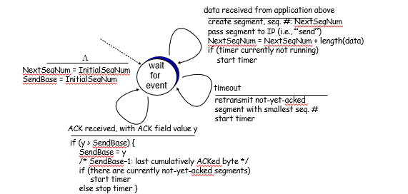

###### 重传场景

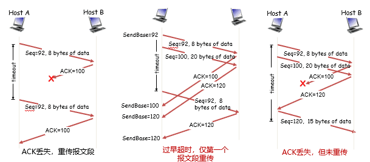

  

$\quad$ TCP通过采用以下机制减少了不必要的重传：

$\quad$ $\quad$ 只使用一个定时器且只重发第一个未确认报文，避免了超时设置过小时重发大量报文段

$\quad$ $\quad$ 利用流水式发送和累积确认，可以避免重发某些丢失了ACK的报文段

###### 优化1：设置超时值

$\quad$ 若超时值太小，容易产生不必要的重传

$\quad$ 若超时值太大，则丢包恢复的时间太长

$\quad$ 直观上，超时值应大于RTT，但RTT是变化的

$\quad$RTT是变化的，需要实时测量从发出某个报文段到收到其确认报文段之间经过的时间（称SampleRTT）

$\quad$ $\quad$ 由于SampleRTT波动很大，更有意义的是计算其平均值（称EstimatedRTT）

$\quad$ $\quad$ 平均RTT的估算方法（指数加权移动平均）：EstimatedRTT = (1- a)*EstimatedRTT + a*SampleRTT（典型地，a = 0.125）

$\quad$ 瞬时RTT和平均RTT有很大的偏差：

$\quad$ $\quad$ 需要在EstimtedRTT 上加一个“安全距离”，作为超时值

$\quad$ $\quad$ 安全距离的大小与RTT的波动幅度有关

$\quad$ 估算SampleRTT 与 EstimatedRTT的偏差（称DevRTT）：DevRTT = (1-b)*DevRTT + b*|SampleRTT-EstimatedRTT|（典型地， b = 0.25）

$\quad$ 设置重传定时器的超时值：

$\quad$ $\quad$ TimeoutInterval = EstimatedRTT + 4xDevRTT

**TCP确认的二义性**

$\quad$ 重传的TCP报文段使用与原报文段相同的序号

$\quad$ 发送端收到确认后 ，无法得知是对哪个报文段进行的确认

$\quad$ 解决方法：

$\quad$ $\quad$ 忽略有二义性的确认，只对一次发送成功的报文段测量SampleRTT ，并更新EstimtedRTT

$\quad$ $\quad$ 当TCP重传一个段时，停止测量SampleRTT

**定时器补偿**

$\quad$ 简单忽略重传报文段的问题：

$\quad$ $\quad$ 重传意味着超时值可能偏小了，需要增大

$\quad$ $\quad$ 若简单忽略重传报文段（不更新EstimtedRTT），则超时值也不会更新，超时设置过小的问题没有解决

$\quad$ 解决方法：

$\quad$ $\quad$ 采用定时器补偿策略，发送方每重传一个报文段，就直接将超时值增大一倍（不依赖于RTT的更新）

$\quad$ $\quad$ 若连续发生超时事件，超时值呈指数增长（至一个设定的上限值）

**Karn算法**

$\quad$ Karn算法结合使用RTT估计值和定时器补偿策略确定超时值：

$\quad$ $\quad$ 使用EstimatedRTT估计初始的超时值

$\quad$ $\quad$ 若发生超时，每次重传时对定时器进行补偿（超时值加倍），直到成功传输一个报文段为止

$\quad$ $\quad$ 若收到上层应用数据、或某个报文段没有重传就被确认了，用最近的EstimatedRTT估计超时值

###### 优化2 ：快速重传

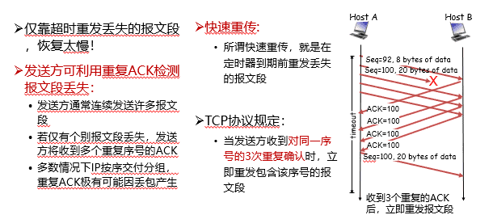

```c

 event: ACK received, with ACK field value of y

if (y > SendBase)

{ //收到更新的确认号

SendBase = y

if (there are currently not-yet-acknowledged segments)

start timer

}

else

{ //收到重复序号的ACK

increment count of dup ACKs received for y

if (count of dup ACKs received for y = 3) {

resend segment with sequence number y　//快速重传　

}

```


##### TCP接收端

$\quad$ 理论上，接收端只需区分两种情况：

$\quad$ $\quad$ 收到期待的报文段：发送更新的确认序号

$\quad$ $\quad$ 其它情况：重复当前的确认序号

$\quad$ 为减小通信量，TCP允许接收端推迟确认：

$\quad$ $\quad$ 接收端可以在收到若干个报文段后，发送一个累积确认的报文段（类似GBN）

$\quad$ 理论上，接收端只需区分两种情况：

$\quad$ $\quad$ 收到期待的报文段：发送更新的确认序号

$\quad$ $\quad$ 其它情况：重复当前的确认序号

$\quad$ 为减小通信量，TCP允许接收端推迟确认：

$\quad$ $\quad$ 接收端可以在收到若干个报文段后，发送一个累积确认的报文段（类似GBN）

###### 事件

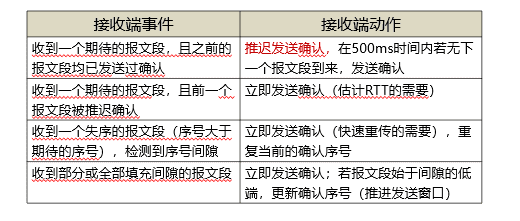

###### TCP结合了GBN和SR的优点

$\quad$ 定时器的使用：与GBN类似，只对最早未确认的报文段使用一个定时器

$\quad$ 超时重传：与SR类似，只重传部分数据

$\quad$ TCP在重传开销方面要优于GBN 和 SR！

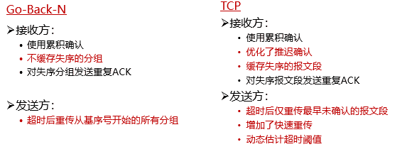

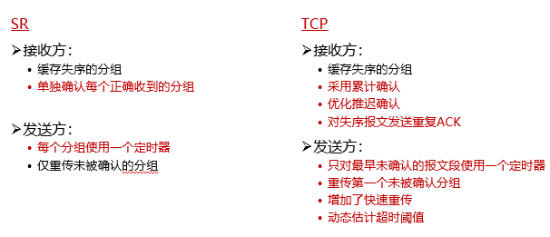
---
