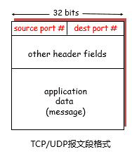
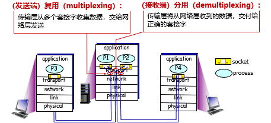
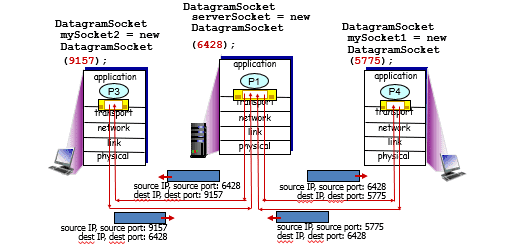
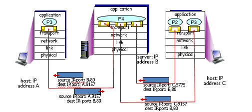
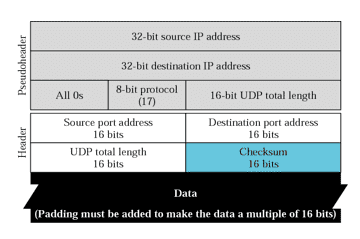

# 计算机网络

## 传输层 - 基本概念与UDP
### 基本概念

$\quad$ 传输层位于应用层和网络层之间：

$\quad$ $\quad$ 基于网络层提供的服务，向不同主机上的应用程序提供通信服务

$\quad$ 从网络的角度：屏蔽应用复杂性

$\quad$ $\quad$ 按照因特网的“端到端”设计原则：网络设计不需要考虑应用程序

$\quad$ 站在应用程序的角度：屏蔽底层网络的复杂性

$\quad$ $\quad$ 应用程序只运行在终端上，即不需要为网络设备编写程序

$\quad$ $\quad$ 传输层应提供进程之间通信的抽象：即运行在不同终端上的应用进程仿佛是直接连在一起的

#### 接口

##### 与应用层的接口

$\quad$ 设想在应用程序和网络之间存在一扇“门”：

$\quad$ $\quad$ 需要发送报文时：发送进程将报文推到门外

$\quad$ $\quad$ 门外的运输设施（因特网）将报文送到接收进程的门口

$\quad$ $\quad$ 需要接收报文时：接收进程打开门，即可收到报文

$\quad$ 在TCP/IP网络中，这扇“门”称为套接字（socket），是应用层和传输层的接口，也是应用程序和网络之间的API

##### 与网络层的接口

$\quad$ 网络层

$\quad$ $\quad$ 提供两台主机之间通信接口

$\quad$ $\quad$ 可能经多跳链路进行数据传输

$\quad$ 传输层

$\quad$ $\quad$ 主机上一对应用程序之间通信

$\quad$ $\quad$ 通过调用网络层接口，并进行必要的增强

#### 提供的服务

$\quad$ Internet的网络层提供“尽力而为”的服务：

$\quad$ $\quad$ 网络层尽最大努力在终端间交付分组，但不提供任何承诺

$\quad$ $\quad$ 具体来说

$\quad$ $\quad$ $\quad$ 不保证交付成功

$\quad$ $\quad$ $\quad$ 不保证按序交付

$\quad$ $\quad$ $\quad$ 不保证数据完整

$\quad$ $\quad$ $\quad$ 不保证延迟

$\quad$ $\quad$ $\quad$ 不保证带宽等

$\quad$ 传输层的有所为、有所不为:

$\quad$ $\quad$ 传输层可以通过差错恢复、重排序等手段提供可靠、按序的交付服务

$\quad$ $\quad$ 但传输层无法提供延迟保证、带宽保证等服务

#### 协议：UDP与TCP

$\quad$ 传统Internet提供2种传输层协议供应用层选择

$\quad$ $\quad$ UDP：最低限度的传输服务：

$\quad$ $\quad$ $\quad$ 对网络层接口进行最简单的封装

$\quad$ $\quad$ $\quad$ 主机-主机的数据交付 -> 进程-进程的数据交付

$\quad$ $\quad$ $\quad$ 发送、接收数据的单位是数据报（应用层需处理报文边界）

$\quad$ $\quad$ $\quad$ 报文检错

$\quad$ $\quad$ TCP：最低限度服务 + 增强服务：

$\quad$ $\quad$ $\quad$ 以字节流的形式发送、接收数据（应用层感受不到报文边界）

$\quad$ $\quad$ $\quad$ 可靠数据传输

$\quad$ $\quad$ $\quad$ 流量控制

$\quad$ $\quad$ $\quad$ 拥塞控制

##### 套接字对比

$\quad$ UDP套接字

$\quad$ $\quad$ 使用<IP地址，端口号>二元组标识UDP套接字

$\quad$ $\quad$ 服务器使用一个套接字服务所有客户

$\quad$ TCP套接字

$\quad$ $\quad$ 使用<源IP地址，目的IP地址，源端口号，目的端口号> 四元组标识连接套接字

$\quad$ $\quad$ 服务器使用一个监听套接字和多个连接套接字服务多个客户，每个连接套接字服务一个客户

#### 套接字端口号

$\quad$ 端口号是套接字标识的一部分：

$\quad$ $\quad$ 每个套接字在本地关联一个端口号

$\quad$ $\quad$ 端口号是一个16比特的数

$\quad$ 端口号的分类：

$\quad$ $\quad$ 熟知端口：0～1023，由公共域协议使用

$\quad$ $\quad$ 注册端口：1024～49151，需要向IANA注册才能使用

$\quad$ $\quad$ 动态和/或私有端口：49152～65535，一般程序使用

$\quad$ 报文段中有两个字段携带端口号

$\quad$ $\quad$ 源端口号：与发送进程关联的本地端口号

$\quad$ $\quad$ 目的端口号：与接收进程关联的本地端口号



##### 分配

###### 自动分配：

$\quad$ 创建套接字时不指定端口号

$\quad$ 由操作系统从49152～65535中分配

$\quad$ 客户端通常使用这种方法

###### 使用指定端口号创建套接字：

$\quad$ 创建套接字时指定端口号

$\quad$ 实现公共域协议的服务器应分配保留端口号（0～1023）

$\quad$ 服务器通常采用这种方法

##### 复用与分用

$\quad$ 问题：如何通过端口号，将数据对应到正确的套接字？

$\quad$ 回答：无论UDP还是TCP，都基于多路复用与分用实现进程-进程数据交付



$\quad$ 复用：

$\quad$ $\quad$ 发送方传输层将套接字标识置于报文段中，交给网络层

$\quad$ $\quad$ 类比：快递员将一个学校里的邮件收集齐，交给物流系统

$\quad$ 分用：

$\quad$ $\quad$ 接收方传输层根据报文段中的套接字标识，将报文段交付到正确的套接字

$\quad$ $\quad$ 类比：快递员将每个邮件，交给对应收信人

###### UDP分用

$\quad$ UDP套接字使用<IP地址, 端口号>二元组进行标识

$\quad$ 接收方传输层收到一个UDP报文段后：

$\quad$ $\quad$ 检查报文段中的目的端口号，将UDP报文段交付到具有该端口号的套接字

$\quad$ $\quad$ <目的IP地址，目的端口号> 相同的UDP报文段被交付给同一个套接字，与 <源IP地址，源端口号> 无关

$\quad$ $\quad$ 报文段中的 <源IP地址，源端口号> 被接收进程用来发送响应报文



###### TCP分用

$\quad$ 一个TCP服务器为了同时服务很多个客户，使用两种套接字

$\quad$ $\quad$ 监听套接字：

$\quad$ $\quad$ $\quad$ 服务器平时在监听套接字上等待客户的连接请求，该套接字具有众所周知的端口号

$\quad$ $\quad$ 连接套接字：

$\quad$ $\quad$ $\quad$ 服务器在收到客户的连接请求后，创建一个连接套接字，但使用原监听端口号

$\quad$ $\quad$ $\quad$ 每个连接套接字只与一个客户通信，即只接收具有以下四元组的报文段：

$\quad$ $\quad$ $\quad$ $\quad$ 源IP地址 = 客户IP地址，源端口号 = 客户套接字端口号

$\quad$ $\quad$ $\quad$ $\quad$ 目的IP地址 = 服务器IP地址，目的端口号 = 服务器监听套接字的端口号

$\quad$ 连接套接字需要使用<源IP地址，目的IP地址，源端口号，目的端口号>四元组进行标识，服务器使用该四元组将TCP报文段交付到正确的连接套接字



### UDP

#### 服务

$\quad$ 网络层提供的服务（best-effort service）：

$\quad$ $\quad$ 尽最大努力将数据包交付到目的主机

$\quad$ $\quad$ 不保证投递的可靠性和顺序

$\quad$ $\quad$ 不保证带宽及延迟要求

$\quad$ UDP提供的服务：

$\quad$ $\quad$ 对网络层接口进行最简单的封装：网络层 + 多路复用与分解

$\quad$ $\quad$ 将主机-主机的数据交付 -> 进程-进程的数据交付

$\quad$ $\quad$ 报文完整性检查（可选）：检测并丢弃出错的报文

$\quad$ UDP的实现：

$\quad$ $\quad$ 复用和分用（必须）

$\quad$ $\quad$ 报文检错（可选）

#### 报文结构

$\quad$ UDP报文：

$\quad$ $\quad$ 报头：携带协议处理需要的信息

$\quad$ $\quad$ 载荷（payload）：携带上层数据

$\quad$ 用于复用和分用的字段：

$\quad$ $\quad$ 源端口号

$\quad$ $\quad$ 目的端口号

$\quad$ 用于检测报文错误的字段：

$\quad$ $\quad$ 报文总长度

$\quad$ $\quad$ 校验和（checksum）

##### 校验和

$\quad$ 校验和字段的作用:  对传输的报文段进行检错

$\quad$ 发送方:

$\quad$ $\quad$ 将报文段看成是由16比特整数组成的序列

$\quad$ $\quad$ 对这些整数序列计算校验和

$\quad$ $\quad$ 将校验和放到UDP报文段的checksum字段

$\quad$ 接收方:

$\quad$ $\quad$ 对收到的报文段进行相同的计算

$\quad$ $\quad$ 与报文段中的checksum字段进行比较：

$\quad$ $\quad$ $\quad$ 不相等：说明报文段有错误

$\quad$ $\quad$ $\quad$ 相等：认为报文段没有错误

###### 计算

$\quad$ 步骤一：将数据划分为一系列16-bit整数

$\quad$ 步骤二：将所有整数相加

$\quad$ $\quad$ 每次将1个整数与当前和(sum)相加

$\quad$ $\quad$ 如果相加结果最高位为1（16比特溢出），则将1加到低位16bit部分

$\quad$ 将最终结果取反

```c

unsighed short checksum(unsigned short *buf,int nword)

{

usigned long sum;

for(sum=0;nword>0;nword--)

{

sum=*buf++;

sum=(sum>>16)+(sum&0xffff);

return ~sum;

}

}

```

#### UDP校验

$\quad$ 计算UDP校验和时，要包括伪头、UDP头和数据三个部分

$\quad$ $\quad$ 计算校验和时，checksum字段填0

$\quad$ UDP伪头信息取自IP报头，包括：

$\quad$ $\quad$ 源IP地址，目的IP地址

$\quad$ $\quad$ UDP的协议号

$\quad$ $\quad$ UDP报文段总长度

$\quad$ 计算校验和时包含伪头信息，是为了避免由于IP地址错误等造成的误投递

$\quad$ UDP校验和的使用是可选的，若不计算校验和，该字段填入0



$\quad$ checksum仍有可能检测不出错误

$\quad$ $\quad$ 如：两个16位整数，在同一个bit位发生0-1翻转

$\quad$ $\quad$ 此时，由应用层负责发现、处理错误

$\quad$ 为什么使用checksum

$\quad$ $\quad$ 传输层发生错误概率非常小

$\quad$ $\quad$ $\quad$ 链路层一般有检测、纠错功能，已经将大部分网络传输过程中的错误处理了

$\quad$ $\quad$ $\quad$ 传输层错误，一般来自于主机软件bug or 硬件故障 -> 小概率事件

$\quad$ $\quad$ 计算开销小

#### UDP缓冲区

$\quad$ 通常端系统实现（如Linux）：无发送缓冲区、有接收缓冲区

$\quad$ 发送方：从应用层获取的数据，传输层加上UDP头部后直接交给网络层

$\quad$ $\quad$ 长消息的分片、缓冲依赖于网络层、链路层提供

$\quad$ 接收方：每个socket一个缓冲区，存储着来自不同发送方的报文

$\quad$ $\quad$ 每次获得一个报文，下一次接收可能得到的是来自另一个发送方的报文

$\quad$ $\quad$ 因此，应用层是可以感知到报文边界

#### 为什么需要UDP

$\quad$ 应用可以尽可能快地发送报文：

$\quad$ $\quad$ 无建立连接的延迟

$\quad$ $\quad$ 不限制发送速率（不进行拥塞控制和流量控制）

$\quad$ 报头开销小

$\quad$ 协议处理简单

#### UDP适合哪些应用

$\quad$ 容忍丢包但对延迟敏感的应用：

$\quad$ $\quad$ 如流媒体

$\quad$ 以单次请求/响应为主的应用：

$\quad$ $\quad$ 如DNS

$\quad$ 若应用要求基于UDP进行可靠传输：

$\quad$ $\quad$ 由应用层实现可靠性

  
  
  

---
---
