# 计算机网络

## 传输层 -连接管理，流量控制，拥塞控制

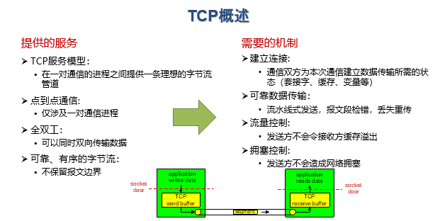

### TCP报文格式

#### TCP报文段结构

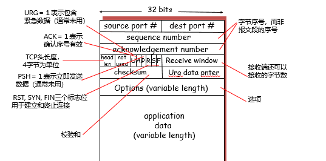

#### 重要的TCP选项

$\quad$ 最大段长度（MSS）：

$\quad$ $\quad$ TCP段(segment)中可以携带的最大数据字节数

$\quad$ $\quad$ 建立连接时，每个主机可声明自己能够接受的MSS

$\quad$ $\quad$ 通常以太网：1460字节

$\quad$ $\quad$ $\quad$ 若对端没有声明，根据网络层类型设置：IPv4缺省值536字节，IPv6缺省值1220

$\quad$ 窗口比例因子（window scale）：

$\quad$ $\quad$ 建立连接时，双方可以协商一个窗口比例因子

$\quad$ $\quad$ 实际接收窗口大小 = window size * 2^window scale

$\quad$ 选择确认（SACK）：

$\quad$ $\quad$ 最初的TCP协议只使用累积确认

$\quad$ $\quad$ 改进的TCP协议引入选择确认，允许接收端指出缺失的数据字节

#### 发送序号和确认序号

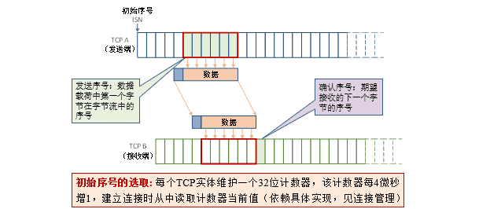

  

### TCP连接管理

$\quad$ 建立一条TCP连接需要确定两件事：

$\quad$ $\quad$ 双方都同意建立连接（知晓另一方想建立连接）

$\quad$ $\quad$ 初始化连接参数（序号，MSS等）

##### 两次握手建立连接

$\quad$ 问题:

$\quad$ $\quad$ 在网络中，2次握手总是可行的吗？

$\quad$ 在一个不可靠的网络中，总会有一些意外发生：

$\quad$ $\quad$ 包传输延迟变化很大

$\quad$ $\quad$ 存在重传的报文段

$\quad$ $\quad$ 存在报文重排序

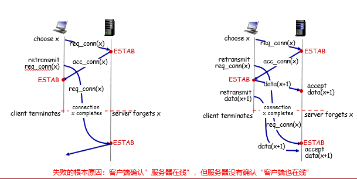

##### 三次握手建立连接

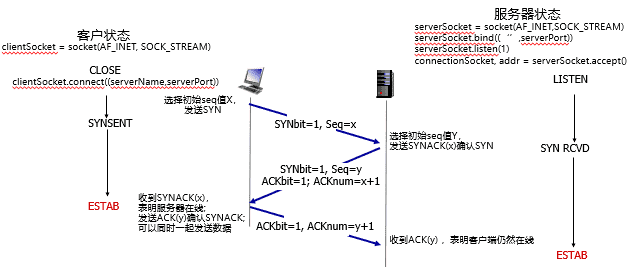

$\quad$ 1.客户TCP发送SYN 报文段（SYN=1, ACK=0）

$\quad$ $\quad$ 给出客户选择的起始序号

$\quad$ $\quad$ 不包含数据

$\quad$ 2.服务器TCP发送SYNACK报文段（SYN=ACK=1）（服务器端分配缓存和变量）

$\quad$ $\quad$ 给出服务器选择的起始序号

$\quad$ $\quad$ 确认客户的起始序号

$\quad$ $\quad$ 不包含数据

$\quad$ 3.客户发送ACK报文段（SYN=0，ACK=1）（客户端分配缓存和变量）

$\quad$ $\quad$ 确认服务器的起始序号

$\quad$ $\quad$ 可能包含数据

###### 状态机

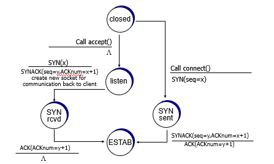

###### 避免失败情形

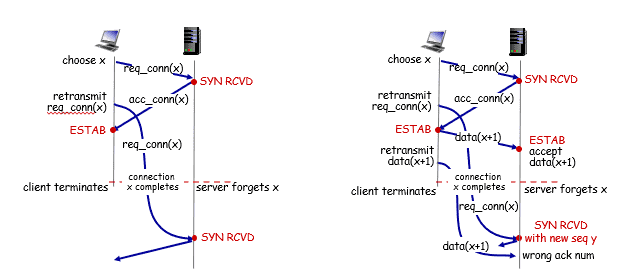

##### 如何选择起始序号

$\quad$ 为什么起始序号不从0开始？

$\quad$ $\quad$ 若在不同的时间、在同一对套接字之间建立了连接，则新、旧连接上的序号有重叠，旧连接上重传的报文段会被误以为是新连接上的报文段

$\quad$ 可以随机选取起始序号吗？

$\quad$ $\quad$ 若在不同的时间、在同一对套接字之间建立了连接，且新、旧连接上选择的起始序号x和y相差不大，那么新、旧连接上传输的序号仍然可能重叠

$\quad$ 结论：必须避免新、旧连接上的序号产生重叠

###### 基于时钟的起始序号选取算法

$\quad$ 每个主机使用一个时钟，以二进制计数器的形式工作，每隔ΔT时间计数器加1

$\quad$ 新建一个连接时，以本地计数器值的最低32位作为起始序号

$\quad$ 该方法确保连接的起始序号随时间单调增长

$\quad$ ΔT取较小的值（4微秒）：

$\quad$ $\quad$ 确保发送序号的增长速度，不会超过起始序号的增长速度

$\quad$ 使用较长的字节序号（32位）：

$\quad$ $\quad$ 确保序号回绕的时间远大于分组在网络中的最长寿命

##### 关闭TCP连接

$\quad$ 客户端、服务器都可以主动关闭连接

$\quad$ $\quad$ 通过在TCP segment中设置FIN bit = 1

$\quad$ FIN消息需要被确认

$\quad$ $\quad$ 一旦发送FIN，就不能再发送数据，只能接收数据

$\quad$ $\quad$ 一旦收到对方的FIN之后，知道对方不再发送消息，可以在己方数据发送完后安全关闭

$\quad$ 四次握手过程：

$\quad$ $\quad$ 2端各自发送FIN，也各自确认对方的FIN

$\quad$ 优化：

$\quad$ $\quad$ FIN与ACK可以一起发送

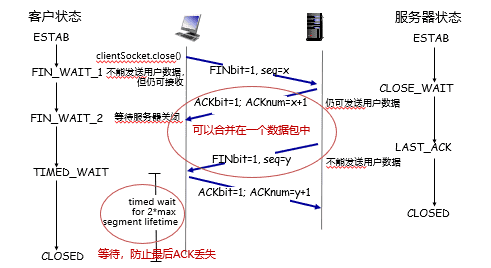

###### 异常情况

$\quad$ 丢包：4次握手均可能丢包

$\quad$ $\quad$ 处理方式：重传

$\quad$ 客户端或者服务器端下线

$\quad$ $\quad$ 另一端不断重试

$\quad$ $\quad$ 重试失败若干次后：(取决于操作系统实现）

$\quad$ $\quad$ 放弃连接，or 等待重新建立连接

###### 状态机

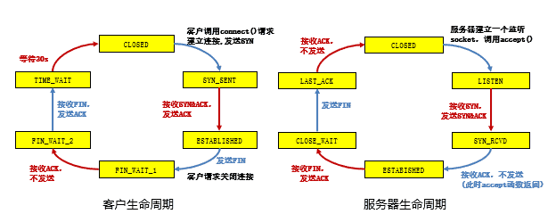

##### 握手协议的安全隐患

###### SYN洪范攻击

$\quad$ TCP实现的问题：

$\quad$ $\quad$ 服务器在收到SYN段后，发送SYNACK段，分配资源

$\quad$ $\quad$ 若未收到ACK段，服务器超时后重发SYNACK段

$\quad$ $\quad$ 服务器等待一段时间（称SYN超时）后丢弃未完成的连接，SYN超时的典型值为30秒~120秒

$\quad$ SYN洪泛攻击：

$\quad$ $\quad$ 攻击者采用伪造的源IP地址，向服务器发送大量的SYN段，却不发送ACK段

$\quad$ $\quad$ 服务器为维护一个巨大的半连接表耗尽资源，导致无法处理正常客户的连接请求，表现为服务器停止服务

###### TCP端口扫描

$\quad$ TCP端口扫描的原理：

$\quad$ $\quad$ 扫描程序依次与目标机器的各个端口进行TCP通信

$\quad$ $\quad$ 根据获得的响应来收集目标机器信息

$\quad$ SYN扫描：发送端向目标端口发送SYN报文段

$\quad$ $\quad$ 若收到SYNACK段，表明目标端口上有服务在运行

$\quad$ $\quad$ 若收到RST段，表明目标端口上没有服务在运行

$\quad$ $\quad$ 若什么也没收到，表明路径上有防火墙，有些防火墙会丢弃来自外网的SYN报文段

$\quad$ FIN扫描：试图绕过防火墙，发送端向目标端口发送FIN报文段

$\quad$ $\quad$ 若收到ACK=1、RST=1的TCP段，表明目标端口上没有服务在监听

$\quad$ $\quad$ 若没有响应，表明有服务在监听（RFC 973的规定）

$\quad$ $\quad$ 有些系统的实现不符合RFC 973规定，如在Microsoft的TCP实现中，总是返回ACK=1、RST=1的TCP段

### TCP流量控制

$\quad$ TCP接收端有一个接收缓存：

$\quad$ $\quad$ 接收端TCP将收到的数据放入接收缓存

$\quad$ $\quad$ 应用进程从接收缓存中读数据

$\quad$ $\quad$ 进入接收缓存的数据不一定被立即取走、取完

$\quad$ $\quad$ 如果接收缓存中的数据未及时取走，后续到达的数据可能会因缓存溢出而丢失

$\quad$ 流量控制：

$\quad$ $\quad$ 发送端TCP通过调节发送速率，不使接收端缓存溢出

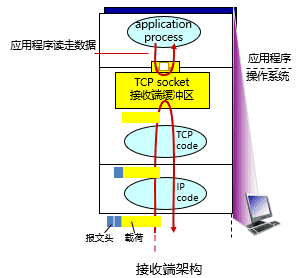

##### 不需要流量控制的情况

$\quad$ UDP不保证交付：

$\quad$ $\quad$ 接收端UDP将收到的报文载荷放入接收缓存

$\quad$ $\quad$ 应用进程每次从接收缓存中读取一个完整的报文载荷

$\quad$ $\quad$ 当应用进程消费数据不够快时，接收缓存溢出，报文数据丢失，UDP不负责任

$\quad$ 因此，UDP不需要流量控制

$\quad$ 为什么前一节课讨论GBN与SR时不需要流量控制？

$\quad$ $\quad$ 在GBN与SR中，我们假设“正确、按序到达的分组被立即交付给上层”

$\quad$ $\quad$ 因此发送方根据确认序号就可以知道哪些分组已经被移出接收窗口

$\quad$ $\quad$ 但是，现实中的TCP：收到的数据等待应用程序读取

##### 接收窗口

$\quad$ 接收缓存中的可用空间称为接收窗口：

$\quad$ $\quad$ RcvWindow =RcvBuffer-(LastByteRcvd - LastByteRead)

$\quad$ 接收方将RcvWindow放在报头中，向发送方通告接收缓存的可用空间

$\quad$ 发送方限制未确认的字节数不超过接收窗口的大小，即：

$\quad$ $\quad$ LastByteSent-LastByteAcked ≦ RcvWindow

特别是，当接收方通告接收窗口为0时，发送方必须停止发送

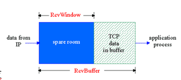

###### 非零窗口通告

$\quad$ 发送方/接收方对零窗口的处理：

$\quad$ $\quad$ 发送方：当接收窗口为0时，发送方必须停止发送

$\quad$ $\quad$ 接收方：当接收窗口变为非0时，接收方应通告增大的接收窗口

$\quad$ 在TCP协议中，触发一次TCP传输需要满足以下三个条件之一：

$\quad$ $\quad$ 应用程序调用

$\quad$ $\quad$ 超时

$\quad$ $\quad$ 收到数据

$\quad$ 对于接收方，只有第三个条件能触发传输

$\quad$ 问题：当发送方停止发送后，接收方不再收到数据，如何触发接收端发送“非零窗口通告”呢？

$\quad$ TCP协议规定：

$\quad$ $\quad$ 发送方收到“零窗口通告”后，可以发送“零窗口探测”报文段

$\quad$ $\quad$ 从而接收方可以发送包含接收窗口的响应报文段

###### 零窗口探测的实现

$\quad$ 发送端收到零窗口通告时，启动一个坚持定时器（Persistent Timer）

$\quad$ 定时器超时后，发送端发送一个零窗口探测报文段（序号为上一个段中最后一个字节的序号）

$\quad$ 接收端在响应的报文段中通告当前接收窗口的大小

$\quad$ 若发送端仍收到零窗口通告，重新启动坚持定时器

###### 糊涂窗口综合症

$\quad$ 当数据的发送速度很快、而消费速度很慢时，零窗口探测的简单实现带来以下问题：

$\quad$ $\quad$ 接收方不断发送微小窗口通告

$\quad$ $\quad$ 发送方不断发送很小的数据分组

$\quad$ $\quad$ 大量带宽被浪费

$\quad$ 解决方案：

$\quad$ $\quad$ 接收方启发式策略

$\quad$ $\quad$ 发送方启发式策略

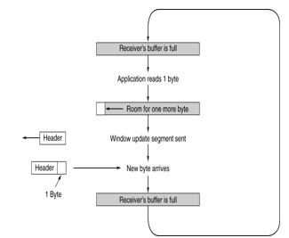

**接收方策略**

$\quad$ Clark策略：

$\quad$ $\quad$ 通告零窗口之后，仅当窗口大小显著增加之后才发送更新的窗口通告

$\quad$ $\quad$ $\quad$ 即窗口较小时，一直反馈零窗口

$\quad$ $\quad$ 什么是显著增加：窗口大小达到缓存空间的一半或者一个MSS，取两者的较小值

$\quad$ 与推迟确认结合：

$\quad$ $\quad$ 推迟发送ACK（但最多推迟500ms，且至少每隔一个报文段使用正常方式进行确认）

$\quad$ $\quad$ 寄希望于推迟间隔内有更多数据被消费

**发送方策略**

$\quad$ 发送方避免糊涂窗口综合症的策略：

$\quad$ $\quad$ 发送方应积聚足够多的数据再发送，以防止发送太短的报文段

$\quad$ 问题：发送方应等待多长时间？

$\quad$ $\quad$ 若等待时间不够，报文段会太短

$\quad$ $\quad$ 若等待时间过久，应用程序的时延会太长

$\quad$ $\quad$ 更重要的是，TCP不知道应用程序会不会在最近的将来生成更多的数据

$\quad$ Nagle算法的解决方法：

$\quad$ $\quad$ 在新建连接上，当应用数据到来时，组成一个TCP段发送（那怕只有一个字节）

$\quad$ $\quad$ 如果有未确认数据，后续到来的数据放在发送缓存中

$\quad$ $\quad$ 当（1）数据量达到一个MSS且窗口大小大于等于MSS，或（2）收到所有已发数据的确认

$\quad$ $\quad$ 用一个TCP段将缓存的字节全部发走

$\quad$ Nagle算法的优点：

$\quad$ $\quad$ 适应网络延时、MSS长度、发送方速度的各种组合

$\quad$ $\quad$ 常规情况下不会降低网络的吞吐量

$\quad$ Nagle算法缺点：

$\quad$ $\quad$ 增加延迟，尤其与延迟确认共同使用时

$\quad$ $\quad$ 不考虑接收端是否真的消费了数据

### TCP拥塞控制

##### 网络拥塞

$\quad$ 起因：大量分组短时间内进入网络，超出网络的处理能力

$\quad$ 表现：分组延迟增大，网络吞吐量下降，甚至降为0

$\quad$ 措施：减少分组进入网络（拥塞控制）

$\quad$ $\quad$ 流量控制：限制发送速度，使不超过接收端的处理能力

$\quad$ $\quad$ 拥塞控制：限制发送速度，使不超过网络的处理能力

###### 后果

$\quad$ 网络拥塞造成：

$\quad$ $\quad$ 丢包：由路由器缓存溢出造成

$\quad$ $\quad$ 分组延迟增大：链路接近满载造成

$\quad$ 大量网络资源用于：

$\quad$ $\quad$ 重传丢失的分组

$\quad$ $\quad$ （不必要地）重传延迟过大的分组

$\quad$ $\quad$ 转发最终被丢弃的分组

$\quad$ 结果：进入网络的负载很重，网络吞吐量却很低

###### 控制拥塞的常用方法

$\quad$ 网络辅助的拥塞控制

$\quad$ $\quad$ 路由器向端系统提供显式的反馈，例如：

$\quad$ $\quad$ $\quad$ 设置拥塞指示比特

$\quad$ $\quad$ $\quad$ 给出发送速率指示

$\quad$ $\quad$ ATM、X.25采用此类方法

$\quad$ $\quad$ 现代TCP变种，也会利用网络内部反馈（Explicit Congestion Notification，ECN）进行控制

$\quad$ 端到端拥塞控制

$\quad$ $\quad$ 网络层不向端系统提供反馈

$\quad$ $\quad$ 端系统通过观察丢包和延迟，自行推断拥塞的发生

$\quad$ $\quad$ 传统TCP采用此类方法

#### 要解决的问题

$\quad$ TCP使用端到端拥塞控制机制：

$\quad$ $\quad$ 发送方根据自己感知的网络拥塞程度，限制其发送速率

$\quad$ 需要回答三个问题：

##### 1.发送方如何感知网络拥塞？

$\quad$ 发送方利用丢包事件感知拥塞：

$\quad$ $\quad$ 拥塞造成丢包和分组延迟增大

$\quad$ $\quad$ 无论是实际丢包还是分组延迟过大，对于发送端来说都是丢包了

$\quad$ 丢包事件包括：

$\quad$ $\quad$ 重传定时器超时

$\quad$ $\quad$ 发送端收到3个重复的ACK

##### 2.发送方采用什么机制来限制发送速率？

$\quad$ 发送方使用拥塞窗口cwnd限制已发送未确认的数据量:

LastByteSent-LastByteAcked <= cwnd

$\quad$ cwnd随发送方感知的网络拥塞程度而变化

$\quad$ 注意：发送方还需要满足（流量控制）

$\quad$ LastByteSent-LastByteAcked <= RcvWindow

##### 3.发送方感知到网络拥塞后，采取什么策略调节发送速率？

$\quad$ 总体思路：AIMD

$\quad$ 乘性减（Multiplicative Decrease）

$\quad$ $\quad$ 发送方检测到丢包后，将cwnd的大小减半（但不能小于一个MSS）

$\quad$ $\quad$ 目的：迅速减小发送速率，缓解拥塞

$\quad$ 加性增（Additive Increase）

$\quad$ $\quad$ 若无丢包，每经过一个RTT，将cwnd增大一个MSS，直到检测到丢包

$\quad$ $\quad$ 目的：缓慢增大发送速率，避免振荡

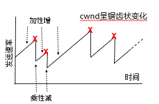

$\quad$ 原则1：正常收到ACK确认意味网络运作良好

$\quad$ $\quad$ 考虑增大cwnd

$\quad$ $\quad$ 根据当前cwnd值的大小，可以选择不同的策略

$\quad$ $\quad$ $\quad$ cwnd较小时，可以激进地增大

$\quad$ $\quad$ $\quad$ cwnd较大时，可以较为保守

$\quad$ 原则2：丢包（收到3个重复ACK或超时），意味网络状态较差，考虑降低cwnd

$\quad$ 实际的拥塞策略由慢启动、拥塞避免、快速恢复3部分组成，近似实现AIMD

###### 慢启动

$\quad$ 当cwnd较小时以什么速率发送数据?

$\quad$ $\quad$ 如：新建的连接

$\quad$ 在新建连接上，令cwnd = 1 MSS，起始速度= MSS/RTT

$\quad$ 采用“加性增”增大发送窗口，太慢！

$\quad$ $\quad$ 理由：网络中的可用带宽可能远大于MSS/RTT

$\quad$ 慢启动的基本思想：

$\quad$ $\quad$ 在新建连接上指数增大cwnd

$\quad$ $\quad$ 直至检测到丢包 or 达到足够大发送速率（此时终止慢启动）

$\quad$ 慢启动的思想：

$\quad$ $\quad$ 每经过一个RTT，将cwnd加倍

$\quad$ 慢启动的具体实施：

$\quad$ $\quad$ 每收到一个ACK段，cwnd增加一个MSS（大致等价于每个RTT加倍）

$\quad$ $\quad$ 只要发送窗口允许，发送端可以立即发送下一个报文段

$\quad$ 特点：

$\quad$ $\quad$ 以一个很低的速率开始，按指数增大发送速率

$\quad$ 慢启动比谁“慢”？

$\quad$ $\quad$ 与无拥塞控制TCP按接收窗口发送数据的策略相比，采用慢启动后发送速率的增长较慢

$\quad$ 慢启动指数增长到一定程度后，进入拥塞避免阶段

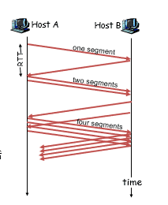

###### 拥塞避免

$\quad$ 当cwnd增大到一定程度时，此时距离拥塞可能并不遥远

$\quad$ $\quad$ 继续指数增长，容易导致拥塞

$\quad$ 解决方案：将指数增长改为线性增长

$\quad$ $\quad$ 实现：每当收到ACK， cwnd=cwnd + MSSx(MSS/cwnd)

$\quad$ $\quad$ 例子：MSS = 1460字节，cwnd = 14600字节

$\quad$ $\quad$ $\quad$ 收到第一个ACK，cwnd增加1/10 x MSS

$\quad$ $\quad$ $\quad$ 收到10个ACK后，cwnd大约增加MSS

$\quad$ 区分慢启动与拥塞避免：维护ssthresh阈值变量

$\quad$ $\quad$ 当cwnd < ssthresh，为慢启动阶段， cwnd指数增长

$\quad$ $\quad$ 当cwnd >= ssthresh，为拥塞避免阶段，cwnd线性增长

$\quad$ $\quad$ ssthresh与cwnd一样，也根据网络状态动态调整

$\quad$ 拥塞避免仍然不断增大cwnd

$\quad$ $\quad$ 尽管只是线性增长

$\quad$ 最终，cwnd超过网络可用带宽，进入拥塞状态（以丢包为标志）

###### 区别不同的个丢包事件

$\quad$ 丢包的两种情况

$\quad$ $\quad$ 发送端计时器超时（可靠传输中超时重传）

$\quad$ $\quad$ 发送端收到3个重复ACK（可靠传输中快速重传）

$\quad$ 无论慢启动阶段还是拥塞避免阶段，都可能遇到丢包

$\quad$ $\quad$ 需要更新cwnd，以及ssthresh

$\quad$ $\quad$ 甚至更改cwnd的计算策略

$\quad$ 超时和收到3个重复的ACK，它们反映出来的网络拥塞程度是一样的吗？

$\quad$ $\quad$ 当然不一样！

$\quad$ $\quad$ 超时：说明网络传输能力很差

$\quad$ $\quad$ 收到3个重复的ACK：说明网络仍有一定的传输能力

$\quad$ 因此，可以采用不同的方式处理超时与3个重复ACK

###### TCP Tahoe & TCP Reno

$\quad$ 1988年，TCP Tahoe 提出了 (1) 慢启动、(2) 拥塞避免、(3) 3个重复ACK判断丢包

$\quad$ $\quad$ 不区分收到3个重复ACK与超时，两种情况都重新开始慢启动

$\quad$ 1990年，TCP Reno (RFC 5681) 在 Tahoe 的基础上增加了 (4) 快速恢复

$\quad$ $\quad$ 收到3个重复的ACK：进入快速恢复阶段

$\quad$ $\quad$ $\quad$ 将ssthresh降低至cwnd/2

$\quad$ $\quad$ $\quad$ 将cwnd降至当前cwnd/2+3

$\quad$ $\quad$ $\quad$ 采用新机制调节cwnd，直到再次进入慢启动或拥塞避免阶段

$\quad$ $\quad$ 超时：重新开始慢启动

$\quad$ $\quad$ $\quad$ 将ssthresh降低至cwnd/2

$\quad$ $\quad$ $\quad$ 将cwnd=1MSS

$\quad$ $\quad$ $\quad$ 使用慢启动增大cwnd至ssthresh

**无快速重传：TCP Tahoe**

$\quad$ 初始cwnd=10

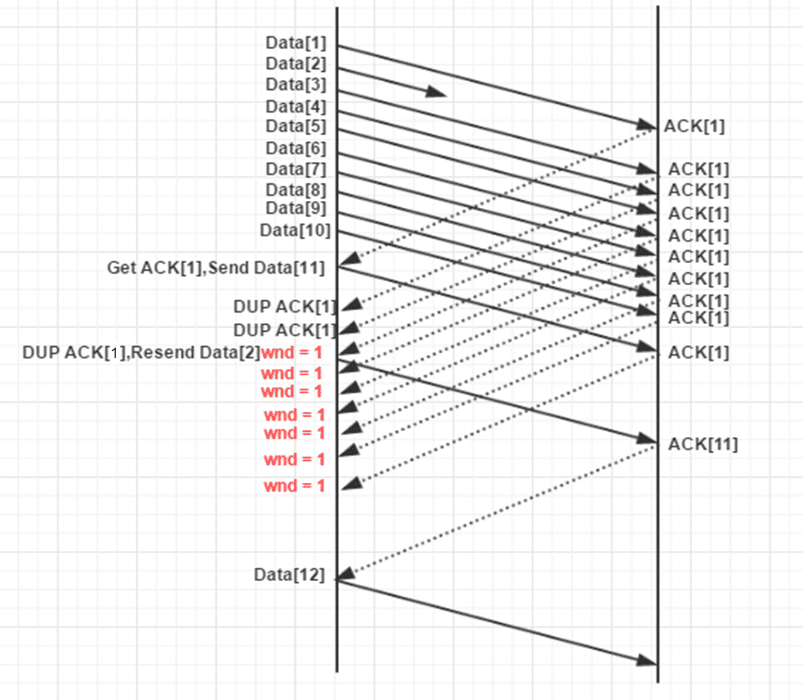

**有快速重传：TCP Reno**

$\quad$ 初始cwnd=10

$\quad$ 快速重传阶段：

$\quad$ $\quad$ cwnd增长比拥塞避免阶段快

$\quad$ $\quad$ 目的：能够发送新数据

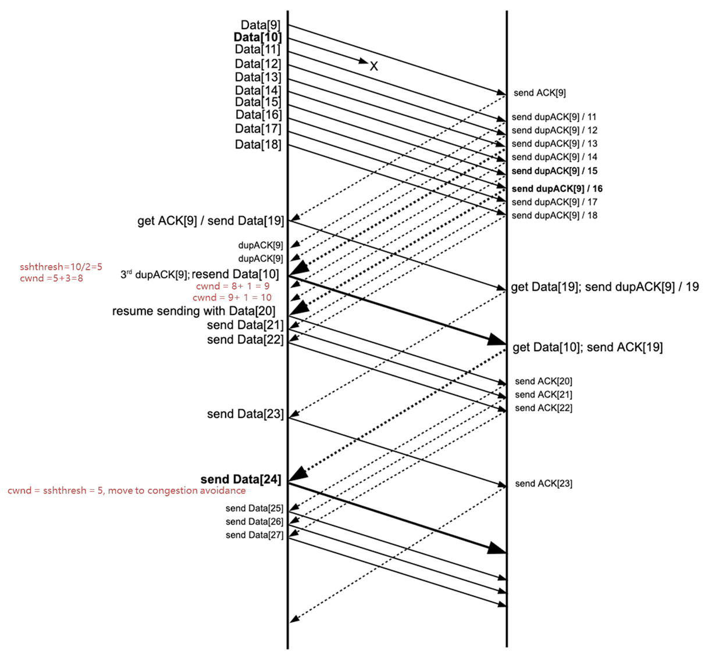

###### 快速恢复

$\quad$ 注意：当收到3个重复ACK时，才进入快速恢复阶段

$\quad$ $\quad$ 此时cwnd比ssthresh大3

$\quad$ 情形1：继续收到该重复ACK

$\quad$ $\quad$ 每次将cwnd增加1个MSS

$\quad$ 情形2：收到新ACK

$\quad$ $\quad$ 降低cwnd至ssthresh

$\quad$ $\quad$ 进入拥塞避免阶段

$\quad$ 情形3：超时

$\quad$ $\quad$ 和之前一样

#### TCP拥塞控制状态

##### 事件与动作

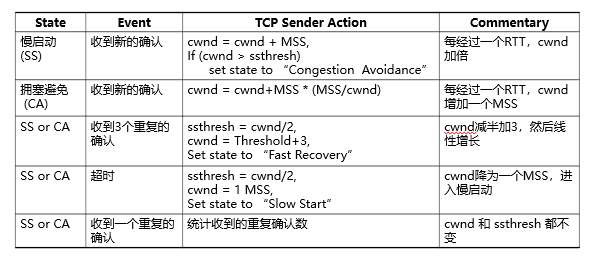

##### 状态机

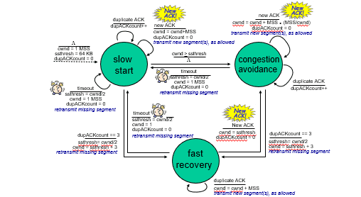

#### TCP连接的吞吐量

$\quad$ 忽略慢启动阶段（该阶段时间很短），只考虑拥塞避免+快速恢复阶段

$\quad$ $\quad$ 近似AIMD过程

$\quad$ 令W=发生丢包时的拥塞窗口，此时有：

$\quad$ $\quad$ throughput = W/RTT

$\quad$ 发生丢包后调整 cwnd=W/2（忽略+3），此时有：

$\quad$ $\quad$ throughput=W/2RTT

$\quad$ 假设在TCP连接的生命期内，RTT 和 W几乎不变，有：

$\quad$ $\quad$ Average throughout=0.75 W/RTT

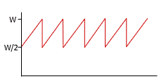

#### TCP的公平性

$\quad$ 公平性目标:

$\quad$ $\quad$ 如果K条TCP连接共享某条带宽为R的瓶颈链路，每条连接应具有平均速度R/K

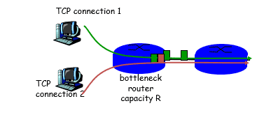

###### TCP的公平性，来自于AIMD

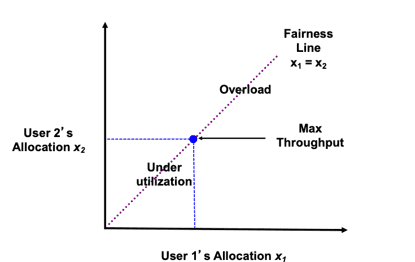

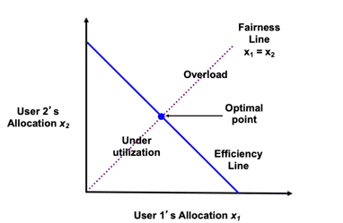

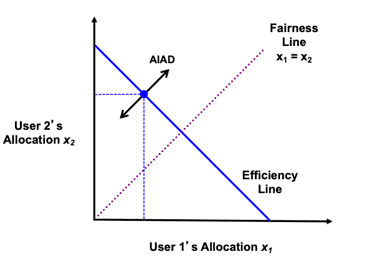

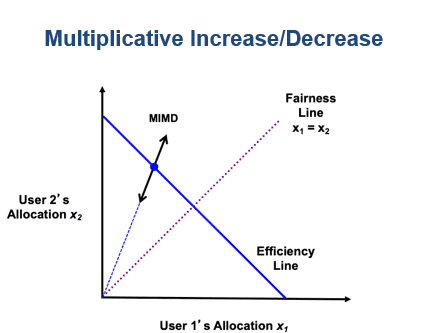

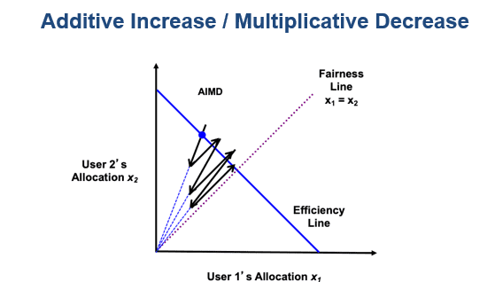

###### 为什么TCP是公平的

$\quad$ 考虑两条竞争的连接（各种参数相同）共享带宽为R的链路:

$\quad$ $\quad$ 加性增：连接1和连接2按照相同的速率增大各自的拥塞窗口，得到斜率为1的直线

$\quad$ $\quad$ 乘性减：连接1和连接2将各自的拥塞窗口减半

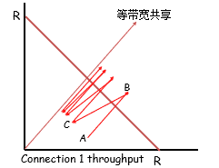

###### 更复杂的情形

$\quad$ 若相互竞争的TCP连接具有不同的参数（RTT、MSS等），不能保证公平性

$\quad$ 若应用（如web）可以建立多条并行TCP连接，不能保证带宽在应用之间公平分配，比如：

$\quad$ $\quad$ 一条速率为R的链路上有9条连接

$\quad$ $\quad$ 若新应用建立一条TCP连接，获得速率 R/10

$\quad$ $\quad$ 若新应用建立11条TCP，可以获得速率 0.55R !

  

---