# 计算机网络

## 新型传输层协议

#### DCCP

###### UDP的问题

$\quad$ 一些容忍少量丢包、但延迟敏感的应用，适合采用UDP传输：

$\quad$ $\quad$ 如视频会议、在线游戏等

$\quad$ 然而，UDP没有拥塞控制机制：

$\quad$ $\quad$ 拥塞发生时，UDP既感知不到拥塞，也不会降低其发送速率，从而影响应用性能，也影响网络的整体性能

$\quad$ $\quad$ 对TCP协议极不友好，损害网络公平性（TCP让出的带宽都被UDP占了）

###### 解决方案

$\quad$ 给UDP增加拥塞控制机制

$\quad$ DCCP=UDP+拥塞控制

$\quad$ $\quad$ 增加ACK报文、包序列号、面向连接等拥塞控制手段

$\quad$ DCCP提供不可靠数据报流服务：

$\quad$ $\quad$ UDP报文段可能丢失、乱序到达

$\quad$ $\quad$ 无流量控制

$\quad$ DCCP提供模块化的拥塞控制：

$\quad$ $\quad$ 应用可以根据需要，选择不同的拥塞控制机制

###### DCCP的报文格式

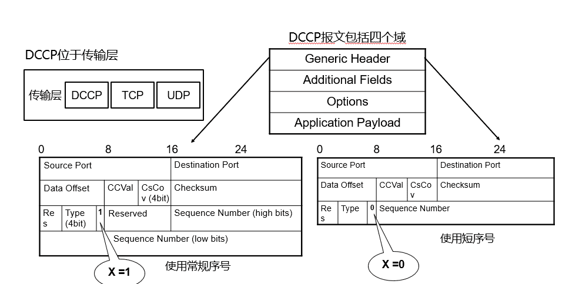

###### DCCP的报文类型

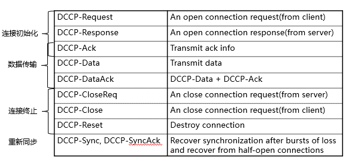

###### DCCP 连接

$\quad$ DCCP是面向连接的，两个主机之间有一个全双工连接：

$\quad$ $\quad$ 由两个方向的半连接组成

$\quad$ $\quad$ 以A to B方向的半连接为例

$\quad$ $\quad$ $\quad$ A向B发送Data报文段

$\quad$ $\quad$ $\quad$ B向A发送ACK报文段

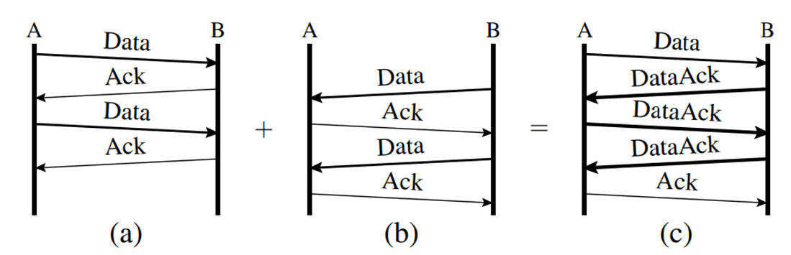

$\quad$ 同一方向的ACK段和Data段可以合并成DataAck报文段

###### DCP的交互流程

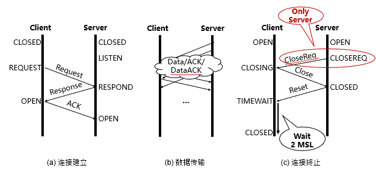

###### DCCP可靠传输

$\quad$ SeqNum与ACK只是用来拥塞控制，不要求可靠传输

$\quad$ 接收方：ACK可以不含序列号（如CCID3，只反馈丢包率）

$\quad$ 发送方：发现丢包也没有义务

##### DCCP的拥塞控制机制

$\quad$ DCCP连接支持拥塞控制，应用可以根据需要选择不同的拥塞控制机制：

$\quad$ $\quad$ 组成一个连接的两个半连接，可以选择不同的拥塞控制机制

$\quad$ 不同的拥塞控制机制由一个1字节的CCID来标识，连接建立时两个终端协商确定

$\quad$ 目前DCCP的RFC文档定义了两个CCID，分别是2和3，其余的值保留

###### TCP-like Congestion Control（CCID2）

$\quad$ 发送方维持一个发送窗口，并且不停地发包，直到没有可用的发送窗口

$\quad$ 接收方对收到的包回复ACK报文，包括一段时间内收到的所有包的序号（用于支持SACK机制）

$\quad$ 丢包或者ECN标记表示出现拥塞，此时发送端需要将发送窗口减半

###### TCP-Friendly Rate Control（CCID3）

$\quad$ 接收方计算丢包率，报告给发送方

$\quad$ 发送方根据丢包率计算发送速率，并根据发送速率发包

$\quad$ 相比而言，CCID3可以更平滑地调节发包速率

  

#### MPTCP

$\quad$ 传统TCP协议仅支持单路径传输，即只能利用终端主机上的一个网络接口传输数据

$\quad$ 随着接入技术的发展，同时具备多个网络接口的网络设备已经越来越普及，多路径传输更适合当前的网络环境

$\quad$ 多路径TCP协议（MPTCP）应运而生，它可将单一数据流切分为若干子流，同时利用多条路径进行传输

###### MPTCP的优势

$\quad$ 多径带宽聚合

$\quad$ $\quad$ 终端设备可以聚合不同路径上的可用带宽，以获得更高的网络带宽

$\quad$ 提升传输的可靠性

$\quad$ $\quad$ 使用多条路径传输数据，可以有效避免因单条路径性能恶化或中断导致的应用连接中断

$\quad$ 支持链路的平滑切换

$\quad$ $\quad$ 多路径传输方式允许终端在不同接入网络间快速、平滑地切换，选取当前链路质量最好的路径传输数据

###### MPTCP在网络体系结构中的位置

$\quad$ MPTCP位于套接字和TCP之间：

$\quad$ $\quad$ 应用程序通过套接字调用MPTCP，MPTCP向应用程序提供单条连接的抽象，因而对应用层透明

$\quad$ $\quad$ MPTCP可在源主机和目的主机的多对网络接口间分别建立TCP连接，并将数据流分配到多条TCP连接上传输

$\quad$ $\quad$ MPTCP兼容并扩展了TCP协议：TCP基本头不变，只定义了新的选项，从而对网络层也是透明

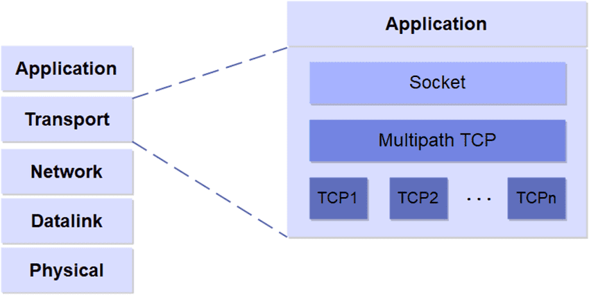

$\quad$ MPTCP连接是一个或多个子流的集合：

$\quad$ $\quad$ 路径：本地主机与远程主机之间可用于建立连接的一个链路序列称为路径，使用四元组<本地IP地址，本地端口，远程IP地址，远程端口>表示

$\quad$ $\quad$ 子流：在单个路径上运行的 TCP 流称为子流，是MPTCP连接的组成部分

##### MPTCP连接管理

$\quad$ 用于MPTCP连接管理的新字段：

$\quad$ $\quad$ MP_CAPABLE：建立MPTCP连接

$\quad$ $\quad$ MP_JOIN：附加新的子流到已有连接

$\quad$ $\quad$ ADD_ADDR：新增可用路径

$\quad$ $\quad$ REMOVE_ADDR：删除路径

$\quad$ $\quad$ MP_FASTCLOSE：关闭所有子流

$\quad$ 如何建立MPTCP连接：

$\quad$ $\quad$ 首先初始化一条MPTCP连接（与建立常规TCP连接的过程相似）

$\quad$ $\quad$ 然后将MPTCP的其它子流附加到已经存在的MPTCP连接上

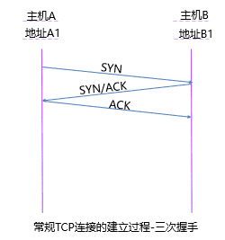

###### 初始化MPTCP连接

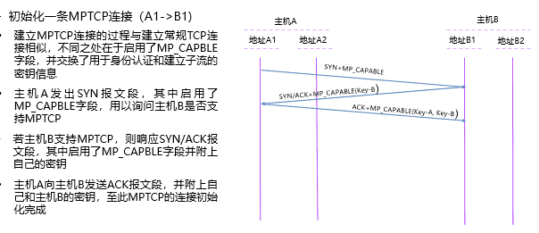

###### 附加子流到MPTCP连接上

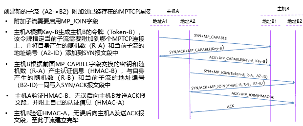

###### MPTCP路径管理和关闭连接

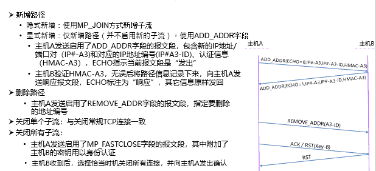

##### MPTCP的数据调度

$\quad$ 在多路径传输中，发送端将属于同一个数据流的数据包调度到不同的路径上传输，由于不同路径的差异，这些数据包往往无法按照发送顺序到达接收端

$\quad$ 乱序到达的数据包需暂存在接收缓存中，直到接收缓中的数据包能够按序交付给上层应用，这既影响了数据传输的实时性，又影响了网络的吞吐量

$\quad$ MPTCP根据拥塞窗口大小及路径延迟，将数据按比例分配给各个子流，尽力保证数据包按序到达接收端，降低数据乱序到达对网络性能产生的不利影响

##### MPTCP的拥塞机制

$\quad$ IETF MPTCP工作组提出的拥塞控制的设计目标

$\quad$ $\quad$ 提升吞吐量：多路径TCP连接的各个子流获得的总吞吐量，不应低于其最优路径上单路径TCP连接的吞吐量

$\quad$ $\quad$ 公平性：多路径TCP连接在同一网络瓶颈处的多个子流，不能过多地侵占其它单路径TCP连接的带宽

$\quad$ $\quad$ 均衡拥塞：多路径TCP连接应能在满足前两个准则的情况下，实现各个子流之间的负载均衡，尽可能将拥塞路径上的流量迁移到较好的路径上

$\quad$ 公平性是关注的重点，MPTCP采用的是网络公平性原则

$\quad$ $\quad$ 举例：假设MPTCP的两个子流与一个常规TCP流共享一个网络瓶颈，则MPTCP两个子流获得的带宽应为瓶颈带宽的1/2，而不是2/3，这样才能保证MPTCP连接对常规TCP连接的友好性

$\quad$ MPTCP实现网络公平性准则的方法：

$\quad$ $\quad$ 限制各个子流窗口增长速度的总和，不超过单路径TCP连接的窗口增长速度

$\quad$ $\quad$ 从而，MPTCP连接通过各子流获得的总吞吐量和单路径TCP连接获得的吞吐量相当

#### QUIC

###### TCP存在的问题

$\quad$ TCP 实现在操作系统内核中

$\quad$ $\quad$ 作为传输优化的最终受益者，应用无法对TCP进行修改

$\quad$ $\quad$ 操作系统的更新往往跟不上应用的需求和节奏

$\quad$ TCP体系握手时延大

$\quad$ $\quad$ 互联网上的大趋势：低时延需求越来越强烈；加密流量占比越来越大

$\quad$ $\quad$ TLS(传输层安全性协议)+TCP的体系握手时延很大，传输前需要3个RTT进行握手

$\quad$ TCP多流复用存在队头阻塞问题

$\quad$ $\quad$ 当前的应用普遍比较复杂，常需要同时传输多个元素：例如：网页传输中，每个单独的图片即为一个数据流，不同数据流之间相互独立。为每个数据建立一个TCP连接很低效（尤其对于小流，单独建立连接成本高昂），因此出现了多流复用

$\quad$ $\quad$ TCP传输需要保持有序性：出现丢包时，后面的数据需要等丢失的包重传完成才能使用，这就导致了队头阻塞

###### QUIC在网络体系结构中的位置

$\quad$ 传统的传输架构

$\quad$ $\quad$ TCP提供数据传输服务

$\quad$ $\quad$ TLS（传输层安全性协议）对数据进行加密

$\quad$ $\quad$ HTTP协议定义如何发起请求-响应请求

$\quad$ $\quad$ 应用在HTTP之上实现

$\quad$ 基于QUIC的传输架构

$\quad$ $\quad$ QUIC替代TCP、TLS和部分HTTP的功能

$\quad$ QUIC实现在用户态中

$\quad$ $\quad$ 底层基于UDP实现

$\quad$ $\quad$ 拥塞控制是模块化的，可以方便地使用各种TCP拥塞控制算法，如CUBIC等

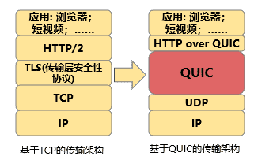

###### QUIC包格式

$\quad$ 部分相关字段：

$\quad$ $\quad$ 连接标识符(Connection ID)：

用于对连接进行表示和识别

$\quad$ $\quad$ 包号(Packet Number)：单调递增,

即同一个连接中，每个QUIC包的包号都不一样

$\quad$ QUIC底层使用UDP进传输

$\quad$ $\quad$ QUIC包作为UDP的数据载荷

$\quad$ $\quad$ IANA（互联网数字分配机构）建议QUIC使用UDP的443端口

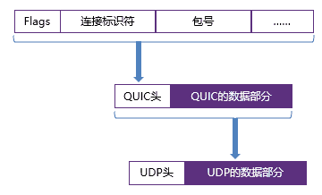

###### 连接时建立时延优化

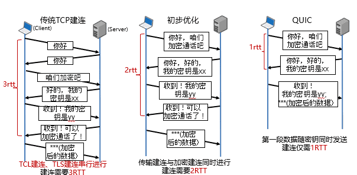

  

###### QUIC多数据流

$\quad$ TCP：1个连接1对双向字节流

$\quad$ QUIC：多字节流

$\quad$ $\quad$ 一个QUIC连接，可以用于传输多个字节流（streams）

$\quad$ $\quad$ 每个QUIC报文，甚至可以包含来自多个stream的数据

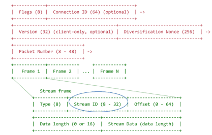

###### 无队头阻塞的多流复用

$\quad$ TCP多流复用时的队头阻塞问题

$\quad$ $\quad$ TCP为保持数据的有序性，出现丢包时，会等待该数据到达后，再提交给上层应用

$\quad$ $\quad$ 多流复用时，某个数据流的数据包丢失，会使得TCP连接上所有数据流都需要等待

$\quad$ QUIC对队头阻塞问题的解决

$\quad$ $\quad$ 在单个连接中，建立相互独立的多个QUIC流，某个流的数据包丢失不影响其它流的数据交付

$\quad$ $\quad$ 分析：TCP保证了整个连接的数据交付的有序性（有序）; QUIC利用了各个流相互独立的特性，仅保持了流内部数据的有序性（部分有序），减少了不必要的等待

$\quad$ $\quad$ 同时限制：单个流对接收端缓冲区的占用不能超过阈值

###### 明确的包序号和更精确的RTT

$\quad$ TCP中Seq的作用

$\quad$ $\quad$ ACK将Seq用于ACKNum，确认接收成功

$\quad$ $\quad$ 接收端交付数据时，判断重复数据与顺序

$\quad$ QUIC：是否还使用同样作用的seq？

$\quad$ $\quad$ 一个packet包含多个stream的frame

$\quad$ $\quad$ 各个stream独立交付

$\quad$ 因此，QUIC分离确认接收与向上层交付数据

$\quad$ $\quad$ Packet Number：ACK中确认packet接收

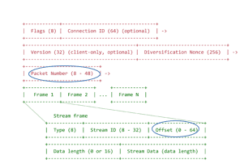

$\quad$ TCP重传歧义的问题：

$\quad$ $\quad$ TCP的重传包使用和原包相同的序号，因此可能某一序号被用了不止一次

$\quad$ $\quad$ TCP收到这一序号的ACK时，无法判断是针对哪个包的ACK，从而影响后续操作，如测量RTT的大小

$\quad$ QUIC解决重传歧义的方法：

$\quad$ $\quad$ QUIC的packet number单调递增，对于重传包也会递增packet number

$\quad$ $\quad$ 每个packet number只会出现一次，ACK没有歧义！

$\quad$ $\quad$ QUIC接收端记录收到包与发出ACK之间的时延，并发馈给发送端，方便发送端更准确地测量RTT

  

###### IP地址/端口切换无需重新建立连接

$\quad$ IP地址/端口发生变化时，TCP连接会断开

$\quad$ $\quad$ 例如手机WIFI断开时，常常自动转而使用移动信号

$\quad$ $\quad$ 此时，TCP会断连，需要应用进行处理

$\quad$ QUIC支持IP/端口切换

$\quad$ $\quad$ QUIC使用Connection ID来表示每个连接

$\quad$ $\quad$ IP地址或端口的变化不影响对原有连接的识别

$\quad$ $\quad$ 客户IP地址或端口发生变化时，QUIC可以快速恢复

$\quad$ 由传输层对连接的切换进行管理

$\quad$ $\quad$ 更符合互联网体系结构

$\quad$ $\quad$ 不再需要应用重复造轮子

###### QUIC易于部署和更新

$\quad$ 整个QUIC包被加密传输

$\quad$ $\quad$ 保护用户数据隐私

$\quad$ $\quad$ 避免被中间设备识别和修改

$\quad$ QUIC在用户态实现

$\quad$ $\quad$ 与操作系统解耦，从而能和应用一同快速迭代

$\quad$ $\quad$ 如：预留接口，用户自定义拥塞控制

$\quad$ 版本协商机制

$\quad$ $\quad$ 由于QUIC的快速迭代特性，会同时存在众多QUIC版本

$\quad$ $\quad$ 客户需要和服务器进行版本协商（不引入额外时延的协商机制

  

---