# 计算机网络

## 新型拥塞控制

$\quad$ 慢启动只占据TCP很小部分，大部分拥塞控制技术关注拥塞避免与快速恢复

$\quad$ 要素1：端系统能观察到什么?

$\quad$ $\quad$ 检测拥塞

$\quad$ 要素2：端系统可以改变什么?

$\quad$ $\quad$ 响应拥塞：

$\quad$ $\quad$ 一旦观测到拥塞，降低发送速率

$\quad$ $\quad$ 但是，如果网络条件发生改变

$\quad$ $\quad$ $\quad$ 如：网络带宽变大

$\quad$ $\quad$ $\quad$ ... 保持低发送速率将影响

$\quad$ $\quad$ 因此，一旦检测到拥塞不再存在

$\quad$ $\quad$ $\quad$ 增加速率（每次一点点）

$\quad$ $\quad$ $\quad$ 观察报文是否能正常传输

### 拥塞控制改进

#### 慢启动优化

$\quad$ 慢启动阶段的主要优化目标：CWND的初始化

$\quad$ $\quad$ CWND = 1 MSS (Tahoe)

$\quad$ $\quad$ Linux 2.6 (RFC 3390) CWND depends on MSS

$\quad$ $\quad$ Linux 3.0 (RFC 6928) CWND = 10 MSS

#### TCP New Reno,SACK

$\quad$ 思想：快速恢复阶段，针对同时多个丢包优化

$\quad$ $\quad$ 当sender收到了3个重复ACK，进入快速重传模式，重传重复ACK指示的那个包

$\quad$ $\quad$ $\quad$ 如果只有这一个包丢了，那么重传这个包且收到新ACK时，期望新ACK会把所有重传前数据进行确认

$\quad$ $\quad$ $\quad$ 否则（新ACK没对所有重传前数据确认），说明有多个包丢了,我们叫这个新ACK为Partial ACK

$\quad$ $\quad$ 一旦发现Partial ACK，sender就可以推理出有多个包被丢了

$\quad$ $\quad$ $\quad$ 继续重传未被确认的第一个包，直到再也收不到了Partial ACK，才结束Fast Recovery

##### 工作过程

$\quad$ 重传data[1]前，已发数据data[0]-data[12]

$\quad$ 收到ack[3]，说明除了data[1]，还有其他数据丢失

$\quad$ 继续处于快速恢复阶段，重传data[4]

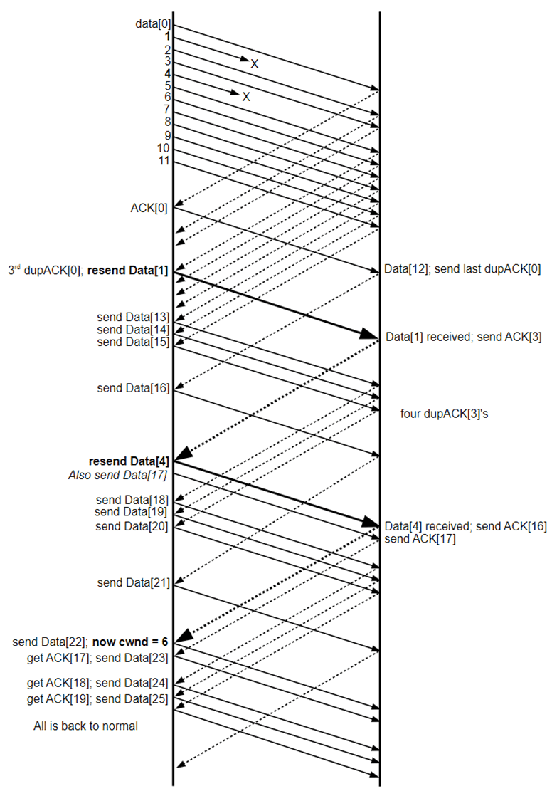

$\quad$ TCP New Reno仍存在问题：

  $\quad$ 每个RTT只能判断并重传1个丢包

##### SACK

$\quad$ SACK(选择重传)机制：一次性通知多个丢包

$\quad$ $\quad$ SACK出现在TCP头Option字段

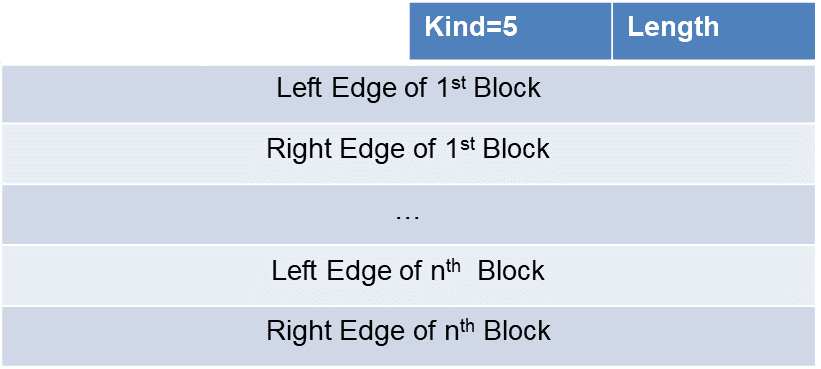

$\quad$ Left Edge表示已收到的不连续块的第一个序号，Right Edge表示已收到的不连续块的最后一个序号+1，即左闭右开区间

$\quad$ 通过ACK和SACK信息，发送方就可以确定接收方具体没有收到的数据就是从ACK到最大SACK信息之间的那些空洞的序号

$\quad$ TCP Option总共不超过40字节，每个序号4字节：1个ACK段最多4组SACK信息

#### TCP BIC

###### 经典TCP拥塞控制的性能问题

$\quad$ 核心问题：在探测满载窗口的过程中，如何增加拥塞窗口以尽可能利用网络带宽？

$\quad$ TCP Reno线性增大拥塞窗口，探测当前可用网络带宽，即每经过一个RTT，拥塞窗口增加一个MSS（拥塞避免）

$\quad$ 当端到端时延带宽乘积（BDP）较大时，拥塞窗口增长过慢，导致信道无法满载

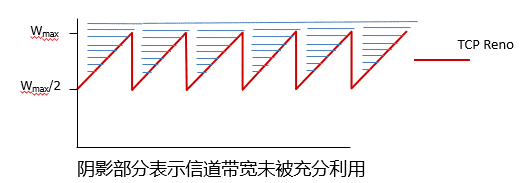

##### Binary Increase Congestion

$\quad$ BIC算法发现这么多的拥塞控制算法都在努力找一个合适的cwnd，本质就是一个搜索的过程，因此BIC算法的核心思想使用二分查找来搜索合适的cwnd

$\quad$ Linux在采用CUBIC之前的默认算法

###### 二分查找过程

$\quad$ 思想

$\quad$ $\quad$ 如果发生丢包的时候，窗口的大小是W1，那么要保持线路满载却不丢包，实际的窗口最大值应该在W1以下

$\quad$ $\quad$ $\quad$ 初始化Wmax=W1

$\quad$ $\quad$ 如果丢包后将窗口乘性减到了W2后，成功收到重传报文的ACK，那么实际的窗口值应该在W2以上 (Wmin)

$\quad$ $\quad$ $\quad$ 初始化Wmin=W2

$\quad$ ACK驱动的查找：每经过一个RTT，若无丢包发生，便将窗口设置到Wmax和Wmin的中点，一直持续到接近Wmax

$\quad$ $\quad$ 更新Wmin

###### 更新上下界：Smax和Smin

~~~c

while (Wmin <= Wmax) {

  

    inc = (Wmin+Wmax)/2 - cwnd;

  

  if (inc > Smax)

  

           inc = Smax;

  

  else if (inc < Smin)

  

           inc = Smin;

  

  cwnd = cwnd + inc * MSS / cwnd;

  

  if (no packet losses)

  

           Wmin = cwnd;

  

  else

  

           break;

  

}

~~~

###### 当cwnd超过WMAX

$\quad$ 既然cwnd度过了Wmax都没有丢包，说明新的Wmax还没有达到

$\quad$ BIC采取了一种非常简单直接的方法：按照逼近Wmax的路径倒回去，即采用与之对称的方案

###### TCP-BIC性能

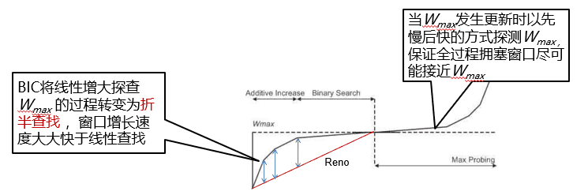

###### BIC的不公平性

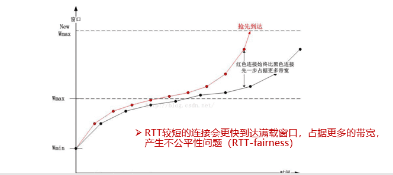

#### TCP CUBIC

$\quad$ WHY？

$\quad$ 原因1：延迟ACK以及ACK丢失的问题，BIC算法实际实现要比理论情况复杂很多

$\quad$ 原因2：BIC容易导致不公平性

$\quad$ 核心思想：

$\quad$ $\quad$ 窗口增长函数仅仅取决于当前距离上次丢包经过的时间t

$\quad$ $\quad$ 从而，窗口增长完全独立于网络的时延RTT

$\quad$ CUBIC的RTT独立性质使得CUBIC能够在多条共享瓶颈链路的TCP连接之间保持良好的RTT公平性

###### 该进

$\quad$ CUBIC将BIC算法连续化，用三次函数拟合BIC算法曲线（CUBIC名字的由来）

$\quad$ 拥塞窗口成为距上次丢包的时间t 的函数

$\quad$ $\quad$ 不再根据RTT间隔来确定调整窗口的时机，避免了RTT不公平问题

$\quad$ 三次函数增长分为两个阶段：

$\quad$ $\quad$ Steady State Behavior阶段：以凹函数增长逼近最近一次丢包时窗口

$\quad$ $\quad$ Max probing阶段：以凸函数增长探测当前满载窗口

$\quad$ 绝大多数时间内，拥塞窗口都在Wmax附近，保持了较高的发送效率

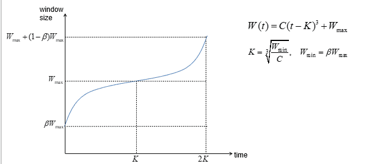

$\quad$ C越大，探测到最大窗口的时间越短，决定了对称区间的高度

$\quad$ 区间起始时刻为最近一次检测到丢包的时间

$\quad$ 对称区间的宽度不再依赖于ACK

#### TCP Vegas，TCP Westwood

  

###### Vegas

$\quad$ 核心思想是用RTT的值来影响拥塞窗口，而不是通过丢包

$\quad$ 没有大规模部署，但在轻量级系统中比较受关注

$\quad$ 具体方案

$\quad$ $\quad$ 监控RTT来计算一个RTT

$\quad$ $\quad$ 通过RTT来估计当前的实际吞吐量

$\quad$ $\quad$ 如果cwnd低于某个阈值，线性地增加cwnd

$\quad$ $\quad$ 如果实际吞吐量比我们的期望吞吐量要小很多，线性地减少cwnd

$\quad$ $\quad$ 重传改进：计算出来的RTT大于Timeout，直接重传

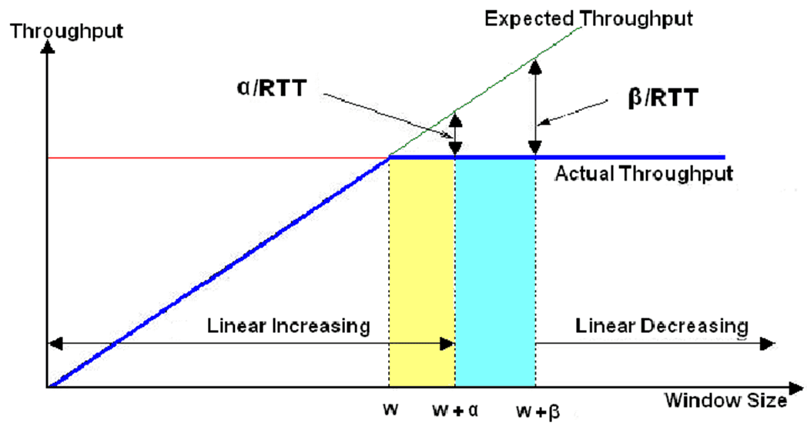

###### Westwood

$\quad$ 主要运用于无线网络

$\quad$ 核心思想：

$\quad$ $\quad$ 通过在发送端持续不断的检测ack的到达速率来进行带宽估计

$\quad$ $\quad$ 当拥塞发生时用带宽估计值来调整拥塞窗口和慢启动阈值

#### TCP BBR

###### 拥塞与瓶颈链路带宽

$\quad$ 瓶颈链路带宽BtlBw，决定了端到端路径上的最大数据投递速率

$\quad$ 当数据量到达瓶颈链路BDP时，在瓶颈链路处形成排队，导致RTT延长(甚至超时)

$\quad$ 当数据量持续增加到BDP + BufferSize时，就开始丢包

  

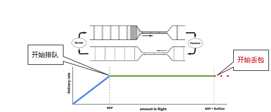

##### Bottleneck Bandwidth and Round-trip propagation time

$\quad$ BDP=BtlBw × Rtprop

$\quad$ $\quad$ 瓶颈链路带宽BtlBw：不会引起路由器缓存排队的最大发送速率

$\quad$ $\quad$ RTprop：”发送端-接收端”整个路径往返时间

$\quad$ BDP物理含义：瓶颈链路装满时，整个网络管道里的数据量

$\quad$ $\quad$ 包含瓶颈链路与其他链路

$\quad$ 传统TCP拥塞控制

$\quad$ $\quad$ 以丢包事件为驱动，探测阶段将瓶颈链路上的缓冲区填满直至丢包，并以此为依据判断是否进行被动的乘性减小

$\quad$ $\quad$ 目标：认为BDP + BtlneckBufSize是最优窗口大小

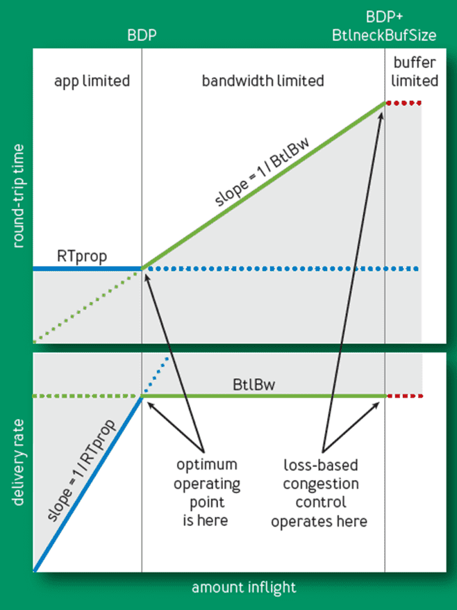

###### BBR

$\quad$ 目标：认为BDP是最优窗口大小

$\quad$ 相比于传统TCP，BBR的目标更有优势

$\quad$ $\quad$ 相同的吞吐量

$\quad$ $\quad$ 更低的延迟、更小的丢包风险

$\quad$ 核心思想

$\quad$ $\quad$ 获知当前BDP，将cwnd往BDP调整

$\quad$ BDP=BtlBw × Rtprop

$\quad$ $\quad$ 问题转化为，求当前BtlBw与Rtprop

**Max BW和min RTT不能同时被测得**

$\quad$ 要测量最大带宽，就要把瓶颈链路填满，此时buffer中存在排队分组，延迟较高

$\quad$ 要测量最低延迟，就要保证链路队列为空，网络中分组越少越好，cwnd较小

**解决方案：BDP点的近似检测**

$\quad$ 用过去10秒内的最小RTT（min RTT）和最大投递率（max BW），分别近似RTprop和BtlBw，并依据这两个值估算当前BDP

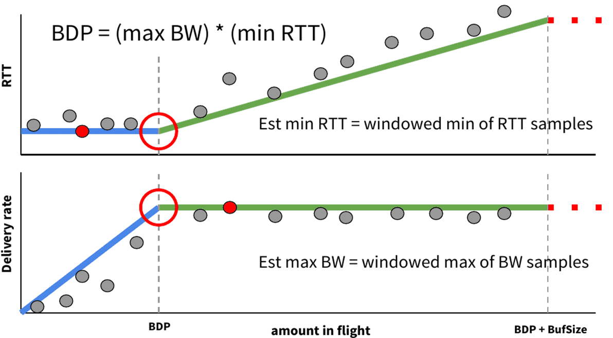

$\quad$ 启动阶段

$\quad$ $\quad$ 当连接建立时，类似TCP的慢启动，指数增加发送速率，尽可能快地占满管道

$\quad$ $\quad$ 若经过三次发现投递率不再增长，说明已达到BtlBw，瓶颈链路处分组已开始排队（事实上此时已经多发了数据）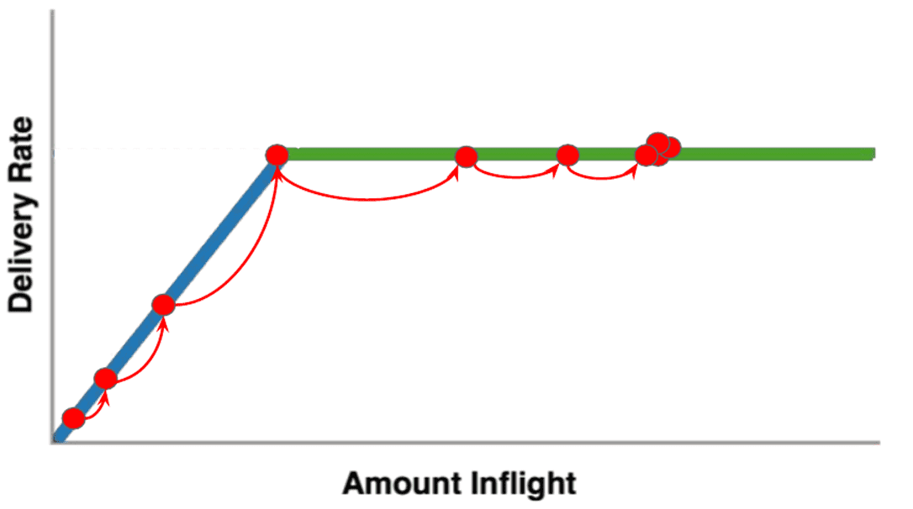

$\quad$ 排空阶段

$\quad$ $\quad$ 指数降低发送速率（相当于是startup的逆过程），将多占的数据慢慢排空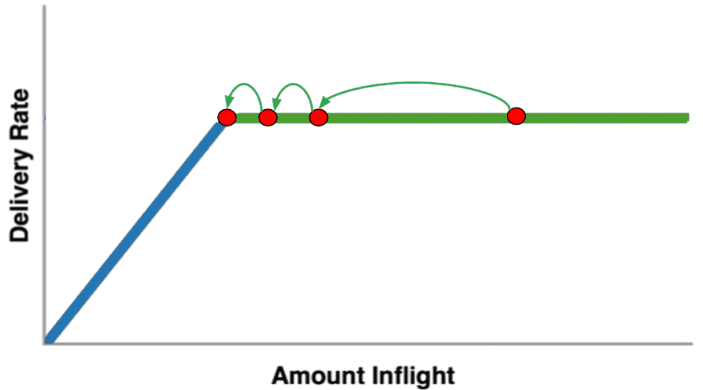

$\quad$ 瓶颈带宽探测（PROBE_BW）

$\quad$ $\quad$ 进入稳定状态后, 先在一个RTT内增加发送速率，探测最大带宽

$\quad$ $\quad$ 如果RTT增大（发生排队），再减小发送速率，排空前一个RTT多发出来的包

$\quad$ $\quad$ 后面6个RTT使用更新后的估计带宽发送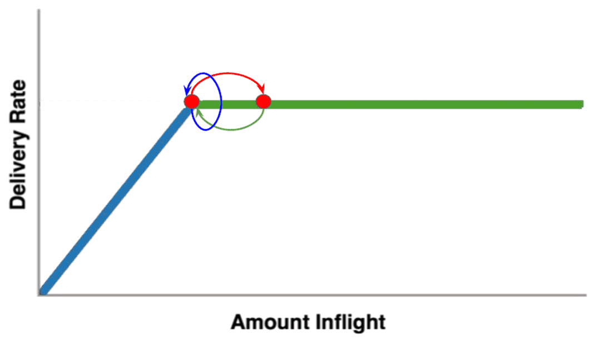

$\quad$ 时延探测

$\quad$ $\quad$ 每过10秒且RTT未更新，就进入RTprop探测阶段

$\quad$ $\quad$ 在这段占200ms(全过程2%的时间内)，cwnd固定为4个包

$\quad$ $\quad$ 测得的RTprop作为基准，在瓶颈带宽探测阶段判断是否发生排队

$\quad$ $\quad$ 为抵消此阶段牺牲的发送速率，延迟探测后快速增加发送速率，保障瓶颈带宽观测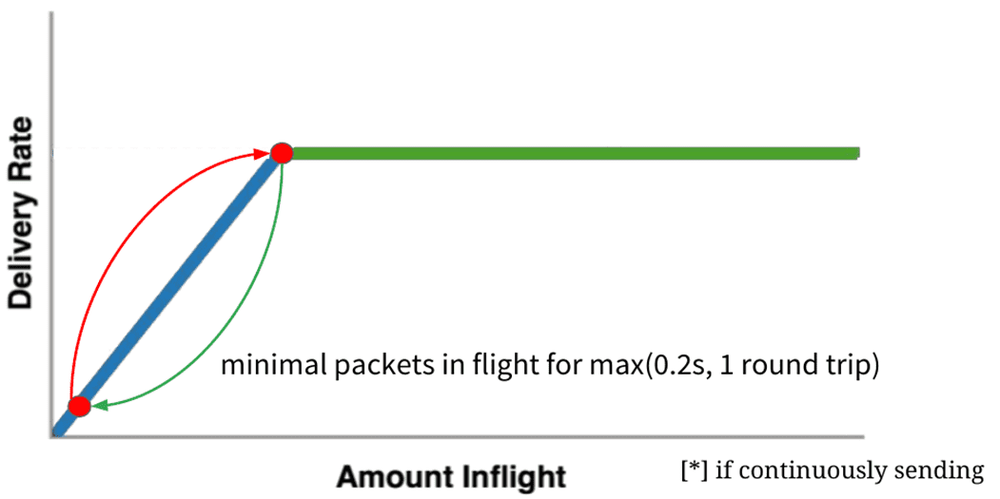

  

**BBR状态机**

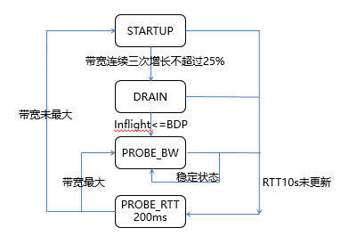

#### DCTCP

$\quad$ 针对数据中心的TCP拥塞控制算法

###### 数据中心的流量特点

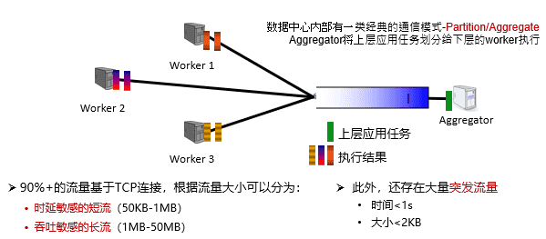

###### 数据中心的性能问题

**1.Incast**

$\quad$ 在一个很短的时间内，大量流量同时到达交换机的一个端口，导致缓冲区被占满，最终导致丢包

$\quad$ 在并发流量很大的情况下，即使每条流的包很小，也会产生Incast问题

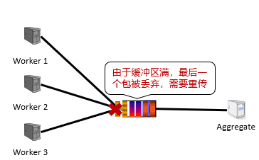

**2. Queue Buildup**

$\quad$ 长流和短流同时通过交换机的同一个端口时，由于长流占用较多的缓冲区空间，导致短流延迟增大，甚至丢包

**3. Buffer Pressure**

$\quad$ 交换机的不同端口通常共享同一块缓冲区，即使长流和短流通过不同的端口，短流通过的端口也会出现缓冲区不足的问题

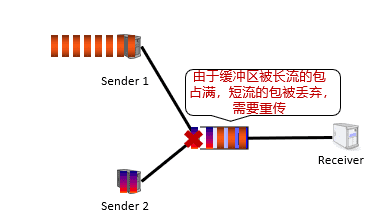

###### 数据中心协议要求

$\quad$ 容忍高突发流量

$\quad$ $\quad$ 在Partition/Aggregate通信模式中，所有Worker几乎会在同一时间向Aggregator返回执行结果，产生很高的突发流量

$\quad$ 低时延

$\quad$ $\quad$ 数据中心有大量时延敏感的短流，如网页搜索等

$\quad$ 高吞吐

$\quad$ $\quad$ 数据中心有大量吞吐敏感的长流，如文件传输、分布式机器学习中神经网络模型参数的传输等

##### DCTCP

###### 核心思想

$\quad$ 根据网络拥塞程度精细地减小发送窗口：

$\quad$ $\quad$ 一旦发现拥塞，发送窗口减至原窗口的（1-α/2），α 反映了拥塞程度

$\quad$ $\quad$ 传统TCP中 α总为1

$\quad$ 拥塞程度的衡量：ECN标记（explicit congestion notification）

$\quad$ $\quad$ 当交换机队列的瞬时长度超过某个阈值时，交换机在报文头设置ECN标记

$\quad$ $\quad$ 使用显式的拥塞反馈能够更好地控制突发流量

###### 实现

$\quad$ 交换机

$\quad$ $\quad$ 当队列长度超过K时，给随后到来的包标记ECN

$\quad$ 接收端

$\quad$ $\quad$ 仅当ECN报文出现或消失时才立即发送ACK，否则采取Delay ACK的策略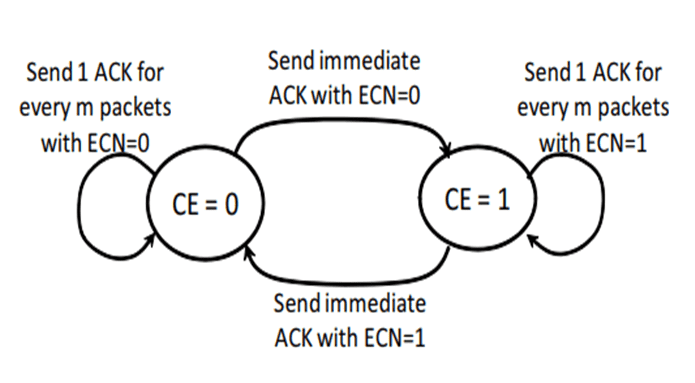

$\quad$ 发送端

$\quad$ $\quad$ 每个RTT更新一次发送窗口

$\quad$ $\quad$ α←(1-g)α+αF，这个值反应了拥塞程度

$\quad$ $\quad$ 其中F=(# of marked ACKs)/(Total # of ACKs)

$\quad$ $\quad$ Cwnd←(1-α/2)∗Cwnd

###### 和TCP比较

$\quad$ 交换机中的队列长度：

$\quad$ $\quad$ DCTCP能将队列长度稳定地维持在一个很低的水平

$\quad$ $\quad$ 而TCP的队列长度不仅高，而且波动很大

$\quad$ 因此，DCTCP更适用于现代数据中心

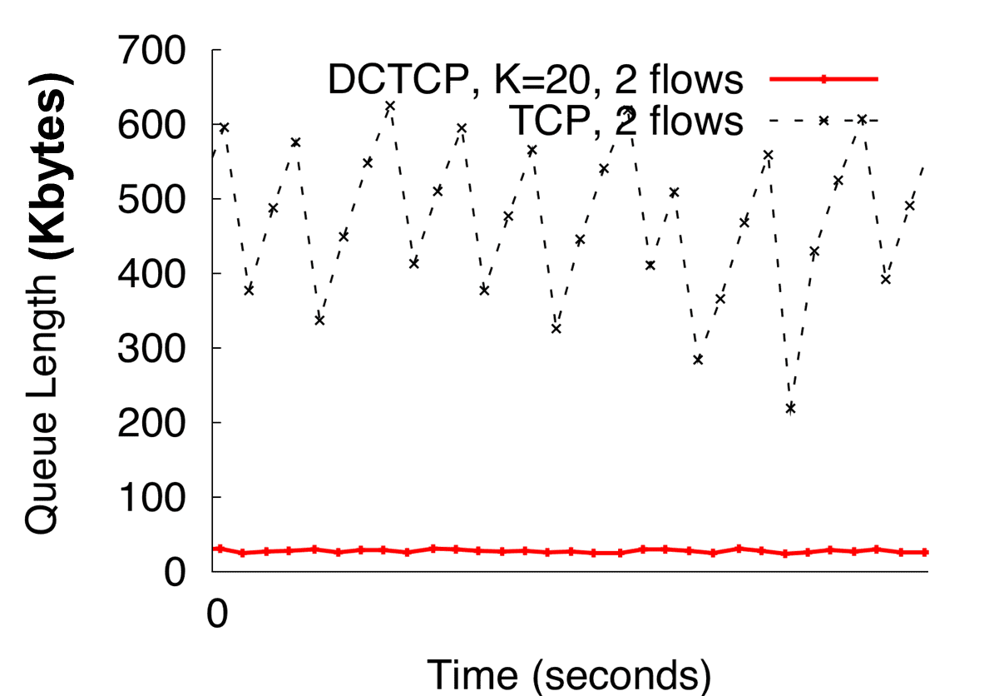

###### 为什么DCTCP能取得良好性能

$\quad$ 容忍高突发流量

$\quad$ $\quad$ DCTCP维持了较低的队列长度，可以留出较大的缓冲区给突发流量

$\quad$ $\quad$ 采用标记策略，使得发送端在丢包之前就感知到拥塞

$\quad$ 低时延

$\quad$ $\quad$ 由于队列长度较短，也减少了包在队列中的排队时延

$\quad$ 高吞吐

$\quad$ $\quad$ DCTCP根据拥塞程度精确调节窗口，使得发送窗口的变化比较平滑，不会出现吞吐量骤降的情形

---