# 计算机网络
## 应用层-DNS,电子邮件
### 域名系统DNS

$\quad$ 域名系统（DNS，Domain Name System）是互联网重要的基础设施

$\quad$ $\quad$ 向所有需要域名解析的应用提供服务，主要负责将域名映射成IP地址

$\quad$ $\quad$ 可以基于域名查询IP地址

$\quad$ $\quad$ 也可以基于IP地址，反向查询域名

$\quad$ DNS提供的是与网络层有关的功能，但以应用层技术的方式实现

$\quad$ 域名与IP地址可以是一对一、一对多或者多对一的关系

#### 历史

$\quad$ ARPANET时期

$\quad$ $\quad$ Hosts.txt文件列出了所有计算机名称和它们的IP地址

$\quad$ $\quad$ 所有主机在晚上从指定站点上获取Hosts.txt文件

$\quad$ Hosts.txt文件的使用在当时表现不错

$\quad$ 互联网发展

$\quad$ $\quad$ Hosts.txt文件变得越来越大

$\quad$ $\quad$ 需要集中管理来防止主机名冲突

$\quad$ 1987年发布了域名系统的RFC文档（RFC1034、RFC1035）

$\quad$ $\quad$ 采用了一种层次的、基于域的命名模式，并使用分布式数据库系统实现

$\quad$ $\quad$ 主要用途是将主机名映射成IP地址

$\quad$ 中心化的DNS不可行

#### Internet的域名系统

$\quad$ Internet使用分布式的域名系统 DNS

$\quad$ $\quad$ 一个联机分布式数据库系统

$\quad$ 域名的解析是由若干个域名服务器(Domain Name Server)

$\quad$ $\quad$ 也叫名字服务器(Name Server)

$\quad$ 分布式的好处

$\quad$ $\quad$ 避免单点故障

$\quad$ $\quad$ 能够处理海量流量

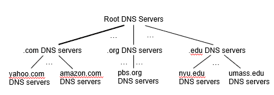

#### 域名系统服务

##### 域名结构

$\quad$ Internet的域名结构也采用了层次树状结构的命名方法

$\quad$ $\quad$ 该树状结构又称域树(domain tree)

$\quad$ 域名的结构由若干个分量组成，各分量之间用小数点(.)隔开，总长不超过255个字符

$\quad$ 各分量分别代表不同级别的域名。(≤63字符)

$\quad$ 合法域名中，点“.”的个数至少为一个

$\quad$ 通常，点“.”对应的英文单词为dot，也可以读为point

$\quad$ 形式：… .三级域名.二级域名.顶级域名

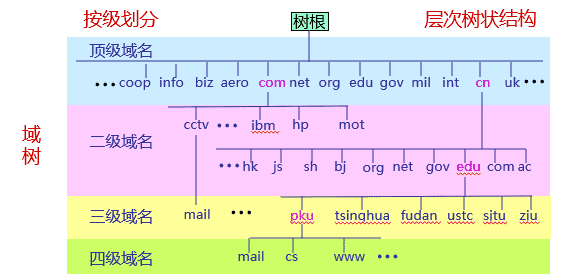

##### 典型域名

###### 顶级域名：

顶级域名TLD（Top Level Domain）一般有三类

$\quad$ 国家或地区顶级域nTLD，也记为ccTLD (cc: country code)

$\quad$ $\quad$ 例如.cn 表示中国，.us 表示美国，.uk 表示英国。目前有300多个

$\quad$ 基础设施域.arpa (Address and Routing Parameter Area)

$\quad$ $\quad$ 专用于Internet基础设施目的

$\quad$ $\quad$ 目前有二级域ip6.arpa；iris.arpa；in-addr.arpa；uri.arpa；urn.arpa；home.arpa；as112.arpa；in-addr-servers.arpa；ipv4only.arpa等

$\quad$ 通用顶级域gTLD

$\quad$ $\quad$ 早期规定了20个通用顶级域名，2011年批准新通用顶级域名(New Generic Top-level Domain，New gTLD)

$\quad$ $\quad$ 截至2020年，已注册有1200多个通用顶级域名

###### 二级域名

国家顶级域名 .cn下的二级域名分为三类

$\quad$ 类别域名7个

$\quad$ $\quad$ edu.cn 教育

$\quad$ $\quad$ gov.cn 政府

$\quad$ $\quad$ org.cn 非营利组织

$\quad$ $\quad$ net.cn 网络服务

$\quad$ $\quad$ com.cn 工商金融等企业

$\quad$ $\quad$ ac.cn 科研

$\quad$ $\quad$ mil.cn 国防机构

$\quad$ 行政区域名34个：省、直辖市、自治区、特区等行政区域名，每个行政区域名为两个字母，例如北京bj、河北he等

$\quad$ 无类别域名：例如 www.baidu.cn、www.tianya.cn等

##### 域名的管理：

$\quad$ 域名管理机构分级负责域名注册

$\quad$ $\quad$ Internet的域名管理机构: ICANN [www.icann.org](http://www.icann.org/)

$\quad$ $\quad$ 全称: Internet Corporation for Assigned Names and Numbers

$\quad$ $\quad$ ccTLD下的二级域名该国自行确定

$\quad$ 三级域名注册由其所属二级域名机构负责，以此类推

$\quad$ edu.cn下三级域名注册由CERNET负责

$\quad$ 我国的其它二级域名注册由中国互联网络信息中心(CNNIC)负责

#### 域名服务器

$\quad$ 名字服务器(name server)或域名服务器

$\quad$ $\quad$ 保存关于域树(domain tree)的结构和设置信息

$\quad$ $\quad$ 负责域名解析工作

$\quad$ 每个名字服务器保存相邻域名服务器信息

$\quad$ $\quad$ 当自身信息缺失时，知道向哪些服务器询问

$\quad$ 域名解析过程对用户透明

##### 类别

$\quad$ 根据对应域的层次，名字服务器又进一步分为以下类别

$\quad$ $\quad$ 根名字服务器(root name server) /根服务器(root server)

$\quad$ $\quad$ 顶级域名字服务器(TLD name server)

$\quad$ $\quad$ 二级域名字服务器(second level domain name server)

$\quad$ $\quad$ 三级域名字服务器(third level domain name server)

$\quad$ $\quad$ ......

$\quad$ 三级域及以下的名字服务器通常在用户本地区域，因此

$\quad$ $\quad$ 三级域及以下的名字服务器也统称为本地域名服务器（Local DNS Server）或 迭代域名服务器

$\quad$ $\quad$ 二级域的名字服务器也称为权威名字服务器

##### 层次结构

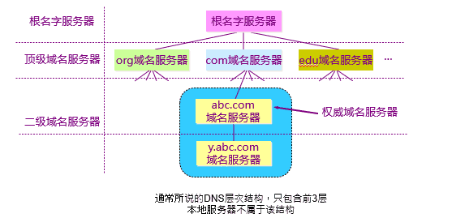

###### 根服务器（Root DNS Server）：
$\quad$ 根服务器是最高层次的名字服务器

$\quad$ 每个根服务器都知道所有的顶级域名服务器(TLD name servers)的域名及其IP地址

$\quad$ 根服务器并不直接把主机用户所查的域名转换成IP地址

$\quad$ IPv4根服务器共有13套(不是13台机器)，这些根服务器相应的域名分别是

$\quad$ $\quad$ a.rootservers.net 到 m.rootservers.net

$\quad$ 更改根服务器数据只在a.rootservers.net上进行，然后同步到另外12套中

$\quad$ $\quad$ 既能保证数据一致性，也提高了域名服务可靠性

$\quad$ 每套都可以有多个镜像(mirrored)根服务器，其内容定期与上述对应的根服务器同步

$\quad$ $\quad$ 注意，同步需要一定的时间才能完成

$\quad$ $\quad$ 已设置了1000多台镜像根服务器

$\quad$ $\quad$ 世界上大部分DNS域名服务器都能就近找到一个根服务器

$\quad$ 2016年，全球新部署25套IPv6根服务器

$\quad$ $\quad$ 中国4套

###### 顶级域名字服务器（TLD name server)

$\quad$ 顶级域(TLD)名字服务器负责管理在该顶级域名服务器注册的所有二级域名

$\quad$ 当收到DNS查询请求时就给出相应的回答

$\quad$ $\quad$ 可能是最后的结果，也可能是下一步应当找的二级域名字服务器的 IP 地址

###### 二级域名字服务器

$\quad$ 每一个主机都必须在某个二级域名字服务器处注册登记。因此二级域名字服务器知道其管辖的主机名应当转换成什么IP地址

$\quad$ $\quad$ 各个二级域名单位根据自己的具体情况把所属域名划为若干个管辖区(zone)，也可简称为区

$\quad$ 每个区设置相应的权威名字服务器，用来保存该区中的所有主机的域名到IP地址的映射

$\quad$ 一般来说，每个名字服务器只负责解析本辖域（区）的域名

$\quad$ $\quad$ 名字服务器的管辖范围以“区”为单位，而不是以“域”为单位

$\quad$ $\quad$ 区可以小于或等于域，但不可能大于域

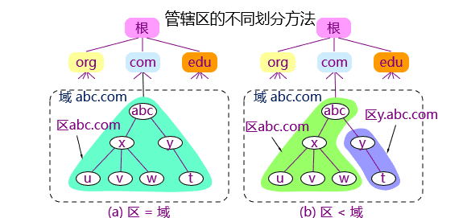

###### 本地DNS服务器

$\quad$ 每一个Internet服务提供者ISP(Internet Service Provider), 都至少有一个本地DNS服务器（又称递归服务器），距离用户主机较近

$\quad$ 不同网络中的递归服务器、本地域名服务器的部署层次可能不同

$\quad$ 最简单的部署层次是只有一层本地域名字服务器，即三级域名字服务器

$\quad$ 实际部署中，解析请求路径上的递归服务器/本地域名服务器可能有多层

#### 域名解析与DNS协议
##### 域名解析

$\quad$ 当某一应用进程需要进行域名解析时，该应用进程将域名放在DNS请求报文（UDP数据报, 目标端口号为53）发给本地DNS服务器

$\quad$ $\quad$ 使用UDP是为了减少开销

$\quad$ 本地DNS服务器得到查询结果后, 将对应IP地址放在应答报文中返回给应用进程

$\quad$ 域名查询有递归查询(recursive query)和迭代查询(或循环查询，iterative query) 两种方式

$\quad$ $\quad$ 主机向本地DNS服务器的查询一般采用递归查询

$\quad$ $\quad$ 本地DNS服务器向更上层域名服务器可以采用递归查询，但一般优先采用迭代查询

$\quad$ $\quad$ 实际中，请求方与服务器有一定自主权选择哪种方式

$\quad$ 本地DNS解析先尝试递归查询（查询对象：本地DNS服务器）

$\quad$ $\quad$ 当用户主机发出DNS查询报文时，这个查询报文首先被送往该主机所在区域的递归服务器

$\quad$ $\quad$ 如果所要查询的主机也处在本地ISP的管辖范围，则本地域名服务器就能进行域名解析，否则就需要再询问其他的域名服务器

$\quad$ $\quad$ 在递归服务器/本地域名服务器有多层的结构中，当本层服务器没有解析结果时，通常是逐级向上递归进行查询

$\quad$ 随后尝试迭代查询（查询对象：根服务器、顶级域名字服务器、二级域名字服务器）

$\quad$ $\quad$ 当查询请求到达本地域最上一层名字服务器时，该层服务器对自己无法解析的任何一个域名

$\quad$ $\quad$ 此时，先求助于根服务器（而不是二级域名字服务器），开始逐步迭代查询

$\quad$ 在谷歌公司提供的公共DNS服务系统中，把根信息也同步到它的递归服务器上，这时就不再需要传统的查询根服务器的过程，从而提高查询效率

###### 递归查询

$\quad$ 当收到查询请求报文的域名服务器不知被查询域名的IP地址时，该域名服务器就以DNS客户的身份向下一步应查询的域名服务器发出查询请求，即替递归服务器继续查询

$\quad$ 一般在本地服务器内部采用

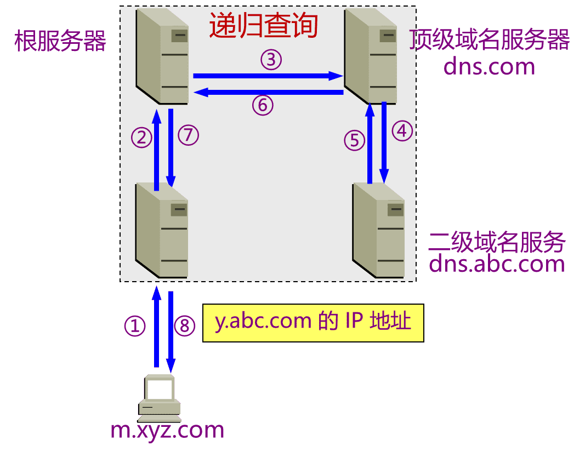

###### 迭代查询

$\quad$ 当收到查询请求报文的域名服务器不知道被查询域名的IP地址时，就把自己知道的下一步应查询的域名服务器IP地址告诉查询者，由查询者继续向该域名服务器查询

$\quad$ 通常本地DNS之上使用

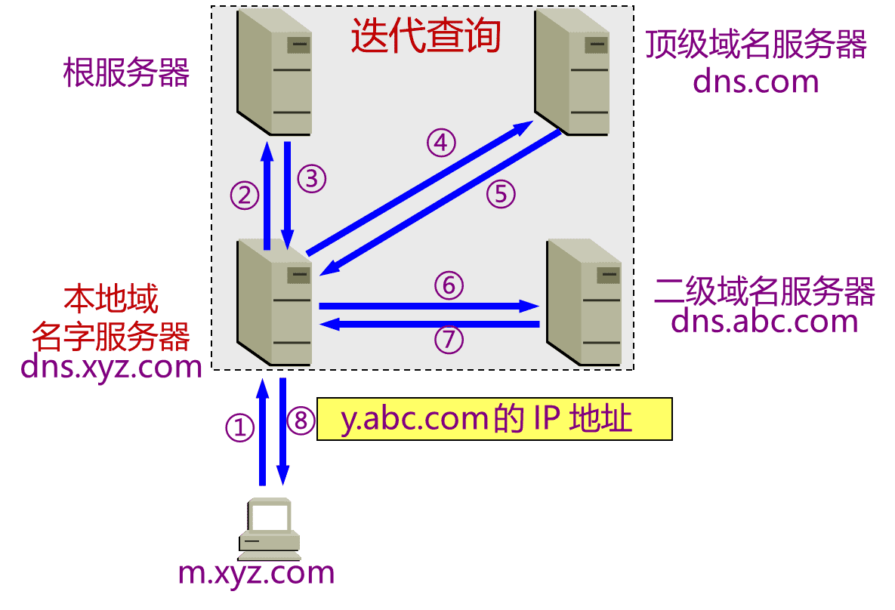
##### DNS报文
$\quad$ 分为三部分：基础结构(报文首部)、问题、资源记录(RR, Resource Record)

$\quad$ 报文类型分为查询请求(query)和查询响应(reply)两类，请求和响应的报文结构基本相同

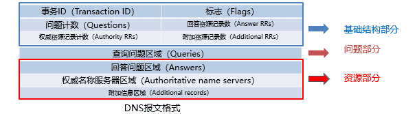

###### 基础结构部分

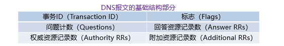

$\quad$ 事务ID：DNS报文的ID标识。对于请求报文和其对应的响应报文，该字段的值是相同的。通过它可以区分 DNS 应答报文是对哪个请求进行响应的

$\quad$ 标志：DNS报文中的标志字段

$\quad$ $\quad$ QR（Query/Response）：查询请求/响应的标志信息。查询请求时值为0；响应时值为1

$\quad$ $\quad$ Opcode：操作码。其中，0表示标准查询；1表示反向查询；2表示服务器状态请求

$\quad$ $\quad$ AA（Authoritative）：授权应答，该字段在响应报文中有效。值为1时表示名称服务器是权威服务器；值为0时表示不是权威服务器

$\quad$ $\quad$ TC（Truncated）：表示是否被截断。值为1时，表示响应已超过512字节并已被截断，只返回前512个字节

$\quad$ $\quad$ RD（Recursion Desired）：期望递归。该字段能在一个查询中设置，并在响应中返回。该标志告诉域名服务器必须处理这个查询，这种方式被称为一个递归查询。如果该位为0，且被请求的域名服务器没有一个授权回答，它将返回一个能解答该查询的其他域名服务器列表。这种方式被称为迭代查询

$\quad$ $\quad$ RA（Recursion Available）：可用递归。该字段只出现在响应报文中。当值为1时，表示服务器支持递归查询

$\quad$ $\quad$ Z：保留字段，在所有的请求和响应报文中，它的值必须为0

$\quad$ $\quad$ Rcode（Reply code）：返回码字段，表示响应的差错状态。常用Rcode有

$\quad$ $\quad$ $\quad$ 当值为0(NoError)时，表示没有错误

$\quad$ $\quad$ $\quad$ 当值为1(FormErr)时，表示报文格式错误，服务器不能理解请求的报文

$\quad$ $\quad$ $\quad$ 当值为2(ServFail)时，表示域名服务器失败，因为服务器的原因导致没办法处理这个请求

$\quad$ $\quad$ $\quad$ 当值为3(NXDomain)时，表示域名不存在，只有对授权域名解析服务器有意义，指出解析的域名不存在

$\quad$ $\quad$ $\quad$ 当值为4(NotImp)时，表示查询类型不支持，即域名服务器不支持查询类型

$\quad$ $\quad$ $\quad$ 当值为5(Refused)时，表示拒绝应答，一般是服务器由于设置的策略拒绝给出应答，如服务器不希望对某些请求者给出应答

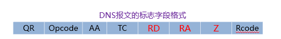
$\quad$ 问题计数：DNS查询请求的数目

$\quad$ 回答资源记录数：DNS响应的数目

$\quad$ 权威资源记录数：权威资源记录的数目

$\quad$ 附加资源记录数：额外的记录数目（如：权威名字服务器对应IP地址的数目）

###### 问题部分

$\quad$ 用来显示DNS查询请求的问题，通常只有一个问题

$\quad$ 包含正在进行的查询信息，包含查询名（被查询主机名字）、查询类型、查询类

$\quad$ $\quad$ 查询名(name)：一般为要查询的域名，有时是IP地址，用于反向查询

$\quad$ $\quad$ 查询类型(type)：DNS查询请求的资源类型。通常查询类型为A类型，表示由域名获取对应的IP地址

$\quad$ $\quad$ 查询类(class)：地址类型，通常为互联网地址，值为1(IN)

$\quad$ $\quad$ 其他值包括CS、CH等，表示各种早期非Internet互联网的地址

###### 资源部分

$\quad$ 资源记录部分只有在DNS响应报文中才出现

$\quad$ 由3个字段构成，包括

$\quad$ $\quad$ 回答问题区域字段

$\quad$ $\quad$ 权威名字服务器区域字段

$\quad$ $\quad$ 附加信息区域字段

$\quad$ 这3个字段都采用资源记录的格式

$\quad$ $\quad$ 域名：DNS请求的域名

$\quad$ $\quad$ 类型：资源记录的类型，与问题部分中的查询类型值相同

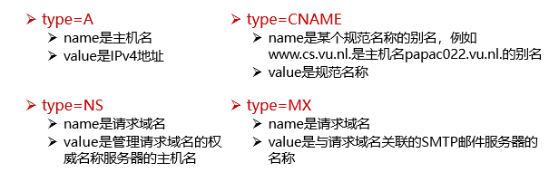

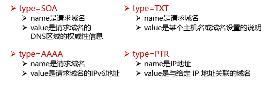

$\quad$ $\quad$ 类：地址类型，与问题部分中的查询类值相同

$\quad$ $\quad$ 生存时间：以秒为单位，表示资源记录的生命周期

$\quad$ $\quad$ $\quad$ 取出资源记录后决定保存及使用缓存数据的时间

$\quad$ $\quad$ $\quad$ 也表明该资源记录的稳定程度，稳定的信息会被分配一个很大的值

$\quad$ $\quad$ 资源数据长度：资源数据的长度

$\quad$ $\quad$ 资源数据：表示按查询段要求返回的相关资源记录的数据

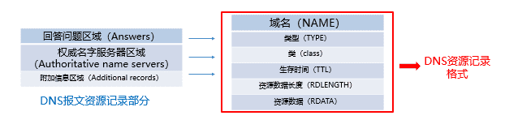

##### 域名系统高速缓存

$\quad$ 为提高DNS查询效率，并减轻根域名服务器的负荷和减少Internet上的DNS查询报文数量，

$\quad$ $\quad$ 域名服务器广泛使用高速缓存，用来存放最近查询过的域名以及从何处获得域名映射信息的记录

###### 域名缓存的好处

$\quad$ 缓存数据1：缓存“域名->IP”映射

$\quad$ $\quad$ 例如不久前已有用户查询过域名为y.abc.com的IP地址，则本地域名服务器/递归解析器就不必再向根域名服务器重新查询y.abc.com的IP地址了，而是直接把高速缓存中存放的上次查询结果（即y.abc.com的IP地址）告诉用户

$\quad$ $\quad$ 减少Internet上查询数量

$\quad$ 缓存数据2：缓存顶级域名字服务器信息

$\quad$ $\quad$ 假定本地域名服务器的缓存中并没有 y.abc.com 的IP地址，但存放着顶级域名服务器 dns.com 的IP地址，则本地域名服务器就不必向根域名服务器进行查询，而可以直接向 .com 顶级域名服务器发送查询请求报文

$\quad$ $\quad$ 减少对根服务器的缓存

$\quad$ 主机一般也缓存域名有关信息

###### 缓存项目的时限

$\quad$ 域名到IP地址的绑定可能发生变化（但并不会经常改变）。为保持高速缓存中的内容正确，域名服务器应为每项内容设置计时器并处理超时项目（例
如，典型的数值是每个项目只存放48小时)

$\quad$ 当域名服务器已从缓存中删去某项信息后又被请求查询该项信息，就必须重新查询

$\quad$ 当权限域名服务器回答一个查询请求时，在响应中都指明绑定有效存在的时间值。增加此时间值可减少网络开销，而减少此时间值可提高域名解析的准确性
##### DNSSEC安全机制

$\quad$ DNS协议设计之初没有过多考虑安全问题，导致DNS存在以下缺陷

$\quad$ $\quad$ 几乎所有DNS流量都是基于UDP明文传输的

$\quad$ $\quad$ DNS的资源记录未加上任何的认证和加密措施

$\quad$=>DNS的用户隐私容易被泄露

$\quad$ DNSSEC依靠数字签名保证DNS应答报文的真实性和完整性

$\quad$ $\quad$ 包括通过身份验证拒绝DNS数据存在的机制

$\quad$ 在DNSSEC的使用中

$\quad$ $\quad$ 域名服务器用自己的私有密钥对资源记录(Resource Record, RR)进行签名

$\quad$ $\quad$ 解析服务器用域名服务器的公开密钥对收到的应答信息进行验证

$\quad$ $\quad$ 如果验证失败，表明这一报文可能是假冒的，或者在传输过程、缓存过程中被篡改了

###### 工作流程

$\quad$ 一个支持DNSSEC的解析器向支持DNSSEC并管理test.net域名的权威域名服务器请求域名www.test.net

$\quad$ 解析器收到

$\quad$ $\quad$ 一个标准的A记录 (IP地址)

$\quad$ $\quad$ 一个同名的RRSIG记录，其中包含test.net这个授权域的数字签名

$\quad$ $\quad$ $\quad$ 用test.net.的私有密钥来签名的

$\quad$ 解析服务器验证过程

$\quad$ $\quad$ 再次向test.net.的域名服务器查询响应的公开密钥，即DNSKEY资源记录

$\quad$ $\quad$ 用其中的公钥验证上述记录(关于www.test.net.的RRSIG记录)的真实性与完整性

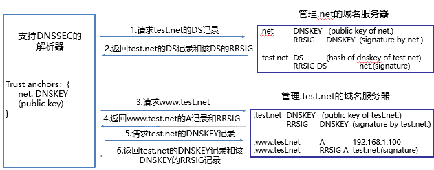

### 电子邮件服务

$\quad$ 电子邮件（E-mail）是自早期Internet出现以来最广泛的应用，是一种异步通讯媒介

$\quad$ 优越性

$\quad$ $\quad$ 比纸质信件更快更便宜

$\quad$ $\quad$ 使用门槛低

$\quad$ $\quad$ 收件人可随时上网到自己邮箱读取邮件

$\quad$ $\quad$ 电子邮件不仅可传送文字信息，而且还可附上声音和图像等

#### 电子邮件体系结构

$\quad$ 采用客户/服务器工作模式

$\quad$ $\quad$ 用户代理（user agent）——邮件客户端：编辑和发送邮件，接收、读取和管理邮件，管理地址簿；无统一标准

$\quad$ $\quad$ 传送代理（message transfer agent）——邮件服务器：邮箱：保存用户收到的邮件，邮件输出队列：存储等待发送的邮件；运行电子邮件协议

$\quad$ $\quad$ $\quad$ 邮箱是邮件服务器中的一块内存区域，其标识即为电子邮件地址（邮箱名）

$\quad$ $\quad$ $\quad$ 电子邮件地址是一个字符串，用于指定邮件接收者

$\quad$ $\quad$ 简单邮件传输协议SMTP（Simple Mail Transfer  Protocol）——邮件服务器之间传递邮件使用的协议：smtp客户: 发送邮件端；smtp服务器: 接收邮件端

$\quad$ $\quad$ $\quad$ SMTP利用TCP可靠地从客户向服务器传递邮件，使用端口25

$\quad$ $\quad$ $\quad$ 直接投递: 发送端直接到接收端

$\quad$ $\quad$ $\quad$ SMTP的3个阶段：连接建立、邮件传送、连接关闭

$\quad$ $\quad$ $\quad$ SMTP是一个简单的ASCII协议，邮件必须为7位ASCII

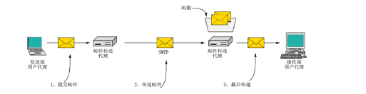

$\quad$ $\quad$ 命令/响应

$\quad$ $\quad$ $\quad$ 命令: ASCII字符串

$\quad$ $\quad$ $\quad$ 响应: 状态码+短语

#### 相关协议

##### SMTP

$\quad$ 客户端发送的行用”C:”标识，服务发送的行用”S:”标识

$\quad$ 来自客户的第一条命令HELO

$\quad$ RCPT命令可以将一个邮件发送给多个收件人，此处只有一个收件人，只使用一个RCPT命令

###### 场景

$\quad$ Alice使用用户代理撰写发送给 Bob的邮件

$\quad$ Alice的用户代理发送邮件到她的邮件服务器；邮件存放在邮件队列

$\quad$ SMTP客户端建立与SMTP邮件服务器的TCP连接

$\quad$ SMTP客户端通过TCP连接发送Alice的邮件

$\quad$ Bob的邮件服务器把邮件存放在Bob的邮箱

$\quad$ Bob调用他的用户代理来读取邮件

###### 不足

$\quad$ 不包括认证

$\quad$ 传输ASCII而不是二进制数据

$\quad$ 邮件以明文形式出现

##### 邮件格式

$\quad$ SMTP定义了如何传输邮件，但邮件本身也需遵循特定格式

$\quad$ $\quad$ SMTP类似HTTP，定义如何传输邮件

$\quad$ $\quad$ 邮件格式类似HTML，定义如何描述邮件

$\quad$ 首部（header）必须含有一个From:首部行和一个To:首部行，还可以包含 Subject: 等其他可选的首部行

$\quad$ 消息体（body）指邮件正文

$\quad$ MIME(Multipurpose Internet Mail Extensions)—多用途Internet邮件扩展

$\quad$ $\quad$ 基本格式的多媒体扩展

$\quad$ $\quad$ 可传输多媒体消息和二进制文件

##### 最后传递协议

$\quad$ 邮件已经到达Bob的邮箱，接下来的工作就是将邮件的一个副本传送到Bob的用户代理以便显示

$\quad$ 最终交付（邮件访问）协议: 从邮件服务器的邮箱中获取邮件

$\quad$ $\quad$ POP3：Post Office Protocol-Version 3，第三版邮局协议

$\quad$ $\quad$ IMAP：Internet Message Access Protocol，Internet邮件访问协议

$\quad$ $\quad$ Webmail（HTTP）：基于Web的电子邮件

$\quad$ $\quad$ 为什么不能使用SMTP获取邮件？

$\quad$ $\quad$ $\quad$ 接收方的用户代理不能使用 SMTP 从传输代理获取邮件，因为取邮件是一个拉操作

$\quad$ $\quad$ $\quad$ 而 SMTP 是一个推协议，需要推送目标在线

$\quad$ $\quad$ $\quad$ 通过引入最终交付（邮件访问）协议来解决这个问题。

###### POP3协议

$\quad$ POP3由RFC1939定义，是一个非常简单的最终交付协议

$\quad$ 当用户代理打开一个到端口110上的TCP连接后，客户/服务器开始工作

$\quad$ POP3的三个阶段：

$\quad$ $\quad$ 认证(Authorization)：处理用户登录的过程

$\quad$ $\quad$ 事务处理(Trnsactions)：用户收取电子邮件，并将邮件标记为删除

$\quad$ $\quad$ 更新(Update)：将标为删除的电子邮件删除

$\quad$ POP3使用客户/服务器工作方式，在接收邮件的用户PC机中必须运行POP客户程序，而在用户所连接的ISP的邮件服务器中则运行POP服务器程序

###### IMAP

$\quad$ IMAP—Internet邮件访问协议[RFC 2060]

$\quad$ 用于最终交付的主要协议

$\quad$ IMAP是较早使用的最终交付协议—POP3(邮局协议，版本3)的改进版

$\quad$ 邮件服务器运行侦听端口143的IMAP服务器

$\quad$ 用户代理运行一个IMAP客户端

$\quad$ 客户端连接到服务器并开始发出命令

$\quad$ MAP允许用户在不同的地方使用不同的计算机随时上网阅读和处理自己的邮件

$\quad$ IMAP服务器把每个邮件与一个文件夹联系起来，

$\quad$ $\quad$ 当邮件第一次到达服务器时，它与收件人的INBOX文件夹相关联

$\quad$ $\quad$ 收件人能够把邮件移到一个新的、用户创建的文件夹中，阅读邮件，删除邮件等

$\quad$ IMAP还为用户提供了在远程文件夹中查询邮件的命令，按指定条件去查询匹配的邮件

$\quad$ 与POP3不同，IMAP服务器维护了用户状态信息

$\quad$ $\quad$ 例如，文件夹的名字以及哪些邮件与哪些文件夹相关联

$\quad$ IMAP具有允许用户代理获取邮件某些部分的命令

$\quad$ $\quad$ 例如，一个用户代理可以只读取一个邮件的首部，或只是一个多部分MIME邮件的一部分

$\quad$ 用户代理和其邮件服务器之间使用低带宽连接（如一个低速调制解调器链路）的时候，用户可能并不想取回邮箱中的所有邮件，其要避免可能包含如音频或视频片断的大邮件

$\quad$ IMAP的缺点是如果用户没有将邮件复制到自己的PC上，则邮件一直是存放在IMAP服务器上。因此用户需要经常与IMAP服务器建立连接
###### Webmail

$\quad$ Webmail——基于Web的电子邮件

$\quad$ $\quad$ 提供电子邮件服务的IMAP和SMTP替代方案

$\quad$ $\quad$ 使用Web作为界面，用户代理就是普通的浏览器

$\quad$ $\quad$ 用户及其远程邮箱之间的通信通过HTTP进行

---