# 计算机网络

## 应用层-Web与HTTP

$\quad$ 不同主机上的程序之间通过网络应用层完成交互

$\quad$ 典型的应用层服务：语音通话，在线会议，社交网络，搜索引擎，信息推送Web访问，文件传输，电子邮件，即时通讯，远程登陆，P2P文件共享，在线游戏，流媒体。。。。。。。

##### 应用层与下层网络（传输层）接口

$\quad$ 应用程序在端系统上以进程的形式呈现

$\quad$ 进程利用socket（套接字）发送/接收消息（通过传输层）

$\quad$ socket类似一扇门：从门中向外发送消息，从其他进程收到的消息堆积在门口等待接收

$\quad$ 希望传输层提供的服务：可靠传输，高吞吐，低时延，安全

###### 实际传输层提供的服务

$\quad$ TCP服务

$\quad$ $\quad$ 面向连接：传输前建立连接

$\quad$ $\quad$ 可靠传输：丢包重传

$\quad$ $\quad$ 有序传输

$\quad$ $\quad$ 流量控制：防止接收端过载

$\quad$ $\quad$  拥塞控制：防止网络核心过载

$\quad$ $\quad$ 无法保证：延迟，吞吐，安全

$\quad$ UDP服务

$\quad$ $\quad$ 无连接

$\quad$ $\quad$  不可靠传输：可能丢包，丢包也无法回复

$\quad$ $\quad$  无法保证：可靠性，顺序，流量控制，拥塞控制，延迟，吞吐量，安全

$\quad$ $\quad$  问：为什么还有UDP：简单，性能好

#### 网络应用层的好处：

$\quad$ 屏蔽底层细节

$\quad$ $\quad$ 设计应用层程序时，需要考虑到TCP与UDP的性质

$\quad$ $\quad$ 应用程序无需为下层网络设备编写代码

$\quad$ 抽象：许多网络应用有相同的通信模式，网络应用层封装这些共同模式

$\quad$ 提供额外的功能：如安全性

 总之网络应用层极大简化了网络应用开发，使得互联网可以快速发展

#### 应用层的通信实体

$\quad$ 应用层的实体就是应用程序

$\quad$ 我们可以给网络中的每台主机命名

$\quad$ $\quad$ 网卡MAC地址

$\quad$ $\quad$ IP地址

$\quad$ $\quad$ 主机名

$\quad$ 每个主机的命名仍然不够

$\quad$ 对于接收到的消息，需要区分是发给哪个应用程序

$\quad$ $\quad$ 单个主机上可能运行多个应用程序

$\quad$ $\quad$ 单个应用程序也可能创建多个连接（socket）

$\quad$ 解决方案：为每个应用以IP地址+端口号命名

$\quad$ $\quad$ HTTP服务器：80

$\quad$ $\quad$ 邮件服务器：25

#### 应用层的组织架构

$\quad$ 应用程序以两种方法组织:

##### 客户/服务器方式（C/S）

$\quad$ 应用层的许多协议是基于C/S方式

$\quad$ 客户端与服务器是指通信中所涉及的两个应用进程

$\quad$ 客户、服务器方式描述的是应用进程之间服务与被服务之间的关系

$\quad$ 客户是服务请求方，服务器是服务提供方

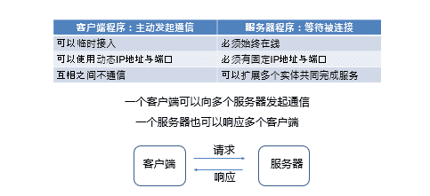

$\quad$ 分层视角：

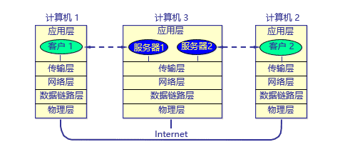

###### 分类

$\quad$ 根据是否建立连接：

$\quad$ $\quad$ 可以是面向连接的，也可以是无连接的

$\quad$ $\quad$ 面向连接时，C/S通信关系一旦建立，通信就是双向的，都可发送和接收数据

$\quad$ 根据服务器进程的实现方式

$\quad$ $\quad$ 服务器采用**循环方式(iterative mode)**

$\quad$ $\quad$ $\quad$ 一次只运行一个服务进程

$\quad$ $\quad$ $\quad$ 一个服务进程在同一时间只能向一个客户端提供服务

$\quad$ $\quad$ $\quad$ 服务进程收到客户进程的请求后，对其他客户进程发来的请求则暂时不予理睬，这些请求都在服务端的队列中排队等候服务进程的处理当服务进程处理完毕一个请求时，就从队列中读取来自下一个客户进程的请求，然后继续处理

$\quad$ $\quad$ $\quad$ 当有多个客户进程请求服务时，服务进程就按请求的先后顺序依次做出响应 (阻塞方式)

$\quad$ $\quad$ $\quad$ 面向连接的TCP与无连接的UDP都可以用

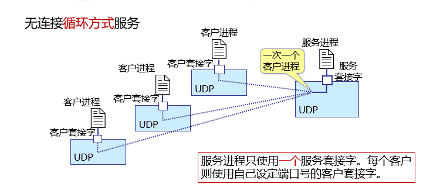

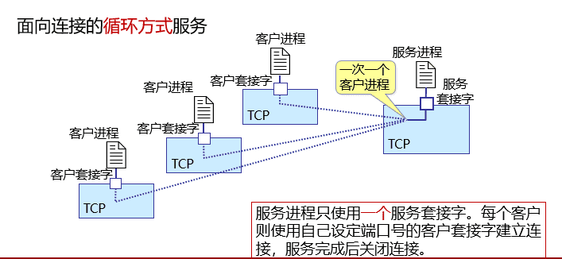

$\quad$ $\quad$ 服务器采用**并发方式(concurrent mode)**

$\quad$ $\quad$ $\quad$ 可以同时运行多个服务进程

$\quad$ $\quad$ $\quad$ 每一个服务进程都对某个特定的客户进程做出响应 (非阻塞方式)

$\quad$ $\quad$ $\quad$ 通常只有面向连接的TCP使用

$\quad$ $\quad$ $\quad$ 面向连接的TCP服务进程通常都工作在并发服务方式（尽管也可以使用循环方式）

$\quad$ $\quad$ $\quad$ 服务进程在同一时间可同时向多个客户进程提供服务(并发服务)

$\quad$ $\quad$ $\quad$ 在TCP服务进程与多个客户进程之间建立多条TCP连接，每条TCP连接在其数据传送完毕后释放

$\quad$ $\quad$ $\quad$ 具体流程

$\quad$ $\quad$ $\quad$ $\quad$ 服务器监听一个（熟知）服务端口，如HTTP的80端口

$\quad$ $\quad$ $\quad$ $\quad$ 主服务进程在熟知端口等待客户进程发出的请求

$\quad$ $\quad$ $\quad$ $\quad$ 一旦收到客户的请求，就创建一个从属服务进程，并指明从属服务进程使用临时套接字（又称连接套接字）与该客户建立TCP连接

$\quad$ $\quad$ $\quad$ $\quad$ 然后主服务进程继续在原来的熟知端口等待向其他客户提供服务

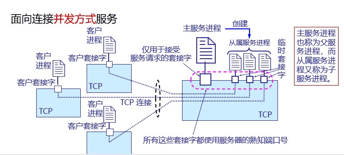

$\quad$ 为什么无连接的UDP只能采用循环方式，无法采用并发方式

$\quad$ 原因：无连接UDP只有一个套接字，无法被多个从属进程同时访问

$\quad$ 对比：

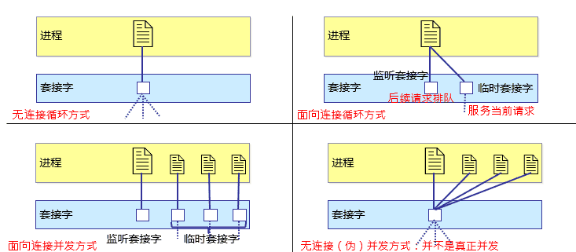

###### 特例：浏览器/服务模式：

$\quad$ 浏览器/服务器(B/S，Browser/Server) 方式可以看做C/S方式的特例，即客户软件改为浏览器了

$\quad$ B/S方式采取浏览器请求、服务器响应的工作模式

$\quad$ 在B/S方式下，用户界面完全通过Web浏览器实现，一部分事务逻辑在服务器前端实现，但主要的事务逻辑在服务器后端实现

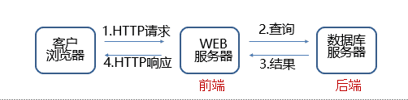

$\quad$ B/S方式通常采取3层架构实现

$\quad$ $\quad$ 数据层：由数据库服务器承担数据处理逻辑，其任务是接受Web服务器对数据库服务器提出的数据操作请求，然后由数据库服务器进行数据处理并把处理结果返回给web服务器

$\quad$ $\quad$ 处理层：由Web服务器承担业务处理逻辑和页面存储管理，接受客户浏览器的任务请求，执行相应的事务处理

$\quad$ $\quad$ 表现层：浏览器仅承担网页信息的浏览功能, 以超文本格式实现信息的输入和浏览

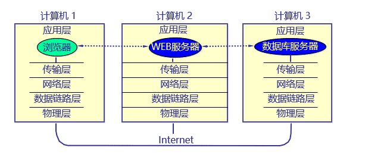

##### 对等方式（P2P）

$\quad$ 对等方式是指两个进程在通信时并不区分服务的请求方和服务的提供方

$\quad$ $\quad$ 只要两个主机都运行P2P软件，它们就可以进行平等、对等的通信

$\quad$ $\quad$ 双方都可以下载对方存储在硬盘中的共享文档，如果权限允许的话

$\quad$ 应用

$\quad$ $\quad$ 音频/视频应用推动了P2P对等通信方式的发展

$\quad$ $\quad$ 音频/视频流量已占主要比例

$\quad$ P2P方式从本质上看仍然是使用了C/S方式，但强调的是通信过程中的对等，这时每一个P2P进程既是客户同时也是服务器

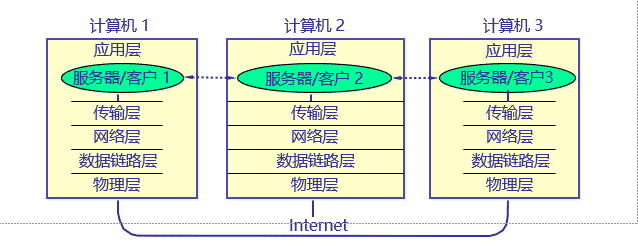

###### P2P实体的特征

$\quad$ 不需要总是在线

$\quad$ $\quad$ 虽然每个程序也扮演服务器角色，但与“客户端-服务器”中不同，不需要始终在线

$\quad$ 实体可以随时进入与退出

$\quad$ $\quad$ 可以动态改变IP地址

$\quad$ $\quad$ 需要额外的管理开销

$\quad$ 任意两个实体之间可以直接通信

$\quad$ 易于扩展

$\quad$ $\quad$ 每个结点都贡献自己的计算资源，也消耗一部分资源

#### 应用层协议

$\quad$ 应用层的实体就是应用协议

$\quad$ $\quad$ 通信内容：某个约定好的应用层协议

$\quad$ 每个应用层协议都是为了解决某一应用问题，通过位于不同主机中的多个应用程序之间的通信和协同工作来完成

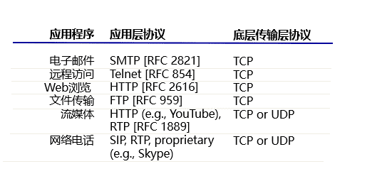

##### Web基本协议

$\quad$ WWW=World Wide Web

$\quad$ 构成：Web对象（网页，多媒体资源，动态对象与服务），通过URLs定位；HTTP服务器和客户端；服务器与客户端之间执行的HTTP协议

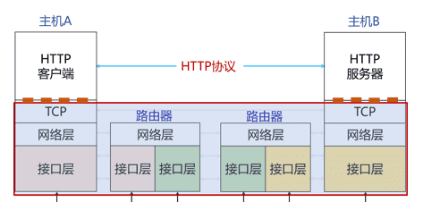

###### 服务器

$\quad$ Web页面（HTML文档）：包含到多种对象或链接

$\quad$ Web对象（包括静态对象和动态对象）：可以是HTML文档，图像文件，视频文件，声音文件，脚本文件等

$\quad$ 对象用URL（统一资源定位符）编址：协议类型://主机名：端口//路径和文件名

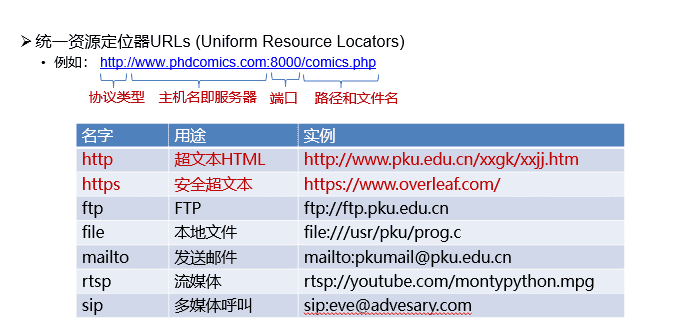

###### 客户端

$\quad$ 发出请求，接收响应，解释HTML文档并显示

$\quad$ 有些对象需要浏览器安装插件

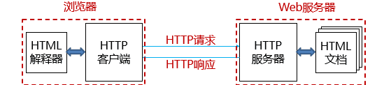

###### Web对象

$\quad$ 静态对象与静态网页

$\quad$ $\quad$ 文本，表格，图片，图像和视频等多媒体类型的信息（实现语言：标记语言，如：HTML，XML，PHP等）

$\quad$ $\quad$ 字体、颜色和布局等风格类型的信息（实现语言：层叠样式表CSS）

$\quad$ 动态对象与动态网页

$\quad$ $\quad$ 交互信息，比如，用户注册信息、登录信息等（实现：PHP/JSP等语言+MySQL等数据库）

$\quad$ 链接：

$\quad$ $\quad$ 超链接（HyperLinks）：指向其他对象的URLs

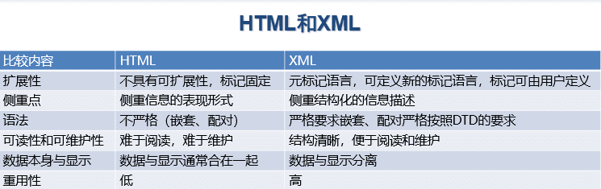

$\quad$ 动态Web

$\quad$ $\quad$ 通用网关接口CGI

$\quad$ $\quad$ $\quad$ CGI (Common Gateway Interface) 是一种标准

$\quad$ $\quad$ $\quad$ $\quad$ 在服务器创建动态文档

$\quad$ $\quad$ $\quad$ $\quad$ 定义了动态文档应如何创建

$\quad$ $\quad$ $\quad$ $\quad$ 输入数据应如何提供给应用程序

$\quad$ $\quad$ $\quad$ $\quad$ 输出结果应如何使用

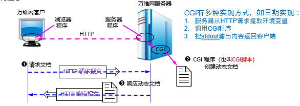

$\quad$ $\quad$ 脚本语言+数据库技术

$\quad$ $\quad$ $\quad$ 更好的服务器逻辑表示“脚本”指的是一个程序，它被另一个程序（即解释程序，如Web浏览器）解释执行，而不是由计算机的处理器来解释或执行

$\quad$ $\quad$ $\quad$ 数据库：更好的数据交换方式

$\quad$ $\quad$ 动态页面的创建，可以在浏览器or /and 服务器进行

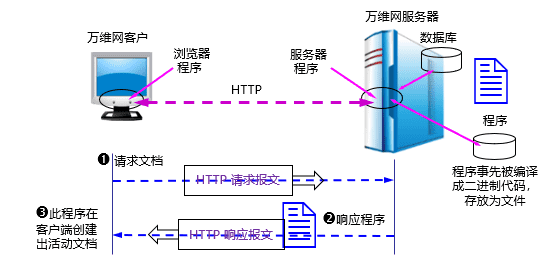

$\quad$ $\quad$ 动态Web的执行:Web内容展示（前端）和服务逻辑（后端）相分离；脚本程序可以在服务器或客户端创建Web文档

$\quad$ $\quad$ AJAX技术（Asynchronous JavaScript and XML）：超文本标记语言HTML+CSS：用于Web网页内容的显示

$\quad$ $\quad$ $\quad$ 文档对象模型DOM:是HTML和XML文档的编程接口，本质上是页面的API，采用树形结构组织。

$\quad$ $\quad$ $\quad$ 扩展标记语言XML：用于程序和服务器交换应用数据

$\quad$ $\quad$ $\quad$ 异步式工作方式：用于发送和检索XML数据

$\quad$ $\quad$ $\quad$ JavaScript：用于将以上功能进行组合并协同工作

$\quad$ $\quad$ AJAX不是新的编程语言，而是一种使用现有标准的新方法

$\quad$ $\quad$ LAMP=Linux+Apache+MySQL+PHP

$\quad$ $\quad$ LAMP不是新的工具，而是一套Web服务器软件集合

##### HTTP协议：

$\quad$ 超文本传输协议HTTP（HyperText Transfer Protocol）在传输层通常使用TCP协议，缺省使用TCP的80端口

$\quad$ HTTP为无状态协议，服务器端不保留之前请求的状态信息

$\quad$ $\quad$ 无状态协议：效率低，但简单

$\quad$ $\quad$ 有状态协议：维护状态相对复杂，需要维护历史信息，在客户端或服务器出现故障时，需要保持状态的一致性等。

###### HTTP发展现状

CN111.png)

###### HTTP1.0

CN112.png)
###### 非持久连接和持久连接

$\quad$ 非持久连接

$\quad$ $\quad$ HTTP/1.0缺省为非持久连接

$\quad$ $\quad$ $\quad$ 服务器接收请求、响应、关闭TCP连接

$\quad$ $\quad$ 获取每个对象需要三个阶段

$\quad$ $\quad$ $\quad$ 建立TCP连接

$\quad$ $\quad$ $\quad$ 对象请求和传输

$\quad$ $\quad$ $\quad$ 关闭TCP连接

$\quad$ $\quad$ 每次连接需要经历TCP慢启动阶段

$\quad$ 持久连接

$\quad$ $\quad$ HTTP/1.1缺省为持久连接

$\quad$ $\quad$ $\quad$ 在相同的TCP连接上，服务器接收请求、响应；再接收请求、响应；响应后保持连接

$\quad$ $\quad$ HTTP/1.1-pipeline 支持流水线机制

$\quad$ $\quad$ $\quad$ 需要按序响应

$\quad$ $\quad$ 经历较少的慢启动过程，减少往返时间

$\quad$ $\quad$ $\quad$ 降低响应时间

###### HTTP1.x
CN113.png)
###### HTTP2
$\quad$ 2015年5月，以RFC 7540正式发布

$\quad$ 多路复用

$\quad$ $\quad$ HTTP 1.1：一个请求的响应收到后，才能发送下一个请求

$\quad$ $\quad$ HTTP 1.1-pipeline：可以同时发送多个请求，但要按顺序响应

$\quad$ $\quad$ HTTP 2：请求/响应允许交错，还可以自定义优先级

$\quad$ 压缩

$\quad$ HTTP 2：服务器可以主动推送消息

$\quad$ $\quad$ 确认客户端存活

$\quad$ $\quad$ 预测资源请求

$\quad$ 流量控制

$\quad$ $\quad$ HTTP 1.1：完全依赖TCP

$\quad$ $\quad$ HTTP 2：允许应用层进行控制

###### HTTP3

$\quad$ 2022年6月以RFC 9114发布

$\quad$ $\quad$ 同时，HTTP 2更新至RFC 9113

$\quad$ 主要是传输层变化，与应用层关系不大

$\quad$ $\quad$ 将TCP替换为UDP + QUIC

$\quad$ $\quad$ （将在传输层章节介绍）

###### HTTP请求报文结构

$\quad$ 请求报文由三个部分组成，即开始行、首部行和实体主体

$\quad$ 在请求报文中，开始行又称请求行

$\quad$ 方法是对所请求的对象进行的操作，实际上也就是一些命令

$\quad$ 请求报文的类型是由它所采用的方法决定的

$\quad$ URL是所请求资源的URL（有时URL会带一些参数，参数以“?”开始，每个参数的形式为“name=value”，参数之间以“&”隔开）

CN114.png)

CN115.png)

CN116.png)

###### HTTP响应报文结构

$\quad$ 与请求报文类似，由三个部分组成，即开始行、首部行和实体主体

$\quad$ 在响应报文中，开始行又称状态行

$\quad$ 状态码都是三位数字

$\quad$ $\quad$ 1xx 表示通知信息的，如请求收到了或正在进行处理。

$\quad$ $\quad$ 2xx 表示成功，如接受或知道了。

$\quad$ $\quad$ 3xx 表示重定向，表示要完成请求还必须采取进一步的行动。

$\quad$ $\quad$ 4xx 表示客户的差错，如请求中有错误的语法或不能完成。

$\quad$ $\quad$ 5xx 表示服务器的差错，如服务器失效无法完成请求。

$\quad$ $\quad$ 典型的状态码

$\quad$ $\quad$ $\quad$ 200 OK

$\quad$ $\quad$ $\quad$ $\quad$ 请求成功，被请求的对象包含在该响应的数据部分

$\quad$ $\quad$ $\quad$ 301 Moved Permanently

$\quad$ $\quad$ $\quad$ $\quad$ 请求的对象被移走，新的位置在响应中通过Location: 给出

$\quad$ $\quad$ $\quad$ 400 Bad Request

$\quad$ $\quad$ $\quad$ $\quad$ 服务器不能解释请求报文

$\quad$ $\quad$ $\quad$ 404 Not Found

$\quad$ $\quad$ $\quad$ $\quad$ 服务器中找不到请求的文档

$\quad$ $\quad$ $\quad$ 505 HTTP Version Not Supported

$\quad$ $\quad$ $\quad$ $\quad$ 服务器不支持相应的HTTP版本

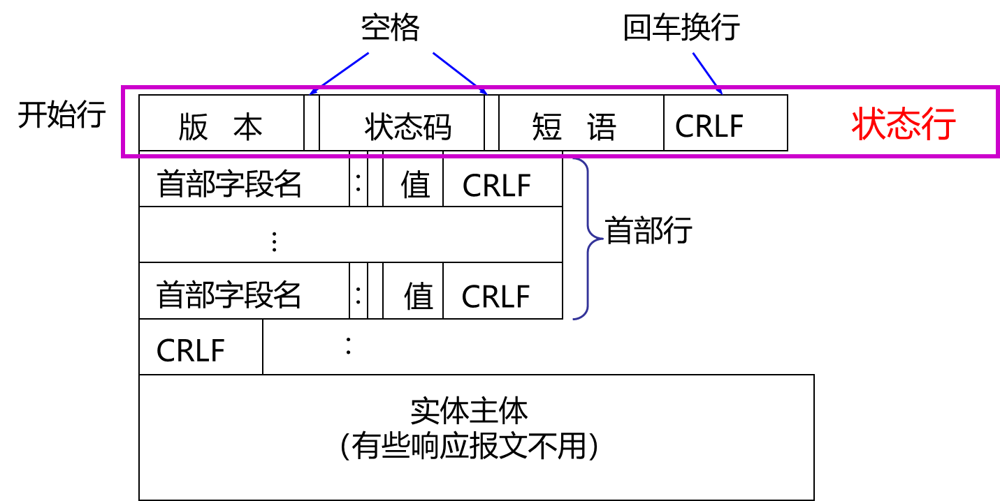

###### HTTP缓存

$\quad$ 浏览器缓存

$\quad$ $\quad$ 在浏览器主机保存用户访问过的服务器Web页副本

$\quad$ $\quad$ 再次访问该页，不必从服务器再次传输，提高访问效率

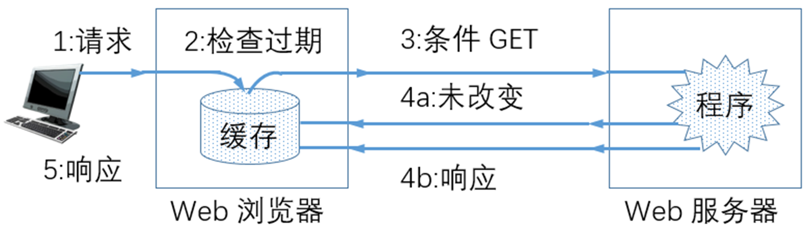

$\quad$ 代理服务器缓存
$\quad$ $\quad$ 目标：代理服务器缓存已访问过的Web页副本，满足用户浏览器从代理服务器提取Web页，尽量减少原始服务器参与

$\quad$ $\quad$ 设置用户浏览器，通过代理服务器进行Web访问

$\quad$ $\quad$ 浏览器将所有的HTTP请求发送到代理服务器

$\quad$ $\quad$ $\quad$ 如果缓存中有被请求的对象，则直接返回对象

$\quad$ $\quad$ $\quad$ 否则，代理服务器向原始服务器请求对象，再将对象返回给客户端

$\quad$ $\quad$ 性能分析：

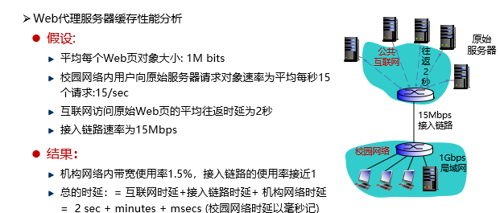

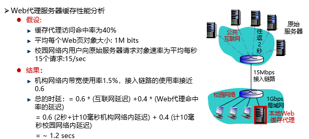

$\quad$ $\quad$ Web缓存存在的困难，即Web缓存与原始服务器Web页一致性问题

$\quad$ $\quad$ $\quad$ 启发式策略（较少使用）：服务器响应Web页的Last-Modified头和Expires头

$\quad$ $\quad$ $\quad$ 询问式策略（常用）：通过特殊的关键字头询问原始服务器，Web副本是否已更新

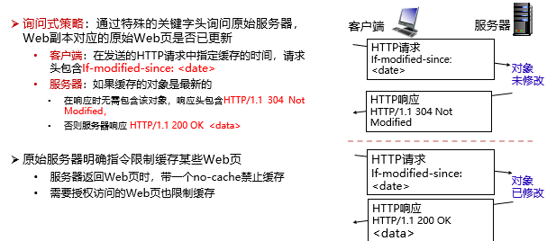
###### Cookie

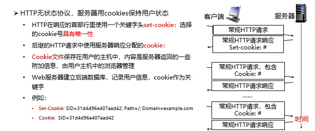

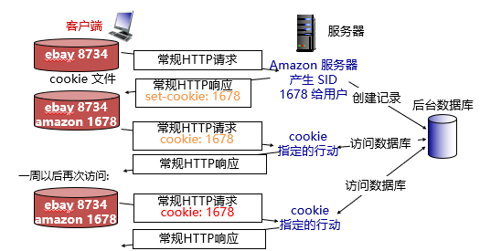

$\quad$ Cookies一般包含5个字段

$\quad$ $\quad$ 域指明Cookie来自何方，每个域为每个客户分配Cookie有数量限制

$\quad$ $\quad$ 路径标明服务器的文件树中哪些部分可以使用该Cookie

$\quad$ $\quad$ 内容采用“名字=值”的形式，是Cookie存放内容的地方，可以达到4K容量，内容只是字符串，不是可执行程序

$\quad$ $\quad$ 安全指示浏览器只向使用安全传输连接的服务器返回Cookie

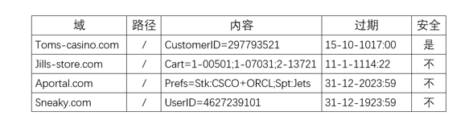

$\quad$ $\quad$ Cookie文件保存的只是文本串，没有可执行程序

###### 访问安全

$\quad$ Web访问安全

$\quad$ $\quad$ 并非所有Web页都会向公众开放

$\quad$ $\quad$ Web服务器可以限定客户端访问的IP地址空间，比如限制只向公司内部员工开放

$\quad$ $\quad$ Apache服务器将设置限制访问规则的文件.htaccess放置在被限制访问的页面所在的目录，客户端访问时进行规则匹配

$\quad$ $\quad$ 无状态：客户端需要在每个请求中携带认证信息

$\quad$ $\quad$ 认证方法：通常在HTTP请求中使用“用户名-密码”

$\quad$ $\quad$ 每个请求头中包含关键字authorization:

$\quad$ $\quad$ 如果请求头中无authorization: ，则服务器拒绝访问，并在响应头中包含WWW authenticate：

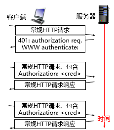

---
