 对应 北京大学计算机网络课程第二讲第三部分

 参考教材计算机网络-自顶向下方法

<!-- more -->

# 计算机网络

## 应用层-其他应用层协议
### P2P

$\quad$ 每个实体都是一个对等结点（peer）

$\quad$ 服务：去中心化的连接与传输

$\quad$ $\quad$ 不需要长期在线服务器

$\quad$ $\quad$ 任意的对等结点可以直接建立连接

$\quad$ $\quad$ 对等结点可以随时加入或退出

$\quad$ $\quad$ 对等结点可以变换IP地址

$\quad$ 典型例子：

$\quad$ $\quad$ P2P文件分享（BitTorrent)

$\quad$ $\quad$ 视频流（PPLive）

$\quad$ $\quad$ VoIP（Skype）

#### 优势

$\quad$ 避免单一中心化结点造成的性能瓶颈

例:

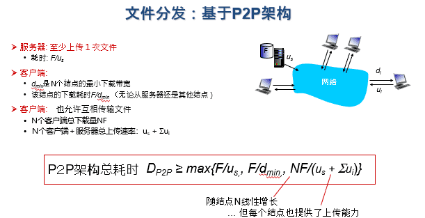

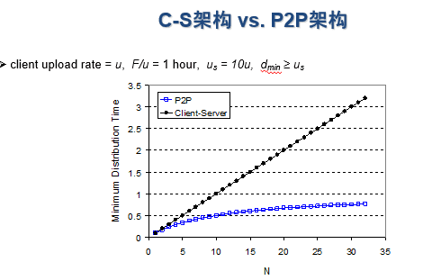

#### 核心问题：Peer索引

$\quad$ P2P协议中，资源索引都是最关键的问题

$\quad$ $\quad$ 目标：给定资源，查询拥有资源的peer

$\quad$ $\quad$ Peer可以随时加入或者退出，也可以动态更改IP地址

$\quad$ 例：P2P文件传输

$\quad$ $\quad$ 索引系统：记录文件到网络位置（IP地址 + 端口号）的映射

$\quad$ $\quad$ 通过索引系统，定位文件的下载地址

$\quad$ $\quad$ 需要动态追踪每个peer拥有的文件

$\quad$ 例：P2P即时通讯

$\quad$ $\quad$ 索引系统：记录用户ID到网络位置（IP地址 + 端口号）的映射

$\quad$ $\quad$ 用户启动即时通讯软件时，告诉索引系统当前IP地址与端口号

$\quad$ $\quad$ Peers通过索引系统，查找发送目标的网络位置

##### 中心化索引

$\quad$ 由一个中心化服务器帮助检索

$\quad$ $\quad$ P2P模式传输资源（文件，即时消息）

$\quad$ $\quad$ 中心化模式定位资源位置

###### 过程

$\quad$ 每个peer需要连接中心化服务器, 告知:

$\quad$ $\quad$ 自身IP地址

$\quad$ $\quad$ 拥有内容

$\quad$ Alice下载文件时，先向中心化服务器查询某个内容的拥有者Bob

$\quad$  Alice向Bob提出请求

###### 问题

$\quad$ 单点故障与性能瓶颈

$\quad$ 解决：洪泛请求

$\quad$ $\quad$ 每个peer独立建立索引，记录自身拥有的资源

$\quad$ $\quad$ Peer之间形成一个图（graph）

$\quad$ $\quad$ $\quad$ 图中的边为TCP连接

$\quad$ $\quad$ $\quad$ 通常每个peer建立小于10个连接

$\quad$ $\quad$ $\quad$ 注意：peers与TCP连接形成的网络，又被成为Overlay网络，有别于IP网络

$\quad$ $\quad$ 查找资源：

$\quad$ $\quad$ $\quad$ 每个peer向邻居peer查询，如果邻居peer没有该资源，则邻居peer向自身邻居递归查询

$\quad$ $\quad$ $\quad$ 一旦查询到结果，沿查询路径返回最初的查询发起者

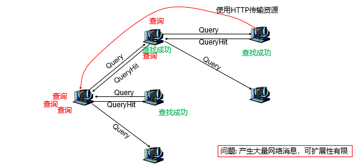

$\quad$ 解决：混合索引

$\quad$ $\quad$ 混合方法: 介于中心化索引与洪泛索引之间

$\quad$ $\quad$ 将Overlay网络组织为层次化结构

$\quad$ $\quad$ $\quad$ 存在超级结点

$\quad$ $\quad$ $\quad$ 每个普通结点连向至少1个超级结点

$\quad$ $\quad$ $\quad$ 超级结点之间可以任意建立连接

$\quad$ $\quad$ 普通结点与超级结点间，使用中心化索引

$\quad$ $\quad$ $\quad$ 超级结点扮演中心化服务器

$\quad$ $\quad$ $\quad$ 超级结点记录“资源->网络位置”映射

$\quad$ $\quad$ 超级结点间采用去中心化的洪泛方式查询索引

#### 实例

##### Gnutella

$\quad$ 纯P2P的文件分发协议

$\quad$ 建立TCP connections：洪泛过程

$\quad$ $\quad$ 1.新加入结点Alice通过candidate peers列表，找到其他peers

$\quad$ $\quad$ 2.Alice遍历列表里每个peer，直到与某个peer Bob建立TCP连接

$\quad$ $\quad$ 3.洪泛: Alice发送Ping消息给Bob，Bob将这个Ping消息转发给所有邻居，邻居们也不断重复

$\quad$ $\quad$ $\quad$ Peers收到Ping消息后，向Alice回复Pong消息

$\quad$ $\quad$ 4.Alice收到Pong消息后，可以建立新的TCP连接

##### BitTorret

$\quad$ BitTorrent是基于P2P思想的文件分发的一个协议

$\quad$ BitTorrent不是纯P2P架构

$\quad$ 所有正在交换某个文件的peer，组成一个torrent（种子）

$\quad$ 中心化的跟踪器(Tracker)：

$\quad$ $\quad$ 一个独立服务器

$\quad$ $\quad$ 维护着一个正在主动上传和下载该内容的所有其他对等用户列表

$\quad$ $\quad$ 对等方可以通过Tracker（跟踪器）找到其他对等方

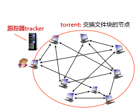

###### 工作流程

$\quad$ 文件被划分为256Kb大小的块(chunk)

$\quad$ torrent中的节点发送或接收文件

$\quad$ 当一个peer加入torrent时

$\quad$ $\quad$ 向追踪器注册，加入torrent中
$\quad$ $\quad$ 没有任何块，但随后会从其他peers逐渐获取文件块

$\quad$ 下载过程：

$\quad$ $\quad$ peers彼此之间交换各自拥有的块清单

$\quad$ $\quad$ 下载与上传文件块可同时进行

$\quad$ $\quad$ 也与其他peers互相交换各自知道的peers

$\quad$ 节点动态加入和退出

$\quad$ 获取整个文件后，存在自私离开可能

###### 结点优化策略

$\quad$ 一些优化策略

$\quad$ $\quad$ 选择罕见的很难找到的块下载

$\quad$ $\quad$ 趋向于匹配那些相互之间具有可比性上传和下载速率的对等节点（同级别结点）

$\quad$ $\quad$ 一个对等节点为其他对等节点作出的贡献越多，它预期的回报就越大

##### Skype

$\quad$ 基于P2P的即使通讯

$\quad$ 私有的应用层协议

$\quad$ $\quad$ 通过逆向工程推断工作原理

$\quad$ 基于层次化结构的混合方法

$\quad$ $\quad$ 存在超级结点

$\quad$ 超级结点上的索引系统记录：

$\quad$ $\quad$ 用户名 -> IP地址

###### 层级化结构
$\quad$ 避免网络管理导致普通结点之间无法直接建立连接

$\quad$ 网络地址转换（Network address translation，NAT）

$\quad$ 防火墙

$\quad$ 可以利用超级结点作为中继代理

$\quad$ 超级结点之间也并非完全联通，有时候还需要第三方超级结点作为中继

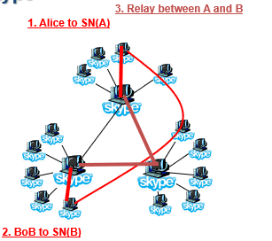

##### 分布式哈希表

$\quad$ 没有中心化追踪器，实现P2P

$\quad$ P2P系统本质是将关键字(key)集合分散到多个peers上

$\quad$ 核心挑战：如何管理key->peer映射

$\quad$ $\quad$ peers可能随时加入或退出

$\quad$ $\quad$ 需要追踪关键字存储位置的变化

$\quad$ $\quad$ 追踪器以中心化的方式，记录各个peers的活跃情况与保存关键字

$\quad$ 分布式哈希表（distributed hash tables, DHTs)

$\quad$ $\quad$ 不需要中心化追踪器，就能查询每个key在哪个peers上

$\quad$ DHT是一个概念，具体有多种实现方式:

###### Chord

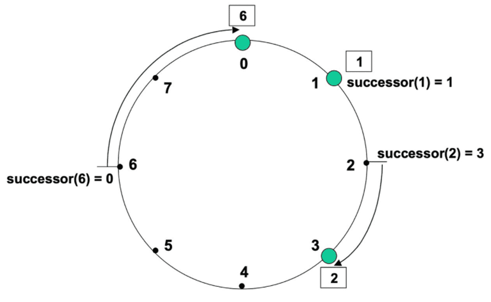

$\quad$ 基本思想：

$\quad$ 对所有peers地址，以及key计算哈希值

$\quad$ 哈希值取模后，排列在一个圆环上

$\quad$ 每个key由圆环上顺时针方向的下一个peer负责存储

$\quad$ 若查询失败，则继续沿着顺时针方向查询

$\quad$ Peers加入或退出时，需要更新操作

$\quad$ $\quad$ 可以延迟更新，但增加查询开销

$\quad$ $\quad$ 当新Peer加入：

$\quad$ $\quad$ $\quad$ 通知前驱结点、后续Peer更改邻居关系

$\quad$ $\quad$ $\quad$ 从后续Peer迁移数据

$\quad$ $\quad$ 如果多个Peers几乎同时加入

$\quad$ $\quad$ $\quad$ 周期性咨询后续Peer：谁是你的前驱Peer

$\quad$ $\quad$ $\quad$ 进行邻居关系更新、数据迁移

$\quad$ $\quad$ 当Peer正常退出：

$\quad$ $\quad$ $\quad$ 通知前驱结点、后续Peer更改邻居关系

$\quad$ $\quad$ $\quad$ 将数据迁移至后续Peer

$\quad$ $\quad$ 当Peer异常退出

$\quad$ $\quad$ $\quad$ 发送数据丢失

$\quad$ $\quad$ $\quad$ 解决方案：每份数据在多个peer上进行备份,一旦发现异常退出，从备份数据中进行恢复

  

### 流媒体

$\quad$ 常见的流媒体服务

$\quad$ $\quad$ 媒体点播：提前录制好，边下载边播放（起始时延<10s；类VCR操作（例如拖动进度条）<1~2s）

$\quad$ $\quad$ 媒体直播：边录制边上传，边下载边播放（大规模直播往往有数秒的时延）

$\quad$ $\quad$ 实时交互 ：双方或多方实时交互式通信（时延<400ms可接受，VR则需要<25ms）

$\quad$ 流媒体概念

$\quad$ $\quad$ 连续媒体（音视频）经压缩编码、数据打包后，经过网络发送给接收方

$\quad$ $\quad$ 接收方对数据进行重组、解码和播放

#### 特性

$\quad$ 端到端时延约束

$\quad$ 时序性约束：流媒体数据必须按照一定的顺序连续播放

$\quad$ 具有一定程度的容错性：丢失部分数据包也可完成基本功能

#### 编码与格式

$\quad$ 视频编码标准：H.264，H.265，VP9，AV1等

$\quad$ $\quad$ H.264：最主流的编码；支持不同分辨率、比特率；兼容性好

$\quad$ $\quad$ H.265：H.264的升级，视频内容压缩50%；硬件成本高，专利许可费高

$\quad$ $\quad$ VP9：Google开源视频编码标准，与H.265相当性能，无许可费

$\quad$ $\quad$ AV1：开源标准，比H.265与VP9性能更好，开源免费

$\quad$ 音频编码标准：AAC，MP3，Opus等

$\quad$ 媒体容器格式：封装视频与音频

$\quad$ $\quad$ MP4：支持多种视频编码与音频编码，兼容性最好

$\quad$ $\quad$ MKV：多音轨、多字幕，适合电影电视剧；兼容性不如MP4

$\quad$ $\quad$ FLV：支持编码最少；早期因为跨平台、交互性好，用于网络流媒体，现逐渐淘汰

#### 挑战

$\quad$ 目标：流媒体服务质量

$\quad$ $\quad$ 画质、启动延迟、平滑、交互性

$\quad$ 现实约束：网络条件有限

$\quad$ $\quad$ 带宽有限、动态变化、延迟抖动、丢失、异构性

$\quad$ 如何在“尽力服务”的网络传输条件下获得良好的视频质量？

$\quad$ $\quad$ UDP不保障可靠传输（丢包、乱序）

$\quad$ $\quad$ 即使是TCP，也只保证不丢包与顺序（而且引入额外处理开销），但无法提供带宽与延迟保障

#### 媒体点播

$\quad$ 浏览器从服务器下载并播放流媒体文件

$\quad$ $\quad$ 浏览器用户使用 HTTP 的 GET 报文接入到Web服务器；这个超链指向一个元文件（有音/视频文件的统一资源定位符 URL）

$\quad$ $\quad$ Web服务器把该元文件装入 HTTP 响应报文的主体，发回给浏览器

$\quad$ $\quad$ 浏览器调用媒体播放器，把提取出的元文件传输给媒体播放器

$\quad$ $\quad$ 媒体播放器使用元文件中的 URL，向媒体服务器发送 HTTP 请求报文，要求下载音/视频文件

$\quad$ $\quad$ 媒体服务器发送 HTTP 响应报文，把音/视频文件发送给媒体播放器；媒体播放器边下载边解压缩边播放（通过时间戳同步音频流和视频流）

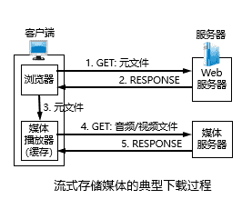

$\quad$ 发送端以恒定速率产生数据分组

$\quad$ 网络传输后的结果

$\quad$ $\quad$ 由于网络传输的抖动特性，分组到达接收端时变成了非恒定速率

$\quad$ $\quad$ 此时如果到达时就随即播放，则会出现卡顿

$\quad$ $\quad$ （分组1、3到达接收端可播放，分组2、4、5、6未到达，出现卡顿）

$\quad$ 如何应对网络传输的抖动特性

$\quad$ $\quad$ 在接收端经过缓存后，再以恒定速率播放（推迟播放时间）

$\quad$ $\quad$ 能够在一定程度上消除了时延的抖动

$\quad$ $\quad$ 但付出的代价是增加了时延

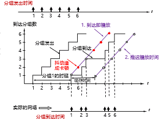

$\quad$ 客户端缓冲区

$\quad$ $\quad$ 客户端播放的是本地缓冲区的内容，而不是立即播放来自网络的实时内容

$\quad$ $\quad$ 基于2个阈值控制

$\quad$ $\quad$ $\quad$ 缓冲区内容小于低阈值标记：数据即将播完，容易出现卡顿；需要加速传输

$\quad$ $\quad$ $\quad$ 缓冲区内容大于高阈值标记：占用过多存储空间；可以减慢传输

$\quad$ $\quad$ $\quad$ 需要的决策：需要多大缓存，服务器以多快速率发送，才能在不稳定的网络中，尽量满足用户期望：高清、低延迟、不卡顿

$\quad$ $\quad$ $\quad$ 上述决策需要特定网络协议支持

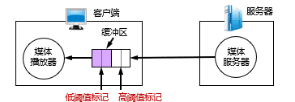

  

#### 直播与实时音视频

$\quad$ 实时音频/视频所需要的几种应用协议

$\quad$ $\quad$ 信令协议，对建立的连接起控制作用，如RTSP

$\quad$ $\quad$ 数据传送协议，使音/视频能够以时延敏感属性传送，如RTP/RTCP

$\quad$ $\quad$ $\quad$ 又包括：负责实际数据传输的（如RTP）与负责服务质量保障的（如RTCP）

$\quad$ 使用TCP，还是UDP？

$\quad$ $\quad$ UDP不可靠但效率高，更适合实时类应用

$\quad$ $\quad$ UDP需要自行实现流控算法，增加了开发成本和复杂性

$\quad$ $\quad$ UDP传输音视频可能会被路由器丢弃或防火墙阻拦，而TCP可以畅通无阻

$\quad$ 实际：衍生出协议众多，技术路线各异

$\quad$ 各类协议广泛用于点播、直播、实时音频场景

#### 流媒体协议

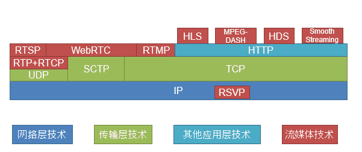

##### 实时传输协议 RTP (Real-time Transport Protocol)

$\quad$ 使用UDP

$\quad$ RTP 为实时应用提供端到端的数据传输，但不提供任何服务质量的保证

$\quad$ RTP 不对多媒体数据块做任何处理

$\quad$ $\quad$ 这里处理指编码、解码、缓存等，这些都是媒体播放器负责

##### 实时传输控制协议 RTCP (RTP Control Protocol)

$\quad$ RTCP 是与 RTP 配合使用的控制协议

$\quad$ RTCP 的主要功能：服务质量的监视与反馈、媒体间的同步、播组中成员的标识

$\quad$ RTCP 分组也使用 UDP 传送

$\quad$ 可将多个 RTCP 分组封装在一个 UDP 用户数据报中

$\quad$ RTCP 分组周期性地在网上传送，它带有发送端和接收端对服务质量的统计信息报告

$\quad$ RTP与RTCP很少直接使用，大多作为其他流媒体协议的基础

##### 实时流式协议RTSP (Real-Time Streaming Protocol)

$\quad$ RTSP本身并不传送数据，是一个多媒体播放控制协议，通用性好

$\quad$ $\quad$ 没有定义音频/视频的编码方案

$\quad$ $\quad$ 没有规定音频/视频在网络中传送时应如何封装在分组中

$\quad$ $\quad$ 没有规定音频/视频流在媒体播放器中应如何缓存

$\quad$ RTSP对播放情况进行控制，如：暂停/继续、后退、前进等， 又称为“互联网录像机遥控协议”

$\quad$ RTSP是有状态的协议，它记录用户所处于的状态（初始化状态、播放状态或暂停状态）

$\quad$ RTSP控制分组既可在 TCP 上传送，也可在 UDP 上传送

$\quad$ $\quad$ 使用UDP时，底层就是使用RTP+RTCP

###### 使用 RTSP 的媒体服务器的工作过程

$\quad$ 浏览器向万维网服务器请求音/视频文件

$\quad$ 万维网服务器从浏览器发送携带有元文件的响应

$\quad$ 浏览器把收到的元文件传输给媒体播放器

$\quad$ RTSP 客户与媒体服务器的 RTSP 服务器建立连接

$\quad$ RTSP 服务器发送响应 RESPONSE 报文

$\quad$ RTSP 客户发送 PLAY 报文，开始下载音/视频文件的特定位置

$\quad$ RTSP 服务器发送响应 RESPONSE 报文

$\quad$ 开始传输音视频数据（使用RTP协议传输内容）

$\quad$ RTSP 客户发送 TEARDOWN 报文断开连接

$\quad$ RTSP 服务器发送响应 RESPONSE 报文

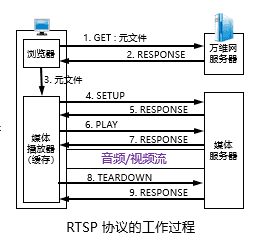

##### RTMP

$\quad$ Adobe开发，最初用于Flash媒体传输，后被广泛使用

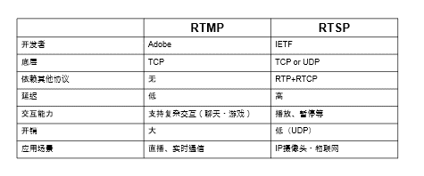

##### 其他流媒体协议

$\quad$ RSVP：让网络层预留资源，通常用于专网

$\quad$ MMS：Microsoft Media Server Protocol，微软流媒体协议

$\quad$ $\quad$ 支持UDP、TCP，但是不使用RTP与RTCP，而是微软内部的ASF格式

$\quad$ $\quad$ 逐渐淘汰

$\quad$ 随着HTTP5的出现，传输流媒体协议逐渐减少

$\quad$ 最新流媒体技术：

###### 网页实时通信 WebRTC（Web Real-Time Communication）

$\quad$ 由Google发起的实时音视频通信开源项目

$\quad$ 建立浏览器之间点对点的连接，实现音/视频流的传输

$\quad$ WebRTC协议栈

$\quad$ $\quad$ 为了满足实时性需求，其核心协议基于 UDP 基础上搭建

$\quad$ $\quad$ Secure RTP（SRTP）与 Secure  RTCP（SRTCP） 是对媒体数据的封装与传输控制协议

$\quad$ $\quad$ 流控制传输协议SCTP，提供类似 TCP 的特性

$\quad$ $\quad$ RTCPeerConnection 用来建立和维护端到端连接

$\quad$ $\quad$ RTCDataChannel 用来支持端到端的任意二进制数据传输

$\quad$ $\quad$ DTLS 对传输内容进行加密，是 UDP 版 TLS

$\quad$ $\quad$ ICE、STUN、TURN 用于内网穿透，应对NAT 等私有地址转换的问题

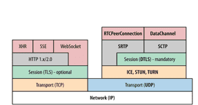

###### 基于HTTP的协议

$\quad$ MPEG-DASH：也叫DASH over HTTP，全称Dynamic Adaptive Streaming over HTT

$\quad$ $\quad$ 开放的国际标准

$\quad$ $\quad$ 支持各种视频、音频格式、文件封装格式

$\quad$ $\quad$ 视频传输优化（无论点播、直播、实时交互）

$\quad$ $\quad$ $\quad$ 客户端基于当前网络状况，向服务器请求视频块

$\quad$ $\quad$ $\quad$ 若视频块的码率>可用带宽：视频块难以及时抵达客户端，出现卡顿

$\quad$ $\quad$ $\quad$ 若视频块的码率<可用带宽：视频质量较低，没有充分利用带宽资源

$\quad$ $\quad$ 基本思想

$\quad$ $\quad$ $\quad$ 完整视频被拆分为固定时长 (2s-10s) 的视频片段(segment)， 每段提供不同码率

$\quad$ $\quad$ $\quad$ 视频片段与其对应的元文件（URL）一同存放于DASH服务器

$\quad$ $\quad$ $\quad$ 客户端基于网络条件、缓冲大小等，对每个视频片段，自适应选择合适的视频码率来下载

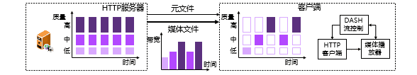

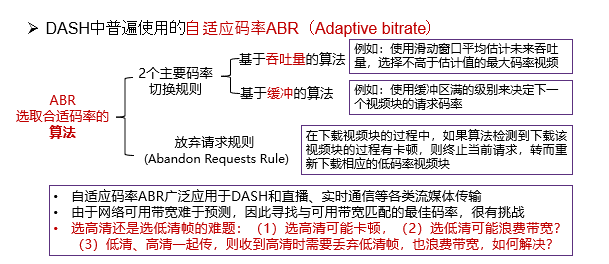

$\quad$ $\quad$ 对流媒体进行更好的编码，例如：可扩展视频编码 SVC（Scalable Video Coding）

$\quad$ $\quad$ $\quad$ SVC 是以H.264为基础，支持多层分级特性：立足基础层，采用锦上添花的增强层

$\quad$ $\quad$ $\quad$ 基础层与增强层：不同的帧率、空间分辨率

$\quad$ $\quad$ $\quad$ 当带宽不足时，只对基础层的码流进行传输和解码，这时解码的视频质量不高

$\quad$ $\quad$ $\quad$ 当带宽充足时，可以传输和解码增强层的码流来提高视频的解码质量

$\quad$ $\quad$ $\quad$ 优点：确保传输基础层来避免卡顿，使用富裕的带宽传输增强层，充分利用带宽

$\quad$ $\quad$ $\quad$ 缺点：编解码复杂度增加，有多个增强层时开销过大

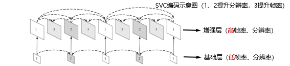

  

$\quad$ HLS（HTTP Live Streaming）：Apple开发

$\quad$ $\quad$ 面向iOS、Safari浏览器等Apple生态

$\quad$ $\quad$ 只使用MPEG-2 Transport Stream文件格式

$\quad$ HDS：Adobe开发

$\quad$ $\quad$ 原本想取代RTMP作为对Flash的新支持，但由于Flash停止更新，HDS也停止更新

$\quad$ $\quad$ RTMP由于自身不限于Flash，仍在广泛使用（虽然也在减少）

$\quad$ Microsoft Smooth Streaming

$\quad$ $\quad$ 服务于Silverlight的流媒体协议，Silverlight是微软用于对标Flash的交互性网络应用开发工具

$\quad$ $\quad$ Silverlight被HTML5、CSS3、JavaScript取代， Smooth Streaming使用也逐渐减少

  

### 内容分发网络CDN

$\quad$ CDN服务提供

$\quad$ $\quad$ CDN服务提供商：Akamai、蓝讯、世纪互联、网宿等

$\quad$ $\quad$ 互联网内容提供商（ICP）：腾讯、百度等

$\quad$ $\quad$ 互联网服务提供商（ISP）：移动、联通、电信等

$\quad$ 关键问题

$\quad$ $\quad$ CDN服务器如何布局

$\quad$ $\quad$ 如何通过CDN获取资源

$\quad$ $\quad$ 如何进行重定向，将请求调度到较近或负载较轻的CDN服务器

#### 布局

$\quad$ $\quad$ 广度：深入部署到很多访问网络的内部

$\quad$ $\quad$ 深度：少量靠近接入网的关键位置建造大集群，距离用户要近

#### 获取资源

$\quad$ CDN缓存位置和内容——在CDN节点上存储内容拷贝

$\quad$ $\quad$ 如MADMEN

$\quad$ 订阅者（subscriber）请求内容，服务提供者返回清单CDN

$\quad$ $\quad$ 通过清单,客户端以可支持的最高速率检索到内容

$\quad$ $\quad$ 如果网络路径拥塞，可能会选择不同的拷贝或网络速率

#### HTTP重定向

$\quad$ 目标：将请求调度到较近或负载较轻的CDN服务器

$\quad$ 方法1：HTTP重定向请求内容，服务提供者返回清单CDN

$\quad$ $\quad$ 原始服务器决策CDN服务器

$\quad$ $\quad$ HTTP响应：状态码30X，Location：指明新的位置

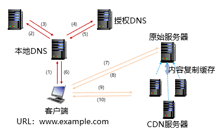

$\quad$ 方法2：DNS辅助实现CDN

$\quad$ $\quad$ 负载均衡DNS负责决策CDN服务器选择

$\quad$ $\quad$ 负载均衡DNS需要收集CDN服务器的位置和负载情况

$\quad$ $\quad$ 如果找不到被请求的对象，需要从原始服务器获取

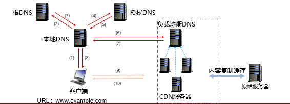

$\quad$ 方法3：网站所有者可以重写通过CDN与内容链接的页面

### Telnet

$\quad$ 远程登录是网络最早提供的基本服务之一，通过终端仿真协议实现对远程计算机系统的访问，就像访问本地资源一样，而且这个过程对用户是透明的

$\quad$ 目标：解决异构计算机系统的差异性问题，主要体现在对终端键盘输入命令的解释上

$\quad$ $\quad$ Telnet协议最早出现在20世纪60年代后期，1983年由RFC 854确定为Internet标准

$\quad$ $\quad$ Telnet = Teletype over Network

$\quad$ 架构

$\quad$ $\quad$ Telnet协议使用C/S方式实现。在本地系统运行Telnet客户进程，在远程主机运行Telnet服务器进程

$\quad$ $\quad$ Telnet协议使用TCP连接通信，服务器进程默认监听TCP23端口，服务器使用主进程等待新的请求，并产生从属进程来处理每一个连接

#### NVT

$\quad$ Telnet协议引入网络虚拟终端NVT（Network Virtual Terminal），使用一种专门的键盘定义来屏蔽不同计算机系统对键盘输入的差异性，同时定义客户进程与远程服务器进程之间的交互过程

$\quad$ NVT是Telnet协议定义的一组通用字符集，通过这种统一的数据表示方式，来保证不同硬件、软件与数据格式的终端与主机之间通信的兼容性

$\quad$ 本地终端输入的字符首先由本地Telnet客户进程转换为NVT格式，通过网络将NVT格式的字符传输到远程主机，远程Telnet服务器进程再将NVT格式的字符转换为远程主机能够识别和处理的字符格式

$\quad$ 使用Telnet协议在网络中传输的数据都是NVT格式，不同的用户终端与服务器进程均与本地终端格式无关

#### 工作过程

$\quad$ 本地Telnet客户进程与远程主机上的Telnet服务器进程建立TCP连接

$\quad$ 将本地终端上输入的用户名和口令及以后输入的任何命令或字符以网络虚拟终端NVT格式传输给远程主机

$\quad$ 将远程主机输出的NVT格式的数据转化为本地所接受的格式送回本地终端，包括输入命令回显和命令执行结果

$\quad$ 本地终端对远程主机撤销连接，从而结束 Telnet远程登录过程

### FTP

$\quad$ 网络环境下复制文件的复杂性

$\quad$ $\quad$ 计算机存储数据的格式不同

$\quad$ $\quad$ 文件目录结构和文件命名规则不同

$\quad$ $\quad$ 对于相同的文件存取功能，操作系统使用的命令不同

$\quad$ $\quad$ 访问控制方法不同

$\quad$ 文件传输协议FTP(File Transfer Protocol)是Internet上使用最广泛的应用层协议之一

$\quad$ $\quad$ FTP提供交互式的访问，允许用户指明文件的类型与格式，并允许文件具有存取权限

$\quad$ $\quad$ FTP屏蔽了各计算机系统的细节，适用于在异构网络中任意计算机之间传送文件

$\quad$ $\quad$ RFC 959早在1985年就已经成为Internet的正式标准

#### 进程模型

$\quad$ FTP使用C/S方式实现

$\quad$ FTP工作过程

$\quad$ $\quad$ 服务器主进程打开TCP21端口，等待客户进程发出的连接请求

$\quad$ $\quad$ 客户可以用分配的任意一个本地端口号与服务器进程的TCP21端口进行连接

$\quad$ $\quad$ 客户请求到来时，服务器主进程启动控制进程与数据进程来处理客户进程发来的请求

$\quad$ $\quad$ 服务器控制进程与数据进程对客户进程的请求处理完毕后即终止

$\quad$ $\quad$ 服务器主进程返回，继续等待接收其他客户进程发来的连接请求，服务器主进程与从属进程（控制进程、数据进程）并行工作

$\quad$ FTP的两个端口与两个连接

$\quad$ $\quad$ 控制连接在整个会话期间一直保持，客户进程发出的文件传输请求通过控制连接发送给服务器控制进程（工作在TCP21端口），但控制连接不用来传输文件

$\quad$ $\quad$ 服务器控制进程在接收到客户进程发送来的文件传输请求后就创建数据传输进程（工作在TCP20端口）和数据连接

$\quad$ $\quad$ 数据连接用来连接客户进程和服务器数据传输进程，实际完成文件的传输。服务器数据传输进程在文件传输完毕后关闭数据连接并结束运行

#### 简单文件传输协议TFTP

$\quad$ TFTP(Trivial File Transfer Protocol) 是一个很小且易于实现的文件传输协议

$\quad$ 使用C/S方式和UDP协议实现

$\quad$ 只支持文件传输而不支持交互

$\quad$ 没有庞大的命令集，没有列目录的功能，也不能对用户进行身份鉴别

$\quad$ 支持ASCII 码或二进制传送

$\quad$ 支持对文件进行读或写

$\quad$ 使用很简单的首部

$\quad$ 与FTP是两个不同协议

##### 数据传输

$\quad$ 以PDU为单位进行传输

$\quad$ PDU也称为文件块 (block)，按序从1开始编号

$\quad$ 每次传送的数据PDU中有512字节的数据，但最后一次可不足512字节

$\quad$ 若文件长度恰好为512字节的整数倍，则在文件传输完毕后，还必须在最后发送一个只含首部而无数据的数据 PDU

$\quad$ 若文件长度不是512字节的整数倍，则最后传送数据PDU的数据字段一定不满512字节，这正好可作为文件结束的标志

##### 工作过程

$\quad$ 每发送完一个文件块后就等待对方的确认，确认时应指明所确认的块编号

$\quad$ 发完数据后在规定时间内收不到确认就要重发该数据PDU

$\quad$ 文件请求方若在规定时间内收不到下一个文件块，也要重发确认PDU。这样就能保证文件的传输不会因某一个数据PDU的丢失而失败

$\quad$ 开始工作时，TFTP客户进程发送一个读请求PDU或写请求PDU给TFTP服务器进程，其UDP端口号为69

$\quad$ TFTP服务器进程要选择一个新的端口和TFTP客户进程进行通信

### SNMP

#### 网络管理

$\quad$ 目的

$\quad$ $\quad$ 有效利用网络资源

$\quad$ $\quad$ 及时报告和处理网络故障

$\quad$ $\quad$ 保障网络正常、高效运行

$\quad$ 网络管理的功能

$\quad$ $\quad$ 配置管理（Configuration Management）

$\quad$ $\quad$ 故障管理（Fault Management）

$\quad$ $\quad$ 性能管理（Performance Management）

$\quad$ $\quad$ 计费管理（Accounting Management）

$\quad$ $\quad$ 安全管理（Security Management）

##### 网络管理系统

$\quad$ 管理器（Manager）：网络管理进程，提供网络管理用户界面，完成管理任务

$\quad$ 管理对象（Managed Object）：网络中的软硬件系统

$\quad$ 代理（Agent）：管理对象中的进程，负责与管理器交互

$\quad$ 管理信息库（MIB，Management Information Base）：存储网络信息

$\quad$ 本地MIB：每个代理管理自己的本地MIB，仅包含本地设备相关信息

$\quad$ 网络MIB：代理与管理器交换网络状态信息，共同构成整个网络的MIB

$\quad$ 网络管理协议（Network Management Protocol）

$\quad$ TCP/IP的简单网络管理协议SNMP（Simple Network Management Protocol）

$\quad$ OSI的公共管理信息协议CMIP（Common Management Information Protocol）

#### 概述

$\quad$ 指导思想

$\quad$ $\quad$ 尽可能简单：用简单的系统结构和协议来解决复杂的网络管理问题

$\quad$ $\quad$ $\quad$ 协议交互过程简单，仅有4类操作对网络进行管理

$\quad$ $\quad$ $\quad$ 使用UDP协议，以简化设计和降低通信开销

$\quad$ $\quad$ 影响尽量小：网络中任何软硬件的增减对原有管理对象的影响尽量小

$\quad$ 版本变迁

$\quad$ $\quad$ SNMPv1：RFC 1067(1988)、RFC 1098(1989)、RFC 1155~1157(1990)

$\quad$ $\quad$ SNMPsec：RFC 1351~1353(1992)

$\quad$ $\quad$ SNMPv2：RFC 1441~1445(1993)

$\quad$ $\quad$ SNMPv3：RFC 3410~3418(2002)，安全性和可管理性大为提高

#### 工作方式

##### SNMP协议规则——轮询方式

$\quad$ 管理器采用轮询方式，周期性“读”“写”来实现网络管理功能

$\quad$ $\quad$ “读”操作：管理器向代理发送get报文来检测管理对象状态

$\quad$ $\quad$ “写”操作：管理器向代理发送set报文来修改管理对象状态

$\quad$ 轮询方式的优点

$\quad$ $\quad$ 协议实现相对简单

$\quad$ $\quad$ 能限制所产生管理信息的通信量

$\quad$ 轮询方式的缺点

$\quad$ $\quad$ 不够灵活，而且所能管理的设备数目不能太多

$\quad$ $\quad$ 开销比较大

##### SNMP协议规则——陷阱方式

$\quad$ SNMP允许代理不经过管理器询问就能发送某些信息，这种信息称为陷阱（trap）报文，通常代表代理检测到的重要事件

$\quad$ 当管理对象的代理检测到有事件发生时，就检查其门限值。代理只向管理器报告达到特定门限值的事件，这个过程称为过滤

$\quad$ 陷阱方式的优点

$\quad$ $\quad$ 仅在严重事件发生时才发送陷阱报文

$\quad$ $\quad$ 陷阱信息很简单且所需字节数很少

#### 实现

$\quad$ SNMP协议实现

$\quad$ $\quad$ SNMP使用无连接的UDP协议实现，众所周知UDP协议不保证可靠交付

$\quad$ $\quad$ SNMP使用C/S方式实现

$\quad$ $\quad$ $\quad$ 代理运行服务器端进程在UPD端口161接收get或set报文以及发送response报文，与161端口通信的客户端进程则使用临时端口

$\quad$ $\quad$ $\quad$ 管理器运行客户端进程在UPD端口162接收来自代理的trap报文

$\quad$ SNMP的通常使用

$\quad$ $\quad$ 使用周期性轮询方式实现对网络资源的实时监控与管理

$\quad$ $\quad$ 使用陷阱方式报告重要事件的发生

#### 报文格式

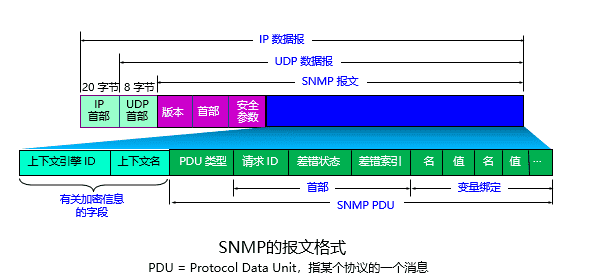

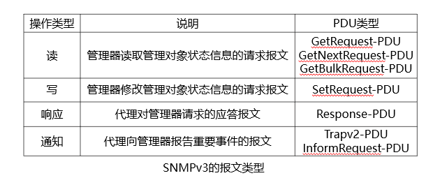

#### 提供信息

$\quad$ 基本流量统计：报文数、字节数

$\quad$ 设备CPU利用率

$\quad$ 设备内存占用

$\quad$ 缺乏细粒度信息

$\quad$ $\quad$ 无法识别TCP连接，更不可能记录每个连接传输多少数据

#### 局限性

$\quad$ SNMP难以应对当前网络管理需求

$\quad$ $\quad$ 读操作：SNMP提供的数据不足以支撑复杂网络管理

$\quad$ $\quad$ 写操作：SNMP能修改的设备状态有限

$\quad$ $\quad$ $\quad$ 修改参数

$\quad$ $\quad$ $\quad$ 打开/关闭某个端口

$\quad$ 替代方案

$\quad$ $\quad$ 状态读取：新型网络测量算法

$\quad$ $\quad$ 设备控制：软件定义网络、网络功能虚拟化、可编程网络

  

---