$\quad$ 你北的操统也太抽象了，就简单复习一下老师上课讲的题和一定会考的题目吧。

# 操统复习

## 期中前

Ctrl+C 响应过程分析（从操作系统角度）

$\quad$ 硬件层响应

$\quad$ $\quad$ 键盘控制器检测到Ctrl和C键同时按下

$\quad$ $\quad$ 生成键盘中断请求(IRQ 1)

$\quad$ $\quad$ CPU收到中断请求，保存当前执行现场

$\quad$ $\quad$ 进入内核态，跳转到中断向量表中对应的处理程序

$\quad$ 中断处理阶段

$\quad$ $\quad$ 执行键盘中断处理程序

$\quad$ $\quad$ 读取键盘缓冲区，获取扫描码

$\quad$ $\quad$ 将扫描码转换为对应的ASCII码

$\quad$ $\quad$ 识别为Ctrl+C组合键

$\quad$ 信号生成阶段

$\quad$ $\quad$ 为当前终端的前台进程组生成SIGINT信号

$\quad$ $\quad$ 将信号添加到目标进程的未决信号集

$\quad$ $\quad$ 检查进程的信号屏蔽字

$\quad$ 信号投递阶段

$\quad$ $\quad$ 进程从内核态返回用户态前检查未决信号

$\quad$ $\quad$ 发现SIGINT信号待处理

$\quad$ $\quad$ 中断当前执行流程

$\quad$ $\quad$ 保存当前上下文

$\quad$ 信号处理阶段

$\quad$ $\quad$ 检查进程是否注册了SIGINT处理函数

$\quad$ $\quad$ 如有自定义处理函数则执行

$\quad$ $\quad$ 否则执行默认动作（终止进程）

$\quad$ 进程调度阶段

$\quad$ $\quad$ 如进程被终止，更新进程状态为TERMINATED

$\quad$ $\quad$ 调度器选择新的进程执行

$\quad$ $\quad$ 进行上下文切换

$\quad$ 恢复被选中进程的执行

## 期中后

###  内存管理

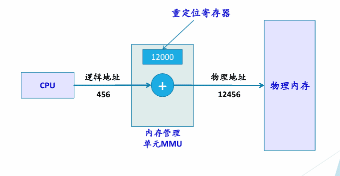

CPU取到逻辑地址，自动划分为页号和页内地址；用页号查页表， 得到页框号，再与页内地址（页内偏移）拼接为物理地址

### 虚存管理

当进程运行时，先将其一部分装入内存，另一部分暂时保存在磁盘；当要执行的指令或访问的数据不在内存时，由操作系统自动完成将它们从磁盘调入内存的工作

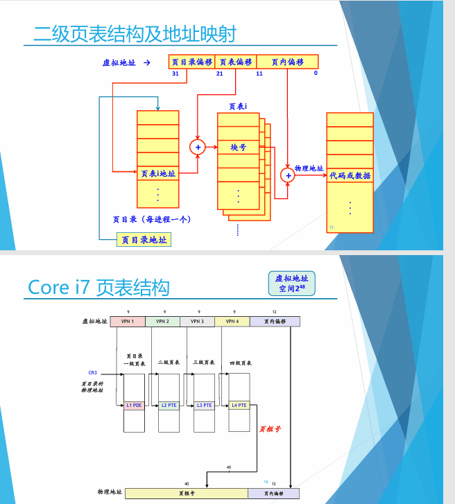

页面置换算法

FIFO（先进先出），OPT（以后不再需要或者最远才会用到），LRU（最后一次访问距离目前最久的）

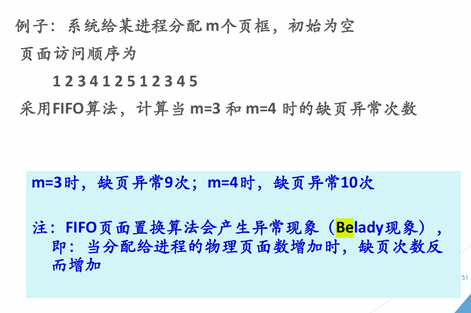

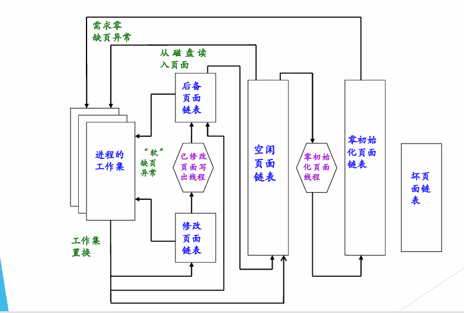

注意进程结束即可

局部性原理，按需分页，工作集理论

### 文件系统

文件 是 对磁盘的 抽象：所谓文件 是指 一组带标识（标识即为文件名）的、在逻辑上有完整意义的信息项的序列

文件系统：统一管理信息资源，管理文件的存储、检索、更新，提供安 全可靠的共享和保护手段，并且方便用户使用

用户给出文件名 → 按文件名查找目录项/FCB

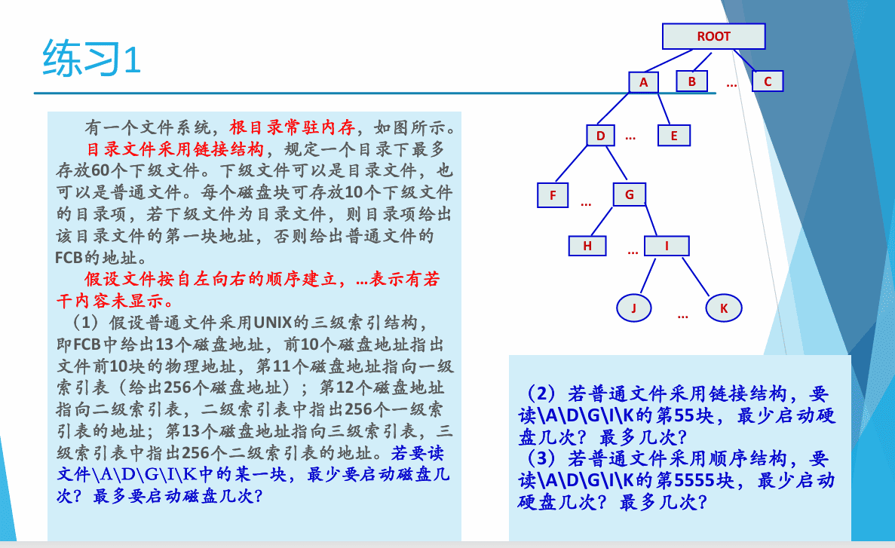

在根目录文件中，查找A目录文件的目录项   0    0 （根目录常驻内存）

在A目录文件中，查找D目录文件的目录项    1    1   (D为第一项)

在D目录文件中，查找G目录文件的目录项     1    6   (60/10)

在G目录文件中，查找I目录文件的目录项     1    6  

在I目录文件中，查找K目录文件的目录项     1     6

读K的FCB    1   1

读k中某一块   索引3级： 1     4   链接 55   55     顺序 1   1

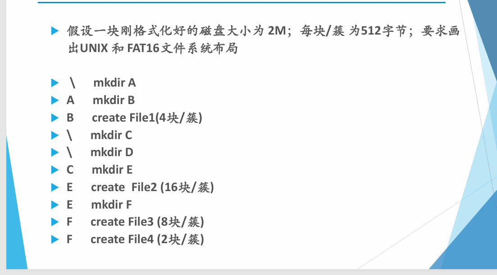

文件操作：

**建立文件**

检查参数合法性

申请目录项，磁盘块

返回

**打开文件**

根据文件路径名查目录，找到目录项(或I节点号) ；

根据文件号查系统打开文件表，看文件是否已被打开； 是→共享计数加1 否则→将目录项(或I节点)等信息填入系统打开文件表空表项，共享计数置为 1； 

根据打开方式、共享说明和用户身份检查访问合法性； 

在用户打开文件表中取一空表项，填写打开方式等，并指向系统打开文件表 对应表项 返回fd

**读文件**

根据打开文件时得到的文件描述符，找到相应的文件控制块（目录项） 确定读操作的合法性 

将文件的逻辑块号转换为物理块号 根据参数中的读指针、长度与文件控制块中的信息，确定块号、块数、 块内位移 

申请缓冲区 

启动磁盘I/O操作，把磁盘块中的信息读入缓冲区，再传送到指定的内存 区（多次读盘） 

反复执行直至读出所需数量的数据或读至文件尾

windos文件访问

访问文件缓存

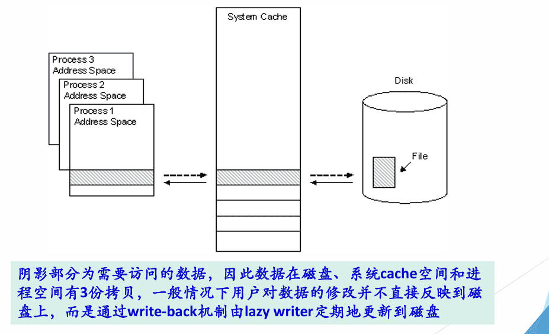

磁盘调度

单向扫描

写时复制：

写时复制(Copy-On-Write)技术实现计划需要以下步骤：首先设计基础数据结构包括页表项(PTE)结构体，需包含物理地址、存在位、写保护位、COW标志和引用计数；其次实现页面管理器类，负责处理fork()操作时的页表复制、引用计数更新和写保护设置；然后实现缺页中断处理程序，在写操作触发时检查COW标志，执行物理页面分配、内容复制和页表更新；最后添加同步机制确保并发安全，包括原子操作保护引用计数和页表锁保护并发访问，整个实现过程需要注意内存管理和异常处理，确保系统稳定性。重点在于实现高效的内存共享和按需复制机制，最大限度地优化系统资源使用。

内存映射文件

个文件或者其它对象映射到进程的地址空间，实现文件磁盘地址和进程虚拟地址空间中一段虚拟地址的一一对映关系。实现这样的映射关系后，进程就可以采用指针的方式读写操作这一段内存，而系统会自动回写脏页面到对应的文件磁盘上，即完成了对文件的操作而不必再调用 read、write 等系统调用函数。相反，内核空间对这段区域的修改也直接反映用户空间，从而可以实现不同进程间的文件共享。

### IO管理

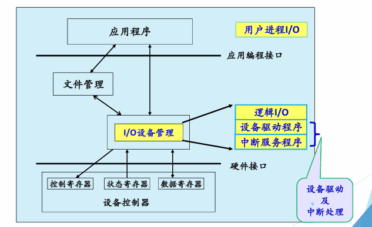

建立方便、统一的独立于设备的接口：

方便性：向用户提供使用外部设备的方便接口， 使用户编程时不考虑设备的复杂物理特性 

统一性：对不同的设备采取统一的操作方式， 在用户程序中使用的是逻辑设备，屏蔽硬件细节

IO独立编址与内存映射编址

I/O独立编址：分配给系统中所有端口的地址空间完 全独立，与内存地址空间无关，使用专门的IO指令

内存映射编址：把I/O端口看作一个存储单元，对I/O的读写操作等同于对内存的 操作

比较：即为内存映射编址的优缺点：凡是可以对内存的指令都可以对IO，不需要专门的IO指令，但是占用内存空间

分层的设计思想：较低层考虑硬件的特性，并向较高层软件提供接口，较高层不依赖于硬件，并向用户提供一个友好的、清晰的、简单的、功能更强的接口

设备独立性：灵活，易重定向，不依赖于硬件，由系统实现

### 同步机制

生产者，消费者

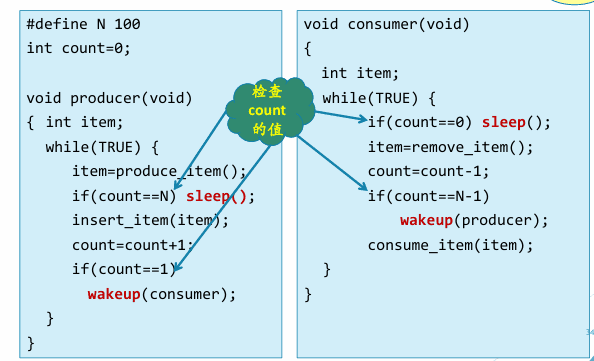

满（空）了睡，由空变不空唤醒

**PV**

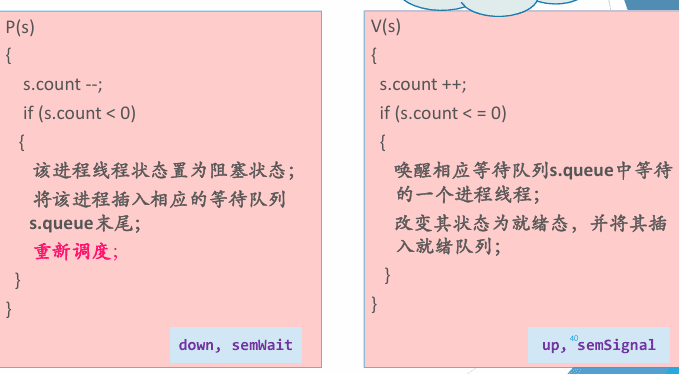

在临界区前实施P(mutex) ，在临界区之后实施V(mutex)

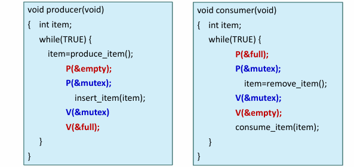

读者优先：

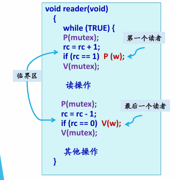

**管程**

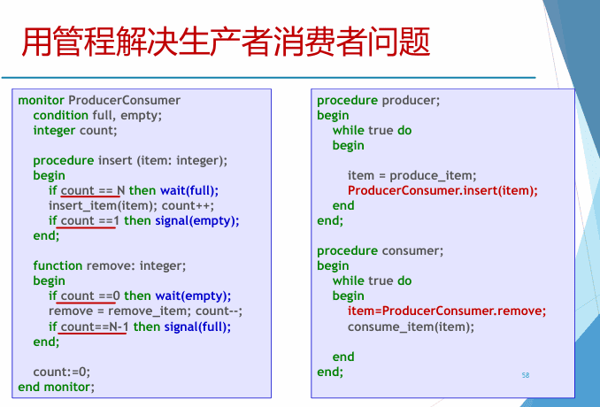

### 死锁

必要条件：

互斥使用(资源独占) 一个资源每次只能给一个进程使用 

占有且等待(请求和保持，部分分配) 一个进程在申请新的资源的同时保持对原有资源的占有 

不可抢占(不可剥夺) 资源申请者不能强行的从资源占有者手中夺取资源，资源只能由 占有者自愿释放 

循环等待 存在一个进程等待队列{P1, P2, … , Pn}，其中P1等待P2占有的资 源，P2等待P3占有的资源，…，Pn等待P1占有的资源，形成一个 进程等待环路

RAG

资源类：方框

进程：圆圈

分配边：资源->进程，申请边反过来

没有环路则无死锁，有环路不一定死锁，要只包含一个资源实例。

化简：删除只有分配边的节点，把分配边对应的资源的申请边改为分配，不断重复

解决死锁

鸵鸟算法：不考虑

不让死锁发生

$\quad$ 死锁预防:静态策略，设计合适的分配算法：破坏必要条件。例子：通过资源有序分配解决哲学家就餐问题

$\quad$ 死锁避免：动态策略，跟踪评估资源分配过程：通过调度避免死锁：安全序列，银行家算法

$\quad$ $\quad$ 1、在固定数量的进程中共享数量固定的资源

$\quad$ $\quad$ 2、每个进程预先指定完成工作所需的最大资源数量 

$\quad$ $\quad$ 3、进程不能申请比系统中可用资源总数还多的资源 

$\quad$ $\quad$ 4、进程等待资源的时间是有限的 

$\quad$ $\quad$ 5、如果系统满足了进程对资源的最大需求，那么进程应该在 有限的时间内使用资源，然后归还给系统

让死锁发生：检测解除

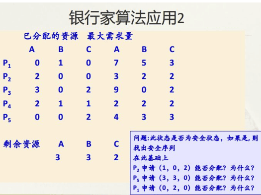