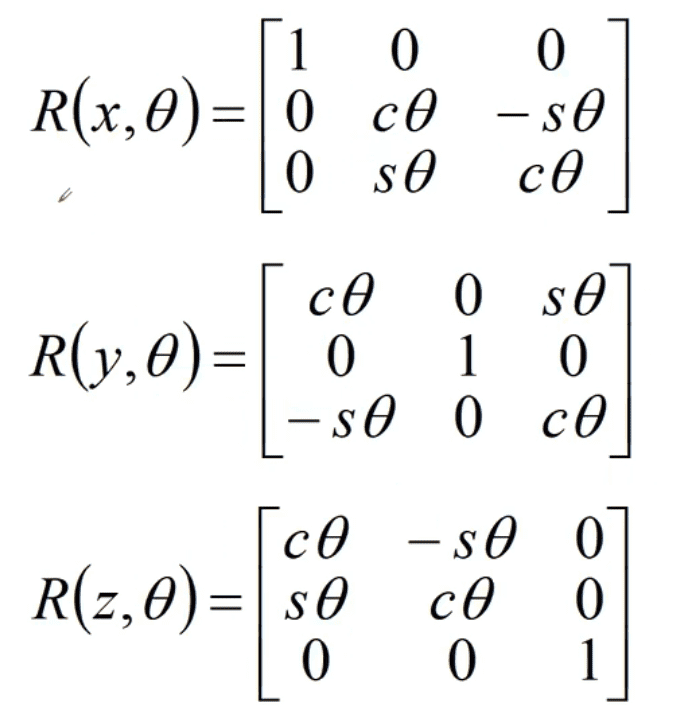
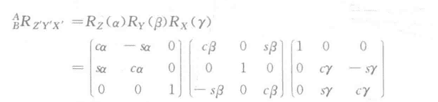
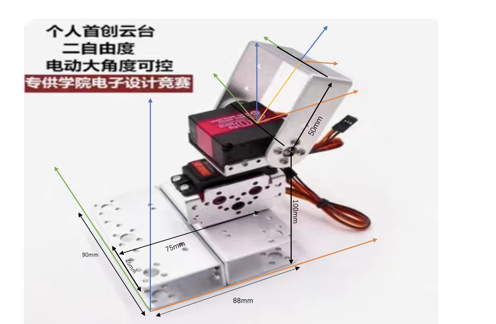
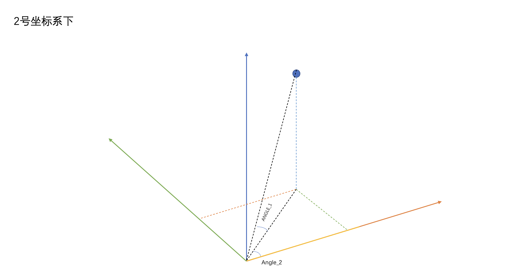

# 机器人学基础
## 空间描述和变换

$\quad$·存在一个世界坐标系,讨论任何问题都是基于这个坐标系
$\quad$·一旦建立了坐标系,我们就能用一个3x1的位置矢量给世界坐标系中的任何点定位
旋转矩阵：

舵机的旋转即为Z-X-Y欧拉角

$\quad$ 首先将坐标系{B}和一个已知参考坐标系{A}重合。先将{B}绕$Z_B$转$\alpha$角度，再
绕$Y_B$旋转$\beta$ 角，最后绕着$X_B$ 旋转y角     

matlab中可以通过rotx()，roty()，rotz()函数计算旋转矩阵

## 实物坐标系建立

代码：
~~~c

%坐标系变换

%R为雷达测出的距离，angle_PSI,angle_THETA为雷达测出的角度

%angle_1，angle_2为舵机目前的角度

%L为舵机1转轴的长度

%P_A=Rotate*（P_B+P） 先平移再旋转

%%

L = 50;

Rotate = rotz(angle_2)*roty(0)*rotx(angle_1);%Z-Y-X欧拉角

P_MOVE1= [0;0;L];

P_B_x = R * cos(angle_PSI) * sin(angle_THETA);

P_B_y = R * cos(angle_PSI) * cos(angle_THETA);

P_B_z = R * sin(angle_PSI);

P_B = [P_B_x;P_B_y;P_B_z];%3号（雷达）坐标系下的坐标

%%

P_A = Rotate * (P_B - P_MOVE1);%得到2号坐标系下的坐标

%%

P_MOVE2=[-45;-75;-100];

P_0 = P_A + P_MOVE2;% 1号坐标系下的坐标

%%

% P_A = ;

angle_2_new = atan(P_A(1)/P_A(2));%舵机2要调整到的角度

temp = sqrt(P_A(1)*P_A(1)+P_A(2)+P_A(2));

angle_1_new = atan(P_A(3)/temp);%舵机1要调整到的角度

disp(angle_1_new);

disp(angle_2_new);

~~~

---
