---

title: 算法设计与分析
publishDate: 2023-03-25 23:15:10
coverImage: {src: '../sfmg/banner.png'}
description: ' 北京大学算法设计与分析课程相关算法'
language: '中文'
tag:
- 算法
  
---

# 引言部分：
  
   算法是有限条指令的序列，算法的时间复杂度是对算法效率的度量
  
   算法的描述：伪代码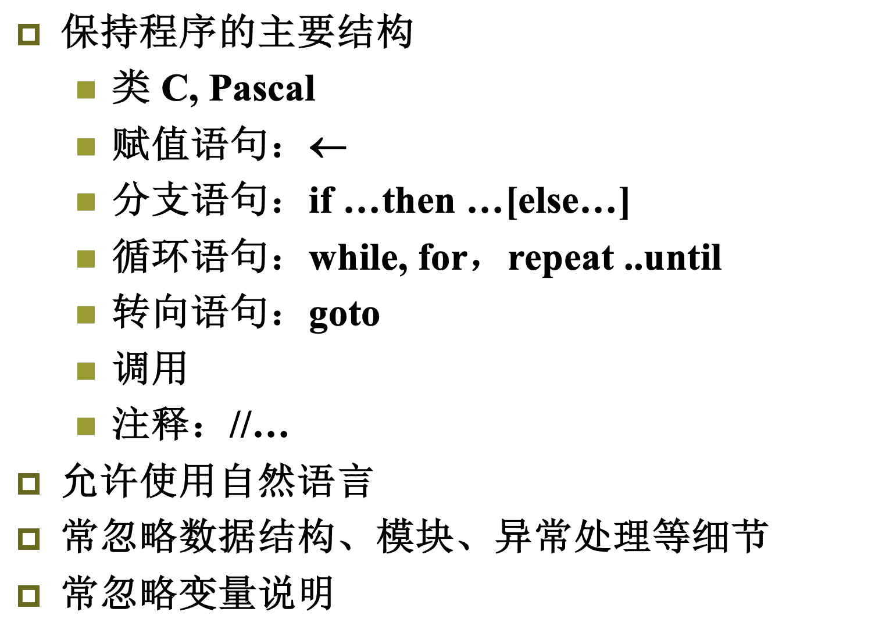
## 算法的数学基础
  
   函数渐进的界：
   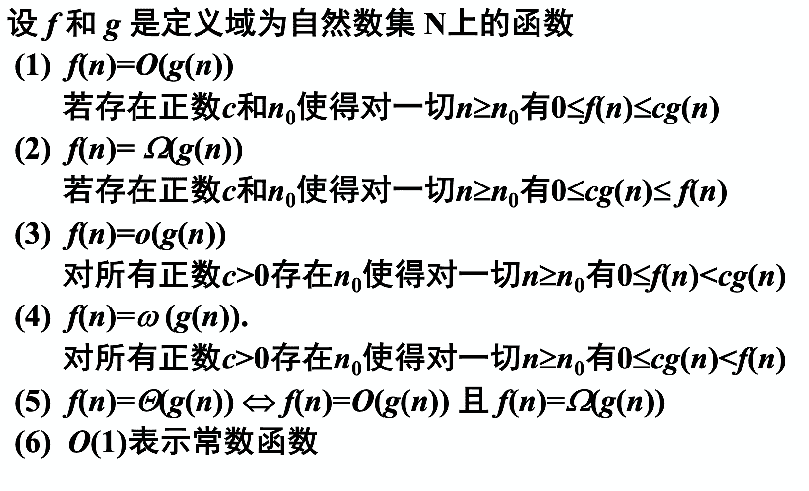
   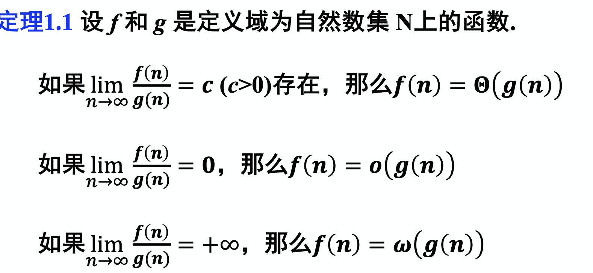
   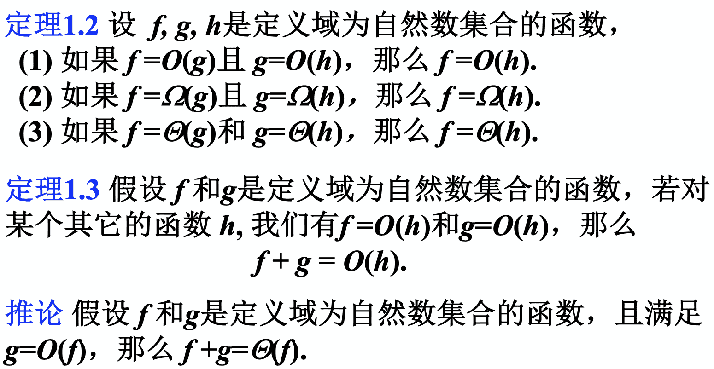
   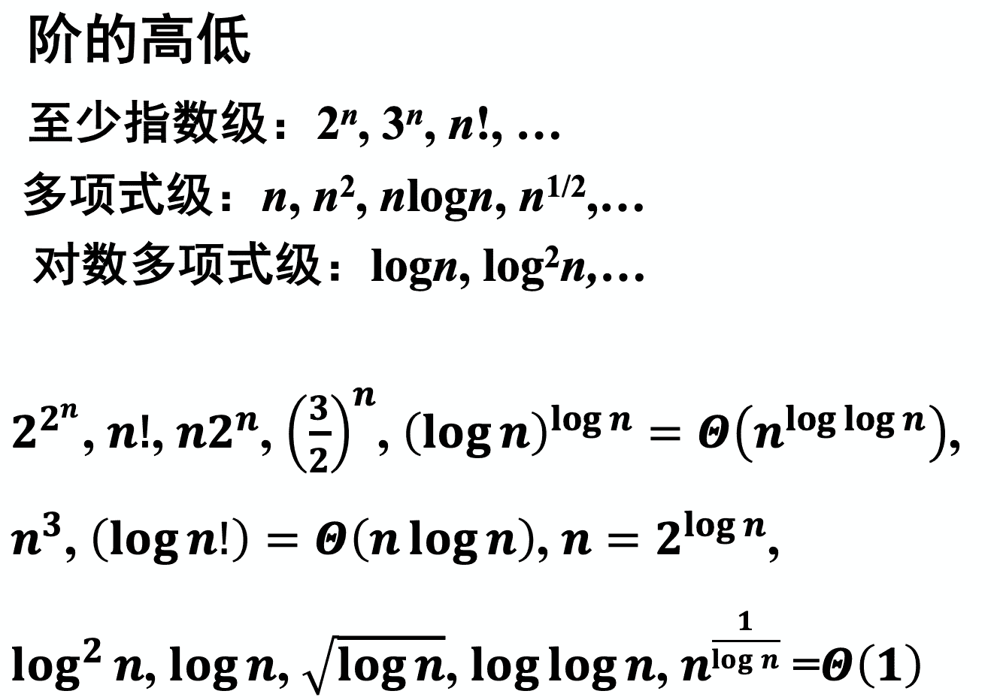
  
   多项式时间的算法：存在多项式p(n)使得算法的时间复杂度为O(p(n))
  
   对数函数：
  
   $log_b n = o(n^\alpha),\alpha > 0$ $a^{log_b n } = n^{log_b a}$  $log_k n = \Theta (log n)$ 
  
   阶乘：
  
   Stirling公式： $n!= \sqrt{2\pi n }(\frac{n}{e})^n(1+\Theta(1/n))$  
  
   $ log(n!) = \Theta(nlogn)$ 
 
 取整函数：
 
 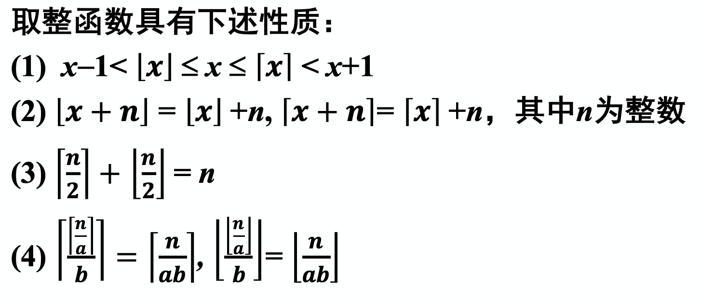
 
 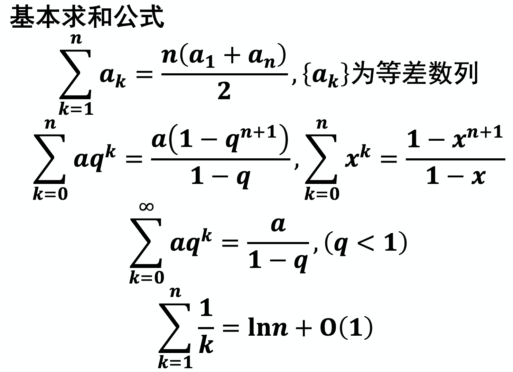
 
 估算和式上界的方法：
 
 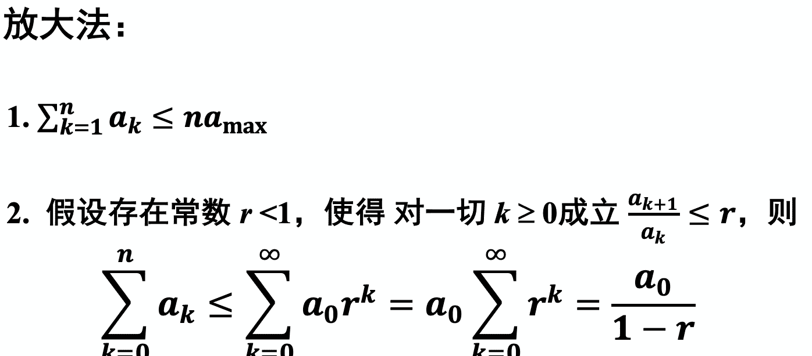

## 递推方程：

$\quad$ 设$序列 a_0,a_1...a_n,...$ 简记为{$a_n$ } ，一个把$a_n与某个a_i$联系起来的等式叫做关于序列的递推方程。

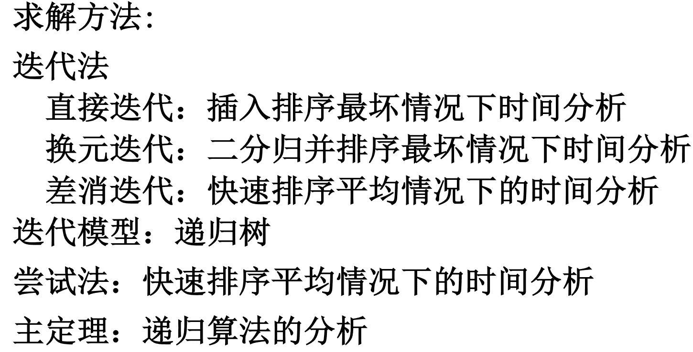   

递归树：

$\quad$ 结点带杈的二叉树，初始的递归树只有一个结点，它的权标记为W(n),然后不断进行迭代，直到树中不再含有权为函数的结点为止。

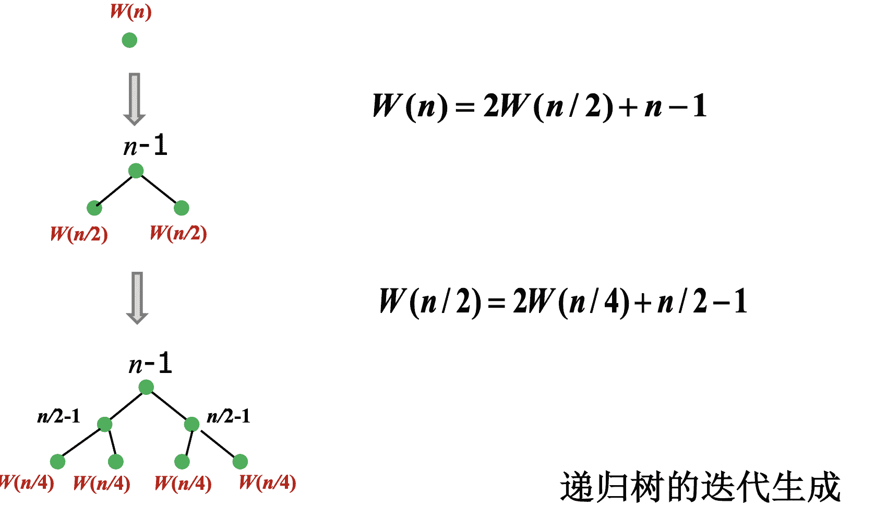

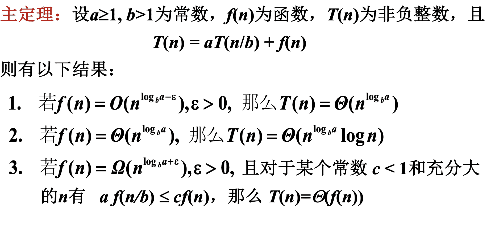

# 算法设计:

## 分治

一般性描述：

> **Divide-and-Conquer(P)**
> 1. if |P| $\leq$ c then S(P)
> 2. divide P into $P_1,P_2···P_k$ 
> 3. for i=1 to k do 
> 4. $\quad$ $y_i$ $\leftarrow$ Divide-and-Conquer( $P_i$ )
> 5. return Merge( $y_1,y_2···y_k$ )
### 1.二分查找
> **BinarySearch(T,x)**
> 输入：排好序的数组T；数x
> 输出：j
> 1. l  $\leftarrow$  1;r $\leftarrow$ n
> 2. while l $\leq$ r do
> 3. $\quad$ m $\leftarrow$ $\lfloor (l+r)/2 \rfloor$ 
> 4. $\quad$ if T[m]=x then return m   // x恰好等于中位元素
> 5. $\quad$ else if T[m]> x then r $\leftarrow$ m-1 
> 6. $\quad$ else l $\leftarrow$ m+1
> 7. return 0
### 2. 芯片测试
> **Test(n)**
> 输入：n片芯片构成的数组，其中好芯片至少比坏芯片多一片
> 输出：1片好芯片
> 1. k $\leftarrow$ n
> 2. while  k>3  do
> 3. $\quad$ 将芯片分成$\lfloor k/2 \rfloor$ 组
> 4. $\quad$ for i=1 to $\lfloor k/2 \rfloor$ do 
> 5.  $\quad$  $\quad$ if 2片好，任取一片留下
> 6.  $\quad$ $\quad$ else 2片同时丢掉
> 7.  $\quad$ k $\leftarrow$ 剩下的芯片数
> 8. if k=3
> 9.  then 任取两片芯片测试
> 10. $\quad$ if  1好1坏，取没测的芯片
> 11.  $\quad$   else  任取一片被测芯片
> 12. if k=2 or 1 then 任取一片芯片
### 3.  平面两点最短距离
> **MinDistance（P,X,Y)**
> 
> 输入：n个点的集合P，X和Y分别给出P中点的横，纵坐标
> 
> 输出：最近的两个点及距离
> 
> 1. 如果P中点数小于等于3，则直接计算其中的最小距离
> 2. 排序X，Y
> 3. 做垂直线l将P近似划分为大小相等的点集 $P_L和P_R$  , $P_L$  的点在l左边，$P_R$ 的点在l右边
> 4. $MinDistance(P_L,X_L,Y_L);\theta _L=P_L中的最小距离$//递归计算左半平面最邻近点对
> 5. $MinDistance(P_R,X_R,Y_R);\theta _R=P_R中的最小距离$//递归计算右半平面最邻近点对
> 6. $\theta \leftarrow min(\theta _L,\theta _R)$ 
> 7. 对于在线l左边距离$\theta$ 范围内的每一个点，检查l右边是否有点与它的距离小于$\theta$ ,如果存在则将$\theta$ 修改为新值
### 4. 快速排序算法
> **Quicksort(A,p,r)**
> 
> 输入：数组A[p..r],1$\leq p \leq r \leq n$ 
> 
> 输出：从A[p]到A[r]按照递增顺序排好序的数组A
> 
> 1. if p < r
> 2. then q $\leftarrow$ Partition(A,p,r) 
> 3.  $\quad$ A[p]$\leftrightarrow$ A[q]
> 4.  $\quad$ Quicksort(A,p,q-1)
> 5.  $\quad$ Quicksort(A,q+1,r)

时间复杂度O（nlogn）
### 5. 选择问题
> **Select(S,k)**
> 
> 输入： n个数的数组S，正整数k
> 
> 输出： S中的第k小元素
> 
> 1. 将S划分成5个一组，共$\lceil n/5 \rceil$ 个组
> 2. 每组找一个中位数，把这些中位数放到集合M中
> 3. $m^* \leftarrow Select(M,\lceil |M|/2 \rceil)$ //选M的中位数，将S中的数划分为A，B，C，D是个部分
> 4. 把A和D中的每个元素与$m^*$ 比较，小的构成$S_1$,大的构成$S_2$ 
> 5. $S_1 \leftarrow S_1 \cup C;S_2 \leftarrow S_2 \cup B;$
> 6. if k= $|S_1|$ +1 then 输出 $m^*$
> 7. else if k $\leq$ $|S_1|$
> 8.  $\quad$ then Select($S_1$,k)
> 9.  $\quad$ else Select($S_2,k-|S_1|-1$)

时间复杂度O(n)

## 动态规划

优化原则： 一个最优决策序列的人任何子序列本身一定是相对于子序列的初始和结束状态的最优决策序列

设计要素：

1. 划分子问题，用参数表述子问题的边界，将问题求解转换为多步判断的过程。

2. 确定优化函数，以函数的极大/极小作为判断的依据，确定是否满足优化原则

3. 列出关于优化函数的递推方程和边界条件

4. 考虑是否需要设计标记函数，以记录划分位置

5. 自底向上计算，以表格存储中间结果

6. 根据表格和标记函数通过追溯给出最优解

### 1. 背包问题
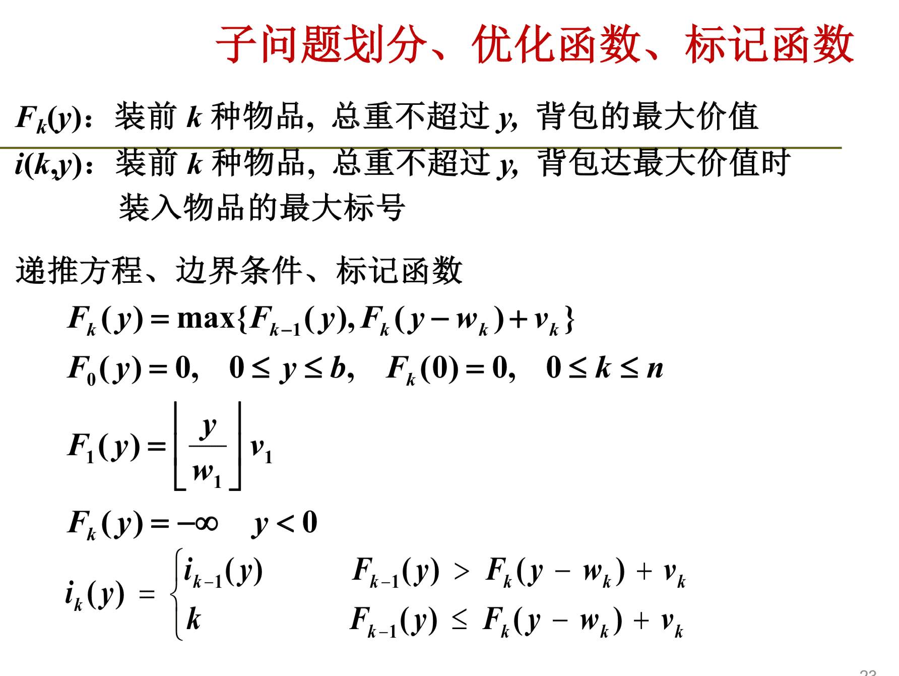

### 2. LCS最长公共子序列
> **LCS(X,Y,m,n)**
> 
> 输入：序列X、Y，其中X[1..m],Y[1..n]
> 
> 输出：最长公共子序列长度C[i,j],标记B[i,j],$1 \leq i \leq m,1 \leq j \leq n$ 
> 
> 1. for i $\leftarrow$ 1 to m do
> 2. $\quad$ C[i,0]$\leftarrow$ 0
> 3. for i $\leftarrow$ 1 to n do 
> 4. $\quad$ C[0,i]$\leftarrow$ 0
> 5. for i $\leftarrow$ 1 to m do
> 6. $\quad$ for j $\leftarrow$ 1 to n do
> 7. $\quad$ $\quad$ if X[i]=Y[j]$\quad$ //X[i]和Y[j]都被选入公共子序列
> 8. $\quad$ $\quad$ then C[i,j]$\leftarrow$ C[i-1,j-1]+1
> 9. $\quad$ $\quad$ $\quad$ $\quad$ B[i,j]$\leftarrow$ "↖️"
> 10. $\quad$ $\quad$ else if C[i-1,j] $\geq$ C[i,j-1]
> 11. $\quad$ $\quad$ $\quad$ then C[i,j]$\leftarrow$ C[i-1,j]
> 12. $\quad$ $\quad$ $\quad$ $\quad$ B[i,j]$\leftarrow$ "⬆️"
> 13. $\quad$ $\quad$ else C[i,j]$\leftarrow$ C[i,j-1]
> 14. $\quad$ $\quad$ $\quad$ $\quad$ B[i,j]$\leftarrow$ "⬅️"

### 3. 整备类问题

F[j]表示1～j天加工任务的最大数目

w[i+1,j]表示在第i天进行检修，从第i+1到第j天连续工作的加工量

## 贪心

贪心法必须进行正确性证明

证明方法：

归纳论证

交换论证：用最优解交换得到有限步骤得到贪心法的解

### 1. 活动选择问题
按截止时间从小到大排序，从前往后挑选，只要相容便加入

> **Greedy Select**
> 
> 输入：活动集S={1,2,···,n},活动i的开始时间$s_i$和截止时间$f_i$
> 
> 输出：A$\subseteq$S,选中的活动子集
> 
> 1. A$\leftarrow$ {1}
> 2. j $\leftarrow$ 1
> 3. for i $\leftarrow$ 2 to n do
> 4. $\quad$ if $s_i \ge f_i$ 
> 5. $\quad$ then A $\leftarrow$ A $\cup$ {i}
> 6. $\quad$ $\quad$ j $\leftarrow$ i
> 7. return A
### 2. 集装箱问题
轻者先装

> **Loading**
> 
> 输入：集装箱集合N，集装箱i的重量$w_i$
> 
> 输出：I $\subseteq$ N，准备装入船的集装箱集合
> 
> 1. 对集装箱重量按从小到大排序
> 2. I $\leftarrow$ {1}
> 3. W $\leftarrow w_1$
> 4. for j $\leftarrow$ 2 to n do
> 5. $\quad$ if W+$w_i \leq$ C
> 6. $\quad$ then W $\leftarrow$ W+$w_i$
> 7. $\quad$ $\quad$     I $\leftarrow$ I $\cup$ {j}
> 8. $\quad$ else return I,W
### 3. 调度问题
> **Schedule**
> 
> 输入：A，T，D //A为等待的客户集合，T为预计对客户的服务时间，D为客户希望的完成时间
> 
> 输出：f
> 
> 1. 排序A使得 $d_1 \leq d_2 \leq ··· d_n$
> 2. f(1) $\leftarrow$ 0
> 3. i $\leftarrow$ 2
> 4. while i $\leq$ n do 
> 5. $\quad$ f(i) $\leftarrow$ f(i-1)+$t_{i-1}$
> 6. $\quad$ i $\leftarrow$ i+1
### 4. 哈夫曼树（最优前缀码问题）

可扩展到k叉树

> **Huffman(C)**
> 
> 输入：C={$x_1,x_2···x_n$}是字符集，每个字符频率f($x_i$)
> 
> 输出：Q
> 
> 1.  n $\leftarrow$ |C|
> 2. Q $\leftarrow$ C
> 3. for i $\leftarrow$ 1 to n-1 do
> 4. $\quad$ z  $\leftarrow$  Allocate-Node()  //生成结点z
> 5. $\quad$ z.left $\leftarrow$ Q中最小元    //左儿子
> 6. $\quad$ z.right $\leftarrow$  Q中最小元.  //右儿子
> 7.  $\quad$ f(z) $\leftarrow$ f(x)+f(y)
>8. $\quad$ Insert(Q,z)     //z插入Q
>9. return Q
### 5. 最小生成树
#### Prim算法
> **Prim**
>
> 输入：连通图G=<V,E,W>
>
> 输出：G的最小生成树T
>
>1. S $\leftarrow$ {1};T=$\emptyset$ 
>2. while V-S $\ne \emptyset$ do
>3. 从V $\rightarrow$ S中选择j使得j到S中顶点的边e的权最小；T $\leftarrow$ T $\cup$ {e}
> 4. S  $\leftarrow$ S$\cup$ {j}
#### Krusal算法
> **Krusal**
> 
> 输入：连通图G=<V，E，W>
> 
> 输出：G的最小生成树
> 
> 1. 按照权从小到大顺序排序G中的边，使得E={$e_1,e_2···e_m$}
> 2. T $\leftarrow \emptyset$
> 3. repeat
> 4. $\quad$ e $\leftarrow$ E中最短边
> 5. $\quad$ if e的两端点不在同一个连通分支
> 6. $\quad$ then T  $\leftarrow$ T$\cup$ {e}
> 7. $\quad$ E $\leftarrow$  E-{e}
> 8. until T 包含了n-1条边
### 6. 单源最短路径
> **Dijkstra**
> 
> 输入：带权有向图<V,E,W>，源点s$\in$ V
> 
> 输出：数组L，对所有j$\in$ V-{s},L[j]表示s到j的最短路径上j前一个结点的标号
> 
>1. S  $\leftarrow$ {s}
>2. dist[s] $\leftarrow$ 0
>3. for i $\in$ V-{s} do 
>4. $\quad$ dist[i] $\leftarrow$ w(s,i)   //如果没边，w为无限
>5. while V-S $\ne \emptyset$ do 
>6. $\quad$ 从V-S中取出具有相对S的最短路径的结点j，k是路径上连接j的结点
>7. $\quad$ S $\leftarrow$  S$\cup$ {j};L[j] $\leftarrow$ k 
>8. $\quad$ for i$\in$ V-S do 
>9. $\quad$ $\quad$ if dist[j]+w(j,i) < dist[j]
>10. $\quad$ $\quad$ then dist[i] $\leftarrow$ dist[j]+w(j,i)   //修改结点i相对S的最短路径长度
### 耗油问题
从起点向终点扫描，一遇到没有油的情况取经过加油站能加油的最大值进行加油

## 回溯

解空间：搜索问题的解所在的集合，又称为搜索空间，通常为树形结构，如排列树，子集树

搜索策略：深度优先，广度优先

多米诺性质：P($x_1,x_2···x_n+1$)为真蕴含P($x_1,x_2···x_n$)为真

代价函数小于界立刻剪枝

0-1类：O($2^n$);

m着色: O($nm^n$);

排列类：O(n!);

## 线性规划
###### 一般形式：
> $min(max) z = \sum^n_{j = 1}c_jx_j$
> s.t. $\sum^n_{j=1}a_{ij}x_j\le(=,\ge)b_i$,i=1,2···m
> $x_j\ge 0$ -非负条件
> $x_j$任意 - 自由变量

$\quad$ 可行解 满足约束条件 和非负条件的变量 

$\quad$ 可行域 全体可行解

$\quad$ 最优解 目标函数值最小(最大)的可行解 

$\quad$ 最优值 最优解的目标函数值

###### 图解法
高中内容
###### 标准形
> min z = $\sum^n_{j = 1}c_jx_j$
> s.t. $\sum^n_{j=1}a_{ij}x_j=b_i$,i=1,2···m
> $x_j \ge 0$

对于不等式引入新的变量构造等式，对于自由变量引入两个新变量

###### 对偶线性规划：
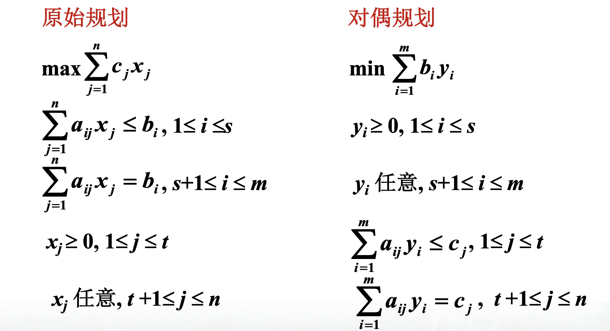

## 网络流:

**FF算法**

O（mC）

**Dinic算法**

O（n^3）

## 近似算法:
 $\quad$ A是一个多项式时间算法且对组合优化问题 Ⅱ 的每一个实例I输出一个可行解 $\sigma$ .记A(I)=c(σ)， c(σ)是σ的值

$\quad$ 性能估计:当II是最小化问题时，记rA(I)=A(I)/OPT(I)；当II是最大化问题时，记rA(2)=OPT(I/A(I)

$\quad$ 最优化算法:恒有A(I)=OPT(I)，即rA(I)=1.

$\quad$ A的近似比为r（A是r-近似算法）：对每一个实例I，rA（I）$\leq$ r

$\quad$ A具有常数近似比：r是一个常数。

$\quad$ 可近似性分类

$\quad$ （1)完全可近似的：对任意小的ε>0，存在(1+ε)-近似：算法背包问题

$\quad$   (2)可近似的：存在具有常数比的近似算法：最小顶点覆盖问题、多机调度问题

$\quad$   (3)不可近似的：不存在具有常数比的近似算法：货郎问题

## 随机算法：

$\quad$ **ZPP**：有效的Las Vegas算法

$\quad$ **BPP**：有效的Monte Carlo算法

$\quad$ **RP**：弃真型单侧错误概率有界算法

$\quad$ **coRP**：取伪型单侧错误概率有界算法

#### Las Vegas 型随机算法

$\quad$ 通过修改确定性算法得到,一般将算法的某步的确定型选择变成随机选择

$\quad$ 一次运行可能得不到解;若得到解,则解一定是正确的

$\quad$ 与确定型算法相结合有可能改进确定型算法平均情况下的时间复杂度

**随机快速排序**

> 算法输入：包含 n 个元素的数组
> 
> 输出:经过排序的n个元素的数组
> 
> 1. 若数组包含0或1个元素则返回
> 2. 从数组中随机选择一个元素作为枢轴元素
> 3. 把数组元素分为三个子数组,并且按照A,B,C顺序排列
> 
>    $\quad$ $\quad$ A:包含比枢轴元素小的元素;B:包含与枢轴元素相等的元素;C:包含比枢轴元素大的元素.
> 4. 对A和C递归地执行上述步骤

**算法RandSelect(A, p,r,k)**  //从A[p..r]中选第k小

> 1. if p= r then return A[p]
> 2. i←Random(p, r)
> 3. 3.以A[i]为标准划分A
> 4. j<划分后小于等于A[i]的数构成数组的大小
> 5. if k$\leq$j
> 6. then return RandSelect (A, p, p+j-1, k)
> 7. return RandSelect (A, p+j, r, k-j)

**算法BoolQueen(n)**

> 1. k$\leftarrow$ 1. // k 放皇后的行号
> 2. count$\leftarrow$ 0  // count 放好的皇后数
> 3. while k$\leq$ n do
> 4. for i←1 to n do //i为待选列号
> 5.   检查i与前面k-1个皇后的相容性
> 6.    如果相容则将i加入S
> 7. ifS $\ne$  $\emptyset$ ，then
> 8.    j←Random(1,S)
> 9.    $x_k \leftarrow S[j]$ 
> 10.    count $\leftarrow$ count+1
> 11.    k$\leftarrow$ k+1
> 12. else k←n + 1
> 13. return count

**算法QueenLV(n)**
>1. p$\leftarrow$ BoolQueen(n)
>2. while p<n ,do
>3.    p$\leftarrow$ BoolQueen(n)

#### Monte Carlo型随机算法

$\quad$ 这种算法有时会给出错误的答案

$\quad$ 运行时间和出错概率都是随机变量

$\quad$ 多项式时间内运行切出错概率不超过1/3的随机算法称为有效的蒙特卡罗型算法

$\quad$ **弃真型单侧错误**：接受一定对，拒绝可能错

$\quad$ **取伪型单侧错误**：拒绝一定对，接受可能错

$\quad$ **双侧错误**：所有输入上同时出现上述两种

$\quad$ **素数检测算法**

> 输入：自然数n
>
> 输出：n是否素数
> 
>1. 若n是偶数且n$\ne$ 2,则宣布n是合数，结束计算
>2. 若n=2，则宣布n是素数，结束计算
>3. 若n=1，则宣布n=1，结束计算
>4. 从{1,……n-1}中随机选择自然数a
>5. 若gcd（n，a）>1（最大公因数）或（a/n）$\ne$ a^{n-1/2}(mod n),则宣布n是合数
>6. 否则，宣布n是素数

# 算法分析

## 平摊分析

$\quad$ 求一系列操作在最坏情况下的时间,不涉及概率

$\quad$ 三种方法:

###### 聚集分析

$\quad$ 暴力得到总运行时间再除以n

###### 记账法

$\quad$ 要求：余额大于0

$\quad$ 实际上就是猜测平摊代价后进行验证

###### 势能法

$\quad$ 要求：最终势能大于0

$\quad$ 和记账法类似

## 问题的计算复杂度
#### 平凡下界：

$\quad$ 问题的输入或输出规模是它的平凡下界

$\quad$ 下界的计算：找最少运算数

#### 决策树：

$\quad$ 以比较作基本运算的算法模型

$\quad$ 一个问题确定了一类决策树，具有相同的构造规则，该决策树类决定了求解该问题的一个算法类

$\quad$ 结点数(或树叶数)等于输入分类的总数

$\quad$ 最坏情况下的时间复杂度对应于决策树的深度

$\quad$ 平均情况下的时间复杂度对应于决策树的平均路径长度

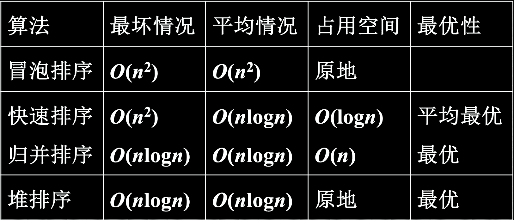
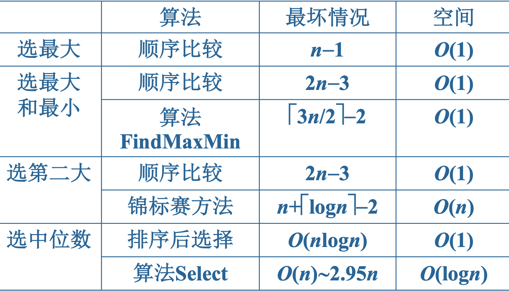
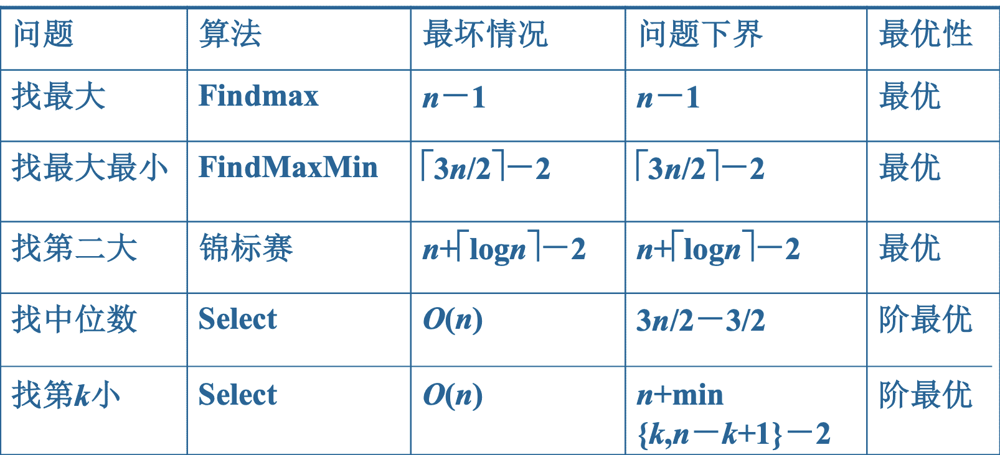

## NP 完全性

**多项式时间算法**：以多项式为时间复杂度

**易解的问题**：有多项式时间算法

**难解的问题**：不存在多项式时间算法

**哈密顿回路（HC）**：任给无向图G，问G有哈密顿回路吗？

**货郎问题（TSP）**：任给n个城市，城市i与城市j之间的正整数距离d（i，j），i$\ne$j,以及正整数D，问有一条每一个城市恰好经过一次最后回到出发点且长度不超过D的巡回路线吗？

#### 组合优化问题

II* 由3部分组成：

(1)实例集$D_{II*}$ 

(2) $\forall I \in D_{II*}$ ，有一个有穷非空集S(I)，其元素称作 I的可行解

(3) $\forall s \in S(I)$,有一个正整数 c(s)，称作s的值

如果s$* \in S(I)$，对所有的 s$\in$ S(I)，当II*是最小（大）化问题时，c(s$*$) $\leq$ c (s)(c(s*) $\leq$ c(s))则称s $*$是I的最优解，c(s*)是 I的最优值，记作OPT(I).

#### II$*$ 对应的判定问题

$D_{II}$={$(I,K)|I \in D_{II*},K \in Z*$}

当II$*$是最小化问题时，Yn={(I,K)|OPT(I)$\leq$K);当П*是最大化问题时，Yn={(I，K)|OPT(I)$\ge$ K).

#### P类与NP类

$\quad$ 所有多项式时间可解的判定问题组成的问题称为P类

$\quad$ 设判定问题II=<D,Y>,如果存在两个输入变量的多项式时间算法A和多项式p，对每一个实例$I\in D,I \in Y$ 当且仅当存在t，｜t｜$\leq$ p(|I|),且A对输入I和t输出“Yes”，则称II是多项式时间可验证的，A是II的多项式时间验证算法，而当I$\in$ Y时，称t是I$\in$ Y的证据。

$\quad$ 由所有多项式时间可验证的判定问题组成的问题称为NP类

$\quad$ **非确定型多项式时间算法:**

$\quad$ $\quad$ (1)对给定的实例 I，首先“猜想”一个 t,|t| $\leq$ p(I)

$\quad$ $\quad$ (2)然后检查t是否是证明I$\in$ Y的证据

$\quad$ $\quad$ (3)猜想和检查可以在多项试时间内完成

$\quad$ $\quad$ (4)当且仅当I$\in$ Y时能够正确地猜想到一个证据t

$\quad$ $\quad$ *注:非确定型多项式时间算法不是真正的算法

$\quad$ P$\subseteq$ NP 

$\quad$ **多项式时间变换**

$\quad$ 定义 设判定问题П1=<D1,Y1>,П2=<D2,Y2>. 如果函数f:D1→D2满足条件：(1)f是多项式时间可计算的；(2)对所有的$I\in D_1,I \in Y_1 \leftrightarrow f(I) \in Y_2$ ;则称f是П1到П2的多项式时间变换.如果存在П1到П2的多项式时间变换,则称П1可多项式时间变换到П2,记作$П1 \leq_p П2$ 

#### NP完全性(NPC）

$\quad$ 定义 :如果对所有的 П'$\in$ NP,П'$\leq_p$ Π,则称 П是NP难的.如果 П 是 NP 难的且 Π$\in$ NP，则称 Π 是 NP完全的.

$\quad$ 定理:如果存在NP难的问题 Π$\in$ P，则P=NP.

$\quad$ 推论 :假设P $\ne$ NP,那么，如果 Π是NP难的，则 Π $\notin$ P.

$\quad$ 定理:如果存在NP难的问题 П' 使得 П'$\leq_p  Π$  则 Π 是NP难的.

$\quad$ 推论:如果 П$\in$ NP并且存在 NP完全问题  Π'使得  Π'$\leq_p$ Π,则 Π是NP完全的.

**$\quad$ 证明NP完全性的“捷径”

$\quad$ (1)证明Π$\in$ NP;

$\quad$ (2)找到一个已知的NP完全问题I'，并证明 Π'$\leq_p$ П.**

$\quad$ 可满足性问题（SAT）：任给一个合取范式F，问F是可满足的吗？

$\quad$ SAT是NP完全的（NPC）

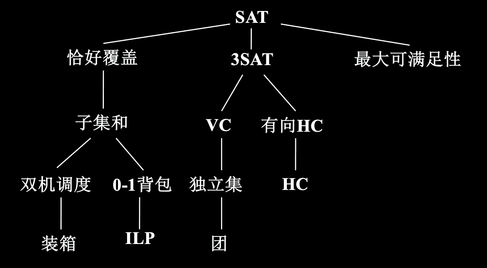

$\quad$ 设无向图G=<V,E>,V'$\subseteq$ V.V'是G的一个

$\quad$ $\quad$ 顶点覆盖：G的每一条边都至少有一个顶点在V'中。

$\quad$ $\quad$ 团：对任意的u,v$\in$ V',且u$\ne$ v,都有(u,v)$\in$ E.

$\quad$ $\quad$ 独立集：对任意的u,v$\in$ V'，都有(u,v)$\notin$ E.

$\quad$ 引理 对任意的无向图G=<V,E>和子集V'$\subseteq$ V,下述命题是等价的

$\quad$ $\quad$ (1) V'是G的顶点覆盖，

$\quad$ $\quad$ (2) V-V ' 是G的独立集;

$\quad$ $\quad$ (3) V-V'是补图 G=<V,E>的团.

$\quad$ 顶点覆盖(VC)： 任给一个无向图G=<V,E>和非负整数K$\leq$ ｜V｜，问G有顶点数不超过K的顶点覆盖吗？

$\quad$ 团：任给一个无向图G=<V,E>和非负整数J$\leq$ ｜V｜，问G有顶点数不小于J的团吗？

$\quad$ 独立集：任给一个无向图G=<V,E>和非负整数J$\leq$ ｜V｜，问G有顶点数不小于J的独立集吗？

$\quad$ 顶点覆盖（VC）是NP完全的

---

