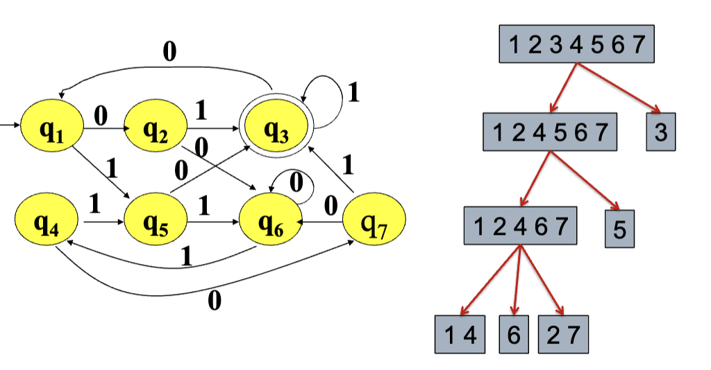

# 编译期中复习

$\quad$ 编译期中的重点在两个方面，分别是**词法分析** 和 **语法分析**

$\quad$ $\quad$ 正则表达式-> NFA -> DFA -> 化简DFA 

$\quad$ $\quad$ 提取左公因子，消除左递归，构造LL(1)分析表(无空串follow，有空串加入follow)

$\quad$ $\quad$ 拓广加入开始并拆开，LR(0)分析表，SLR分析表

$\quad$ $\quad$ LR(1)分析表，LALR(1)分析表

## 词法分析

$\quad$ Token的基本格式为<ID,"a">,<EQ,"=">,诸如此类

### 正则表达式

#### 字母表

$\quad$ 字母表是符号的非空有穷集合。

$\quad$ 比如:

$\quad$ $\quad$ 机器语言字母表：$\Sigma = {0,1}$ 

$\quad$ $\quad$ 字母表： $\Sigma = {A-Z,a-z,0-9}$

#### 符号串

$\quad$ 用字母表中的符号所组成的任意有穷序列

$\quad$ 通常约定：

$\quad$ $\quad$ 用英文字母表比较靠前的小写英文字母表示符号，如$a,b,c,d...$

$\quad$ $\quad$ 用小写希腊字母或字母表中靠后的英文字母表示符号串，如 $\alpha , \beta ,\pi ...$等，其中 $\epsilon$ 常用来表示空串

$\quad$ $\quad$ 用大写英文表示符号串集合

$\quad$ 相关术语

$\quad$ $\quad$ 前缀，后缀，子串，子序列，逆转，长度...

$\quad$ 运算

#### 语言

$\quad$ 符号串集合

$\quad$ 运算

$\quad$ $\quad$ 合并L $\cup$ M，连接 LM，方幂$L^0,L^1...$ 闭包$L^*$，正闭包$L^+$ ...

$\quad$ $\quad$ LM!=ML,$\quad$ {$\epsilon$}M!=M{$\epsilon$}$\quad$ ,{}M = M{}

#### 正则表达式

$\quad$ 定义：空集$\epsilon$是正则表达式,表达的语言$L(\epsilon) =\{ \epsilon \}$ ,字母表中的单字母都是正则表达式，归纳L(r)$\cup$ L(s),L(r)L(s),(L(r))$^*$ ,L(r)均为正则表达式

$\quad$ 实例

$\quad$ $\quad$ C语言标识符：（A|B|C...Z|a|b|...z|_)（A|B|C...Z|a|b|...z|_) | (0|1...|9)$^*$

$\quad$ $\quad$ 有符号整数：（+|-|$\epsilon$)(0|1...|9)(0|1...|9)$^*$

$\quad$ 性质

$\quad$ $\quad$ 都是对于 合并运算 | 和 连接运算，满足交换，结合，分配律
#### 正则定义

$\quad$ $D_1 \rightarrow R_1$

$\quad$ $D_2 \rightarrow R_2$

$\quad$ ...

$\quad$ $D_n \rightarrow R_n$

$\quad$ R为正则表达式，D为名字，R只能出现字母表与之前定义的正则表达式名字

$\quad$ 例：

$\quad$ $\quad$ letter $\rightarrow$ A|B|...Z|a|b...z|_

$\quad$ $\quad$ digit $\rightarrow$ 0|1|...|9

$\quad$ $\quad$ id $\rightarrow$ letter_(letter_| digit)$^*$ 

$\quad$ $\quad$ 中心思想：把问题分解成多个小问题

#### 扩展

$\quad$ $\quad$ 一次或多次出现：+

$\quad$ $\quad$ 0或1次出现： ？

$\quad$ $\quad$ 字符类：【abc】表示a|b|c,【a-z】表示 a|b|...|z

$\quad$ $\quad$ 双引号和转义字符\：取消特殊含义

$\quad$ $\quad$ 补集字符：^

$\quad$ $\quad$ ^匹配行开始，$匹配行结尾

### 状态转换

#### 状态转换图

$\quad$ 状态：在识别词素时可能出现的情况

$\quad$ $\quad$ 看作是已处理部分的总结，接收状态或最终状态表示已找到词素，开始状态用开始边表示

$\quad$ 边：从一个状态指向另一个状态

#### 匹配规则

$\quad$ 先匹配最长可能的串，然后排在前面的正则表达式优先匹配

#### 有限自动机

##### 确定的有限自动机（DFA）

$\quad$ 定义：五元组，包含有限字母表，有限状态集合，开始状态，终止状态集合，以及转换函数（输入为a（$a \in \Sigma$）时从一个状态转到下一个状态 ，可以用转移矩阵表示）

##### 非确定的带有$\epsilon$ 转移的有限自动机（NFA）

$\quad$ 其他定义与DFA一样，但是转移函数δ 是一个从 $Q×(Σ∪{ε})→2^Q$ 的映射（称为转换函数，$2^Q$ 表示 Q 的幂集）

$\quad$ DFA是NFA的一种特例

### 正则表达式到有限自动机

$\quad$ 步骤 正则表达式 -> NFA -> DFA
#### 正则表达式转NFA

$\quad$ 按照r的形式分类讨论

#### NFA转DFA

$\quad$ 子集构造法：

$\quad$ $\epsilon \_ closure(S)$  定义：:从状态集合S中任一状态处罚，仅沿$\epsilon$弧到达的状态集合（包含S自身）称为S的$\epsilon$闭包，记为$\epsilon \_ closure(S)$

$\quad$ DFA中 M'的状态：每个状态是DFA M的状态集合，令$t_0$是M的初始状态，M'的初始状态$d_0= \epsilon \_ closure({t_0})$ ,包含M的任意终态的状态集合都是M'中的终止状态。

$\quad$ DFA M'的转换函数：

$\quad$ $DFAedge(d,a) = \epsilon \_ closure (\cup _{t \in d} edge(t,a))$ 

$\quad$ 例：

#### DFA的最小化

$\quad$ 等价状态：对$DFA M =(\Sigma , Q,q_0 ,F, \sigma )$ 设$p,q \in Q,$ 若对任意$w \in \Sigma^*, \sigma (p,w) \in F$当且仅当 $\sigma (q,w) \in F$,则称p和q是等价状态

$\quad$ 思路：找出等价的状态并合并它们

$\quad$ 等价态的判定条件：

$\quad$ $\quad$ 一致性条件：p和q必须同时为接收态，或者同时为非接收态

$\quad$ $\quad$ 蔓延性条件：对任意符号$a \in \Sigma, \sigma (p,a) = r, \sigma (q,a)=s$, r和s必须等价 ，反过来，r和s不等价，则p和q不等价

##### 等价类的划分方法

$\quad$ 1. 把所有状态分为两个组：接受状态组和非接受状态组

$\quad$ 2. 任意选定一个输入符号a，判断每个组中的各个状态对于a的转换，如果落入不同的组中则进行分割

$\quad$ 3. 重复2，直到每个组中状态等价

$\quad$ 例：

## 语法分析

$\quad$ 处理token序列，构造语法分析树

$\quad$ 根据文法规则，从源程序单词符号串中识别出语法成分，并进行语法检查

$\quad$  **基本任务**：识别符号串 SS 是否为某个合法的语法单元

$\quad$ 种类：通用，自顶向下，自底向上

### 文法

$\quad$ 定义：$G = ( V_T,V_N,S,P )$,其中,

$\quad$ $V_T$ 是非空有穷的终结符号集合

$\quad$ $V_N$是一个非空有穷的非终结符号集合，$V_N \cap V_T = \emptyset$ 

$\quad$ P = { $\alpha \rightarrow \beta | \alpha \in (V_T \cup V_N)^*$ 且至少包含一个非终结符$\beta \in (V_T \cup V_N)^*$},称为产生式集合

$\quad$ $S \in V_N$ 称为开始符号，必须在某个产生式的左部至少出现一次

#### 上下文无关文法

$\quad$ CFG：

$\quad$ 所有产生式的左边只有一个非终结符号，即产生式的形式为$A \rightarrow \beta$ ,因此不需要任何上下文就可以对A进行推导。

####  关于文法的约定

$\quad$ 通常不用将文法的四元组显式地表示出来，而只需要将产生式写出，一般约定

$\quad$ 大写字母表示非终结符，小写字母表示终结符

$\quad$ 第一条产生式地左部是开始符号

$\quad$ 用尖括号括起来的是非终结符，否则是终结符

$\quad$ 例子

### 推导/归约

#### 直接推导/归约

$\quad$ **直接推导/ 直接归约**：若某个串 α 可以根据某条文法一步化为串 β，则称：

$\quad$ $\alpha$ 可以直接推导出$\beta$

$\quad$ $\beta$ 可以直接归约到$\alpha$ 

$\quad$ 定义 令$G = ( V_T,V_N,S,P )$ ，若$\alpha \rightarrow \beta \in P$,且$\gamma , \sigma \in (V_T \cup V_N)^*$ ,则称$\gamma \alpha \sigma$ 直接推导出$\gamma \beta \sigma$ 

$\quad$ 拓展定义$α_0 ​⇒ ^∗α_n$ 为：

$\quad$ $\quad$ 要么$α_0​=α_n​$（直接就是）

$\quad$ $\quad$ 要么$α_0⇒^+α_n$（经过几次推导）

$\quad$ $\quad$ 这里类似正则表达式，在正则表达式中：`+` 代表一次或者多次匹配`*` 代表零次或者多次匹配

##### 最左推导与最右推导

 $\quad$ **最左推导**：若$ \alpha A \beta ⇒_{lm} \alpha \gamma \beta， \alpha \in V_T​$，即 **α 是一个由终结符组成的字符串**。
 
$\quad$  **最右推导**：若$ \alpha A \beta ⇒_{rm} \alpha \gamma \beta， \beta \in V_T​$，即 **β 是一个由终结符组成的字符串**。

$\quad$ **最左推导每次替换最左边的非终结符，而最右推导每次替换最右边的非终结符。**

#### 句子/句型/语言

$\quad$  句型：如果S ⇒ $^* \alpha$ ,那么$\alpha$是文法的句型.可能包含非终结符和终结符，也可以是空串

 $\quad$  句子：不包含非终结符的句型

$\quad$  语言：所有句子的集合，记为L(G)

##### 证明文法生成的语言：

$\quad$ 1. 证明L(G)$\subseteq$ L文法生成的任意句子都属于语言L

$\quad$ 2. 证明L$\subseteq$ L(G)语言的任意句子都可以用文法G生成

$\quad$ 3. 一般可以使用数学归纳法L$\subseteq$ L(G)按符号化才能长度构造，L(G)$\subseteq$ L按照序列长度归纳。

#### 语法分析树

$\quad$ 推导的一种图形表现

$\quad$ 根节点：文法的开始符号S

$\quad$ 叶子节点：非终结符，终结符或者  ε

$\quad$ 内部节点：非终结符，每个内部节点往下推，表示某个产生式的一次应用，内部节点的标签为产生式左部，该节点的子节点对应产生式右部

$\quad$ 例子

#### 二义性

$\quad$ 如果一个文法中存在某个句子有两棵分析树, 那么该句子是二义性的。如果一个文法产生二义性的句子, 则称这个 文法是二义性的。

$\quad$ 二义性的消除方法没有规律可循

### 自顶向下的语法分析

#### 消除文法中的左递归

$\quad$ 文法左递归：  $A⇒^+ A \alpha$ 

$\quad$ **直接左递归**：经过一次推导就可以看出文法存在左递归，如$A \rightarrow A\alpha | \beta$ 

$\quad$ $\quad$ 消除直接左递归（变换成右递归）：将原始规则 $A \rightarrow A\alpha | \beta$ 转换为 $A \rightarrow \beta A' ; A' \rightarrow \alpha A' | \epsilon$ 

$\quad$ **间接左递归**：多次推导才可以看出文法存在左递归，如 $S \rightarrow A a|b ;A \rightarrow S d| \epsilon$  

$\quad$ $\quad$ 消除间接左递归:1. 先转换成直接左递归：$S \rightarrow A a|b ;A \rightarrow S d| \epsilon$   转换为$S \rightarrow A a|b ;A \rightarrow Aad|bd| \epsilon$  ,再消除左递归$S \rightarrow A a|b ; A \rightarrow bdA'| A' ;A' \rightarrow ad A' | \epsilon$   
$\quad$ 消除所有左递归的算法

$\quad$ $\quad$ 1. 将文法G的非终结符顺序整理为$A_1,A_2,...A_n$ 

$\quad$ $\quad$ 2. 逐步消除间接左递归：

$\quad$ $\quad$ $\quad$ 对每个i从1到n，对于每个j从1到i-1，将形如$A_i \rightarrow A_jr$的规则替换为 $A_i \rightarrow \sigma_1 r | \sigma_2 r... | \sigma_k r$ ,$A_j \rightarrow \sigma_1 | \sigma_2 ... \sigma_k$ 是当前$A_j$的所有产生式。最后，消除所有直接左递归

$\quad$ $\quad$ 3.化简得到的文法

#### 预测分析法

$\quad$ 试图从开始符号推导出输入符号串

$\quad$ 以开始符号S作为初始的当前句型

$\quad$ 每次为最左边的非终结符号选择适当的产生式

$\quad$ $\quad$ 通过查看下一个输入符号来选择这个产生式

$\quad$ $\quad$ 有多个可能的产生式时预测分析法无能为力

$\quad$ 问题：当两个产生式具有相同的前缀时无法预测

$\quad$ 文法： stmt→∣​if expr then stmt else stmt  | if expr then stmt

​$\quad$ 处理方法：提取左公因子

$\quad$ 新文法：stmt→​if expr then stmt elsePart    elsePart→else stmt ∣ ε​

##### 提取左公因子

$\quad$ 含有左公因子的文法： $A \rightarrow \alpha \beta_1 | \alpha \beta_2$

$\quad$ 提取左公因子：$A \rightarrow \alpha A'；A' \rightarrow \beta_1 | \beta_2$ 

#### 自顶向下的语法分析

$\quad$ 自顶向下的语法分析时从文法的开始符号出发，试构造出一个最左推导，从左到右匹配输入的单词串

$\quad$ 步骤：

$\quad$ 1. 推导替换：当前被替换的非终结符号为A，当前从左至右读到的单词符号为a

$\quad$ 2. 匹配产生式：如果A的产生式为$A \rightarrow \alpha_1 | \alpha_2 ...| \alpha_n$ ，其中只有$\alpha _i$ 推导出的第一个终结符号为a，则选择产生式$A \rightarrow \alpha_i$构造最左推导

$\quad$ 3. 策略：用$\alpha_i$ 替换A，进行预测分析，如果匹配失败，则进行回溯尝试

$\quad$ 例子：

$\quad$ 特点：

$\quad$ $\quad$ 带预测的，通过试探和回溯来构造句子结构，保证最左推导

##### 如何保证没有回溯

$\quad$ 在自顶向下的分析技术中，通常使用向前看几个符号来唯一地确定产生式（这里只假定只看一个符号）。

$\quad$ 假设当前句型是$x A \beta$ ,而输入是xa，那么选择产生式$A \rightarrow \alpha$ 的必要条件是1.α⇒∗ε 且 β 以 a 开头；（可以用更强的条件替代：在某个句型中 a 跟在 A 之后）2.α ⇒ * a…；

$\quad$ 如果按照这两个条件选择时能够保证唯一性， 那么我们就可以避免回溯。

#### First 和 Follow

##### First集合

$\quad$ **First**：可以从某个符号串 α 推导出的串的首符号（终结符）的集合。

$\quad$ $First(\alpha) =\{ a | \alpha \rightarrow a..., a \in V_T \}$  

$\quad$ 特别地，如果 α⇒∗ε，即 α 可以推导出空串 ε，那么我们规定 ε∈First(α)

$\quad$ 简单来说，First 集合包含了 α 能够推导出的所有串的第一个终结符。

###### 计算First集合

$\quad$ 计算单个符号 X 的 First 集合：

$\quad$ $\quad$ 终结符：如果 X 是终结符，那么 First(X)={X}

$\quad$ $\quad$ 非终结符：

$\quad$ $\quad$ $\quad$ $X \rightarrow Y_1Y_2...Y_k$是产生式,

$\quad$ $\quad$ $\quad$ $\quad$ 如果某个 a 在 First(Yi)中，并且 ε 在 $First(Y_1),⋯ ,First(Y_{i−1})$中，那么 a 也在 First(X)中。(如果 ε 在这些 First(Yi) 中，那么就意味着 Yi​⇒∗ε，也就可以忽略前面的,一顺由ε推过来)

$\quad$ $\quad$ $\quad$ $\quad$ 如果 ε 在 $First(Y_1),First(Y_2),⋯ ,First(Y_k)$ 中，那么 ε 也在 First(X)) 中。(理解：所有的子部分都可以推出空串，那么 X 也可以推出空串。)

$\quad$ $\quad$ $\quad$ 如果 X 是非终结符，并且 X→ε 是一个产生式，那么 ε 在 First(X) 中。
$\quad$ $\quad$ 
$\quad$ 计算产生式右部 X1X2⋯XnX1​X2​⋯Xn​ 的 First 集合

$\quad$ $\quad$ 向集合中加入 First(X1)中所有非 ε 的符号。

$\quad$ $\quad$ 如果 ε 在 First(X1) 中，再加入 First(X2​) 中的所有非 ε 的符号；

$\quad$ $\quad$ 依次类推，直到所有 Xi​ 被处理完。

$\quad$ $\quad$ 如果 ε 在所有的 First(Xi​) 中，则将 ε 加入 First(X1​X2​⋯Xn​) 中。

##### Follow集合

$\quad$ **Follow**：可能在某些句型中紧跟在非终结符 A 右边的终结符的集合。

$\quad$ $Follow(A) =\{ a | S ⇒^* Aa..., a \in V_T \}$  ,S为开始符号

$\quad$ 简单来说，Follow 集合包含了在某些推导过程中可能出现在 A 右边的终结符。

$\quad$ 如果 A 是某个句型的最右符号时，那么 结束标记$也属于 Follow(A)。
###### 计算Follow集合

$\quad$ 1.将右端结束标记 $ 放到 Follow(S)中。

$\quad$ 2.不间断迭代以下规则，直到所有的 Follow 集合都不再增长为止：

$\quad$ $\quad$ 如果存在产生式 A→αBβ，那么 First(β) 中所有非 ε 的符号都在 Follow(B)中。
（此时即存在式子可以推导出 Bx...,x∈First(β)）

$\quad$ 如果存在产生式 A→αB，或者 A→αBβ 且 First(β)包含 ε，那么 Follow(A) 中的所有符号都加入到 Follow(B) 中。（此时即  Follow(A)⊂Follow(B)，因为对于每个 A 出现的式子，我们都可以执行这个替换，从而使得原本接在 A 后面的字符接到 B 后面。）

#### LL（1） 文法

$\quad$ 对于文法中任意两个不同的产生式$A \rightarrow \alpha | \beta$ 

$\quad$ $\quad$ 不存在终结符号 a 使得 α 和 β 都可以推导出以 a 开头的串。

 $\quad$ $\quad$ α 和 β 最多只有一个可以推导出空串。

$\quad$ $\quad$ 如果 β 可以推导出空串，那么 α 不能推导出以 Follow(A) 中任何终结符号开头的串。理解：(如果可以，那么产生了二义性：对于 A 推导为 β，然后再推导得到空串，接着后接 Follow(A)中的字符;对于 A 推导为 α，然后再推导得到 Follow(A)中的字符)

$\quad$ 注：这里不一定只有 α 和 β 两个产生式，而是所有可能的产生式，这里只是简写了。

$\quad$ 等价于
$\quad$ $\quad$ $First(α) \cap First(β)=Φ$ ;（条件1、2） 如果ε∈First(β)，那么$First (α) \cap Follow(A)=Φ$； 反之亦然。（条件3）

$\quad$ 说明：LL(1)中的第一个“L”表示从左到右扫描输入，第二个“L”表示生成一个最左推导，“1”表示为做出分析动作的决定，每一步只需向前看1 个符号，输入串以\$ 为结束标记。这相当于对文法作扩充， 即增加产生式S’→S   \$。所以Follow(S)一定包含 \$

$\quad$ 判别：计算First和Follow集合，

#### 预测分析表的构造方法

$\quad$ 输入： 文法G

$\quad$ 输出： 预测分析表 M

$\quad$ 方法：

$\quad$ $\quad$ 对于文法G的每个产生式 $A \rightarrow \alpha$ 

$\quad$ $\quad$ $\quad$ 对于$First(\alpha)$ 中的每一个终结符号a，将 $A \rightarrow \alpha$ 加入到M[A,a]中；

$\quad$ $\quad$ $\quad$ 如果$\epsilon 在 First (\alpha)$ 中，那么对于Follow(A)中的每个符号b，将 $A \rightarrow \alpha$  加入到M[A,b]中；

$\quad$ $\quad$ 最后在所有空白条目中填入error

$\quad$ 例子

#### 非LL(1)文法

$\quad$ 二义性文法肯定不是LL(1)文法，例如

$\quad$ 某些非二义性文法如左递归文法不是LL(1)文法，也不适合自顶向下分析

### 自底向上的语法分析

$\quad$ 为一个输入串构造语法分析树的过程

$\quad$ 从叶子（输入串中的终结符号，将位于分析树 的底端）开始，向上到达根结点 

$\quad$ 可以看作从串w归约为文法开始符号S的过程

$\quad$ $\quad$ 归约步骤：一个与某产生式右部相匹配的特定子串被替换为该产生式左部的非终结符号

$\quad$ 对输入从左到右扫描，并进行自底向上语法分 析，实际上可以反向构造出一个最右推导
#### 句柄

$\quad$ 最右句型中和某个产生式右部匹配的子串，对它的 归约代表了该最右句型的最右推导的最后一步

$\quad$ 和某个产生式体匹配的最左子串不一定是句柄（ **需要归约后能回到开始符号** ）。

$\quad$ 例子：

#### 移进-归约分析

$\quad$ 移入 - 归约语法分析是一种 自底向上的语法分析技术，主要操作包括 移入和 归约。

##### 主要操作

$\quad$ **移入（shift）**：将下一个输入符号移到栈的顶部

$\quad$  **归约（reduce）**：将栈顶符号串（右部）替换为相应的产生式左部

$\quad$  **接受（accept）**：语法分析成功完成

$\quad$  **报错（error）**：发现语法错误，并调用错误恢复工具

##### 分析过程

$\quad$  开始时刻：栈中只包含\$，而输入为 w \$

$\quad$  成功结束时刻：栈中\$S，而输入\$  

$\quad$  在分析过程中，不断地移进符号，并在识别到句柄时进行归约

$\quad$  句柄被识别时总是 出现在栈的顶部

##### 移进-规约分析中的冲突

$\quad$  有时候，即使知道了栈中所有内容、以及下 面k个输入符号，仍然无法知道是否该进行 归约，或者不知道按照什么产生式进行归约

$\quad$  分别对应两种冲突情形： “移进-归约”冲突 和“归约-归约”冲突

$\quad$ 移进-归约”冲突的例子：  考虑以下文法：E→E+E | id, 假设当前状态是：栈：E 剩余输入：+id,在这种情况下，分析器可以选择： 将 + 移入栈中。也可以根据 E→id,将 E 归约为 d。

$\quad$ “归约-归约”冲突：考虑以下文法：S→A,S→B, A→a,B→a假设当前状态是：栈：a剩余输入：空在这种情况下，分析器可以选择：根据 A→a 进行归约，根据 B→a 进行归约.

#### LR分析

$\quad$ L 指的是从左向右扫描输入符号串 

$\quad$ R 指的是构造最右推导的逆过程（即规范归约）

$\quad$ k 指的是决定动作时向前看的符号个数，通常取0或1
##### LR (0) 项

$\quad$ **项**：一些状态，这些状态表示了语法分析过程中所处的位置。

$\quad$ 一个文法 GG 的一个 **LR (0) 项** 是 GG 的一个产生式再加上一个位于它的右侧某处的点。

$\quad$ 举例：
$\quad$ A→XYZ
$\quad$  A→⋅XYZ
$\quad$ A→X⋅YZ
$\quad$ A→XY⋅Z
$\quad$ A→XYZ⋅

$\quad$ 这里，**⋅ 标记了当前读到的位置，⋅ 左边是已经读到的，⋅ 右边是尚未读到的。**

$\quad$ 项表明了语法分析过程的给定点，我们已经看到一个产生式的哪些部分。

$\quad$ 比如，A→X⋅YZ 表明当前已经读到了 X，期望接下来在输入中看到一个从 YZ 推导得到的串（从而可以规约回 YZ，再读入 YZ 后即可规约回 A）。

$\quad$ LR (0) 项可分为四类：

$\quad$ $\quad$ **移进项**：A→α⋅aβ,a∈VT，表示当前可以读取符号 a 并进行移入操作

$\quad$ $\quad$ **待归约项**：A→α⋅Bβ,B∈VN，表示当前需要继续其他操作后（至少还要把 B 给规约出来），才可以归约到 A

$\quad$ $\quad$ **归约项**：A→α⋅，表示当前可以进行规约操作（已经把一个产生式体完全读入了），即将 α 规约为 A

$\quad$ $\quad$ **接受项**：S′→S⋅

$\quad$ 对于产生式 A→ε 的唯一一项是 A→⋅，它是归约项。

$\quad$ **项集**：这些项的列表

##### 规范 LR (0) 项集族的构造

$\quad$ 为了构造一个文法的规范 LR (0) 项集族，我们定义了一个 **增广文法**和两个函数：**Closure**(I)（对应于DFA化算法的ε-CLOSURE） 和 **Goto**(I,X)（对应于DFA化算法的转换边）。

$\quad$ 增广文法

$\quad$ $\quad$ 如果 G 是一个以 S 为开始符号的文法，那么 G 的增广文法 G′ 就是在 G 中加上新开始符号 S′和产生式 S′→S而得到的文法。

$\quad$ $\quad$ 当且仅当语法分析器要使用规则 S′→S 进行归约时（即 S′→S⋅），输入符号串被接受（即表明已经完全规约回到了原开始符号）。

$\quad$ $\quad$ 引入这个新的开始产生式的目的是使得文法开始符号（S′）仅出现在一个产生式的左边，**从而使得分析器只有一个接受状态**。

> 补充：其实就是I0包含所有·在最左边的，然后依次按照·要经过的来分，如果右边是非终结符则把所有的列出来，其实是先得到dfa再得到项集，然后依次把边填入表中，有边填S，无边填r，最后找到结束符处填acc

###### 计算closure

$\quad$ 开始，将 I 中的各个项加入到 Closure(I) 中。

$\quad$ 如果 A→α⋅Bβ在 Closure(I) 中，B→γ 是一个产生式，并且项 B→⋅γ 不在 Closure(I) 中，就将这个项加入其中。不断应用这个规则，直到没有新项可以加入到 Closure(I)为止。

###### Goto函数

$\quad$ Goto 函数形式为 Goto(I,X)其中：

$\quad$ $\quad$  I 是一个项集

$\quad$ $\quad$ X 是一个文法符号

$\quad$ Goto(I,X) 被定义为 I 中所有形如 【A→α⋅Xβ】的项所对应的项【A→αX⋅β】 的集合的闭包，即：Goto(I,X)=Closure({【A→αX⋅β】∣【A→α⋅Xβ】∈I})

直观地讲，Goto 函数用于定义一个文法的 LR (0) 自动机中的移入单个符号（ **终结符号或者非终结符号都可以** ）的步骤，也即一类 **状态转换**。

##### LR自动机的构造

$\quad$ 规范LR(0)项集族中的项集可以作为LR(0)自动 机的状态 

$\quad$ GOTO(I,X)=J，则从I到J有一个标号为X的转换 

$\quad$ 初始状态为CLOSURE({S’→•S})对应的项集 

$\quad$ 接受状态：包含形如A→α • 的项集对应的状态

##### LR语法分析表

$\quad$ 语法分析表由两个部分组成： 一个语法分析动作函数 Action和一个转换函数 Goto

###### Action 表

$\quad$ Action 函数有两个参数：

$\quad$ $\quad$ 状态 i

$\quad$ $\quad$ 终结符号 a（或者是输入结束标记 \$）。

$\quad$ Action【i,a】的取值可以有下列四种形式：

$\quad$ $\quad$ **移入（Goto） Sj**：j 表示一个状态，Sj 表示移进（Shift）到 j。语法分析器的动作是将输入符号 a 移入栈中，使用状态 j 来代表 a

$\quad$ $\quad$ **归约（Reduce） rj​**：产生式 j=A→β语法分析器将栈顶的 β 根据这个产生式归约为产生式头 A

$\quad$ $\quad$ **接受（Accept）**：语法分析器接受输入并完成语法分析过程

$\quad$ $\quad$  **报错（Error）**：语法分析器在输入中发现错误并执行某个纠正动作

###### Goto 表

$\quad$ 我们把定义在项集上的 Goto 函数扩展为定义在状态集上的函数：如果 Goto【Ii,A】=Ij那么 Goto 把状态 i 和一个非终结符号 A 映射到状态 j。

比如，对文法

假设输入字符串为id+id\*id

##### SLR(simple LR)分析表

$\quad$ 依据 Follow集来选择是否进行归约。

$\quad$ 如果按照上面的步骤填写的分析表中没有冲 突（即每个单元格中只包含一个动作），那么得到的就是合法的SLR分析表

> 其他同LR(0),但是r处先别写，求follow集，在E的follow集里填r

##### LR(1)

$\quad$ 构造有效 LR (1) 项集族的方法实质上和构造规范 LR (0) 项集族的方法相同。

>
> 构建I0时
> 区别在于多了向前开始符。
> 首先要对拓广的开始符的follow集加入结束符
> A = α⋅Bβ,a 如果为空，照抄上面的,不为空加入first（β）
> 新式子的向前搜索符重新算
> r只给向前搜索符中的填
>

###### LR(1)有效项

###### Closure

$\quad$ 设 I 是 G 的一个 LR (1) 项集，Closure(I) 是从 I 出发用以下三条规则构造的项集：

 $\quad$ 每一个 I 中的项都属于 Closure(I)。
 
$\quad$ 若项 【A→α⋅Bβ,a】 属于 Closure(I)且 B→γ∈P则对任何 b∈First(βa)，把 【B→⋅γ,b】 加到 Closure(I) 中。

$\quad$ 重复执行 (2) 直到 Closure(I)不再增大为止。

###### Goto

$\quad$ 设 I 是 G 的一个 LR (1) 项集，X 是一个文法符号，定义：Goto(I,X)=Closure(J)。其中 J={【A→αX⋅β,a】∣【A→α⋅Xβ,a】∈I}

###### 构造LR(1)分析表

$\quad$ **DFA 状态对应分析表行**：

$\quad$ $\quad$ DFA 中的每个状态对应分析表中的一行。

$\quad$ **DFA 状态转移**：

$\quad$ $\quad$ 对于 DFA 中的每一个从状态 i 到状态 j 的转移：

$\quad$ $\quad$ $\quad$ 如果转移符号为终结符 a：在表项 M【i,a】中填写 **移进动作 Sj​**

$\quad$ $\quad$ $\quad$ 如果转移符号为非终结符 A：在表项 M【i,A】中填写 **转移到状态 jj**

$\quad$ **包含归约项 【A→α⋅,a】的状态 i**：

$\quad$ $\quad$ $\quad$ 在表项 M【i,a】中填写归约动作 rk，其中 k 是产生式 A→α的编号

$\quad$ 注意：**如果每个单元格中只包含一个动作，则分析表合法**

$\quad$ 举例：

##### LALR(1)

$\quad$ 合并同心集（合并搜索符串）后构造出的 LR 分析表。

$\quad$ 合并同心项集不会产生移进 / 归约冲突，但是有可能产生归约 / 归约冲突。

    
>合并表达式相同，向前搜索符不同的项集
    

###### 高效构造

$\quad$ 通过先构造 LR (1) 分析表再合并得到 LALR (1) 分析表的过程太慢了。

$\quad$ **内核项表示**：

$\quad$ $\quad$ 使用内核项表示 LR (0) 或 LR (1) 项集。

$\quad$ $\quad$ 内核项：【S′→⋅S】或 【S′→⋅S,\$】，以及 ⋅⋅ 不在最左边的项（这些项代表对于已经读入的符号完全没有要求）。

$\quad$ **传播和自发生成**：

$\quad$ 通过传播和自发生成，获得向前看符号，得到 LALR (1) 内核项。

$\quad$ 传播 / 自发生成：向前看符号的传递过程。
  
$\quad$ $\quad$ 对于某个项 】A→α⋅Bβ,a】 执行闭包：

$\quad$ $\quad$ **传播**：假设向前看符号是一个不在文法中的符号 \#，即对 [A→α⋅Bβ,#][A→α⋅Bβ,#] 进行闭包，若得到的某些项的向前看符号 **就是 \#**，那么就认为这些项的向前看符号是传播得到的，直接复制 a，就行；

$\quad$ $\quad$ **自发生成**：假设向前看符号是一个不在文法中的符号\#，即对 【A→α⋅Bβ,\#】 进行闭包，若有些项的向前看符号 **不是 \#**，那么就认为这些项的向前看符号是传播得到的，不改动这些项的向前看符号；

$\quad$ $\quad$ **Closure 函数**：

$\quad$ $\quad$ 使用 ClosureClosure 函数求出内核项的闭包，得到 LALR 分析表。

#### 四种LR解析的对比

$\quad$ **如果构造 LR (0) 的 DFA**

$\quad$ $\quad$  没有归约冲突就是 **LR (0)** 文法

$\quad$ $\quad$ 有冲突但可以通过 Follow 集合解决冲突就是 **SLR** 文法

$\quad$ $\quad$ 否则不是 **SLR** 文法

$\quad$ **如果构造 LR (1) 的 DFA**

$\quad$ $\quad$ 没有冲突就是 **LR (1)** 文法

$\quad$ $\quad$ 如果合并同心集之后也没有冲突，那么就是 **LALR (1)** 文法

$\quad$ **包含关系**

  $\quad$ $\quad$ LR(0)<SLR<LALR<LR(1)

---
