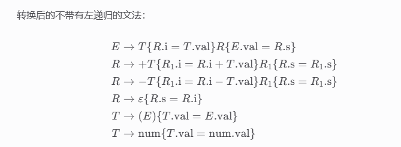
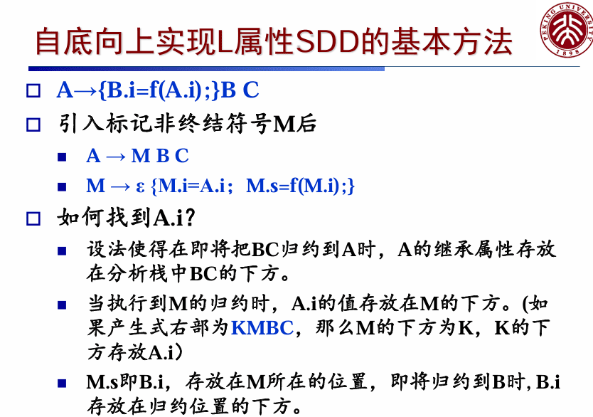
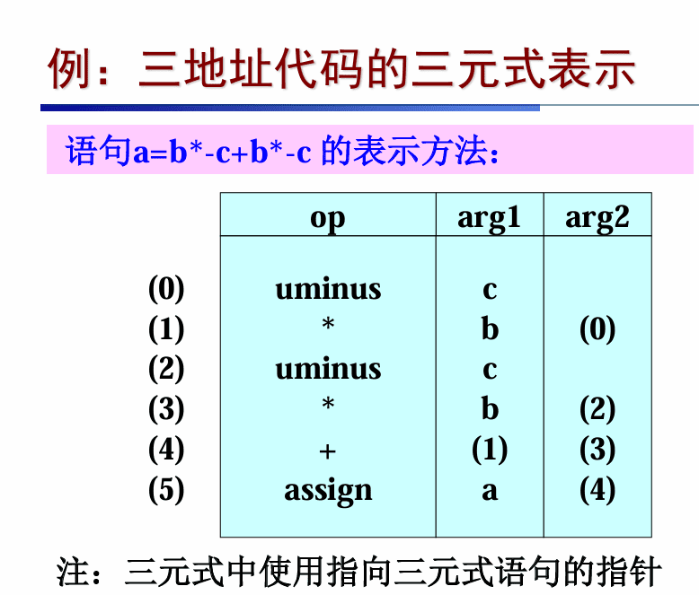

# 编译期末复习

## 语法制导翻译
### 语法制导定义 SDD

$\quad$ SDD是上下文无关文法和属性/规则的结合

$\quad$ 对于文法符号X和属性a，我们用X.a表示分析树中的某个标号为X的结点的值

$\quad$ 一个分析树结点和它的分支对应于一个产生式规则，而对应的语义规则确定了这些结点上的属性的取值

$\quad$ 综合属性(Synthesized Attribute)：在分析树结点 N上的非终结符号A的属性值由N对应的产生式所 关联的语义规则来定义

$\quad$ 继承属性(Inherited Attribute)：结点N的属性值 由N的父结点所关联的语义规则来定义

**规则定义：** 对于 ∀A→X1X2…Xn∈P，每个规则的一般形式为：c=f(c1,c2,…,ck)

- **综合属性：** c 是 A 的一个属性，且 c1,c2,…,ck是 A 的继承属性或是某个 Xi​ 的属性（向上看继承的或者向下看子节点属性，**综合全局看** ）。

- **继承属性：** c 是某个符号 Xi 的属性，且 c1,c2,…,ck是 A 或 Xj 的属性（父节点、自己、兄弟节点的属性，**向上看** ）。

$\quad$ 不允许N的继承属性通过N的子结点上的属性来定 义，但允许N的综合属性依赖于N本身的继承属性

#### 语法分析树上的SDD求值

$\quad$ 注释语法分析树：包含各个结点的各属性值的语法分析树

$\quad$ 步骤： 

$\quad$ $\quad$ 对于任意的输入串，首先构造出相应的分析树

$\quad$ $\quad$ 给各个结点（根据其文法符号）加上相应的属性值

$\quad$ $\quad$ 按照语义规则计算这些属性值即可

##### 计算顺序

如果某个结点N的属性a为f(N1.b1,N2.b2,…,Nk.bk), 那么我们需要先算出N1.b1,N2.b2,…,Nk.bk的值

如果我们可以给各个属性值排出计算顺序，那 么这个注释分析树就可以计算得到

S属性的SDD一定可以按照自底向上的方式求值

##### 适用于自顶向下分析的SDD

消除左递归之后，我们无法直接使用属性 val进行处理：

比如规则：T→FT’ T’ → '*'  FT’ 

T对应的项中，第一个因子对应于F，而运算符 却在T’中。

需要继承属性来完成这样的计算

#### 依赖图

在对SDD的求值过程中，如果结点N的属性a依 赖于结点M1的属性a1，M2的属性a2，…。那么 我们必须先计算出Mi的属性，才能计算N的属性a

使用依赖图来表示计算顺序‘

$\quad$ 结点：属性值

$\quad$ 有向边：若结点m表示的属性值依赖于结点n的属性 值，则有从n到m的有向边

若依赖图中无环，则存在一个拓扑排序，它就是属性值的计算顺序

比如

给定一个SDD，很难判定是否存在一棵分析树对 应的依赖图是否包含环 

但是特定类型的SDD一定不包含环，且有固定的排序模式 

$\quad$ S属性的SDD 

$\quad$ L属性的SDD 

对于这些类型的SDD，我们可以确定属性的计算顺序，且可以把不需要的属性（及分析树结点） 抛弃以提高效率

##### S属性的SDD

每个属性都是综合属性

$\quad$ 都是根据子构造的属性计算出父构造的属性

$\quad$ 在依赖图中，总是通过子结点的属性值来计算父结点的属性值。

可用于自顶向下和自底向上的语法分析 

$\quad$ 自顶向下： 

$\quad$ $\quad$ 递归子程序法中，在过程A()的最后计算A的属性

$\quad$ $\quad$ 此时A调用的其他过程已经调用完毕

$\quad$ 自底向上：

$\quad$ $\quad$ 在构造分析树的结点的同时计算相关的属性 

$\quad$ $\quad$ 此时其子结点的属性必然已经计算完毕

##### L属性的SDD

语义规则中的每个属性可以是 

$\quad$ 综合属性

$\quad$ 继承属性，但是继承属性仅依赖于产生式中Xj的左边符号X1,X2, …, Xj-1的属性,和 A的继承属性。 

$\quad$ 依赖图的边： 

$\quad$ $\quad$ 继承属性从左到右，从上到下。 

$\quad$ $\quad$ 综合属性从下到上 

$\quad$ 每一个S-属性的SDD都是L-属性的SDD。

$\quad$ L-属性的SDD可用于按深度优先顺序来计算

#####  变量声明的SDD

> 考查SDD的设计，注释语法分析树（即加上val等的值）对于文法分析设计SDD，先把 | 全部拆分出来

### 抽象语法树AST

每个结点代表一个语法结构；对应于一个运算符

结点的每个子结点代表其子结构；对应于运算分量

表示这些子结构按照特定方式组成更大的结构

可以忽略掉一些标点符号等非本质的东西

表示方式：

每个结点用一个对象表示

对象有多个域

$\quad$ 叶子结点中只存放词法值；

$\quad$ 内部结点中存放op（操作符）值和参数（通常指向其 它结点）

**在语法树中，运算符号和关键字都不在叶结点，而是在内部结点中出现**。

#### 在自顶向下分析过程中构造 AST

**定义**：抽象语法树中的每个结点代表一个程序构造，子结点代表构造的组成部分。

例如，表达式 E1+E2的语法树结点标号为 +，子结点分别代表 E1 和 E2​。

### 语法制导的翻译方案

语法制导的翻译方案是对语法制导定义的补充，也称作语法制导的翻译模式

把SDD的语义规则改写为计算属性值的程序片 段用花括号｛｝括起来，插入到产生式右部的 任何合适的位置上

**基本实现方法：**

$\quad$ 建立语法分析树

$\quad$ 将语义动作看作是虚拟的结点

$\quad$ 从左到右、深度优先地遍历分析树，在访问虚拟结点时执行相应动作

**实现 SDD 的两种重要基础文法**：

- 基础文法是 LR 的，SDD 是 S 属性的

- 基础文法是 LL 的，SDD 是 L 属性的

举例

**翻译方案的设计**

根据语法制导定义设计翻译方案

需要保证语义动作不会引用还没有计算的属性值

只需要综合属性的情况：为每一个语义规则建立一个包含赋值的动作， 并把这个动作放在相应的产生式右边的末尾

既有综合属性又有继承属性：

$\quad$ 产生式右边的符号的继承属性必须在这个符号 以前的动作中计算出来。 

$\quad$ 一个动作不能引用这个动作右边符号的综合属性。

$\quad$ 产生式左边非终结符号的综合属性只有在它所 引用的所有属性都计算出来以后才能计算。计算这种属性的动作通常可放在产生式右端的末 尾。

**后缀翻译方案**

后缀 SDT：所有动作都在产生式最右端的 SDT

文法可以自底向上分析且 SDD 是 S 属性的，必然可以构造出后缀 SDT。

构造方法：

- 将每个语义规则看作是一个赋值语义动作

- 将所有的语义动作放在规则的 **最右端**

消除左递归时 SDT 的转换方法

$\quad$ 如果动作不涉及属性值，可以 **把动作当作终结符号** 进行处理，然后消左递归。

>考点在消除左递归

### L属性SSD的实现

## 中间代码生成

中间代码是介于源代码和目标代码之间的一 种代码形式，它既不依赖于具体的程序语言， 也不依赖于具体的目标机。

### 中间代码的表示形式

- 抽象语法树（AST）
- DAG（Directed Acyclic Graph 有向无环图）
- 后缀式（也称逆波兰表示）
- 三地址代码

#### AST

#### DAG

**和 AST 的区别**：尽可能的复用相同的节点。

这点在翻译上亦有体现：

产生表达式 DAG 的翻译方案中，每次调用 `Leaf()` 和 `Node()` 的构造函数时，要检查是否已存在相同结构的节点，如果存在，则返回找到

#### 三地址代码

基本形式: x = y op z

特殊形式: 
1. x = op y op是一元运算符, 如一元减、逻辑非等
2. x = y 复制指令 
3. goto L 转移到L处的无条件转移语句 
4. if x goto L 或 if False x goto L 仅当x 为真（或假）时转移到L处 
5. if x ROP y goto L 条件转移语句  仅当x ROP y 成立时转移到L处 ROP是关系运算符<、<=、>、>=等
6. .参数传递与函数调用：1. 首先使用 param x1、 param x2 ⋯⋯param xn​ 传递参数， 然后使用call p,n 调用函数，其中 p 是函数名，n 是参数个数
7. 数组与地址操作

**具体实现**

四元式     op arg1 arg2 result 

三元式       op arg1 arg2 

间接三元式     间接码表+三元式表

### 静态单赋值 SSA

SSA 中的所有赋值 都针对不同名的变量

#### 类型表达式

类型表达式用来表示源程序中 变量、常量、表达式、语句等语言成分的类型

基本类型：boolean, char, integer, float, etc.

类名 

数组类型: array

记录(结构)类型:record 
 函数类型→: 从s到t的函数表示为s→t
 
 笛卡尔积（×）：列表或元组（例如函数参数）
 
指针类型

类型表达式的变量

#### 声明语句

>主要考察中间表示的三种形式，以及类型表达式
>四元式等求数组先算地址t=i*width
> IR-2 似乎不考

## 运行时环境

运行时环境的主要作用是实现存储组织和过程抽象

在代码生成前，编译器需要进行目标运行环境的设计和数据空间的分配

编译时刻对应静态分配 

$\quad$ 编译器通过程序文本即可做出分配决定 

$\quad$ 例如：常量、全局变量、静态变量（C中的static变量）

运行时刻对应动态分配 

$\quad$ 程序在运行过程中才能做出分配决定 

$\quad$ 例如：局部变量、动态变量（C中的malloc函数分配的数据）

活动树（activationtree）：

程序运行的过程活动可以用树表示

$\quad$ 每个结点对应于一个过程活动 

$\quad$ 根结点对应于主过程（或入口过程）的活动 

$\quad$ 过程p的某次活动对应的结点的所有子结点：此次活动所调用的各 个过程活动（从左到右，表示调用的先后顺序）

**活动记录**

**非局部数据的访问**

一个过程访问在另一个过程中声明的局 部变量

访问链的建立：

**可达性**

可达性指的是一个对象可以被应用程序访问到

垃圾回收：清扫不可达的对象

> 主要考活动记录结构（控制链，访问链）以及可达性，标记清扫

> 访问链是指向栈中最近的定义了当前过程的过程,只有函数嵌套定义的时候才会出现
> 
> 控制链是指向调用当前过程的过程

## 目标代码生成

**控制流图**

有向图，图中结点为基本块（basicblock），边为控制流跳转

基本块具有线性结构，其中最后一条语句为跳转或者过程/函数返回

控制流只能从基本块的第一条指令进入

控制流图的每个基本块内部为三地址代码,跳转指令的目标为基本块

**划分基本块的算法**

确定首指令（leader，基本块的第一条指令） 

$\quad$ 第一条三地址指令 

$\quad$ 任意一个条件或无条件跳转指令的目标指令 

$\quad$ 紧跟在一个条件或无条件跳转指令之后的指令

确定基本块

$\quad$ 每条首指令对应一个基本块：从首指令开始到下一个首指令

着色算法

>基本块划分，控制流图构造，寄存器冲突与着色

## 代码优化

常量折叠、公共⼦表达式消除、复写传播、死代码消除、循环优化（代码外提，归纳变量消除等）

数据流分析：到达定值、活跃变量、可⽤表达式

> 主要考数据流分析

---