# 计算机网络

## 网络基础知识

$\quad$ **学习内容：**

***
网络实体如何通过协议，实现各类网络功能/服务
***

$\quad$ **主要内容：**

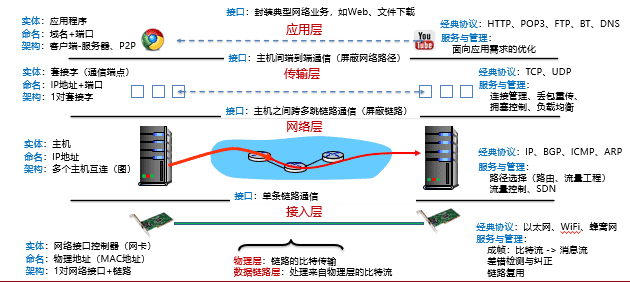

### 计算机网络中的主要问题：
##### 对等实体

$\quad$ 实体的识别和命名

$\quad$ 实体的组织形式

##### 服务

$\quad$  传输接口

$\quad$  服务性能

$\quad$  是否具有可靠性，安全性等保障

##### 协议

$\quad$  传输内容的格式，语义，顺序

##### 实现与管理

$\quad$  功能、协议->实体的映射

$\quad$  资源分配与调度

### 实体：计算机网络的组成

#### 分类：

##### 个域网PAN

$\quad$  能在便携式消费电器与通信设备之间进行短距离通信的网络

$\quad$  覆盖范围一般在10米半径以内，如蓝牙耳机等

##### 局域网LAN

$\quad$  局部地区形成的区域网络，如企业网络

$\quad$  分布地区范围有限，可大可小

$\quad$  电脑WLAN接入，打印机共享等

##### 城域网MAN

$\quad$  覆盖一整个城市的网络

##### 广域网WAN

$\quad$  覆盖很大地理区域，乃至覆盖国家和地区

#### 今天的互联网：网络的网络

$\quad$  由多个子网络构成

$\quad$  每个子网络又可进一步划分

$\quad$  直到每个公司、家庭甚至房间内的小网络

##### ISP（Internet service provider）

提供网络接入与互联服务

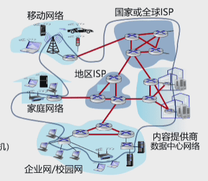

##### 网络边缘：

$\quad$  端系统：位于互联网边缘与互联网相连的计算机和其他设备

$\quad$  端系统由各类主机（host）构成:桌面计算机，移动计算机，服务器，其他智能终端设备

###### 主机Host
$\quad$  客户端：各类智能终端

$\quad$  服务器

$\quad$  功能：容纳（运行）应用程序，将用户程序产生的数据向接入网发送，从网络接收数据并提供给应用程序。

$\quad$  内部结构：

$\quad$ $\quad$  网络设备硬件（网卡）：对外通信

$\quad$ $\quad$  内核软件：内核驱动：网卡管理与访问（为特定网卡开发）；网络协议栈：网络数据处理（与网卡无关）

$\quad$ $\quad$  用户软件：调用内存提供接口(socket)进行数据发送/接收

$\quad$  命名：

$\quad$ $\quad$  唯一设备ID（48位mac地址）：全球唯一，不可修改（IEEE将命名空间分给各个厂商，厂商自行保证出厂设备不重名）

$\quad$ $\quad$  IP地址：一组数字构成（IPv4 32位，IPv6 128位）

$\quad$ $\quad$  主机名：字符串（方便记忆）

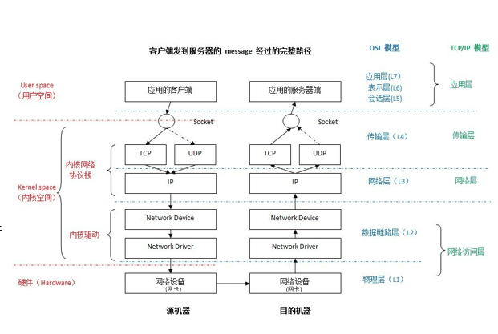

##### 接入网

$\quad$  连接边缘端系统与网络核心

$\quad$  通信链路（光纤、铜缆、无线电、激光链路）

###### 接入网目标

$\quad$  将主机连接到边缘路由器上

$\quad$  边缘路由器是将端系统Host去往任何远程端系统的路程上的第一台路由器

$\quad$  各种异构网络是通过边缘路由器接入

###### 如何将终端系统连接到边缘路由器

$\quad$  通过各种物理介质（引导性介质：双绞线，同轴电缆(两根同心铜导线)，光纤；非引导性介质：无线电，无线链路）

$\quad$  有线网络接入技术：拨号上网（数字用户线DSL），同轴电路，光纤到户，以太网

$\quad$  无线网络接入技术：WiFi，4G、5G，卫星广域覆盖

$\quad$  传输单位：位（bit）1B=8b K/M/G层级为10^3进制

##### 网络核心

$\quad$  由互联网端系统的分组交换设备和通信链路构成的网状网

$\quad$  目标：将海量的端系统互联起来

$\quad$  关键技术：分组交换

$\quad$ $\quad$  主机将数据分成分组（Packet），发送到网络

$\quad$ $\quad$  网络将数据分组从一个路由器转发到下一个路由器，通过从源到目标的路径上的链路，逐跳传输抵达目的地

###### 两大功能

$\quad$   功能1：路由

$\quad$ $\quad$  全局操作：确定数据分组从源到目标所使用的路径

$\quad$ $\quad$  需要路由协议与路由算法，产生路由表

$\quad$  功能2：转发

$\quad$ $\quad$  本地操作：路由器或交换机将收到的数据分组转发出去（即移动到该设备的某个输出接口）

$\quad$ $\quad$  确定转发出去的接口/链路，根据从“入接口”收到分组头中的目的地址，查找本地路由表，确定”出接口"

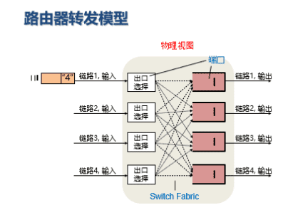

###### 分组交换

$\quad$  将大消息（message）拆分成多个小分组（packet)

$\quad$  以分组作为数据传输单元

$\quad$  每个分组的首部都含有地址（目的地址和源地址）等控制信息

$\quad$  支持灵活的统计多路复用

$\quad$  使用存储-转发机制，实现数据交互的通信方式

$\quad$ $\quad$  路由器需要接收到完整的整个数据包后，才能开始向下一跳发送

$\quad$ $\quad$  存储转发带来额外的报文的传输延迟

$\quad$ $\quad$ $\quad$  正常的链路传播延迟：将L位数据包，以R bps的速率发送到链路中，需要L/R秒

$\quad$  每个分组在互联网中独立地选择传输路径

$\quad$ $\quad$  不同分组可以共享使用同一节点或链路

$\quad$ $\quad$  如果某段链路上，分组到达速率超过链路传输速率

$\quad$ $\quad$ $\quad$  分组在一个缓冲区中排队，等到链路可用

$\quad$ $\quad$ $\quad$  若队列被填满，后续分组就被抛弃（丢包）

###### 另一种选择：电路交换

$\quad$  先呼叫建立连接，实现端到端的资源预留（链路带宽资源，交换机的交换能力）

$\quad$  电路交换连接建立后，物理通路被通信双方独占，资源专用，既不空闲也不与其他连接共享

$\quad$  由于建立连接并预留资源，因此传输性好，但如果有设备故障则传输中断

###### 交换方式的比较

$\quad$  分组交换随时发送无需连接；电路交换需要建立连接

$\quad$  分组交换没有预留资源，但较灵活；电路交换为每个连接预留资源

$\quad$  分组交换适合有大量突发资源，简单，不需要建立连接

$\quad$ $\quad$  缺点1：分组交换容易拥塞，引起排队延迟甚至丢包

$\quad$ $\quad$ $\quad$  需要设计可靠性机制与拥塞控制机制

$\quad$ $\quad$  缺点2:分组交换无法提供类似电路交换的服务

$\quad$ $\quad$ $\quad$  折中方法：虚电路（目前仍然没有公认解决方案）

##### Internet架构

$\quad$  端系统通过本地网络提供商（access ISP）接入Internet

$\quad$  本地网络提供商之间也需要相互连接,产生了以恶搞结构极度复杂的当今Internet

###### Access ISP如何建立连接？

$\quad$  选择1：两两建立链路：可拓展性问题（O（N^2）链路）

$\quad$  选择2：每个Access ISP接入一个全局ISP （ISP之间签署服务协议）

$\quad$ $\quad$  单个ISP可能无法满足传输要求，其他全局ISP出现

$\quad$ $\quad$  全局ISP之间也需要互连

$\quad$ $\quad$  互联网公司也组建自己网络，使得数据中心与用户距离更近，这种网络通常称为CDN

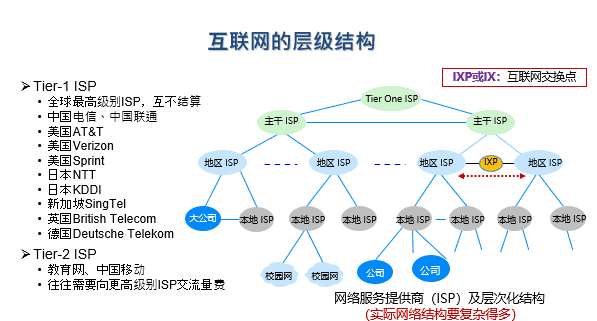

### 服务：网络的功能，接口，质量

$\quad$  从应用程序角度：与网络上的其他应用程序交互（发送/接收消息）

$\quad$  按调用方式：分为“面向连接"和”无连接“两大类

$\quad$  按服务质量：可靠性，性能，安全

$\quad$  服务由一组可用于用户进程以访问服务的原语（操作）形式指定

$\quad$  原语告诉服务执行某些操作或报告对等实体所采取的操作

$\quad$  六个核心服务原语：

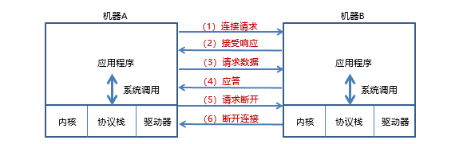

###### 面向连接的网络服务

$\quad$  传输数据之前，先建立对话链接

###### 无连接的网络服务

$\quad$  数据传输前不需要事先建立连接

$\quad$  传输过程不需要应答

#### 网络服务的性能指标

##### 带宽

$\quad$  网络中某通道传输数据的能力，即单位时间内网络的某信道所能通过的最高数据率

$\quad$  单位是bit/s，也可以写为bps

##### 包转发率

$\quad$  全称是Packet Per Second，表示交换机或路由器等网络设备以包为单位的转发速率

$\quad$  线速转发：交换机在满负荷的情况下，对帧进行转发时能够达到该端口线路的最高速度（在交换机上，大包更容易实现线速）

##### 比特率（bit rate）

$\quad$  单位时间内，主机往数据信道上传输数据的数据量，也称为数据率或传输速率，单位是bps

##### 吞吐量

$\quad$  单位时间内，通过某个网络位置（或信道，接口）的数据量，单位是bps

$\quad$  有效吞吐量：正确地接收到的有用信息的数目，单位bps

##### 利用率

$\quad$  信道利用率指出某信道百分之几的时间是被利用的

$\quad$  网络利用率是全网络的信道利用率的加权平均

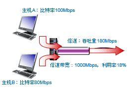

##### 丢包率

$\quad$  所丢失的数据包的数量占所发送数据包的比率

##### 时延

$\quad$  时延是指数据（一个报文或分组）从网络(或链路)的一端传送到另一端所需的时间，也称为延迟

###### 传输时延

$\quad$  数据从结点进入到传输媒体所需要的时间，又称为发送时延（与设备有关）

###### 传播时延

$\quad$  电磁波在信道中需要传输一定距离而花费的时间（与介质有关)

###### 处理时延

$\quad$  主机或路由器在收到分组时，为处理分组（如分析首部，提取数据，差错校验或查找路由）所花费的时间（与设备有关）

###### 排队时延

$\quad$  分组在路由器输入输出队列中排队等待处理所经历的时延

$\quad$  最不确定因素：L=AxW （L：平均队列长度，A平均到达速率，W平均等待时间，A和W相对困难得到）

###### 总时延

$\quad$  通用方法：将一个大问题分解成多个小问题

$\quad$  总时延=传输时延+传播时延+处理时延+排队时延

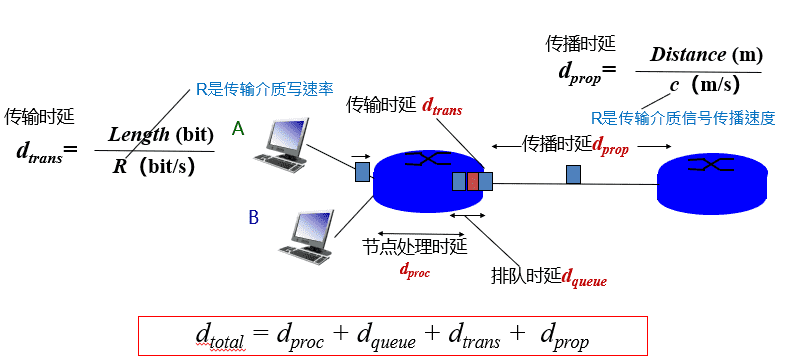

$\quad$  优化：设计专用芯片，开发系统系统模块（处理+传输），光纤等（排队+传播）

###### 往返时延 RTT

$\quad$  从发送方发送数据开始，到发送方收到来自接收方的确认经历的总时间

$\quad$  可用于判断网络的通断性，测试网络时延，计算数据丢包率（PING）

###### 时延带宽积

$\quad$  时延带宽积=传播时延x带宽

$\quad$  若发送端连续发送数据，则在发送的第一个bit即将达到终点时，发送端就已经发送了时延带宽积个bit，而这些bit都在链路上向前移动

###### 时延抖动

$\quad$  变化的时延称为抖动

$\quad$  起源于网络中的个队列或缓冲，难以精确预测

$\quad$  在语音，视频多媒体业务中，抖动往往会严重影响用户的体验

##### 延迟丢包

$\quad$  在多媒体应用中，由于数据包延迟到达，在接收端需要丢弃失去使用价值的包

##### 其他指标

$\quad$  可靠性：发送的每个消息，接收方收到一次且仅收到一次

$\quad$  完整性：发送的数据无法篡改

$\quad$  隐私性：数据不被第三方截获（有时包含发送方身份不暴露）

$\quad$  可审计性：可追溯用户的传输行为

### 协议：通信的内容

$\quad$  网络协议：为进行网络中的数据交换而建立的规则、标准或规定

$\quad$  通信双方需要共同遵守，相互理解

$\quad$  发送方：发送某个消息时，应满足特定条件

$\quad$  接收方：收到某个消息后，要完成特定的工作

$\quad$  三要素:

$\quad$ $\quad$  语法：规定传输数据的格式

$\quad$ $\quad$  语义：规定所要完成的功能

$\quad$ $\quad$  时序：规定各种操作的顺序

$\quad$  设计目的：表明身份，可靠性，资源分配，拥塞问题，自适应性，安全问题

$\quad$  通信双方要说的事情多种多样，导致网络协议异常复杂

#### 协议封装

$\quad$  网络协议以头部封装的形式定义

$\quad$  每个协议定义自己头部信息，数据被封装为协议载荷

$\quad$  头部定义了如何处理分组

### 网络实现与管理

$\quad$  将网络分为多个层次，每层提供功能与服务保障，层与层之间有接口调用，同层实体通过该层协议进行对话，屏蔽各层实现细节

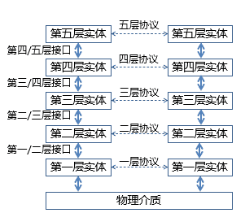

$\quad$  统一标准，模块独立

$\quad$  分层的好处：降低复杂度，增加灵活性

$\quad$  坏处：引入额外开销，跨层信息有时候也很重要

#### 计算机网络中的经典分层

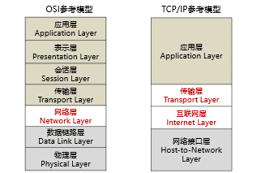

##### OSI参考模型

###### 物理层（Physical Layer）

$\quad$  定义如何在信道上传输0，1

$\quad$  机械接口：网线接口大小，形状，线缆排列等

$\quad$  电子信号：电压、电流等

$\quad$  时序接口：采样频率，波特率，比特率等

$\quad$  介质：各种线缆，无线频谱等

###### 数据链路层 (Data Link Layer)

$\quad$ •实现相邻（Neighboring）网络实体间的数据传输

$\quad$ •成帧（Framing）：从物理层的比特流中提取出完整的帧

$\quad$ •错误检测与纠正：为提供可靠数据通信提供可能

$\quad$ •物理地址（MAC address）：48位，理论上唯一网络标识，烧录在网卡，不便更改

$\quad$ •共享信道上的访问控制（MAC）：同一个信道，同时传输信号。

$\quad$ •流量控制，避免“淹没”（overwhelming）:当快速的发送端遇上慢速的接收端，接收端缓存溢出

###### 网络层 (Network Layer)

$\quad$ •将数据包跨越网络从源设备发送到目的设备（host to host）

$\quad$ •路由（Routing）：在网络中选取从源端到目的端转发路径，常常会根据网络可达性动态选取最佳路径，也可以使用静态路由

$\quad$ •路由协议：路由器之间交互路由信息所遵循的协议规范，使得单个路由器能够获取网络的可达性等信息

$\quad$ •服务质量（QoS）控制：处理网络拥塞、负载均衡、准入控制、保障延迟

$\quad$ •异构网络互联：在异构编址和异构网络中路由寻址和转发

###### 传输层 (Transport Layer)

$\quad$ •将数据从源端口发送到目的端口（进程到进程）

$\quad$ •网络层定位到一台主机（host），传输层的作用域具体到主机上的某一个进程

$\quad$ •网络层的控制主要面向运营商，传输层为终端用户提供端到端的数据传输控制

$\quad$ •两类模式：可靠的传输模式，或不可靠传输模式

$\quad$ •可靠传输：可靠的端到端数据传输，适合于对通信质量有要求的应用场景，如文件传输等

$\quad$ •不可靠传输：更快捷、更轻量的端到端数据传输，适合于对通信质量要求不高，对通信响应速度要求高的应用场景，如语音对话、视频会议等

###### 会话层 (Session Layer)

$\quad$ •利用传输层提供的服务，在应用程序之间建立和维持会话，并能使会话获得同步

###### 表示层（Presentation Layer）

$\quad$ •关注所传递信息的语法和语义，管理数据的表示方法，传输的数据结构

###### 应用层（Application Layer）

$\quad$ •通过应用层协议，提供应用程序便捷的网络服务调用

##### TCP/IP参考模型

$\quad$  ARPNET  最终采用TCP和IP为主要协议

$\quad$  先有TCP/IP协议栈，然后有TCP/IP参考模型，参考模型只是用来描述协议栈的

###### 网络接口层（Host-to-network Layer）

$\quad$  描述了为满足无连接的互联网络层需求，单跳链路必须具备的功能

###### 互联网层（Internet Layer）

$\quad$  通过多跳连接，将数据包独立的传输至目的地，并定义了数据包格式和协议（IPv4协议和IPv6协议）

###### 传输层（Transport Layer）

$\quad$  允许源主机与目标主机上的对等实体，进行端到端的数据传输：TCP，UDP

###### 应用层（Application Layer）

$\quad$  传输层之上的所有高层协议：DNS、HTTP、FTP、SMTP...

##### 比较

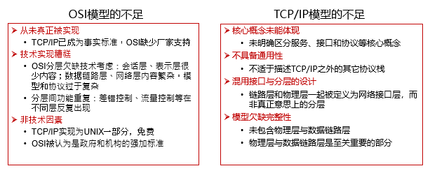

$\quad$  网络分层没有对与错，只有是否符合需要

#### 接口与协议的关系

$\quad$   协议是“水平”的，接口是“垂直”的

$\quad$  实体使用协议来实现其定义的接口

$\quad$  上层实体通过接口调用下层实体

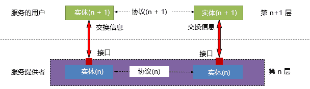

$\quad$  发送端层层封装头部数据，接收端：层层解封装头部数据

#### 网络分层的实现

$\quad$ 端系统：实现所有分层(用户程序运行在端系统，比特流进入系统，要一直传输给用户程序)

$\quad$ 边缘网与网络核心：实现第一层到第三层功能

$\quad$ $\quad$ 交换机：物理层与数据链路层功能

$\quad$ $\quad$ 路由器：实现前三层功能

$\quad$ $\quad$ 传统路由器支持多跳传输，传统交互机不支持多跳传输，现代路由器和交换机已经不做区分

###### 特征1:复杂系统由端系统实现

$\quad$ 兵器电话系统中“笨终端，聪明网络"的设计思路

$\quad$ 端对端原则：采用”聪明终端，简单网络“，用端系统负责丢失恢复等复杂共功能

$\quad$ 实现了建立在简单的，不可靠部件上的可靠系统

$\quad$ 好处：简单的网络大大提升了可拓展性

###### 特征2：以IP协议为核心

$\quad$ 可在各种底层物理网络上运行

$\quad$ 支持各类上层应用

$\quad$ 好处：IP分组独立处理，网络核心功能简单，适应爆炸性增长；容易实现多个网络互连（只要都支持IP）；屏蔽上层应用与底层通信

---
