# 计算机网络

## 网络层 - 基本概念，路由器

  

### 基本概念

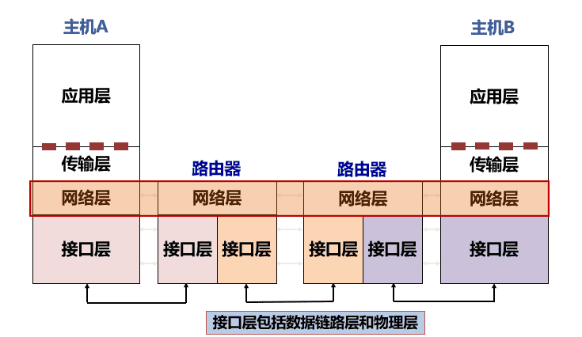

###### 基本功能

$\quad$ 网络层：主机-主机间数据传输可达

$\quad$ $\quad$ 发送端：将传输层数据单元封装在数据包中

$\quad$ $\quad$ 接收端：解析接收的数据包中，取出传输层数据单元，交付给传输层

$\quad$ 网络层的数据传输是多跳传输

$\quad$ $\quad$ 网络层功能存在每台主机和路由器中

$\quad$ $\quad$ 路由器：检查数据包首部，转发给下一跳（路由器或主机）

##### 服务模型

$\quad$ 主机-主机多跳传输有多种服务模型可供选择

$\quad$ $\quad$ 网络层向传输层提供的接口类型？

$\quad$ $\quad$ $\quad$ “面向连接”(电路交换）OR“无连接“（分组交换）

$\quad$ $\quad$ 网络通信的可靠交付服务，谁来负责？

$\quad$ $\quad$ $\quad$ “网络”OR“端系统”

$\quad$ $\quad$ 服务质量保障？

$\quad$ $\quad$ $\quad$ “无保障”OR“性能保障”

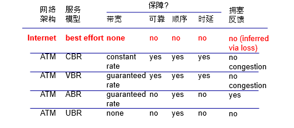

###### Internet ：无连接的数据报服务

$\quad$ 无连接服务：如寄信

$\quad$ $\quad$ 不需要提前建立连接

$\quad$ 数据报服务

$\quad$ $\quad$ 网络层向上只提供简单灵活无连接的、尽最大努力交付的数据报服务

$\quad$ $\quad$ 发送分组时不需要先建立连接，每个分组独立发送

$\quad$ $\quad$ 数据报独立转发，相同源-目的的数据报可能经过不同的路径

$\quad$ $\quad$ 网络层不提供服务质量的承诺

$\quad$ 尽力而为交付

$\quad$ $\quad$ 传输网络不提供端到端的可靠传输服务：丢包、乱序、错误

$\quad$ $\quad$ 优点：网络的造价大大降低，运行方式灵活，能够适应多种应用

$\quad$ 数据报可能沿着不同的路径传输，减少网络不可靠带来的影响

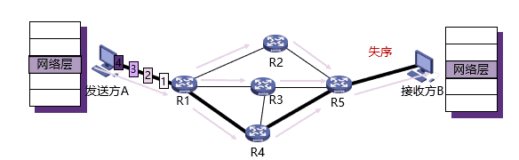

$\quad$ 但这样可能会导致接收数据的失序；

$\quad$ 为避免增加额外的开销进行数据排序，网络并不会完全随意地发送数据，在大多数情况下，仍然是会尽量沿着某一条路径发送。

##### 网络层关键功能

$\quad$ 无论哪种网络层服务模型，都依赖于2个核心功能

$\quad$ 转发

$\quad$ $\quad$ 将数据报从路由器的输入接口传送到正确的输出接口

$\quad$ $\quad$ 核心：转发函数

$\quad$ $\quad$ 类比：旅行时穿过一个城市（城市内部各个车站、机场间移动）

$\quad$ 路由

$\quad$ $\quad$ 选择数据报从源端到目的端的路径

$\quad$ $\quad$ 核心：路由算法与协议

$\quad$ $\quad$ 类比：规划出发城市到目的城市的旅行路线（城市间移动）

###### 数据平面与控制平面

$\quad$ 网络层的转发与路由功能，又把网络层进一步划分为数据平面与控制平面

$\quad$ $\quad$ 数据平面与控制平面是软件定义网络（SDN）技术兴起后，新引入的术语

$\quad$ 数据平面：转发功能

$\quad$ $\quad$ 单个路由器上局部功能

$\quad$ $\quad$ 每个路由器独立对收到的数据报文执行转发功能

$\quad$ 控制平面：路由功能

$\quad$ $\quad$ 全网计算：涉及多个路由器

$\quad$ $\quad$ 2种实现方式:

$\quad$ $\quad$ $\quad$ 传统路由算法:

$\quad$ $\quad$ $\quad$ $\quad$ 多个路由器分布式协作计算

$\quad$ $\quad$ $\quad$ 软件定义网络(SDN):

$\quad$ $\quad$ $\quad$ $\quad$ 由中心化控制器负责计算后，通知各个路由器

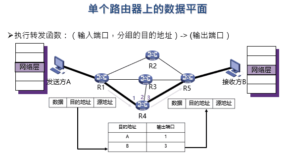

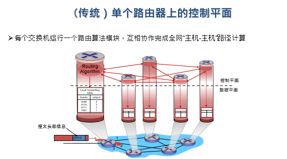

  

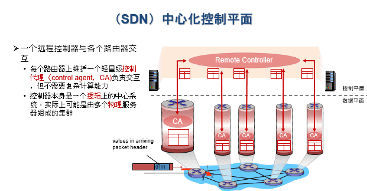

### 路由器

$\quad$ 路由器是互联网最主要的网络设备，包含2个核心功能

$\quad$ $\quad$ 控制平面（路由）：运行各种路由协议，学习去往不同目的的转发路径：路由表

$\quad$ $\quad$ 数据平面（转发）：根据上述路由表，将收到的IP分组转发到正确的下一跳链路

###### 路由器架构

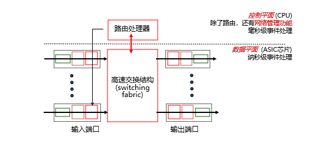

###### 路由器控制平面

$\quad$ 路由器可同时运行多个路由协议

$\quad$ 路由器也可不运行任何路由协议，只使用静态路由和直连路由

$\quad$ 路由管理根据路由优先级，选择最佳路由，形成核心路由表

$\quad$ 控制层将核心路由表下发到数据层，形成转发表（FIB）

$\quad$ 若存在多个“去往同一目的IP”的不同类型路由，路由器根据优先级选择最佳路由

$\quad$ 优先级数值越小，优先级越高

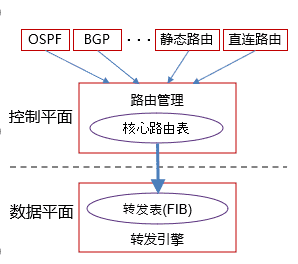

#### 路由器数据平面

$\quad$ 路由器中IP报文转发核心功能

$\quad$ $\quad$ 链路层解封装，IP头部校验

$\quad$ $\quad$ 获取报文目的IP地址

$\quad$ $\quad$ 用目的IP地址，基于最长前缀匹配规则查询转发表

$\quad$ $\quad$ 查询失败，丢弃报文

$\quad$ $\quad$ 查询成功

$\quad$ $\quad$ $\quad$ IP头部“TTL”字段值减1，重新计算IP头部“校验和”

$\quad$ $\quad$ $\quad$ 获取转发出接口和下一跳链路层地址

$\quad$ $\quad$ $\quad$ 重新进行链路层封装，发送报文

$\quad$ $\quad$ 注：普通IP报文转发过程中，路由器不查看传输层及以上层协议的内容

$\quad$ IP报文在路由器转发前后的变化

$\quad$ $\quad$ 链路层封装更新，IP头部“TTL”减1，IP头部“校验和”更新

$\quad$ 数据报在不同硬件单元的处理

$\quad$ $\quad$ 输入端口：接口卡 (interface card)

$\quad$ $\quad$ $\quad$ 物理层处理、链路层解封装

$\quad$ $\quad$ $\quad$ 转发表查询（该工作在输入接口卡处理）

$\quad$ $\quad$ $\quad$ 通过交换结构将报文排队发往目的接口卡（发送过快将产生拥塞）

$\quad$ $\quad$ 交换结构

$\quad$ $\quad$ $\quad$ 从输入接口卡发往输出接口卡

$\quad$ $\quad$ 输出端口：接口卡 (interface card)

$\quad$ $\quad$ $\quad$ 从交换结构接收报文（排队进行后续处理，到达太快将产生拥塞）

$\quad$ $\quad$ $\quad$ 链路层封装、物理层处理

$\quad$ $\quad$ $\quad$ 从输出接口发送报文

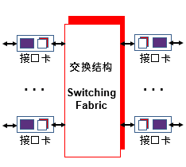

###### 路由器拓展知识

$\quad$ 路由器的端系统角色

$\quad$ $\quad$ 也作为网络端系统进行协议交互

$\quad$ $\quad$ $\quad$ 远程网络管理，SNMP

$\quad$ $\quad$ $\quad$ 远程网络配置，SSH

$\quad$ $\quad$ $\quad$ 文件传输，FTP，TFTP

$\quad$ $\quad$ $\quad$ 各种路由协议交互

$\quad$ $\quad$ 路由器系统包含完整TCP/IP协议栈

$\quad$ $\quad$ $\quad$ 传输层协议

$\quad$ $\quad$ $\quad$ 应用层协议

$\quad$ 家用路由器

$\quad$ $\quad$ 不运行动态路由协议（出口唯一）

$\quad$ $\quad$ 运行DHCP协议，分配私有IP

$\quad$ $\quad$ NAT地址转换

$\quad$ $\quad$ 本地DNS服务

$\quad$ $\quad$ 用户管理及认证

$\quad$ $\quad$ 防火墙功能

$\quad$ $\quad$ 无线AP

##### 输入端口

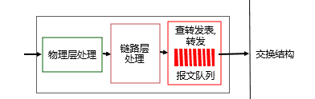

$\quad$ 去中心化数据交换：每个数据端口执行独立计算任务

$\quad$ $\quad$ 处理物理层、链路层信息，获取网络层报文

$\quad$ $\quad$ 基于报文头部字段，在转发表中查找对应的输出端口，通过交换结构(switch fabric)最终传输到对应输出端口

$\quad$ $\quad$ $\quad$ 每个输入端口在内存里维护转发表

$\quad$ $\quad$ $\quad$ 又称“匹配-动作(match-action)”模式

$\quad$ 优势：每个端口独立工作，达到“线速”

$\quad$ $\quad$ 线速（line rate)：每个端口的传输带宽

$\quad$ 如果报文到达速度超过交换结构速度（如：多个输入端口往同一输出端口转发数据）

$\quad$ $\quad$ 报文将在输入端口队列中缓存

$\quad$ $\quad$ 缓存溢出后，丢弃后续报文

$\quad$ 基于转发表的转发策略有2种

$\quad$ $\quad$ 基于目的地址的转发

$\quad$ $\quad$ $\quad$ 只根据目的IP地址

$\quad$ $\quad$ $\quad$ 传统交换机中常用（受限于芯片计算能力）

$\quad$ $\quad$ 通用转发

$\quad$ $\quad$ $\quad$ 可以根据数据报文中任意字段的组合

###### 基于目的地址的转发

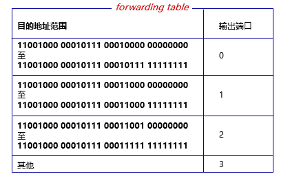

$\quad$ 给定目的地址在转发表中进行查找时, 使用匹配到的最长地址前缀

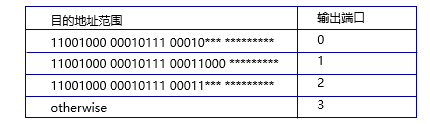

$\quad$ 为什么将目的地址范围表示为前缀的形式？

$\quad$ $\quad$ 区间表示更能消除歧义，为什么不用区间法？

$\quad$ 原因：

$\quad$ $\quad$ 现代网络的性能要求极高

$\quad$ $\quad$ $\quad$ 转发表查找需要在纳秒级时间内完成

$\quad$ $\quad$ 现代路由器的转发表实现

$\quad$ $\quad$ $\quad$ 基于ternary content addressable memories (TCAMs)

$\quad$ $\quad$ TCAM优势：

$\quad$ $\quad$ $\quad$ 可以对所有地址并行匹配，无论转发表多大只消耗1个时钟周期

$\quad$ $\quad$ $\quad$ 每个bit支持3类匹配值：0，1，dont care

$\quad$ $\quad$ $\quad$ Cisco Catalyst交换机: TCAM支持百万级表项

###### 缓冲队列

$\quad$ 交换核心或输出端口速度低于多个输入端口到达速率之和 -> 在输入端口排队

$\quad$ $\quad$ 甚至导致排队延迟与丢包

$\quad$ 排头阻塞（Head-of-the-Line blocking, HOL blocking):

$\quad$ $\quad$ 队列中的报文，导致后续报文也需等待，即便后续报文对应的输出端口是空闲的

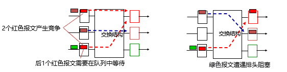

##### 交换结构

$\quad$ 交换结构：将报文从输入端口的缓冲队列传输到正确的输出端口

$\quad$ 交换速率：所有输入端口到输入端口的总速率

$\quad$ $\quad$ N个输入端口，则期望的交换速率为N倍线速

$\quad$ 3种典型的交换结构

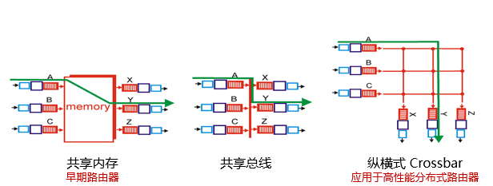

###### 共享内存

$\quad$ 最初的交换机实现

$\quad$ 交换结构内没有专用芯片，只有一块内存，由控制平面的路由处理器控制

$\quad$ $\quad$ 路由处理器不仅负责路由功能，还负责转发功能

$\quad$ 交换流程

$\quad$ $\quad$ 报文到达输入端口时，产生中断信号通知路由处理器

$\quad$ $\quad$ 路由处理器将报文复制到内存中，查询对应输出端口，再将报文复制到输出端口

$\quad$ 性能瓶颈：内存拷贝

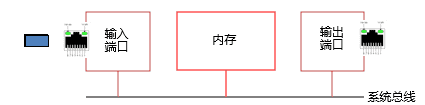

###### 共享总线

$\quad$ 数据包从输入端口直接到达输出端口，无需处理器干预

$\quad$ 实现方式

$\quad$ $\quad$ 输入端口通过转发表后，给报文附加上“标签”，表明输出端口

$\quad$ $\quad$ 带标签的报文通过总线广播至所有输出端口

$\quad$ $\quad$ 每个输出端口通过标签判断报文是不是属于自己的，不属于则忽略

$\quad$ 性能：总线1次只能广播1个报文，交换速率受总线带宽制约

$\quad$ $\quad$ Cisco 5600交换机：32Gbps交换速率

###### 纵横式Crossbar

$\quad$ 使用2N条总线连接N个输入端口与N个输出端口

$\quad$ $\quad$ 交叉点为控制点可以开启或闭合

$\quad$ 优势：不重叠的交换路径，可以并行工作

$\quad$ $\quad$ 如：A->Y，B->X

$\quad$ $\quad$ Cisco 12000路由器: 60 Gbps交换速率

$\quad$ 更复杂交换结构

$\quad$ $\quad$ 多级、分布式的交换结构

##### 输出端口

$\quad$ 缓冲队列：交换结构的数据超过发送数据时

$\quad$ $\quad$ 与输入端口不同，可以不是FIFO模式

$\quad$ 队列调度：从缓冲队列中选择数据报文

$\quad$ $\quad$ 性能考虑：选择对网络性能最好的

$\quad$ $\quad$ 公平性考虑：网络中立原则

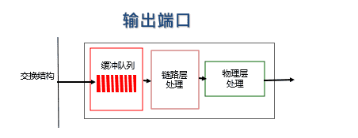

$\quad$ 输出端口的缓冲队列，也可能造成排队延迟甚至丢包

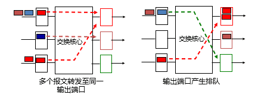

###### 缓冲区大小

$\quad$ RFC 3439 建议:“典型”RTT (250 ms) 乘以链路带宽 C

$\quad$ $\quad$ 若C = 10 Gpbs，缓冲区大小2.5 Gbit

$\quad$ 实际建议: 交换机的报文分为N个流，则缓冲区大小为$RTT·C/sqrt(N)$

$\quad$ $\quad$ 流：相同网络地址的报文构成1个流

$\quad$ $\quad$ 二元组流：源IP地址+目的IP地址

$\quad$ $\quad$ 五元组流：源IP地址+目的IP地址 + 源端口号 + 目的端口号 + 传输层类型（TCP or UDP)

###### 调度机制

$\quad$ 目标：从输出端口的缓冲队列选择一个数据报文发送到链路上

$\quad$ 先进先出（FIFO）调度：根据入队顺序发送

$\quad$ $\quad$ 简单，但仍有问题需要考虑

$\quad$ $\quad$ 缓冲区溢出时，如何选择丢弃报文

$\quad$ $\quad$ $\quad$ Tail drop：丢弃新来的报文

$\quad$ $\quad$ $\quad$ Priority drop：根据优先级丢弃报文

$\quad$ $\quad$ $\quad$ Random drop：随机丢弃

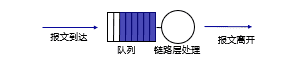

$\quad$ 基于优先级调度（priority scheduling)：将数据报文分为不同优先级

$\quad$ $\quad$ 根据数据报文头部字段判断优先级（如IP地址，端口号）

$\quad$ $\quad$ 具体优先级由安全或者性能因素考虑

$\quad$ $\quad$ 总是先发送高优先级报文

$\quad$ 实现：多个队列对应不同优先级

$\quad$ $\quad$ 为简化芯片设计，不采用复杂数据结构（如二叉堆）

$\quad$ 缺点：公平性

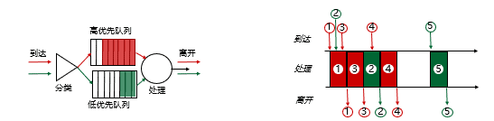

$\quad$ 轮询调度（round robin scheduling）

$\quad$ $\quad$ 将报文分类，进入多个队列

$\quad$ $\quad$ 在队列间轮询，若队列中存在报文，则发送

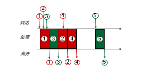

$\quad$ 加权公平队列(weighted fair queuing, WFQ)

$\quad$ $\quad$ 更一般化的轮询方式

$\quad$ $\quad$ 每个队列拥有权重值

$\quad$ $\quad$ 轮询时考虑权重：权重高的队列，轮询到的次数更多

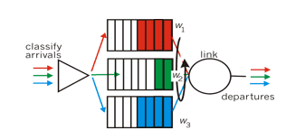

  

---
