# 计算机网络
## 网络层-网络协议
###### IP协议功能及报头字段

$\quad$ 网络层基本功能

$\quad$ $\quad$ 支持多跳寻路将IP数据报送达目的端：目的IP地址

$\quad$ $\quad$ 表明发送端身份：源IP地址

$\quad$ $\quad$ 根据IP头部协议类型，提交给不同上层协议处理：协议

$\quad$ 其它相关问题

$\quad$ $\quad$ 数据报长度大于传输链路的MTU的问题，通过分片机制解决：标识、标志、片偏移

$\quad$ $\quad$ 防止循环转发浪费网络资源（路由错误、设备故障…），通过跳数限制解决：生存时间TTL

$\quad$ $\quad$ IP报头错误导致无效传输，通过头部机校验解决：首部校验和

### IPV4 协议

$\quad$ IPv4协议（网际协议版本4），一种无连接的协议，是互联网的核心，也是使用最广泛的网际协议版本，其后继版本为IPv6

$\quad$ internet协议执行两个基本功能

$\quad$ $\quad$ 寻址(addressing)

$\quad$ $\quad$ $\quad$ 用于路由与转发

$\quad$ $\quad$ 分片(fragmentation)

##### IPV4 数据报格式

$\quad$ 版本： 4bit ，表示采用的IP协议版本

$\quad$ 首部长度： 4bit，表示整个IP数据报首部的长度

$\quad$ 区分服务： 8bit ，该字段一般情况下不使用

$\quad$ 总长度： 16bit ，表示整个IP报文的长度,能表示的最大字节为2^16-1=65535字节

$\quad$ 标识： 16bit ， IP软件通过计数器自动产生，每产生1个数据报计数器加1；在ip分片以后，用来标识同一片分片

$\quad$ 标志： 3bit，目前只有两位有意义； MF，置1表示后面还有分片，置0表示这是数据报片的最后1个；DF，不能分片标志，置0时表示允许分片

$\quad$ 片偏移： 13bit，表示IP分片后，相应的IP片在总的IP片的相对位置

$\quad$ 生存时间TTL(Time To Live) ：8bit,表示数据报在网络中的生命周期，用通过路由器的数量来计量，即跳数（每经过一个路由器会减1）

$\quad$ 协议：8bit，标识上层协议（TCP/UDP/ICMP…）

$\quad$ 首部校验和：16bit ，对数据报首部进行校验，不包括数据部分

$\quad$ 源地址：32bit，标识IP片的发送源IP地址

$\quad$ 目的地址：32bit，标识IP片的目的地IP地址

$\quad$ 选项：可扩充部分，具有可变长度，定义了安全性、严格源路由、松散源路由、记录路由、时间戳等选项

$\quad$ 填充：用全0的填充字段补齐为4字节的整数倍

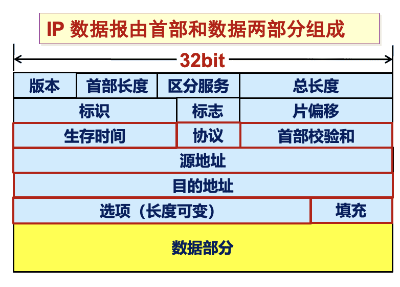

###### 数据报分片
$\quad$ MTU（Maximum Transmission Unit）, 最大传输单元

$\quad$ $\quad$ 链路MTU

$\quad$ $\quad$ 路径MTU (Path MTU)

$\quad$ 分片策略

$\quad$ $\quad$ 允许途中分片：根据下一跳链路的MTU实施分片

$\quad$ $\quad$ 不允许途中分片：发出的数据报长度小于路径MTU（路径MTU发现机制）

$\quad$ 重组策略

$\quad$ $\quad$ 途中重组，实施难度太大

$\quad$ $\quad$ 目的端重组（Internet采用的策略）

$\quad$ $\quad$ 重组所需信息：原始数据报编号、分片偏移量、是否收集所有分片

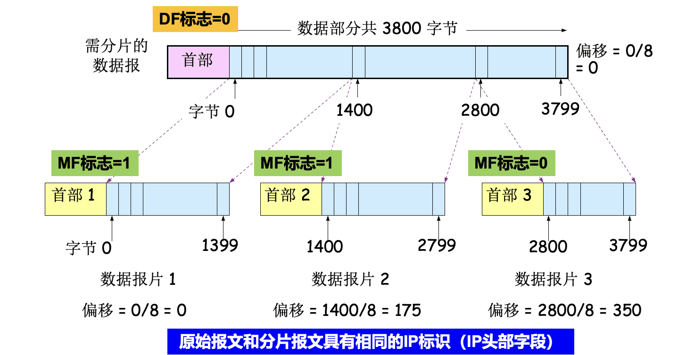

$\quad$ IPv4分组在传输途中可以多次分片

$\quad$ $\quad$ 源端系统，中间路由器

$\quad$ 无论是否途中分片，IPv4分片只在目的IP对应的目的端系统进行重组

$\quad$ IPv6分片机制有较大变化（见IPv6部分的介绍）

##### IP地址

$\quad$ IP地址：网络上的每一台主机（或路由器）的每一个接口都会分配一个唯一的32位的标识符

$\quad$ 由两个字段组成：网络号（网络地址）+主机号（主机地址）

$\quad$ 网络号相同的这块连续IP地址空间称为地址的前缀，或网络前缀

###### 网络地址
$\quad$ 接口(interface)：连接主机/路由器与物理链路之间的模块

$\quad$ $\quad$ 路由器由多个接口

$\quad$ $\quad$ 每个主机通常有1-2个接口

$\quad$ IP地址按接口分配

$\quad$ 接口之间通过链路层技术互相连接

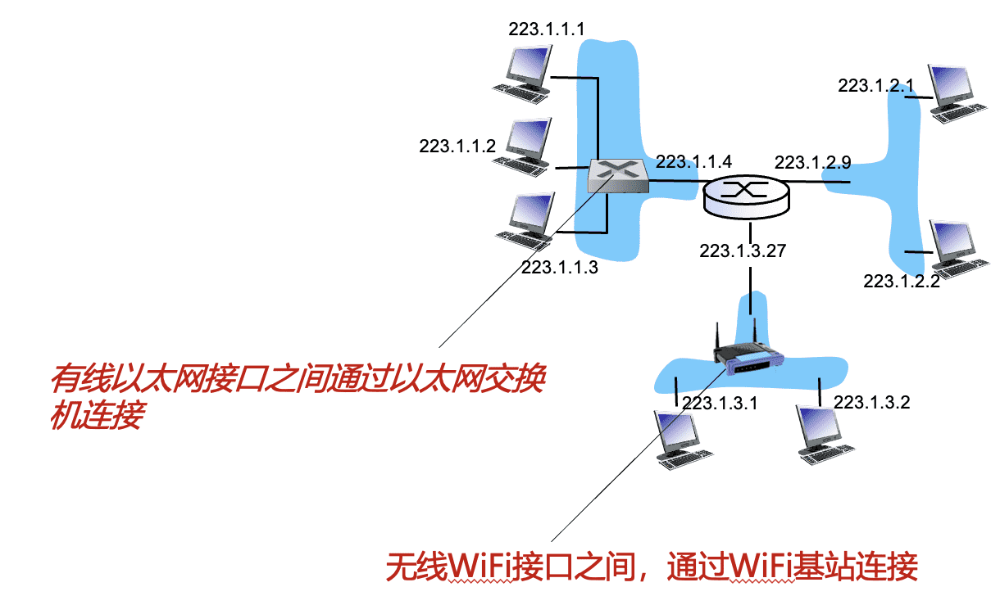

###### 子网划分

$\quad$ IP地址的书写采用点分十进制记法，其中每一段取值范围为0到255

$\quad$ IP地址 = 网络地址 + 主机号

$\quad$ $\quad$ 子网掩码(subnet mask )，与 IP 地址一一对应，是32 bit 的二进制数，置1表示网络位，置0表示主机位

$\quad$ 子网：有相同网络地址的网络接口

$\quad$ $\quad$ 子网内的接口可以不需要网络层路由就可以进行数据传输

$\quad$ $\quad$ 通过链路层技术

$\quad$ 子网划分将一个网络块进行划分以供多个内部网络使用

$\quad$ 子网划分使得网络的组织更加灵活、便于维护和管理

$\quad$ 子网由接口组成，与主机/路由器等设备无关

$\quad$ $\quad$ 一个子网内的接口，可能来自不同设备

$\quad$ $\quad$ 一个设备的多个接口，可能属于不同子网

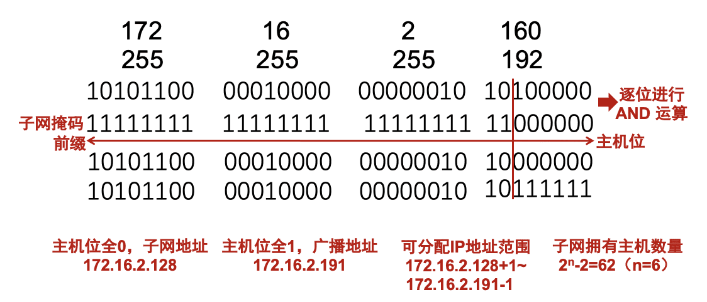

###### 特殊IP地址

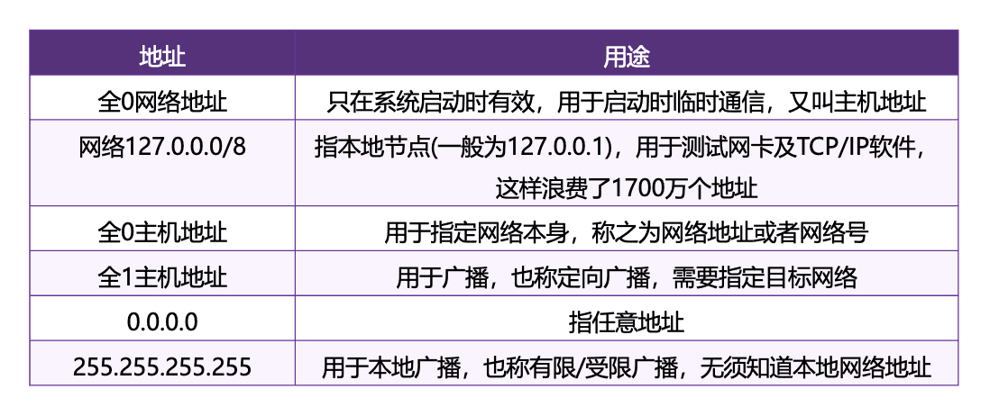

###### 网络地址任意长度：无类域间路由

$\quad$ CIDR（Classless Inter-Domain Routing ）

$\quad$ $\quad$ 网络地址可以是任意长度

$\quad$ $\quad$ 表示：将32位的IP地址划分为前后两个部分，并采用斜线记法，即在IP地址后加上“/”，然后再写上网络前缀所占位数

$\quad$ CIDR子网内的地址，可以进一步划分为多个子网

$\quad$ $\quad$ 对外只暴露1个CIDR网络地址

$\quad$ $\quad$ 这种地址的聚合常称为地址聚合（address aggregation）或路由聚合（route aggregation）

 $\quad$ $\quad$ 子网可以无需更改地址进行迁移

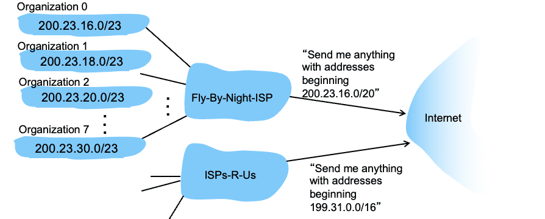

###### 网络地址固定长度：分类编址

$\quad$ 与无类域间相对：网络地址长度固定

$\quad$ IP地址共分为A、B、C、D、E五类，A类、B类、C类为单播地址

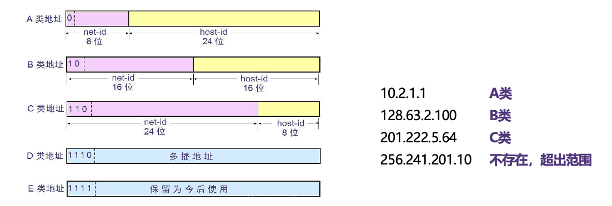

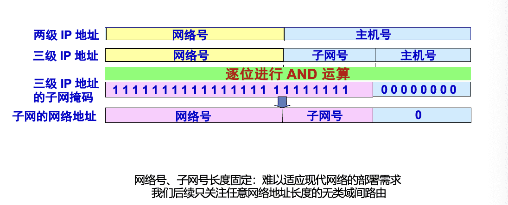

###### 最长前缀匹配

 $\quad$ 最长前缀匹配（Longest prefix match）

$\quad$ $\quad$ CIDR+路由聚合，需要最长前缀匹配

$\quad$ 即IP地址与IP前缀匹配时，总是选取子网掩码最长的匹配项

$\quad$ 主要用于路由器转发表项的匹配，也应用于ACL规则匹配等

### ARP协议

###### MAC地址
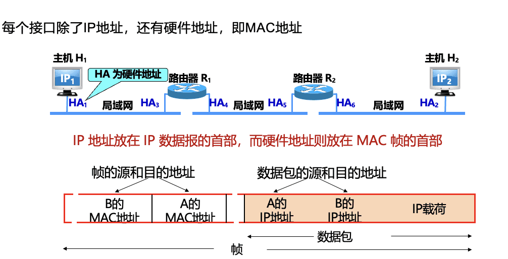
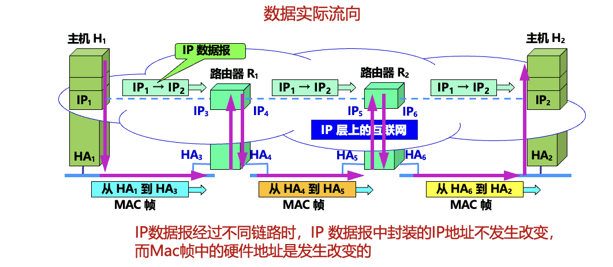
#### IP包转发
##### 直接交付（子网内转发）：
$\quad$ 与目的主机在同一个IP子网内（使用目的MAC地址）

$\quad$ $\quad$ 通过ARP协议获取子网内IP-MAC映射

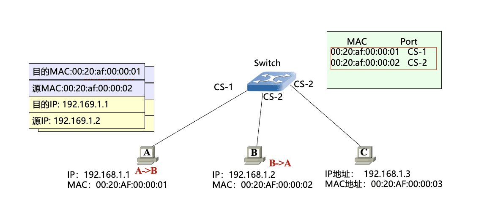

$\quad$ IP数据包转发：从主机A到主机B

$\quad$ $\quad$ 检查目的IP地址的网络号部分

$\quad$ $\quad$ 确定主机B与主机A属相同IP网络

$\quad$ $\quad$ 将IP数据包封装到链路层帧中，直接发送给主机B

$\quad$ $\quad$ $\quad$ 封装时，在帧头部填写A与B的MAC地址

###### ARP地址解析

$\quad$ A已知B的IP地址，需要获得B的MAC地址（物理地址）

$\quad$ 如果A的ARP表中缓存有B的IP地址与MAC地址的映射关系，则直接从ARP表获取

$\quad$ 如果A的ARP表中未缓存有B的IP地址与MAC地址的映射关系，则A广播包含B的IP地址的ARP query分组

$\quad$ $\quad$ 在局域网上的所有节点都可以接收到ARP query

$\quad$ B接收到ARP query分组后，将自己的MAC地址发送给A

$\quad$ A在ARP表中缓存B的IP地址和MAC地址的映射关系

$\quad$ $\quad$ 超时时删除

###### ARP工作过程

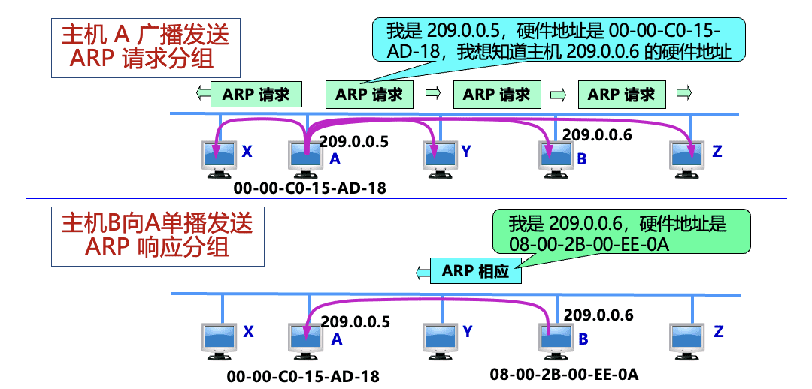

##### 间接交付（跨子网转发）：

$\quad$ 与目的主机不在同一个IP子网内（使用目的IP地址）

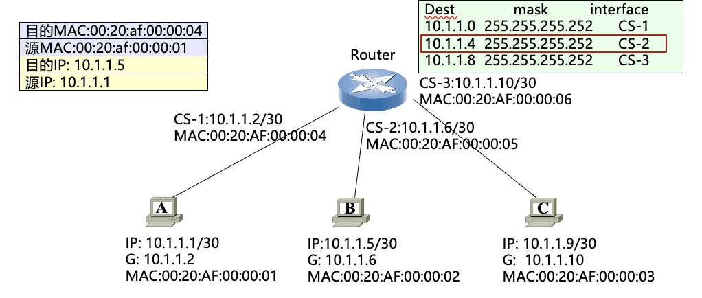

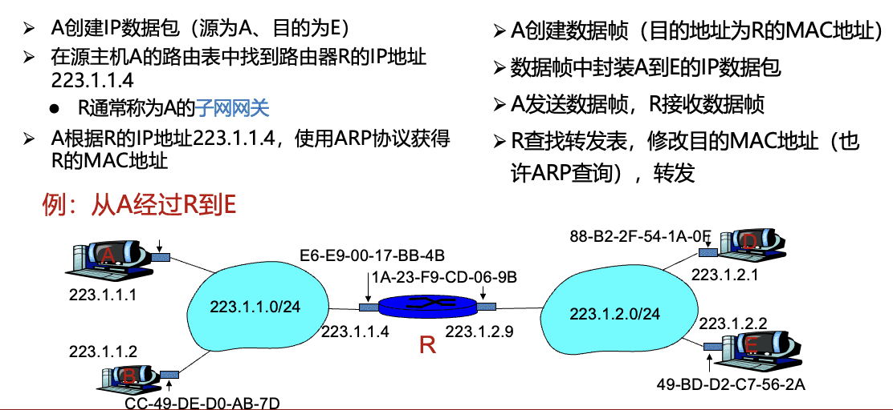

#### ARP 安全问题
$\quad$ ARP Spoofing攻击

$\quad$ $\quad$ 攻击者随意地发送ARP请求或ARP响应（可以使用任意源IP地址与MAC地址）

$\quad$ $\quad$ ARP协议是无状态的：即使受害者之前没发过ARP请求，收到一个ARP响应时，也会更新ARP表

$\quad$ $\quad$ $\quad$ 受害者后续数据将被发往攻击者提供的MAC地址

$\quad$ $\quad$ 攻击者可以修改自己的IP转发功能，将截获的受害者数据继续转发

### DHCP协议
###### IPv4地址如何获取

$\quad$ 公有IP地址要求全球唯一

$\quad$ $\quad$ ICANN（Internet Corporation for Assigned Names and Numbers）即互联网名字与编号分配机构向ISP分配，ISP再向所属机构或组织逐级分配

$\quad$ 静态设定

$\quad$ $\quad$ 申请固定IP地址，手工设定，如路由器、服务器

$\quad$ 动态获取

$\quad$ $\quad$ 使用DHCP协议或其他动态配置协议

$\quad$ $\quad$ 当主机加入IP网络，允许主机从DHCP服务器动态获取IP地址

$\quad$ $\quad$ 可以有效利用IP地址，方便移动主机的地址获取

$\quad$ $\quad$ 也可以申请延长IP地址的占用
###### 场景
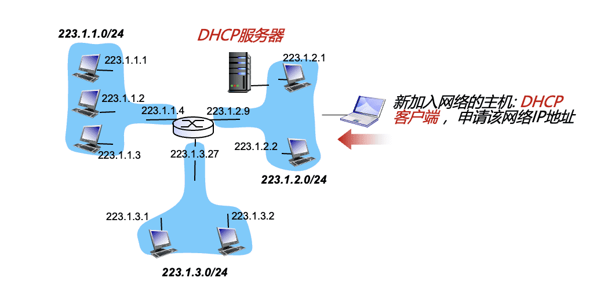
###### 架构
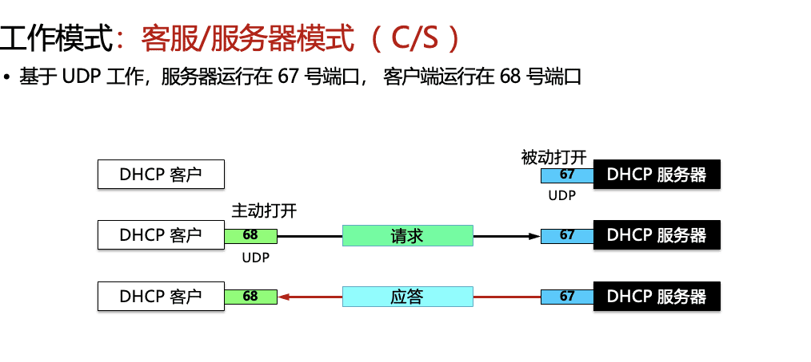
###### 工作过程

$\quad$ DHCP 客户从UDP端口68以广播形式向服务器发送发现报文  (DHCP DISCOVER)

$\quad$ DHCP 服务器广播或单播发出提供报文（DHCP OFFER）

$\quad$ DHCP 客户从多个DHCP服务器中选择一个，并向其以广播形式发送DHCP请求报文（DHCP REQUEST）

$\quad$ 被选择的DHCP服务器广播或单播发送确认报文（DHCP ACK）

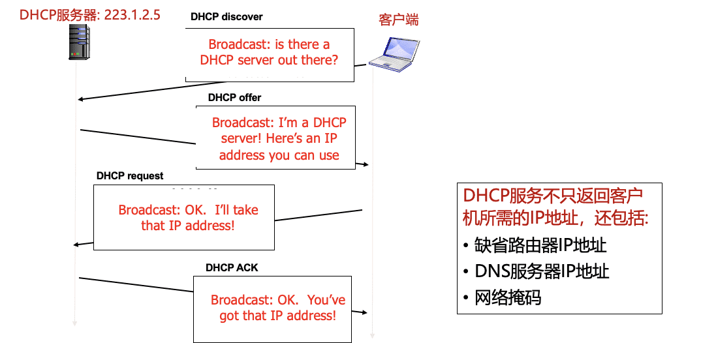

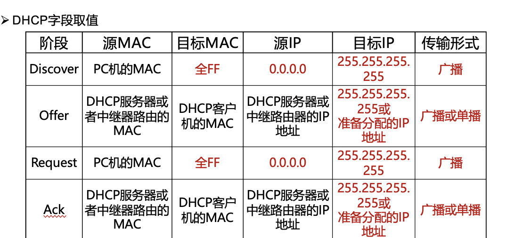

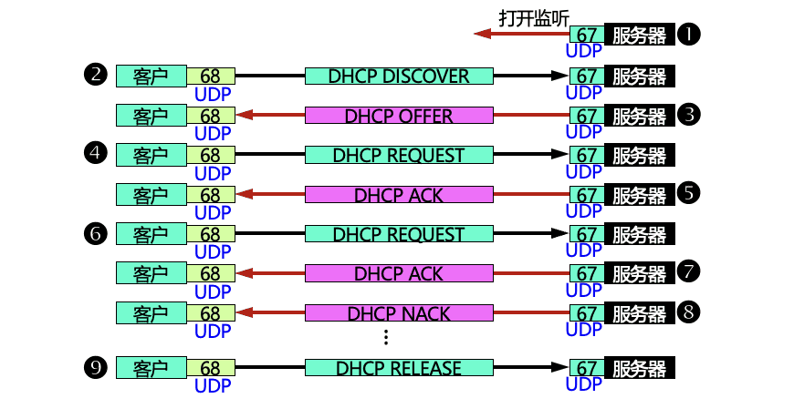

###### DHCP安全问题

$\quad$ DHCP耗竭攻击（DHCP Starvation Attack）

$\quad$ $\quad$ 攻击者短时间内发送大量DHCP请求，将子网内可用IP地址全部占用

$\quad$ $\quad$ 后续主机无法获取新IP地址

$\quad$ 流氓DHCP（Rogue DHCP attack ）

$\quad$ $\quad$ （通常在DHCP耗竭攻击之后）

$\quad$ $\quad$ 攻击者启动自己的DHCP服务，给网络中的其他主机提供虚假的配置，包括DNS服务器IP与网关IP

### NAT协议
###### 网络地址转换

$\quad$ 网络地址转换(NAT)用于解决IPv4地址不足的问题，是一种将私有（保留）地址转化为公有IP地址的转换技术

$\quad$ 私有IP地址：

$\quad$ $\quad$ A类地址：10.0.0.0--10.255.255.255

$\quad$ $\quad$ B类地址：172.16.0.0--172.31.255.555

$\quad$ $\quad$ C类地址：192.168.0.0--192.168.255.255

$\quad$ NAT根据不同的IP上层协议进行NAT表项管理

$\quad$ $\quad$ TCP，UDP

$\quad$ 传输层TCP/UDP拥有16-bit 端口号字段

$\quad$ $\quad$ 所以一个WAN侧地址可支持60,000+个并行连接

###### NAT的优势
$\quad$ 节省合法地址，减少地址冲突

$\quad$ 灵活连接Internet

$\quad$ 保护局域网的私密性

###### NAT工作机制

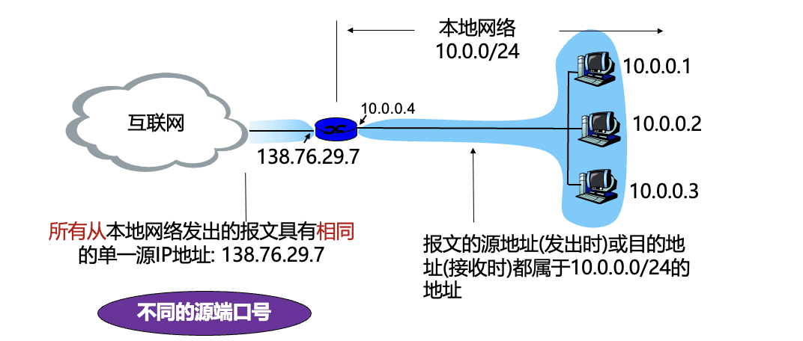

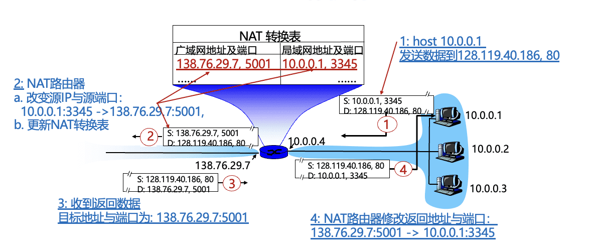

$\quad$ 出数据报：外出数据报用NAT IP地址(全局), 新port # 替代  源IP地址(私有), port #

$\quad$ NAT转换表：每个 (源IP地址, port #)到(NAT IP地址, 新port #) 映射项

$\quad$ 入数据报：对每个入数据报的地址字段用存储在NAT表中的(源IP地址, port #)替代对应的 (NAT IP地址, 新port #)

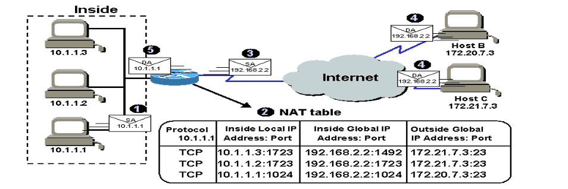

###### 问题或缺点

$\quad$ 违反了IP的结构模型，路由器处理传输层协议

$\quad$ 违反了端到端的原则

$\quad$ 违反了最基本的协议分层规则

$\quad$ 不能处理IP报头加密

$\quad$ 新型网络应用的设计者必须要考虑 NAT场景，如 P2P应用程序

### ICMP协议

$\quad$ ICMP: 互联网控制报文协议

$\quad$ $\quad$ ICMP 允许主机或路由器报告差错情况和提供有关异常情况的报告

$\quad$ $\quad$ 由主机和路由器用于网络层信息的通信

$\quad$ $\quad$ ICMP 报文携带在IP 数据报中： IP上层协议号为1

$\quad$ ICMP报文类型

$\quad$ $\quad$ ICMP 差错报告报文

$\quad$ $\quad$ $\quad$ 终点不可达：不可达主机、不可达网络，无效端口、协议

$\quad$ $\quad$ ICMP 询问报文

$\quad$ $\quad$ $\quad$ 回送请求/回答 (ping使用)

###### ICMP报文格式
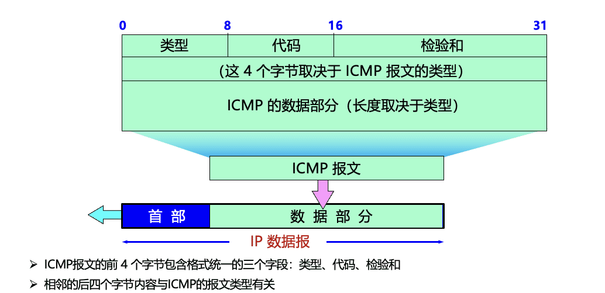
###### 报文类型
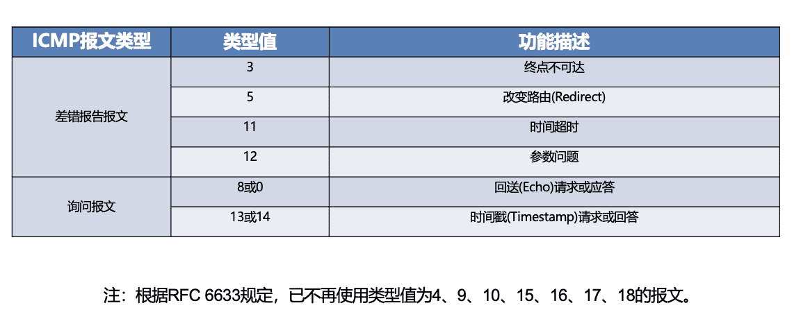
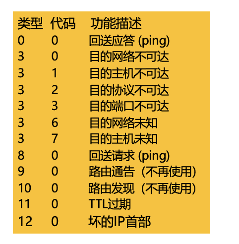
###### 差错报告报文
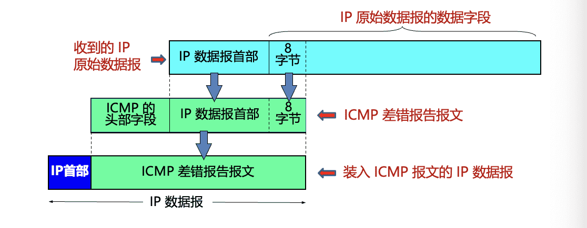
###### Ping

$\quad$ PING (Packet InterNet Groper)

$\quad$ $\quad$ PING 用来测试两个主机之间的连通性

$\quad$ $\quad$ PING 使用了 ICMP 回送请求与回送回答报文

---
