# 计算机网络
## 网络层-路由
### 网络路由

###### 目标

$\quad$ 为每对（发送主机，接收主机）找到“好的”网络传输路径

$\quad$ 路径：一系列连接发送主机与接收主机的路由器，用于传输数据报文

$\quad$ 好路径标准

$\quad$ $\quad$ 低开销

$\quad$ $\quad$ 速度快

$\quad$ $\quad$ 拥塞少

###### 网络的图抽象

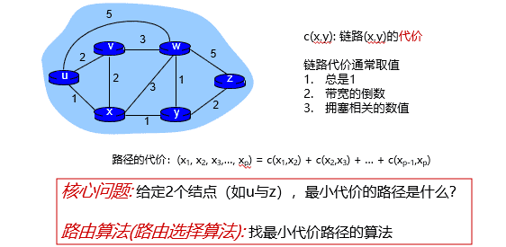

###### 基于最短路的路由算法

$\quad$ 最短路径算法：计算每个结点到其他所有结点的最短路径

$\quad$ 所有的源节点到一个指定目标节点的最优路径的集合构成一棵以目标节点为根的树

$\quad$ $\quad$ 称为汇集树（sink tree）

$\quad$ 经典的最短路径算法

$\quad$ $\quad$ Dijkstra算法

$\quad$ $\quad$ Bellman-Ford算法

$\quad$ 应用经典算法时，还需要考虑现实情形：

$\quad$ $\quad$ 简单性：每台路由器计算与存储资源有限

$\quad$ $\quad$ 异步性：各个路由器独立、异步工作

$\quad$ $\quad$ 鲁棒性：网络状态不断变化，甚至可能发生结点与链路故障

$\quad$ $\quad$ 公平性：每条路径不会过多消耗带宽等资源

$\quad$ 路由算法分类

$\quad$ $\quad$ 全局:

$\quad$ $\quad$ $\quad$ 每个路由器都有完整的网络拓扑与链路开销等信息

$\quad$ $\quad$ $\quad$ 链路状态算法（基于Dijkstra算法）

$\quad$ $\quad$ 局部:

$\quad$ $\quad$ $\quad$ 每个路由器只知道邻居结点，以及到邻居结点的链路开销

$\quad$ $\quad$ $\quad$ 需要结点与邻居不断交换信息，并反复迭代更新

$\quad$ $\quad$ $\quad$ 距离向量算法（基于Bellman-Ford算法）

### 路由选择算法

#### 距离向量算法

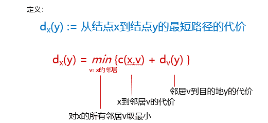

###### 单机Bellman-Ford算法

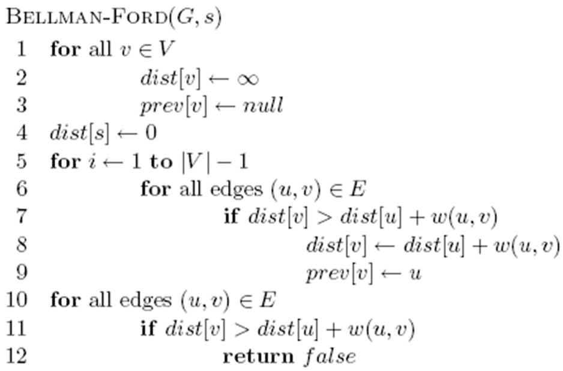

##### 距离向量算法

$\quad$ 从单机Bellman-Ford到分布式更新

$\quad$ 数据的分布式：将单机算法维护的信息分散到各个结点

$\quad$ 计算的分布式：将算法更新操作分散到各个结点

###### 数据分布式

$\quad$ 每个结点x维护信息

$\quad$ $\quad$ 到达每个邻居结点v的开销：c(x,v)

$\quad$ $\quad$ 距离向量（DV）：$Dx = [Dx(y): y є N ]$，该结点x到网络中所有其他结点y的最小代价的估计值

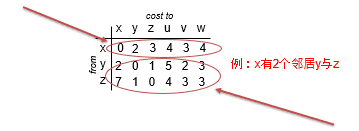

  

$\quad$ 每个邻居结点v的距离向量，即对于所有邻居v，结点x保存$Dv = [Dv(y): y є N]$

  

###### 计算分布式

$\quad$ 每个结点不断重复:

$\quad$ $\quad$ （发送）每个节点向邻居发送它自己到某些节点的距离向量

$\quad$ $\quad$ （接收）当节点x接收到来自邻居y的新DV估计，更新所保存的y的DV信息

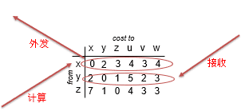

$\quad$ $\quad$ （计算）使用B-F方程更新其自己的DV :Dx(y) ← minv{c(x,v) + Dv(y)}  for each node y ∊ N

$\quad$ $\quad$ 上述过程迭代执行，Dx(y)收敛为实际最小费用 dx(y)

###### 算法特点

$\quad$ 异步：结点迭代频率不需要一致

$\quad$ 迭代：每次某个结点上的迭代有2种触发

$\quad$ $\quad$ 本地链路代价发生改变

$\quad$ $\quad$ 收到来自邻居的DV更新

$\quad$ 分布式：结点直接互相协作

$\quad$ $\quad$ 每个结点当且仅当DV信息发生变化时通知其他结点

$\quad$ $\quad$ 邻居结点根据需要通知自己的邻居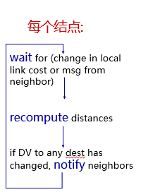

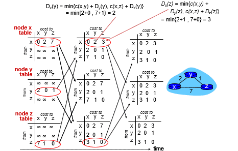

###### 链路状态改变：代价变小

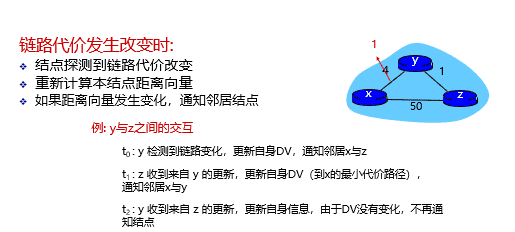

###### 链路状态改变：代价变大

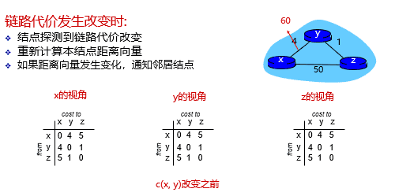

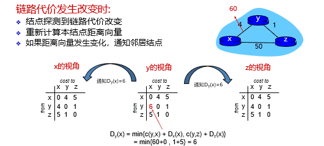

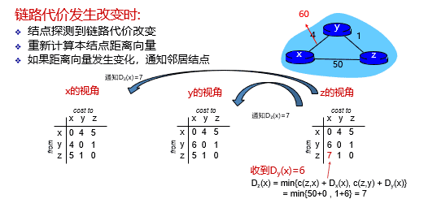

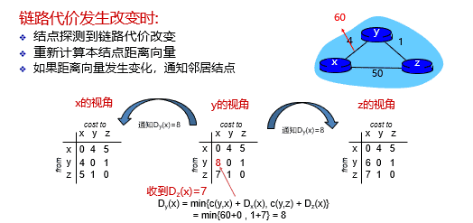

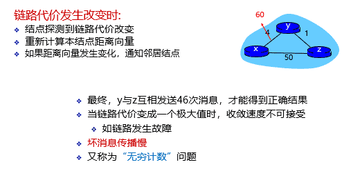

###### 链路状态改变：毒性逆转

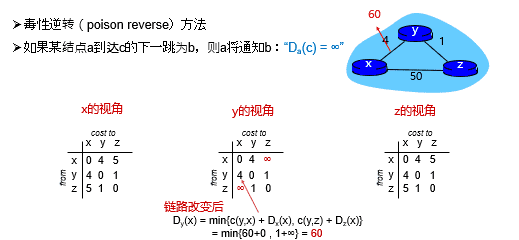

$\quad$ 毒性逆转无法解决一般性的无穷计数问题

  

##### 链路状态算法

$\quad$ 基于Dijkstra算法

$\quad$ 每个结点都知道网络拓扑与链路开销

$\quad$ $\quad$ 通过链路状态广播得到

$\quad$ $\quad$ 所有结点都有相同的信息

$\quad$ 每个结点计算以自己为源节点，到其他所有结点的最短路径

$\quad$ $\quad$ 生成该结点的转发表

$\quad$ 符号:

$\quad$ $\quad$ c(x,y): x到y的链路开销，∞表示2个结点之间没有边

$\quad$ $\quad$ D(v): 当前到达目的结点v的路径代价

$\quad$ $\quad$ p(v): 到达目的结点v的上一跳结点

$\quad$ $\quad$ N' : 最短路已经确定的结点集合

###### Dijkstra算法

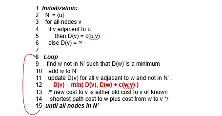

##### 链路状态算法

$\quad$ 链路状态（Link State）路由可分为五个部分：

$\quad$ $\quad$ 1. 发现邻居，了解他们的网络地址；

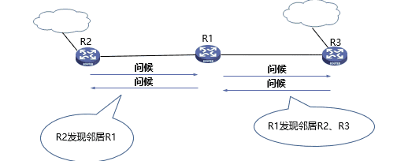

$\quad$ $\quad$ 2. 设置到每个邻居的成本度量；

$\quad$ $\quad$ $\quad$ 开销/度量/代价：

$\quad$ $\quad$ $\quad$ $\quad$ 自动发现设置或人工配置

$\quad$ $\quad$ $\quad$ $\quad$ 度量：带宽、跳数、延迟、负载、可靠性等

$\quad$ $\quad$ $\quad$ 常用度量：链路带宽（反比）

$\quad$ $\quad$ $\quad$ $\quad$ 例如：1-Gbps以太网的代价为1，100-Mbps以太网的代价为10

$\quad$ $\quad$ $\quad$ 可选度量：延迟

$\quad$ $\quad$ $\quad$ $\quad$ 发送一个echo包，另一端立即回送一个应答

$\quad$ $\quad$ $\quad$ $\quad$ 通过测量往返时间RTT，可以获得一个合理的延迟估计值

$\quad$ $\quad$ 3. 构造一个分组，分组中包含最新的链路信息；

$\quad$ $\quad$ $\quad$ 构造链路状态分组（link state packet，LSP）

$\quad$ $\quad$ $\quad$ $\quad$ 发送方标识

$\quad$ $\quad$ $\quad$ $\quad$ 序列号

$\quad$ $\quad$ $\quad$ $\quad$ 年龄（存活时间）

$\quad$ $\quad$ $\quad$ $\quad$ 邻居列表：包含邻居与对应的链路开销

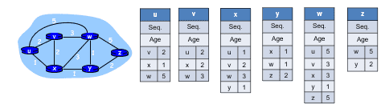

$\quad$ $\quad$ 4. 将此分组发送给其他的路由器；

$\quad$ $\quad$ $\quad$ 每个LSP分组包含一个序列号，且递增

$\quad$ $\quad$ $\quad$ 路由器记录所收到的所有（源路由器、序列号）对

$\quad$ $\quad$ $\quad$ 当一个新分组到达时，路由器根据记录判断：

$\quad$ $\quad$ $\quad$ $\quad$ 如果是新分组，洪泛广播

$\quad$ $\quad$ $\quad$ $\quad$ 如果是重复分组，丢弃

$\quad$ $\quad$ $\quad$ $\quad$ 如果是过时分组，拒绝

$\quad$ $\quad$ 5. 计算到其他路由器的最短路径：Dijkstra算法

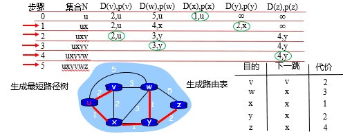

##### 比较

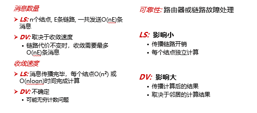

  

### 路由协议

#### 层次路由

###### 层次路由-产生原因

$\quad$ 现实情况：

$\quad$ $\quad$ 地址分配往往是不连续的，难以进行高效的地址聚合

$\quad$ $\quad$ 每个网络的网络管理员有自己的管理方法和思路，并不希望每个路由器都干涉本网络内部的地址分配等问题

$\quad$ 层次路由可以解决：

$\quad$ $\quad$ 网络扩展性问题：当网络扩大时，控制路由表条目和路由表存储空间的增长

$\quad$ $\quad$ 管理的自治问题：网络管理员可以控制和管理自己网络的路由，不需要连续地址空间

###### 层次路由-基本思路

$\quad$ 互联网由大量不同的网络互连，每个管理机构控制的网络是自治的

$\quad$ 自治系统（AS，Autonomous System）

$\quad$ $\quad$ 一个管理机构控制之下的网络

$\quad$ $\quad$ 一个AS内部通常使用相同的路由算法/路由协议，使用统一的路由度量（跳数、带宽、时延 …）

$\quad$ $\quad$ 不同的AS可以使用不同的路由算法/路由协议

$\quad$ $\quad$ 每个AS有一个全球唯一的ID号：AS ID

$\quad$ 自治系统内的还可以进一步划分层次

$\quad$ 自治系统内部使用内部网关路由协议，Interior Gateway Protocols (IGP)

$\quad$ $\quad$ 每个自治系统域内路由算法可不同

$\quad$ $\quad$ 典型IGP协议：OSPF，RIP，IS-IS，IGRP，EIGRP……

$\quad$ 自治系统之间之间使用外部网关路由协议，Exterior Gateway Protocols (EGP)

$\quad$ $\quad$ 各自治系统域之间的路由需统一

$\quad$ $\quad$ 典型EGP协议：BGP

###### 层次路由-效果

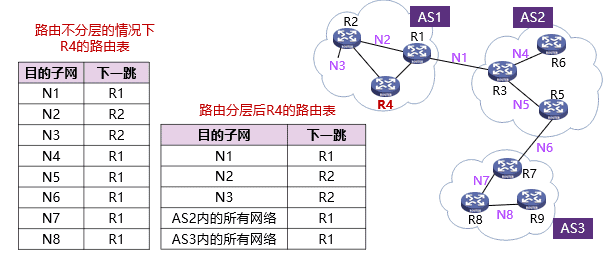

#### AS内部路由：OSPF（对应链路状态算法）、RIP（对应距离向量算法）

##### OSPF

$\quad$ OSPF（Open Shortest Path First）开放最短路径优先协议于1989 年开发

$\quad$ 采用分布式的链路状态算法

$\quad$ OSPF协议的基本思想

$\quad$ $\quad$ 向本自治系统中所有路由器洪泛信息

$\quad$ $\quad$ 发送的信息：与本路由器相邻的所有路由器的链路状态

$\quad$ $\quad$ 只有当链路状态发生变化时路由器才用洪泛法发送此信息

###### 区域

$\quad$ OSPF将AS内路由器进一步划分为区域

$\quad$ $\quad$ 一个区域是一组路由器及它们内部链路构成的子图(subgraph)

$\quad$ 区域内部同步完整的区域内链路，区域之间只同步区域间链路

$\quad$ 使用层次结构的区域划分，上层的区域叫做主干区域 (backbone area)，其他区域都必须与主干区域相连

$\quad$ 非主干区域之间不允许直接发布区域间路由信息

$\quad$ 区域也不能太大，在一个区域内的路由器最好不超过 200 个

$\quad$ 划分区域可以缩小链路状态传输规模，减少网络流量

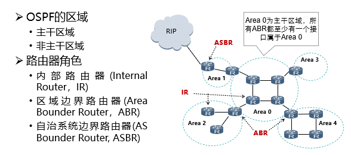

###### 链路状态同步

$\quad$ “链路状态”就是说明本路由器都和哪些路由器相邻，以及该链路的“度量”(metric)

$\quad$ $\quad$ OSPF度量值一般包括费用、距离、时延、带宽等

$\quad$ 由于各路由器之间频繁地交换链路状态信息，因此所有的路由器最终都能建立一个链路状态数据库LSDB

$\quad$ LSDB数据库：区域内的拓扑结构图，它在区域内是一致的

$\quad$ $\quad$ 区域：AS进一步划分后的路由器子集

$\quad$ $\quad$ 数据库条目：Link State Advertisement，LSA

$\quad$ $\quad$ 链路状态数据库的同步：所有路由器数据库达成一致的过程

###### 邻居状态机

$\quad$ 两个相邻路由器的关系分为两种

$\quad$ $\quad$ 邻居（neighboring)

$\quad$ $\quad$ 完全邻接（adjacent）

$\quad$ 邻居

$\quad$ $\quad$ 互相知道存在链路相连

$\quad$ $\quad$ 由hello报文发现

$\quad$ 完全邻接

$\quad$ $\quad$ 路由状态数据库完成同步

$\quad$ $\quad$ 并非所有的邻居关系都是邻接关系

$\quad$ OSPF：通过一系列报文交互，为相邻路由器最终确立完全邻接关系

###### 五种报文

$\quad$ Hello 报文

$\quad$ $\quad$ 最常用的一种报文，用于发现、维护邻居关系

$\quad$ 数据库描述（Database Description, DD）报文

$\quad$ $\quad$ 用于描述自己的LSDB

$\quad$ $\quad$ 内容包括LSDB 中每一条LSA 的Header 头部，对端路由器根据LSA Header 就可以判断出是否已有这条LSA

$\quad$ 链路状态请求（LSA Request, LSR）报文

$\quad$ $\quad$ 用于请求缺少的LSA，内容包括所需要的LSA 的摘要

$\quad$ 链路状态更新（LSA Update, LSU）报文

$\quad$ $\quad$ 用于向对端路由器发送所需要的LSA, 内容是多条LSA（全部内容）的集合

$\quad$ 链路状态确认（Link State Acknowledgment, LSACK）报文

$\quad$ $\quad$ 用来对接收到的LSU 报文进行确认

###### 报文格式

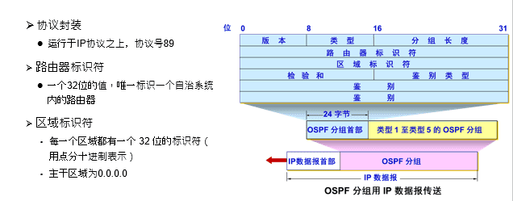

###### 报文交互

$\quad$ 目的：发现邻居（邻居状态）+ 数据库同步（完全邻接状态）

$\quad$ 交互过程可以用状态机描述

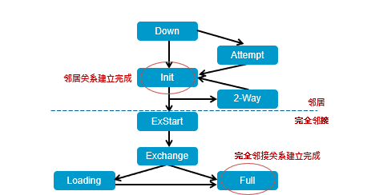

$\quad$ 发现邻居

$\quad$ $\quad$ 使用HELLO报文

$\quad$ $\quad$ 试图建立邻居关系

$\quad$ $\quad$ 最终，完成一对路由器间邻居关系的建立（Init状态）

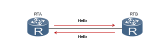

$\quad$ Exchange状态：交换数据库描述

$\quad$ $\quad$ 交换时，选择一个服务器为Master，另一个为Slave

$\quad$ $\quad$ 以Master的序列号为准

$\quad$ $\quad$ DD报文包含LSA的头部信息，用来描述LSDB的摘要信息

$\quad$ Loading状态：同步数据库内容，建立完全邻接关系

$\quad$ $\quad$ LSR用于向对方请求所需的LSA

$\quad$ $\quad$ LSU用于向对方发送其所需要的LSA

$\quad$ $\quad$ LSACK用于向对方发送收到LSA的确认

$\quad$ Full状态：完全邻接关系建立完毕

  

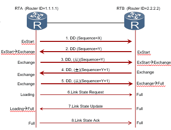

###### 特性

$\quad$ OSPF的特点：适合大型网络

$\quad$ $\quad$ 支持无类域间路由（CIDR）

$\quad$ $\quad$ 无路由自环

$\quad$ $\quad$ 收敛速度快

$\quad$ $\quad$ 支持多条等值路由

$\quad$ $\quad$ 计算、存储开销大（Dijkstra算法、LSDB数据库）

##### RIP

$\quad$ 路由选择协议RIP（ Routing Information Protocol）是基于距离矢量算法的协议

$\quad$ 使用跳数衡量到达目的网络的距离

$\quad$ $\quad$ RIP 认为一个好的路由就是它通过的路由器的数目少，即“距离短”

$\quad$ $\quad$ RIP 一条路径最多只能包含 15 个路由器

$\quad$ RIP协议的基本思想

$\quad$ $\quad$ 仅和相邻路由器交换信息

$\quad$ $\quad$ 路由器交换的内容是自己的路由表

$\quad$ $\quad$ 周期性更新：30s

###### 工作过程

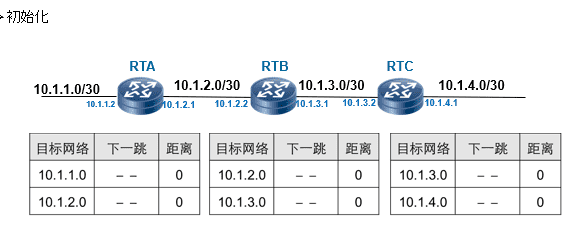

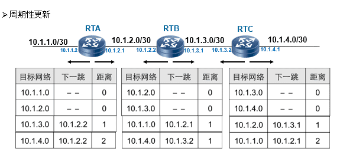

###### 报文格式

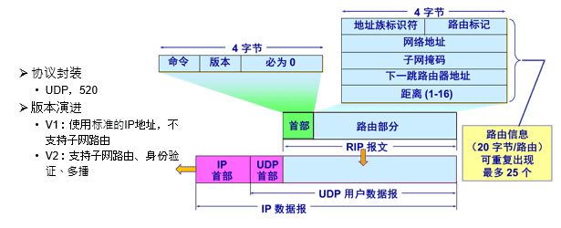

  

###### 特性

$\quad$ RIP协议的特点

$\quad$ $\quad$ 算法简单，易于实现

$\quad$ $\quad$ 收敛慢

$\quad$ $\quad$ 需要交换的信息量较大

$\quad$ RIP协议的适用场合

$\quad$ $\quad$ 中小型网络

$\quad$ RIP协议的防环路机制

$\quad$ $\quad$ 毒性反转

$\quad$ $\quad$ 水平分割

$\quad$ $\quad$ 其他

#### AS之间路由：BGP

###### AS之间路由要解决的问题

$\quad$ 规模问题

$\quad$ $\quad$ 全球AS数量：5万+

$\quad$ $\quad$ AS路由器数量：百万级别

$\quad$ $\quad$ 仍在增长

$\quad$ 策略问题

$\quad$ $\quad$ 各个AS认可的链路代价不一致

$\quad$ $\quad$ 每个AS：不仅决定将流量发往何处，还需考虑哪些流量可以发到自身（然后转发）

$\quad$ AS内路由不可行

$\quad$ $\quad$ 链路状态算法、距离向量算法：基于最短路

$\quad$ $\quad$ $\quad$ AS之间，“最短”缺乏共识定义

$\quad$ $\quad$ 计算开销

$\quad$ $\quad$ $\quad$ 链路状态：维护全网拓扑、计算全网最短路

$\quad$ $\quad$ $\quad$ 距离向量：收敛时间长

##### BGP-网关路由协议

$\quad$ 路由协议

$\quad$ $\quad$ 内部网关协议 IGP： 有 RIP 和、OSPF、ISIS 等多种具体的协议

$\quad$ $\quad$ 外部网关协议 EGP：目前使用的协议就是 BGP

$\quad$ 边界网关协议BGP (Border Gateway Protocol)

$\quad$ $\quad$ 目前互联网中唯一实际运行的自治域间的路由协议

$\quad$ BGP功能

$\quad$ $\quad$ eBGP：从相邻的AS获得网络可达信息

$\quad$ $\quad$ iBGP： 将网络可达信息传播给AS内的路由器

$\quad$ $\quad$ 基于网络可达信息和策略决定到其他网络的“最优”路由

###### eBGP&iBGP连接

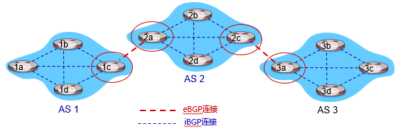

###### 路径通告

$\quad$ BGP路由器之间建立TCP连接，通告路径：

$\quad$ BGP会话: 两个BGP路由器通过TCP连接交换BGP报文

$\quad$ $\quad$ 通告到不同网络前缀的路径，即路径向量协议

$\quad$ 路径向量：由一系列AS组成的序列

$\quad$ $\quad$ 例：当AS3的路由器3a向AS2的路由器2c通告路径”AS3, X”时，AS3向AS2承诺它会向X转发数据包

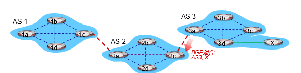

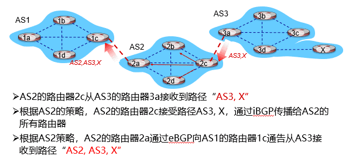

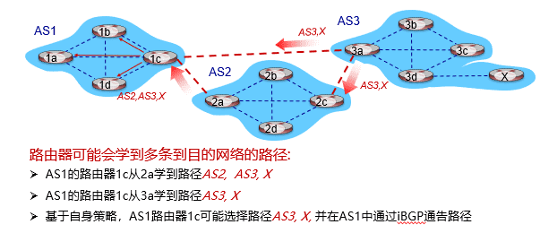

$\quad$ 一个路径通告信息经过的结点数是自治系统数的量级

$\quad$ 每一个自治系统边界路由器的数目是很少的

$\quad$ 一个AS在BGP刚刚运行时，向相邻AS获取整个BGP路由表

$\quad$ $\quad$ 以后只需要在发生变化时更新有变化的部分

$\quad$ BGP为每个AS提供：

$\quad$ $\quad$ 从邻居AS获取网络可达信息 ( eBGP协议 )

$\quad$ $\quad$ 传播可达信息给所有的域内路由器 ( iBGP协议 )

$\quad$ $\quad$ 根据“可达信息”和“策略”决定路由

###### 报文

$\quad$ BGP通过TCP的179端口进行路径通告

$\quad$ BGP报文包括

$\quad$ $\quad$ Open报文：用于建立BGP对等体（peer）之间的会话连接，协商BGP参数（该过程需要认证）

$\quad$ $\quad$ Update报文：通告/撤销路径

$\quad$ $\quad$ Keepalive报文：用于保持BGP会话连接

$\quad$ $\quad$ Notification报文：用于差错报告和关闭BGP连接

###### 路径属性

$\quad$ BGP路径：路径前缀（目的网络）+属性

$\quad$ 两个重要属性

$\quad$ $\quad$ AS路径（AS-PATH）：想要到达某个目的网络，需要经过的所有AS号；如：AS 67, AS 17

$\quad$ $\quad$ 下一跳（NEXT-HOP）：说明路由信息对应的下一跳IP地址

$\quad$ 网关路由器接收到路由通告时，通过既定策略采纳或拒绝(accept/ decline)

###### 转发表

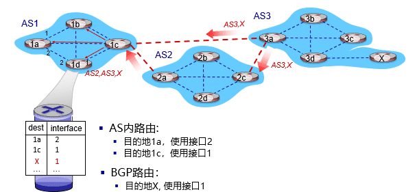

###### 路由策略

$\quad$ 路由器可能从多个对等体收到针对同一目的IP的路由

$\quad$ 需要选择一条最佳路由

$\quad$ 选择规则：自上向下，依次排序

$\quad$ $\quad$ 本地偏好值属性：政策决策

$\quad$ $\quad$ 最短的AS-PATH

$\quad$ $\quad$ 最近的NEXT-HOP路由器

$\quad$ $\quad$ 附加标准…

$\quad$ $\quad$ 最低路由器ID

**AS间策略**

$\quad$ 路由器使用策略决定接受或拒绝接收到的路由通告

$\quad$ 路由器也会基于策略决定是否向其他相邻AS通告路径信息

$\quad$ 例如：X连接到两个提供者网络（dual-homed）

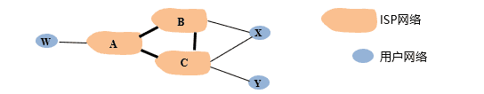

$\quad$ $\quad$ X为用户网络，X不希望从B到C的数据包经过X

$\quad$ $\quad$ X则不向B通告到C的路由

$\quad$ $\quad$ A向B通告路径AW

$\quad$ $\quad$ B通告到目的W的路径为BAW

$\quad$ $\quad$ B是否向C通告路径BAW

$\quad$ $\quad$ $\quad$ 由于W和C都不是B的用户，B要迫使C通过A路由到W

$\quad$ $\quad$ $\quad$ B只路由来自于或到达其用户的数据包

**AS内策略**

$\quad$ 各个AS决定

$\quad$ 实际常用：“热土豆（Hot Potato)策略”

$\quad$ $\quad$ 选择最近的BGP出口，即最小化报文在本AS停留时间

#### 其他路由技术

##### 广播路由

$\quad$ 广播（Broadcasting）：源主机同时给全部目标地址发送同一个数据包

$\quad$ 例：服务器希望将视频广播给3个网络中的所有30个用户，有哪些办法？

###### 方法1：给每个主机单独发送一个数据包

$\quad$ 效率低、浪费带宽

$\quad$ Server需要知道每个目的地址

###### 方法2：多目标路由（multi-destination routing）

$\quad$ 在需要转发的路由器线路复制一次该数据报

$\quad$ 网络利用率高

$\quad$ Server依然需要知道所有的目的地址

###### 方法3：泛洪（flooding）

$\quad$ 一种将数据包发送到所有网络节点的简单方法

$\quad$ 将每个进入数据包发送到除了进入线路外的每条出去线路

$\quad$ 用途

$\quad$ $\quad$ 保证性：一种有效广播手段，可确保数据包被传送到网络中每个节点

$\quad$$\quad$ 容错性：即使大量路由器被损坏，也能找到一条路径（如果存在）

$\quad$ $\quad$ 简单性：仅需知道自己的邻居

$\quad$ **无控制的泛洪**

$\quad$ $\quad$ 实现广播最显而易见的技术

$\quad$ $\quad$ 环路可能导致广播风暴

$\quad$ $\quad$ 路由器可能收到多个副本

$\quad$ $\quad$ 节点需要跟踪已泛洪的数据包以阻止洪泛

$\quad$ $\quad$ 即使利用跳数来限制，也会出现成倍爆炸

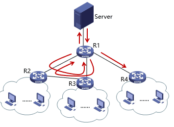

$\quad$ **受控制的泛洪（每个路由器进行有选择的泛洪）**

$\quad$ $\quad$ *序号控制泛洪（sequence-number-controlled flooding）*

$\quad$ $\quad$ $\quad$ 广播数据包X从接口1到达路由器R

$\quad$ $\quad$ $\quad$ R查看数据包来源S和广播序号n，比对R的序号表

$\quad$ $\quad$ $\quad$ 序号表中有该数据包的记录吗？

$\quad$ $\quad$ $\quad$ $\quad$ 是，丢弃（曾经已经收到并转发过）

$\quad$ $\quad$ $\quad$ $\quad$ 否，在序号表中记录，并在接口2和3转发

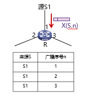

$\quad$ $\quad$ *逆向路径转发(reverse path forwarding, RPF)*

$\quad$ $\quad$ $\quad$ 假设R的路由表中表示了到达各网络的最优路径

$\quad$ $\quad$ $\quad$ 广播数据包X从接口1到达路由器R

$\quad$ $\quad$ $\quad$ R查看数据包来源S，比对R的路由表

$\quad$ $\quad$ $\quad$ X的来源是N1吗？

$\quad$ $\quad$ $\quad$ $\quad$ 是 -> X是从最佳路径来的，向接口2和接口3转发

$\quad$ $\quad$ $\quad$ $\quad$ 否 -> X是重复包，丢弃

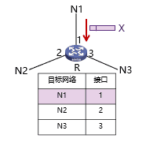

###### 方法4:生成树

$\quad$ 源节点向所有属于该生成树的特定链路发送分组

$\quad$ 改进了逆向路径转发

$\quad$ 没有环路

$\quad$ 最佳使用带宽

$\quad$ 最少副本，消除了冗余分组

$\quad$ 一个路由器可以不必知道整颗树，只需要知道在一颗树中的邻居即可

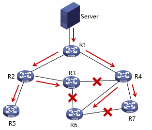

##### 组播路由

$\quad$ 组播（multicasting）：源主机给网络中的一部分目标用户发送数据包

$\quad$ 组播（multicasting）路由算法的目标：

$\quad$ $\quad$ 为每个组建立转发树（到达该组所有成员的路径树）

$\quad$ $\quad$ 每个组成员应当只收到多播分组的一个拷贝

$\quad$ $\quad$ 非本组成员不应收到多播分组

$\quad$ $\quad$ 从源节点到每一个组成员节点的路径应当是最佳的（最短路径

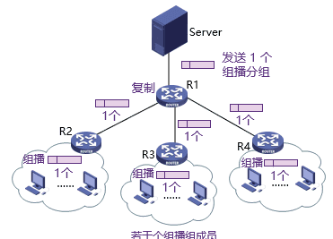

###### 步骤1：

$\quad$ 确定组成员边缘路由器通过与主机交互，了解到从它的某个端口可以到达哪些组的成员——主机与路由器之间的组成员关系协议

$\quad$ IGMP (Internet Group Management Protocol）

$\quad$ $\quad$ 主机可以加入或者退出组播组

$\quad$ $\quad$ 路由器查询该子网的组播组成员

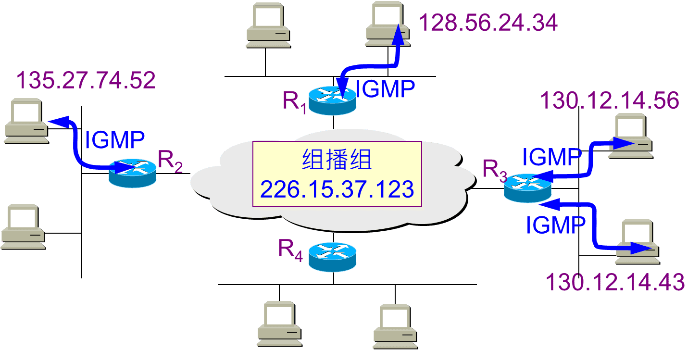

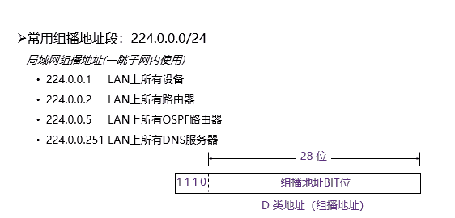

###### 步骤2：生成树

$\quad$ 建立在我们已经学习过的广播路由方案基础之上

$\quad$ 数据包沿生成树发送

$\quad$ 源点树：为每个组播源计算生成树

$\quad$ $\quad$ 构建源点树协议： MOSPF、 DVMRP、 PIM-DM

$\quad$ $\quad$ 基于源点树（source-based trees）存在的问题：

$\quad$ $\quad$ $\quad$ 大型网络中，组播源很多时，路由器需生成多颗棵树，工作量巨大

$\quad$ $\quad$ $\quad$ 路由器需要大量空间来存储多颗树

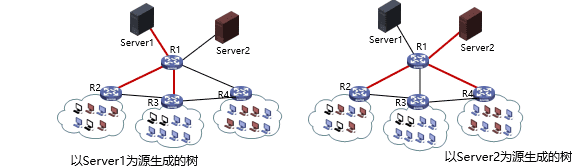

  

$\quad$ 核心树：多个组播源共享组成共享树

$\quad$ $\quad$ 选择一部分结点作为核心，所有流量先汇聚到核心，再进行分发

$\quad$ $\quad$ 实线为核心树实际使用的链路，虚线为没有用到的链路

$\quad$ $\quad$ 存在的问题：

$\quad$ $\quad$ $\quad$ 可能无法达到最优

$\quad$ $\quad$ $\quad$ 如果只有一个发送者，将发送者作为核心是最优的

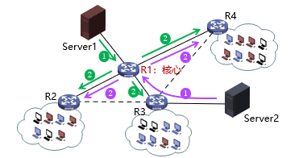

###### 应用部署

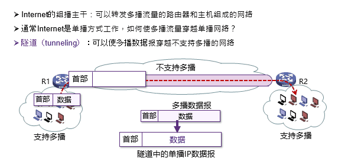

##### 选播路由

$\quad$ 将数据包传送给最近的一个组成员

$\quad$ 在有多个服务器的情况下，用户希望快速获得正确信息，而不在乎从哪个服务器获得

$\quad$ 与单播、广播、组播的区别

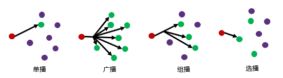Ø$\quad$ 选播的典型应用：DNS

$\quad$ $\quad$ 在没有指定DNS服务器的情况下，用户将始终连接到“最接近”(从路由协议角度来看) 服务器，可以减少延迟，并提供一定程度的负载平衡

$\quad$ $\quad$ 可以提供一定程度的高可用性，一旦服务器发生故障，用户请求将无缝转发到下一个最接近的DNS实例，而无需任何手动干预或重新配置

$\quad$ $\quad$ 可以水平缩放，如果一台服务器负载过重，只需在一个位置部署另一台服务器，以承担一部分重载服务器的请求，且不需要客户端配置

  
  
  
  
  
  
  

---
