# 计算机网络

## 网络层- IPv6、其他网路层技术

### IPv6协议

$\quad$ IPv6（Internet Protocol version 6）是IETF设计用于替代IPv4的下一代协议

$\quad$ 初始动机：应付“32-bit地址空间耗尽”问题（CIDR和NAT都无法从根本上解决地址短缺问题），增加地址空间

$\quad$ 后续动机

$\quad$ $\quad$ 简化头部，加快处理与转发

$\quad$ $\quad$ 提升服务质量

###### IPv6地址

$\quad$ IPv6 地址

$\quad$ $\quad$ 地址长度为128bit，是IPv4地址长度的4倍

$\quad$ $\quad$ IPv6地址空间数量约为3*1038

$\quad$ $\quad$ IPv6地址表示法，冒分十六进制，x:x:x:x:x:x:x:x

$\quad$ $\quad$ $\quad$ 简化方法：每个x前面的0可省略，可把连续的值为0的x表示为“::”, 且“::”只能出现1次

$\quad$ $\quad$ $\quad$ 简化前地址，2001:0DA8:0000:0000:200C:0000:0000:00A5

$\quad$ $\quad$ $\quad$ 简化后地址，2001:DA8:0000:0000:200C::A5

$\quad$ IPv6地址分类

$\quad$ $\quad$ 未指定地址（::/128），不能分配给任何节点

$\quad$ $\quad$ 回环地址（::1/128），表示节点自己，不分配，类似IPv4中的127.0.0.1

$\quad$ $\quad$ 组播地址（FF00::/8）

$\quad$ $\quad$ 链路本地地址（FE80::/10），也称为Link-local地址，仅在本地链路上使用，网络设备根据接口MAC地址自动生成

$\quad$ $\quad$ 全局单播地址，其它地址

$\quad$ IPv6地址配置方式

$\quad$ $\quad$ 手动配置

$\quad$ $\quad$ DHCPv6（IPv6动态主机配置协议）

$\quad$ $\quad$ 无状态地址自动配置，基于邻居结点IPv6前缀信息，结合自己的链路层地址生成IPv6地址

  

###### IP数据报文

$\quad$ 固定40字节头部长度

$\quad$ 不允许传输途中分片(fragmentation)

##### IPv6头部

$\quad$ 版本：4bit，协议版本号，值为6

$\quad$ 流量类型：8bit，区分数据包的服务类别或优先级

$\quad$ 流标签：20bit，标识同一个数据流

$\quad$ 有效载荷长度：16bit ，IPv6报头之后载荷的字节数（含扩展头），最大值64K

$\quad$ 下一个首部：8bit ，IPv6报头后的协议类型，可能是TCP/UDP/ICMP等，也可能是扩展头

$\quad$ 跳数限制：8bit ，类似IPv4的TTL，每次转发跳数减1，值为0时包将会被丢弃

$\quad$ 源地址： 128bit ，标识该报文的源地址

$\quad$ 目的地址： 128bit ，标识该报文的目的地址

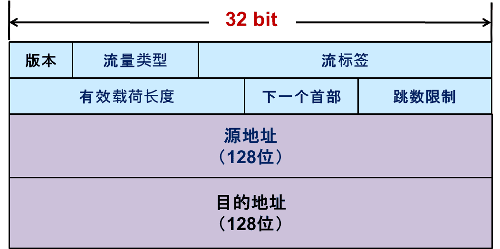

###### 头部字段分析

$\quad$ IPv6头部长度固定40字节

$\quad$ $\quad$ 所有“选项”字段都在IPv6扩展头部分（位于头部字段后面），通过“下一个首部”字段表明

$\quad$ 与IPv4头部的比较

$\quad$ $\quad$ 去除“首部长度”（首部长度固定为40字节）

$\quad$ $\quad$ 去除“首部校验和”（传输层校验会涉及伪头部信息），提升转发速度

$\quad$ $\quad$ 去除分片字段：“标识”“标志”“片偏移”，移至扩展头（分段头）

$\quad$ IPv6分片机制

$\quad$ $\quad$ IPv6分组不能在传输途中分片，只在源端进行分片

$\quad$ $\quad$ IPv6设计了专门的分片扩展头，分片字段不存在IPv6头部中

$\quad$ $\quad$ IPv6支持Path MTU发现机制

###### IPv6拓展头

$\quad$ IPv6报文可承载多个扩展头

$\quad$ 每个扩展头都包含“下一个首部”字段（IPv6首部固定字段也有）

$\quad$ $\quad$ 可指向下一个扩展头类型

$\quad$ $\quad$ 或指明传统上层协议类型（最后一个扩展头）： TCP/UDP/ICMP . . .

$\quad$ 如有多个扩展头，需按规定顺序出现

$\quad$ $\quad$ 逐跳选项头，转发路径上每个节点都需检查该扩展头的信息

$\quad$ $\quad$ 路由头，指明转发途中需经过哪些节点，类似于IPv4的源路由机制

$\quad$ $\quad$ 分段头，包含类似IPv4分片处理信息：片偏移、“更多段”标志、标识符

$\quad$ $\quad$ 目的地选项头，目的端系统需要确认的信息

##### IPv6 ICMP改进

$\quad$ IPv6提供新版本ICMP协议，提供新功能

$\quad$ $\quad$ 不同的Type值和Code值表示不同的消息

$\quad$ 消息类型1：邻居请求(Neighbor Solicitation，NS)

$\quad$ $\quad$ 类似于IPv4中的ARP请求报文，获取邻居的链路层地址，验证邻居可达，重复地址检测

$\quad$ 消息类型2 ：邻居通告(Neighbor Advertisement，NA)

$\quad$ $\quad$ 类似于IPv4中的ARP应答报文，对NS消息进行响应

$\quad$ 消息类型3 ：路由器请求(Router Solicitation，RS)

$\quad$ $\quad$ 端系统通过RS消息向路由器发出请求，请求地址前缀和其他信息，用于节点的自动配置

$\quad$ 消息类型4 ：路由器通告(Router Advertisement，RA)

$\quad$ $\quad$ 路由器通过RA消息向端系统发布地址前缀（IPv6地址自动配置）和其他配置信息

$\quad$ 消息类型5 ：重定向(Redirect)

$\quad$ $\quad$ 通知主机重新选择正确的下一跳地址（针对某个目的IPv6地址）

##### IPv6路由协议

$\quad$ RIPng for IPv6，RFC 2080，对RIP修改以适应IPv6环境

$\quad$ $\quad$ 使用路由器的链路本地IPv6地址作为源地址，发送路由更新信息

$\quad$ OSPFv3 for IPv6，RFC 5340，适应IPv6网络

$\quad$ $\quad$ 使用路由器的链路本地IPv6地址作为源地址，并作为下一跳地址

$\quad$ $\quad$ OSPFv3有7种类型的LSA，新增Link LSA和Intra Area Prefix LSA

$\quad$ MP-BGP(Multi-Protocol BGP)，RFC 4760，支持多种网络层协议（IPv6和IPX）

$\quad$ $\quad$ MP-BGP向前兼容，并支持组播

$\quad$ $\quad$ BGP连接可以是IPv4或IPv6，报文内可传递其它网络协议的路由信息

$\quad$ $\quad$ 多协议可达NLRI描述了到达目的地的信息：地址属于哪个网络层协议，下一跳地址

#### IPv4到IPv6迁移及过滤技术

$\quad$ IPv4协议和IPv6协议并不兼容，迁移可能经历很长时间

$\quad$ $\quad$ 涉及：互联网用户、互联网服务提供商（ISP）、互联网内容提供商（ICP）、网络设备厂家

$\quad$ IPv4/IPv6过渡技术的关键要素

$\quad$ $\quad$ 尽量保证端到端透明原则

$\quad$ $\quad$ 高效、可行的编址及地址规划

$\quad$ $\quad$ 路由可扩展性，避免路由表膨胀（消耗转发资源 ）

$\quad$ $\quad$ 状态维护，减少因为过渡机制引起的状态维护，如IPv4-IPv6映射关系

$\quad$ 主流过渡技术

$\quad$ $\quad$ 隧道技术

$\quad$ $\quad$ 翻译技术

##### 隧道技术

$\quad$ 2个相同类型网络的设备，跨越中间异构类型网络进行通信

$\quad$ $\quad$ 将一种网络的数据包作为另一种网络的数据载荷进行封装

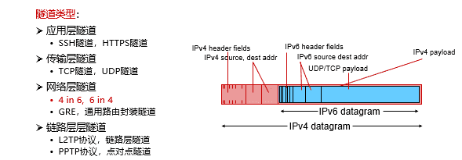

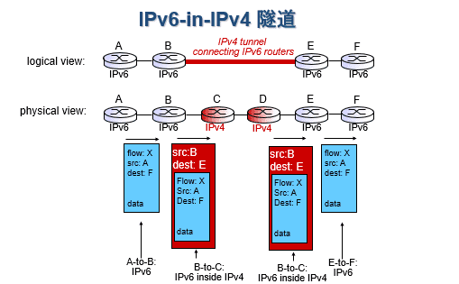

$\quad$ 报文长度在传输途中增大导致分片问题

$\quad$ $\quad$ 途中分片与重组对传输性能影响较大

$\quad$ 解决方法

$\quad$ $\quad$ 提前分片，需要Path MTU发现机制

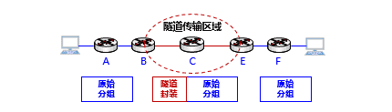

##### 翻译技术

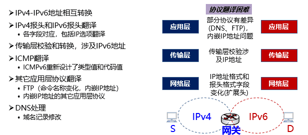

###### 问题

$\quad$ 破坏互联网端到端原则

$\quad$ $\quad$ 通信双方只看到通信对端在本网络对应的地址

$\quad$ $\quad$ 翻译网关处理传输层、应用层数据（上层数据无法透明传输）

$\quad$ 异构地址寻址问题

$\quad$ $\quad$ 通信双方至少有一方需感知本次通信涉及翻译技术

$\quad$ $\quad$ 域名访问需DNS服务支撑

$\quad$ 应用层内嵌IP地址

$\quad$ $\quad$ 部分应用层协议内嵌IP地址，将使翻译技术实施难度极大

$\quad$ 翻译导致报文变长可能导致分片问题，影响转发性能

  

### 其他类型网络层技术

$\quad$ 现有Internet：无连接的分组交换服务

$\quad$ $\quad$ 不需要提前建立连接

$\quad$ $\quad$ 尽力而为：不提供任何服务质量承诺

$\quad$ $\quad$ 简单、灵活、成本低

$\quad$ 基于Internet仍有技术提供不同类型的服务

$\quad$ $\quad$ 基于Internet的服务质量保障

$\quad$ $\quad$ 基于Internet的面向连接服务

##### 网络服务质量

$\quad$ 网络服务质量？（QoS, Quality of Service）是网络在传输数据流时要满足一系列服务请求，具体可以量化为带宽、时延、抖动、丢包率等性能指标

$\quad$ QoS针对各种业务的不同需求，为其提供端到端的服务质量保证。在有限的带宽资源下，它允许不同的流量不平等地竞争网络资源，语音、视频和重要的数据应用在网络设备中可以优先得到服务

$\quad$ 常用的网络服务质量机制包括：数据包调度；流量工程；流量整形：漏桶算法、令牌桶算法；综合服务；区分服务

###### 数据包调度

$\quad$ 路由器输出端口决定：把缓冲区中的哪些数据包发送到输出链路上

$\quad$ $\quad$ 先来先服务FCFS（First-Come First-Serve）

$\quad$ $\quad$ 公平队列算法（Fair Queueing）

$\quad$ $\quad$ 加权公平队列算法（Weighted Fair Queueing）

$\quad$ $\quad$ 优先级调度（Priority Scheduling）

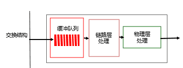

###### 流量工程

$\quad$ 流量工程：根据对传输流量的预测，规划流量的传输路径

$\quad$ $\quad$ 目的：提高带宽利用率、避免拥塞

$\quad$ 通常需要线性规划、网络流算法

$\quad$ 需要其他技术（如MPLS或者SDN）配合，进行流量区分

###### 流量整形

$\quad$ 流量整形(traffic shaping)：其作用是限制流出某一网络的某一连接的流量与突发，使这类报文以比较均匀的速度向外发送

$\quad$ 流量整形算法包括漏桶算法和令牌桶算法

$\quad$ $\quad$ 漏桶算法（Leaky Bucket Algorithm）：

$\quad$ $\quad$ $\quad$ 平滑网络上的突发流量

$\quad$ $\quad$ $\quad$ 突发流量可以被整形以便为网络提供一个稳定的流量

$\quad$ $\quad$ 令牌桶算法（Token Bucket Algorithm）：

$\quad$ $\quad$ $\quad$ 允许突发数据的发送，但控制流速

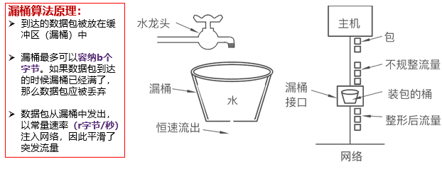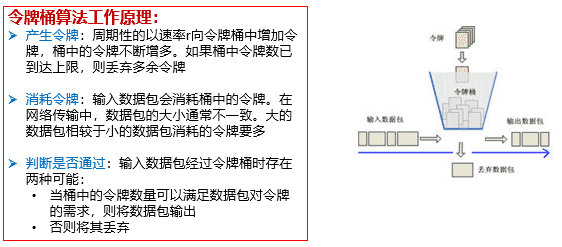

###### 综合服务

$\quad$ 特点1：（面向连接）基于资源预留协议RSVP，在主机间建立传输流的连接

$\quad$ 特点2：（预留资源）逐节点建立或拆除流的状态和资源预留状态，根据QoS进行路由

$\quad$ 要求：需要所有的路由器支持综合服务，在控制路径上处理每个流的消息，维护每个流的路径状态和资源预留状态，在路径上执行基于流的分类、调度、管理

$\quad$ 现实：难以实现

###### 区分服务

$\quad$ 在IP报头的8位区分服务字段（DS字段）中使用6位区分服务码点（DSCP）进行分组分类，指明分组的类型

$\quad$ 路由节点在转发这种包的时候，只需根据不同的DSCP选择相应的调度和转发服务即可

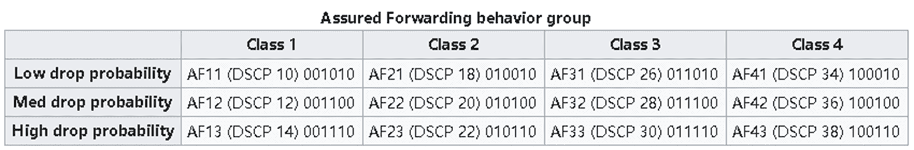

#### 面向连接服务

$\quad$ 面向连接服务：如打电话

$\quad$ $\quad$ 通信之间先建立逻辑连接：在此过程中，如有需要，可以预留网络资源

$\quad$ $\quad$ 结合使用可靠传输的网络协议，保证所发送的分组无差错按序到达终点

##### 虚电路

$\quad$ 虚电路是逻辑连接，建立在Internet分组交换之上

$\quad$ $\quad$ 虚电路表示这只是一条逻辑上的连接，分组都沿着这条逻辑连接按照存储转发方式传送，而并不是真正建立了一条物理连接

$\quad$ $\quad$ 注意，电路交换的电话通信是先建立了一条真正的连接

$\quad$ $\quad$ 因此，虚电路和电路交换的连接只是类似，但并不完全相同

###### 目标

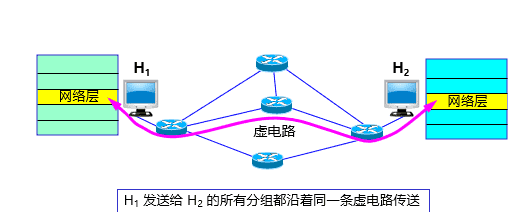

###### 转发策略

$\quad$ 基于分组标签，即虚电路号

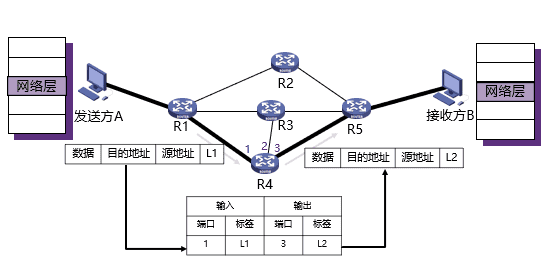

###### 面向连接的虚电路

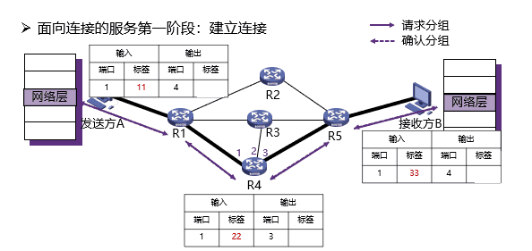

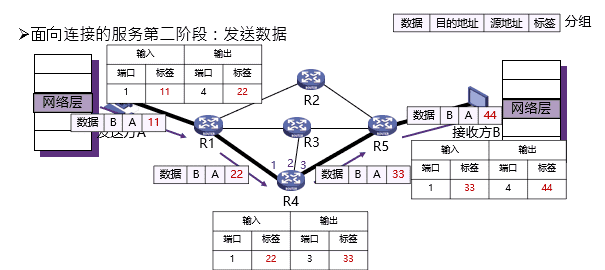

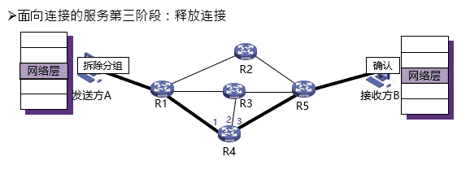

###### 与数据包网络的比较

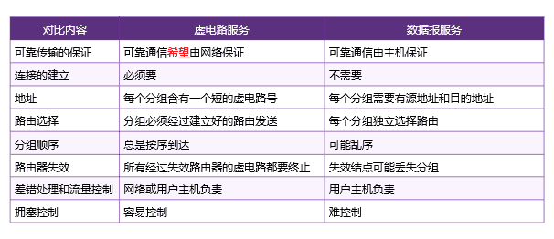

##### MPLS

$\quad$ MPLS (MultiProtocol Label Switching)全称是多协议标签交换

$\quad$ $\quad$ 多协议表示在 MPLS 的上层可以采用多种协议，例如：IP，IPv6、IPX

$\quad$ $\quad$ 达到“链路虚拟化”的目的

$\quad$ 思想：基于IP转发 -> 基于标签转发

$\quad$ $\quad$ 标签是指每个分组被分配一个标签，路由器根据该标签对分组进行转发

$\quad$ $\quad$ 交换是指标签的交换，MPLS 报文交换和转发是基于标签的

$\quad$ MPLS 设计初衷为了提升查找速度

$\quad$ MPLS 主要有以下三个方面的应用

$\quad$ $\quad$ 面向连接的服务质量管理

$\quad$ $\quad$ 流量工程，平衡网络负载

$\quad$ $\quad$ 虚拟专用网VPN

###### 报文结构

$\quad$ 给 IP 数据报加标签”其实就是在链路层的帧首部和IP数据报的首部之间插入一个 4 字节的 MPLS 首部

$\quad$ MPLS又称为2.5层协议

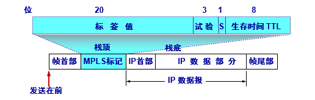

###### 核心要素

$\quad$ 标签交换路由器LSR

$\quad$ $\quad$ 支持MPLS的路由器

$\quad$ $\quad$ 具备标签交换、路由选择两种功能

$\quad$ MPLS域

$\quad$ $\quad$ 所有相邻的支持MPLS技术的路由器构成的区域

$\quad$ 标签分配协议LDP

$\quad$ $\quad$ 用来在LSR之间建立LDP会话并交换Label映射信息

$\quad$ 标签

$\quad$ $\quad$ 标签仅仅在两个LSR 之间才有意义

$\quad$ $\quad$ LSR会维护一张转发表

  

| 入接口　| 　入标记　|　出接口　|　出标记　|

| ----------- | ----------- |----------- |----------- |

| 0 | 　3　|　1　| 1 |

  

$\quad$ $\quad$ 表项含义：从入接口 0 收到一个入标记为 3 的IP 数据报，转发时，应当把该IP数据报从出接口 1 转发出去，同时把标记对换为 1

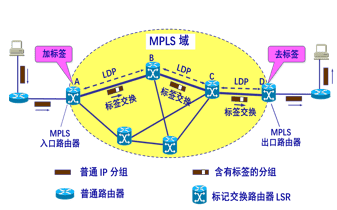

###### 基本操作

$\quad$ 加标签

$\quad$ $\quad$ 在 MPLS 域的入口处，给每一个 IP 数据报加上 标签，然后对加上标记的 IP 数据报用硬件进行转发

$\quad$ 标签交换

$\quad$ $\quad$ MPLS域内每台路由器，对加上标记的 IP 数据报修改标签并转发称为标签交换

$\quad$ 去标签

$\quad$ $\quad$ 当分组离开 MPLS 域时，MPLS 出口路由器把分组的标签去除。后续按照一般IP分组的转发方法进行转发

  

###### 工作过程

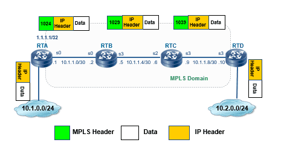

###### MPLS转发等价类

$\quad$ 不可能对每个报文分配各自标签

$\quad$ 如果一组报文在网络上被以同样的方式处理，则构成一个转发等价类FEC

$\quad$ 通常对一个FEC分配唯一的标签

$\quad$ FEC有多种定义方式

$\quad$ $\quad$ 属于某特定组的组播报文

$\quad$ $\quad$ 目的IP地址匹配了一个特定前缀的报文

$\quad$ $\quad$ 有相同QoS策略的报文

$\quad$ $\quad$ 属于同一个VPN的报文（MPLS VPN中）

$\quad$ $\quad$ 报文的目的IP地址属于BGP学习到的路由，并且下一跳相同

$\quad$ $\quad$ 其他

##### VPN

$\quad$ 许多机构希望建立专用网络

$\quad$ $\quad$ 连接该机构各部分网络

$\quad$ $\quad$ 与Internet隔离的路由器、链路、以及DNS、DHCP等基础服务

$\quad$ $\quad$ 缺点：代价昂贵

$\quad$ 虚拟专用网（Virtual Private Network，VPN）

$\quad$ $\quad$ 建立在Internet之上

$\quad$ $\quad$ 通过加密与认证机制，保持逻辑上的隔离

$\quad$ VPN的设计原则

$\quad$ $\quad$ 安全性、隧道与加密、数据验证、用户验证、防火墙与攻击检测

###### 原理

$\quad$ VPN指利用公用网络架设专用网络的远程访问技术

$\quad$ VPN通过隧道技术在公共网络上模拟出一条点到点的逻辑专线，从而达到安全数据传输的目的

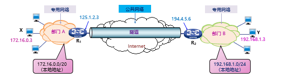

###### 实现

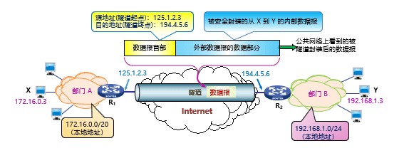

###### 安全性

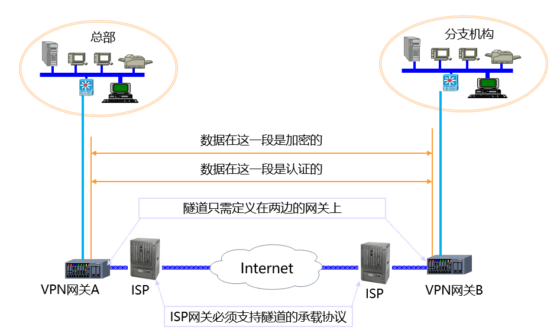

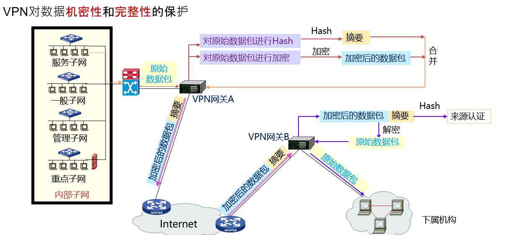

###### 其他实现方式

$\quad$ 按功能位置

$\quad$ $\quad$ CPE-based VPN（基于客户端设备）

$\quad$ $\quad$ Network-based VPN（基于网络）

$\quad$ 按业务构成

$\quad$ $\quad$ Access VPN（远程访问虚拟网）

$\quad$ $\quad$ Intranet VPN（企业内部虚拟网）

$\quad$ $\quad$ Extranet VPN（企业扩展虚拟网）

$\quad$ 按实现层次

$\quad$ $\quad$ 二层隧道VPN（ L2TP 、 PPTP 、 L2F ）

$\quad$ $\quad$ 三层隧道VPN（GRE、IPSec、MPLS）

$\quad$ $\quad$ 传输层隧道VPN（SSL、TLS）

$\quad$ 按组网模型

$\quad$ $\quad$ VPDN：Virtual Private Dial Networks（虚拟专用拨号网络）

$\quad$ $\quad$ VPRN：Virtual Private Routed Networks（虚拟专用路由网络）

$\quad$ $\quad$ VPLS：Virtual Private LAN Segment（虚拟专用LAN 网段）

$\quad$ $\quad$ VLL：Virtual Leased Lines（虚拟租用线）

  

### Segment Routing与SRv6

###### 报文格式

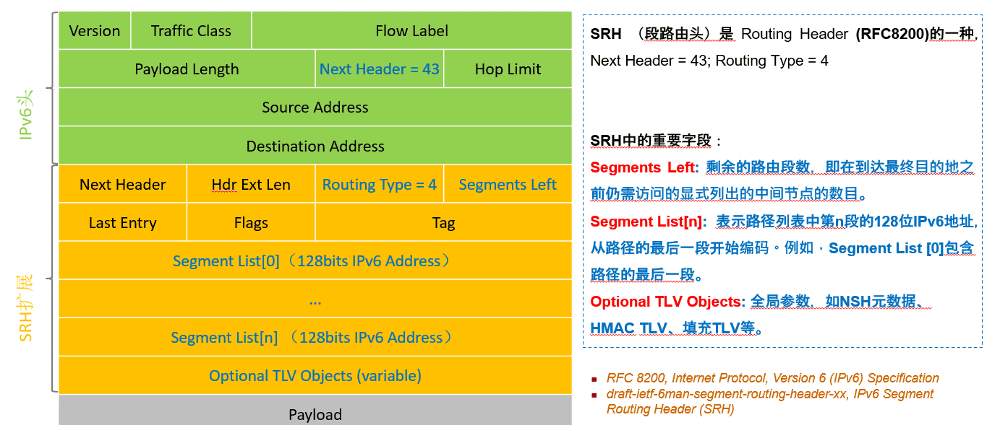

###### Segment

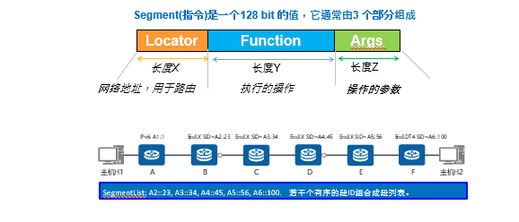

---
