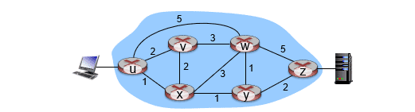
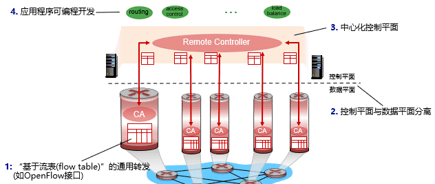
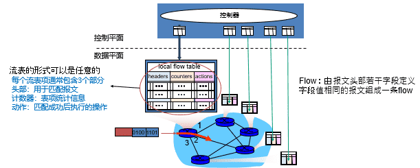
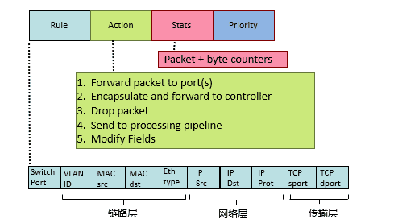
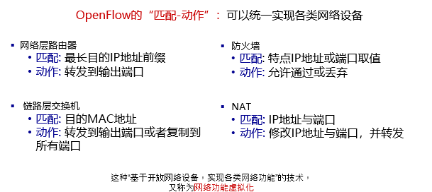
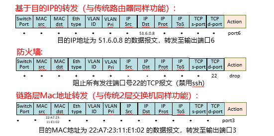
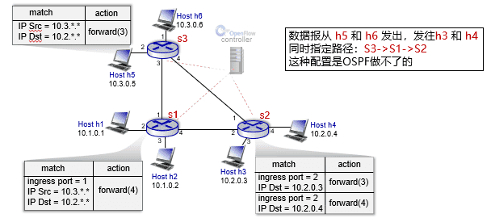
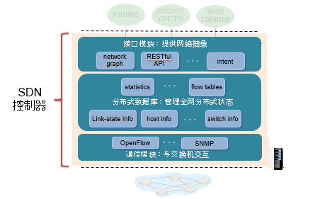
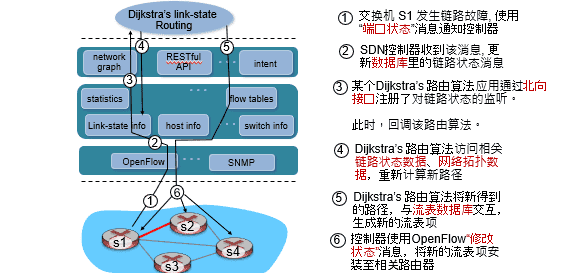

  

# 计算机网络

## 网络层-软件定义网络SDN

  

###### 传统网络数据平面的缺陷

$\quad$ 传统的网络设备：数据平面硬件、操作系统和网络应用三部分紧耦合，形成封闭的系统；互相之间不兼容，难以配置和管理

$\quad$ 传统网络不可编程，很难实现高效、按需的数据传输

$\quad$ 路由器以接力棒的形式不断向邻居结点传播消息：效率低

$\quad$ $\quad$ 距离向量（DV）算法：收敛时间长，甚至可能遇到无穷计数问题

$\quad$ $\quad$ 链路状态（LS）算法：链路信息传播时间长

$\quad$ 现代网络设备数量不断增加

$\quad$ $\quad$ 划分自治系统（AS）与区域无法从根本上解决问题

###### 流量工程：

$\quad$ 根据对传输流量的预测，规划流量的传输路径

$\quad$ 目的：提高带宽利用率、避免拥塞

$\quad$ 通常需要线性规划、网络流算法

$\quad$ $\quad$ 基于最短路的路由：对单个路由器局部最优，但未必全局最优

$\quad$ 问题1: 如何让 u-to-z 的流量经过路径 uvwz, x-to-z 的经过路径 xwyz?

$\quad$ $\quad$ 方案a：采用基于最短路的传统路由，调整路径代价（：将ux, vx设置为无穷大）

$\quad$ $\quad$ $\quad$ 并不总是可行

$\quad$ $\quad$ 方案b：采用新的流量工程方法计算路径

$\quad$ $\quad$ $\quad$ 需要更多输入数据（如“源-目标”主机的流量信息）

$\quad$ $\quad$ $\quad$ 传统分布式路由器架构：实现困难、代价巨大

$\quad$ 问题2: 如何让 u-to-z 的流量划分到 uvwz 与 uxyz 两条路径进行传输

$\quad$ $\quad$ 传统基于最短路的路由算法无法计算得到该结果

$\quad$ 问题3: 如何让路由器w区别对待红色与绿色两组流量

$\quad$ $\quad$ 基于目的地址转发的传统路由方式无法区分

### 软件定义网络

$\quad$ 传统Internet的网络层：通过多个独立路由器分布式实现，同时运行数据平面与控制平面

$\quad$ $\quad$ 转发：IP协议

$\quad$ $\quad$ 路由：通用协议（OSPF，BGP）或设备厂商专有协议

$\quad$ $\quad$ 管理接口：设备厂商专有接口

$\quad$ 除了路由器，网络层还包含大量其他设备

$\quad$ $\quad$ 防火墙

$\quad$ $\quad$ NAT设备

$\quad$ $\quad$ 负载均衡设备

###### 技术要点

###### 优势

（数据平面）数据平面与控制平面分离：数据平面提供开放接口

$\quad$ $\quad$ 允许对网络设备进行“编程”

（控制平面）中心化控制器：全局网络视角，更好的网络管理

$\quad$ $\quad$ 加快链路状态传播 and/or 路由收敛速度

$\quad$ $\quad$ 支持流量工程：全局更优的路径选择

$\quad$ $\quad$ 避免路由器故障导致的网络配置错误

$\quad$ $\quad$ 让网络编程更加容易

###### SDN交换机

$\quad$ 简单、高性能的交换机架构

$\quad$ $\quad$ 流表架构：“流量匹配-动作”

$\quad$ $\quad$ 实现通用的数据平面处理功能

$\quad$ 交换机流表提供API (e.g., OpenFlow)

$\quad$ $\quad$允许程序定义部分流表功能

$\quad$ 流表由控制器计算并安装

$\quad$ 交换机流表与控制器通过开放协议交互(e.g., OpenFlow)

$\quad$ 网络中的SDN交换机可以来自不同产商

###### SDN控制器（网络操作系统）

$\quad$ 维护全网状态信息

$\quad$ 与数据平面SDN交换机交互

$\quad$ $\quad$ 通过“南向接口（southbound API)”，如OpenFlow

$\quad$ 为上层网络应用提供接口

$\quad$ $\quad$ 称为“北向接口（northbound API)”

$\quad$ 以分布式系统的形式实现

$\quad$ $\quad$ 高性能、可扩展、故障容错

$\quad$ 可以与SDN交换机来自于不同产商

###### SDN应用程序

$\quad$ 基于北向接口，实现各类网络功能

$\quad$ 可以由第三方开发者提供

$\quad$ $\quad$ 不仅仅是网络设备产商

#### 数据平面

$\quad$ 每个路由器维护一张流表（flow table） ，流表由控制器计算后写入每个路由器

##### OpenFlow

$\quad$ 目前最流行的流表结构是OpenFlow所定义的流表

$\quad$ $\quad$ 最早的SDN技术

$\quad$ OpenFlow的流表项由4部分组成

$\quad$ $\quad$ 模式：报文头中的匹配值

$\quad$ $\quad$ 动作：对于成功匹配的报文所进行的操作，包括转发、修改、丢弃、送往控制器

$\quad$ $\quad$ 优先级：当一个报文有多个匹配成功项时，定义优先顺序

$\quad$ $\quad$ 计数器：报文数、字节数

###### 抽象能力

###### 转发表配置

###### 例子

#### 控制平面

###### 控制器架构

##### OpenFlow协议

$\quad$ 用于控制器与支持OpenFlow的交换机交互

$\quad$ 使用TCP传输消息

$\quad$ $\quad$ 可选项：加密消息

$\quad$ OpenFlow定义了2类消息

$\quad$ $\quad$ 控制器 -> 交换机

$\quad$ $\quad$ 交换机 -> 控制器

###### 控制器->交换机

$\quad$ 读状态: 控制器查询交换机状态或数据，交换机需回复

$\quad$ 配置: 控制器设置交换机相关参数

$\quad$ 修改状态: 添加、删除、修改交换机流表项

$\quad$ Packet-out: 控制器通过交换机某个接口，发送数据报，即流量注入

###### 交换机->控制器

$\quad$ 流删除：通知流表项已经删除

$\quad$ $\quad$ 流表项删除由控制器触发，或者超过存货周期

$\quad$ 端口状态: 上报交换机某个状态或统计信息

$\quad$ Packet-in: 将报文发送给控制器（通常用于匹配失败的报文）

  

#### 数据平面/控制平面整体

  
  
  

---