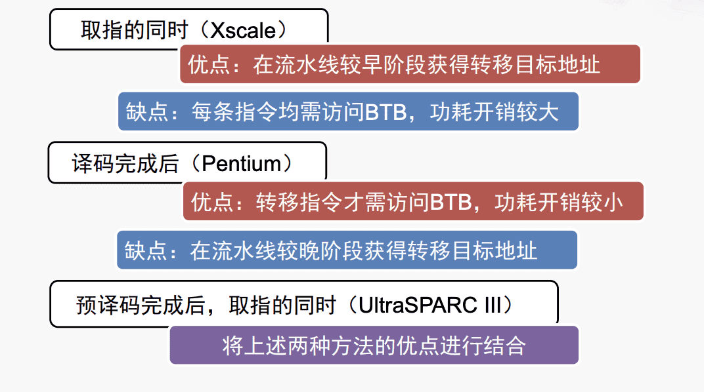
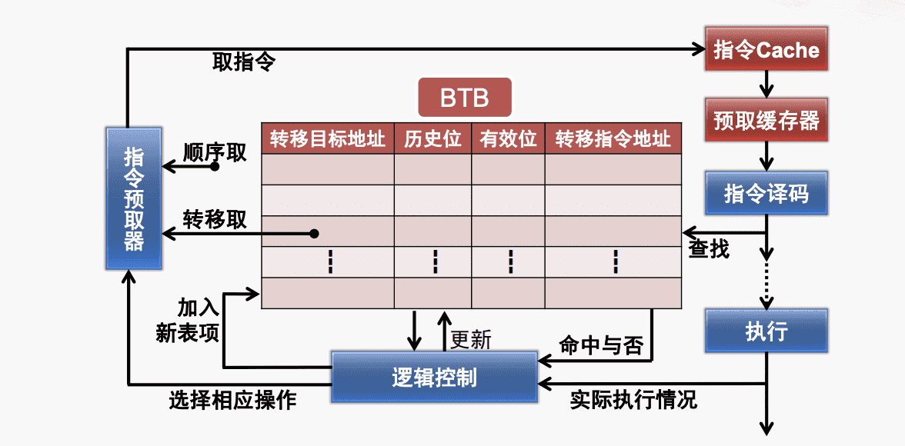

北京大学计算机组成与体系结构总复习
 参考教材COD（计算机组成与设计-硬件/软件接口）
 
<!-- more -->

# 计算机组成与体系结构

## 线下内容

###  [1-课程概述](https://aki-yzh.github.io/2023/03/19/1-课程概述/)

$\quad$ 世界上第一台电子计算机：ENIAC 

$\quad$ 现代电子计算机之父：冯·诺伊曼

$\quad$ EDVAC：存储程序计算机

$\quad$ $\quad$ 特点：由五个基本部分组成（运算器，存储器，控制器，输入设备，输出设备）；指令和数据采用二进制，极大简化了逻辑线路；实现了存储程序概念，大幅提升任务效率。

$\quad$ 计算机的主要类别：

$\quad$ $\quad$ 1. 大型计算机

$\quad$ $\quad$ $\quad$ 强调高速输入与输出，海量存储空间和并行事务处理

$\quad$ $\quad$ $\quad$ 以面向大容量数据的事务处理为主，兼顾科学计算

$\quad$ $\quad$ 2.  超级计算机

$\quad$ $\quad$ $\quad$ 运算速度最快、性能最高、技术最复杂，代表该时期处理能力巅峰

$\quad$ $\quad$ $\quad$ 用于高度密集型的科学计算

$\quad$ $\quad$ $\quad$ 500强大部分分布于美国，中国，日本，主体为Intel x86架构，处理器主要为Intel，加速器主要为NVIDIA

$\quad$ $\quad$ 3. 小型计算机

$\quad$ $\quad$ $\quad$ 涉及事务处理和科学计算，逐渐被服务器替代

$\quad$ $\quad$ 4.  微型计算机

$\quad$ $\quad$ $\quad$ 以CPU为中央处理单元，主要以个人计算机和微控制器的形式出现。

$\quad$ $\quad$ $\quad$ 用于个人用途和仪器仪表

### [2-计算机基本结构](https://aki-yzh.github.io/2023/03/19/2-%E8%AE%A1%E7%AE%97%E6%9C%BA%E5%9F%BA%E6%9C%AC%E7%BB%93%E6%9E%84/)

$\quad$ 冯诺依曼结构的特点：

$\quad$ $\quad$ 1.  计算机由运算器（CA）、控制器（CC），存储器（M）、输入设备（I）和输出设备（O）五部分组成。

$\quad$ $\quad$ 2. 数据和程序均以二进制编码形式不加区别地存放在存储器中，存放位置由存储器的地址制定。

$\quad$ $\quad$ 3. 计算机在工作时能自动地从存储器中取出指令加以执行。  

$\quad$  实现中，CC和CA对应CPU，M对应主存，I/O对应外接设备，R（外部记录设备）对应硬盘

$\quad$ 指令运行的步骤：取指、译码，执行，访存

 $\quad$ Intel 8086 （IA-16）

 $\quad$ $\quad$ 特点：

$\quad$ $\quad$ $\quad$  1. 内部通用寄存器为16位

 $\quad$ $\quad$ $\quad$ 2. 对外有16根数据线和20根地址线，可寻址的内存空间为1MByte

 $\quad$ $\quad$ $\quad$ 3. 物理地址的形成采用“段加偏移”的方式

 $\quad$  Intel 80386（IA-32）

 $\quad$ $\quad$ 特点：

 $\quad$ $\quad$ $\quad$ 1. 第一款32位微处理器

 $\quad$ $\quad$ $\quad$ 2. 地址总线扩展到32位，可寻址4GB的内存空间

 $\quad$ $\quad$ $\quad$ 3. 改进了“保护模式”

 $\quad$ $\quad$ $\quad$ 4. 增加了“虚拟8086模式”

 $\quad$ 寻址

 $\quad$ 指令指针寄存器：IP

  $\quad$ $\quad$ 保存一个内存地址，指向当前需要取出的指令

$\quad$  $\quad$   当CPU从内存中取出一个指令后，IP会自动增加指向下一个指令地址，程序员不能直接对IP进行存取操作，转移指令、过程调用/返回指令等会改变IP的内容。

 $\quad$ 段寄存器：CS（代码段），DS（数据段），ES（附加段），SS（堆栈段）。（FS，GS）

  $\quad$ $\quad$ 地址生成：段加偏移：物理地址=段基值 X 16+偏移量（X16在16进制下即为左移1位）

   $\quad$  $\quad$ 开始时要把DS，SS，SP赋初值

  

  汇编语言：

 $\quad$  $\quad$ Intel格式：

  $\quad$  $\quad$  $\quad$ 寄存器和立即数没有前缀，整数有后缀

   $\quad$  $\quad$  $\quad$ 第一个是目的操作数，第二个是源操作数

   $\quad$  $\quad$  $\quad$ 基寄存器用【】

$\quad$ $\quad$ $\quad$ $\quad$ 间接寻址segreg【base+index x scale+disp】

  $\quad$  $\quad$ AT&T格式：

   $\quad$  $\quad$  $\quad$ 寄存器使用前缀%，立即数使用前缀 "$" ,16进制数还要有前缀0x

  $\quad$  $\quad$  $\quad$ 第一个是源操作数，第二个是目的操作数

   $\quad$  $\quad$  $\quad$ 基寄存器用（）

   $\quad$ $\quad$ $\quad$ 间接寻址%segreg：disp（base，index，scale）

   $\quad$ $\quad$ $\quad$ 操作码带后缀以指出操作数的大小

### [3-CISC,RISC,X86,MIPS指令](https://aki-yzh.github.io/2023/03/19/3-CISC,X86,RISC,MIPS%E6%8C%87%E4%BB%A4/)

$\quad$ CISC和RISC差别：

$\quad$ $\quad$ CISC指令丰富、功能强大、寻址方式灵活，但是指令使用率不均衡、结构复杂

$\quad$ $\quad$ RISC结构简单易于设计、指令精简程序执行效率高，但是指令数较少且寻址方式不灵活。

$\quad$ X86指令：变长

$\quad$ $\quad$ 最长指令15字节，最短指令1字节

$\quad$ MIPS

$\quad$ $\quad$ 减少指令类型，降低指令复杂度，属于上述的AT&T格式

$\quad$ $\quad$ 指令定长（简化了从存储器取指令）、寻址模式简单（只有load和store可以访问存储器：简化了从存储器取操作数）、指令数量少、功能简单（简化了指令的执行过程)

$\quad$ R型指令

$\quad$ $\quad$ opcode：用于指定指令的类型，对于所有R型指，该域的值均为0

$\quad$ $\quad$  funct：与opcode域结合，精确指定指令的类型

$\quad$ $\quad$ rs（Source Register）：指定第一个源操作数所在的寄存器编号

$\quad$ $\quad$ rt（Target Register）：指定第二个源操作数所在的寄存器编号

$\quad$ $\quad$ rd（Destination Register）：指定目的操作数（保存运算结果）的寄存器编号

$\quad$ $\quad$ shamt（shift amount）：用于指定移位指令进行移位操作的位数，非移位指令设为0

$\quad$ $\quad$ 5-bit的域可表示0~31，对应32个通用寄存器

$\quad$ I型指令

$\quad$ $\quad$ 大部分域与R指令相同

$\quad$  $\quad$ opcode：用于指定指令的类型

$\quad$ $\quad$ rs：指定第一个源操作数所在的寄存器编号

$\quad$ $\quad$ rt：一般指定用于目的操作数的寄存器编号；对于某些指令指定第二个源操作数所在的寄存器编号

$\quad$ $\quad$ immediate：16-bit的立即数，可以表示$2^{16}$ 个不同数值

### [4-数字电路设计](https://aki-yzh.github.io/2023/03/30/4-%E6%95%B0%E5%AD%97%E7%94%B5%E8%B7%AF%E8%AE%BE%E8%AE%A1/)

$\quad$ NMOS晶体管：Gate为高电压时导通

$\quad$ PMOS晶体管：Gate为低电压时导通

### [5-控制器的原理和分类](https://aki-yzh.github.io/2023/05/01/5-%E6%8E%A7%E5%88%B6%E5%99%A8%E7%9A%84%E5%8E%9F%E7%90%86%E5%92%8C%E5%88%86%E7%B1%BB/)

$\quad$ 主要分为硬布线控制器和微程序控制器

$\quad$ $\quad$ 硬布线控制器用逻辑表达式来控制信号

$\quad$ $\quad$ $\quad$ 优点：指令执行速度快

$\quad$ $\quad$ $\quad$ 缺点：电路复杂，设计和验证难度大，修改困难

$\quad$ $\quad$ 微程序控制器用微指令控制信号，发出为1，不发为0

$\quad$ $\quad$ $\quad$ 优点：规整灵活

$\quad$ $\quad$ $\quad$ 缺点：速度较慢

### [6-流水线优化技术](https://aki-yzh.github.io/2023/05/01/6-%E6%B5%81%E6%B0%B4%E7%BA%BF%E4%BC%98%E5%8C%96%E6%8A%80%E6%9C%AF/)

$\quad$ 五级流水线：取指——译码——地址生成——执行——写回(现在是4发射16级流水线)

$\quad$ 转移指令：改变指令流向，破坏流水模式

$\quad$ $\quad$ 占比：每4～7条指令就有一条转移指令，所占比例大约为15～25%

$\quad$ $\quad$ 损失：Alpha：7个，Pentium：10～15，AMD：10；

$\quad$ $\quad$ 总损失等于占比x损失

$\quad$ 转移开销：

$\quad$ $\quad$ 当转移指令被执行，并确实发生转移时，产生的开销称为“转移开销”，如将按顺序预取的指令废除，从 转移目标地址重新获取指令。

$\quad$ $\quad$ 构成：要不要转移（转移条件判定）？转移到哪里？（生成目标地址）

$\quad$ $\quad$ 减少开销：

$\quad$ $\quad$ $\quad$ 转移延迟

$\quad$ $\quad$ $\quad$ 转移预测：

$\quad$ $\quad$ $\quad$ $\quad$ 转移条件预测：固定预测、编译制导、基于偏移预测，基于历史信息预测（普遍采用）

$\quad$ $\quad$ $\quad$ $\quad$ 转移地址预测:

$\quad$ $\quad$ $\quad$ $\quad$ $\quad$ BTB（转移目标缓冲器）：保存之前若干次转移指令执行时的目标地址。

$\quad$ $\quad$ $\quad$ 操作

$\quad$ $\quad$ $\quad$ $\quad$ 1. 分配BTB表项：转移目标第一次执行分配一个表项，自身地址保存在转移指令地址，转移目标地址保存在转移目标地址

$\quad$ $\quad$ $\quad$ $\quad$ 2. BTB表项比较：将需要预测的指令地址与BTB的转移指令地址进行比较，若命中则被执行过且为转移指令

$\quad$ $\quad$ $\quad$ $\quad$ 3. 产生转移目标地址：若命中则读出转移目标地址作为下一条指令地址

$\quad$ $\quad$ $\quad$ $\quad$ 4. 更新BTB

$\quad$ $\quad$ $\quad$ 返回地址栈：

$\quad$ $\quad$ $\quad$ $\quad$ 优点：

$\quad$ $\quad$ $\quad$ $\quad$ $\quad$ 1. 无需判定转移条件

$\quad$ $\quad$ $\quad$ $\quad$ $\quad$ 2. 转移目标地址已生成

$\quad$ $\quad$ $\quad$ $\quad$ $\quad$ 3. 出现可预期

$\quad$ $\quad$ $\quad$ $\quad$ 缺点：

$\quad$ $\quad$ $\quad$ $\quad$ $\quad$ 1. 同一条指令地址不同

$\quad$ $\quad$ $\quad$ $\quad$ $\quad$ 2. 转移目标地址访问时间较长

$\quad$ $\quad$ $\quad$ $\quad$ $\quad$ 3. 在流水线晚期才访问存储器获得转移目标地址

### [7-输入输出接口](https://aki-yzh.github.io/2023/05/10/7-%E8%BE%93%E5%85%A5%E8%BE%93%E5%87%BA%E6%8E%A5%E5%8F%A3/)

$\quad$ 产生原因：CPU和外设间速度差距，外设处理的信息格式和接口信号形式多样

$\quad$ 基本功能：数据缓冲、提供联络信息、信号与信息格式的转换、设备选择、中断管理、可编程功能

$\quad$ 基本结构

$\quad$ 两种编址方式：I/O和存储器分开编址，I/O端口和存储器统一编址

$\quad$ $\quad$ 统一编址：优点：1.可以用访问存储器的指令来访问I/O端口，功能齐全2.可以将CPU中的I/O操作设为同一套控制逻辑，简化内部结构；缺点：1. 使得存储地址相对减小2.指令更长，使得执行时间变长，译码不方便，指令更难理解

$\quad$ $\quad$ 分开编址：反过来即可

$\quad$ 简单外设字节0～7bit连接，复杂外设增加握手信号（准备好输入输出信号）

$\quad$ 数据输入过程：

$\quad$ $\quad$ 1. 系统初始化时，CPU执行OUT指令，将控制字写入接口的“控制寄存器”，从而设置接口的工作模式

$\quad$ $\quad$ 2. 外设将数据发到“并行数据输入”信号，并将“输入准备好”信号置为有效

$\quad$ $\quad$ 3. 接口发现“输入准备好”信号有效后，从“并行数据输入”信号接收数据，放入“输入缓冲寄存器”，并将“输入回答”信号置为有效，阻止外设输入新数据

$\quad$ $\quad$ 4. 接口将状态寄存器中的状态位“输入缓存器满”置为有效

$\quad$ $\quad$ 5. 在上述过程中，CPU反复执行IN指令从“状态寄存器“中读出状态字，直到发现”输入缓冲器满“，然后执行IN指令，从“输入缓冲寄存器”中读出数据

$\quad$ $\quad$ 6. 接口将“输入回答”信号置为无效，等待外设输入新数据

 $\quad$ $\quad$ （此为程序控制方式，还可以采用终端控制方式）

 $\quad$ 数据输出过程：

$\quad$  $\quad$ 1. CPU执行OUT指令，将控制字写入接口的“控制寄存器”，从而设置接口的工作模式

$\quad$  $\quad$ 2. CPU执行OUT指令，将数据写到接口的“输出缓冲寄存器”

$\quad$  $\quad$ 3. 接口将数据发到“并行数据输出”信号，并将“输出准备好”信号置为己有（亦可由CPU写控制字将该信息置为有效）

$\quad$  $\quad$ 4. 外设发现“输出准备好信号”后，从“并行数据输出”信号接收数据，并将“输出回答信号”置为有效

$\quad$  $\quad$ 5. 接口发现“输出回答”信号有效后，将“状态寄存器”中的状态位“输出缓存器空”置为有效

$\quad$  $\quad$ 6. 在这个过程中，CPU反复执行IN指令从“状态寄存”器中读出状态字，直到发现“输出缓冲器空”，然后开始下一个输出过程，继续输出新数据

$\quad$  $\quad$ （此为程序控制方式，还可以采用终端控制方式）

 $\quad$  串/并行通信

  $\quad$  $\quad$ 串行通信传输线数量少，需要通过复杂的串并转换，同频率下数据传输率低，但是避免了信号线间的窜扰。并行通信反过来。

   $\quad$  $\quad$ 差分信号传输时串行兴起的原因，优点是抗干扰能力强，能有效抑制电磁干扰，时序定位准确，缺点是布线难度高。

### [8-中断和异常](https://aki-yzh.github.io/2023/05/18/8-%E4%B8%AD%E6%96%AD%E5%92%8C%E5%BC%82%E5%B8%B8/)

$\quad$ 异常处理的起源：UNIAC（1951年）算术运算溢出时，转向地址0执行两条修复指令或者停机

$\quad$ 中断处理的起源：DYSEAC（1954年），有两个程序计数器根据I/O信号进行切换

$\quad$ 外部中断优先级：

$\quad$ $\quad$ 1. 软件查询确定中断优先级（只需要少量硬件电路）

$\quad$ $\quad$ 2. 硬件终端优先级编码电路

$\quad$ $\quad$ 3. 可编程中断控制器（如8259A）：管理和控制CPU的外部中断请求，实现中断优先级的判决，为CPU提供中断类型码，选择屏蔽设备的中断请求

$\quad$ 可编程计数器/定时器（8253）

$\quad$ $\quad$ 功能灵活使用方便

### [9-总线](https://aki-yzh.github.io/2023/05/28/9-%E6%80%BB%E7%BA%BF/)

$\quad$ 在多于两个模块（设备或子系统）间传送信息的公共通路

$\quad$ 由传输信息的电路和管理信息传输的协议组成

$\quad$  分类

$\quad$ $\quad$ 片上总线：中央处理器芯片内部的总线

$\quad$ $\quad$ 内总线：各插板之间的信息传输的通路

$\quad$ $\quad$ 外总线：计算机系统间的通路

$\quad$ 译码器：根据当前控制总线的主模块提供的地址，选择作为本次总线传输目标的从模块

$\quad$ 仲裁器：在总线上有多个主模块同时请求使用总线时，决定哪个主模块获得控制权

$\quad$ 总线标准的内容

$\quad$ $\quad$ 1- 机械特性： 规定模块插件的机械尺寸，总线插头、插座的规格及位置等。

$\quad$ $\quad$ 2- 电气特性： 规定总线信号的逻辑电平、噪声容限以及负载能力等

$\quad$ $\quad$ 3-功能特性：给出各总线信号的名称及功能定义

$\quad$ $\quad$ 4-规程特性：对各总线信号的动作过程及时序关系进行说明

$\quad$ 总线协议实例：

$\quad$ $\quad$ 会画时序图:HREADY两根线表示没关系，低电平表示没好，高电平表示好了

### [10-计算机系统先进技术](https://aki-yzh.github.io/2023/05/30/10-%E8%AE%A1%E7%AE%97%E6%9C%BA%E7%B3%BB%E7%BB%9F%E5%85%88%E8%BF%9B%E6%8A%80%E6%9C%AF/)

$\quad$ 片上总线难以满足需求：长时间等待返回读数据时，大量与此无关的传输无法发起

$\quad$ PCI中断方案：1. PCI设备保证在数据到达目的地之后再提交中断请求；（硬件开销大，不容易实现，还会增加中断请求的延时）2. 中端服务程序使用读刷新方法（绝大数处理器采用）

$\quad$ MSI中断机制：

$\quad$ $\quad$ 优点：解决了多个设备共享中断信号的问题，解决了每个功能设备只支持一个中断的问题，“异步”中断的数据完整性问题。

$\quad$ $\quad$ 缺点：要占用总线带宽

## 线上内容

$\quad$ 加法器：

$\quad$ 门延迟：通过一次门电路计为1

$\quad$ 关键路径：延迟最长的路径

$\quad$ $G_i = A_i*B_i,P_i=A_i+B_i$ 

$\quad$ 由$C_{i+1}=G_i+P_i*C_i$ 提前计算进位信号，总延迟为4级门延迟

$\quad$ 乘法器

$\quad$ 除法器：

