# 计算机网络

## 数据链路层 - 概述、成帧、差错控制、访问控制

### 链路层概述

###### 在协议栈中的位置

$\quad$ 向下：利用物理层提供的位流服务

$\quad$ 向上：向网络层提供明确的 (well-defined) 服务接口

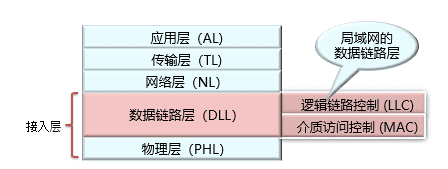

###### 接口

$\quad$ 数据链路层的作用是在物理相连的两个结点间进行数据传输

$\quad$ 主机与路由器统称为结点或站点

$\quad$ 连接两个站点间的物理链路: 链路或信道

$\quad$ $\quad$ 有线信道

$\quad$ $\quad$ 无线信道

$\quad$ $\quad$ 一个局域网整体也可以看作一个信道

$\quad$ 2层数据包: 帧, 封装了3层数据报文

###### 特点：差异性

$\quad$ 不同链路上采用不同协议:

$\quad$ $\quad$ 如：第一个链路为以太网链路，中间链路为帧中继, 最后一跳为802.11无线链路

$\quad$ 不同的链路层协议提供不同的服务

$\quad$ $\quad$ 如：可靠 vs 不可靠

$\quad$ 类比:

$\quad$ $\quad$ 从北京大学到上海交通大学

$\quad$ $\quad$ 公交车: 北京大学 -> 首都机场

$\quad$ $\quad$ 飞机: 首都机场 -> 上海虹桥

$\quad$ $\quad$ 地铁: 上海虹桥 -> 上海交通大学

$\quad$ $\quad$ 旅行者 = 网络层数据报文

$\quad$ $\quad$ 行程段 = 链路层信道

$\quad$ $\quad$ 交通方式 = 链路层协议

$\quad$ $\quad$ 旅行社（行程规划） = 路由协议

###### 实现的位置

$\quad$ 每一台主机与网络内部设备都需要实现链路层

$\quad$ 链路层的实现通常包括硬件、固件、软件部分

$\quad$ 硬件与固件：链路层主要功能在“网络适配器”（又称网络接口卡Network Interface Card，NIC）

$\quad$ $\quad$ NIC包括数据链路层+物理层

$\quad$ NIC通过数据总线(buses)接入系统，与链路层软件部分交互

$\quad$ 软件：给网络层提供接口、中断处理等

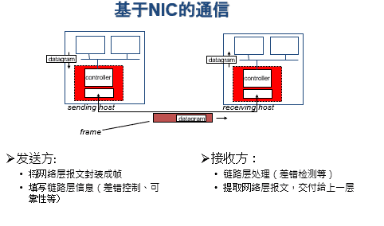

###### 提供的服务

$\quad$ 成帧 （Framing）

$\quad$ $\quad$ 将比特流划分成“帧”的主要目的是为了检测和纠正物理层在比特传输中可能出现的错误，数据链路层功能需借助“帧”的各个域来实现

$\quad$ 差错控制 （Error Control）

$\quad$ $\quad$ 处理传输中出现的差错，如位错误、丢失等

$\quad$ 流量控制 （Flow Control）

$\quad$ $\quad$ 确保发送方的发送速率，不大于接收方的处理速率−避免接收缓冲区溢出

$\quad$ 无确认 无连接 服务（ Unacknowledged connectionless ）

$\quad$ $\quad$ 接收方不对收到的帧进行确认

$\quad$ $\quad$ 适用场景：误码率低的可靠信道；实时通信；

$\quad$ $\quad$ 网络实例：以太网

$\quad$ 有确认 无连接 服务（ Acknowledged connectionless ）

$\quad$ $\quad$ 每一帧都得到单独的确认

$\quad$ $\quad$ 适用场景：不可靠的信道（无线信道）

$\quad$ $\quad$ 网络实例：802.11

$\quad$ 有确认 有连接 服务（ Acknowledged connection-oriented ）

$\quad$ $\quad$ 适用场景：长延迟的不可靠信道

$\quad$ 许多服务只在早期链路层技术中使用，链路层已不再提供

### 成帧

$\quad$ 关键问题：如何标识一个帧的开始？

$\quad$ $\quad$ 接收方必须能从物理层接收的比特流中明确区分出一帧的开始和结束，这个问题被称为帧同步或帧定界

$\quad$ $\quad$ 关键：选择何种定界符？定界符出现在数据部分如何处理？

$\quad$ 成帧（framing）的方式

$\quad$ $\quad$ 字节计数法（ Byte count ）

$\quad$ $\quad$ 带字节填充的定界符法（ Flag bytes with byte stuffing ）

$\quad$ $\quad$ 带比特填充的定界符法（ Flag bits with bit stuffing ）

$\quad$ $\quad$ 物理层编码违例（ Physical layer coding violations ）

###### 分组与帧的关系

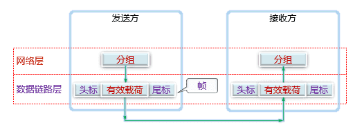

###### 字节计数法

$\quad$ 无差错传输的情形

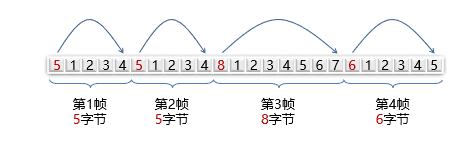

$\quad$ 出现了一个字节差错的情形

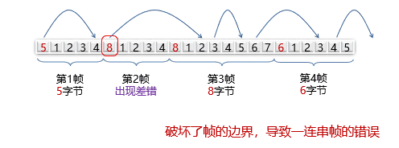

###### 带字节填充的定界符法

$\quad$ 定界符（FLAG）：一个特殊的字节，比如 01111110，即 0x7E，用于区分前后两个不同的帧

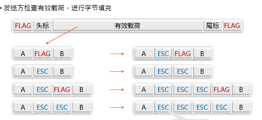

$\quad$ 接收方的处理

$\quad$ $\quad$ 逐个检查收到的每一个字节

$\quad$ $\quad$ 收到ESC−则后一字节无条件成为有效载荷，不予检查

$\quad$ $\quad$ 收到FLAG−则为帧的边界

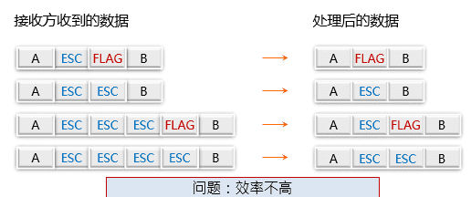

###### 带比特填充的定界符法

$\quad$ 定界符：两个0比特之间，连续6个1比特，即01111110，0x7E

$\quad$ 发送方检查有效载荷

$\quad$ $\quad$ 若在有效载荷中出现连续5个1比特，则直接插入1个0比特

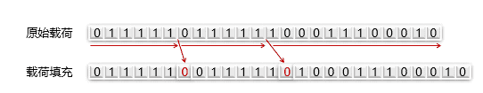

$\quad$ 接收方的处理

$\quad$ 若出现连续5个1比特

$\quad$ $\quad$ −若下一比特为0，则为有效载荷，直接丢弃0比特

$\quad$ $\quad$ −若下一比特为1，则连同后一比特的0，构成定界符，一帧结束

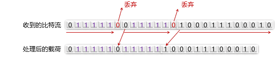

###### 物理编码违例

$\quad$ 核心思想：选择的定界符不会在数据部分出现

$\quad$ 4B/5B编码方案

$\quad$ $\quad$ 4比特数据映射成5比特编码，剩余的一半码字（16个码字）未使用，可以用做帧定界符

$\quad$ $\quad$ 例如： 00110组合不包含在4B/5B编码中，可做帧定界符

$\quad$ 前导码

$\quad$ $\quad$ 存在很长的 前导码（preamble），可以用作定界符

$\quad$ $\quad$ 例如：传统以太网、802.11

$\quad$ 曼切斯特编码 / 差分曼切斯特编码

$\quad$ $\quad$ 正常的信号在周期中间有跳变，持续的高电平（或低电平）为违例码，可以用作定界符

$\quad$ $\quad$ 例如：802.5令牌环网

### 差错检测与修复

  

$\quad$ 链路层存在的一个问题：信道的噪声导致数据传输问题

$\quad$ $\quad$ 差错（ incorrect ）：数据发生错误

$\quad$ $\quad$ 丢失（ lost ）：接收方未收到

$\quad$ $\quad$ 乱序（out of order）：先发后到，后发先到

$\quad$ $\quad$ 重复（repeatedly delivery）：一次发送，多次接收

$\quad$ 解决方案：差错检测与纠正、确认重传

$\quad$ $\quad$ 确认：接收方校验数据（差错校验），并给发送方应答，防止差错

$\quad$ $\quad$ 定时器：发送方启动定时器，防止丢失

$\quad$ $\quad$ 顺序号：接收方检查序号，防止乱序递交、重复递交

#### 差错检测与纠正

$\quad$ 如何解决信道传输差错问题

$\quad$ $\quad$ 通常采用增加冗余信息（或称校验信息）的策略

$\quad$ $\quad$ 简单示例：每个比特传三份，如果每比特的三份中有一位出错，可以纠正

$\quad$ $\quad$ 蓝牙1/3 FEC采用这种方法

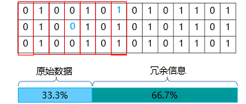

$\quad$ 目标：保证一定差错检测和纠错能力的前提下，如何减少冗余信息量？

$\quad$ 考虑的问题

$\quad$ $\quad$ 信道的特征和传输需求

$\quad$ $\quad$ 冗余信息的计算方法、携带的冗余信息量

$\quad$ $\quad$ 计算的复杂度等

$\quad$ 两种主要策略

$\quad$ $\quad$ 检错码（error-detecting code）

$\quad$ $\quad$ 纠错码（error-correcting code)

$\quad$ 选择错略具体策略取决于信道特征，如：

$\quad$ $\quad$ 误码率较高的无线链路

$\quad$ $\quad$ 误码率较低的光纤链路

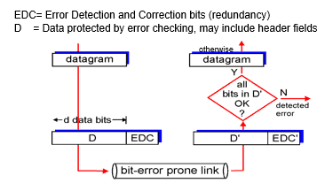

$\quad$ 检错码（error-detecting code）

$\quad$ $\quad$ 只能使接收方推断是否发生错误，但不能推断哪位发生错误，接收方可以请求发送方重传数据

$\quad$ $\quad$ 主要用在高可靠、误码率较低的信道上，例如光纤链路

$\quad$ $\quad$ 偶尔发生的差错，可以通过重传解决差错问题

$\quad$ 纠错码（error-correcting code)

$\quad$ $\quad$ 接收方能够判断接收到的数据是否有错，并能纠正错误（定位出错的位置）

$\quad$ $\quad$ 主要用于错误发生比较频繁的信道上，如无线链路

$\quad$ $\quad$ 也经常用于物理层，以及更高层（例如，实时流媒体应用和内容分发）

$\quad$ $\quad$ 使用纠错码的技术通常称为前向纠错（FEC，Forward Error Correction)

$\quad$ 差错检测不是100%正确的

$\quad$ $\quad$ 有些错误可能无法被检测出来，但概率极低

$\quad$ 使用更多的冗余信息，通常可以提升正确率

##### 典型检错码

###### 奇偶校验

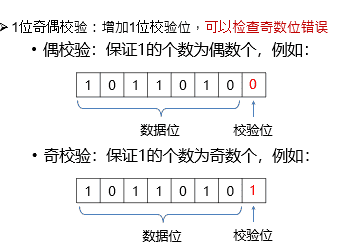

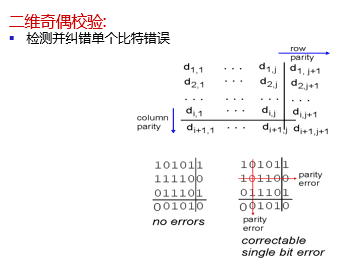

  

###### 校验和

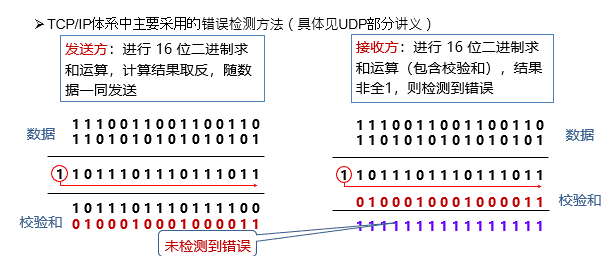

###### 循环冗余校验CRC

$\quad$ 设原始数据D为m位二进制串

$\quad$ 如果要产生r位CRC校验码，事先选定一个r+1位二进制串G (称为生成多项式，收发双方提前商定)，G的最高位为1

$\quad$ 将原始数据D乘以2r （相当于在D后面添加 r 个 0），产生m+r位二进制串

$\quad$ 用G对D*2r做模2除，得到余数R（r位，不足r位前面用0补齐）即为CRC校验码

$\quad$ 接收端校验：收到<D, R>

$\quad$ $\quad$ 将<D, R>除以G（模2除），若余数为0，则通过校验

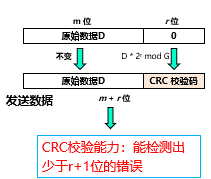

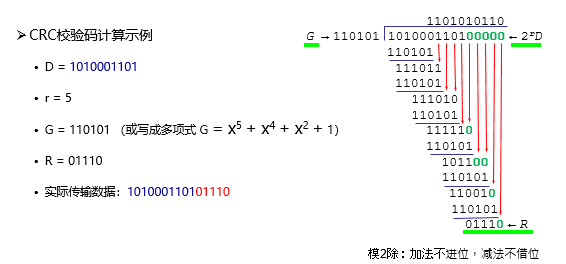

$\quad$ 如何生成多项式G

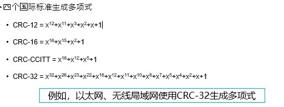

  

###### 理论分析

$\quad$ 码字 (code word)：一个包含m个数据位（信息位）和r个校验位的n位单元

$\quad$ $\quad$ 描述为 (n, m) 码，n=m+r

$\quad$ 码率 (code rate)：码字中不含冗余部分所占的比例，可以用m/n表示

$\quad$ 海明距离 (Hamming distance)：两个码字之间不同对应比特的数目

$\quad$ $\quad$ 例：0000000000 与0000011111的海明距离为5

$\quad$ $\quad$ 如果两个码字的海明距离为d，则需要d个单比特错就可以把一个码字转换成另一个码字

$\quad$ $\quad$ 为了检查出d个错（比特错），可以使用海明距离为 d+1 的编码

$\quad$ $\quad$ 为了纠正d个错，可以使用海明距离为 2d+1 的编码

$\quad$ 例如：

$\quad$ $\quad$ 一个只有4个有效码字的编码方案：0000000000, 0000011111, 1111100000, 1111111111

$\quad$ $\quad$ 海明距离为5，可以检测4位错，纠正2位错

$\quad$ $\quad$ 如果已知只有1位或2位错误，接收方接收0000000111

$\quad$ $\quad$ $\quad$ −则可知原码字为：0000011111

$\quad$ $\quad$ 如果发生3位错误，例如0000000000变成0000000111，接收方无法纠正错误，但可以检测出错误

$\quad$ 纠正单比特错误的最低要求

$\quad$ $\quad$ 目的：m个信息位，r个校验位，纠正单比特错

$\quad$ $\quad$ n个比特一共可以有2n个码字，包含有效码字与无效码字

$\quad$ $\quad$ 每个m位有效信息，除了本身的n位有效码字，与该有效码字距离为1的n个码字必须无效

$\quad$ $\quad$ $\quad$ 否则，当单比特错误发生时，无法判断是否出错

$\quad$ $\quad$ 同时，任何两个有效码字，它们距离为1的无效码字没有重叠

$\quad$ $\quad$ $\quad$ 否则，无法判断错误的码字离哪个有效码字更近

$\quad$ $\quad$ 因此，每个m位有效信息，实际上消耗至少 n+1 个码字，即：(n + 1) 2m £ 2n

$\quad$ $\quad$ 利用 n = m + r，得到 (m + r + 1) £ 2r

$\quad$ $\quad$ 在给定m的情况下，利用该式可以得出r的下界

###### 海明码

$\quad$ 目标：以奇偶校验为基础，如何找到出错位置，提供1位纠错能力

$\quad$ 理解海明码编码过程，以 (15, 11)海明码为例

$\quad$ $\quad$ 15位 = 11个数字位 + 4个校验位

$\quad$ $\quad$ 校验位：2的幂次方位（记为p1, p2, p4, p8）

$\quad$ $\quad$ 每个校验位对数据位的子集做校验，缩小定位错误的范围

$\quad$ 例如：11比特的数据01011001101

$\quad$ $\quad$ 11比特数据按顺序放入数据位

$\quad$ $\quad$ 问题：每个校验位如何计算？

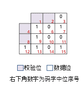
$\quad$ 对于第 k 个数据位，将 k 分解为2的次幂之和，得到的每个2的次幂，都参与对第 k 位的校验

  

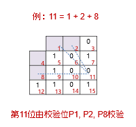

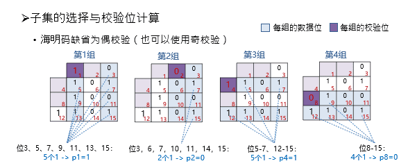

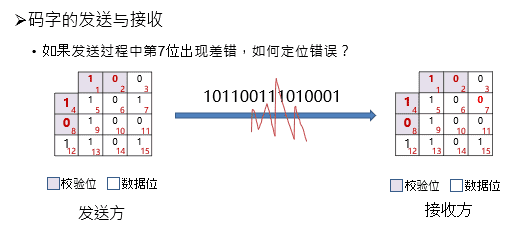

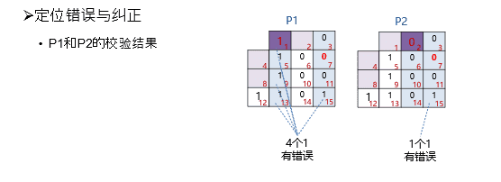

  

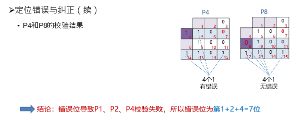

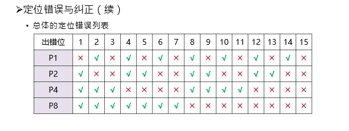

###### Reed-Solomon code

  

$\quad$ RS码：以有限域运算为基础，提供多位纠错能力

$\quad$ $\quad$ RS会将需要编码的01流数据重新划分为以符号(Symbol)为单位的数据块

$\quad$ $\quad$ m表示符号的大小，如 m=4 表示每个符号由4位二进制数组成

$\quad$ $\quad$ 对于一个(n, k) RS编码，k为原始数据符号数，n-k为校验符号数

$\quad$ $\quad$ n-k=2t，t表示能够纠正的错误数

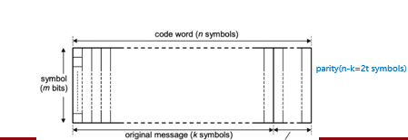

  

$\quad$ 例子：每个Symbol为10位二进制数 (m=10)

$\quad$ 以RS(544, 514)编码为例：

$\quad$ $\quad$ 原始需要保护的数据为514个symbols (k=514)

$\quad$ $\quad$ 校验数据为30个symbols (2t=30)

$\quad$ $\quad$ 最终完成的编码为544个symbols (n=544)

$\quad$ $\quad$ 可以纠正15个symbols的错误

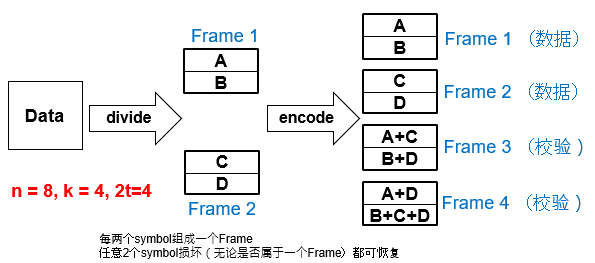

$\quad$ 校验帧里的内容，通过对数据进行线性组合得到

$\quad$ $\quad$ 本质上是一个伽罗华域 Galois Field arithmatic (又称有限域 finite field arithmetic)

$\quad$ $\quad$ 加、乘、除运算都在GF(2m)上进行，m为symbol的位数

$\quad$ G = 生成矩阵 Generator matrix (k x n)

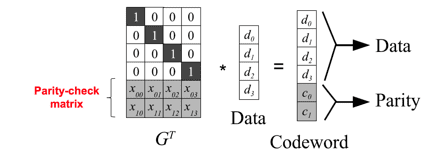

$\quad$ 有多种方式可以计算parity

$\quad$ $\quad$ 不直接构造G：基于生成多项式

$\quad$ $\quad$ 直接构造G：使用范德蒙德矩阵 Vandermonde matrix、柯西矩阵 Cauchy Matrix

**使用生成多项式**

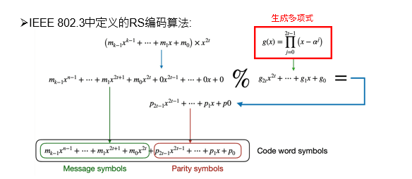

$\quad$ 编码的数学过程：

$\quad$ $\quad$ 1.将原始需要编码的数据后面补2t个0（图中「取余」运算符左侧部分，补0意思是为校验码占位）

$\quad$ $\quad$ 2.除以生成多项式g(x)  取余下的多项式为校验多项式p(x) 

$\quad$ $\quad$ 3.将校验多项式加到刚才补过0的编码数据多项式中，就是最终生成的编码

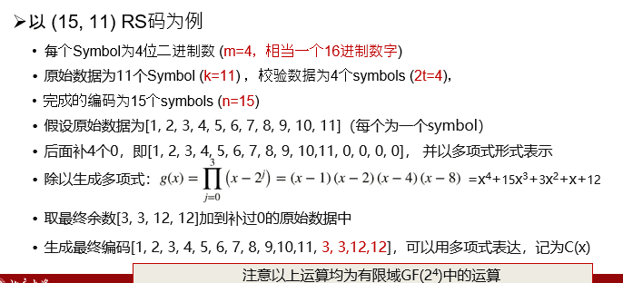

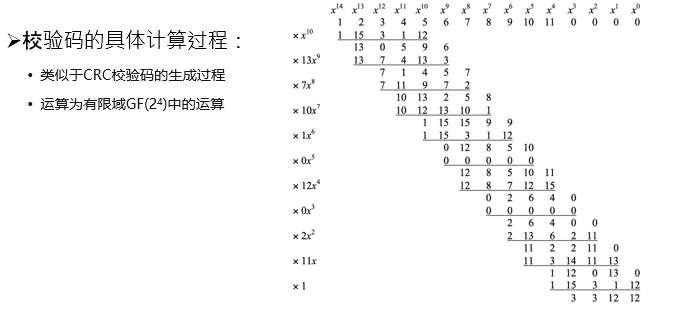

**使用范德蒙德矩阵**

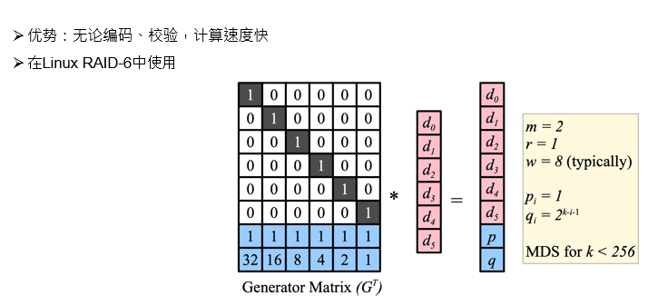

**使用柯西矩阵**

  

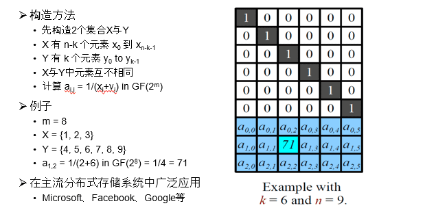

### 访问控制

$\quad$ 信道：信号的通道

$\quad$ $\quad$ 比如：双绞线、铜缆、光纤、卫星、空气等

$\quad$ 点到点信道：信道直接连接两个端点

$\quad$ $\quad$ 比如：家中计算机通过modem连接到电信公司端局

$\quad$ 多点访问信道： 多用户共享一根信道

$\quad$ $\quad$ 早期使用集线器的以太网是总线式的，信道是共享的

$\quad$ $\quad$ 其他例子：WiFi

$\quad$ 广播信道面临的问题

$\quad$ $\quad$ 可能两个（或更多）站点同时请求占用信道，产生冲突（collisions)

$\quad$ 解决办法：介质的多路访问控制

$\quad$ $\quad$ 在多路访问信道上确定下一个使用者（信道分配）

$\quad$ $\quad$ 本质上是分布式算法

$\quad$ $\quad$ 挑战：结点间协同，本身也需要使用信道

$\quad$ 没有专门用于分布式访问控制的信道

###### 常见的局域网拓扑

$\quad$ 局域网经典拓扑：总线拓扑、星型拓扑、环型拓扑

$\quad$ 共同点：共享一根信道（别称：广播信道、多路访问信道、随机访问信道）

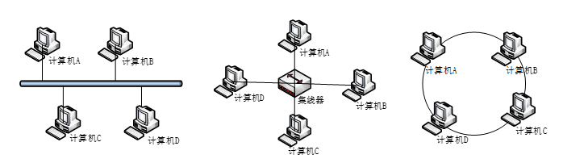

###### 理想的多路访问控制

$\quad$ 目标：

$\quad$ $\quad$ 性能：当只有一个结点需要传输时，能够以速率R进行发送

$\quad$ $\quad$ 公平：当M个结点需要传输时，每个结点发送速率R/M

$\quad$ $\quad$ 去中心化

$\quad$ $\quad$ $\quad$ 不需要结点协调传输

$\quad$ $\quad$ $\quad$ 不需要全局时钟或者其他全局信息

$\quad$ $\quad$ $\quad$ 简单、易实现

###### 主要的多路访问控制方法

$\quad$ 信道划分（channel partitioning）

$\quad$ $\quad$ 将信道划分为多个部分（时间、频率、编码）

$\quad$ $\quad$ 每个站点分配一个部分，进行无冲突的传输

$\quad$ 随机接入（random access）

$\quad$ $\quad$ 不划分信道，允许冲突

$\quad$ $\quad$ 冲突发生时，进行“恢复”

$\quad$ 轮流协议（taking turns）

#### 信道划分

##### TDMA: time division multiple access

$\quad$ 划分出等长时间片（长度为报文传输时间）

$\quad$ 时间片依次分给各个站点

$\quad$ 未使用的时间片处于空闲

$\quad$ 例子: 6-站点共享信道, 站点1,3,4有数据包要发送, 时间片2,5,6空闲

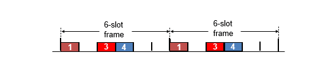

##### FDMA: frequency division multiple access

$\quad$ 将信道分为多个频段

$\quad$ 每个站点分配得到1个固定的频段，每个频段带宽相同

$\quad$ 未使用的频段处于空闲

$\quad$ 例子: 6-站点共享信道, 站点1,3,4有数据包要发送, 频段2,5,6空闲

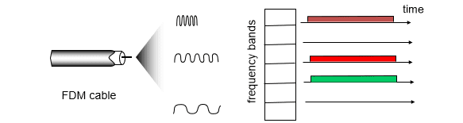

##### 静态分配的性能分析

$\quad$ 静态分配方法：TDM、FDM

$\quad$ 静态分配的排队论分析（ M/M/1排队系统模型）

$\quad$ $\quad$ M（顾客到达时间间隔分布）

$\quad$ $\quad$ $\quad$ 帧到达时间间隔服从指数分布

$\quad$ $\quad$ $\quad$ 平均到达率（输入率）：l 帧/秒

$\quad$ $\quad$ M（服务时间分布）

$\quad$ $\quad$ $\quad$ 帧长度服从指数分布，平均长度1/m 位/帧

$\quad$ $\quad$ $\quad$ 信道容量为C 位/秒，则信道服务率为mC 帧/秒

$\quad$ $\quad$ 1（并列服务台个数）

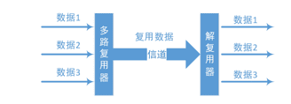

##### 子信道的平均延迟

  

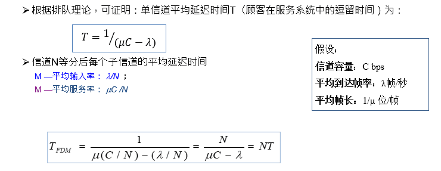

##### 静态分配的特点

$\quad$ 问题

$\quad$ $\quad$ 资源分配不合理，不满足用户对资源占用的不同需求

$\quad$ $\quad$ 有资源浪费，效率低

$\quad$ $\quad$ 延迟时间增大N倍

$\quad$ 适用情况

$\quad$ $\quad$ 适于用户数量少且用户数目固定的情况

$\quad$ $\quad$ 适于通信量大且流量稳定的情况

$\quad$ $\quad$ 不适用于突发性业务的情况

$\quad$ 设计动态分配的方法

$\quad$ $\quad$ 目的1：更好地满足需求

$\quad$ $\quad$ 目的2：提高信道利用率

##### 第三种信道划分：CDMA：Code Division Multiple Access

$\quad$ 为每个站点分配一种编码

$\quad$ 即使冲突发生，接收方也能进行解码

$\quad$ 主要用于无线通信（后续无线部分会讲到

#### 随机访问

###### 随机访问协议

$\quad$ 当任意站点有数据要发送时

$\quad$ $\quad$ 以信道带宽R全速发送

$\quad$ $\quad$ 不需要事先协调

$\quad$ 当2个或更多站点同时发送时，产生冲突

$\quad$ 随机访问的多路信道控制、关注:

$\quad$ $\quad$ 冲突检测

$\quad$ $\quad$ 从冲突中恢复 (如：等待一段时间后重发)

$\quad$ 典型例子:

$\quad$ $\quad$ 纯ALOHA

$\quad$ $\quad$ 时隙ALOHA（slotted ALOHA）

$\quad$ $\quad$ CSMA

$\quad$ $\quad$ CSMA/CD

$\quad$ $\quad$ CSMA/CA

###### 随机访问概念模型

$\quad$ 信道始终处于三种状态之一

$\quad$ $\quad$ 传输周期：一个站点使用信道，其他站点禁止使用

$\quad$ $\quad$ 竞争周期：所有站点都有权尝试使用信道

$\quad$ $\quad$ 空闲周期：所有站点都不使用信道

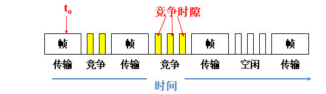

##### ALOHA类

###### 纯ALOHA协议工作原理

$\quad$ 原理：想发就发！

$\quad$ $\quad$ 每个站点收到上层数据包，立即向信道发送

$\quad$ $\quad$ 没有任何同步或信道检测

$\quad$ 特点

$\quad$ $\quad$ 冲突：某个时刻有两个或以上的帧

$\quad$ $\quad$ 随时可能冲突

$\quad$ $\quad$ 冲突的帧被完全破坏

$\quad$ $\quad$ 破坏了的帧要重传

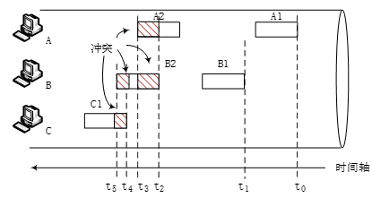

###### 纯ALOHA的效率

$\quad$ 效率的指标: N个站点时，信道传输成功的概率

$\quad$ 假设:

$\quad$ $\quad$ 传输时间为1单位时间

$\quad$ $\quad$ N个站点，每个站点在单位时间内的传输概率为p

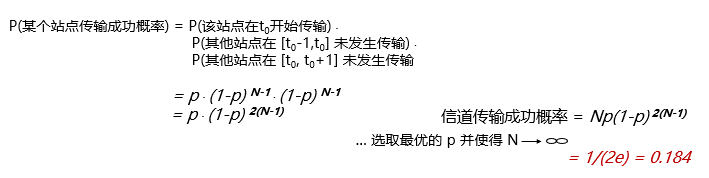

**另一种计算：**

$\quad$ 定义

$\quad$ $\quad$ 帧时：发送一个标准长的帧所需的时间

$\quad$ 服从泊松分布

$\quad$ $\quad$ 一个帧时内用户产生新帧：均值N个

$\quad$ $\quad$ 一个帧时内信道中产生的帧（包括重传）：均值G个

$\quad$ 分析：

$\quad$ $\quad$ G >= N，轻载G=N（无冲突），重载G>N（冲突/重传）

$\quad$ 概率

$\quad$ $\quad$ Pr[k] = Gke-G / k! (一个帧时内信道中产生k个帧，泊松分布)

$\quad$ $\quad$ Pr[k=0] = e-G （一个帧时内信道中产生0个帧）

$\quad$ 吞吐量(Throughout) S

$\quad$ $\quad$ 在帧时T内发送成功的平均帧数。

$\quad$ $\quad$ $\quad$ 显然，0<S<1

$\quad$ $\quad$ S = 1时分组一个接一个地发送出去，帧之间没有空隙。一般用S接近于1的程度来衡量信道的利用率

$\quad$ G的物理意义：运载负载(Carried load)，又称网络负载

$\quad$ $\quad$ 帧时T内所有通信站总共发送的帧平均值(包括原发和重发的分组)

$\quad$ $\quad$ 显然，G≧S，只有在不发生冲突时G才等于S。当重负载(G>>1) 时，冲突频繁

$\quad$ P0：P0是一帧发送成功(即未发生冲突)的概率，就是发送成功的分组在已发送分组的总数中所占的比例

$\quad$ $\quad$ S = G x P0

$\quad$ 如何计算传输成功的概率P0？

$\quad$ $\quad$ 单向传播延迟（第一个bit发出到最后一个bit到达）：D

$\quad$ $\quad$ 冲突危险期：2D

$\quad$ $\quad$ $\quad$ 生成帧均值：2G

$\quad$ $\quad$ $\quad$ 不遭受冲突的概率：P0=e-2G

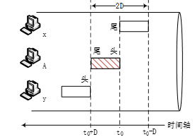

$\quad$ P0的含义是在连续两个T的时间内都没有其它帧生成的概率，即连续两个T的时间内都生成0帧的概率之乘积

$\quad$ 生成0帧的概率(即不生成帧的概率)，得：

$\quad$ $\quad$ Pr[k=0] = e-G

$\quad$ $\quad$ $\quad$ 注意：P0与Pr[k=0]是两个完全不同的概念。

$\quad$ 所以：P0= Pr[k=0]* Pr[k=0] = (e-G)2= e-2G

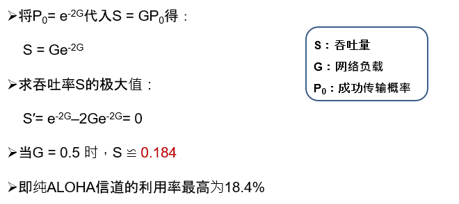

###### 分隙ALOHA

$\quad$ 假设

$\quad$ $\quad$ 所有帧大小一样

$\quad$ $\quad$ 时间划分为等长的时间槽，每个时间槽刚好可以传输1个帧

$\quad$ $\quad$ 站点只能在时间槽开始时发起传输

$\quad$ $\quad$ $\quad$ 冲突只在时间槽起点发生

$\quad$ $\quad$ 所有站点的时钟是同步的

$\quad$ 操作

$\quad$ $\quad$ 当站点有帧需要发送时，在下一个时间槽开始时进行传输

$\quad$ $\quad$ $\quad$ 如果直到传输完毕都没有冲突，则完成

$\quad$ $\quad$ $\quad$ 如果发生冲突，以概率p在下一时间槽重传

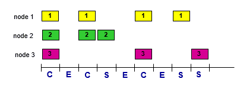

###### 分隙ALOHA的效率

$\quad$ 效率的指标: N个站点时，信道传输成功的概率

$\quad$ 假设:

$\quad$ $\quad$ 传输时间为1单位时间

$\quad$ $\quad$ N个站点，每个站点在单位时间内的传输概率为p

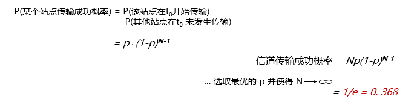

**基于泊松模型计算**

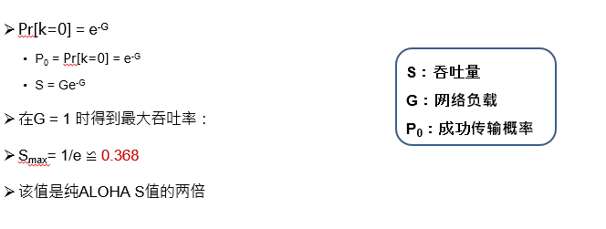

###### 小结两种ALOHA协议

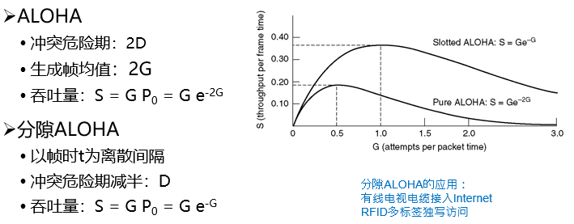

##### CSMA类

$\quad$ CSMA：Carrier Sense Multiple Access

$\quad$ 特点：“先听后发”

$\quad$ $\quad$ 如果信道空闲，则发送

$\quad$ $\quad$ 如果信道忙，则推迟发送

$\quad$ 类比：会议上有人说话时，不要打断

$\quad$ 如侦听到介质上无数据发送才发送，发送后还会发生冲突吗？

$\quad$ $\quad$ 肯定会！

$\quad$ $\quad$ 两种情形

$\quad$ $\quad$ $\quad$ （1）刚好同时传送；（2）来自其他站点的传播延迟时间

###### 非持续式CSMA

$\quad$ 特点

$\quad$ $\quad$ 经侦听，如果介质空闲，开始发送

$\quad$ $\quad$ 如果介质忙，则等待一个随机分布的时间，然后重复步骤①

$\quad$ 好处

$\quad$ $\quad$ 等待一个随机时间可以减少再次碰撞冲突的可能性

$\quad$ 缺点

$\quad$ $\quad$ 等待时间内介质上如果没有数据传送，这段时间是浪费的

###### 1-持续式CSMA

$\quad$ 步骤

$\quad$ $\quad$ 1.经侦听，如介质空闲，那么立刻发送

$\quad$ $\quad$ 2.如介质忙，持续侦听，一旦空闲重复1

$\quad$ 好处：持续式的延迟时间要少于非持续式

$\quad$ 仍存在问题：如果两个以上的站等待发送，一旦介质空闲就一定会发生冲突

$\quad$ $\quad$ 原因：只要空闲就发送，这种方式又被称作1-持续式

###### p-持续式CSMA

$\quad$ 步骤

$\quad$ $\quad$ 1.经侦听，如介质空闲，那么以 p的概率立刻发送，以(1–p)的概率推迟一个时间单元再进行处理

$\quad$ $\quad$ 2.如介质忙，持续侦听，一旦空闲重复1

$\quad$ $\quad$ 3.如果发送已推迟一个时间单元，再重复步骤1

$\quad$ 注意

$\quad$ $\quad$ 1-持续式是p-持续式的特例

###### 冲突检测

$\quad$ 传播时延导致2个站点不能立即检测到冲突

$\quad$ 冲突发生时，整个传输都将被浪费

$\quad$ 冲突概率由传播时延决定

$\quad$ 动机：冲突仍然可能发生，一旦冲突发生，造成浪费信道

$\quad$ 原理：“先听后发、边发边听”

$\quad$ $\quad$ 发送时持续侦听信道

$\quad$ $\quad$ 一旦传输过程中监听到冲突，立刻中止传输，减少信道浪费

$\quad$ 类比

$\quad$ $\quad$ 有礼貌的绅士：说话过程中如果听到其他人也在说话，就马上停下

$\quad$ 例子

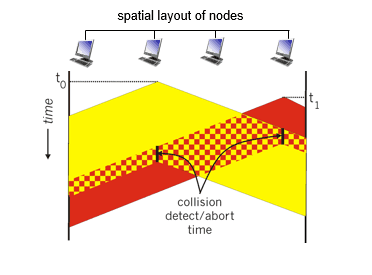

###### CSMA/CD = 1-持续式 + 冲突检测

$\quad$ 流程

$\quad$ $\quad$ 1.经侦听，如介质空闲，则发送

$\quad$ $\quad$ 2.如介质忙，持续侦听，一旦空闲立即发送

$\quad$ $\quad$ 3.发送过程中，进行冲突检测

$\quad$ $\quad$ 4.如果发生冲突，立即中止发送

$\quad$ $\quad$ 5.等待一个随机分布的时间再重复步骤1

$\quad$ 注意

$\quad$ $\quad$ 非持续式、1-持续式、p-持续式关注的是发送前的操作

$\quad$ $\quad$ 冲突检测关注的是发送后的操作

$\quad$ $\quad$ 因此，非持续式、1-持续式与p-持续式都可以选择与冲突检测进行结合

$\quad$ $\quad$ 实际的CSMA/CD，特指1-持续式 + 冲突检测

###### 中止传输

$\quad$ 中止发送后，发送Jam（强化）信号

$\quad$ $\quad$ t4时刻：甲检测到冲突，发送Jam

$\quad$ $\quad$ t3时刻：乙检测到冲突，发送Jam

$\quad$ Jam信号告知其他站点：信道内将有数据要传

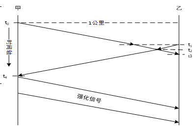
  

###### 冲突窗口

$\quad$ 冲突窗口：从发出帧到检测发现冲突所需要的最长时间

$\quad$ $\quad$ 意味着发出后需要侦听一个冲突窗口才能确保没有冲突

$\quad$ 数值上：等于最远两站传播时间的两倍，即2D（D是单边延迟）

$\quad$ $\quad$ 2D相当于1个来回传播延迟RTT：Round Trip Time

###### CSMA/CD的效率

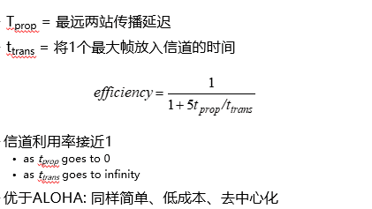

#### 轮流协议

$\quad$ 信道划分:

$\quad$ $\quad$ 高负载时：信道利用率高、保证公平

$\quad$ $\quad$ 低负载时：利用率低，即使只有1个站点需要发数据，也只能用1/N带宽$\quad$ 随机访问

$\quad$ $\quad$ 低负载时：利用率高

$\quad$ $\quad$ 高负载时：冲突严重

$\quad$ 轮流协议：将两者优势结合

$\quad$ $\quad$ 轮询协议

$\quad$ $\quad$ 令牌协议

$\quad$ $\quad$ 位图协议

$\quad$ $\quad$ 二进制倒计数协议

$\quad$ $\quad$ 有限竞争协议：自适应树

###### 轮询协议

$\quad$ 在站点间选择一个主节点

$\quad$ 主节点给其他站点分配信道使用权

$\quad$ $\quad$ 通常轮流通知每个站点，可以传输多少帧

$\quad$ $\quad$ 传输完成后，通知下一个站点

$\quad$ 问题:

$\quad$ $\quad$ 轮询本身占用带宽

$\quad$ $\quad$ 通知引入延迟

$\quad$ $\quad$ 单点故障

###### 令牌传递

$\quad$ 令牌：发送权限

$\quad$ $\quad$ 只有获得令牌的站点可以发送数据

$\quad$ $\quad$ 令牌通过特殊的令牌消息进行传递

$\quad$ 将站点组织成一定结构，使得可以安排顺序

$\quad$ $\quad$ 令牌环：环形拓扑

$\quad$ $\quad$ 除了环，也可以运行在其它拓扑上，如令牌总线

$\quad$ 令牌的运行：

$\quad$ $\quad$ 一个站点获取到令牌后，就可以发送帧，然后把令牌交给下一个站点

$\quad$ $\quad$ 如果没有帧要发，直接传递令牌

$\quad$ 缺点：

$\quad$ $\quad$ 令牌的维护代价

$\quad$ $\quad$ 令牌本身的可靠性

###### 位图协议

$\quad$ 竞争期：在自己的时槽内发送竞争比特

$\quad$ $\quad$ 举手示意资源预留

$\quad$ 传输期：按序发送

$\quad$ $\quad$ 明确的使用权，避免了冲突

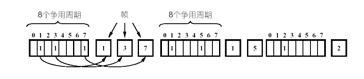

$\quad$ 假设

$\quad$ $\quad$ 有N个站点，需N个时隙，每帧d比特

$\quad$ 信道利用率

$\quad$ $\quad$ k个站点需要实际发送数据，利用率为 kd / (kd + N)

$\quad$ $\quad$ 在低负荷条件下（k << N）：d/(d+N) ，N越大，站点越多，利用率越低

$\quad$ $\quad$ 在高负荷条件下（k ≈ N）：d/(d+1)，接近100%

$\quad$ 缺点

$\quad$ $\quad$ 位图协议无法考虑优先级

###### 二进制倒计数协议

$\quad$ 站点：编序号，序号长度相同

$\quad$ 竞争期：有数据发送的站点从高序号到低序号排队，高者得到发送权

$\quad$ $\quad$ 每个站点发送序号中的某1位比特

$\quad$ $\quad$ 如果发现有更高优先级的站点也要发送（自身比特0，其他站点比特1），则放弃

$\quad$ $\quad$ 最后决出优胜站点，进行发送

$\quad$ 特点：高序号站点优先

$\quad$ $\quad$ 好事还是坏事？

$\quad$ N个站的二进制编码所需位数是log2N位，每帧d比特

$\quad$ 信道的利用率为：d/(d+Nlog2N)

###### 有限竞争协议

$\quad$ 有限竞争协议利用竞争协议和无冲突协议的优势

$\quad$ $\quad$ 在低负荷时：使用竞争法，以减少延迟时间

$\quad$ $\quad$ 在高负荷时：使用无冲突法，以获得高的信道效率。

$\quad$ 自适应树搜索是一种有限竞争技术

$\quad$ $\quad$ 在一次成功传输后的第一个竞争时隙，所有站点同时竞争

$\quad$ $\quad$ 如果只有一个站点申请，则获得信道

$\quad$ $\quad$ 否则在下一竞争时隙，有一半站点参与竞争（递归），下一时隙由另一半站点参与竞争

$\quad$ $\quad$ 所有站点构成一棵完全二叉树

  

---