# 计算机网络

## 链路层-无线网络

### 无线网络简介

###### 组成无线网络的元素

$\quad$ 无线主机

$\quad$ $\quad$ 例：笔记本电脑，智能手机

$\quad$ $\quad$ 运行应用程序

$\quad$ $\quad$ 静止的或者移动的

$\quad$ $\quad$ $\quad$ 无线并不意味着移动

$\quad$ 基站

$\quad$ $\quad$ 通常与有线网络连接

$\quad$ $\quad$ 主要功能：中继（relay）

$\quad$ $\quad$ $\quad$ 在有线网络与无线主机之间互相传输报文

$\quad$ $\quad$ $\quad$ 有覆盖范围限制

$\quad$ $\quad$ $\quad$ 例：无线信号塔，WiFi接入点

$\quad$ 无线链路

$\quad$ $\quad$ 主要用于连接基站与无线主机

$\quad$ $\quad$ $\quad$ 有些场景下也用于连接其他网络设备（如交换机与路由器）

$\quad$ $\quad$ 需要多路访问控制，以协调各个主机对链路的访问

$\quad$ $\quad$ 各类链路传输速率，支持距离差异很大

###### 无线网络的分类

$\quad$ 类型1：基于基础设施的无线网络

$\quad$ $\quad$ 特点：使用基站连向更大的网络

$\quad$ $\quad$ 切换（handoff）问题: 设备移动，导致所连接的基站发生变化

$\quad$ 类型2：自组织网络

$\quad$ $\quad$ 没有基站

$\quad$ $\quad$ 节点自我组织成一个网络

$\quad$ $\quad$ $\quad$ 节点只能在无线链路的覆盖范围内互相连接

$\quad$ $\quad$ $\quad$ 相互路由、交换

$\quad$ 还可以根据数据报文是否经过多个无线链路分类

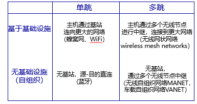

###### 无线网络的核心问题

$\quad$ 无线（wireless)：如何通过无线链路进行数据传输

$\quad$ $\quad$ 数据链路层技术

$\quad$ $\quad$ 需要根据无线链路物理特性，考虑差错控制、多路访问控制等功能

$\quad$ 移动（mobility）：处理主机所连基站发生的变动

$\quad$ $\quad$ 定位主机

$\quad$ $\quad$ IP地址

$\quad$ $\quad$ 保持TCP连接

### 无线链路特征与多路访问

###### 无线链路特征

$\quad$ 递减的信号强度

$\quad$ $\quad$ 信号穿过物体时，强度将减弱

$\quad$ $\quad$ 即使自由空间中，随着距离增加也会衰减（称为路径损耗 path loss）

$\quad$ 其他信号源的干扰

$\quad$ $\quad$ 如：2.4GHz 无线LAN与2.4GHz 无线电话

$\quad$ $\quad$ 微波、电动机等等

$\quad$ 多路径传播：电磁波反射后，通过不同路径到达接收端

$\quad$ 在无线链路上进行数据传输更为困难

  

$\quad$ 信噪比（signal-to-noise ratio，SNR）：收到信息强度与噪声强度的相对值

$\quad$ $\quad$ 单位：分贝

$\quad$ $\quad$ 信噪比越高，越容易提取信息

$\quad$ 比特差错率（BER）：接收方收到的错误比特的比例

$\quad$ 物理层：不同传输速率、不同BER vs SNR

$\quad$ $\quad$ 给定物理层：增加传输功率 -> 增加SNR -> 降低BER

$\quad$ $\quad$ 给定信噪比：增加传输速率 -> 增加BER

$\quad$ 实际：SNR随着主机移动或者环境变化改变

$\quad$ $\quad$ 自适应物理层技术：在BER不超过特定值下，选择最高传输速率

###### 多路访问问题

相比于有线链路，无线链路有更复杂问题

$\quad$ 问题1：隐藏终端

$\quad$ $\quad$ B与A可以互相听到

$\quad$ $\quad$ B与C可以互相听到

$\quad$ $\quad$ A与C之间存在障碍，无法听到对方存在

$\quad$ $\quad$ $\quad$ 更无法知道双方在B处互相干扰

$\quad$ 问题2：信号衰减

$\quad$ $\quad$ B与A可以互相听到

$\quad$ $\quad$ B与C可以互相听到

$\quad$ $\quad$ A与C之间收到的对方信号极为微弱

$\quad$ $\quad$ $\quad$ 更无法知道双方在B处互相干扰

##### 多路访问

$\quad$ 信道划分:

$\quad$ $\quad$ TDMA、FDMA、基于编码（CDMA）

$\quad$ 随机访问

$\quad$ $\quad$ ALOHA类：纯ALOHA、时隙ALOHA

$\quad$ $\quad$ CSMA类：非持续CSMA、1-持续CSMA、p-持续CSMA、CSMA/CD、CSMA/CA（WLAN中使用）

$\quad$ 轮流协议：

$\quad$ $\quad$ 轮询协议

$\quad$ $\quad$ 令牌协议

$\quad$ $\quad$ 位图协议

$\quad$ $\quad$ 二进制倒计数协议

$\quad$ $\quad$ 有限竞争协议：自适应树

###### 码分复用 Code Division Multiple Access (CDMA)

$\quad$ 本质上将所有可能编码的集合划分给用户

$\quad$ $\quad$ 所有用户采用同样的信道频段

$\quad$ $\quad$ 每个用户拥有各自的编码机制（称为码片 code chipping）

$\quad$ 允许用户同时传输数据

$\quad$ $\quad$ 通过编码机制的设计，尽量减少干扰的影响（称为编码正交性）

$\quad$ 编码过程

  

$\quad$ 解码过程

$\quad$ 例子:

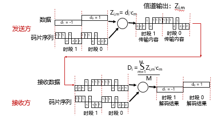

$\quad$ 两个发送者

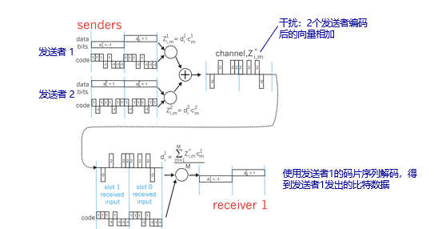

$\quad$ CDMA属扩频(spread spectrum)通信中的一种

$\quad$ 扩频通信通常有两大类：

$\quad$ $\quad$ 1.一种是直接序列扩频DSSS (Direct Sequence Spread Spectrum)，如CDMA使用码片序列就是这一类

$\quad$ $\quad$ 2.另一种是跳频扩频FHSS (Frequency Hopping Spread Spectrum)，在蓝牙802.15中使用

  

### 802.11无线局域网（WiFi）

$\quad$ 网络由基本服务集（Basic Service Set, BSS) 组成

$\quad$ 基本服务集包含:

$\quad$ $\quad$ 无线主机

$\quad$ $\quad$ 接入点（access point, AP): 基站的角色

$\quad$ $\quad$ $\quad$ 主机间通过AP进行通信

$\quad$ $\quad$ $\quad$ 只在基础设施模式下存在

$\quad$ $\quad$ 自组织模式: 只有无线主机

###### 信道与关联

$\quad$ 每个无线主机在能够发送或接收网络层数据之前，必须与一个AP关联（association)

$\quad$ AP的部署（802.11b为例）

$\quad$ $\quad$ 管理员为每个AP配置一个服务集标识符（SSID）

$\quad$ $\quad$ 802.11b频段范围 2.4GHz-2.485GHz spectrum，被划分为11个信道

$\quad$ $\quad$ 管理员为AP选择一个信道

$\quad$ $\quad$ 冲突不可避免：不同的AP可能选择相同信道、信道可能重叠

$\quad$ 主机关联AP的过程

$\quad$ $\quad$ AP周期性发送信标帧（beacon frame），包含AP的SSID与MAC地址

$\quad$ $\quad$ 主机扫描信道，监听信标帧

$\quad$ $\quad$ 收到多个AP的信标帧时，选择1个进行关联

$\quad$ $\quad$ $\quad$ 没有明确的选择算法

$\quad$ $\quad$ 关联时，需要身份验证（可选）、分配IP（通常用DHCP）

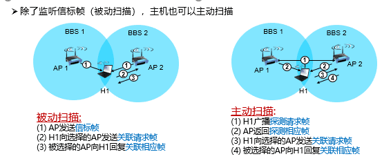

###### 多路访问控制

$\quad$ 目标：避免冲突，即防止多于1个站点同时在信道内传输数据

$\quad$ $\quad$ 难点1：隐藏终端

$\quad$ $\quad$ 难点2：信号衰减

$\quad$ 发送前侦听信道

$\quad$ $\quad$ 避免干扰正在使用信道的其他站点

$\quad$ 发送时不再进行冲突检测（有别于以太网CSMA/CD）

$\quad$ $\quad$ 由于信号强度衰减，发送时很难收到冲突信号

$\quad$ $\quad$ CSMA/CA（collision avoidance）：发送前就尽量避免冲突

###### CSMA/CA

$\quad$ 802.11 发送方

$\quad$ $\quad$ 1 如果发送前信道空闲时间达到DIFS，则发送整个帧

$\quad$ $\quad$ $\quad$ 发送时不进行冲突检测

$\quad$ $\quad$ 2 如果发送前检测到信道忙，则选择一个随机值作为计时器

$\quad$ $\quad$ $\quad$ 信道空闲时，计时器递减

$\quad$ $\quad$ $\quad$ 信道忙时，计时器不变

$\quad$ $\quad$ 3 计时器减为0时，发送，并等待ACK

$\quad$ $\quad$ 4 收到ACK后，若马上有下一帧发送，进入步骤2

$\quad$ $\quad$ $\quad$ 若未收到ACK，进入步骤2准备重传，并且使用更大的随机值

$\quad$ 802.11 接收方

$\quad$ $\quad$ 如果收到1个正确的帧，等到SIFS时间后，发送ACK

$\quad$ $\quad$ (由于隐藏终端，ACK是必要的)

  

$\quad$ CSMA/CD：一旦空闲，立刻发送

$\quad$ CSMA/CA：一旦空闲，递减计时器

$\quad$ 防止某个帧传输结束时，多个发送者马上发送冲突

###### 802.11 预约机制

$\quad$ 核心思想：允许发送者“预约保留”信道，而不是随机访问

$\quad$ $\quad$ 避免大帧传输的冲突

$\quad$ 步骤1：发送者先使用CSMA/CA发送一个小报文RTS（request-to-send）给基站

$\quad$ $\quad$ RTS报文仍然可能发生冲突

$\quad$ $\quad$ 发生冲突时重试

$\quad$ $\quad$ 代价可以接受：RTS很小

$\quad$ 步骤2：基站广播CTS（clear-to-send）消息，作为对RTS的回复

$\quad$ 步骤3：所有站点都会收到CTS

$\quad$ $\quad$ 发送者开始传输

$\quad$ $\quad$ 其他站点推迟传输

$\quad$ 步骤4：其他站点在传输完成后也能收到ACK

$\quad$ $\quad$ 开始倒计时、传输

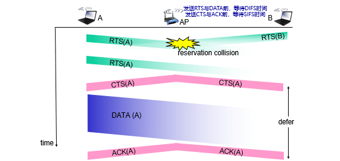

###### 地址字段

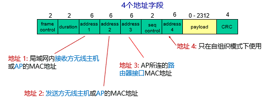

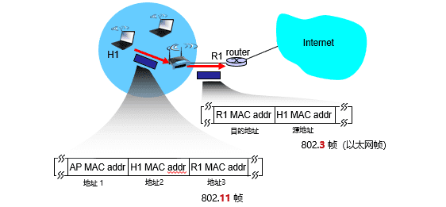

###### 其他字段

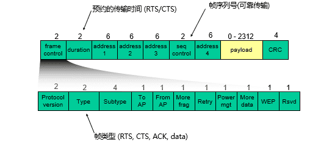

###### 同一子网下的移动

$\quad$ H1从基本服务集BBS 1移动到基本服务集BBS 2

$\quad$ BBS 1与BBS 2属于同一子网，其AP连到同一交换机不同端口

$\quad$ 移动后，H1仍在同一子网内，IP地址不变

$\quad$ 交换机：通过逆向学习，知道H1连向哪个端口

###### 802.11其他功能

$\quad$ 自适应传输速率

$\quad$ $\quad$ 根据无线主机的移动，信噪比SNR发生变化

$\quad$ $\quad$ 基站与无线主机都将动态调整传输速率

$\quad$ $\quad$ 通过改变物理层的调制技术

$\quad$ $\quad$ $\quad$ 1. 主机远离基站 -> SNR 降低 -> BER 上升

$\quad$ $\quad$ $\quad$ 2. 当BER超过一定阈值 -> 选择有更低传输速率但BER也更低的物理层方案

  

$\quad$ 功率管理：无线主机在睡眠/唤醒两种状态间切换，睡眠状态下节省能耗

$\quad$ $\quad$ 问题：睡眠状态下，AP无法向主机发送帧

$\quad$ $\quad$ 流程：

$\quad$ $\quad$ $\quad$ 主机 -> AP：通知将进入睡眠状态，直到下一个信标帧到来

$\quad$ $\quad$ $\quad$ $\quad$ 在802.11帧首部将功率管理比特置1

$\quad$ $\quad$ $\quad$$\quad$ 信标帧每隔100ms发送一次

$\quad$ $\quad$ $\quad$ AP：在下一个信标帧之前，不再给该主机发送帧，而是进行缓存

$\quad$ $\quad$ $\quad$ 信标帧：列出了有帧缓存的无线主机

$\quad$ $\quad$ $\quad$ $\quad$ 如果有帧缓存：主机进入唤醒状态，接收帧

$\quad$ $\quad$ $\quad$ $\quad$ 如果没有帧缓存：继续睡眠

$\quad$ $\quad$ $\quad$ $\quad$ 唤醒时间：250μs

### 802.15个人域无线网(蓝牙)

$\quad$ 传播直径小于10米

$\quad$ 取代一些有线设备

$\quad$ $\quad$ 鼠标、键盘、耳机

$\quad$ 自组织方式：没有基础设施

$\quad$ 主从模式（master-slave）

$\quad$ $\quad$ Slave节点请求发送权限

$\quad$ $\quad$ Master节点授权传输

$\quad$ 802.15：从蓝牙技术演化而来

$\quad$ $\quad$ 工作在2.4 GHz波段

$\quad$ $\quad$ 最高速度 721kbps

$\quad$ $\quad$ 信道访问控制：划分为长度625μs的时间片、79个频段

$\quad$ $\quad$ $\quad$ 每个时间片使用1个频段，并且以伪随机方式跳到下一个频段（跳频扩展频谱FHSS）

### 蜂窝网

$\quad$ 核心思想：

$\quad$ $\quad$ 通过移动电话网络，

$\quad$ $\quad$ 提供移动数据传输

$\quad$ 移动交换中心MSC

$\quad$ $\quad$ 将小区连接到有线网络

$\quad$ $\quad$ 管理呼叫建立

$\quad$ $\quad$ 处理移动性

$\quad$ 小区(cell)

$\quad$ $\quad$ 覆盖某个地理区域

$\quad$ $\quad$ 基站(base station, BS): 类似 802.11 AP

$\quad$ $\quad$ 移动用户通过基站连接到网络

###### 蜂窝网的第一跳

$\quad$ 空中接口（air interface）：将无线设备连接到基站

$\quad$ 2G：组合使用FDMA与TDMA

$\quad$ $\quad$ 将信道划分为频段

$\quad$ $\quad$ 每个频段划分为时间片

$\quad$ 3G：CDMA

$\quad$ $\quad$ W-CDMA（欧洲）

$\quad$ $\quad$ CDMA-2000（美国）

$\quad$ $\quad$ TD-SCDMA（中国）

$\quad$ 4G：正交频分复用

$\quad$ 5G：非正交频分复用 + MIMO

### 移动性

网络角度的移动性分类

: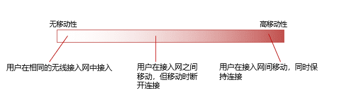

归属网络: 每个移动设备有个长期的归属网络，一般不更换（如：128.119.40/24）

归属代理: 归属网络中，代表移动设备执行移动性功能的实体

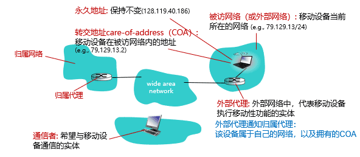

设备注册

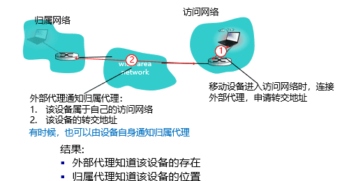

#### 移动设备如何通信

$\quad$ 通过代理解决：

$\quad$ $\quad$ 间接路由：通信者 ßà  归属代理 ßà 外部代理 ßà 移动设备

$\quad$ $\quad$ 直接路由：通信者 ßà 外部代理 ßà 移动设备

$\quad$ $\quad$ $\quad$ 通信者一开始仍需要通过归属代理，获取移动设备的转交地址

###### 间接路由

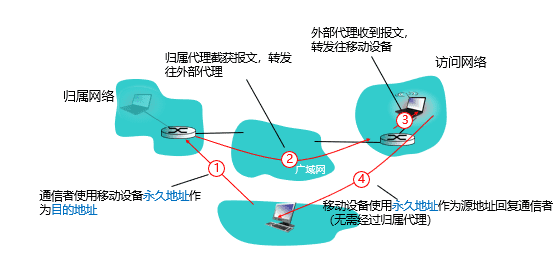

$\quad$ 当设备从一个访问网络移动到另一个访问网络

$\quad$ $\quad$ 在新访问网络进行注册

$\quad$ $\quad$ 新访问网络中的外部代理通知归属代理

$\quad$ $\quad$ 归属代理更新该设备的转交地址记录

$\quad$ $\quad$ 后续报文使用新转交地址发往该设备

$\quad$ 对于通信者而言，设备移动、访问网络改变、转交地址改变是透明的

$\quad$ $\quad$ 设备与通信者的连接仍然可以保持！

$\quad$ 移动设备使用2个地址

$\quad$ $\quad$ 永久地址：被通信者使用，因此对于通信者而言移动设备的位置是透明的

$\quad$ $\quad$ 转交地址：被归属代理使用，用于转发到访问网络

$\quad$ 三角路由问题：

$\quad$ $\quad$ 效率低下，特别当通信者与移动设备在同一访问网络时

###### 直接路由

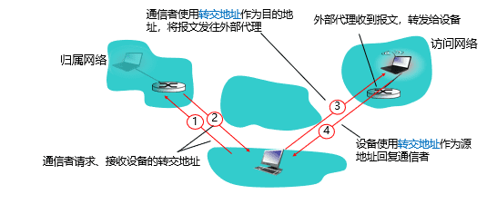

$\quad$ 解决了三角路由问题

$\quad$ 对通信者不透明：通信者必须从归属代理获取转交地址

$\quad$ $\quad$ 如果设备移动到其他访问网络？

$\quad$ 使用锚外部代理（anchor foreign agent）：第一个访问网络中的外部代理

$\quad$ 通信者数据始终发往锚外部代理，由锚外部代理转发到当前访问网络

$\quad$ 当设备到达新的访问网络时

$\quad$ $\quad$ 向新的外部代理注册（步骤3）

$\quad$ $\quad$ 新的外部代理向锚外部代理提供新的转交地址（步骤4）

#### 移动性管理

$\quad$ 移动IP：支持移动性的Internet体系架构与协议，RFC 5944

$\quad$ 多个已经学过的技术特征

$\quad$ $\quad$ 归属代理、外部代理、外部代理注册、转交地址、封装

$\quad$ 三部分组成

$\quad$ $\quad$ 报文间接路由

$\quad$ $\quad$ 代理发现

$\quad$ $\quad$ 代理注册

###### 移动ＩＰ下的简介路由

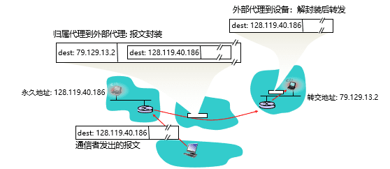

###### 移动IP下的代理发现

$\quad$ 代理通告 – 外部代理/归属代理通过广播ICMP报告（typefield=9），通告代理服务的存在

$\quad$ 代理请求 – 设备发送代理请求报文（ICMP typefiled=10），然后代理广播通告

$\quad$ 随后进行注册请求、注册回复

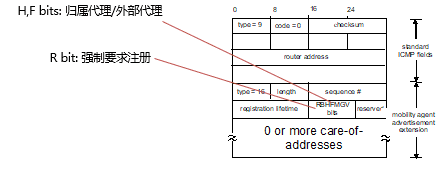

###### 移动IP下的代理注册

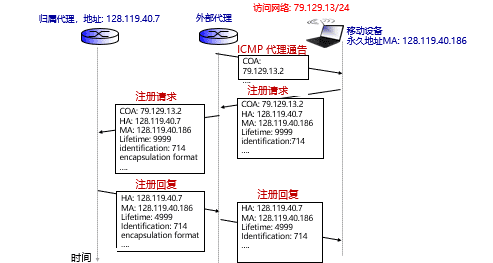

##### 蜂窝网的移动性管理

$\quad$ 归属网络：设备订购服务的网络（如：中国移动、中国联通、中国电信）

$\quad$ $\quad$ 归属位置注册器（HLR）：一个数据库，记录了用户当前位置、电话号码以及各类用户信息（订阅服务、账单、使用偏好）

$\quad$ $\quad$ 归属MSC：即之前提到的网关MSC

$\quad$ $\quad$ 归属MSC + 归属HLR = 归属代理

$\quad$ 被访网络：用户设备当前所处网络

$\quad$ $\quad$ 访问者位置注册（VLR）：一个数据库，记录访问者信息

$\quad$ $\quad$ VLR + 被访网络的MSC = 外部代理

$\quad$ $\quad$ 被访网络有时与归属网络是同一网络

###### 间接路由

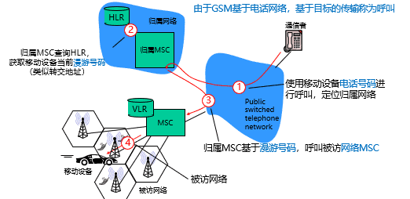

###### 切换

同一MSC，不同基站

$\quad$ 切换：将呼叫路径从一个基站转移到另一个基站

$\quad$ 原因： GSM没有规定切换策略（即何时切换），只规定切换机制（即如何切换）

$\quad$ $\quad$ 新基站信号更强

$\quad$ $\quad$ 负载均衡：释放旧基站的信道（GSM采用组合FDM/TDM）

$\quad$ 切换由旧基站发起

$\quad$ 1.旧基站通知被访MSC即将发起切换，并提供包含至少1个新基站的列表

$\quad$ 2.MSC选择新基站，设置到新基站的路径，分配相应路由资源，通知新基站

$\quad$ 3.新基站分配无线信道给该设备

$\quad$ 4.新基站通知MSC与旧基站，并提供与设备的关联信息

$\quad$ 5.旧基站告诉无线设备，即将进行切换

$\quad$ 6.移动设备与新基站交换信息，激活信道

$\quad$ 7.移动用户通知新基站与MSC，完成激活。MSC中后续呼叫讲路由到新基站

$\quad$ 8.MSC通知旧基站释放资源

MSC之间

$\quad$ 锚MSC：第一个被访网络中的MSC

$\quad$ $\quad$ 后续呼叫都经过锚MSC

$\quad$ 设备向新MSC注册时，新MSC通知锚MSC设备位置信息

###### LTE（4G）中的移动性管理

$\quad$ GSM：电话网络中，设备始终处于激活状态

$\quad$ 4G：设备可能处于休眠状态

$\quad$ $\quad$ 休眠状态下，从一个基站移动到另一个基站，网络无法获知位置移动

$\quad$ 解决方案：寻呼（paging），基站定期广播报文，确认设备仍然存在

$\quad$ 切换过程：与2G、3G类似

$\quad$ $\quad$ 新基站与MSC准备

$\quad$ $\quad$ 执行切换

$\quad$ $\quad$ 完成切换

  
  
  

---