# 计算机网络

## 链路层-有线局域网

### 局域网

$\quad$ 网络层的子网概念：有相同网络地址的接口组成的网络

$\quad$ 局域网：不需要网络层技术，就可以传输数据的网络

$\quad$ 虽然定义不同，但实际上，局域网 = 子网

###### MAC地址

$\quad$ IP地址：每个网络接口在网络层的标识

$\quad$ $\quad$ 用途：网络层转发功能

$\quad$ $\quad$ 可以修改（静态分配或者DHCP动态分配）

$\quad$ $\quad$ IPv4:32位，IPv6:128位

$\quad$ MAC地址（局域网地址或物理地址）：

$\quad$ $\quad$ 功能：物理上相连的网络接口之间收发帧

$\quad$ $\quad$ 大部分不可修改：烧录在网络接口控制器（NIC）硬件上

$\quad$ $\quad$ 48位：例如1A-2F-BB-76-09-AD

$\quad$ MAC地址由IEEE分配

$\quad$ $\quad$ 各个网络设备厂商从IEEE购买到特定MAC地址前缀

$\quad$ $\quad$ 厂商保证所有设备MAC地址不同

$\quad$ 类比：

$\quad$ $\quad$ MAC地址: 身份证号

$\quad$ $\quad$ IP地址: 通信地址

$\quad$ MAC地址：扁平化 ➜ 可移植

$\quad$ $\quad$ 可以将一块网卡从一个网络搬到另一个网络

$\quad$ IP地址：层次化 ➜ 不可移植

$\quad$ $\quad$ 地址与所属网络有关

$\quad$ IP地址与MAC地址的映射关系，通过ARP协议得到（参考网络层协议部分讲义）

$\quad$ $\quad$ ARP只在一个局域网内部工作

### 以太网

$\quad$ 当前最主流的有线局域网技术

$\quad$ 也是第一个广泛使用的有线局域网技术

$\quad$ 主要特点：简单、成本低廉、易于扩展、高速

###### 以太网帧

$\quad$ Preamble（前同步码）：8个字节

$\quad$ $\quad$ 前7个字节值均为10101010：用于同步发送方与接收方的时钟频率

$\quad$ $\quad$ $\quad$ 以太网有多种频率：10Mbps、100Mbps、1Gbps、10Gbps

$\quad$ $\quad$ $\quad$ 频率可能会发生偏移

$\quad$ $\quad$ 第8个字节值为10101011：真正的定界符（字节填充的定界符）

$\quad$ 物理层交付链路层时，8字节的前同步码不需要保留，也不计入帧头长度

$\quad$ 目的地址、源地址：各6字节

$\quad$ $\quad$ 当目的地址与自身地址相同，或者目的地址为一个广播地址，才将帧的data交付给网络层

$\quad$ $\quad$ 否则，丢弃帧

$\quad$ $\quad$ 特殊情况：网卡开启混杂模式，可以接收目的MAC地址不是本网络接口的帧

$\quad$ $\quad$ $\quad$ 用途：Hacker、网络分析

$\quad$ 类型：2字节，上层（网络层）的报文类型

$\quad$ $\quad$ 大部分情况下为0x0800，表示网络层为IP协议

$\quad$ $\quad$ 也可以有其他取值

$\quad$ CRC：接收方用于校验

$\quad$ $\quad$ 使用CRC32计算除了校验和以外的其他字段

$\quad$ $\quad$ 对于检查出的无效 MAC 帧就简单地丢弃。以太网不负责重传丢弃的帧。

$\quad$ $\quad$ $\quad$ 数据字段的长度与长度字段的值不一致；

$\quad$ $\quad$ $\quad$ 帧的长度不是整数个字节；

$\quad$ $\quad$ $\quad$ CRC检验出错；

$\quad$ $\quad$ $\quad$ 数据字段的长度不在 46 ~ 1500 字节之间。

$\quad$ 数据字段

$\quad$ $\quad$ 46 ~ 1500字节

$\quad$ $\quad$ 最小帧长 = 46+18 = 64B

$\quad$ $\quad$ 最大帧长 = 1500+18 = 1518B （MTU：1500B）

$\quad$ 数据字段不足46字节，需要填充整数字节（Padding）至46字节，以保证以太网MAC帧不小于64字节。

$\quad$ 以太网规定最短有效帧长为 64 字节，凡长度小于 64 字节的帧都是由于冲突而异常中止的无效帧。

$\quad$ $\quad$ 如果发生冲突，就一定是在发送的前 64 字节之内

$\quad$ $\quad$ 由于一检测到冲突就立即中止发送，这时已经发送出去的数据一定小于 64 字节

###### 以太网提供的服务

$\quad$ 无连接：两个NICs之间无需建立连接即可通信

$\quad$ 不可靠：接收方不发送ACK或者NACK

$\quad$ $\quad$ 接收方CRC校验失败或者目的地址不符合都直接丢弃数据，并且不通知发送方

$\quad$ $\quad$ 依赖上层协议（如TCP）进行丢失数据恢复

$\quad$ 多路访问控制：CSMA/CD

$\quad$ $\quad$ 回退时，基于二进制回退决定随机等待时间

###### 以太网标准

$\quad$ 以太网标准是一系列标准的集合

$\quad$ $\quad$ 包含物理层标准与数据链路层标准

$\quad$ $\quad$ 不同速率：2 Mbps, 10 Mbps, 100 Mbps, 1Gbps, 10 Gbps, 40 Gbps

$\quad$ $\quad$ 不同物理介质：光纤、铜线

$\quad$ 所有标准，都采用相同的帧格式

### 数据链路层交换

###### 组建以太网：集线器

$\quad$ 早期：使用集线器（HUB）组建以太网

$\quad$ $\quad$ Hub所有端口内部都是连通的

$\quad$ $\quad$ 使同一根总线

$\quad$ Hub的缺点

$\quad$ $\quad$ 集线器不能增加容量

$\quad$ $\quad$ 用集线器组成更大的局域网都在一个冲突域中

$\quad$ $\quad$ Hub级连：限制了网络的可扩展性

###### 组建以太网：交换机

$\quad$ 数据链路层设备扩充网络

$\quad$ $\quad$ 交换机（又称网桥）

$\quad$ $\quad$ 分隔了冲突域

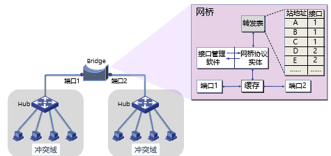

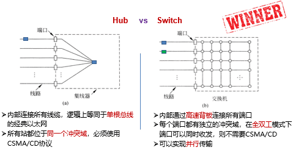

##### 数据链路层交换原理

$\quad$ 现代数据链路层的核心是交换机（Switch）

$\quad$ $\quad$ 早期又被称为网桥

$\quad$ $\quad$ 工作在数据链路层，检查MAC 帧的目的地址对收到的帧进行转发

$\quad$ $\quad$ 交换机通过高速背板把帧传送到目标端口

$\quad$ 理想的交换机是透明的

$\quad$ $\quad$ 即插即用，无需任何配置

$\quad$ $\quad$ 网络中的站点无需感知交换机的存在与否

  

$\quad$ 逆向学习：构建MAC地址表

$\quad$ $\quad$ 根据帧的源地址在MAC地址表查找匹配表项，

$\quad$ $\quad$ $\quad$ 如果没有，则增加一个新表项（源地址、入境端口、帧到达时间），

$\quad$ $\quad$ $\quad$ 如果有，则更新原表项的帧到达时间，重置老化时间。

$\quad$ 对入境帧的转发过程：使用MAC地址表

$\quad$ $\quad$ 查帧的目的地址是否在MAC地址表中

$\quad$ $\quad$ $\quad$ 如果有，且入境端口≠出境端口，则从对应的出境端口转发帧；

$\quad$ $\quad$ $\quad$ 如果有，且入境端口=出境端口，则丢弃帧（即过滤帧）；

$\quad$ $\quad$ $\quad$ 如果没有，则向除入境端口以外的其它所有端口泛洪帧。

###### 逆向学习

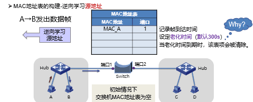

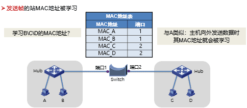

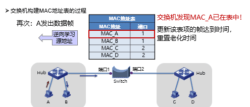

$\quad$ MAC地址表的构建

$\quad$ $\quad$ 增加表项：帧的源地址对应的项不在表中

$\quad$ $\quad$ 删除表项：老化时间到期

$\quad$ $\quad$ 更新表项：帧的源地址在表中，更新时间戳

###### 处理数据帧

交换机对于入境帧的处理分3种情况：（forwarding、filtering、flooding）

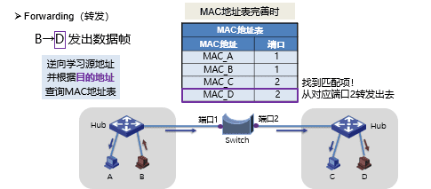

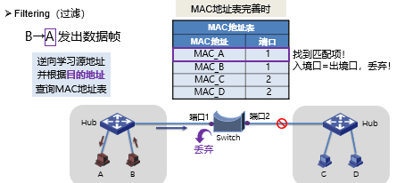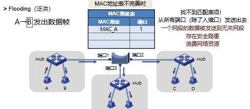

$\quad$ Flooding（泛洪）

$\quad$ $\quad$ 两种目的地址的帧，需要泛洪：

$\quad$ $\quad$ 广播帧：目的地址为FF-FF-FF-FF-FF-FF的数据帧

$\quad$ $\quad$ 未知单播帧：目的地址不在MAC地址转发表中的单播数据帧

  

##### 交换模式

  

###### 1)  存储转发模式（Store and Forward）

$\quad$ 特点：转发前必须接收整个帧、执行CRC校验

$\quad$ 缺点：延迟大

$\quad$ 优点：不转发出错帧

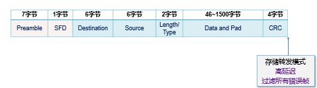

###### 2）直通模式（Cut-through）

$\quad$ 特点：一旦接收到帧的目的地址，就开始转发

$\quad$ 缺点：可能转发错误帧

$\quad$ 优点：延迟非常小，可以边入边出

  

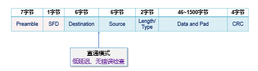

###### 3)  无碎片模式（Fragment-free）

$\quad$ 特点：接收到帧的前64字节，即开始转发

$\quad$ 缺点：仍可能转发错误帧

$\quad$ 优点：过滤了冲突碎片，延迟和转发错帧介于存储转发和直通交换之间

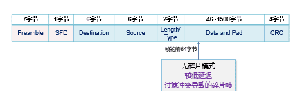

##### 使用方式

$\quad$ 传统LAN分段

$\quad$ $\quad$ 交换机端口通常与集线器连接；

$\quad$ $\quad$ 使用交换机把LAN分段为更小的冲突域。

$\quad$ 现代LAN分段

$\quad$ $\quad$ 直连PC，微分段，创建无冲突域

### 虚拟局域网

$\quad$ 交换机上连接多组用户

$\quad$ 问题1：为每一组用户建立各自局域网，但不添置新交换机

$\quad$ 问题2：为每一组用户建立各自广播域

$\quad$ $\quad$ ARP，DHCP，未知MAC地址都会产生广播

$\quad$ $\quad$ 安全/隐私要求

$\quad$ $\quad$ 性能要求

$\quad$ 可以通过配置交换机，在一套物理交换机设备上，运行多个虚拟局域网（VLAN）

$\quad$ $\quad$ 每个虚拟局域网，有一个单独的广播域

$\quad$ 虚拟局域网的类型

$\quad$ $\quad$ 基于端口的VLAN（最常见）

$\quad$ $\quad$ 基于MAC地址的VLAN

$\quad$ $\quad$ 基于协议的VLAN

$\quad$ $\quad$ 基于子网的VLAN

###### 类型1 :基于端口

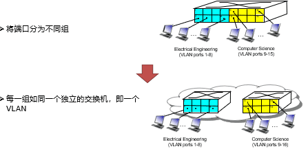

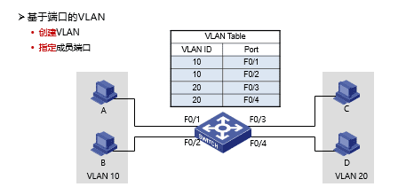

$\quad$ 好处：

$\quad$ $\quad$ 好处1 – 流量隔离：发往/来自端口1-8 的帧，最终只能到达端口1-8

$\quad$ $\quad$ 好处2 – 动态配置：可以动态变更端口属于哪个VLAN

$\quad$ $\quad$ VLAN之间的数据传输: 通过网络层路由 (如同2个独立局域网之间)

$\quad$ $\quad$ $\quad$ 现代路由器/交换机同时支持链路层与网络层传输

###### 类型2：基于MAC地址

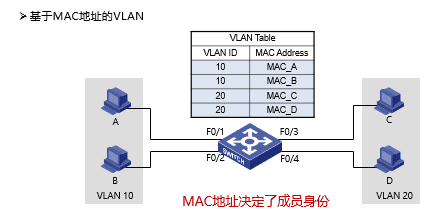

###### 类型3：基于协议

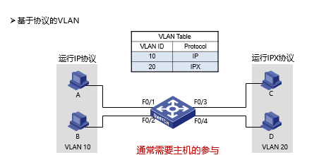

###### 类型4：基于子网

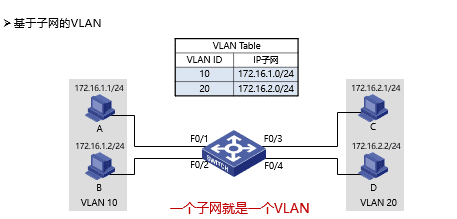

##### 跨多交换机的虚拟局域网

$\quad$ trunk port: 在帧头部添加额外标签，识别所属的VLAN（802.1Q协议）

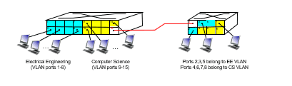

###### 802.1Q协议

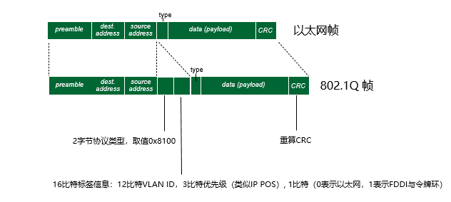

###### VLAN优点

$\quad$ 有效控制广播域范围

$\quad$ $\quad$ 广播流量被限制在一个VLAN内；

$\quad$ 增强网络的安全性

$\quad$ $\quad$ VLAN间相互隔离,无法进行二层通信,不同VLAN需通过三层设备通信；

$\quad$ 灵活构建虚拟工作组

$\quad$ $\quad$ 同一工作组的用户不必局限于同一物理范围；

$\quad$ 提高网络的可管理性

$\quad$ $\quad$ 将不同的业务规划到不同VLAN便于管理。

### 生成树

$\quad$ 防止故障：冗余拓扑

$\quad$ 付出的代价：导致物理环路

###### 物理环路引发的问题

1：广播风暴

$\quad$ 交换机（网桥）在物理环路上无休止地泛洪广播流量，无限循环，迅速消耗网络资源。

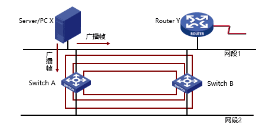

2：重复帧

$\quad$ X发送到环路的单播帧，造成目的设备Y收到重复的帧。

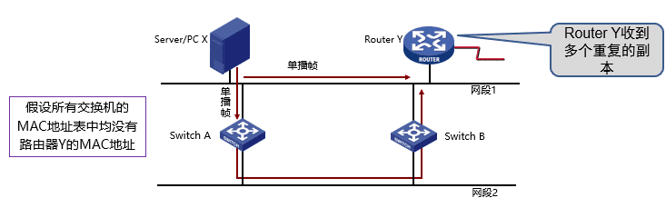

3：MAC地址表不稳定

$\quad$ 当一个帧的多个副本到达不同端口时，交换机会不断修改同一MAC地址对应的端口。

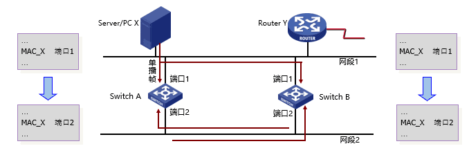

#### 生成树协议

$\quad$ 怎么得到一棵无环的生成树呢？

$\quad$ $\quad$ 参与的交换机（网桥）：通过BPDU（Bridge Protocol Data Unit）消息

$\quad$ $\quad$ 选举产生根桥、根端口、指定端口，形成生成树

  

###### 桥协议数据单元BPDU

$\quad$ $\quad$ 根桥ID（Root ID）: 被选为根的桥ID。

$\quad$ $\quad$ $\quad$ 桥ID共8字节，由2字节的优先级和6字节的MAC地址组成的

$\quad$ $\quad$ 根路径开销（Root Path Cost）: 到根桥的最小路径开销

$\quad$ $\quad$ 指定桥ID（Designated Bridge ID）: 发送BPDU的桥ID

$\quad$ $\quad$ 指定端口ID（Designated Port ID）: 发送BPDU的端口ID

##### 生成树的三个选举步骤

$\quad$ (1) 选举根桥(Root Bridge) 。

$\quad$ (2) 为每个非根桥选出一个根端口（Root Port）。

$\quad$ (3) 为每个网段确定一个指定端口（Designated Port）

###### 选举根桥

$\quad$ 同一广播域中的所有交换机均参与选举；

$\quad$ 桥ID最小的交换机（网桥）成为生成树的根；

$\quad$ 在给定广播域内只有一个根桥，其它均为非根桥。

$\quad$ 根桥的所有端口都处在转发状态。（可以接收和发送数据帧）

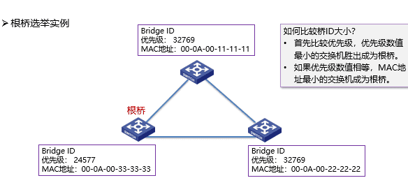

###### 为每个非根桥选出一个根端口

$\quad$ 每个非根桥，通过比较其每个端口到根桥的根路径开销，选出根端口；

$\quad$ 具有最小根路径开销的端口被选作根端口；

$\quad$ 如果多个端口的根路径开销相同，则端口ID最小的端口被选作根端口；

$\quad$ 非根桥只能有一个根端口，根端口处于转发状态。

  

$\quad$ 什么是根路径开销？

$\quad$ $\quad$ 根桥：所有端口的根路径开销为0

$\quad$ $\quad$ 非根桥：一个端口的根路径开销为到该端口根桥的路径上所有链路开销之和

$\quad$ $\quad$ 一些品牌设备，端口开销值使用厂商私有标准

$\quad$ $\quad$ 链路开销值由IEEE定义（如下表），也可通过手工配置改变

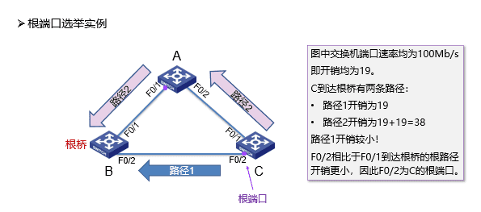

###### 为每个网段确定一个指定端口

$\quad$ 对于每一个网段， 在所有连接到它的交换机（网桥）端口中进行选择；

$\quad$ 一个具有最小根路径开销的端口，作为该网段的指定端口；

$\quad$ 指定端口处于转发状态，负责该网段的数据转发；

$\quad$ 连接该网段的其他端口，若既不是指定端口，也不是根端口，则阻塞。

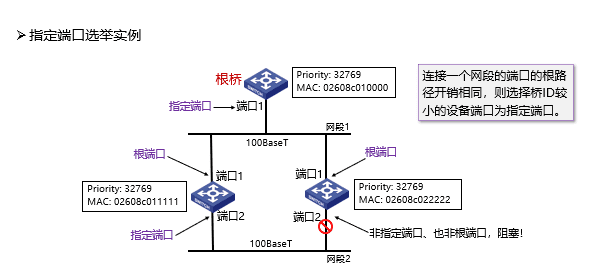

  

##### 端口状态

$\quad$ 经过上述构造生成树的三个过程，端口角色便确定了。

$\quad$ 事实上，802.1D标准给出了五种端口状态。

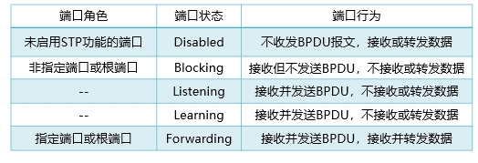

###### 端口状态的迁移

$\quad$ 端口角色确定为指定端口或根端口后，从Blocking状态经Listening和Learning才能到Forwarding状态；

$\quad$ 默认的Forwarding Delay时间是15秒，能保证当网络的拓扑发生改变时，新的配置信息能够传遍整个网络，从而避免由于网络为收敛而造成临时环路。

$\quad$ 由交换机（网桥）或链路故障导致网络拓扑改变时，重新构造生成树。

### 其他局域网技术

#### PPP

$\quad$ PPP (Point-to-Point Protocol)协议由IETF制定，1994年成为正式标准（RFC1661）

$\quad$ PPP协议广泛用于将用户接入运营商网络（Internet）

$\quad$ 能够在不同的链路上运行

$\quad$ 能够承载不同的网络层分组

$\quad$ 特点：简单、灵活、面向连接

$\quad$ 应用场景

$\quad$ $\quad$ 拥有LAN的单位，每个LAN都有一个或者多个路由器与外界联系，它们通过租用线路，连接到远程的路由器，这些路由器与租用线路构成子网

$\quad$ $\quad$ 个人用户的PC通过调制解调器呼叫Internet服务提供商的路由器，来实现与互联网的互连。用户终止会话之后，PC与路由器之间的链接也就终止

###### 实现的功能

$\quad$ 利用帧定界符封装成帧：字节填充、零比特填充

$\quad$ 帧的差错检测：

$\quad$ $\quad$ 接收方收到一个帧，就进行CRC检验，如CRC检验正确，就收下这个帧；反之，丢弃帧，其它什么也不做

$\quad$ 实时监测链路工作状态：正常 or 故障

$\quad$ 设置链路最大传输单元（MTU）

$\quad$ 网络层地址协商机制：两端互相告知网络层地址

$\quad$ 数据压缩协商机制

###### 未实现的功能

$\quad$ 帧数据的纠错功能

$\quad$ $\quad$ 数据链路层的PPP协议只进行检错，PPP协议是不可靠传输协议

$\quad$ 流量控制功能

$\quad$ $\quad$ PPP协议未实现点到点的流量控制

$\quad$ 可靠传输功能

$\quad$ $\quad$ PPP为不可靠协议，不使用帧的序号。不可靠网络中可能使用有序号的工作方式。

$\quad$ 多点连接功能

$\quad$ $\quad$ PPP协议不支持多点线路，只支持点对点的链路通信。

$\quad$ 单工和半双工链路

$\quad$ $\quad$ PPP协议只支持全双工链路

###### PPP协议的构成

$\quad$ 封装 (Encapsulation)

$\quad$ $\quad$ 提供在同一链路上支持不同的网络层协议

$\quad$ $\quad$ PPP既支持字节链路，也支持面向比特的比特链路

$\quad$ $\quad$ IP数据包在PPP帧中是其信息部分，其长度受到MTU的限制

$\quad$ 链路控制协议 LCP (Link Control Protocol)。

$\quad$ $\quad$ 用来建立、配置和测试数据链路的链路控制协议，通信双方可协商一些选项

$\quad$ 网络控制协议 NCP (Network Control Protocol)。

$\quad$ $\quad$ 针对不同的网络层协议（IP、OSI的网络层、DECnet、AppleTalk）提供配置

###### 工作状态转换

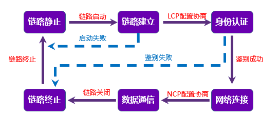

#### PPPoE

$\quad$ Ethernet优点

$\quad$ $\quad$ 原理简单，应用非常广，设备成本低

$\quad$ Ethernet缺点

$\quad$ $\quad$ 安全性较低、不宜管理：使用广播信道，造成了安全性较低，无认证功能

$\quad$ PPP优点

$\quad$ $\quad$ 原理简单

$\quad$ $\quad$ 安全性高：点对点信道，提供认证机制

$\quad$ $\quad$ 提供良好的访问控制和计费功能

$\quad$ PPPoE（Point-to-Point Protocol over Ethernet）

$\quad$ $\quad$ 提供在以太网链路上的PPP连接

$\quad$ $\quad$ 实现了传统以太网不能提供的身份验证、加密，以及压缩等功能

$\quad$ $\quad$ 实现基于用户的访问控制、计费、业务类型分类等，运营商广泛支持

$\quad$ $\quad$ PPPoE使用Client/Server模型，服务器通常是接入服务器

###### 组网方式1

$\quad$ 设备之间建立 PPP 会话，所有主机通过同一个 PPP 会话传送数据，主机上不用安装 PPPoE 客户端拨号软件，一般是一个机构共用一个账号

$\quad$ PPPoE Client 位于机构内

$\quad$ PPPoE Server 是运营商的设备

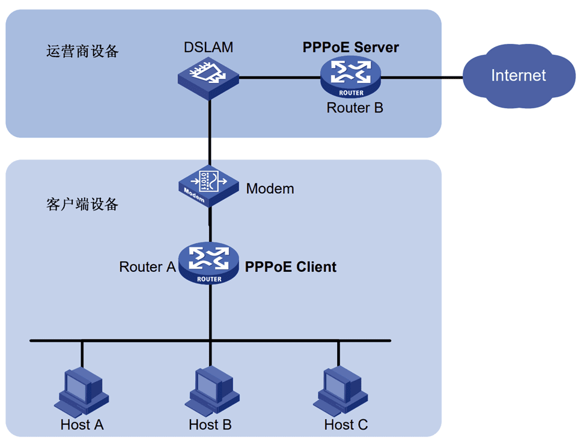

###### 组网方式2

$\quad$ PPP 会话建立在 主机和运营商的路由器之间，为每一个主机建立一个 PPP 会话，每个主机都是 PPPoE Client，每个主机有一个帐号，方便运营商对用户进行计费和控制

$\quad$ 主机上需要安装PPPoE 客户端软件

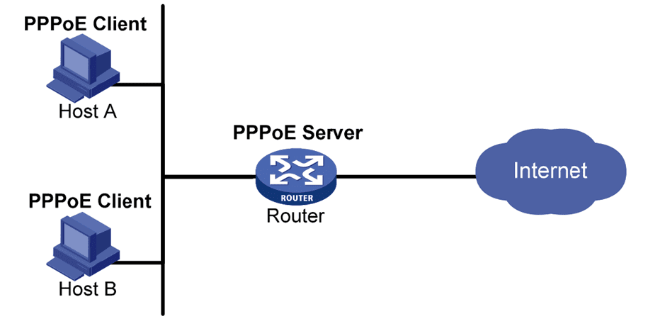

  
  
  

---